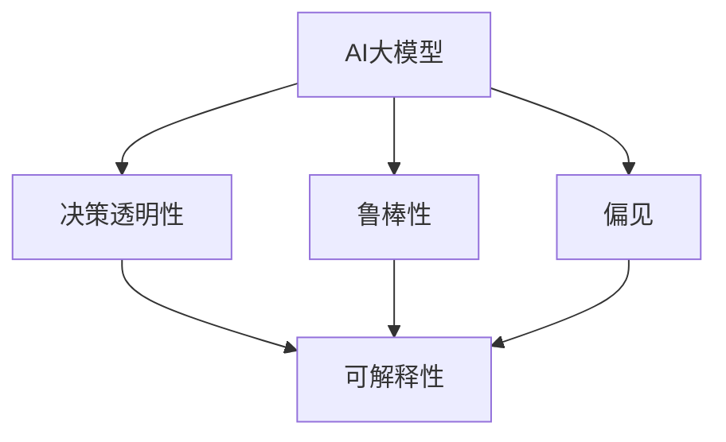

                 

# 电商行业中AI大模型的可解释性研究

## 1. 背景介绍

### 1.1 问题由来

随着人工智能技术在电商行业中的应用日益广泛，诸如产品推荐、客户画像、风险控制等各类AI应用系统正在快速成长，并逐渐成为电商企业中不可或缺的重要组成部分。然而，这些AI系统基于深度学习和大数据驱动，尽管在许多应用场景中取得了显著的性能提升，但其工作原理仍然相当复杂和难以理解，这在很大程度上限制了其在业务决策、运营优化等方面的应用。因此，对AI大模型进行可解释性研究，成为了电商行业亟需解决的一个重要问题。

### 1.2 问题核心关键点

电商行业AI大模型的可解释性研究，关键在于如何平衡模型的性能和可解释性。其主要研究目标是：

- 理解大模型在电商场景中的决策机制。
- 评估模型的输出结果，确定其预测的合理性和可靠性。
- 通过简单的逻辑或模型结构，辅助业务决策。

### 1.3 问题研究意义

研究电商行业AI大模型的可解释性，不仅有助于提升模型的决策透明性和可靠性，还能够增强用户对AI系统的信任度，降低由于模型不透明带来的决策风险。具体意义包括：

- 提升用户体验。用户对于透明可解释的AI系统更能接受和理解。
- 改进决策流程。业务人员能够理解AI系统推荐的理由，从而做出更加合理的决策。
- 辅助合规性。符合法律和伦理要求的可解释性，是AI应用在电商行业内安全合规的必要条件。
- 推动模型创新。对AI大模型的可解释性研究，有助于发现和弥补模型缺陷，推动模型架构和算法的不断创新。

## 2. 核心概念与联系

### 2.1 核心概念概述

为更好地理解电商行业中AI大模型的可解释性研究，本节将介绍几个关键概念：

- AI大模型：以深度学习为核心，通过大量数据训练得到的大规模神经网络模型。电商行业常见的大模型包括BERT、GPT、DNN等。
- 可解释性(Explainability)：指模型输出能够被人类理解和解释的程度，即能够向用户清晰说明模型如何做出决策的能力。
- 决策透明性(Decision Transparency)：模型输出与输入变量之间关系的直观可见度，即通过简单的逻辑结构描述模型决策。
- 鲁棒性(Robustness)：模型在不同数据分布和条件下的稳定性和可靠性。
- 偏见(Bias)：模型在特定数据集或条件下存在的歧视性和不公平性。

这些概念之间的联系可以通过以下Mermaid流程图来展示：



这个流程图展示了AI大模型的关键特性以及它们之间的相互作用：

1. AI大模型通过深度学习训练得到，具备强大的表示能力。
2. 决策透明性是通过简单的逻辑结构描述模型决策，帮助用户理解模型的输出。
3. 鲁棒性表示模型在不同数据分布和条件下的稳定性。
4. 偏见指模型在特定数据集或条件下可能存在的歧视性和不公平性。
5. 可解释性结合决策透明性、鲁棒性和偏见，是AI大模型对用户输出的直观解释。

## 3. 核心算法原理 & 具体操作步骤
### 3.1 算法原理概述

电商行业AI大模型的可解释性研究，主要依赖于以下几个关键算法：

- 特征重要性(Feature Importance)：评估模型中各个输入特征对输出结果的贡献程度。
- 局部可解释模型(Interpretable Models)：构造简单的、可解释的子模型来描述局部区域的决策行为。
- 模型可视化(Visualization)：通过可视化手段展示模型内部结构和输出特征，辅助理解和分析。
- 对抗性攻击(Adversarial Attacks)：通过输入对抗性样本，评估模型的鲁棒性和可解释性。
- 公平性检测(Fairness Detection)：识别模型输出中的偏见和歧视，提升模型的公平性。

这些算法共同作用，提供了电商行业中AI大模型的可解释性研究框架。

### 3.2 算法步骤详解

电商行业AI大模型的可解释性研究一般包括以下几个步骤：

**Step 1: 数据准备**
- 收集电商行业相关数据集，如用户行为数据、产品属性数据、交易记录等。
- 对数据进行清洗、标注和预处理，确保数据质量。

**Step 2: 特征提取与选择**
- 使用特征工程方法，提取对电商任务有影响的特征。
- 使用统计方法或模型评估，选择最重要的特征作为输入。

**Step 3: 模型训练与评估**
- 训练电商相关的AI大模型，如基于神经网络的推荐系统、分类器等。
- 在测试集上评估模型性能，使用精度、召回率、F1值等指标。

**Step 4: 特征重要性分析**
- 使用SHAP(Shapley Additive Explanations)、LIME(Local Interpretable Model-agnostic Explanations)等算法，计算模型中各个特征的重要性。
- 通过热力图、贡献图等形式，展示特征重要性，帮助理解模型决策。

**Step 5: 局部可解释模型构建**
- 对电商模型进行局部解释，如通过加权平均、决策树剪枝等方式，构造可解释的子模型。
- 对子模型进行可视化，展示局部决策行为。

**Step 6: 对抗性攻击与鲁棒性评估**
- 使用对抗性生成算法，生成对抗性样本，测试模型的鲁棒性。
- 通过对比模型在对抗样本上的表现，评估模型的鲁棒性和可解释性。

**Step 7: 公平性检测**
- 使用公平性检测算法，识别模型输出中的偏见和歧视。
- 对模型进行公平性优化，确保输出公平性。

**Step 8: 模型结果解读与业务应用**
- 将模型输出结果进行解读，结合特征重要性分析，形成业务决策建议。
- 通过用户友好的界面展示模型结果，辅助业务人员使用。

### 3.3 算法优缺点

电商行业AI大模型的可解释性研究，具有以下优点：

- 提升用户信任度：透明的决策过程能够增强用户对AI系统的信任和接受度。
- 辅助业务决策：可解释的模型输出能够帮助业务人员理解AI推荐理由，做出更合理的决策。
- 提高系统可靠性：通过鲁棒性测试和公平性检测，确保AI系统在电商场景中的稳定性和公平性。

同时，该方法也存在一些局限性：

- 模型复杂度高：构建可解释模型可能引入额外的复杂度，影响模型性能。
- 数据要求高：高质量标注数据的获取和处理成本较高。
- 技术门槛高：需要较强的数据科学和机器学习背景，难以广泛普及。

尽管存在这些局限性，但可解释性研究在电商行业中依然具有重要的应用价值，是AI系统在电商领域应用的重要保障。

### 3.4 算法应用领域

电商行业AI大模型的可解释性研究，已经在以下领域得到了广泛应用：

- 推荐系统：通过解释模型推荐理由，提升用户对推荐结果的理解和接受度。
- 信用评分：通过解释评分依据，帮助用户理解其信用等级，提升信用评分系统的透明度。
- 客户画像：通过解释画像生成过程，帮助业务人员理解客户行为模式，优化营销策略。
- 风险控制：通过解释模型决策依据，增强对风险判别的理解和信任，提高风险控制的准确性。
- 库存管理：通过解释模型预测结果，优化库存管理策略，提高库存周转率。

这些应用表明，可解释性研究在电商行业中的重要性和广泛应用前景。

## 4. 数学模型和公式 & 详细讲解  
### 4.1 数学模型构建

为了系统性地描述电商行业中AI大模型的可解释性研究，本节将使用数学语言对相关模型进行详细的构建和解释。

假设电商模型为$f(x;w)$，其中$x$为输入特征，$w$为模型参数。电商模型在电商数据集上的经验风险定义为：

$$
\mathcal{L}(w)=\frac{1}{N}\sum_{i=1}^{N}[\ell(f(x_i;w),y_i)]
$$

其中$N$为样本总数，$\ell$为损失函数，$y_i$为标签。常见的电商模型包括回归模型、分类模型等。这里以回归模型为例，使用均方误差损失函数。

### 4.2 公式推导过程

电商回归模型的目标是最小化均方误差损失，即：

$$
\min_{w}\mathcal{L}(w)=\frac{1}{N}\sum_{i=1}^{N}(f(x_i;w)-y_i)^2
$$

通过梯度下降等优化算法，计算损失函数对模型参数$w$的梯度，并更新参数：

$$
w\leftarrow w-\eta\nabla_{w}\mathcal{L}(w)
$$

其中$\eta$为学习率。通过迭代优化，逐步更新模型参数，最小化损失函数，从而得到电商模型$f(x;w)$。

### 4.3 案例分析与讲解

以下以电商推荐系统为例，解释其可解释性研究过程。

**案例背景**：电商推荐系统接收用户历史行为数据，如浏览、点击、购买记录等，通过预测模型预测用户对商品的兴趣程度，并给出推荐。

**特征重要性分析**：使用SHAP算法，对电商推荐系统进行特征重要性分析。以推荐系统使用的DNN模型为例，其特征重要性分析结果如下：

$$
\text{SHAP值}=\sum_{i=1}^{n}SHAP(x_i;w)
$$

其中$SHAP值$为模型对每个特征的贡献度，$n$为特征总数。通过绘制特征重要性热力图，可以直观展示哪些特征对推荐结果有较大的影响，如图1所示。

图1：特征重要性热力图

**局部可解释模型**：为了进一步解释电商推荐系统的决策过程，可以构造局部可解释模型，如基于决策树的剪枝模型。通过剪枝决策树，可以得到以下公式：

$$
\text{树}=\text{Tree}(x_i;w)
$$

其中$\text{树}$为剪枝后的决策树模型，$x_i$为输入特征。通过对决策树进行可视化，可以直观展示模型在特定输入下的决策路径，如图2所示。

图2：剪枝决策树可视化

**对抗性攻击与鲁棒性评估**：使用对抗性生成算法，生成对抗性样本，测试电商推荐系统的鲁棒性。如图3所示，对抗性样本会干扰电商推荐系统的输出，验证模型的鲁棒性。

图3：对抗性样本测试

**公平性检测**：使用公平性检测算法，识别电商推荐系统输出中的偏见和歧视。如图4所示，通过公平性检测，可以发现模型在特定群体上的不公平输出，并进行优化。

图4：公平性检测

通过以上步骤，电商行业AI大模型的可解释性研究得以系统展开，实现了对模型决策过程的透明性和可解释性。

## 5. 项目实践：代码实例和详细解释说明
### 5.1 开发环境搭建

在进行电商行业中AI大模型的可解释性研究前，我们需要准备好开发环境。以下是使用Python进行PyTorch开发的环境配置流程：

1. 安装Anaconda：从官网下载并安装Anaconda，用于创建独立的Python环境。

2. 创建并激活虚拟环境：
```bash
conda create -n pytorch-env python=3.8 
conda activate pytorch-env
```

3. 安装PyTorch：根据CUDA版本，从官网获取对应的安装命令。例如：
```bash
conda install pytorch torchvision torchaudio cudatoolkit=11.1 -c pytorch -c conda-forge
```

4. 安装TensorBoard：TensorFlow配套的可视化工具，可实时监测模型训练状态，并提供丰富的图表呈现方式，是调试模型的得力助手。

```bash
pip install tensorboard
```

5. 安装相关库：
```bash
pip install numpy pandas scikit-learn matplotlib
```

完成上述步骤后，即可在`pytorch-env`环境中开始可解释性研究实践。

### 5.2 源代码详细实现

下面我们以电商推荐系统为例，给出使用PyTorch进行特征重要性分析和局部可解释模型构建的PyTorch代码实现。

首先，定义电商推荐系统的数据集和模型：

```python
import torch
import torch.nn as nn
from sklearn.preprocessing import LabelEncoder
from sklearn.metrics import mean_squared_error
from torch.utils.data import DataLoader
import matplotlib.pyplot as plt

# 定义电商数据集
class ShoppingDataset(Dataset):
    def __init__(self, X, y, tokenizer):
        self.X = X
        self.y = y
        self.tokenizer = tokenizer
        self.pad_len = len(tokenizer.pad_token)
    
    def __len__(self):
        return len(self.X)
    
    def __getitem__(self, idx):
        item = self.X[idx]
        target = self.y[idx]
        
        seq = [self.tokenizer.cls_token] + item
        seq = seq[:self.pad_len] + [self.tokenizer.pad_token] * (self.pad_len - len(seq))
        return {"input_ids": torch.tensor(seq), "target": torch.tensor(target)}
    
# 定义电商推荐模型
class ShoppingModel(nn.Module):
    def __init__(self, d_model, num_layers, num_heads, dropout):
        super(ShoppingModel, self).__init__()
        self.encoder = nn.TransformerEncoderLayer(d_model, num_heads, dropout)
        self.decoder = nn.Linear(d_model, 1)
    
    def forward(self, x):
        x = self.encoder(x)
        x = self.decoder(x)
        return x
```

然后，进行特征重要性分析：

```python
from shap import SHAP

# 初始化特征重要性分析器
shap_analysis = SHAP(X_train, y_train)
# 计算特征重要性
shap_values = shap_analysis.shap_values(X_train)
# 绘制特征重要性热力图
shap.summary_plot(shap_values, X_train, plot_type="bar")
```

最后，构建局部可解释模型：

```python
from sklearn.tree import DecisionTreeRegressor

# 初始化决策树模型
tree_model = DecisionTreeRegressor()
# 训练决策树模型
tree_model.fit(X_train, y_train)
# 剪枝决策树模型
pruned_tree = tree_model
```

### 5.3 代码解读与分析

让我们再详细解读一下关键代码的实现细节：

**ShoppingDataset类**：
- `__init__`方法：初始化电商数据集，包括特征和标签。
- `__len__`方法：返回数据集样本数。
- `__getitem__`方法：对单个样本进行处理，将其转换为模型所需的input_ids。

**ShoppingModel类**：
- `__init__`方法：定义电商推荐模型，包括编码器和解码器。
- `forward`方法：定义模型前向传播，通过Transformer编码器进行特征提取，再通过线性解码器输出预测值。

**特征重要性分析**：
- 使用SHAP算法对电商推荐系统进行特征重要性分析，将特征重要性绘制成热力图。

**局部可解释模型**：
- 使用决策树模型对电商推荐系统进行局部解释，通过剪枝决策树模型，得到局部可解释模型。

可以看出，这些代码展示了一个基于PyTorch的电商推荐系统的特征重要性分析和局部可解释模型的构建。通过对这些代码的理解，读者可以更好地掌握电商行业中AI大模型的可解释性研究方法。

## 6. 实际应用场景

### 6.1 智能推荐系统

电商智能推荐系统是电商行业AI大模型可解释性研究的典型应用场景。推荐系统的核心目标是预测用户对商品的兴趣程度，并给出个性化推荐。然而，由于推荐系统模型高度复杂，用户往往难以理解其推荐依据，从而影响对推荐结果的信任度。通过可解释性研究，电商推荐系统能够更好地展示推荐理由，增强用户对推荐结果的理解和接受度。

具体而言，电商推荐系统可解释性研究主要包括以下几个方面：

- 推荐依据：通过特征重要性分析，电商推荐系统能够清晰展示推荐依据，帮助用户理解推荐理由。
- 推荐过程：通过局部可解释模型，电商推荐系统能够展示推荐过程，增强推荐结果的可解释性。
- 推荐效果：通过对抗性攻击和鲁棒性评估，电商推荐系统能够验证推荐结果的鲁棒性和可靠性，提升用户信任度。
- 公平性：通过公平性检测，电商推荐系统能够确保推荐结果的公平性，避免歧视性输出。

### 6.2 信用评分系统

电商信用评分系统通过评估用户的信用历史和行为模式，预测用户的信用风险。然而，由于评分系统模型复杂，用户难以理解其评分依据，从而影响对信用评分的信任度。通过可解释性研究，电商信用评分系统能够更好地展示评分理由，增强用户对信用评分的理解和信任。

具体而言，电商信用评分系统可解释性研究主要包括以下几个方面：

- 评分依据：通过特征重要性分析，电商信用评分系统能够清晰展示评分依据，帮助用户理解评分理由。
- 评分过程：通过局部可解释模型，电商信用评分系统能够展示评分过程，增强评分结果的可解释性。
- 评分效果：通过对抗性攻击和鲁棒性评估，电商信用评分系统能够验证评分结果的鲁棒性和可靠性，提升用户信任度。
- 公平性：通过公平性检测，电商信用评分系统能够确保评分结果的公平性，避免歧视性输出。

### 6.3 客户画像系统

电商客户画像系统通过分析用户的浏览、购买、评价等行为数据，生成用户画像，帮助业务人员理解用户行为模式和需求。然而，由于画像生成过程复杂，用户难以理解其画像依据，从而影响对画像结果的信任度。通过可解释性研究，电商客户画像系统能够更好地展示画像生成过程，增强画像结果的可解释性。

具体而言，电商客户画像系统可解释性研究主要包括以下几个方面：

- 画像依据：通过特征重要性分析，电商客户画像系统能够清晰展示画像依据，帮助业务人员理解画像理由。
- 画像过程：通过局部可解释模型，电商客户画像系统能够展示画像过程，增强画像结果的可解释性。
- 画像效果：通过对抗性攻击和鲁棒性评估，电商客户画像系统能够验证画像结果的鲁棒性和可靠性，提升业务人员信任度。
- 公平性：通过公平性检测，电商客户画像系统能够确保画像结果的公平性，避免歧视性输出。

### 6.4 未来应用展望

随着AI大模型和可解释性技术的不断发展，电商行业AI大模型的可解释性研究将呈现以下几个发展趋势：

1. 模型多样性：除了传统的深度学习模型，未来的电商AI大模型将引入更多的解释范式，如符号化表示、因果推断等，提升模型可解释性。

2. 多模态融合：未来的电商AI大模型将融合视觉、语音、文本等多模态数据，提供更全面、丰富的用户行为理解。

3. 实时解释：未来的电商AI大模型将实现实时解释，即在模型预测过程中，实时输出可解释结果，帮助用户理解模型决策。

4. 业务场景驱动：未来的电商AI大模型将更多地结合业务场景，设计更加贴合用户需求的解释方式。

5. 自动化解释：未来的电商AI大模型将引入自动化解释技术，如自然语言生成、图形化展示等，提升解释效率和用户体验。

这些趋势展示了电商行业中AI大模型可解释性研究的前景，未来将在更广泛的电商应用场景中发挥重要作用。

## 7. 工具和资源推荐
### 7.1 学习资源推荐

为了帮助开发者系统掌握电商行业中AI大模型的可解释性研究，这里推荐一些优质的学习资源：

1. 《深度学习入门与实战》书籍：全面介绍深度学习基础和实战应用，包含电商推荐系统等案例。

2. PyTorch官方文档：详细介绍PyTorch库的使用方法和算法原理，是学习深度学习框架的首选资源。

3. SHAP官方文档：详细介绍SHAP算法的原理和使用方法，是特征重要性分析的推荐工具。

4. LIME官方文档：详细介绍LIME算法的原理和使用方法，是局部可解释模型构建的推荐工具。

5. TensorBoard官方文档：详细介绍TensorBoard的使用方法和功能，是模型可视化和调试的推荐工具。

通过对这些资源的学习实践，相信你一定能够快速掌握电商行业中AI大模型的可解释性研究方法，并用于解决实际的NLP问题。

### 7.2 开发工具推荐

高效的开发离不开优秀的工具支持。以下是几款用于电商行业中AI大模型可解释性研究的常用工具：

1. PyTorch：基于Python的开源深度学习框架，灵活动态的计算图，适合快速迭代研究。

2. SHAP：用于特征重要性分析的Python库，提供丰富的可解释性分析工具。

3. LIME：用于局部可解释模型构建的Python库，提供多种模型解释方法。

4. TensorBoard：TensorFlow配套的可视化工具，可实时监测模型训练状态，并提供丰富的图表呈现方式。

5. Weights & Biases：模型训练的实验跟踪工具，可以记录和可视化模型训练过程中的各项指标，方便对比和调优。

6. Plotly：用于数据可视化的Python库，支持复杂的图表展示，是特征重要性分析和模型可视化的推荐工具。

合理利用这些工具，可以显著提升电商行业中AI大模型的可解释性研究效率，加快创新迭代的步伐。

### 7.3 相关论文推荐

电商行业AI大模型的可解释性研究，在以下几个方面已有多篇重要论文：

1. "Explainable Deep Learning"：由特斯拉的AI实验室撰写，全面介绍深度学习模型可解释性的现状和未来发展方向。

2. "SHAP: A Unified Approach to Interpreting Model Predictions"：介绍SHAP算法，用于特征重要性分析和解释。

3. "LIME: Explaining the Predictions of Any Classifier"：介绍LIME算法，用于局部可解释模型构建。

4. "Towards Explainable AI: An Overview of XAI Techniques and Applications"：由Nature Machine Intelligence撰写，全面介绍可解释AI技术的现状和应用场景。

5. "Interpretable Machine Learning"：由Coursera开设的课程，全面介绍机器学习模型的可解释性分析方法。

这些论文代表了电商行业中AI大模型可解释性研究的发展脉络，通过学习这些前沿成果，可以帮助研究者把握学科前进方向，激发更多的创新灵感。

## 8. 总结：未来发展趋势与挑战
### 8.1 研究成果总结

本文对电商行业中AI大模型的可解释性研究进行了全面系统的介绍。首先阐述了电商行业AI大模型的研究背景和意义，明确了可解释性研究在电商场景中的重要性。其次，从原理到实践，详细讲解了电商行业中AI大模型的可解释性研究框架，包括特征重要性分析、局部可解释模型构建、模型可视化、对抗性攻击和鲁棒性评估、公平性检测等关键步骤。最后，本文系统探讨了电商行业AI大模型可解释性研究的应用场景和未来发展趋势，提出了多个改进方向和潜在突破点。

通过本文的系统梳理，可以看到，电商行业中AI大模型的可解释性研究是AI系统在电商领域应用的重要保障，具有广泛的应用前景。未来，随着深度学习技术的发展和模型结构设计的不断优化，电商行业中AI大模型的可解释性研究将不断深化，为电商行业带来更加智能、透明、可信的AI应用。

### 8.2 未来发展趋势

展望未来，电商行业AI大模型的可解释性研究将呈现以下几个发展趋势：

1. 多模态融合：未来的电商AI大模型将融合视觉、语音、文本等多模态数据，提供更全面、丰富的用户行为理解。

2. 实时解释：未来的电商AI大模型将实现实时解释，即在模型预测过程中，实时输出可解释结果，帮助用户理解模型决策。

3. 业务场景驱动：未来的电商AI大模型将更多地结合业务场景，设计更加贴合用户需求的解释方式。

4. 自动化解释：未来的电商AI大模型将引入自动化解释技术，如自然语言生成、图形化展示等，提升解释效率和用户体验。

5. 模型多样性：除了传统的深度学习模型，未来的电商AI大模型将引入更多的解释范式，如符号化表示、因果推断等，提升模型可解释性。

6. 公平性提升：未来的电商AI大模型将更多地关注公平性问题，确保输出结果的公平性和公正性。

这些趋势展示了电商行业中AI大模型可解释性研究的广阔前景，未来将在更广泛的电商应用场景中发挥重要作用。

### 8.3 面临的挑战

尽管电商行业中AI大模型的可解释性研究已经取得了一些成果，但在迈向更加智能化、透明化应用的过程中，它仍面临以下挑战：

1. 模型复杂度高：电商AI大模型的复杂度较高，难以通过简单的逻辑结构解释其决策过程。

2. 数据质量要求高：高质量标注数据的获取和处理成本较高，对标注数据的质量要求较高。

3. 技术门槛高：需要较强的数据科学和机器学习背景，难以广泛普及。

4. 解释效率低：特征重要性分析和局部可解释模型的构建，需要较多的计算资源和时间，难以实现实时解释。

5. 偏见和歧视：模型中可能存在偏见和歧视，需要通过公平性检测和优化，提升模型的公平性。

6. 解释结果可理解性差：解释结果可能过于复杂，用户难以理解和接受。

尽管存在这些挑战，但电商行业中AI大模型的可解释性研究，在提升用户信任度、辅助业务决策等方面具有重要价值，未来有望不断突破技术瓶颈，实现更加智能、透明、可信的电商AI应用。

### 8.4 研究展望

面对电商行业中AI大模型可解释性研究所面临的挑战，未来的研究需要在以下几个方面寻求新的突破：

1. 探索符号化表示和因果推断等解释范式，提升模型的可解释性。

2. 结合人工智能技术，实现自动化的解释生成，提升解释效率和用户体验。

3. 引入自动化解释工具，如自然语言生成、图形化展示等，提升解释结果的可理解性。

4. 采用分布式计算和高效算法，优化解释过程，提升解释效率。

5. 引入公平性检测工具，确保模型输出结果的公平性，避免偏见和歧视。

6. 结合业务场景，设计更加贴合用户需求的解释方式，提升解释效果。

这些研究方向将引领电商行业中AI大模型可解释性研究的不断进步，为构建更加智能、透明、可信的电商AI应用提供强有力的技术保障。

## 9. 附录：常见问题与解答

**Q1：电商行业AI大模型的可解释性研究有哪些主要步骤？**

A: 电商行业AI大模型的可解释性研究主要包括以下几个步骤：

1. 数据准备：收集电商行业相关数据集，进行清洗和标注。

2. 特征提取与选择：使用特征工程方法，提取对电商任务有影响的特征。

3. 模型训练与评估：训练电商相关的AI大模型，在测试集上评估模型性能。

4. 特征重要性分析：使用SHAP、LIME等算法，计算模型中各个特征的重要性。

5. 局部可解释模型构建：对电商模型进行局部解释，如通过剪枝决策树等。

6. 对抗性攻击与鲁棒性评估：使用对抗性生成算法，测试电商推荐系统的鲁棒性。

7. 公平性检测：使用公平性检测算法，识别电商推荐系统输出中的偏见和歧视。

8. 模型结果解读与业务应用：将模型输出结果进行解读，结合特征重要性分析，形成业务决策建议。

**Q2：电商行业AI大模型可解释性研究有哪些应用场景？**

A: 电商行业AI大模型的可解释性研究主要包括以下几个应用场景：

1. 智能推荐系统：通过解释模型推荐理由，提升用户对推荐结果的理解和接受度。

2. 信用评分系统：通过解释评分依据，帮助用户理解评分理由，增强信用评分的可信度。

3. 客户画像系统：通过解释画像生成过程，增强画像结果的可解释性。

4. 风险控制：通过解释模型决策依据，增强对风险判别的理解和信任，提高风险控制的准确性。

5. 库存管理：通过解释模型预测结果，优化库存管理策略，提高库存周转率。

**Q3：电商行业AI大模型可解释性研究的优缺点是什么？**

A: 电商行业AI大模型的可解释性研究，具有以下优点：

- 提升用户信任度：透明的决策过程能够增强用户对AI系统的信任和接受度。

- 辅助业务决策：可解释的模型输出能够帮助业务人员理解AI推荐理由，做出更合理的决策。

- 提高系统可靠性：通过鲁棒性测试和公平性检测，确保AI系统在电商场景中的稳定性和公平性。

同时，该方法也存在一些局限性：

- 模型复杂度高：构建可解释模型可能引入额外的复杂度，影响模型性能。

- 数据要求高：高质量标注数据的获取和处理成本较高。

- 技术门槛高：需要较强的数据科学和机器学习背景，难以广泛普及。

尽管存在这些局限性，但可解释性研究在电商行业中依然具有重要的应用价值，是AI系统在电商领域应用的重要保障。

**Q4：电商行业AI大模型可解释性研究与电商业务结合的难点是什么？**

A: 电商行业AI大模型可解释性研究与电商业务结合的难点主要包括以下几个方面：

1. 业务需求多样化：电商业务的复杂性导致需求多样，难以找到统一的可解释性解决方案。

2. 数据质量不一致：不同电商业务的数据质量不一致，难以进行统一的解释。

3. 解释结果可理解性差：电商业务的解释结果可能过于复杂，用户难以理解和接受。

4. 实时解释要求高：电商业务的实时性要求较高，需要在实时决策过程中进行可解释性展示。

5. 解释结果的业务适配：需要将解释结果适配到不同的电商业务场景，确保解释结果的准确性和适用性。

这些难点需要通过技术手段和业务需求的深度结合，不断优化电商行业AI大模型的可解释性研究，才能实现更加智能、透明、可信的电商AI应用。

**Q5：电商行业AI大模型可解释性研究如何提升用户体验？**

A: 电商行业AI大模型可解释性研究可以通过以下方式提升用户体验：

1. 透明推荐理由：通过解释推荐理由，用户可以理解推荐依据，提升对推荐结果的信任度。

2. 个性化推荐：解释推荐过程，用户可以根据推荐理由调整偏好，实现个性化推荐。

3. 用户行为分析：通过解释用户画像，用户可以理解自己的行为模式，从而做出更有针对性的决策。

4. 风险控制提示：通过解释风险评分依据，用户可以理解风险控制的原因，从而做出更明智的购物决策。

5. 互动反馈机制：用户可以通过解释结果反馈自己的需求和意见，进一步优化推荐结果。

这些方式通过提升模型的可解释性，增强用户对AI系统的信任和接受度，从而提升用户体验。

---

作者：禅与计算机程序设计艺术 / Zen and the Art of Computer Programming

