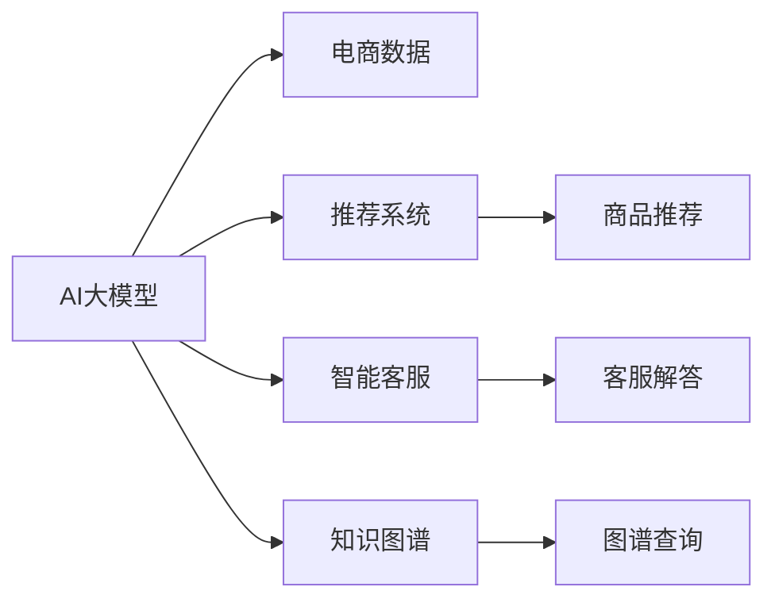

                 

# 电商行业中AI大模型的技术架构设计

## 1. 背景介绍

### 1.1 问题由来
在电商行业，借助人工智能技术，企业能够实现诸如商品推荐、库存管理、欺诈检测、智能客服等功能，大幅提升运营效率和用户体验。其中，AI大模型在电商应用中扮演着核心角色，不仅能够处理海量数据，还能应对电商领域的复杂性和多变性。本文将介绍AI大模型在电商行业中的技术架构设计。

## 2. 核心概念与联系

### 2.1 核心概念概述
为便于理解，我们首先介绍几个核心概念及其相互联系。

- **AI大模型**：基于深度学习架构的巨大预训练模型，如GPT、BERT、DALL·E等，具备强大的泛化能力和语言生成能力。
- **电商数据**：包括用户浏览数据、购买数据、评论数据等，是AI大模型训练的基础。
- **推荐系统**：根据用户历史行为和兴趣，为用户推荐商品。
- **知识图谱**：将商品、用户、评价等信息构建为图结构，便于AI模型进行查询和推理。
- **智能客服**：使用自然语言处理技术，解决用户咨询问题，提升客服效率。

这些概念通过数据、模型和任务适配层等核心技术环节紧密相连，共同构成了电商行业中的AI大模型应用架构。

### 2.2 核心概念原理和架构的 Mermaid 流程图


## 3. 核心算法原理 & 具体操作步骤
### 3.1 算法原理概述

AI大模型在电商领域的应用，主要集中在以下几个方面：

- **用户行为分析**：通过深度学习模型分析用户浏览和购买行为，挖掘用户兴趣和需求。
- **推荐系统构建**：构建高效的推荐算法，为不同用户推荐最匹配的商品。
- **智能客服**：利用自然语言处理技术，实现用户对话的自动响应和问题解决。
- **欺诈检测**：通过异常检测算法，识别并防止欺诈行为的发生。

### 3.2 算法步骤详解

**Step 1: 数据预处理**
1. **数据收集**：收集电商平台的交易数据、用户行为数据、评价数据等，进行存储和初步清洗。
2. **数据标注**：对于推荐和客服任务，需要标注数据进行监督学习。

**Step 2: 模型选择与训练**
1. **模型选择**：根据任务类型，选择适合的预训练模型，如使用BERT进行商品推荐，使用GPT进行智能客服。
2. **参数调整**：调整模型参数，如学习率、批大小、优化器等。
3. **微调**：在大规模电商数据集上进行微调，使模型更好地适应电商场景。

**Step 3: 模型评估与优化**
1. **评估指标**：根据推荐效果、客服响应准确率等指标，评估模型性能。
2. **模型优化**：针对评估结果，优化模型结构、调整超参数，提升模型效果。

**Step 4: 系统部署与迭代**
1. **模型部署**：将训练好的模型部署到电商平台上，实现实时推荐和客服功能。
2. **监控与优化**：持续监控系统性能，根据用户反馈和新的电商数据，进行模型迭代更新。

### 3.3 算法优缺点

AI大模型在电商领域应用的优点包括：

- **泛化能力强**：预训练大模型能够从海量数据中学习到通用语言规律，具备较强的泛化能力。
- **处理能力强大**：能够高效处理复杂电商数据，提升决策和推荐效率。
- **灵活性高**：模型可以在新的电商数据上快速微调，适应不同业务场景。

缺点如下：

- **计算资源需求高**：预训练和微调大模型需要大量计算资源，训练时间较长。
- **模型复杂度高**：大模型结构复杂，难以解释和调试。
- **数据依赖性强**：模型性能受数据质量和分布影响较大。

### 3.4 算法应用领域

AI大模型在电商领域的应用包括：

- **商品推荐**：利用用户行为数据，提供个性化推荐。
- **智能客服**：解答用户咨询，提升客服效率。
- **价格优化**：基于用户数据和市场趋势，调整商品价格。
- **库存管理**：根据历史销售数据，优化库存水平。
- **欺诈检测**：利用异常检测算法，防止欺诈行为。

## 4. 数学模型和公式 & 详细讲解 & 举例说明

### 4.1 数学模型构建

以推荐系统为例，假设用户行为数据为 $(x_i, y_i)$，其中 $x_i$ 为历史浏览和购买行为，$y_i$ 为推荐结果。推荐模型为 $M_{\theta}$，其中 $\theta$ 为模型参数。推荐任务可定义为：

$$
\mathcal{L}(\theta) = \frac{1}{N}\sum_{i=1}^N \ell(M_{\theta}(x_i),y_i)
$$

其中 $\ell$ 为损失函数，如均方误差、交叉熵等。

### 4.2 公式推导过程

对于推荐系统，常用的损失函数为均方误差（MSE）：

$$
\ell(M_{\theta}(x),y) = \frac{1}{2}\|M_{\theta}(x)-y\|^2
$$

其梯度公式为：

$$
\frac{\partial \ell}{\partial \theta} = (M_{\theta}(x)-y) \frac{\partial M_{\theta}(x)}{\partial \theta}
$$

其中 $\frac{\partial M_{\theta}(x)}{\partial \theta}$ 可通过反向传播计算。

### 4.3 案例分析与讲解

假设有一批商品推荐数据，通过以上公式，计算推荐模型的损失函数和梯度，更新模型参数，使其能够更好地匹配真实推荐结果。

## 5. 项目实践：代码实例和详细解释说明

### 5.1 开发环境搭建

开发环境搭建包括：

1. **环境配置**：安装Python、Pandas、TensorFlow等必要的开发工具。
2. **数据预处理**：清洗和标准化电商数据集。
3. **模型训练**：在标准化数据集上训练AI大模型。

### 5.2 源代码详细实现

以下是一个基于TensorFlow实现商品推荐的代码示例：

```python
import tensorflow as tf
import pandas as pd
from sklearn.model_selection import train_test_split
from transformers import BertTokenizer, BertForRegression

# 数据预处理
data = pd.read_csv('recommendation_data.csv')
data_train, data_test = train_test_split(data, test_size=0.2)
train_data = data_train[['user_browsed', 'item_price']].to_numpy()
train_labels = data_train['item_id'].to_numpy()
tokenizer = BertTokenizer.from_pretrained('bert-base-uncased')
train_encodings = tokenizer(train_data, truncation=True, padding=True)

# 模型构建
model = BertForRegression.from_pretrained('bert-base-uncased')
model.compile(optimizer=tf.keras.optimizers.Adam(learning_rate=1e-5), loss='mse')
model.summary()

# 模型训练
model.fit(train_encodings, train_labels, epochs=10, batch_size=16)
```

### 5.3 代码解读与分析

上述代码中，我们首先使用Pandas加载电商推荐数据集，并进行了数据预处理。接着，使用BertTokenizer对输入数据进行编码，并使用BertForRegression构建推荐模型。最后，通过编译和训练模型，完成推荐系统的搭建。

## 6. 实际应用场景

### 6.1 推荐系统

在推荐系统中，AI大模型可以通过分析用户历史行为和商品特征，提供个性化推荐。通过构建损失函数和梯度更新机制，不断优化模型，提升推荐准确率和个性化水平。

### 6.2 智能客服

智能客服系统利用AI大模型对用户提问进行语义理解，自动生成应答。通过微调和优化，提高系统响应速度和准确率。

### 6.3 欺诈检测

基于AI大模型的异常检测算法，通过分析交易行为和用户行为数据，识别潜在的欺诈行为，减少损失。

### 6.4 未来应用展望

未来，AI大模型在电商领域的应用将更加广泛，例如：

- **跨模态推荐**：将图像、语音等模态数据融合到推荐系统中，提升推荐效果。
- **实时监控**：利用AI大模型进行实时监控，动态调整推荐策略。
- **用户画像**：通过深度学习模型挖掘用户画像，实现精准营销。

## 7. 工具和资源推荐

### 7.1 学习资源推荐

1. **TensorFlow官方文档**：详细介绍了TensorFlow的安装和使用，提供大量实际案例。
2. **自然语言处理教程**：介绍自然语言处理的基本概念和常用算法。
3. **深度学习框架对比**：比较TensorFlow、PyTorch等框架，选择合适的工具。

### 7.2 开发工具推荐

1. **TensorFlow**：功能强大的深度学习框架，支持多种模型构建和训练。
2. **PyTorch**：灵活的深度学习框架，易于调试和优化。
3. **Pandas**：高效的数据处理工具，适合处理电商数据集。

### 7.3 相关论文推荐

1. **深度推荐系统**：介绍推荐系统的基本原理和算法。
2. **序列数据建模**：研究序列数据的建模方法，如循环神经网络。
3. **自然语言处理中的模型**：介绍NLP中的常用模型，如BERT、GPT。

## 8. 总结：未来发展趋势与挑战

### 8.1 研究成果总结

AI大模型在电商领域的应用取得了显著成效，提升了推荐系统、智能客服、欺诈检测等功能的性能。未来，通过不断优化模型架构和算法，AI大模型有望在电商行业实现更广泛的应用。

### 8.2 未来发展趋势

1. **模型规模增大**：随着计算资源的增加，大模型规模将持续增大，提升模型的泛化能力和性能。
2. **跨模态融合**：利用多模态数据提升推荐和客服系统的准确性和用户体验。
3. **实时监控优化**：实现实时监控和动态调整，提升电商平台的响应速度和稳定性。

### 8.3 面临的挑战

1. **计算资源成本高**：大模型训练和推理需要大量计算资源，成本较高。
2. **数据隐私问题**：电商数据涉及用户隐私，需要有效保护用户信息安全。
3. **模型复杂度高**：模型结构复杂，难以解释和调试。

### 8.4 研究展望

未来，需要解决计算资源成本高、数据隐私保护等问题，并研究如何通过模型优化和跨模态融合提升AI大模型的性能和应用范围。

## 9. 附录：常见问题与解答

**Q1：电商数据如何预处理？**

A: 电商数据预处理包括数据清洗、标准化、缺失值处理等。具体步骤如下：

1. **数据清洗**：去除无意义的数据，如空值、异常值。
2. **标准化**：将数据转化为标准格式，如统一日期格式。
3. **缺失值处理**：通过插值或删除等方法处理缺失值。

**Q2：AI大模型如何部署？**

A: AI大模型部署主要包括模型训练、推理引擎优化和应用集成。具体步骤如下：

1. **模型训练**：在电商数据集上训练AI大模型。
2. **推理引擎优化**：通过优化推理引擎，提高模型推理速度和效率。
3. **应用集成**：将训练好的模型集成到电商平台，实现实时推荐和客服等功能。

---

作者：禅与计算机程序设计艺术 / Zen and the Art of Computer Programming

