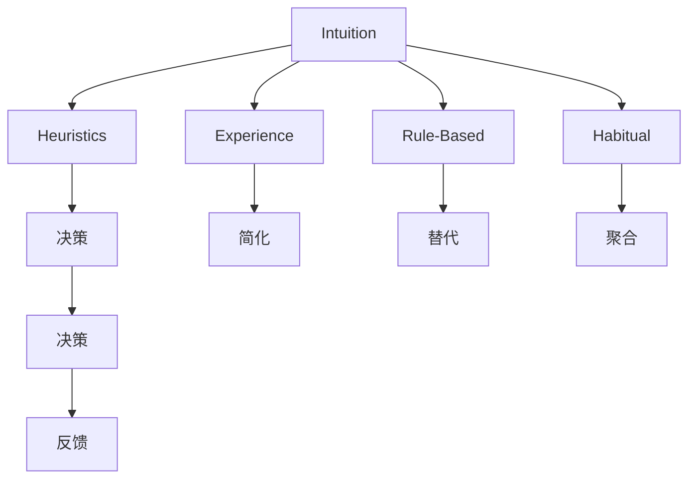
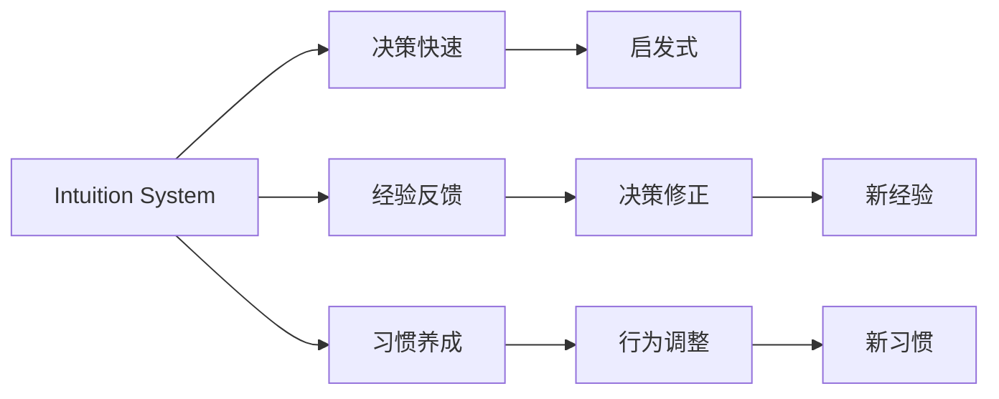

                 

## 1. 背景介绍

决策过程是人类智力和行为的核心之一，涉及到信息获取、知识处理和行动选择。在这过程中，我们往往同时依赖两种不同的认知系统：直觉(Subconscious Process)和分析(Conscious Process)。直觉系统基于经验、习惯和本能，快速响应外部刺激，高效处理简单任务；而分析系统则依赖逻辑、证据和推理，细致评估各种可能，应对复杂情境。

本博客旨在深入探讨决策过程中双重系统的原理，介绍如何结合直觉与分析，做出更为高效、准确的决策。通过对决策过程中双重系统的研究，我们希望能帮助读者更好地理解自身和他人决策机制，提升决策质量和效率。

## 2. 核心概念与联系

### 2.1 核心概念概述

为更好地理解决策过程中双重系统的原理，本节将介绍几个密切相关的核心概念：

- 直觉(Heuristics)：快速、简便的决策方法，基于经验、规则和习惯，适用于处理简单、常见的问题。
- 分析(Reasoning)：系统、深入的决策过程，基于逻辑、证据和推理，适用于处理复杂、新颖的问题。
- 双重系统(Dual-System Theory)：Dual-System Theory（双系统理论）由Kahneman提出，认为人类思维由快速直觉系统和缓慢分析系统组成。
- 认知偏差(Cognitive Biases)：由于人类认知局限，在决策过程中常出现的系统性偏差。
- 启发式(Heuristics)：启发式是一种快速决策的方法，基于简化、替代和聚合等原则，用于简化复杂的决策过程。

这些核心概念之间的逻辑关系可以通过以下Mermaid流程图来展示：



这个流程图展示了两大系统的核心概念及其相互关系：

1. 直觉系统基于经验、规则和习惯，通过启发式快速做出决策。
2. 分析系统则依赖逻辑、证据和推理，通过系统性评估得出结论。
3. 两种系统通过反馈机制不断修正彼此，提升决策质量。

### 2.2 核心概念原理和架构的 Mermaid 流程图



这个流程图展示了直觉系统的运作原理：

1. 经验反馈：直觉系统通过过去的经验，快速做出决策。
2. 启发式：通过简化、替代和聚合等原则，快速处理复杂问题。
3. 行为调整：根据反馈不断修正决策，提升效果。

## 3. 核心算法原理 & 具体操作步骤
### 3.1 算法原理概述

决策过程中，直觉与分析系统相互协作，共同完成复杂的决策任务。具体而言，直觉系统在面对简单、熟悉的问题时，能够快速做出决策，但可能出现认知偏差；而分析系统在处理复杂、未知的问题时，能够系统地推理，但过程缓慢。

为提升决策效果，我们应当结合直觉与分析的优点，充分发挥各自的优势，同时避免它们的局限。以下是具体的决策过程设计：

1. **初始数据收集**：收集与决策相关的信息，如市场数据、历史案例、用户反馈等。
2. **直觉判断**：使用启发式快速对问题进行初步判断，快速确定决策方向。
3. **分析验证**：通过逻辑推理、数据模拟等方式，对直觉判断进行验证，消除可能存在的偏差。
4. **综合决策**：根据直觉和分析的结果，综合判断，得出最终决策。
5. **反馈修正**：根据决策效果，收集反馈，对直觉和分析系统进行调整和优化。

### 3.2 算法步骤详解

决策过程中，结合直觉与分析的具体步骤如下：

**Step 1: 初始数据收集**

1. **确定决策目标**：明确决策的具体目标，如提升销售额、优化流程等。
2. **收集相关数据**：通过问卷调查、数据分析、市场研究等方式，收集与决策相关的信息。

**Step 2: 直觉判断**

1. **使用启发式**：根据经验、规则和习惯，快速判断问题。例如，在制定营销策略时，可以使用市场份额、客户反馈等启发式快速判断市场趋势。
2. **识别偏见**：识别并记录直觉判断过程中可能出现的认知偏差，如乐观偏差、确认偏差等。

**Step 3: 分析验证**

1. **系统性推理**：通过逻辑推理、数据建模等方式，对直觉判断进行验证和修正。例如，利用市场模拟和历史数据，验证市场份额的准确性。
2. **消除偏差**：通过统计分析和模型校正，消除认知偏差，确保决策的客观性。

**Step 4: 综合决策**

1. **综合评估**：结合直觉判断和分析验证的结果，综合评估决策方案。例如，在营销策略制定中，综合考虑市场趋势和历史数据，确定最优方案。
2. **决策输出**：根据评估结果，确定最终决策。

**Step 5: 反馈修正**

1. **收集反馈**：收集决策效果和用户反馈，评估决策的准确性和效果。
2. **调整系统**：根据反馈结果，对直觉和分析系统进行调整和优化，提升决策质量。

### 3.3 算法优缺点

结合直觉与分析的决策方法具有以下优点：

1. **高效决策**：利用直觉系统的快速响应能力，在复杂决策中快速把握大方向。
2. **客观评估**：通过分析系统的系统性推理，消除直觉判断中的认知偏差，提高决策的准确性。
3. **灵活应对**：两种系统的结合，可以灵活应对各种复杂、多变的决策场景。

但同时，也存在以下局限：

1. **依赖数据质量**：决策效果依赖于初始数据的质量，数据偏差将直接影响决策。
2. **分析系统延迟**：分析系统的推理过程相对较慢，可能影响决策效率。
3. **认知偏差**：直觉系统可能出现认知偏差，影响决策质量。
4. **系统调整复杂**：两种系统的结合需要不断调整和优化，过程复杂。

### 3.4 算法应用领域

结合直觉与分析的决策方法，已经在诸多领域得到应用，涵盖了企业决策、医疗诊断、金融投资等。

- **企业决策**：通过市场分析和历史数据，结合经验判断，制定营销策略、优化运营流程。
- **医疗诊断**：结合症状描述和历史案例，快速诊断疾病，并通过系统性推理进行验证，确保诊断准确性。
- **金融投资**：利用市场趋势和历史数据，快速决策投资方向，并通过系统性分析进行验证，降低风险。

## 4. 数学模型和公式 & 详细讲解 & 举例说明

### 4.1 数学模型构建

在决策过程中，我们可以使用决策树(Decision Tree)来表示直觉与分析系统的结合。决策树是一种树形结构，每个节点表示一个决策点，每个分支表示一种可能的结果。

假设决策目标为 $Y$，可用属性集合为 $\mathcal{A}$，则决策树可以表示为：

$$
T = \left( V, E \right)
$$

其中 $V$ 为节点集合，$E$ 为边集合。

每个节点的属性 $A_i$ 可表示为：

$$
A_i = (A_{i_1}, A_{i_2}, ..., A_{i_n})
$$

每个节点的决策值 $D_i$ 可表示为：

$$
D_i = (D_{i_1}, D_{i_2}, ..., D_{i_n})
$$

节点 $V_i$ 的状态 $S_i$ 可表示为：

$$
S_i = (S_{i_1}, S_{i_2}, ..., S_{i_n})
$$

其中 $S_i$ 为 $\{1, 0\}$ 值，表示决策结果。

### 4.2 公式推导过程

决策树的构建过程主要分为三个步骤：

1. **选择属性**：根据信息熵或信息增益等指标，选择最优的属性作为节点。
2. **划分节点**：根据属性的不同取值，将数据集划分为多个子集。
3. **生成子树**：对每个子集递归构建决策树，直至满足终止条件。

假设决策树的节点数为 $N$，决策结果的数量为 $K$，则决策树的构建过程可表示为：

$$
T = \min_{N,K} \sum_{i=1}^N \sum_{j=1}^K H(p_{ij})
$$

其中 $H$ 为熵函数，$p_{ij}$ 为节点 $i$ 到决策结果 $j$ 的概率。

### 4.3 案例分析与讲解

假设我们面对一个营销策略的决策，可以采用如下决策树模型：

```
根节点: 市场趋势
- 上升：推广渠道
  - 电视广告：用户体验
    - 好：决策结果 A
    - 差：决策结果 B
  - 网络广告：用户参与度
    - 高：决策结果 C
    - 低：决策结果 D
- 下降：暂停推广
  - 选择 A 或 B
```

在这个决策树中，我们首先根据市场趋势的上升与否，选择推广渠道。然后根据推广渠道的效果，进一步选择广告类型。最后根据广告类型的效果，得出最终的决策结果。

## 5. 项目实践：代码实例和详细解释说明
### 5.1 开发环境搭建

在进行决策树模型实现前，我们需要准备好开发环境。以下是使用Python进行Scikit-learn开发的环境配置流程：

1. 安装Anaconda：从官网下载并安装Anaconda，用于创建独立的Python环境。

2. 创建并激活虚拟环境：
```bash
conda create -n decision_tree_env python=3.8 
conda activate decision_tree_env
```

3. 安装Scikit-learn：
```bash
pip install scikit-learn
```

4. 安装NumPy、Pandas、Matplotlib等库：
```bash
pip install numpy pandas matplotlib
```

完成上述步骤后，即可在`decision_tree_env`环境中开始决策树模型的开发。

### 5.2 源代码详细实现

以下是使用Scikit-learn库实现决策树的Python代码示例：

```python
import numpy as np
import pandas as pd
from sklearn.tree import DecisionTreeClassifier
from sklearn.model_selection import train_test_split
from sklearn.metrics import accuracy_score

# 准备数据集
df = pd.read_csv('dataset.csv')
X = df.drop('target', axis=1)
y = df['target']

# 划分训练集和测试集
X_train, X_test, y_train, y_test = train_test_split(X, y, test_size=0.2, random_state=42)

# 定义决策树模型
clf = DecisionTreeClassifier()

# 训练模型
clf.fit(X_train, y_train)

# 预测并评估模型
y_pred = clf.predict(X_test)
accuracy = accuracy_score(y_test, y_pred)
print(f'模型准确率为：{accuracy:.2f}')
```

在这个代码中，我们首先使用Pandas库读取数据集，然后使用Scikit-learn库的`train_test_split`函数划分训练集和测试集。接着定义决策树模型，并使用`fit`函数进行训练。最后使用`predict`函数进行预测，并使用`accuracy_score`函数评估模型的准确率。

### 5.3 代码解读与分析

让我们再详细解读一下关键代码的实现细节：

**决策树模型**：
- `DecisionTreeClassifier`类：Scikit-learn库中实现决策树的类，支持分类任务。
- `fit`函数：模型训练，使用训练集数据拟合模型参数。
- `predict`函数：模型预测，使用测试集数据进行预测。

**评估模型**：
- `accuracy_score`函数：计算模型预测结果与真实标签的准确率。

**数据处理**：
- `pd.read_csv`函数：使用Pandas库读取CSV格式的数据集。
- `drop`函数：使用Pandas库去除目标列。
- `train_test_split`函数：使用Scikit-learn库将数据集划分为训练集和测试集。

通过这段代码，我们展示了一个简单的决策树模型实现过程。在实际应用中，决策树模型的构建需要更多的参数调整和优化，以提升模型的预测准确率。

## 6. 实际应用场景
### 6.1 智能推荐系统

基于决策树算法的推荐系统可以广泛应用于电商、视频、音乐等领域。通过用户历史行为数据和决策树模型，可以推荐符合用户偏好的商品或内容。

具体而言，我们可以收集用户的历史浏览、购买、评分等行为数据，使用决策树模型预测用户对新商品或内容的偏好。通过不断优化决策树模型，推荐系统能够实时调整推荐策略，提升用户满意度。

### 6.2 金融风险管理

金融风险管理需要实时评估投资组合的风险和收益。通过决策树模型，可以快速预测市场的变化趋势，帮助投资者做出合理的投资决策。

具体而言，我们可以收集市场指数、经济数据、公司财报等数据，使用决策树模型预测市场的上涨或下跌趋势。通过不断调整决策树模型，金融风险管理能够及时规避市场风险，保护投资者利益。

### 6.3 医疗诊断系统

医疗诊断系统需要快速准确地诊断疾病。通过决策树模型，可以快速分析病人的症状和病史，得出初步诊断结果。

具体而言，我们可以收集病人的症状、病史、实验室检测结果等数据，使用决策树模型预测疾病的类型和严重程度。通过不断优化决策树模型，医疗诊断系统能够提高诊断的准确率和效率。

## 7. 工具和资源推荐
### 7.1 学习资源推荐

为了帮助开发者系统掌握决策树算法的理论基础和实践技巧，这里推荐一些优质的学习资源：

1. 《Python机器学习》：通过实例讲解，深入浅出地介绍了决策树算法的原理和应用。
2. Kaggle官方教程：提供大量的决策树算法应用案例，通过动手实践，快速掌握算法技能。
3. Scikit-learn官方文档：详细介绍了决策树算法的实现和参数调优技巧。
4. Google Colab：谷歌推出的在线Jupyter Notebook环境，免费提供GPU算力，方便开发者快速实验决策树算法。

通过对这些资源的学习实践，相信你一定能够快速掌握决策树算法的精髓，并用于解决实际的决策问题。

### 7.2 开发工具推荐

高效的开发离不开优秀的工具支持。以下是几款用于决策树算法开发的常用工具：

1. Python：作为决策树算法的主流语言，Python提供了丰富的第三方库和框架，方便快速实现算法。
2. Scikit-learn：Scikit-learn库提供了简单易用的决策树算法实现，支持分类和回归任务。
3. TensorFlow：Google主导开发的开源机器学习框架，支持分布式训练和模型优化，适合复杂任务。
4. Weights & Biases：模型训练的实验跟踪工具，可以记录和可视化模型训练过程中的各项指标，方便对比和调优。

合理利用这些工具，可以显著提升决策树算法的开发效率，加快创新迭代的步伐。

### 7.3 相关论文推荐

决策树算法的发展源于学界的持续研究。以下是几篇奠基性的相关论文，推荐阅读：

1. J. H. Friedman. “Greedy Function Approximation: A Gradient Boosting Machine”：提出了梯度提升决策树算法，进一步优化决策树模型。
2. T. Hastie, R. Tibshirani, J. Friedman. “The Elements of Statistical Learning”：系统介绍了决策树算法的基础理论和应用实践。
3. C. Cortes, A. Lawrence. “Decision Trees”：介绍了决策树算法的原理和实现细节。

这些论文代表了大数据决策树算法的研究脉络。通过学习这些前沿成果，可以帮助研究者把握学科前进方向，激发更多的创新灵感。

## 8. 总结：未来发展趋势与挑战

### 8.1 总结

本文对决策过程中结合直觉与分析的决策方法进行了全面系统的介绍。首先阐述了决策过程中双重系统的原理，明确了直觉与分析系统的优势和局限。接着，通过决策树模型展示了如何将直觉与分析系统结合，优化决策过程。最后，探讨了决策树算法在实际应用中的具体场景，并推荐了相关的学习资源和工具。

通过本文的系统梳理，可以看到，结合直觉与分析的决策方法在实际应用中发挥了巨大的作用，为复杂决策提供了高效、准确的解决方案。决策树模型作为其中的一种，提供了良好的算法基础和实现途径，值得深入学习和研究。

### 8.2 未来发展趋势

展望未来，决策树算法的发展呈现以下几个趋势：

1. **自动化调参**：决策树模型的参数调整繁琐，未来的发展方向是通过自动化调参技术，提升模型构建效率。
2. **深度融合**：决策树算法将与深度学习等其他算法深度融合，提升模型的预测精度和鲁棒性。
3. **多模态数据处理**：决策树模型将逐步扩展到多模态数据处理，如文本、图像、语音等，提升对复杂场景的适应能力。
4. **增强解释性**：决策树模型的可解释性强，未来的发展方向是通过可视化工具和解释性分析，提升模型的透明度和可理解性。
5. **实时计算**：随着计算资源和算法的优化，决策树模型将实现实时计算，适应各种高实时性的决策场景。

这些趋势展示了决策树算法的广阔前景。未来的研究将进一步提升模型的灵活性和适用性，为决策过程提供更为精准和高效的解决方案。

### 8.3 面临的挑战

尽管决策树算法已经取得了一定的成果，但在实际应用中也面临诸多挑战：

1. **数据质量和偏见**：决策树模型的预测效果依赖于数据质量，数据偏差将直接影响模型效果。如何从数据采集和处理阶段保证数据质量和公平性，是亟待解决的问题。
2. **模型复杂性**：决策树模型可能出现过度拟合，导致模型复杂性和解释性降低。如何在模型构建和优化中平衡模型复杂度和预测效果，是未来研究方向。
3. **算法效率**：决策树模型的训练和推理效率需要进一步提升，以应对大规模数据和复杂任务。如何优化算法实现和硬件加速，是重要的研究课题。
4. **跨领域应用**：决策树模型在不同领域的应用存在差异，需要针对具体场景进行定制化设计和优化。如何在通用算法基础上进行灵活应用，是重要的研究方向。

### 8.4 研究展望

面对决策树算法面临的挑战，未来的研究需要在以下几个方面寻求新的突破：

1. **自适应学习**：通过自适应学习机制，提升决策树模型的泛化能力和鲁棒性。
2. **集成学习**：通过集成学习技术，结合多种模型，提升决策树模型的预测精度和鲁棒性。
3. **鲁棒优化**：通过鲁棒优化方法，提升决策树模型的泛化能力和抗干扰能力。
4. **跨领域应用**：通过跨领域数据融合和迁移学习，提升决策树模型在不同领域的应用效果。
5. **模型解释**：通过可视化工具和解释性分析，提升决策树模型的透明度和可理解性。

这些研究方向的探索，必将引领决策树算法迈向更高的台阶，为决策过程提供更为精准和高效的解决方案。面向未来，决策树算法需要在深度融合、自动化调参、实时计算等方面不断突破，以适应更加复杂和多样化的决策场景。

## 9. 附录：常见问题与解答

**Q1: 如何优化决策树模型的参数？**

A: 优化决策树模型参数的关键在于交叉验证和调参技巧：
1. 使用交叉验证技术，如k-fold交叉验证，评估模型性能。
2. 调整决策树参数，如最大深度、最小样本数等，选择最优模型。
3. 使用网格搜索和随机搜索等调参技术，寻找最优参数组合。
4. 考虑集成学习技术，如Bagging和Boosting，提升模型鲁棒性。

**Q2: 决策树算法在实际应用中如何处理缺失值？**

A: 处理缺失值的方法主要有以下几种：
1. 删除缺失数据：对于缺失比例较低的字段，可以删除缺失值。
2. 插值填充：对于缺失比例较高的字段，可以使用插值方法进行填充，如均值填充、中位数填充等。
3. 使用模型预测：使用其他特征和模型预测缺失值，如回归模型、决策树模型等。
4. 编码缺失值：将缺失值编码为一个特殊的值，如-1，参与模型训练。

**Q3: 决策树算法在实际应用中如何避免过拟合？**

A: 避免决策树过拟合的方法主要有以下几种：
1. 剪枝：通过剪枝技术，减少决策树深度，避免过度拟合。
2. 限制最大叶子数：设置最大叶子数，限制决策树复杂度。
3. 增加样本数量：通过增加样本数量，提升模型泛化能力。
4. 特征选择：选择具有重要性的特征，提升模型鲁棒性。
5. 集成学习：通过集成多个决策树模型，提升模型泛化能力。

**Q4: 决策树算法在实际应用中如何处理多分类问题？**

A: 处理多分类问题的方法主要有以下几种：
1. OVA(Oone-vs-All)：将多分类问题转化为多个二分类问题，分别训练决策树模型。
2. OvA(Oone-vs-All)：将多分类问题转化为多个二分类问题，采用不同的阈值进行分类。
3. One-vs-One：将多分类问题转化为多个二分类问题，每个类别与其他类别进行比较。
4. 随机森林：通过随机森林模型，提升多分类问题的预测精度。

通过这些问题的探讨和解答，相信你一定能够更好地理解决策树算法的实际应用场景和优化策略，提升决策树算法的实践能力。

---

作者：禅与计算机程序设计艺术 / Zen and the Art of Computer Programming

