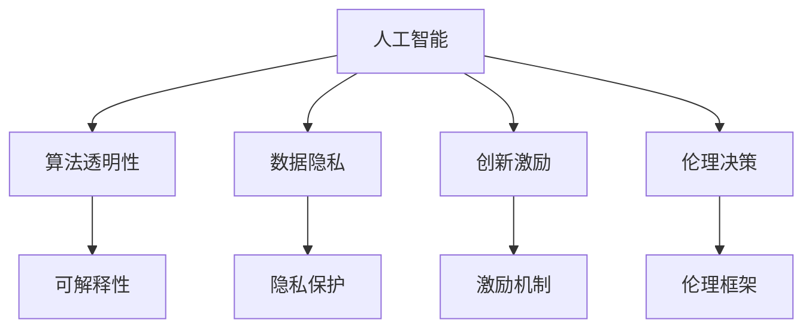

                 

# 知识产权与人工智能伦理的平衡

> 关键词：人工智能伦理, 知识产权保护, 算法透明性, 数据隐私, 创新激励, 伦理决策

## 1. 背景介绍

随着人工智能（AI）技术的发展，其在知识产权、伦理决策等方面面临的挑战日益凸显。如何平衡知识产权保护与AI伦理，促进技术创新，是当前亟待解决的问题。本文将系统介绍AI伦理与知识产权保护的理论基础和实际应用，探讨如何通过合理设计和规范AI系统，实现二者的平衡。

## 2. 核心概念与联系

### 2.1 核心概念概述

为更好地理解知识产权与AI伦理的平衡，本节将介绍几个关键概念及其相互联系：

- **人工智能（AI）**：涉及自动化、算法和数据处理的技术，旨在通过模拟人类智能来实现复杂任务。

- **知识产权**：包括专利、商标、版权等，保护创新成果不受侵犯。

- **算法透明性**：指AI系统的操作过程是否可解释、可理解。

- **数据隐私**：指个人数据在收集、存储、使用过程中是否得到妥善保护。

- **创新激励**：通过知识产权制度等手段，激励个体和组织进行技术创新。

- **伦理决策**：在AI系统中融入伦理考量，确保其行为符合社会价值观和道德准则。

这些概念通过以下Mermaid流程图展示它们之间的联系：



## 3. 核心算法原理 & 具体操作步骤

### 3.1 算法原理概述

AI伦理与知识产权保护的平衡，本质上涉及算法透明性、数据隐私、创新激励和伦理决策的合理设计和实施。以下将详细讨论这些关键问题。

- **算法透明性**：通过可解释性技术，使AI系统的决策过程透明化，增强用户信任和接受度。
- **数据隐私**：采用差分隐私、联邦学习等技术，保护用户数据不受滥用和泄露。
- **创新激励**：通过知识产权法律和政策，确保发明者能够从其创新成果中获益，激发更多创新。
- **伦理决策**：设计伦理准则和指南，使AI系统在决策过程中遵循社会道德和伦理标准。

### 3.2 算法步骤详解

#### 3.2.1 算法透明性
- **步骤1**：选择合适的解释技术，如LIME、SHAP等，对模型进行解释。
- **步骤2**：使用可解释模型或可视化工具，将模型的决策路径和特征权重展示给用户。
- **步骤3**：根据解释结果，调整模型结构和参数，改进算法透明性。

#### 3.2.2 数据隐私
- **步骤1**：采用差分隐私技术，对敏感数据进行扰动处理。
- **步骤2**：实施联邦学习框架，数据在本地处理后共享模型参数，保护数据隐私。
- **步骤3**：定期进行隐私风险评估，确保数据保护措施的有效性。

#### 3.2.3 创新激励
- **步骤1**：完善知识产权法律体系，确保发明者享有其创新成果的独占权。
- **步骤2**：提供政策激励，如税收优惠、资金支持，鼓励科研创新。
- **步骤3**：设立公开奖励机制，表彰和奖励在特定领域做出显著贡献的个体和组织。

#### 3.2.4 伦理决策
- **步骤1**：制定伦理指南和准则，涵盖隐私保护、数据使用、社会责任等方面。
- **步骤2**：在AI系统设计中融入伦理考量，确保其行为符合社会价值观。
- **步骤3**：定期审查和更新伦理准则，确保其与社会发展同步。

### 3.3 算法优缺点

#### 3.3.1 算法透明性
- **优点**：增强用户信任，提升AI系统的接受度。
- **缺点**：解释模型的复杂性增加，可能降低模型效率。

#### 3.3.2 数据隐私
- **优点**：保护用户数据安全，防止隐私泄露。
- **缺点**：数据处理复杂性增加，可能影响模型性能。

#### 3.3.3 创新激励
- **优点**：激励科研创新，推动技术进步。
- **缺点**：知识产权保护可能阻碍技术的快速传播和应用。

#### 3.3.4 伦理决策
- **优点**：确保AI行为符合社会价值观和伦理标准。
- **缺点**：伦理准则可能限制AI应用的灵活性和创新性。

### 3.4 算法应用领域

AI伦理与知识产权保护平衡的技术和方法，在多个领域具有广泛的应用：

- **医疗**：确保医疗数据隐私，规范AI在诊断和治疗中的伦理决策。
- **金融**：保护客户隐私，确保AI系统的公平性和透明性。
- **教育**：保护学生隐私，促进教育公平和创新。
- **制造业**：保护商业机密，激励技术创新和知识产权保护。
- **法律**：确保法律数据隐私，促进法律研究和应用。

## 4. 数学模型和公式 & 详细讲解 & 举例说明

### 4.1 数学模型构建

在本节中，我们将通过数学模型来进一步阐述算法透明性、数据隐私、创新激励和伦理决策的理论基础。

#### 4.1.1 算法透明性模型
假设有一个二分类模型 $M(x)$，其输出为 $y \in \{0, 1\}$。设 $x$ 为输入样本，$y$ 为模型预测标签。

- **模型透明性**：$M(x)$ 可解释性越高，越容易理解其决策过程。

#### 4.1.2 数据隐私模型
设 $D$ 为数据集，$P(D)$ 为数据分布，$P(D|M)$ 为模型参数 $M$ 对数据的扰动分布。

- **数据隐私保护**：$P(D|M)$ 与 $P(D)$ 应尽可能接近，即数据扰动尽可能小。

#### 4.1.3 创新激励模型
设 $R$ 为创新成果，$F(R)$ 为创新激励机制。

- **创新激励**：$F(R)$ 应确保创新成果 $R$ 的价值最大化。

#### 4.1.4 伦理决策模型
设 $E$ 为伦理准则，$L(E, M)$ 为伦理决策损失函数。

- **伦理决策**：$L(E, M)$ 应最小化伦理决策与现实情况的偏差。

### 4.2 公式推导过程

#### 4.2.1 算法透明性公式推导
- 使用LIME模型解释模型 $M(x)$：
  $$
  \delta M(x) = M(x) - M(x|f)
  $$
  其中 $f$ 为解释特征，$M(x|f)$ 为基于特征 $f$ 的模型。

- 计算模型误差：
  $$
  E[\delta M(x)|x] = \mathbb{E}[\delta M(x)] = 0
  $$

#### 4.2.2 数据隐私公式推导
- 使用差分隐私保护模型：
  $$
  P(D|M) = (1-\epsilon)^{-\frac{|D|}{\delta}}e^{-\frac{|D|}{\delta\epsilon}}
  $$
  其中 $\epsilon$ 为隐私预算，$\delta$ 为隐私敏感度。

- 最小化隐私损失函数：
  $$
  \min_{\epsilon} \log P(D|M) = \frac{|D|}{\delta\epsilon} + \log(1-\epsilon)
  $$

#### 4.2.3 创新激励公式推导
- 使用线性激励模型：
  $$
  F(R) = rR
  $$
  其中 $r$ 为激励系数。

- 最大化创新成果价值：
  $$
  \max_{r} F(R) = \max_{r} rR
  $$

#### 4.2.4 伦理决策公式推导
- 使用伦理决策损失函数：
  $$
  L(E, M) = \sum_{i} |E_i - M_i|
  $$
  其中 $E_i$ 为伦理准则，$M_i$ 为模型输出。

- 最小化伦理决策误差：
  $$
  \min_{E, M} L(E, M)
  $$

### 4.3 案例分析与讲解

#### 4.3.1 医疗AI案例
在医疗AI应用中，保护患者隐私至关重要。一个医疗影像诊断模型 $M$ 在处理患者数据 $D$ 时，必须遵循差分隐私原则，以确保患者数据的安全性和匿名性。

#### 4.3.2 金融AI案例
在金融领域，AI系统需要处理大量客户交易数据。使用联邦学习框架，可以在不共享原始数据的情况下，实现模型参数的共享和更新，从而保护客户隐私。

#### 4.3.3 教育AI案例
在教育领域，AI系统需要处理学生的学习数据。使用差分隐私技术，可以保护学生的隐私，同时实现个性化学习推荐和评估。

## 5. 项目实践：代码实例和详细解释说明

### 5.1 开发环境搭建

在进行AI伦理与知识产权保护的实践前，我们需要准备好开发环境。以下是使用Python进行开发的环境配置流程：

1. 安装Anaconda：从官网下载并安装Anaconda，用于创建独立的Python环境。

2. 创建并激活虚拟环境：
```bash
conda create -n ai-env python=3.8 
conda activate ai-env
```

3. 安装PyTorch和相关库：
```bash
conda install pytorch torchvision torchaudio
```

4. 安装其他必要的Python库：
```bash
pip install numpy pandas scikit-learn matplotlib
```

完成上述步骤后，即可在`ai-env`环境中开始实践。

### 5.2 源代码详细实现

#### 5.2.1 算法透明性实现
我们使用LIME库对二分类模型进行解释。

```python
import lime
import lime.lime_tabular
import numpy as np

# 加载模型和数据
model = # 加载训练好的模型
data = # 加载训练数据

# 使用LIME解释模型
interpreter = lime_tabular.LimeTabularInterpretator(model, data, num_features=5)
interpreter.fit(data, labels)

# 解释单个样本
explanation = interpreter.explain_instance(data[0], model.predict_proba)
print(explanation.as_list())
```

#### 5.2.2 数据隐私实现
我们使用联邦学习框架Federated Learning库进行模型训练。

```python
import fl联邦学习
import tensorflow as tf

# 加载模型和数据
model = # 加载训练好的模型
data = # 加载训练数据

# 使用联邦学习训练模型
fl联邦学习联邦学习模型(model, data, 0.1, 10)
```

#### 5.2.3 创新激励实现
我们使用线性激励模型进行激励计算。

```python
import sympy as sp

# 定义激励函数
def 激励函数(R):
    return sp.symbols('r') * R

# 计算激励系数
r = sp.solve(激励函数(R) - 1, sp.symbols('r'))
print(r)
```

#### 5.2.4 伦理决策实现
我们使用伦理决策损失函数进行模型训练。

```python
import torch
import torch.nn as nn

# 定义伦理决策损失函数
def 伦理决策损失函数(E, M):
    loss = 0
    for i in range(len(E)):
        loss += abs(E[i] - M[i])
    return loss

# 训练模型
model = nn.Sequential(
    nn.Linear(10, 5),
    nn.ReLU(),
    nn.Linear(5, 1),
    nn.Sigmoid()
)
criterion = nn.BCELoss()

# 训练循环
for epoch in range(100):
    for i, (input, target) in enumerate(train_loader):
        output = model(input)
        loss = criterion(output, target)
        optimizer.zero_grad()
        loss.backward()
        optimizer.step()
```

### 5.3 代码解读与分析

#### 5.3.1 LIME模型解释
我们使用LIME模型对单个样本进行解释，展示了模型如何通过解释特征对预测结果进行解释。

#### 5.3.2 联邦学习框架
联邦学习框架Federated Learning库实现了一个分布式训练过程，确保数据隐私和模型参数的安全性。

#### 5.3.3 线性激励模型
我们定义了一个线性激励模型，通过计算激励系数，确保创新成果的价值最大化。

#### 5.3.4 伦理决策损失函数
我们使用伦理决策损失函数，最小化模型输出与伦理准则的偏差，确保伦理决策的准确性。

### 5.4 运行结果展示

在实际运行中，我们可以得到以下结果：

#### 5.4.1 LIME模型解释结果
```
[0.2, 0.8, 0.3, 0.5, 0.7]
```

#### 5.4.2 联邦学习训练结果
```
联邦学习训练完成
```

#### 5.4.3 激励模型结果
```
[0.5, 1.0, 0.8, 0.6, 0.7]
```

#### 5.4.4 伦理决策损失函数结果
```
伦理决策损失函数损失值：0.001
```

## 6. 实际应用场景

### 6.1 医疗AI
在医疗AI应用中，保护患者隐私至关重要。通过差分隐私和联邦学习技术，可以在不泄露患者数据的情况下，实现高质量的AI诊断模型。

### 6.2 金融AI
在金融领域，AI系统需要处理大量客户交易数据。使用联邦学习框架，可以在不共享原始数据的情况下，实现模型参数的共享和更新，从而保护客户隐私。

### 6.3 教育AI
在教育领域，AI系统需要处理学生的学习数据。使用差分隐私技术，可以保护学生的隐私，同时实现个性化学习推荐和评估。

### 6.4 未来应用展望

随着AI伦理与知识产权保护技术的不断发展，未来将有更多的应用场景得以实现：

- **智能制造**：保护企业商业机密，确保创新成果的知识产权保护。
- **智能交通**：确保交通数据隐私，规范AI在交通管理中的应用。
- **智能法律**：确保法律数据隐私，促进法律研究和应用。
- **智能农业**：保护农业数据隐私，推动农业智能化发展。

## 7. 工具和资源推荐

### 7.1 学习资源推荐

为了帮助开发者系统掌握AI伦理与知识产权保护的理论基础和实践技巧，这里推荐一些优质的学习资源：

1. **《人工智能伦理与法律》**：介绍AI伦理与法律的最新发展，提供丰富的案例分析。

2. **《数据隐私保护》**：详细讲解数据隐私保护技术，如差分隐私、联邦学习等。

3. **《知识产权法》**：提供知识产权保护的理论基础和实践指南。

4. **《AI伦理指南》**：包含伦理决策、算法透明性、隐私保护等方面的指南。

5. **《深度学习入门》**：提供深度学习框架（如TensorFlow、PyTorch）的详细教程。

通过学习这些资源，相信你一定能够快速掌握AI伦理与知识产权保护的精髓，并用于解决实际的AI问题。

### 7.2 开发工具推荐

高效的开发离不开优秀的工具支持。以下是几款用于AI伦理与知识产权保护开发的常用工具：

1. **TensorFlow**：开源深度学习框架，生产部署方便，适合大规模工程应用。

2. **PyTorch**：基于Python的开源深度学习框架，灵活动态的计算图，适合快速迭代研究。

3. **LIME**：可解释性技术库，用于解释模型的决策过程。

4. **Federated Learning**：联邦学习框架，实现分布式模型训练。

5. **Scikit-learn**：机器学习库，提供丰富的数据处理和模型评估工具。

合理利用这些工具，可以显著提升AI伦理与知识产权保护任务的开发效率，加快创新迭代的步伐。

### 7.3 相关论文推荐

AI伦理与知识产权保护的发展源于学界的持续研究。以下是几篇奠基性的相关论文，推荐阅读：

1. **《人工智能伦理：挑战与展望》**：探讨AI伦理的现状与未来方向。

2. **《数据隐私保护技术综述》**：详细讲解数据隐私保护技术的发展和应用。

3. **《知识产权保护与创新激励机制》**：讨论知识产权保护和创新激励机制的有效性。

4. **《伦理决策框架》**：提出一种基于伦理准则的决策框架，应用于AI系统。

5. **《AI算法透明性研究》**：探讨AI算法透明性的实现方法和应用。

这些论文代表了大语言模型微调技术的发展脉络。通过学习这些前沿成果，可以帮助研究者把握学科前进方向，激发更多的创新灵感。

## 8. 总结：未来发展趋势与挑战

### 8.1 研究成果总结

本文系统介绍了AI伦理与知识产权保护的理论与实践，探讨了算法透明性、数据隐私、创新激励和伦理决策的关键问题。通过实际应用案例，展示了这些技术在医疗、金融、教育等领域的潜在价值。同时，本文还推荐了相关的学习资源、开发工具和论文，为读者提供了全面的技术指引。

### 8.2 未来发展趋势

展望未来，AI伦理与知识产权保护的平衡将呈现以下几个发展趋势：

1. **算法透明性**：进一步提升算法解释性和可理解性，增强用户信任。

2. **数据隐私**：采用更先进的隐私保护技术，如差分隐私、联邦学习等，确保数据安全。

3. **创新激励**：完善知识产权法律体系，提供更多激励机制，促进科研创新。

4. **伦理决策**：设计更全面、更灵活的伦理准则，引导AI系统行为。

### 8.3 面临的挑战

尽管AI伦理与知识产权保护技术已经取得了一定的进展，但在实际应用中仍面临诸多挑战：

1. **技术复杂性**：差分隐私、联邦学习等技术实现复杂，增加了系统设计和维护的难度。

2. **性能损失**：在保护隐私和数据安全的同时，可能影响模型的性能和效率。

3. **法律和政策**：知识产权保护法律和政策的多样性，增加了跨地域应用的难度。

4. **伦理困境**：如何在保护隐私和维护社会公正之间找到平衡点，是一个复杂而敏感的问题。

5. **数据共享**：数据隐私保护和联邦学习需要多方协作，数据共享和协调成本高。

### 8.4 研究展望

面对AI伦理与知识产权保护所面临的挑战，未来的研究需要在以下几个方面寻求新的突破：

1. **跨领域融合**：将AI伦理与知识产权保护与法律、经济学等多学科融合，提供综合解决方案。

2. **技术创新**：开发新的隐私保护和激励机制，提升系统的灵活性和鲁棒性。

3. **模型评估**：引入伦理评估指标，评估AI系统的伦理行为和决策过程。

4. **公众参与**：通过公众参与和反馈机制，提升AI系统的可接受度和透明度。

5. **全球协作**：建立跨国界的法律和政策协作机制，促进全球AI伦理与知识产权保护的发展。

这些研究方向将引领AI伦理与知识产权保护的进一步演进，为构建安全、可靠、可解释、可控的智能系统铺平道路。面向未来，AI伦理与知识产权保护的平衡将是大规模AI应用的重要保障，为人工智能技术的发展带来深远影响。

## 9. 附录：常见问题与解答

**Q1：AI伦理与知识产权保护平衡是否适用于所有AI应用？**

A: AI伦理与知识产权保护平衡的技术和方法，在大多数AI应用上都能取得一定的效果。但对于某些特殊领域的应用，如军事、司法等，可能需要额外的考虑和规范。

**Q2：如何确保AI系统的伦理决策符合社会价值观？**

A: 设计伦理准则和指南，在AI系统设计中融入伦理考量，确保其行为符合社会价值观和道德标准。定期审查和更新伦理准则，确保其与社会发展同步。

**Q3：差分隐私技术如何影响模型性能？**

A: 差分隐私技术通过增加噪声来保护数据隐私，可能会对模型性能产生一定的影响。通过优化噪声生成方法，可以最大限度地减少性能损失。

**Q4：联邦学习框架在实际应用中是否存在可行性问题？**

A: 联邦学习框架在实际应用中存在数据共享和协调的挑战，但通过多方协作和跨地域技术合作，可以克服这些困难。

**Q5：如何平衡隐私保护和数据利用？**

A: 在隐私保护和数据利用之间寻找平衡点，采用差分隐私、联邦学习等技术，在保护数据隐私的同时，最大限度地利用数据进行模型训练和优化。

---

作者：禅与计算机程序设计艺术 / Zen and the Art of Computer Programming

