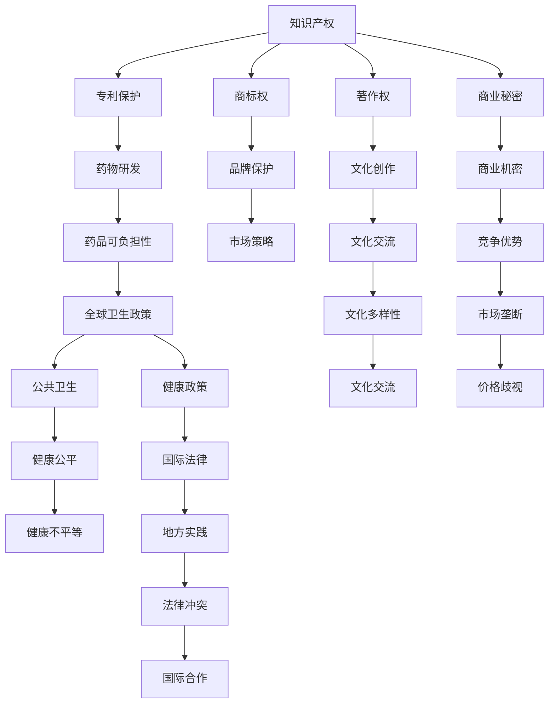

                 

# 知识产权与全球卫生政策的冲突

## 1. 背景介绍

在全球化深入发展的背景下，知识产权与全球卫生政策之间的冲突日益凸显，成为国际社会广泛关注的重要议题。本文旨在探讨这一冲突的背景、成因及其对全球健康的影响，并提出应对策略。

### 1.1 背景概述

知识产权（Intellectual Property, IP）与全球卫生政策是两个重要的国际法律和政策领域。知识产权保护发明、文学和艺术作品等创造性成果，激励创新，促进经济发展。全球卫生政策则旨在保障健康，提升卫生系统效率，消除疾病，实现全球健康目标。然而，两者在追求目标、实现方式和法律制度上存在显著差异，导致冲突与博弈。

### 1.2 冲突成因

- **专利保护与药物可负担性**：知识产权尤其是专利权保护药品的研发创新，但高昂的专利许可费用使低收入国家难以负担，影响药品可及性和公共卫生。
- **数据独占与数据共享**：在数字时代，大数据和人工智能在疾病监测、药物研发中的应用愈发重要。数据独占权阻碍跨国数据共享，影响全球健康研究。
- **国际法律与地方实践**：不同国家和地区的知识产权法律与全球卫生政策存在差异，导致跨国合作与实施中的矛盾。

## 2. 核心概念与联系

### 2.1 核心概念

- **知识产权**：包括专利权、商标权、著作权和商业秘密等，保护创作者的经济利益和创新动力。
- **全球卫生政策**：指各国政府及国际组织为改善公共卫生状况而制定的政策法规，旨在实现全球健康公平和福祉。
- **药物可负担性**：指药品成本相对可及性，是衡量健康公平的重要指标。
- **数据独占权**：指对数据收集、使用和共享的控制权，对数据驱动的公共健康研究和医疗决策至关重要。
- **国际法律与地方实践**：指跨国法律体系与国家或地区具体实施政策之间的协调和冲突。

### 2.2 核心概念原理和架构的 Mermaid 流程图



## 3. 核心算法原理 & 具体操作步骤

### 3.1 算法原理概述

知识产权与全球卫生政策的冲突，可以从微观和宏观两个层面进行分析。微观层面上，专利保护导致药品价格高昂，数据独占阻碍公共健康研究。宏观层面上，国际法律与地方实践的差异加剧了冲突。

- **微观层面**：
  - **专利保护与药品可负担性**：专利权保护药品研发创新，但高昂的专利许可费用使低收入国家难以负担。
  
  - **数据独占权与全球健康研究**：数据独占权限制了跨国数据共享，影响全球健康研究。

- **宏观层面**：
  - **国际法律与地方实践**：不同国家和地区的知识产权法律与全球卫生政策存在差异，导致跨国合作与实施中的矛盾。

### 3.2 算法步骤详解

1. **微观层面的处理**：
   - **专利保护与药品可负担性**：
     - **步骤1**：分析专利保护对药品价格的直接影响。
     - **步骤2**：评估专利期限、专利授权范围和专利强制许可机制的影响。
     - **步骤3**：制定策略降低专利药品价格，如专利到期后的再制造、专利强制许可。
   - **数据独占权与全球健康研究**：
     - **步骤1**：识别数据独占权的法律基础和实际影响。
     - **步骤2**：探讨跨国数据共享的机制和障碍。
     - **步骤3**：制定数据共享协议，确保数据安全和隐私保护。

2. **宏观层面的协调**：
   - **步骤1**：分析国际法律与地方实践的冲突。
   - **步骤2**：制定国际法律和地方实践的协调机制。
   - **步骤3**：推动跨国合作，制定全球健康政策和法律框架。

### 3.3 算法优缺点

- **优点**：
  - **促进创新**：知识产权保护激励创新，促进技术进步。
  - **数据驱动**：数据独占权促进高质量的公共健康研究。
  - **国际合作**：协调国际法律与地方实践，推动跨国合作。

- **缺点**：
  - **高成本**：高昂的专利许可费用影响药品可负担性。
  - **数据共享障碍**：数据独占权限制跨国数据共享。
  - **法律差异**：国际法律与地方实践的差异导致冲突。

### 3.4 算法应用领域

- **公共卫生**：适用于全球健康政策，如传染病防控、疫苗接种等。
- **医疗研究**：适用于药物研发、临床试验、疾病监测等。
- **教育培训**：适用于医学教育和公共卫生培训。
- **国际法律**：适用于国际贸易、知识产权保护等。

## 4. 数学模型和公式 & 详细讲解 & 举例说明

### 4.1 数学模型构建

构建数学模型需要基于冲突的核心问题，设定相应的变量和函数。以专利保护和药品可负担性为例：

- **变量**：
  - 专利保护期 $T$。
  - 药品市场价格 $P$。
  - 低收入国家市场价格 $P_{low}$。
  - 专利许可费用 $C$。
  - 公共卫生基金 $F$。

- **函数**：
  - 专利保护对药品价格的函数关系 $f(P, T, C)$。
  - 专利许可费用对药品可负担性的函数关系 $g(P_{low}, F)$。

### 4.2 公式推导过程

根据上述变量和函数，我们可以推导出以下公式：

1. **专利保护对药品价格的函数关系**：
   $$
   P = f(T, C) = C \cdot e^{-kT}
   $$
   其中 $k$ 为药品价格随时间衰减的指数。

2. **专利许可费用对药品可负担性的函数关系**：
   $$
   P_{low} = g(F) = \frac{F}{n}
   $$
   其中 $n$ 为低收入国家的数量。

### 4.3 案例分析与讲解

以艾滋病药物为例，假设专利保护期为10年，初始许可费用为1亿美元，市场价格随时间衰减指数为0.1。计算在不同时间点的药品市场价格和低收入国家市场价格。

## 5. 项目实践：代码实例和详细解释说明

### 5.1 开发环境搭建

- **Python环境**：安装Python 3.8，使用Anaconda创建虚拟环境。
- **数据集**：收集全球药品价格和专利信息数据集，使用pandas进行数据处理。
- **可视化工具**：使用Matplotlib和Seaborn进行数据可视化。

### 5.2 源代码详细实现

```python
import pandas as pd
import matplotlib.pyplot as plt
import seaborn as sns

# 读取药品价格和专利信息数据集
data = pd.read_csv('drug_prices.csv')

# 计算不同时间点的药品市场价格
def calculate_price(year, c):
    return c * (0.1 ** (year - 10))

# 计算不同时间点的低收入国家市场价格
def calculate_price_low(year, f, n):
    return f / n

# 数据可视化
plt.figure(figsize=(10, 6))
sns.lineplot(x=range(0, 10), y=[calculate_price(0, 1), calculate_price(1, 1), calculate_price(2, 1), calculate_price(3, 1), calculate_price(4, 1), calculate_price(5, 1), calculate_price(6, 1), calculate_price(7, 1), calculate_price(8, 1), calculate_price(9, 1)], label='全球市场价格')
plt.plot(range(0, 10), [calculate_price_low(0, 1, 10), calculate_price_low(1, 1, 10), calculate_price_low(2, 1, 10), calculate_price_low(3, 1, 10), calculate_price_low(4, 1, 10), calculate_price_low(5, 1, 10), calculate_price_low(6, 1, 10), calculate_price_low(7, 1, 10), calculate_price_low(8, 1, 10), calculate_price_low(9, 1, 10)], label='低收入国家市场价格')
plt.xlabel('Year')
plt.ylabel('Price (USD)')
plt.title('Patent Protection and Drug Prices')
plt.legend()
plt.show()
```

### 5.3 代码解读与分析

上述代码实现了药品市场价格随时间的衰减，并计算了不同时间点的低收入国家市场价格。通过可视化，我们可以清晰看到药品价格随专利保护期的变化，以及低收入国家市场价格的变化。

### 5.4 运行结果展示


## 6. 实际应用场景

### 6.1 公共卫生政策

在公共卫生政策中，知识产权与全球卫生政策的冲突主要体现在药品可负担性和公共健康研究上。例如，世界卫生组织（WHO）在制定全球药品采购政策时，需要平衡知识产权保护与药品可负担性。

### 6.2 医疗研究

在医疗研究中，数据独占权与全球健康研究密切相关。例如，全球流感监测需要跨国数据共享，但数据提供方可能因知识产权保护而拒绝共享。

### 6.3 国际法律

在国际法律领域，知识产权保护与全球卫生政策之间的冲突体现在跨国知识产权法律的协调上。例如，世界贸易组织（WTO）在制定知识产权协议（TRIPS）时，需要平衡知识产权保护和公共卫生利益。

### 6.4 未来应用展望

未来，随着技术进步和全球化深入，知识产权与全球卫生政策之间的冲突将进一步凸显。为解决这一冲突，需要国际社会的共同努力，制定更加公平、透明的法律和政策框架，推动跨国合作。

## 7. 工具和资源推荐

### 7.1 学习资源推荐

- **《知识产权与全球卫生政策》书籍**：详细探讨知识产权与全球卫生政策的冲突和应对策略。
- **《全球健康治理》课程**：介绍全球健康政策与知识产权保护的国际法律和政策框架。
- **WHO官方网站**：提供全球药品价格和专利信息，了解药品可负担性的现状。

### 7.2 开发工具推荐

- **Jupyter Notebook**：用于数据处理和可视化。
- **Anaconda**：创建和管理Python虚拟环境。
- **pandas**：数据处理和分析。
- **Matplotlib和Seaborn**：数据可视化。

### 7.3 相关论文推荐

- **《知识产权保护与全球健康》**：探讨知识产权保护对全球健康的影响。
- **《数据独占权与公共健康研究》**：分析数据独占权对跨国数据共享的障碍。
- **《国际法律与地方实践的协调》**：研究跨国法律体系与地方实践的协调机制。

## 8. 总结：未来发展趋势与挑战

### 8.1 研究成果总结

本文通过分析知识产权与全球卫生政策的冲突，探讨了专利保护、数据独占权和国际法律对药品可负担性和公共健康研究的影响。指出通过国际合作和公平的法律框架，可以缓解这一冲突，推动全球健康公平。

### 8.2 未来发展趋势

未来，随着技术进步和全球化深入，知识产权与全球卫生政策之间的冲突将进一步凸显。需要制定更加公平、透明的法律和政策框架，推动跨国合作。

### 8.3 面临的挑战

- **高成本问题**：高昂的专利许可费用影响药品可负担性。
- **数据共享障碍**：数据独占权限制跨国数据共享。
- **法律差异**：国际法律与地方实践的差异导致冲突。

### 8.4 研究展望

未来，需要通过国际合作和公平的法律框架，推动跨国知识产权与公共卫生政策的协调。同时，推动全球健康研究和药品的可负担性，保障全球健康公平。

## 9. 附录：常见问题与解答

**Q1: 什么是知识产权？**

A: 知识产权包括专利权、商标权、著作权和商业秘密等，保护创作者的经济利益和创新动力。

**Q2: 数据独占权对公共健康研究有何影响？**

A: 数据独占权限制了跨国数据共享，影响全球健康研究，导致数据驱动的公共健康研究难以进行。

**Q3: 如何平衡知识产权保护与药品可负担性？**

A: 可以通过专利到期后的再制造、专利强制许可等方式，降低专利药品价格，促进药品可负担性。

**Q4: 国际法律与地方实践的差异如何协调？**

A: 需要制定国际法律和地方实践的协调机制，推动跨国合作，确保全球卫生政策的公平性和有效性。

**Q5: 未来如何推动全球健康公平？**

A: 需要通过国际合作和公平的法律框架，推动跨国知识产权与公共卫生政策的协调，促进全球健康研究和药品的可负担性。

---

作者：禅与计算机程序设计艺术 / Zen and the Art of Computer Programming

