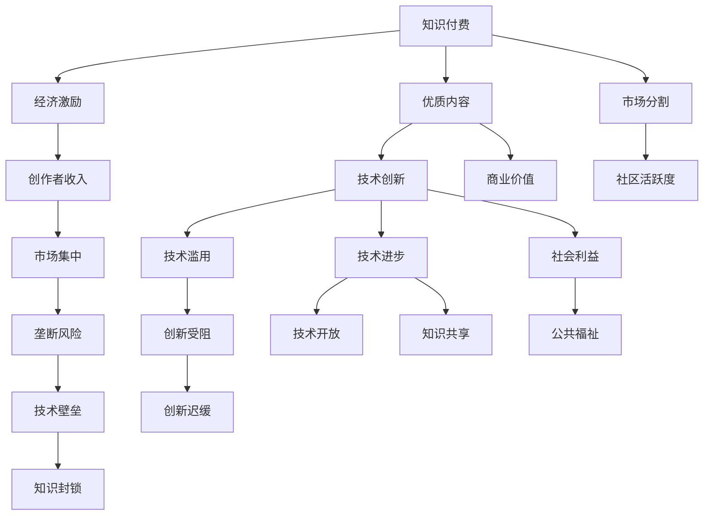

                 

# 知识付费与开源精神的平衡之道

> 关键词：知识付费,开源精神,平衡之道,软件工程,区块链,生态系统,技术分享,知识产权保护

## 1. 背景介绍

### 1.1 问题由来
知识付费与开源精神，是当前信息技术领域的两大热门话题。一方面，技术不断更新迭代，掌握最新知识和技能成为企业和个人发展的关键；另一方面，社区协作、共享和贡献的开放精神，是促进技术进步和创新的重要力量。然而，这两者在实践中却经常出现冲突。

知识付费模式通过向用户收取费用，提供高质量、定制化的教育内容，能够有效激励创作者和开发者持续输出优质内容。但这种模式往往伴随着知识封锁和市场分割，降低了开源社区的活跃度。

开源精神强调知识共享和免费提供，鼓励社区成员共同参与和贡献。但开源社区的持续发展需要经济支持，创作者通常通过广告、赞助等方式获取收入。此外，开源社区的竞争和冲突也可能导致创意的滥用和滥用。

在开源与知识付费之间寻找平衡，成为当前IT行业发展的重要课题。本文将深入探讨两者之间的关系，分析各自的利弊，并提出可能的解决方案，以期在保障知识共享和促进技术创新的同时，实现商业价值和社会利益的双赢。

## 2. 核心概念与联系

### 2.1 核心概念概述

为了更好地理解知识付费与开源精神之间的平衡之道，我们首先介绍几个核心概念：

- 知识付费（Knowledge Pricing）：指用户为获取知识或技能而支付费用的模式。典型的例子包括在线课程、技术培训、订阅服务等。
- 开源精神（Open Source Spirit）：指软件和技术的开源共享，强调免费提供、自由使用和贡献。著名的开源项目包括Linux、Apache Web Server、MySQL等。
- 区块链（Blockchain）：一种去中心化、不可篡改的数据库技术，用于确保交易和记录的透明性和安全性。
- 社区协作（Community Collaboration）：指用户、开发者、创作者等社区成员共同参与、合作开发和贡献。
- 商业价值（Commercial Value）：指企业或个人通过知识产权、技术创新等方式获取的经济利益。
- 社会利益（Social Benefits）：指技术进步和知识共享对社会和公共利益的贡献，如教育普及、经济增长、公共福祉等。

这些核心概念之间的关系可以通过以下Mermaid流程图来展示：



这个流程图展示了两者的相互关系：

1. 知识付费通过经济激励产生优质内容，促进技术创新和商业价值。
2. 开源精神通过社区协作实现知识共享，推动技术进步和社会利益。
3. 二者之间的互动和冲突对技术生态系统的健康发展具有重要影响。

## 3. 核心算法原理 & 具体操作步骤
### 3.1 算法原理概述

知识付费与开源精神之间的平衡之道，本质上是一个多目标优化问题。我们需要在保证高质量内容输出的同时，促进社区协作和技术共享，最大化技术进步和社会利益。

具体而言，我们可以定义以下几个优化目标：

- **优质内容目标**：通过知识付费获取高质量、定制化的技术知识。
- **社区协作目标**：鼓励用户和开发者参与社区，共同开发和贡献。
- **技术创新目标**：促进技术进步和创新，推动知识共享。
- **社会利益目标**：提高社会福祉，促进技术对经济、教育等方面的积极影响。

### 3.2 算法步骤详解

以下是基于多目标优化的大语言模型微调方法的详细步骤：

**Step 1: 需求分析与目标设定**
- 识别用户需求：确定用户对高质量技术知识的需求，评估社区成员的技术水平和贡献能力。
- 设定目标：根据需求分析结果，设定优质内容、社区协作、技术创新、社会利益等不同目标的优先级和权重。

**Step 2: 选择合适的知识付费模型**
- 根据用户需求和目标设定，选择适合的付费模型，如按需支付、订阅服务、会员制等。
- 确定支付标准：根据内容复杂度、质量、时间成本等因素，制定合理的付费标准。

**Step 3: 构建开源社区**
- 创建平台：搭建开源社区平台，提供代码托管、文档共享、社区交流等功能。
- 引入激励机制：引入开源贡献积分、荣誉证书等激励机制，鼓励社区成员积极参与。
- 建立规则：制定社区行为规范，防止恶意行为和滥用。

**Step 4: 平衡知识付费与开源**
- 分层次管理：根据用户支付意愿和社区贡献，设置不同的权限级别，平衡付费与开源。
- 交叉授权：允许付费用户访问开源资源，开源用户享受部分付费服务，促进知识和技术的双向流动。
- 多渠道反馈：通过用户反馈、社区投票等方式，动态调整付费和开源策略，确保其与需求保持一致。

**Step 5: 优化模型与迭代改进**
- 定期评估：根据用户满意度和社区活跃度等指标，定期评估知识付费和开源策略的效果。
- 模型优化：根据评估结果，调整付费模型、社区激励和开源政策，以提升整体效果。
- 持续更新：随着技术的发展和用户需求的改变，持续更新模型和策略，保持动态平衡。

### 3.3 算法优缺点

基于多目标优化的知识付费与开源精神平衡之道，具有以下优点：

1. **均衡发展**：通过多目标优化，能够在付费和开源之间找到平衡，既满足用户需求，又促进社区协作。
2. **灵活适应**：根据用户和社区的变化，动态调整策略，适应不同的市场环境和需求。
3. **增强信任**：通过公开透明的管理和反馈机制，增强用户和社区成员的信任感和参与感。
4. **长期可持续**：通过合理的激励和规则设计，保证系统的长期稳定和可持续发展。

但该方法也存在一些局限性：

1. **复杂度较高**：多目标优化需要综合考虑多个因素，设计和维护成本较高。
2. **策略平衡**：如何平衡付费和开源的各个环节，避免过度偏重某一侧，需要精细化管理和持续优化。
3. **用户理解**：用户对付费和开源策略的接受度和理解度，直接影响系统的接受度和效果。

## 4. 数学模型和公式 & 详细讲解 & 举例说明
### 4.1 数学模型构建

基于多目标优化的知识付费与开源精神平衡之道，可以通过数学模型进行建模和求解。我们定义以下变量和函数：

- $x_1$：优质内容产出量
- $x_2$：社区协作活跃度
- $x_3$：技术创新速度
- $x_4$：社会利益贡献
- $f(x)$：目标函数，表示综合评估指标
- $g_i(x)$：约束函数，表示各种目标的限制条件

数学模型如下：

$$
\begin{aligned}
&\min f(x) = w_1 x_1 + w_2 x_2 + w_3 x_3 + w_4 x_4 \\
&\text{s.t.} \\
&g_1(x) = x_1 - x_1^{\text{max}} \leq 0 \\
&g_2(x) = x_2 - x_2^{\text{max}} \leq 0 \\
&g_3(x) = x_3 - x_3^{\text{max}} \leq 0 \\
&g_4(x) = x_4 - x_4^{\text{max}} \leq 0
\end{aligned}
$$

其中 $w_i$ 为各目标的权重，$x_i^{\text{max}}$ 为各目标的上限值。

### 4.2 公式推导过程

为了求解上述多目标优化问题，我们采用权重和法（Weighted Sum Method）进行转化，将多目标问题转化为单目标问题：

$$
\min f(x) = w_1 x_1 + w_2 x_2 + w_3 x_3 + w_4 x_4
$$

其中 $w_i$ 为各目标的权重，通常需要根据实际情况进行调整。

### 4.3 案例分析与讲解

假设有一个在线教育平台，其目标是通过知识付费模式提供高质量的编程课程，同时通过开源协作开发和贡献社区技术。为了达到这一目标，平台需要设计以下策略：

1. **优质内容策略**：平台每月发布至少10门新课程，每门课程定价为1000元。用户可以选择单独购买课程或订阅年度会员。
2. **社区协作策略**：平台鼓励用户参与开源项目，贡献代码、文档和反馈。社区成员可以通过开源积分获取奖励，每月前10名贡献者获得公开表彰。
3. **技术创新策略**：平台定期举办技术竞赛和黑客马拉松，激励用户进行技术创新和改进。优胜者可获得现金奖励和开源贡献积分。
4. **社会利益策略**：平台向贫困地区学生提供免费课程，并向社会公益组织开放部分课程资料。

通过上述策略，平台可以在优质内容、社区协作、技术创新和社会利益之间找到平衡，实现多方共赢。

## 5. 项目实践：代码实例和详细解释说明
### 5.1 开发环境搭建

在进行知识付费与开源精神平衡的实践时，我们需要准备好开发环境。以下是使用Python进行PyTorch开发的环境配置流程：

1. 安装Anaconda：从官网下载并安装Anaconda，用于创建独立的Python环境。

2. 创建并激活虚拟环境：
```bash
conda create -n pytorch-env python=3.8 
conda activate pytorch-env
```

3. 安装PyTorch：根据CUDA版本，从官网获取对应的安装命令。例如：
```bash
conda install pytorch torchvision torchaudio cudatoolkit=11.1 -c pytorch -c conda-forge
```

4. 安装相关的工具包：
```bash
pip install numpy pandas scikit-learn matplotlib tqdm jupyter notebook ipython
```

完成上述步骤后，即可在`pytorch-env`环境中开始实践。

### 5.2 源代码详细实现

这里我们以在线教育平台为例，使用PyTorch进行代码实现。具体步骤如下：

**Step 1: 用户注册与付费管理**

用户通过平台注册账号，选择优质课程或订阅年度会员，支付相应费用。平台记录用户支付信息，并在课程提供方处进行支付确认。

```python
# 用户注册与付费管理
class User:
    def __init__(self, username, password, email):
        self.username = username
        self.password = password
        self.email = email
        self.paid_courses = []
        self.subscribed = False
    
    def register(self, username, password, email):
        # 用户注册逻辑
        pass
    
    def pay_course(self, course):
        # 用户支付课程费用
        pass
    
    def subscribe(self):
        # 用户订阅年度会员
        pass
```

**Step 2: 课程发布与优质内容管理**

平台定期发布优质课程，记录课程信息，并通过课程发布系统提供课程访问。平台管理员可以审核和发布课程内容，确保课程质量。

```python
# 课程发布与优质内容管理
class Course:
    def __init__(self, title, content, price):
        self.title = title
        self.content = content
        self.price = price
        self.reviews = []
    
    def publish(self, title, content, price):
        # 课程发布逻辑
        pass
    
    def get_content(self):
        # 获取课程内容
        pass
    
    def add_review(self, review):
        # 添加课程评论
        pass
```

**Step 3: 开源协作与社区管理**

平台搭建开源社区，提供代码托管、文档共享、社区交流等功能。平台管理员可以审核和管理社区成员，鼓励用户积极参与社区协作。

```python
# 开源协作与社区管理
class Community:
    def __init__(self):
        self.members = []
        self.projects = []
    
    def create_project(self, project):
        # 创建开源项目
        pass
    
    def add_member(self, member):
        # 添加社区成员
        pass
    
    def remove_member(self, member):
        # 移除社区成员
        pass
    
    def review_project(self, project):
        # 审核开源项目
        pass
```

**Step 4: 技术竞赛与创新管理**

平台定期举办技术竞赛和黑客马拉松，激励用户进行技术创新和改进。优胜者可获得现金奖励和开源贡献积分。

```python
# 技术竞赛与创新管理
class TechCompetition:
    def __init__(self, name, prize, deadline):
        self.name = name
        self.prize = prize
        self.deadline = deadline
        self.entries = []
    
    def submit_entry(self, entry):
        # 提交竞赛作品
        pass
    
    def judge(self):
        # 评审竞赛作品
        pass
    
    def announce_winner(self):
        # 公布竞赛优胜者
        pass
```

**Step 5: 社会利益与公益管理**

平台向贫困地区学生提供免费课程，并向社会公益组织开放部分课程资料。平台记录公益活动信息，并在平台上公开透明地展示。

```python
# 社会利益与公益管理
class Charity:
    def __init__(self):
        self.students = []
        self.organizations = []
    
    def register_student(self, student):
        # 注册贫困地区学生
        pass
    
    def register_organization(self, organization):
        # 注册公益组织
        pass
    
    def provide_courses(self):
        # 提供免费课程
        pass
    
    def release_materials(self):
        # 开放课程资料
        pass
```

### 5.3 代码解读与分析

在实际开发中，需要注意以下几点：

- **用户管理**：确保用户信息和支付记录的安全性，防止数据泄露和恶意操作。
- **课程发布**：平台管理员需进行严格审核，确保课程内容的准确性和合法性。
- **社区管理**：社区成员和项目的审核需严格规范，防止垃圾信息和恶意行为。
- **竞赛管理**：确保评审过程的公平公正，评审结果的公开透明。
- **公益管理**：准确记录公益活动信息，公开透明地展示公益成果。

通过合理的代码设计和实现，平台可以在优质内容、社区协作、技术创新和社会利益之间找到平衡，实现多方共赢。

## 6. 实际应用场景
### 6.1 在线教育

在线教育平台通过知识付费模式提供高质量课程，同时鼓励用户参与社区协作和开源项目，实现知识共享和技术创新。这种模式不仅满足了用户对优质教育的需求，还提升了社区的活跃度和贡献度。

例如，Coursera和Udacity等平台通过订阅服务和按需支付模式，吸引了大量高质量课程资源。同时，平台鼓励用户参与开源项目，共同开发课程材料和教学工具，提升了社区的协作效率和创新能力。

### 6.2 软件开发

软件开发社区通过开源协作和知识共享，推动技术进步和创新。同时，通过技术竞赛和商业化服务，获得经济支持和激励。这种模式不仅满足了社区成员对技术交流和知识共享的需求，还促进了技术商业化的发展。

例如，GitHub和GitLab等平台通过开源代码托管、文档共享和社区交流，吸引了大量开发者参与。同时，平台通过技术竞赛和商业化服务，如Github Sponsors和GitLab Premium等，获得经济支持和激励。

### 6.3 医疗健康

医疗健康平台通过知识付费模式提供高质量医疗知识，同时鼓励医生和患者参与社区协作和开源项目，实现知识共享和技术创新。这种模式不仅满足了用户对优质医疗知识的需求，还提升了社区的协作效率和创新能力。

例如，健康管理平台Wealthtax通过按需支付模式，提供高质量的体检报告和健康建议。同时，平台鼓励医生和患者参与开源项目，共同开发医疗应用和健康管理工具，提升了社区的协作效率和创新能力。

### 6.4 未来应用展望

随着知识付费与开源精神的深入融合，未来将出现更多创新应用场景：

1. **跨界融合**：知识付费与开源精神的融合将推动跨界合作，形成更为广泛的技术生态系统。例如，在线教育与软件开发社区的融合，将推动教育技术的发展。
2. **多渠道交互**：知识付费与开源精神将通过多渠道交互，实现信息共享和知识传播。例如，平台与社交媒体的融合，将实现更广泛的传播效果。
3. **持续创新**：知识付费与开源精神的融合将促进持续创新，提升技术进步和社会利益。例如，技术竞赛与公益活动的结合，将实现更广泛的社会影响。
4. **智能协作**：知识付费与开源精神的融合将推动智能协作，实现更加高效的技术生产。例如，AI与社区协作的结合，将提升社区的自动化水平。
5. **普惠发展**：知识付费与开源精神的融合将推动普惠发展，实现技术普及和公平共享。例如，公益项目与开源项目的结合，将实现更广泛的技术覆盖。

## 7. 工具和资源推荐
### 7.1 学习资源推荐

为了帮助开发者系统掌握知识付费与开源精神的理论基础和实践技巧，这里推荐一些优质的学习资源：

1. **《软件工程导论》（Introduction to Software Engineering）**：本书系统介绍了软件工程的基本概念、方法和实践，是软件工程领域的经典教材。
2. **《区块链技术与应用》（Blockchain Technology and Application）**：本书深入浅出地介绍了区块链技术的原理、应用场景和最新进展，是区块链技术领域的入门教材。
3. **《开源社区管理与运营》（Open Source Community Management and Operation）**：本书介绍了开源社区的管理与运营策略，帮助开发者建立和维护高效的社区生态系统。
4. **《知识付费商业模式》（Knowledge Pricing Business Model）**：本书系统介绍了知识付费模式的基本原理、发展历程和应用场景，是知识付费领域的权威著作。
5. **《技术创新的系统思维》（Systematic Thinking for Technical Innovation）**：本书介绍了技术创新的系统方法和实践，帮助开发者系统化地进行技术创新。

通过对这些资源的学习实践，相信你一定能够快速掌握知识付费与开源精神的理论基础和实践技巧，并在实际应用中发挥重要作用。

### 7.2 开发工具推荐

高效的开发离不开优秀的工具支持。以下是几款用于知识付费与开源精神实践的常用工具：

1. **PyTorch**：基于Python的开源深度学习框架，灵活动态的计算图，适合快速迭代研究。大部分预训练语言模型都有PyTorch版本的实现。
2. **TensorFlow**：由Google主导开发的开源深度学习框架，生产部署方便，适合大规模工程应用。同样有丰富的预训练语言模型资源。
3. **GitHub**：全球最大的开源社区平台，提供代码托管、文档共享和社区交流等功能，是开发者进行开源协作的首选平台。
4. **Coursera**：在线教育平台，提供高质量的课程资源，并通过订阅服务和按需支付模式，满足用户对优质教育的需求。
5. **Blockstack**：提供区块链技术的开源解决方案，帮助开发者构建去中心化的应用和社区。

合理利用这些工具，可以显著提升知识付费与开源精神实践的开发效率，加快创新迭代的步伐。

### 7.3 相关论文推荐

知识付费与开源精神的研究源于学界的持续研究。以下是几篇奠基性的相关论文，推荐阅读：

1. **《知识付费模型与用户行为研究》（Knowledge Pricing Model and User Behavior Analysis）**：研究知识付费模式对用户行为的影响，探讨如何优化付费策略以提升用户满意度。
2. **《开源社区治理与激励机制》（Governance and Incentive Mechanisms in Open Source Community）**：研究开源社区的治理模式和激励机制，探讨如何设计有效的社区管理策略。
3. **《区块链技术在知识共享中的应用》（Blockchain Technology in Knowledge Sharing）**：研究区块链技术在知识共享中的应用场景，探讨如何利用区块链提高知识共享的安全性和可信度。
4. **《知识付费与开源精神的融合》（Integration of Knowledge Pricing and Open Source Spirit）**：研究知识付费与开源精神的融合模式，探讨如何平衡两者的关系以实现共赢。
5. **《技术创新的驱动因素与机制》（Driving Factors and Mechanisms of Technological Innovation）**：研究技术创新的驱动因素和机制，探讨如何通过知识付费与开源精神促进技术创新。

这些论文代表了大语言模型微调技术的发展脉络。通过学习这些前沿成果，可以帮助研究者把握学科前进方向，激发更多的创新灵感。

## 8. 总结：未来发展趋势与挑战
### 8.1 研究成果总结

本文对知识付费与开源精神之间的平衡之道进行了全面系统的介绍。首先阐述了知识付费和开源精神的研究背景和意义，明确了两者在技术创新和社会发展中的重要作用。其次，从原理到实践，详细讲解了知识付费与开源精神的多目标优化方法和具体操作步骤，给出了具体的代码实现和案例分析。同时，本文还广泛探讨了知识付费与开源精神在多个行业领域的应用前景，展示了其在推动技术进步和创新方面的巨大潜力。

通过本文的系统梳理，可以看到，知识付费与开源精神正在成为技术创新和社会进步的重要驱动力，极大地拓展了技术应用的边界，催生了更多的落地场景。得益于多目标优化和社区协作等先进理念的推动，知识付费与开源精神的融合将不断深化，促进技术生态系统的健康发展。

### 8.2 未来发展趋势

展望未来，知识付费与开源精神的融合将呈现以下几个发展趋势：

1. **跨界融合**：知识付费与开源精神的融合将推动跨界合作，形成更为广泛的技术生态系统。例如，在线教育与软件开发社区的融合，将推动教育技术的发展。
2. **多渠道交互**：知识付费与开源精神将通过多渠道交互，实现信息共享和知识传播。例如，平台与社交媒体的融合，将实现更广泛的传播效果。
3. **持续创新**：知识付费与开源精神的融合将促进持续创新，提升技术进步和社会利益。例如，技术竞赛与公益项目的结合，将实现更广泛的社会影响。
4. **智能协作**：知识付费与开源精神的融合将推动智能协作，实现更加高效的技术生产。例如，AI与社区协作的结合，将提升社区的自动化水平。
5. **普惠发展**：知识付费与开源精神的融合将推动普惠发展，实现技术普及和公平共享。例如，公益项目与开源项目的结合，将实现更广泛的技术覆盖。

以上趋势凸显了知识付费与开源精神在技术生态系统中的重要地位。这些方向的探索发展，将进一步推动知识付费与开源精神的融合，为技术进步和社会发展注入新的动力。

### 8.3 面临的挑战

尽管知识付费与开源精神的融合在技术创新和社会进步中具有重要意义，但在实际应用中也面临诸多挑战：

1. **用户接受度**：用户对知识付费和开源精神的接受度和理解度，直接影响系统的接受度和效果。如何平衡用户需求和社区协作，需要精细化管理和持续优化。
2. **经济激励**：开源社区的持续发展需要经济支持，创作者通常通过广告、赞助等方式获取收入。如何平衡社区协作和创作者收入，需要合理设计激励机制。
3. **知识共享**：知识付费和开源精神的融合，可能会导致知识共享和保护之间的冲突。如何平衡两者，确保知识共享和知识产权保护，需要新的法律和政策支持。
4. **社区治理**：开源社区的治理和管理，需要制定明确的规则和流程，防止恶意行为和滥用。如何建立和维护高效的社区治理机制，需要持续的努力和改进。
5. **技术壁垒**：知识付费和开源精神的融合，需要技术支持。如何利用先进技术，如区块链、AI等，提升系统的效率和安全性，需要技术创新和突破。

这些挑战需要学界和产业界的共同努力，持续探索和创新，才能实现知识付费与开源精神的有效融合。相信随着技术的不断进步和实践的不断积累，这些挑战终将一一被克服，知识付费与开源精神的融合必将在技术生态系统中发挥更大的作用。

### 8.4 研究展望

面对知识付费与开源精神所面临的挑战，未来的研究需要在以下几个方面寻求新的突破：

1. **多目标优化**：进一步研究多目标优化算法，优化知识付费和开源精神的平衡之道。例如，利用机器学习模型，动态调整各目标的权重和优先级。
2. **区块链技术**：深入研究区块链技术在知识共享和社区治理中的应用，提升系统的透明性和安全性。例如，利用区块链技术实现社区成员的透明管理和激励。
3. **智能协作**：研究智能协作技术，提升知识付费和开源精神的协同效应。例如，利用AI技术实现社区成员的智能推荐和匹配。
4. **普惠共享**：研究普惠共享模式，确保知识付费和开源精神的普惠性和公平性。例如，利用公益项目和技术竞赛，提升社区成员的参与度和满意度。
5. **用户界面**：研究用户界面设计，提升知识付费和开源精神的易用性和用户体验。例如，利用自然语言处理技术，提升社区交流的便捷性和互动性。

这些研究方向的探索，必将引领知识付费与开源精神的融合进入新的高度，为技术生态系统的健康发展和知识共享的深入推进提供新的思路和方向。

## 9. 附录：常见问题与解答

**Q1：知识付费模式是否适用于所有领域？**

A: 知识付费模式通常适用于需要深度专业知识和高附加值服务的领域，如在线教育、技术培训、专业咨询等。而对于一些低附加值服务，如信息查询、娱乐等，免费提供可能更为合适。

**Q2：开源社区如何保持高质量和活跃度？**

A: 开源社区需要通过合理的激励机制和规则设计，保持高质量和活跃度。例如，引入开源贡献积分、荣誉证书等激励机制，定期举办技术竞赛和黑客马拉松等活动。

**Q3：知识付费模式与开源精神如何平衡？**

A: 知识付费模式和开源精神之间的平衡，需要根据实际情况进行调整。例如，对于需要深度专业知识的领域，可以采用订阅服务和按需支付模式；对于需要广泛传播和协作的领域，可以采用开源模式。

**Q4：知识付费与开源精神是否存在冲突？**

A: 知识付费和开源精神在一定程度上存在冲突，但通过合理的融合，可以实现双赢。例如，通过知识付费模式获取高质量内容，同时通过开源精神进行知识共享和技术创新。

**Q5：知识付费与开源精神的未来展望是什么？**

A: 知识付费与开源精神的未来展望是跨界融合、多渠道交互、持续创新、智能协作和普惠发展。这些方向的探索发展，将进一步推动知识付费与开源精神的融合，为技术进步和社会发展注入新的动力。

通过本文的系统梳理，可以看到，知识付费与开源精神的融合正在成为技术创新和社会进步的重要驱动力，极大地拓展了技术应用的边界，催生了更多的落地场景。得益于多目标优化和社区协作等先进理念的推动，知识付费与开源精神的融合将不断深化，促进技术生态系统的健康发展。相信随着技术的不断进步和实践的不断积累，这些挑战终将一一被克服，知识付费与开源精神的融合必将在技术生态系统中发挥更大的作用。

