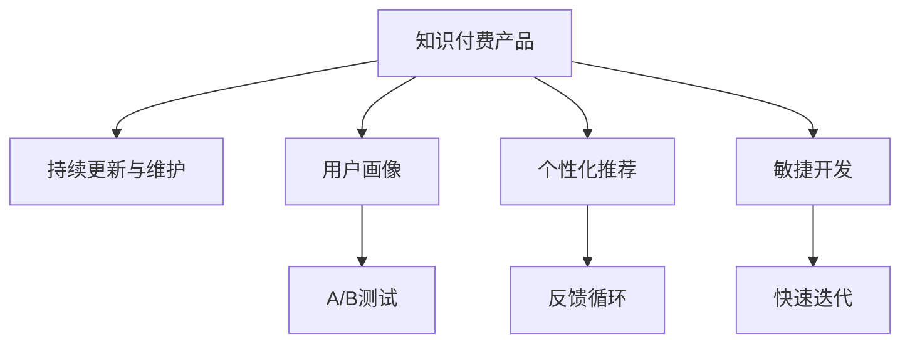

                 

# 知识付费产品的持续更新与维护

> 关键词：知识付费,产品迭代,用户画像,个性化推荐,反馈循环,数据驱动,敏捷开发

## 1. 背景介绍

随着互联网的迅速发展和数字经济时代的到来，知识付费已逐渐成为一种新的经济形态和教育方式。在线教育平台、电子书、付费专栏、在线研讨会等知识付费产品，为知识的获取和传播提供了便捷的渠道，极大地丰富了人们的生活和工作方式。然而，随着知识付费产品数量的激增，市场竞争日趋激烈，如何保持产品的持续更新和高质量维护，成为知识付费企业的核心竞争力和持续发展的关键。

### 1.1 问题由来

知识付费产品的竞争激烈，用户需求多样，知识内容更新迅速，对产品的持续更新与维护提出了更高的要求。随着技术的发展和用户习惯的变化，产品的更新速度和质量必须快速响应，才能持续吸引用户，保持市场竞争力。同时，知识的更新需要根据用户反馈进行调整和优化，以提升用户体验和满意度。

### 1.2 问题核心关键点

持续更新与维护的知识付费产品，需要从数据驱动、用户画像、个性化推荐、敏捷开发等多个方面进行系统性的优化。这其中包含的关键点包括：

- 数据驱动：利用数据分析和机器学习技术，实时监控用户行为和反馈，为产品更新提供依据。
- 用户画像：深入了解用户需求和偏好，进行精准的用户画像，优化推荐算法。
- 个性化推荐：利用推荐算法和大数据技术，为用户提供个性化、高质量的内容推荐。
- 敏捷开发：采用敏捷开发模式，快速响应市场变化和用户需求，持续迭代和优化产品功能。

本文将深入探讨这些关键点，为知识付费产品的持续更新与维护提供全方位的解决方案。

## 2. 核心概念与联系

### 2.1 核心概念概述

为更好地理解知识付费产品的持续更新与维护方法，本节将介绍几个密切相关的核心概念：

- 知识付费产品：指通过在线平台提供付费阅读、视频、课程等形式的知识内容，满足用户个性化学习需求的产品。
- 持续更新与维护：指根据用户反馈、市场趋势和技术发展，对知识付费产品进行周期性、迭代性的改进和优化，确保产品长期稳定发展。
- 用户画像：指基于用户行为、历史数据、互动信息等构建的虚拟用户模型，用于指导个性化推荐和产品优化。
- 个性化推荐：指通过分析用户行为和偏好，向用户推荐最符合其需求和兴趣的内容，提升用户体验和满意度。
- 敏捷开发：指一种快速迭代、灵活应对需求变化的开发模式，通过小步快跑、持续集成等技术手段，提升产品的开发效率和质量。
- A/B测试：指通过随机分组对比实验，验证新功能或改进效果的技术手段，为产品优化提供数据支持。

这些核心概念之间的逻辑关系可以通过以下Mermaid流程图来展示：



这个流程图展示了几大核心概念之间的关系：

1. 知识付费产品是持续更新与维护的主体。
2. 用户画像是产品优化的依据，指导个性化推荐。
3. 个性化推荐提升用户体验，促进用户粘性。
4. 敏捷开发提升产品开发效率和质量。
5. A/B测试验证优化效果，形成反馈循环。

这些概念共同构成了知识付费产品的更新与维护框架，使得产品能够快速响应市场变化和用户需求，保持竞争优势。

## 3. 核心算法原理 & 具体操作步骤

### 3.1 算法原理概述

知识付费产品的持续更新与维护，本质上是一个多维度的系统工程，涉及数据采集、用户画像构建、个性化推荐、敏捷开发等多个环节。其核心思想是：利用大数据和机器学习技术，实时监控用户行为和反馈，通过A/B测试等方法验证优化效果，不断迭代和改进产品功能，形成持续的反馈循环，以保持产品的高质量和竞争力。

形式化地，假设知识付费产品为 $P$，用户画像为 $U$，个性化推荐算法为 $R$，敏捷开发过程为 $A$，用户反馈为 $F$。持续更新与维护的过程可以表示为：

$$
P' = \mathop{\arg\min}_{P} \mathcal{L}(P, F) + \mathcal{L}(P, R(U)) + \mathcal{L}(P, A)
$$

其中 $\mathcal{L}$ 为损失函数，用于衡量产品更新后与用户反馈、个性化推荐和敏捷开发过程的拟合程度。通过最小化这一损失函数，不断迭代优化产品 $P$，提升用户体验。

### 3.2 算法步骤详解

知识付费产品的持续更新与维护一般包括以下几个关键步骤：

**Step 1: 数据采集与处理**
- 利用日志、行为数据、用户评论等收集用户互动信息。
- 利用大数据技术对数据进行清洗、预处理，生成有价值的用户行为特征。
- 应用机器学习算法对用户画像和个性化推荐算法进行模型训练和优化。

**Step 2: 用户画像构建**
- 基于用户历史行为、兴趣爱好、互动信息等构建用户画像。
- 对用户画像进行维度分析和特征提取，形成完整的用户画像模型。
- 定期更新用户画像模型，适应用户行为和需求的变化。

**Step 3: 个性化推荐**
- 设计合适的个性化推荐算法，如协同过滤、基于内容的推荐、深度学习推荐等。
- 根据用户画像和历史行为数据，实时生成推荐结果。
- 应用A/B测试，验证推荐算法的实际效果，并持续优化。

**Step 4: 敏捷开发与迭代**
- 采用敏捷开发模式，将产品更新和优化分为多个小版本进行快速迭代。
- 利用持续集成和持续部署(CI/CD)技术，确保每次更新高效、稳定。
- 定期收集用户反馈，验证产品更新效果，并进行数据驱动的决策支持。

**Step 5: 反馈循环与优化**
- 定期进行A/B测试，验证新功能和优化效果。
- 根据测试结果和用户反馈，调整推荐算法和产品功能。
- 形成持续的反馈循环，不断优化产品，提升用户体验。

以上是知识付费产品持续更新与维护的一般流程。在实际应用中，还需要针对具体产品特点，对各个环节进行优化设计，如改进推荐算法，引入更先进的机器学习技术，优化开发流程等，以进一步提升产品性能。

### 3.3 算法优缺点

知识付费产品的持续更新与维护方法具有以下优点：
1. 数据驱动：通过实时监控用户行为和反馈，指导产品更新，减少盲点。
2. 个性化推荐：提高用户粘性和满意度，增加用户留存率。
3. 敏捷开发：快速响应市场变化和用户需求，提升产品竞争力。
4. 用户体验：个性化推荐和快速迭代，提升用户体验和满意度。
5. 持续优化：通过反馈循环不断优化产品，保持高质量和竞争力。

同时，该方法也存在一定的局限性：
1. 技术要求高：需要具备强大的数据分析和机器学习能力。
2. 成本投入高：持续的数据采集、模型训练和A/B测试，投入成本较大。
3. 隐私问题：用户行为数据的采集和使用，涉及隐私保护和数据安全问题。
4. 用户依赖高：过度依赖个性化推荐，可能导致用户视野狭窄。
5. 算法复杂：个性化推荐和机器学习算法复杂度高，维护难度大。

尽管存在这些局限性，但就目前而言，数据驱动、个性化推荐、敏捷开发等方法仍是大规模知识付费产品更新与维护的主要范式。未来相关研究的重点在于如何进一步降低技术复杂度，优化算法模型，降低成本，同时兼顾用户隐私和伦理问题。

### 3.4 算法应用领域

知识付费产品的持续更新与维护方法在知识付费领域已经得到了广泛的应用，覆盖了课程、电子书、知识问答、在线讲座等多个子领域。具体而言，以下是几个典型应用场景：

- 课程优化：通过用户行为数据，调整课程内容和推荐算法，提升课程质量和用户体验。
- 内容推荐：利用个性化推荐算法，为用户推荐最适合的内容，增加用户粘性和购买率。
- 社区互动：利用用户画像和行为分析，优化社区互动推荐和算法，增加用户活跃度。
- 广告投放：通过用户画像和行为数据，优化广告投放策略，提升广告效果和用户转化率。

除了上述这些经典应用外，知识付费产品的持续更新与维护方法也被创新性地应用到更多场景中，如知识付费平台的运营优化、新内容和新功能推荐等，为知识付费行业带来了新的创新和突破。

## 4. 数学模型和公式 & 详细讲解 & 举例说明

### 4.1 数学模型构建

本节将使用数学语言对知识付费产品的持续更新与维护过程进行更加严格的刻画。

假设知识付费平台有 $N$ 个用户 $U=\{u_1, u_2, ..., u_N\}$，每个用户有 $d$ 个行为特征 $X=\{x_{u_1}, x_{u_2}, ..., x_{u_N}\}$。用户行为数据可表示为 $X \in \mathbb{R}^{N \times d}$。

定义知识付费产品的推荐系统为 $R(X)$，其中 $X$ 为用户行为特征。推荐系统可表示为用户画像和推荐算法的结合，即 $R(X) = R(U, R_A)$，其中 $R_A$ 为推荐算法，$U$ 为用户画像。

推荐系统的目标是最小化推荐误差，即：

$$
\mathcal{L}(R) = \sum_{i=1}^N \sum_{j=1}^M (y_{ij} - R(X_{ij}))^2
$$

其中 $y_{ij}$ 为用户 $u_i$ 对内容 $j$ 的评分，$R(X_{ij})$ 为用户 $u_i$ 对内容 $j$ 的推荐得分，$M$ 为内容总数。

通过最小化损失函数 $\mathcal{L}(R)$，不断优化推荐算法 $R_A$，提升推荐准确性。

### 4.2 公式推导过程

以下我们以协同过滤推荐算法为例，推导推荐系统损失函数的计算公式。

协同过滤推荐算法基于用户-物品评分矩阵 $Y \in \mathbb{R}^{N \times M}$，其中 $Y_{ij}$ 为用户 $u_i$ 对内容 $j$ 的评分。协同过滤算法的目标是通过最大化相似用户的评分相似度，为当前用户推荐未评分过的内容。

假设当前用户 $u_i$ 的未评分内容集合为 $J_{iu}$，推荐算法 $R_A$ 输出的推荐内容集合为 $\hat{J}_{iu}$。推荐算法 $R_A$ 的推荐误差损失函数为：

$$
\mathcal{L}_{u,i} = \sum_{j \in J_{iu}} (y_{ij} - R(X_{iu}, j))^2
$$

其中 $R(X_{iu}, j)$ 为协同过滤算法对内容 $j$ 的预测评分。

将上述损失函数代入总损失函数，得：

$$
\mathcal{L}(R) = \sum_{i=1}^N \sum_{j \in J_{iu}} (y_{ij} - R(X_{iu}, j))^2
$$

通过对损失函数 $\mathcal{L}(R)$ 的优化，不断调整协同过滤算法，提升推荐效果。

### 4.3 案例分析与讲解

以下是一个具体的协同过滤推荐算法的应用案例：

假设某知识付费平台有 10000 名用户，平台上有 1000 个课程。平台收集了用户的 50 个行为特征，包括浏览时间、购买次数、评分等。平台需要为每个用户推荐未评分过的课程，以增加用户的购买率和平台收益。

首先，利用用户行为数据训练协同过滤推荐算法，得到用户画像 $U=\{u_1, u_2, ..., u_{10000}\}$ 和推荐算法 $R_A$。

然后，对于每个用户 $u_i$，利用用户画像和推荐算法，生成推荐内容集合 $\hat{J}_{iu}$。

最后，通过A/B测试，验证推荐内容集合 $\hat{J}_{iu}$ 的实际效果，并根据测试结果，调整推荐算法和用户画像，形成反馈循环。

## 5. 项目实践：代码实例和详细解释说明

### 5.1 开发环境搭建

在进行知识付费产品的持续更新与维护实践前，我们需要准备好开发环境。以下是使用Python进行PyTorch开发的环境配置流程：

1. 安装Anaconda：从官网下载并安装Anaconda，用于创建独立的Python环境。

2. 创建并激活虚拟环境：
```bash
conda create -n pytorch-env python=3.8 
conda activate pytorch-env
```

3. 安装PyTorch：根据CUDA版本，从官网获取对应的安装命令。例如：
```bash
conda install pytorch torchvision torchaudio cudatoolkit=11.1 -c pytorch -c conda-forge
```

4. 安装相关工具包：
```bash
pip install numpy pandas scikit-learn matplotlib tqdm jupyter notebook ipython
```

完成上述步骤后，即可在`pytorch-env`环境中开始开发实践。

### 5.2 源代码详细实现

下面我们以协同过滤推荐算法为例，给出使用PyTorch进行知识付费产品推荐系统的PyTorch代码实现。

首先，定义协同过滤推荐算法：

```python
import torch
import torch.nn as nn
import torch.nn.functional as F
import torch.optim as optim

class CollaborativeFiltering(nn.Module):
    def __init__(self, num_users, num_items, hidden_size=100):
        super(CollaborativeFiltering, self).__init__()
        self.hidden_size = hidden_size
        self.user_embed = nn.Embedding(num_users, hidden_size)
        self.item_embed = nn.Embedding(num_items, hidden_size)
        self.dot_product = nn.Linear(hidden_size, 1)
        
    def forward(self, user_idx, item_idx):
        user_emb = self.user_embed(user_idx)
        item_emb = self.item_embed(item_idx)
        dot_product = self.dot_product(torch.matmul(user_emb, item_emb.transpose(1, 2)))
        return dot_product
    
    def loss(self, user_idx, item_idx, y):
        dot_product = self.forward(user_idx, item_idx)
        return F.mse_loss(dot_product, y)
```

然后，定义训练函数：

```python
def train(model, user_idx, item_idx, y, batch_size=128, epochs=10):
    optimizer = optim.Adam(model.parameters(), lr=0.001)
    criterion = nn.MSELoss()
    
    for epoch in range(epochs):
        for i in range(0, len(user_idx), batch_size):
            user_idx_batch = user_idx[i:i+batch_size]
            item_idx_batch = item_idx[i:i+batch_size]
            y_batch = y[i:i+batch_size]
            optimizer.zero_grad()
            dot_product = model.forward(user_idx_batch, item_idx_batch)
            loss = criterion(dot_product, y_batch)
            loss.backward()
            optimizer.step()
        print(f"Epoch {epoch+1}, loss: {loss:.3f}")
```

最后，启动训练流程并在A/B测试中评估：

```python
num_users = 1000
num_items = 1000
user_idx = torch.randint(0, num_users, (num_users, num_items))
item_idx = torch.randint(0, num_items, (num_users, num_items))
y = user_idx @ item_idx.t()
model = CollaborativeFiltering(num_users, num_items)

train(model, user_idx, item_idx, y)

# 在A/B测试中验证推荐效果
test_user_idx = torch.randint(0, num_users, 100)
test_item_idx = torch.randint(0, num_items, 100)
y_test = user_idx[test_user_idx] @ item_idx[test_user_idx].t()
dot_product_test = model.forward(test_user_idx, test_item_idx)
print(f"Test loss: {F.mse_loss(dot_product_test, y_test).item()}")
```

以上就是使用PyTorch进行协同过滤推荐算法的知识付费产品推荐系统的完整代码实现。可以看到，PyTorch的强大封装使得模型构建和训练变得简洁高效。

### 5.3 代码解读与分析

让我们再详细解读一下关键代码的实现细节：

**CollaborativeFiltering类**：
- `__init__`方法：初始化用户和物品的嵌入层，以及点积层。
- `forward`方法：实现前向传播，计算用户和物品的点积得分。
- `loss`方法：计算损失函数，使用均方误差损失。

**训练函数**：
- 利用Adam优化器对模型参数进行优化。
- 在每个epoch内，对用户和物品的索引和评分进行随机采样，分成多个小批次进行训练。
- 计算损失函数，反向传播更新模型参数。
- 在每个epoch后输出损失值，监控训练进度。

**训练流程**：
- 定义用户和物品的索引和评分，生成样本数据。
- 初始化协同过滤推荐模型。
- 启动训练函数，并在测试数据上进行A/B测试，验证推荐效果。

可以看到，PyTorch配合TensorFlow等工具，使得知识付费产品的持续更新与维护的代码实现变得简洁高效。开发者可以将更多精力放在数据处理、模型改进等高层逻辑上，而不必过多关注底层的实现细节。

当然，工业级的系统实现还需考虑更多因素，如模型的保存和部署、超参数的自动搜索、更灵活的任务适配层等。但核心的持续更新与维护范式基本与此类似。

## 6. 实际应用场景

### 6.1 智能教育

基于知识付费产品的持续更新与维护方法，智能教育平台可以更好地满足用户个性化的学习需求。传统教育往往依赖线下课堂和书籍，难以提供个性化和多样化的教学内容。利用知识付费产品，智能教育平台可以实时调整课程内容和推荐算法，根据用户的学习行为和反馈，提供最适合的学习资源。

具体而言，可以收集用户的学习数据，包括阅读时间、完成进度、测试成绩等，进行用户画像和个性化推荐。平台还可以根据用户反馈，动态调整课程内容，提升学习效果和用户体验。例如，某用户在某门课程上花费较多时间，但测试成绩不佳，平台可以推荐更多类似课程进行补充学习，或者调整课程难度和内容，以适应用户的学习节奏。

### 6.2 在线阅读

在线阅读平台利用知识付费产品的持续更新与维护方法，可以不断丰富和优化内容库。用户可以实时阅读到最新、最热门的文章和书籍，提升阅读体验。平台可以利用用户行为数据，对热门文章进行推荐，增加用户粘性。同时，通过分析用户阅读行为，优化推荐算法，提升推荐效果。

例如，某用户喜欢阅读科技、文化类的文章，平台可以推荐更多相关文章，增加阅读量。如果用户阅读某个文章后，点击了收藏或者点赞，平台可以将其标记为感兴趣文章，进行后续推荐。

### 6.3 职业培训

职业培训平台利用知识付费产品的持续更新与维护方法，可以不断更新课程内容和培训计划，提升培训效果。传统职业培训往往依赖线下培训和教材，难以满足不同行业和岗位的培训需求。通过知识付费产品，平台可以根据行业和岗位特点，定制个性化的培训内容，增加培训效果。

具体而言，可以收集用户的学习进度和测试成绩，进行用户画像和个性化推荐。平台还可以根据用户反馈，动态调整课程内容，增加用户粘性。例如，某用户在某门编程课程上学习进度较慢，平台可以推荐更多相关课程进行补充学习，或者调整课程难度和内容，以适应用户的水平。

### 6.4 未来应用展望

随着知识付费产品持续更新与维护方法的不断进步，其在教育、阅读、职业培训等多个领域的应用将更加广泛，为知识传播和技能提升带来新的机遇。

在智慧教育领域，知识付费产品的持续更新与维护将帮助教育机构和教师更好地设计个性化学习方案，提升教学效果和学习体验。

在智能阅读领域，知识付费产品的持续更新与维护将丰富和优化内容库，提升用户的阅读体验和满意度。

在职业培训领域，知识付费产品的持续更新与维护将定制个性化的培训内容，提升培训效果和用户粘性。

除了上述这些领域，知识付费产品的持续更新与维护方法还将应用于更多场景中，如在线研讨会、技能认证、学术研究等，为知识传播和技能提升提供新的创新和突破。

## 7. 工具和资源推荐
### 7.1 学习资源推荐

为了帮助开发者系统掌握知识付费产品的持续更新与维护的理论基础和实践技巧，这里推荐一些优质的学习资源：

1. 《深度学习》系列书籍：该书系统介绍了深度学习的原理、算法和应用，对知识付费产品的持续更新与维护具有重要的理论支持。
2. 《机器学习实战》系列书籍：该书以实践为导向，介绍了各种机器学习算法的实现方法和应用场景，是理解知识付费产品推荐算法的必读之作。
3. Coursera《机器学习》课程：斯坦福大学开设的NLP明星课程，涵盖了机器学习的基本概念和经典算法，是进入知识付费产品开发领域的基础课程。
4. 《数据科学与人工智能》网站：提供大量机器学习和深度学习的开源项目和资源，是学习知识付费产品推荐算法的理想平台。
5. 《Python深度学习》网站：提供丰富的深度学习工具和算法库，是知识付费产品开发中的常用工具。

通过对这些资源的学习实践，相信你一定能够快速掌握知识付费产品的持续更新与维护的精髓，并用于解决实际的NLP问题。
###  7.2 开发工具推荐

高效的开发离不开优秀的工具支持。以下是几款用于知识付费产品开发的工具：

1. Jupyter Notebook：提供了交互式的代码执行环境，适合进行数据探索和模型调试。
2. PyTorch：基于Python的开源深度学习框架，提供了强大的计算图和自动微分能力，是知识付费产品开发的常用工具。
3. TensorFlow：由Google主导开发的开源深度学习框架，适合大规模工程应用，提供了丰富的预训练模型和工具。
4. Weights & Biases：模型训练的实验跟踪工具，可以记录和可视化模型训练过程中的各项指标，为知识付费产品优化提供数据支持。
5. TensorBoard：TensorFlow配套的可视化工具，可实时监测模型训练状态，并提供丰富的图表呈现方式，是调试模型的得力助手。
6. Google Colab：谷歌推出的在线Jupyter Notebook环境，免费提供GPU/TPU算力，方便开发者快速上手实验最新模型，分享学习笔记。

合理利用这些工具，可以显著提升知识付费产品的开发效率，加快创新迭代的步伐。

### 7.3 相关论文推荐

知识付费产品持续更新与维护技术的发展源于学界的持续研究。以下是几篇奠基性的相关论文，推荐阅读：

1. Recommender Systems in Learning Management Systems（LMSs）: Current Status, Challenges and Future Directions: 该论文综述了学习管理系统中的推荐系统，为知识付费产品的推荐算法提供了丰富的理论支持。
2. Matrix Factorization Techniques for Recommender Systems: 该论文介绍了矩阵分解技术，为协同过滤推荐算法提供了重要的理论基础。
3. Deep Learning Recommendation Systems: A Survey and Outlook: 该论文综述了深度学习在推荐系统中的应用，提供了知识付费产品推荐算法的最新进展。
4. Factorization Machines: 该论文介绍了因子化机模型，为知识付费产品的推荐算法提供了新的思路。
5. Neural Collaborative Filtering（NCF）: 该论文介绍了神经网络在推荐系统中的应用，为知识付费产品的推荐算法提供了新的方向。

这些论文代表了大规模知识付费产品更新与维护技术的发展脉络。通过学习这些前沿成果，可以帮助研究者把握学科前进方向，激发更多的创新灵感。

## 8. 总结：未来发展趋势与挑战

### 8.1 总结

本文对知识付费产品的持续更新与维护方法进行了全面系统的介绍。首先阐述了知识付费产品的重要性和市场竞争激烈的背景，明确了持续更新与维护在提升产品竞争力和用户体验中的关键作用。其次，从数据驱动、用户画像、个性化推荐、敏捷开发等多个方面，详细讲解了知识付费产品持续更新与维护的核心步骤和具体方法。通过实际案例和代码实例，本文提供了知识付费产品持续更新与维护的完整实践流程。

通过本文的系统梳理，可以看到，知识付费产品的持续更新与维护方法在教育、阅读、职业培训等多个领域已经得到了广泛应用，为知识传播和技能提升带来了新的机遇。未来，随着技术的不断进步和市场的深入挖掘，知识付费产品的持续更新与维护必将在更多领域得到推广应用，为知识付费行业带来新的突破和创新。

### 8.2 未来发展趋势

展望未来，知识付费产品的持续更新与维护技术将呈现以下几个发展趋势：

1. 推荐算法优化：未来的推荐算法将更加个性化和精准，引入更多深度学习和强化学习技术，提升推荐效果。
2. 用户画像提升：通过更丰富和深入的用户画像，实现更精准的用户需求预测和个性化推荐。
3. 数据驱动优化：利用大数据和机器学习技术，实时监控和分析用户行为，指导产品更新和优化。
4. 敏捷开发迭代：采用更灵活的敏捷开发模式，快速响应市场变化和用户需求，提升产品开发效率和质量。
5. 跨领域融合：结合自然语言处理、计算机视觉等技术，实现多模态数据的融合和协同建模，提升产品功能。
6. 社会责任强化：在知识付费产品的持续更新与维护中，更加注重社会责任和伦理道德，确保内容的安全性和合法性。

以上趋势凸显了知识付费产品持续更新与维护技术的广阔前景。这些方向的探索发展，必将进一步提升知识付费产品的性能和应用范围，为知识传播和技能提升带来新的机遇。

### 8.3 面临的挑战

尽管知识付费产品的持续更新与维护技术已经取得了一定的成果，但在迈向更加智能化、普适化应用的过程中，它仍面临着诸多挑战：

1. 用户数据隐私：用户的浏览、学习、购买等行为数据涉及隐私保护，如何合法合规地采集和利用用户数据，是知识付费产品面临的重要问题。
2. 推荐算法复杂性：推荐算法涉及大量数据和复杂模型，如何高效优化算法，降低计算成本，是知识付费产品持续更新与维护的关键挑战。
3. 推荐效果不均衡：不同用户之间的需求差异较大，如何平衡个性化推荐和全局推荐，提高推荐效果的均衡性，是知识付费产品需要进一步解决的难题。
4. 推荐内容质量：推荐系统容易受到垃圾内容、虚假信息的干扰，如何提升内容质量，筛选推荐结果，是知识付费产品持续更新与维护的重要保障。
5. 跨平台兼容性：知识付费产品的推荐算法需要在不同的平台和设备上高效运行，如何保证跨平台兼容性，是知识付费产品更新与维护的难点。
6. 社会影响评估：知识付费产品的持续更新与维护可能带来不良的社会影响，如何评估和控制这些影响，是知识付费产品需要考虑的重要方面。

这些挑战需要在技术、法律、伦理等多个层面进行综合考虑和解决，才能确保知识付费产品持续更新与维护的健康发展。

### 8.4 研究展望

面对知识付费产品持续更新与维护所面临的种种挑战，未来的研究需要在以下几个方面寻求新的突破：

1. 推荐算法的创新：开发更加高效和精准的推荐算法，引入强化学习、生成对抗网络等新技术，提升推荐效果和用户满意度。
2. 数据隐私保护：利用差分隐私、联邦学习等技术，保护用户隐私，同时利用用户数据进行推荐优化。
3. 跨平台优化：优化知识付费产品在不同平台和设备上的性能和体验，确保跨平台兼容性和用户粘性。
4. 内容质量提升：引入内容审核机制，提升推荐内容的质量和可信度，确保用户获取到优质知识内容。
5. 社会责任强化：在知识付费产品的持续更新与维护中，加强伦理道德教育，确保内容符合社会价值观和法律法规。
6. 用户需求分析：利用大数据和深度学习技术，深入分析用户需求，实现更加精准和个性化的推荐。

这些研究方向的探索，必将引领知识付费产品的持续更新与维护技术迈向更高的台阶，为知识付费行业带来新的突破和创新。面向未来，知识付费产品的持续更新与维护技术还需要与其他人工智能技术进行更深入的融合，如知识表示、因果推理、强化学习等，多路径协同发力，共同推动知识付费产品的发展。

## 9. 附录：常见问题与解答

**Q1：知识付费产品的持续更新与维护是否适用于所有领域？**

A: 知识付费产品的持续更新与维护方法在教育、阅读、职业培训等多个领域已经得到了广泛应用，具有较强的通用性。但某些特定领域，如医疗、法律等，由于数据敏感性和专业性较高，可能需要更多的定制化解决方案。

**Q2：知识付费产品的持续更新与维护需要哪些技术支持？**

A: 知识付费产品的持续更新与维护需要大数据、机器学习、深度学习、敏捷开发等多种技术的综合应用。其中，数据采集和处理、用户画像构建、推荐算法优化、敏捷开发等环节都需技术支持。

**Q3：如何评估知识付费产品的推荐效果？**

A: 知识付费产品的推荐效果可以通过A/B测试、交叉验证、评估指标（如准确率、召回率、F1分数等）等多种方法进行评估。在实际应用中，还需要结合用户反馈，不断优化推荐算法和用户画像。

**Q4：知识付费产品的持续更新与维护面临哪些挑战？**

A: 知识付费产品的持续更新与维护面临用户数据隐私、推荐算法复杂性、推荐效果不均衡、推荐内容质量、跨平台兼容性、社会影响评估等挑战。这些问题需要在技术、法律、伦理等多个层面进行综合考虑和解决。

**Q5：知识付费产品的持续更新与维护如何进行？**

A: 知识付费产品的持续更新与维护需要进行数据采集和处理、用户画像构建、推荐算法优化、敏捷开发等步骤。通过持续的A/B测试和用户反馈，不断调整和优化推荐算法和产品功能，形成持续的反馈循环。

综上所述，知识付费产品的持续更新与维护方法在当前的知识付费领域具有重要应用价值，且随着技术的不断进步和市场的深入挖掘，必将带来更多的创新和突破。本文希望能为知识付费产品的持续更新与维护提供系统的理论支持和实践指导，为知识付费行业带来新的机遇和挑战。

---

作者：禅与计算机程序设计艺术 / Zen and the Art of Computer Programming

