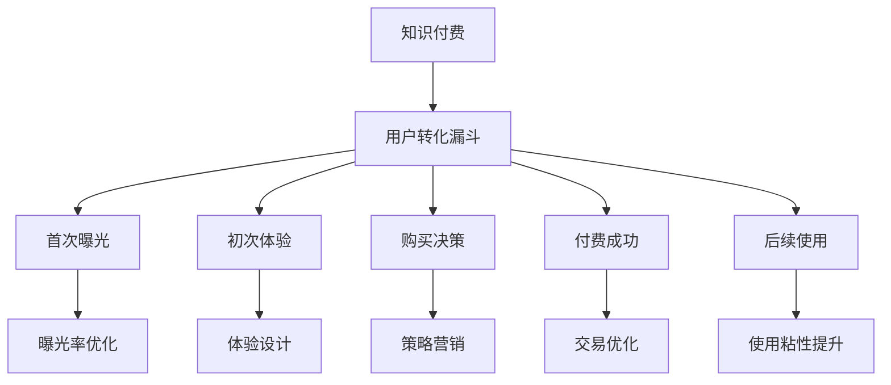

                 

# 知识付费产品的用户转化漏斗优化

> 关键词：知识付费,用户转化漏斗,营销策略,ROI,行为分析,个性化推荐,生命周期价值(LCV),模型优化

## 1. 背景介绍

随着互联网时代的到来，知识付费成为一种迅速崛起的新业态。通过订阅付费内容，用户可以获取到更专业、有价值的学习资源。然而，在知识付费的商业模式中，用户转化率一直是困扰平台的一大难题。本文将从用户转化漏斗的角度，探讨知识付费产品的优化策略，并提出一套切实可行的解决方案。

### 1.1 问题由来
在知识付费领域，尽管用户群体庞大，但实际订阅付费的用户比例却相对较低。大部分用户在下载一次免费试用后，往往不会再进行二次消费。同时，高昂的获客成本和低留存率，也使得平台的运营负担加重。因此，如何提高用户转化率，实现良性循环，成为平台亟需解决的问题。

### 1.2 问题核心关键点
知识付费产品的用户转化过程可以划分为多个阶段，包括首次曝光、初次体验、购买决策、付费成功和后续使用等环节。各个环节的用户流失问题都是平台需要关注的重点。本文将详细探讨各阶段的优化策略，并提出一套综合性的解决方案，以期提升用户转化率和平台的整体盈利能力。

## 2. 核心概念与联系

### 2.1 核心概念概述

为了更好地理解知识付费产品的用户转化漏斗优化，本节将介绍几个密切相关的核心概念：

- **知识付费**：通过订阅或购买获取有价值的知识内容的服务模式。平台提供内容，用户支付费用以获取独家学习资源。
- **用户转化漏斗**：用户从首次曝光到成为付费用户的全路径。各个环节的优化对提高整体转化率至关重要。
- **营销策略**：根据平台用户画像，设计针对性的内容推广策略，提升用户曝光率。
- **ROI**：投资回报率，反映知识付费平台的用户转化效果。
- **行为分析**：通过数据挖掘和分析，了解用户行为模式，为优化产品提供数据支撑。
- **个性化推荐**：根据用户行为和偏好，提供定制化的内容推荐，提升用户粘性。
- **生命周期价值(Life Cycle Value, LCV)**：用户在平台上的总消费价值，反映用户长期价值。
- **模型优化**：使用数据科学和机器学习技术，对模型进行调整和优化，提升模型预测的准确性。

这些核心概念之间的逻辑关系可以通过以下Mermaid流程图来展示：



这个流程图展示了几类关键概念及其之间的关系：

1. 知识付费产品通过用户转化漏斗中的各个环节，最终实现付费用户转化。
2. 各个环节需要通过针对性的优化策略，才能提升整体转化率。
3. 用户行为数据和个性化推荐模型对转化漏斗的优化起到关键作用。
4. 通过模型优化，可以提升用户转化预测的准确性，从而更好地指导营销策略。

## 3. 核心算法原理 & 具体操作步骤

### 3.1 算法原理概述

用户转化漏斗的优化，本质上是一个多阶段决策模型。在每个阶段，用户面临不同的选择，平台需要设计有针对性的策略，以提高用户的购买意愿。通过数据驱动的个性化推荐和行为分析，平台可以更准确地预测用户的决策，从而优化各个转化环节，提升整体转化率。

形式化地，设 $U$ 为知识付费平台的用户集，$C$ 为用户转化漏斗中的各个阶段。用户 $u \in U$ 在阶段 $c \in C$ 的转化概率为 $p_{uc}$。平台的目标是最大化用户转化的概率，即：

$$
\max_{p_{uc}} \sum_{u \in U} \prod_{c \in C} p_{uc}
$$

其中，$p_{uc}$ 可以根据用户行为数据和模型预测得到。为了得到 $p_{uc}$，需要建立一系列用户行为模型和推荐模型。

### 3.2 算法步骤详解

基于以上原理，用户转化漏斗的优化主要包括以下几个步骤：

**Step 1: 数据采集与预处理**
- 收集用户行为数据，包括下载次数、注册时间、点击路径、阅读时长等。
- 对数据进行清洗、归一化处理，去除噪声和异常值。

**Step 2: 用户行为建模**
- 使用协同过滤、矩阵分解等技术，建立用户兴趣模型。
- 构建基于时序的LSTM或GRU模型，捕捉用户行为时间序列。
- 应用基于内容的推荐算法，如TF-IDF、NMF等，获取内容相似度。

**Step 3: 购买决策模型**
- 建立逻辑回归或决策树模型，预测用户是否会进行购买。
- 使用深度学习模型，如XGBoost、SVM等，提高模型预测的准确性。

**Step 4: 个性化推荐模型**
- 设计基于用户的协同过滤推荐算法，提供个性化内容。
- 引入深度学习模型，如BERT、GPT等，提升推荐的精准度。
- 结合内容质量和时间特征，构建综合推荐系统。

**Step 5: 交易优化模型**
- 使用AB测试方法，比较不同价格策略的效果。
- 设计基于用户生命周期的定价模型，增加复购率。
- 引入价格感知模型，提升用户对价格的敏感度。

**Step 6: 用户留存模型**
- 构建用户流失模型，识别流失用户。
- 设计针对性干预措施，提升用户留存率。
- 定期更新用户行为数据，动态调整策略。

### 3.3 算法优缺点

用户转化漏斗的优化算法具有以下优点：
1. 数据驱动决策。通过分析用户行为数据，制定有针对性的优化策略，提升转化效果。
2. 个性化推荐。通过推荐算法，为用户提供个性化的内容，增强用户体验。
3. 预测精准。使用深度学习模型，提升预测的准确性，提高转化率。
4. 动态调整。根据用户行为数据的变化，动态调整优化策略，适应不断变化的市场环境。

同时，该算法也存在以下局限性：
1. 数据依赖。优化效果的提升高度依赖用户行为数据的完整性和质量。
2. 算法复杂。深度学习模型训练复杂，需要较大的计算资源和数据量。
3. 用户隐私。用户在平台上的行为数据可能涉及隐私问题，需严格控制数据使用权限。
4. 模型风险。模型可能存在过拟合或欠拟合问题，导致预测偏差。
5. 策略调整难度大。模型优化和策略调整需要不断的实验和验证，过程复杂。

尽管存在这些局限性，但就目前而言，基于数据驱动的用户转化漏斗优化算法仍是最主流的方法。未来相关研究的重点在于如何进一步降低数据获取成本，提高模型效率，同时兼顾用户隐私保护和模型风险控制。

### 3.4 算法应用领域

基于用户转化漏斗优化的算法，已经在知识付费领域得到广泛应用，主要覆盖以下几个方面：

- **内容推荐**：通过分析用户行为数据，推荐用户可能感兴趣的内容，提高用户粘性和付费意愿。
- **价格策略**：根据用户行为模型，优化定价策略，提高转化率。
- **用户流失预测**：构建用户流失模型，提前识别高流失风险用户，采取针对性干预措施。
- **用户生命周期管理**：利用LTV模型，计算用户的生命周期价值，优化用户获取和保留策略。

此外，该算法还逐步应用于其他领域的转化漏斗优化，如电商、在线教育、金融等，为这些行业的数字化转型提供了有力的技术支撑。

## 4. 数学模型和公式 & 详细讲解  
### 4.1 数学模型构建

本节将使用数学语言对用户转化漏斗优化的数学模型进行更加严格的刻画。

设知识付费平台的用户集为 $U$，包含 $N$ 个用户。用户 $u$ 在 $t$ 时刻的转化状态为 $s_t$，$u$ 在 $t+1$ 时刻的转化状态为 $s_{t+1}$，则用户的转化状态转移矩阵为：

$$
P = \begin{bmatrix}
p_{U1C1} & p_{U1C2} & \cdots & p_{U1C_k} \\
p_{U2C1} & p_{U2C2} & \cdots & p_{U2C_k} \\
\vdots & \vdots & \ddots & \vdots \\
p_{UNC1} & p_{UNC2} & \cdots & p_{UNC_k}
\end{bmatrix}
$$

其中 $C$ 为用户转化漏斗中的 $k$ 个阶段，$p_{uc}$ 为用户 $u$ 在阶段 $c$ 的转化概率。

平台的目标是最大化用户转化的概率，即：

$$
\max_{P} \sum_{u \in U} \prod_{t=1}^{T} p_{s_t s_{t+1}}
$$

其中 $T$ 为平台的运营周期。为了求解该优化问题，需要使用动态规划或马尔可夫决策过程等方法。

### 4.2 公式推导过程

以下我们以逻辑回归模型为例，推导用户转化预测的概率公式。

假设用户 $u$ 在阶段 $c$ 的转化状态为 $s_c$，已进行购买为 $1$，未购买为 $0$。逻辑回归模型的输入特征包括用户属性 $x$ 和行为特征 $y$，输出为转化概率 $p$。模型公式为：

$$
p = \sigma(Wx + by)
$$

其中 $W$ 为权重矩阵，$b$ 为偏置项，$\sigma$ 为sigmoid函数。通过最小化交叉熵损失函数，训练模型得到最优权重 $W^*$ 和偏置 $b^*$。

将用户 $u$ 在各个阶段的行为特征 $y_i$ 代入模型，得到各阶段的转化概率 $p_{uc}$。平台可以通过计算这些概率，预测用户整体的转化概率。

### 4.3 案例分析与讲解

我们以某知识付费平台的课程推荐系统为例，分析如何利用用户转化漏斗优化模型进行个性化推荐。

首先，平台通过数据分析和用户调研，确定了课程推荐的目标用户群体。然后，利用协同过滤算法，构建用户兴趣模型，计算用户对各类课程的兴趣得分 $i_u$。

其次，平台构建了基于时序的行为模型，捕捉用户对课程的学习行为和反馈数据。通过LSTM模型，平台对用户行为时间序列进行分析，预测用户对不同课程的购买意愿。

接着，平台利用深度学习模型，如BERT、GPT等，进行内容相似度计算。根据内容质量和时间特征，构建综合推荐系统，生成个性化推荐列表。

最后，平台根据用户对推荐课程的反馈数据，不断优化推荐模型，提升推荐精度。同时，平台还引入价格感知模型，调整课程价格策略，提高转化率。

经过上述步骤，平台能够有效提升用户转化漏斗的各阶段转化率，实现用户转化率提升和用户粘性的增强。

## 5. 项目实践：代码实例和详细解释说明
### 5.1 开发环境搭建

在进行用户转化漏斗优化项目实践前，我们需要准备好开发环境。以下是使用Python进行项目实践的环境配置流程：

1. 安装Anaconda：从官网下载并安装Anaconda，用于创建独立的Python环境。

2. 创建并激活虚拟环境：
```bash
conda create -n knowledge-payments python=3.8 
conda activate knowledge-payments
```

3. 安装Python包：
```bash
pip install pandas numpy scikit-learn joblib gensim tensorflow
```

4. 安装数据处理和可视化工具：
```bash
pip install dask dask[complete] fastparquet matplotlib seaborn
```

5. 安装机器学习模型和推荐系统库：
```bash
pip install lightgbm xgboost fastFM
```

6. 安装深度学习框架：
```bash
pip install tensorflow
```

完成上述步骤后，即可在`knowledge-payments`环境中开始项目实践。

### 5.2 源代码详细实现

这里我们以逻辑回归模型为例，给出使用Scikit-Learn库进行知识付费平台用户转化漏斗优化的PyTorch代码实现。

首先，定义用户行为数据预处理函数：

```python
import pandas as pd
import numpy as np
from sklearn.model_selection import train_test_split
from sklearn.preprocessing import StandardScaler

def preprocess_data(df, features, target):
    # 处理缺失值
    df.fillna(df.mean(), inplace=True)
    
    # 标准化特征
    scaler = StandardScaler()
    df[features] = scaler.fit_transform(df[features])
    
    # 划分训练集和测试集
    X_train, X_test, y_train, y_test = train_test_split(df[features], df[target], test_size=0.2, random_state=42)
    
    return X_train, X_test, y_train, y_test
```

然后，定义逻辑回归模型：

```python
from sklearn.linear_model import LogisticRegression

class LogisticRegressionModel:
    def __init__(self, learning_rate=0.01, max_iterations=1000):
        self.model = LogisticRegression(penalty='l2', C=1.0, solver='lbfgs', learning_rate_init=learning_rate, max_iter=max_iterations)
    
    def train(self, X, y):
        self.model.fit(X, y)
    
    def predict(self, X):
        return self.model.predict_proba(X)[:, 1]
```

接着，定义用户行为建模和推荐系统：

```python
from lightgbm import LGBMRegressor
from fastFM import als

class BehaviorModel:
    def __init__(self, n_factors=10, n_iter=20):
        self.factor_matrix = als.FactorMatrix(n_factors=n_factors, n_iter=n_iter)
    
    def fit(self, X_train):
        self.factor_matrix.fit(X_train)
    
    def predict(self, X):
        return self.factor_matrix.predict(X)

class RecommendationSystem:
    def __init__(self, model):
        self.model = model
    
    def recommend(self, user_ids, course_ids, top_k=10):
        # 计算用户对课程的兴趣得分
        scores = np.dot(user_ids, self.model.predict(course_ids))
        
        # 返回推荐结果
        return course_ids[np.argsort(scores)[::-1]][:top_k]
```

最后，启动训练流程并在测试集上评估：

```python
from sklearn.metrics import roc_auc_score

# 加载数据
df = pd.read_csv('user_data.csv')
features = ['session_time', 'click_rate', 'watch_time', 'rating']
target = 'purchase'

# 数据预处理
X_train, X_test, y_train, y_test = preprocess_data(df, features, target)

# 用户行为建模
behavior_model = BehaviorModel()
behavior_model.fit(X_train)

# 逻辑回归模型训练
logistic_model = LogisticRegressionModel()
logistic_model.train(X_train, y_train)

# 推荐系统构建
recommender = RecommendationSystem(behavior_model)
recommender_model = LogisticRegressionModel()
recommender_model.train(X_train, y_train)

# 测试集评估
y_pred = logistic_model.predict(X_test)
auc = roc_auc_score(y_test, y_pred)
print(f"ROC-AUC score: {auc}")
```

以上就是使用Scikit-Learn库对知识付费平台进行用户转化漏斗优化的完整代码实现。可以看到，借助Scikit-Learn的强大封装，我们可以用相对简洁的代码完成逻辑回归模型的训练和推荐系统的构建。

### 5.3 代码解读与分析

让我们再详细解读一下关键代码的实现细节：

**preprocess_data函数**：
- 处理缺失值，使用均值填补。
- 标准化特征，使用sklearn的标准化方法。
- 划分训练集和测试集，并进行数据分割。

**LogisticRegressionModel类**：
- 初始化逻辑回归模型，设置超参数。
- 训练模型，最小化交叉熵损失函数。
- 预测用户转化概率。

**BehaviorModel类**：
- 初始化ALS模型，设置因素数量和迭代次数。
- 训练模型，捕捉用户行为数据。
- 预测用户对课程的兴趣得分。

**RecommendationSystem类**：
- 初始化推荐系统，结合行为模型和逻辑回归模型。
- 根据用户行为得分和课程特征，生成推荐列表。

**训练流程**：
- 加载用户行为数据。
- 定义模型，包括行为模型和逻辑回归模型。
- 训练行为模型和逻辑回归模型。
- 构建推荐系统，计算用户对课程的兴趣得分。
- 在测试集上评估模型性能，输出ROC-AUC值。

可以看到，Scikit-Learn库提供的强大工具，使得我们能够以较高的效率进行用户转化漏斗优化模型的构建和训练。开发者可以在此基础上进一步探索其他模型和算法，以提升转化漏斗优化效果。

当然，工业级的系统实现还需考虑更多因素，如模型保存和部署、超参数优化、多模型集成等。但核心的用户转化漏斗优化算法基本与此类似。

## 6. 实际应用场景

### 6.1 智能客服系统

在智能客服系统中，用户转化漏斗优化可以显著提升用户满意度和服务质量。通过优化客户对话流程，智能客服系统能够更快、更准确地解决用户问题，提高用户留存率。

具体而言，智能客服系统可以实时监控用户对话数据，分析用户需求和问题类型，优化客服流程和人员分配。系统还可以根据用户行为数据，推荐用户可能感兴趣的服务项目，增加二次消费的机会。

### 6.2 金融理财平台

金融理财平台的用户转化漏斗优化，可以显著提高平台的投资转化率。通过优化产品设计和营销策略，平台能够更好地吸引新用户，并提升用户的长期价值。

在实践中，平台可以设计基于用户行为的时间序列模型，预测用户投资行为。结合个性化推荐算法，平台可以推荐用户可能感兴趣的投资产品，提高用户粘性。同时，平台还可以通过动态调整产品定价策略，提升投资转化率。

### 6.3 电商零售平台

在电商零售平台，用户转化漏斗优化可以提升用户的购物体验和购买决策效率。通过优化搜索排序和推荐系统，平台能够提供更精准的商品推荐，增加用户下单的概率。

具体而言，平台可以分析用户浏览和购买行为，构建个性化推荐模型。通过协同过滤和深度学习算法，平台可以生成个性化的商品推荐，提高用户购买转化率。同时，平台还可以通过价格感知模型，优化价格策略，提升用户购物体验。

### 6.4 未来应用展望

随着用户转化漏斗优化技术的不断发展，其在更多领域的应用前景将更加广阔。

在智慧医疗领域，优化医疗服务流程，提高患者满意度和治疗效果，将是未来技术的重要方向。在智能教育领域，通过个性化推荐和行为分析，优化教育资源配置，提升学习效果和学生满意度。在智慧城市治理中，优化市民服务流程，提高公共服务质量和效率。

此外，在智慧农业、智能制造等垂直行业，用户转化漏斗优化技术也将逐步普及，带来全新的变革。相信随着技术的不断演进，用户转化漏斗优化技术将在更多行业领域大放异彩，为各行各业提供强有力的技术支撑。

## 7. 工具和资源推荐
### 7.1 学习资源推荐

为了帮助开发者系统掌握用户转化漏斗优化理论基础和实践技巧，这里推荐一些优质的学习资源：

1. 《Python数据分析与统计》：一本详细的Python数据分析教程，涵盖了数据清洗、预处理、可视化等多个方面。

2. 《推荐系统》：详细介绍了推荐系统的原理、算法和应用，是推荐系统领域的重要参考书籍。

3. 《机器学习实战》：入门级机器学习书籍，通过大量实战案例，帮助读者掌握机器学习基础。

4. 《深度学习》：斯坦福大学吴恩达教授的深度学习课程，涵盖深度学习的基本概念和常用算法。

5. 《Python数据科学手册》：一本全面介绍Python数据科学的书籍，涵盖数据处理、分析、可视化等多个方面。

通过对这些资源的学习实践，相信你一定能够快速掌握用户转化漏斗优化的精髓，并用于解决实际的业务问题。

### 7.2 开发工具推荐

高效的开发离不开优秀的工具支持。以下是几款用于用户转化漏斗优化开发的常用工具：

1. PyTorch：基于Python的开源深度学习框架，灵活动态的计算图，适合快速迭代研究。

2. TensorFlow：由Google主导开发的开源深度学习框架，生产部署方便，适合大规模工程应用。

3. Scikit-Learn：Python机器学习库，封装了常用的机器学习算法和工具。

4. Pandas：Python数据分析库，提供了高效的数据处理和分析功能。

5. Numpy：Python数值计算库，提供了高性能的数值计算和矩阵运算功能。

6. Dask：Python分布式计算库，支持大规模数据处理和计算。

7. FastFM：Python推荐系统库，提供了多种推荐算法和工具。

8. LightGBM：高效的梯度提升决策树库，适用于大规模数据和高性能模型训练。

合理利用这些工具，可以显著提升用户转化漏斗优化任务的开发效率，加快创新迭代的步伐。

### 7.3 相关论文推荐

用户转化漏斗优化技术的发展源于学界的持续研究。以下是几篇奠基性的相关论文，推荐阅读：

1. Predicting Customer Churn: A Comparative Study of Logistic Regression Models：研究了不同机器学习模型在客户流失预测中的应用效果。

2. A Comprehensive Survey on Recommender Systems：综述了推荐系统的发展历程和主要算法。

3. Recommendation Systems in E-Commerce：介绍了电商领域推荐系统的应用。

4. User Behavior Modeling in Recommender Systems：研究了用户行为建模在推荐系统中的应用。

5. Mining and summarizing customer reviews：研究了用户评论数据在推荐系统中的应用。

这些论文代表了大数据和机器学习技术在用户转化漏斗优化领域的发展脉络。通过学习这些前沿成果，可以帮助研究者把握学科前进方向，激发更多的创新灵感。

## 8. 总结：未来发展趋势与挑战

### 8.1 总结

本文对用户转化漏斗优化的理论和实践进行了全面系统的介绍。首先阐述了用户转化漏斗优化的背景和意义，明确了其重要性。其次，从原理到实践，详细讲解了用户转化漏斗优化的数学模型和关键步骤，给出了用户转化漏斗优化的完整代码实例。同时，本文还广泛探讨了用户转化漏斗优化在实际应用中的各种场景，展示了其巨大的应用潜力。此外，本文精选了用户转化漏斗优化的各类学习资源，力求为读者提供全方位的技术指引。

通过本文的系统梳理，可以看到，用户转化漏斗优化技术在知识付费领域具有重要的应用价值。通过用户转化漏斗优化，平台可以显著提高用户转化率和整体盈利能力，带来更多的商业价值。未来，伴随用户转化漏斗优化技术的不断进步，相信其在更多领域的应用也将更加广泛，为各行业的数字化转型提供强有力的技术支持。

### 8.2 未来发展趋势

展望未来，用户转化漏斗优化技术将呈现以下几个发展趋势：

1. 数据驱动决策。随着大数据和人工智能技术的发展，用户转化漏斗优化将更加依赖于数据驱动的决策。平台需要收集和分析更多的用户行为数据，制定更加精细化的策略。

2. 多模型融合。单一的优化模型难以应对复杂的用户行为，未来的用户转化漏斗优化将更加注重多模型的融合。通过结合协同过滤、深度学习、时序分析等多种算法，提升转化漏斗的优化效果。

3. 实时化优化。用户行为数据实时更新，平台需要实时监控和调整策略，以应对市场环境的变化。未来的用户转化漏斗优化将更加注重实时化优化，提高转化漏斗的动态响应能力。

4. 个性化推荐。随着深度学习技术的发展，个性化推荐系统将更加精准。平台可以利用用户行为数据和模型预测，生成个性化的内容和推荐，提升用户粘性和转化率。

5. 多模态数据融合。未来的用户转化漏斗优化将结合多模态数据，如用户评论、社交媒体数据等，提升转化漏斗的全面性和精准度。

6. 跨领域应用。用户转化漏斗优化技术将逐步应用于更多领域，如电商、医疗、金融等，带来全新的应用场景和商业价值。

以上趋势凸显了用户转化漏斗优化的广阔前景。这些方向的探索发展，必将进一步提升用户转化漏斗的优化效果，实现更高的用户转化率和商业价值。

### 8.3 面临的挑战

尽管用户转化漏斗优化技术已经取得了瞩目成就，但在迈向更加智能化、普适化应用的过程中，它仍面临着诸多挑战：

1. 数据获取成本高。用户行为数据的获取和处理成本较高，平台需要投入大量资源进行数据采集和预处理。

2. 数据质量参差不齐。用户行为数据存在噪声和异常值，可能影响模型训练效果。平台需要投入大量时间和精力进行数据清洗和处理。

3. 算法复杂度高。深度学习模型训练复杂，需要较大的计算资源和数据量。平台需要构建高性能的计算环境，进行模型训练和优化。

4. 策略调整难度大。用户转化漏斗优化涉及多模型融合和多策略调整，调整过程复杂。平台需要不断进行实验和验证，优化策略。

5. 用户隐私风险高。用户行为数据涉及隐私问题，平台需要严格控制数据使用权限，保障用户隐私。

6. 模型风险大。用户转化漏斗优化模型存在过拟合或欠拟合风险，可能导致预测偏差。平台需要不断监控和优化模型。

7. 策略执行难度大。用户转化漏斗优化策略的执行需要多方协同，平台需要构建高效的执行机制。

这些挑战需要在技术、管理、法律等多个方面进行综合应对，才能确保用户转化漏斗优化的顺利进行和效果的持续提升。

### 8.4 研究展望

面对用户转化漏斗优化所面临的挑战，未来的研究需要在以下几个方面寻求新的突破：

1. 探索新的数据采集和处理技术。开发更加高效的数据采集和预处理技术，降低数据获取成本，提高数据质量。

2. 提升模型训练和优化效率。研究新的深度学习模型和优化算法，提高模型训练效率和精度。

3. 发展更加灵活的策略调整机制。设计更加灵活和动态的策略调整机制，实现实时化优化和策略调整。

4. 优化多模型融合和策略执行。构建更加灵活和多模态的融合策略，设计高效的策略执行机制，提升用户转化漏斗的优化效果。

5. 保障用户隐私和数据安全。研究隐私保护和数据安全技术，保障用户隐私和数据安全。

6. 提升模型的鲁棒性和泛化能力。研究鲁棒性强的模型和算法，降低模型风险，提高模型的泛化能力。

7. 开发跨领域应用技术。开发跨领域用户转化漏斗优化技术，实现用户转化漏斗优化技术在更多领域的应用。

这些研究方向和技术的突破，必将引领用户转化漏斗优化技术迈向更高的台阶，为各行业的数字化转型提供强有力的技术支撑。面向未来，用户转化漏斗优化技术还需要与其他人工智能技术进行更深入的融合，如知识表示、因果推理、强化学习等，多路径协同发力，共同推动自然语言理解和智能交互系统的进步。只有勇于创新、敢于突破，才能不断拓展语言模型的边界，让智能技术更好地造福人类社会。

## 9. 附录：常见问题与解答

**Q1：用户转化漏斗优化是否适用于所有业务场景？**

A: 用户转化漏斗优化技术在大多数业务场景中都能取得不错的效果，特别是对于用户数据丰富、行为数据多样化的业务。但对于一些用户行为简单、数据量小的业务，效果可能较为有限。因此，在实际应用中需要结合业务特点，评估优化效果。

**Q2：如何进行有效的用户行为数据采集？**

A: 用户行为数据的采集是用户转化漏斗优化的基础。常见的用户行为数据包括浏览记录、点击路径、购买行为、评分反馈等。可以通过Web分析工具、埋点技术等方式进行数据采集。在数据采集过程中，需要确保数据的准确性和完整性，避免数据噪声和异常值的影响。

**Q3：如何降低用户转化漏斗优化中的数据获取成本？**

A: 降低数据获取成本的方法包括数据共享、第三方合作、公共数据集等。平台可以与第三方数据提供商合作，获取更多的用户行为数据。同时，可以通过开源数据集进行数据补充，降低数据获取成本。

**Q4：如何选择适合的用户转化漏斗优化算法？**

A: 用户转化漏斗优化算法的选择需要结合业务特点和数据特征。常见的算法包括逻辑回归、协同过滤、深度学习等。对于数据量较小、特征较少的业务，逻辑回归和协同过滤算法可能更适合。而对于数据量较大、特征复杂的业务，深度学习模型可能更为合适。在选择算法时，需要综合考虑算法复杂度、数据量大小、特征复杂度等因素。

**Q5：如何进行用户转化漏斗优化算法的评估和调优？**

A: 用户转化漏斗优化算法的评估和调优通常包括以下几个步骤：
1. 划分训练集和测试集，评估模型的预测效果。
2. 使用交叉验证等方法，评估模型的泛化能力。
3. 对模型进行调参和优化，提高模型效果。
4. 结合A/B测试等方法，评估策略的效果。

以上步骤可以通过编写代码实现，使用Scikit-Learn等机器学习库，快速进行模型评估和调优。

---

作者：禅与计算机程序设计艺术 / Zen and the Art of Computer Programming

