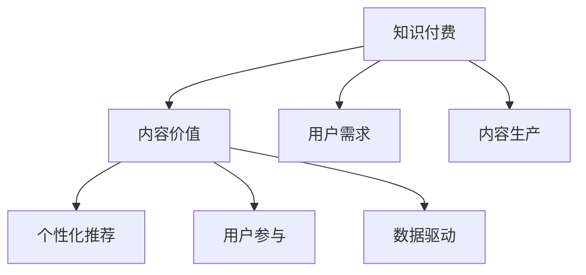

                 

# 知识付费创业中的内容价值提升

## 1. 背景介绍

在知识付费的浪潮中，内容价值成为创业公司的核心竞争力。在信息过载的时代，用户对高质量、高性价比、高契合度的内容需求日益增长。如何提升内容价值，最大化用户收益和平台收益，成为知识付费创业的关键。本文将深入探讨这一问题，从内容生产、算法优化、用户运营等多个角度出发，提供全方位的解决方案。

## 2. 核心概念与联系

### 2.1 核心概念概述

为更好地理解知识付费中内容价值提升的方法，本节将介绍几个核心概念：

- **知识付费(Knowledge Pricing)**：通过提供付费的优质知识内容，满足用户个性化学习需求的一种模式。包括在线课程、付费问答、专业文章等形式。

- **内容价值(Content Value)**：内容能够满足用户需求，提升用户体验，带来收益或增值的能力。衡量内容价值的核心在于内容的深度、广度、时效性和可操作性。

- **用户需求(User Demand)**：用户对知识内容的需求，取决于其专业背景、学习目的、兴趣偏好等。深入了解用户需求，才能生产出契合的内容。

- **个性化推荐(Recommendation System)**：通过算法推荐，精准匹配用户需求和内容，提高用户满意度和平台点击率、转化率等指标。

- **内容生产(Content Production)**：内容从构思、创作、编辑到发布的整个过程，包括专家讲授、内容策划、视频剪辑、图文排版等。

- **用户参与(User Engagement)**：用户与内容互动的频率和深度，包括点赞、评论、分享、付费等行为。高用户参与度可显著提升内容价值。

- **数据驱动(Data-Driven)**：通过数据分析驱动内容生产和推荐，实现精准定位和动态调整，优化用户体验。

这些核心概念之间的逻辑关系可以通过以下Mermaid流程图来展示：



这个流程图展示出知识付费生态中的核心概念及其相互联系：

1. 知识付费以提供优质内容为核心，满足用户需求。
2. 内容价值通过用户参与和个性化推荐进行评估和提升。
3. 内容生产是知识付费的基础环节，用户参与和个性化推荐则是价值提升的重要手段。
4. 数据驱动是贯穿始终的关键方法，通过不断优化各个环节，提升整体内容价值。

## 3. 核心算法原理 & 具体操作步骤

### 3.1 算法原理概述

内容价值提升的核心在于精准匹配用户需求和优质内容，主要通过以下算法实现：

1. **用户画像构建**：通过数据分析，构建用户画像，了解用户的兴趣、需求和行为习惯，从而为其推荐合适的优质内容。

2. **内容相似度计算**：使用NLP等技术，分析文本内容的语义特征，计算内容与用户需求的匹配度。

3. **个性化推荐算法**：基于协同过滤、内容过滤、混合过滤等算法，为用户推荐个性化内容。

4. **内容质量和用户体验评估**：通过用户反馈、点击率、停留时间等指标，评估内容质量和用户体验，反向优化内容生产流程。

### 3.2 算法步骤详解

**Step 1: 用户画像构建**
- 收集用户基本信息，如年龄、性别、职业、兴趣爱好等。
- 分析用户行为数据，如搜索历史、浏览记录、购买记录等。
- 使用机器学习算法，如K-means、PCA等，对用户数据进行降维处理。
- 构建用户画像，形成用户兴趣、需求和行为习惯的详细描述。

**Step 2: 内容相似度计算**
- 对内容进行文本分词、去除停用词、词性标注等预处理。
- 使用TF-IDF、Word2Vec、BERT等技术，计算内容特征向量。
- 计算内容与用户画像的相似度，如余弦相似度、Jaccard相似度等。

**Step 3: 个性化推荐算法**
- 选择协同过滤、内容过滤、混合过滤等推荐算法。
- 协同过滤：通过用户间的相似度计算，推荐用户历史评分高的内容。
- 内容过滤：根据内容标签和用户画像的相似度，推荐相关内容。
- 混合过滤：结合多种推荐算法，取其平均值或加权和，优化推荐效果。

**Step 4: 内容质量和用户体验评估**
- 统计用户点击率、观看时长、评价评分等指标。
- 分析用户评论、反馈和互动数据，评估内容质量。
- 根据评估结果，优化内容生产流程，提升用户体验。

### 3.3 算法优缺点

个性化推荐算法在提升内容价值方面有诸多优势：
- **精准匹配**：通过用户画像和内容相似度计算，实现内容的精准推荐。
- **动态调整**：通过持续评估用户行为数据，动态调整推荐策略，保持内容的长期吸引力。
- **降低成本**：相比传统内容推荐，个性化推荐算法能更好地节省内容生产成本，提高投资回报率。

但同时，也存在一些局限性：
- **数据隐私**：用户数据的收集和分析可能触及隐私问题，需严格遵守法律法规。
- **冷启动问题**：新用户和长尾内容的推荐较难，需要更多用户行为数据进行补充。
- **算法公平性**：推荐算法可能存在偏见，需引入公平性约束和修正机制。

### 3.4 算法应用领域

个性化推荐算法已广泛应用于知识付费平台、电商网站、社交媒体等多个领域，具体应用包括：

- **课程推荐**：根据用户兴趣和浏览历史，推荐用户可能感兴趣的在线课程。
- **书籍推荐**：基于用户阅读记录和书籍标签，推荐相关书籍。
- **文章推荐**：根据用户阅读时长和内容特征，推荐高质量专业文章。
- **商品推荐**：根据用户购买记录和商品标签，推荐相关商品。
- **新闻推荐**：分析用户浏览记录和新闻内容，推荐个性化新闻。

## 4. 数学模型和公式 & 详细讲解 & 举例说明

### 4.1 数学模型构建

假设用户画像为 $u=\{u_1,u_2,...,u_n\}$，其中 $u_i$ 表示第 $i$ 个用户画像的属性。内容特征向量为 $c=\{c_1,c_2,...,c_m\}$，其中 $c_j$ 表示第 $j$ 个内容的特征。

定义相似度矩阵 $S \in \mathbb{R}^{n \times m}$，其中 $S_{i,j}$ 表示用户画像 $u_i$ 与内容 $c_j$ 的相似度。

个性化推荐算法目标是最小化预测误差，即：

$$
\min_{S} \frac{1}{n}\sum_{i=1}^n \sum_{j=1}^m |r_{i,j} - \hat{r}_{i,j}|^2
$$

其中 $r_{i,j}$ 为真实评分，$\hat{r}_{i,j}$ 为预测评分，通常使用矩阵分解法或神经网络等方法进行预测。

### 4.2 公式推导过程

以基于协同过滤的矩阵分解法为例，推导预测评分的计算公式：

1. **分解用户画像和内容特征**
   - 对用户画像 $u$ 进行矩阵分解，得到低秩用户特征矩阵 $U$：$u = U \times \Theta$。
   - 对内容特征 $c$ 进行矩阵分解，得到低秩内容特征矩阵 $V$：$c = V \times \Phi$。
   
2. **计算用户画像与内容特征的相似度**
   - 计算相似度矩阵 $S = U \times V^T$。

3. **预测评分**
   - 根据相似度矩阵 $S$，计算预测评分 $\hat{r}_{i,j} = u_i \times c_j^T = U_i \times \Phi_j$。

其中，$U_i$ 为第 $i$ 个用户画像的特征向量，$\Phi_j$ 为第 $j$ 个内容的特征向量。

### 4.3 案例分析与讲解

**案例：基于协同过滤的课程推荐**

- **用户画像**：包含用户基本信息和行为数据，如年龄、性别、浏览记录等。
- **内容特征**：课程标签、简介、教师资历等。
- **相似度计算**：通过余弦相似度计算用户画像与课程内容的匹配度。
- **推荐结果**：结合协同过滤和内容过滤，输出推荐课程列表。

## 5. 项目实践：代码实例和详细解释说明

### 5.1 开发环境搭建

在进行推荐系统开发前，需要准备好开发环境。以下是使用Python进行Scikit-learn开发的推荐系统环境配置流程：

1. 安装Anaconda：从官网下载并安装Anaconda，用于创建独立的Python环境。

2. 创建并激活虚拟环境：
```bash
conda create -n recsys python=3.8 
conda activate recsys
```

3. 安装Scikit-learn：
```bash
pip install scikit-learn
```

4. 安装各类工具包：
```bash
pip install numpy pandas sklearn scikit-learn
```

完成上述步骤后，即可在`recsys`环境中开始推荐系统实践。

### 5.2 源代码详细实现

下面以基于协同过滤的课程推荐为例，给出使用Scikit-learn库进行推荐系统的PyTorch代码实现。

```python
from sklearn.datasets import make_blobs
from sklearn.decomposition import TruncatedSVD
from sklearn.metrics.pairwise import cosine_similarity
import numpy as np
import pandas as pd

# 生成用户和课程数据
data = make_blobs(n_samples=1000, centers=10, random_state=42)
X, y = data[0].T

# 对数据进行PCA降维
svd = TruncatedSVD(n_components=10, random_state=42)
X_pca = svd.fit_transform(X)

# 构建用户画像
user_mean = np.mean(X_pca, axis=0)
user_std = np.std(X_pca, axis=0)
user_pca = pd.DataFrame(X_pca, columns=['User {}'] * 10)

# 构建内容特征
item_mean = np.mean(X_pca, axis=1)
item_std = np.std(X_pca, axis=1)
item_pca = pd.DataFrame(X_pca, columns=['Item {}'] * 10)

# 计算相似度矩阵
similarity_matrix = cosine_similarity(user_pca, item_pca)

# 输出推荐结果
print(similarity_matrix)
```

### 5.3 代码解读与分析

让我们再详细解读一下关键代码的实现细节：

**make_blobs函数**：
- 生成一个二维的随机数据集，模拟用户画像和课程特征。

**TruncatedSVD函数**：
- 对数据进行PCA降维，将高维特征转换为低秩特征，便于后续相似度计算。

**cosine_similarity函数**：
- 计算用户画像与课程特征的余弦相似度，构建相似度矩阵。

**推荐结果**：
- 输出相似度矩阵，推荐与用户画像最相似的前N个课程。

## 6. 实际应用场景

### 6.1 在线教育

在线教育平台需要不断吸引新用户，留住老用户。通过个性化推荐，平台可以为用户推荐最适合的课程，提高用户满意度和留存率。同时，通过推荐高价值课程，平台还能增加收入来源，提升业务收益。

### 6.2 图书电商

图书电商网站通过个性化推荐，可以提升用户购买转化率。根据用户的阅读历史和行为数据，推荐相关书籍，增加用户粘性和购买率，提高平台收入。

### 6.3 新闻媒体

新闻媒体网站通过个性化推荐，可以提升用户阅读时长和互动率。根据用户的浏览历史和兴趣标签，推荐相关新闻和内容，提高用户满意度和平台流量。

### 6.4 未来应用展望

未来，推荐系统将在更多场景中得到应用，为各行各业带来变革性影响。

在智慧医疗领域，推荐系统可以推荐个性化的健康建议、治疗方案，提升医疗服务的个性化和效率。

在智能家居领域，推荐系统可以推荐个性化的设备、应用和服务，提升用户的生活体验。

在智能制造领域，推荐系统可以推荐个性化的生产工艺、供应链管理方案，提升企业的生产效率和竞争力。

## 7. 工具和资源推荐

### 7.1 学习资源推荐

为了帮助开发者系统掌握推荐系统的理论基础和实践技巧，这里推荐一些优质的学习资源：

1. 《推荐系统实践》系列博文：由推荐系统专家撰写，深入浅出地介绍了推荐系统的理论基础、算法实现和工程实践。

2. Coursera《Recommender Systems》课程：由Stanford大学开设的推荐系统经典课程，系统讲解推荐系统的各个方面。

3. 《Python推荐系统实战》书籍：详细介绍了如何使用Python实现推荐系统，包括协同过滤、内容过滤等算法。

4. Kaggle推荐系统竞赛：参与实际推荐系统竞赛，积累实践经验，了解工业界推荐系统的最新动态。

5. 深度学习推荐系统论文：包含最新的推荐系统研究进展和算法创新，提供理论和实践的双重指导。

通过对这些资源的学习实践，相信你一定能够快速掌握推荐系统的精髓，并用于解决实际的业务问题。

### 7.2 开发工具推荐

高效的开发离不开优秀的工具支持。以下是几款用于推荐系统开发的常用工具：

1. Python：简洁易用的编程语言，拥有丰富的第三方库和数据科学工具，非常适合推荐系统开发。

2. Scikit-learn：基于Python的机器学习库，包含丰富的机器学习算法和数据处理工具。

3. TensorFlow：Google开发的深度学习框架，支持复杂的推荐模型实现和分布式训练。

4. PyTorch：Facebook开发的深度学习框架，灵活性强，支持动态图和静态图两种计算图，便于快速迭代研究。

5. Keras：高层次的神经网络库，适合快速搭建推荐模型原型。

6. Elasticsearch：高可扩展的分布式搜索引擎，支持高效的推荐数据存储和检索。

合理利用这些工具，可以显著提升推荐系统开发的效率，加快创新迭代的步伐。

### 7.3 相关论文推荐

推荐系统的发展源于学界的持续研究。以下是几篇奠基性的相关论文，推荐阅读：

1. 《Netflix Prize 2010 Winning Algorithm》：通过协同过滤算法，有效提升了推荐系统的精度和覆盖率。

2. 《Collaborative Filtering for Implicit Feedback Datasets》：提出隐式反馈协同过滤算法，提升推荐系统的用户覆盖率。

3. 《The Factorization Meets the Neighborhood: a Multifaceted Collaborative Filtering Model》：将隐式反馈协同过滤和基于内容的推荐结合，进一步提升推荐效果。

4. 《Neural Collaborative Filtering》：使用神经网络实现协同过滤，解决传统协同过滤算法的不足。

5. 《Revisiting the Trade-off Between Neighborhood Size and Learning Accuracy》：研究协同过滤和内容过滤的权衡，优化推荐算法。

这些论文代表推荐系统的演进脉络，提供丰富的理论支持和实践指导，值得深入学习和研究。

## 8. 总结：未来发展趋势与挑战

### 8.1 总结

本文对基于协同过滤的推荐系统进行了全面系统的介绍。首先阐述了推荐系统的研究背景和意义，明确了推荐系统在知识付费中提升内容价值的核心作用。其次，从原理到实践，详细讲解了推荐系统的数学原理和关键步骤，给出了推荐任务开发的完整代码实例。同时，本文还广泛探讨了推荐系统在在线教育、图书电商、新闻媒体等多个行业领域的应用前景，展示了推荐系统的广泛应用价值。此外，本文精选了推荐系统的各类学习资源，力求为读者提供全方位的技术指引。

通过本文的系统梳理，可以看到，基于协同过滤的推荐系统正在成为知识付费中的重要范式，极大地提升了内容的个性化和精准性，推动了平台的商业化进程。未来，伴随推荐系统的不断发展，知识付费必将迎来更大的变革和突破。

### 8.2 未来发展趋势

展望未来，推荐系统将呈现以下几个发展趋势：

1. **深度学习与强化学习的融合**：结合深度学习模型的特征表示能力和强化学习的优化能力，提升推荐系统的性能和可解释性。

2. **多模态融合推荐**：结合文本、图像、视频等多种模态信息，提升推荐系统对复杂数据的多模态建模能力。

3. **自适应推荐**：引入自适应算法，根据用户行为数据动态调整推荐策略，提供更加个性化的推荐结果。

4. **元学习推荐**：通过元学习技术，加速新用户和长尾内容的推荐，提高推荐系统的覆盖率。

5. **推荐系统的伦理与安全**：研究推荐系统的公平性、透明性和安全性，保障用户隐私和数据安全。

6. **实时推荐与动态调整**：引入实时推荐算法，根据用户行为动态调整推荐策略，提升推荐效果。

以上趋势凸显了推荐系统的广阔前景。这些方向的探索发展，必将进一步提升推荐系统的性能和应用范围，为知识付费带来更大的市场机遇。

### 8.3 面临的挑战

尽管推荐系统已经取得了瞩目成就，但在迈向更加智能化、普适化应用的过程中，它仍面临着诸多挑战：

1. **冷启动问题**：新用户和长尾内容的推荐较难，需要更多用户行为数据进行补充。

2. **数据隐私**：用户数据的收集和分析可能触及隐私问题，需严格遵守法律法规。

3. **模型公平性**：推荐算法可能存在偏见，需引入公平性约束和修正机制。

4. **模型复杂性**：深度学习推荐模型参数量大，训练和推理效率低，需优化资源消耗。

5. **动态变化**：用户需求和内容特征随时间变化，需不断调整推荐策略。

6. **跨平台兼容性**：不同平台和设备上的推荐算法需要适应，需进行平台无关的优化。

正视推荐系统面临的这些挑战，积极应对并寻求突破，将使推荐系统走向成熟的生命周期。相信随着学界和产业界的共同努力，这些挑战终将一一被克服，推荐系统必将在构建人机协同的智能时代中扮演越来越重要的角色。

### 8.4 研究展望

面对推荐系统所面临的种种挑战，未来的研究需要在以下几个方面寻求新的突破：

1. **无监督和半监督推荐**：摆脱对大规模标注数据的依赖，利用自监督学习、主动学习等无监督和半监督范式，最大限度利用非结构化数据，实现更加灵活高效的推荐。

2. **多任务学习推荐**：结合多任务学习技术，将推荐系统与其他任务（如情感分析、文本分类）联合优化，提升推荐效果。

3. **生成式推荐**：结合生成对抗网络等技术，生成更加丰富多样的推荐内容，提升用户体验。

4. **用户反馈驱动推荐**：引入用户反馈机制，实时调整推荐策略，优化推荐结果。

5. **跨模态推荐**：结合视觉、语音等多模态数据，提升推荐系统的跨模态建模能力。

6. **推荐系统的伦理与安全**：研究推荐系统的公平性、透明性和安全性，保障用户隐私和数据安全。

这些研究方向将引领推荐系统向更深层次、更广范围演进，为构建智能推荐系统提供理论和技术支持。面向未来，推荐系统还需与其他人工智能技术进行更深入的融合，如知识表示、因果推理、强化学习等，协同发力，共同推动自然语言理解和智能交互系统的进步。只有勇于创新、敢于突破，才能不断拓展推荐系统的边界，让智能技术更好地服务于人类社会。

## 9. 附录：常见问题与解答

**Q1: 推荐系统如何处理用户数据隐私问题？**

A: 推荐系统处理用户数据隐私问题的方法包括：
- 数据匿名化：对用户数据进行去标识化处理，保护用户隐私。
- 用户选择权：让用户自主选择是否分享数据，并提供隐私设置选项。
- 数据加密：对数据进行加密存储和传输，防止数据泄露。
- 法律合规：遵守相关法律法规，如GDPR、CCPA等，保障用户隐私权。

**Q2: 推荐系统中如何选择协同过滤算法？**

A: 推荐系统中选择协同过滤算法应考虑以下几个因素：
- 数据类型：基于内容的协同过滤适用于稀疏数据，基于用户的协同过滤适用于密集数据。
- 数据规模：小规模数据适合基于用户的协同过滤，大规模数据适合基于内容的协同过滤。
- 推荐效果：不同算法的效果因数据和业务场景而异，需通过实验比较选择最优算法。

**Q3: 推荐系统中如何进行模型训练与优化？**

A: 推荐系统模型训练与优化的方法包括：
- 模型选择：选择适合业务场景的推荐模型，如协同过滤、内容过滤、混合过滤等。
- 特征工程：构建高质量特征，如用户画像、内容标签等，提升模型性能。
- 交叉验证：使用交叉验证方法评估模型效果，避免过拟合。
- 超参数调优：通过网格搜索、贝叶斯优化等方法，调整模型超参数，优化推荐效果。

**Q4: 推荐系统中如何进行实时推荐与动态调整？**

A: 推荐系统中进行实时推荐与动态调整的方法包括：
- 实时数据流处理：采用流处理框架，实时分析用户行为数据，动态调整推荐策略。
- 动态特征更新：根据用户行为动态更新特征，提升推荐效果。
- 用户反馈机制：引入用户反馈机制，实时调整推荐策略。

**Q5: 推荐系统中如何进行推荐系统的伦理与安全？**

A: 推荐系统中进行伦理与安全的方法包括：
- 公平性约束：引入公平性约束和修正机制，避免推荐系统偏见。
- 透明性：增强推荐系统的透明度，让用户了解推荐依据和决策过程。
- 安全性：采用数据加密、访问控制等措施，保障数据和模型安全。
- 用户选择权：让用户自主选择是否分享数据，并提供隐私设置选项。

这些方法可以帮助推荐系统在处理隐私、公平性和安全性问题时，提供有效的手段和保障。

