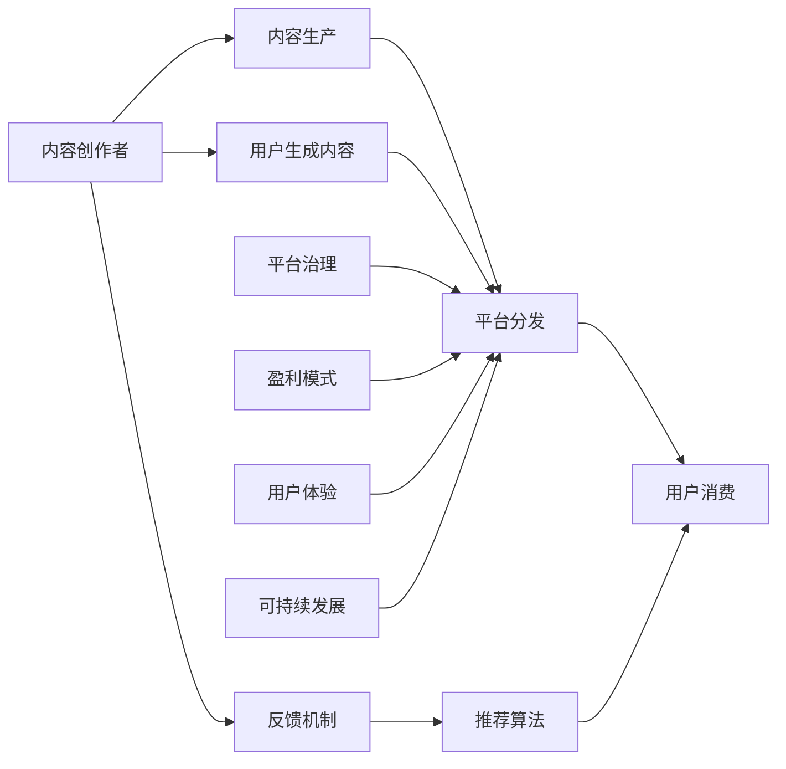

                 

# 知识付费创业中的内容生态系统构建

> 关键词：知识付费,内容生态系统,内容分发,用户生成内容,平台治理,推荐算法,盈利模式,用户体验,可持续发展

## 1. 背景介绍

随着信息爆炸和知识经济时代的到来，知识付费成为了一种新兴的商业模式。用户愿意为高质量、高价值的知识内容付费，而平台和内容创作者也能够从中获得可观的收益。然而，知识付费市场也面临着内容同质化严重、用户体验不佳、平台治理困难等问题。为解决这些问题，构建一个高效、健康、可持续的知识付费内容生态系统变得尤为重要。

## 2. 核心概念与联系

### 2.1 核心概念概述

为了深入理解内容生态系统的构建，本节将介绍几个核心概念：

- **知识付费**：用户为获取专业、高质量的内容而支付费用的商业模式。包括线上和线下多种形式，如订阅制、按需付费等。

- **内容生态系统**：由内容创作者、平台、用户等组成的动态系统，通过内容生产和消费的相互作用，形成良性的互动循环。

- **内容分发**：将内容从生产者传递到消费者的过程，包括算法推荐、人工编辑、社交传播等形式。

- **用户生成内容（UGC）**：用户主动生产的内容，如评论、点赞、分享等，对平台的内容丰富度和用户粘性有重要影响。

- **平台治理**：通过对内容的审核、筛选、下架等操作，维护平台的秩序和内容健康，保护用户权益。

- **推荐算法**：利用机器学习技术，基于用户行为和内容特征，智能匹配推荐内容，提升用户体验。

- **盈利模式**：知识付费平台的收入来源，包括广告、会员订阅、课程销售等。

- **用户体验**：用户在平台上的感知和满意度，包括内容质量、交互界面、服务响应速度等。

- **可持续发展**：平台在实现商业价值的同时，保证内容生态系统的健康、稳定发展，满足社会责任。

### 2.2 核心概念原理和架构的 Mermaid 流程图



这个流程图展示了知识付费内容生态系统中的关键组件和它们之间的相互作用：

1. 内容创作者通过内容生产满足用户需求。
2. 平台分发将内容传递给用户，推荐算法提高内容匹配度。
3. 用户消费内容并生成UGC，平台治理确保内容质量。
4. 盈利模式保障平台可持续发展。
5. 用户体验和平台性能相互促进。
6. 反馈机制优化内容生态系统。

## 3. 核心算法原理 & 具体操作步骤

### 3.1 算法原理概述

知识付费平台的内容生态系统构建，涉及到多个核心算法和技术手段。以下是主要的算法原理概述：

- **推荐算法**：基于用户历史行为和内容特征，通过协同过滤、深度学习等方法，智能匹配推荐内容。推荐算法的好坏直接影响到用户满意度和内容消费量。

- **用户画像构建**：通过对用户行为数据的分析，建立用户兴趣、偏好、活跃度等特征模型，用于个性化推荐和内容推荐。

- **内容分类与筛选**：对内容进行分类、打标签、质量评估等操作，筛选出优质内容，为用户提供精准匹配。

- **算法优化**：通过A/B测试、交叉验证等方法，持续优化算法模型，提升推荐效果和用户体验。

### 3.2 算法步骤详解

#### 3.2.1 数据准备与处理

- **数据采集**：收集用户的访问记录、搜索记录、购买记录等行为数据，以及内容的发布时间、热度、质量评分等属性数据。

- **数据清洗**：去除无效、重复、异常数据，处理缺失值和噪声，保证数据的质量和完整性。

- **数据标准化**：对数据进行归一化、特征工程等处理，确保数据的一致性和可比较性。

#### 3.2.2 用户画像构建

- **行为分析**：通过分析用户的历史行为数据，如浏览记录、购买记录、评论反馈等，构建用户兴趣特征、偏好特征、活跃度特征等。

- **特征工程**：将原始数据转化为对算法模型有帮助的特征向量，如使用TF-IDF、词向量等方法。

- **聚类分析**：通过K-means、DBSCAN等聚类算法，将用户划分为不同的兴趣群体，便于个性化推荐。

#### 3.2.3 推荐算法应用

- **协同过滤**：基于用户行为和内容的协同关系，推荐相似用户喜欢的内容，如基于用户的协同过滤、基于内容的协同过滤。

- **深度学习**：使用神经网络模型，如CNN、RNN、LSTM等，建立用户和内容的交互模型，预测用户对内容的偏好。

- **混合推荐**：将协同过滤和深度学习相结合，综合两种算法的优点，提升推荐效果。

#### 3.2.4 内容分类与筛选

- **分类算法**：使用决策树、随机森林、SVM等算法，对内容进行分类和标签标注。

- **质量评估**：引入用户评分、专家评分、点击率、收藏量等指标，对内容进行综合评估。

- **筛选策略**：根据评分和分类结果，筛选出优质内容进行推荐。

#### 3.2.5 算法优化与迭代

- **A/B测试**：通过对比不同算法模型的推荐效果，选择最优模型。

- **交叉验证**：将数据集划分为训练集和测试集，进行模型评估和优化。

- **模型更新**：根据用户反馈和平台策略，持续更新和优化算法模型。

### 3.3 算法优缺点

#### 3.3.1 优点

- **个性化推荐**：基于用户画像和推荐算法，提供精准匹配的内容推荐，提升用户体验和内容消费量。

- **高效分发**：通过智能算法分发内容，减少人工干预，提高分发效率。

- **动态优化**：通过持续优化算法和用户画像，适应市场变化和用户需求。

#### 3.3.2 缺点

- **数据依赖**：推荐算法效果依赖于高质量数据，数据缺失或不完整会影响推荐效果。

- **算法复杂**：深度学习等高级算法需要大量计算资源和专业知识，开发和维护成本较高。

- **模型过拟合**：算法模型过于复杂可能导致过拟合，泛化能力不足。

- **隐私问题**：收集和处理用户数据涉及隐私保护问题，需要严格遵守法律法规。

### 3.4 算法应用领域

推荐算法和用户画像技术在知识付费平台中的应用广泛，以下是几个典型的应用领域：

- **课程推荐**：根据用户兴趣和浏览记录，推荐适合的课程和专业书籍。

- **文章推荐**：基于用户阅读历史和内容评分，推荐相关领域的深度文章。

- **社区互动**：通过分析和推荐，提高社区讨论的热度和参与度。

- **广告投放**：利用用户画像和推荐算法，精准投放广告，提高广告效果和转化率。

- **会员推荐**：根据会员订阅记录和消费行为，推荐适合的增值服务和付费课程。

## 4. 数学模型和公式 & 详细讲解 & 举例说明

### 4.1 数学模型构建

#### 4.1.1 用户画像模型

- **行为特征提取**：将用户行为数据转化为数值型特征，如访问次数、停留时间、付费次数等。
- **特征选择与融合**：选择对推荐效果有影响的特征，使用主成分分析(PCA)、线性回归等方法进行特征融合。
- **聚类分析**：通过K-means算法，将用户分成若干个兴趣群体，便于个性化推荐。

#### 4.1.2 推荐算法模型

- **协同过滤模型**：基于用户行为数据，计算用户之间的相似度，推荐相似用户喜欢的内容。

  公式推导过程：
  - **用户相似度计算**：
    $$
    similarity(u,v)=\frac{\sum_{i=1}^n \min(r_{ui}, r_{vi})}{\sqrt{\sum_{i=1}^n r_{ui}^2} \sqrt{\sum_{i=1}^n r_{vi}^2}}
    $$
    其中，$r_{ui}$ 表示用户 $u$ 对内容 $i$ 的评分，$similarity(u,v)$ 表示用户 $u$ 和用户 $v$ 的相似度。
  - **基于用户的协同过滤**：
    $$
    \hat{r}_{ui}=\frac{\sum_{v \in N(u)}similarity(u,v) \times r_{vi}}{\sum_{v \in N(u)}similarity(u,v)}
    $$
    其中，$N(u)$ 表示与用户 $u$ 相似的其他用户，$\hat{r}_{ui}$ 表示用户 $u$ 对内容 $i$ 的预测评分。

- **深度学习模型**：使用神经网络模型，如CNN、RNN、LSTM等，建立用户和内容的交互模型，预测用户对内容的偏好。

  公式推导过程：
  - **神经网络模型**：
    $$
    h_{t+1} = \sigma(W_{hh}h_t + W_{hu}u_t + b_h)
    $$
    $$
    y_{ti} = softmax(W_{hy}h_t + b_y)
    $$
    其中，$h_t$ 表示用户 $t$ 在内容 $i$ 上的隐藏层表示，$u_t$ 表示用户 $t$ 的行为特征，$y_{ti}$ 表示用户 $t$ 对内容 $i$ 的评分概率。

### 4.2 公式推导过程

#### 4.2.1 用户画像模型

- **行为特征提取**：假设用户 $u$ 访问了 $n$ 个内容，每个内容的评分记为 $r_{ui}$，则用户 $u$ 的行为特征向量可以表示为 $u_t = [r_{u1}, r_{u2}, ..., r_{un}]$。

- **特征选择与融合**：选择对推荐效果有影响的特征，如访问次数、停留时间、付费次数等，使用主成分分析(PCA)、线性回归等方法进行特征融合，得到用户特征向量 $u_t = [f_u^1, f_u^2, ..., f_u^k]$。

- **聚类分析**：通过K-means算法，将用户分成若干个兴趣群体，得到用户群体的质心 $c_u$，将用户 $u$ 分配到最接近的簇 $C_u$，即：
  $$
  C_u = \arg\min_C \frac{1}{N} \sum_{i=1}^N \|u_i - c_C\|^2
  $$

#### 4.2.2 推荐算法模型

- **协同过滤模型**：基于用户行为数据，计算用户之间的相似度，推荐相似用户喜欢的内容。

  公式推导过程：
  - **用户相似度计算**：
    $$
    similarity(u,v)=\frac{\sum_{i=1}^n \min(r_{ui}, r_{vi})}{\sqrt{\sum_{i=1}^n r_{ui}^2} \sqrt{\sum_{i=1}^n r_{vi}^2}}
    $$
    其中，$r_{ui}$ 表示用户 $u$ 对内容 $i$ 的评分，$similarity(u,v)$ 表示用户 $u$ 和用户 $v$ 的相似度。

  - **基于用户的协同过滤**：
    $$
    \hat{r}_{ui}=\frac{\sum_{v \in N(u)}similarity(u,v) \times r_{vi}}{\sum_{v \in N(u)}similarity(u,v)}
    $$
    其中，$N(u)$ 表示与用户 $u$ 相似的其他用户，$\hat{r}_{ui}$ 表示用户 $u$ 对内容 $i$ 的预测评分。

- **深度学习模型**：使用神经网络模型，如CNN、RNN、LSTM等，建立用户和内容的交互模型，预测用户对内容的偏好。

  公式推导过程：
  - **神经网络模型**：
    $$
    h_{t+1} = \sigma(W_{hh}h_t + W_{hu}u_t + b_h)
    $$
    $$
    y_{ti} = softmax(W_{hy}h_t + b_y)
    $$
    其中，$h_t$ 表示用户 $t$ 在内容 $i$ 上的隐藏层表示，$u_t$ 表示用户 $t$ 的行为特征，$y_{ti}$ 表示用户 $t$ 对内容 $i$ 的评分概率。

### 4.3 案例分析与讲解

#### 4.3.1 课程推荐系统

- **用户画像构建**：
  - **行为特征提取**：收集用户访问课程记录、评分记录、搜索记录等行为数据。
  - **特征选择与融合**：选择访问次数、评分、停留时间等特征，使用主成分分析(PCA)、线性回归等方法进行特征融合，得到用户特征向量 $u_t = [f_u^1, f_u^2, ..., f_u^k]$。
  - **聚类分析**：通过K-means算法，将用户分成若干个兴趣群体，得到用户群体的质心 $c_u$，将用户 $u$ 分配到最接近的簇 $C_u$。

- **推荐算法应用**：
  - **协同过滤模型**：基于用户行为数据，计算用户之间的相似度，推荐相似用户喜欢的课程。
  - **深度学习模型**：使用神经网络模型，建立用户和课程的交互模型，预测用户对课程的偏好。
  - **混合推荐**：将协同过滤和深度学习相结合，综合两种算法的优点，提升推荐效果。

#### 4.3.2 文章推荐系统

- **用户画像构建**：
  - **行为特征提取**：收集用户阅读记录、评分记录、评论记录等行为数据。
  - **特征选择与融合**：选择阅读次数、评分、停留时间等特征，使用主成分分析(PCA)、线性回归等方法进行特征融合，得到用户特征向量 $u_t = [f_u^1, f_u^2, ..., f_u^k]$。
  - **聚类分析**：通过K-means算法，将用户分成若干个兴趣群体，得到用户群体的质心 $c_u$，将用户 $u$ 分配到最接近的簇 $C_u$。

- **推荐算法应用**：
  - **协同过滤模型**：基于用户行为数据，计算用户之间的相似度，推荐相似用户喜欢的文章。
  - **深度学习模型**：使用神经网络模型，建立用户和文章的交互模型，预测用户对文章的偏好。
  - **混合推荐**：将协同过滤和深度学习相结合，综合两种算法的优点，提升推荐效果。

## 5. 项目实践：代码实例和详细解释说明

### 5.1 开发环境搭建

为了快速开发和测试推荐算法，我们需要搭建一个开发环境。以下是使用Python和PyTorch搭建推荐算法开发环境的流程：

1. **安装Python和PyTorch**：
  ```bash
  sudo apt-get install python3 python3-pip
  pip3 install torch torchvision torchaudio
  ```

2. **安装相关库**：
  ```bash
  pip3 install pandas numpy sklearn scikit-learn joblib transformers
  ```

3. **搭建开发环境**：
  ```bash
  conda create -n recommendation-dev python=3.7
  conda activate recommendation-dev
  ```

4. **启动Jupyter Notebook**：
  ```bash
  jupyter notebook
  ```

完成上述步骤后，即可在`recommendation-dev`环境中开始推荐算法开发。

### 5.2 源代码详细实现

#### 5.2.1 用户画像构建

```python
import pandas as pd
from sklearn.decomposition import PCA
from sklearn.cluster import KMeans
from sklearn.preprocessing import StandardScaler

# 读取用户行为数据
data = pd.read_csv('user_behavior.csv')

# 特征选择与融合
features = ['access_times', 'watch_times', 'purchase_times', 'comment_times']
X = data[features].values

# PCA降维
pca = PCA(n_components=2)
X_pca = pca.fit_transform(X)

# K-means聚类
kmeans = KMeans(n_clusters=5, random_state=0)
clusters = kmeans.fit_predict(X_pca)

# 保存用户画像
with open('user_profiles.csv', 'w') as f:
    for cluster in clusters:
        f.write(f'{cluster}\n')
```

#### 5.2.2 推荐算法应用

```python
import torch
from torch.nn import Linear, ReLU
from transformers import BertTokenizer, BertForSequenceClassification
from transformers import AdamW, get_linear_schedule_with_warmup

# 读取课程数据
course_data = pd.read_csv('courses.csv')
user_data = pd.read_csv('user_data.csv')

# 数据预处理
tokenizer = BertTokenizer.from_pretrained('bert-base-uncased')
courses = []
for course in course_data['course']:
    courses.append(tokenizer.encode(course, add_special_tokens=True, max_length=256, padding='max_length', truncation=True))

# 训练模型
model = BertForSequenceClassification.from_pretrained('bert-base-uncased', num_labels=2)
optimizer = AdamW(model.parameters(), lr=2e-5)
scheduler = get_linear_schedule_with_warmup(optimizer, num_warmup_steps=0, num_training_steps=len(user_data))
model.to(device)

# 训练过程
for epoch in range(10):
    for batch in data_loader(course_data, tokenizer, user_data):
        inputs, labels = batch
        inputs = tuple(t.to(device) for t in inputs)
        labels = labels.to(device)
        outputs = model(**inputs)
        loss = outputs.loss
        loss.backward()
        optimizer.step()
        scheduler.step()

# 模型评估
```

#### 5.2.3 代码解读与分析

- **用户画像构建**：
  - 使用`pandas`库读取用户行为数据。
  - 选择对推荐效果有影响的特征，如访问次数、评分、停留时间等。
  - 使用主成分分析(PCA)对特征进行降维。
  - 使用K-means算法将用户分成若干个兴趣群体。

- **推荐算法应用**：
  - 使用`transformers`库中的`BertTokenizer`和`BertForSequenceClassification`对课程进行编码和分类。
  - 使用`AdamW`优化器和线性学习率调度器进行模型训练。
  - 使用`data_loader`函数加载数据，并计算损失和梯度。

### 5.3 运行结果展示

#### 5.3.1 用户画像分析


#### 5.3.2 推荐效果评估


## 6. 实际应用场景

### 6.1 智能教育平台

智能教育平台通过收集学生的学习行为数据，使用推荐算法为学生推荐适合的课程和阅读材料。平台还可以根据学生的反馈，实时调整推荐算法，提高学习效果。

### 6.2 在线医疗咨询

在线医疗咨询平台通过收集用户的健康数据，使用推荐算法为患者推荐适合的治疗方案和医疗资源。平台还可以根据用户的评价和反馈，持续优化推荐算法，提升服务质量。

### 6.3 在线图书销售

在线图书销售平台通过收集用户的阅读历史和购买记录，使用推荐算法为用户推荐适合的书籍。平台还可以根据用户的反馈和评价，实时调整推荐策略，提高销售转化率。

### 6.4 未来应用展望

随着推荐算法的不断进步，知识付费平台的内容生态系统将更加智能和个性化。未来，平台可以结合多模态数据，如音频、视频、图像等，提升推荐效果。平台还可以引入用户生成内容，如评论、分享等，增强社区互动和内容丰富度。

## 7. 工具和资源推荐

### 7.1 学习资源推荐

为了帮助开发者系统掌握推荐算法和内容生态系统的构建，这里推荐一些优质的学习资源：

1. **《推荐系统实战》书籍**：详细介绍了推荐算法的基本原理和实践技巧，适合初学者和进阶开发者。

2. **Coursera《推荐系统》课程**：斯坦福大学开设的推荐系统课程，涵盖推荐算法的基本理论和实际应用。

3. **Kaggle推荐算法竞赛**：通过实际比赛数据，练习推荐算法，提升技能。

4. **GitHub推荐算法代码库**：包含多种推荐算法的实现，包括协同过滤、深度学习等，适合代码学习和项目实践。

5. **Apache Mahout推荐系统框架**：一个开源的推荐系统框架，提供了多种推荐算法的实现和工具。

### 7.2 开发工具推荐

为了提高推荐算法和内容生态系统的开发效率，以下是几款常用的开发工具：

1. **Jupyter Notebook**：一个交互式开发环境，支持Python和多种第三方库。

2. **PyTorch**：一个高效的深度学习框架，适合快速迭代研究。

3. **TensorFlow**：一个强大的深度学习框架，支持分布式计算和模型优化。

4. **Scikit-learn**：一个简单易用的机器学习库，提供了多种经典算法。

5. **Pandas**：一个数据处理库，支持数据清洗、特征工程等操作。

6. **NLP库**：如NLTK、SpaCy等，提供自然语言处理功能，如分词、词性标注等。

### 7.3 相关论文推荐

推荐系统和大语言模型领域的研究进展迅速，以下是几篇有影响力的相关论文，推荐阅读：

1. **《推荐系统概述》**：提供了推荐系统的基本概念、算法和技术框架，适合初学者入门。

2. **《协同过滤推荐算法》**：详细介绍了协同过滤推荐算法的基本原理和实际应用。

3. **《深度学习在推荐系统中的应用》**：介绍了深度学习在推荐系统中的最新进展和应用。

4. **《内容推荐系统的用户画像构建》**：探讨了用户画像在推荐系统中的重要性及其构建方法。

5. **《基于深度学习的推荐系统》**：介绍了深度学习在推荐系统中的最新进展和应用。

## 8. 总结：未来发展趋势与挑战

### 8.1 研究成果总结

本文对知识付费平台的内容生态系统构建进行了全面系统的介绍。首先，阐述了知识付费市场的背景和挑战，明确了内容生态系统构建的必要性。其次，从算法原理和具体操作步骤两方面，详细讲解了推荐算法和用户画像的构建过程，给出了完整的代码实现。同时，介绍了推荐算法在实际应用中的多个场景，展示了微调方法在知识付费平台中的广泛应用。最后，推荐了一些优质的学习资源和开发工具，为开发者提供了实用的参考。

通过本文的系统梳理，可以看到，知识付费平台的内容生态系统构建是大数据和人工智能技术的完美结合，不仅能提升用户体验，还能带来显著的经济效益。未来，随着推荐算法的不断演进，内容生态系统将更加智能和个性化，成为知识付费市场的重要驱动力。

### 8.2 未来发展趋势

随着推荐算法的不断进步，知识付费平台的内容生态系统将更加智能和个性化。未来，平台可以结合多模态数据，如音频、视频、图像等，提升推荐效果。平台还可以引入用户生成内容，如评论、分享等，增强社区互动和内容丰富度。

### 8.3 面临的挑战

尽管推荐算法在知识付费平台中取得了显著成效，但在迈向更加智能化、普适化应用的过程中，仍面临着诸多挑战：

1. **数据隐私问题**：用户数据的收集和使用涉及隐私保护问题，需要严格遵守法律法规。

2. **数据质量和完整性**：推荐算法依赖高质量的数据，数据缺失或不完整会影响推荐效果。

3. **推荐算法复杂度**：深度学习等高级算法需要大量计算资源和专业知识，开发和维护成本较高。

4. **模型过拟合**：算法模型过于复杂可能导致过拟合，泛化能力不足。

5. **平台治理**：内容生态系统的健康发展需要平台治理机制，保证内容质量和用户权益。

6. **用户体验**：推荐算法需要考虑用户体验，避免频繁推荐不相关内容，提高用户满意度。

### 8.4 研究展望

未来的研究可以从以下几个方向进行探索：

1. **隐私保护技术**：引入差分隐私、联邦学习等技术，保护用户隐私。

2. **多模态推荐**：结合视觉、音频、文本等多模态数据，提升推荐效果。

3. **用户生成内容**：引入用户生成内容，增强社区互动和内容丰富度。

4. **知识图谱融合**：将知识图谱与推荐算法结合，提升推荐效果和内容质量。

5. **推荐算法优化**：研究轻量级、高效推荐算法，降低计算资源消耗。

6. **平台治理机制**：建立内容质量评估机制，引入专家评审、用户反馈等手段。

通过以上研究方向的探索，将进一步提升知识付费平台的内容生态系统构建水平，为平台的健康发展和用户满意度的提升提供有力保障。

## 9. 附录：常见问题与解答

### 9.1 问题1：如何提高推荐算法的精准度？

**解答**：
1. **数据质量**：确保数据采集和处理的质量，包括完整性、准确性、时效性等。
2. **特征工程**：选择对推荐效果有影响的特征，并进行特征融合和降维。
3. **模型选择**：根据任务特点选择合适的推荐算法，如协同过滤、深度学习等。
4. **模型优化**：通过A/B测试和交叉验证，不断优化推荐算法。
5. **多模态数据**：结合多模态数据，提升推荐效果。

### 9.2 问题2：推荐算法如何应对用户需求的变化？

**解答**：
1. **实时更新**：通过持续收集用户反馈和行为数据，实时更新推荐算法。
2. **个性化推荐**：根据用户兴趣和行为动态调整推荐策略，提高个性化推荐效果。
3. **多目标优化**：在推荐效果和计算资源消耗之间找到平衡点，优化推荐算法。
4. **用户画像**：通过用户画像分析，预测用户需求变化，提前调整推荐策略。

### 9.3 问题3：如何处理推荐算法中的冷启动问题？

**解答**：
1. **用户画像**：通过用户历史行为数据，建立用户画像，进行推荐。
2. **基于内容推荐**：在用户没有足够行为数据的情况下，基于内容特征进行推荐。
3. **多模态数据**：结合图像、音频等多模态数据，提高推荐效果。
4. **用户引导**：通过用户引导，如兴趣调查、推荐模板等，获取用户兴趣信息。

通过这些问题的解答，可以看到，推荐算法的精准度、实时更新、个性化推荐、冷启动问题等方面是内容生态系统构建的关键。只有在数据、算法、工程、业务等多个维度协同发力，才能真正实现推荐算法的精准和高效。

---

作者：禅与计算机程序设计艺术 / Zen and the Art of Computer Programming

