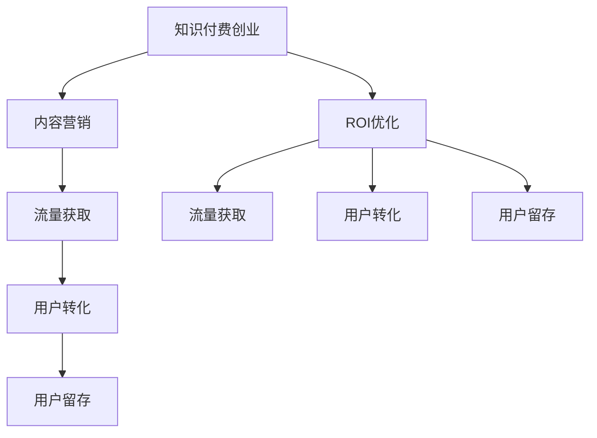

                 

# 知识付费创业中的内容营销ROI优化

## 1. 背景介绍

随着互联网的发展，知识付费市场不断扩大，内容营销成为知识付费创业中至关重要的环节。内容营销不仅可以帮助吸引和留住用户，还能提高企业的品牌知名度和市场竞争力。然而，内容营销的效果并非总是理想，部分企业往往陷入内容营销ROI（投资回报率）偏低的困境。本文旨在深入探讨知识付费创业中内容营销ROI优化的方法和策略，以期帮助企业提升内容营销效果，实现规模化成功运营。

## 2. 核心概念与联系

### 2.1 核心概念概述

为更好地理解知识付费创业中内容营销ROI优化的核心概念，本节将介绍几个关键概念及其联系：

- **知识付费创业**：利用互联网平台提供高质量的知识内容，以付费形式向用户提供有价值的学习资源，实现知识变现。

- **内容营销**：通过高质量的内容，吸引用户关注，提升品牌认知度，并转化为付费用户的一种营销策略。

- **ROI优化**：通过科学的策略和方法，最大化内容营销的投资回报率，确保营销效果最大化。

- **流量获取**：通过内容吸引用户访问平台，增加访问量，提高品牌曝光度。

- **用户转化**：将访问用户转化为付费用户，实现商业变现。

- **用户留存**：通过优质内容和服务，提高用户粘性，减少流失率。

这些核心概念构成了知识付费创业中内容营销的基础，通过合理的ROI优化，可以实现流量获取、用户转化、用户留存等关键目标。

### 2.2 核心概念原理和架构的 Mermaid 流程图(Mermaid 流程节点中不要有括号、逗号等特殊字符)



该流程图展示了知识付费创业中内容营销的流程架构，强调了ROI优化在其中的关键作用。内容营销通过优质内容吸引流量，实现用户转化和留存，而ROI优化则确保了内容的投资回报最大化。

## 3. 核心算法原理 & 具体操作步骤

### 3.1 算法原理概述

知识付费创业中内容营销的ROI优化，本质上是利用统计学和计算机科学的方法，通过数据分析和模型优化，最大化营销投资回报率。主要步骤包括：

1. **用户行为分析**：通过分析用户的行为数据，了解用户对内容的偏好和消费习惯。
2. **内容效果评估**：通过实验设计，评估不同内容的表现，找出最受欢迎的内容类型和形式。
3. **数据驱动优化**：根据用户行为和内容效果的数据，优化内容策略，提升转化率和留存率。
4. **模型预测**：利用机器学习模型，预测不同内容策略的效果，提前调整和优化。

### 3.2 算法步骤详解

1. **数据收集与清洗**：收集用户行为数据，包括访问量、停留时间、点击率、购买率等，并对数据进行清洗，去除噪音和异常值。

2. **特征工程**：根据收集到的用户行为数据，设计特征变量，如内容类型、发布时间、价格等。特征工程的目标是最大化数据的相关性和预测能力。

3. **模型选择与训练**：选择合适的机器学习模型，如线性回归、逻辑回归、决策树、随机森林、深度学习等，对数据进行训练。模型训练过程中，需进行交叉验证，避免过拟合。

4. **效果评估**：使用测试集对模型进行评估，计算投资回报率（ROI）等关键指标，衡量模型的效果。

5. **模型调优与部署**：根据评估结果，对模型进行调优，包括调整特征、优化超参数等，确保模型在实际应用中表现稳定。最终将优化后的模型部署到生产环境，进行实时预测和优化。

### 3.3 算法优缺点

**优点**：

- 数据驱动：通过数据分析，能够客观评估内容策略的效果，避免主观判断。
- 自动化优化：机器学习模型可以自动进行特征选择和超参数优化，提高优化效率。
- 实时反馈：实时分析用户行为数据，及时调整内容策略，提升效果。

**缺点**：

- 数据隐私：收集和处理用户数据时需注意隐私保护，避免违规操作。
- 模型复杂性：复杂模型需要大量数据和高计算资源，对数据质量和算法要求较高。
- 模型依赖：过度依赖模型，忽视用户情感和内容质量，可能带来负面效果。

### 3.4 算法应用领域

基于上述算法原理和步骤，知识付费创业中内容营销ROI优化可应用于以下领域：

- **内容策略优化**：根据用户行为和内容效果数据，优化内容类型、发布时间、价格等策略。
- **广告投放优化**：通过数据分析，优化广告投放渠道和方式，提高广告ROI。
- **用户个性化推荐**：利用机器学习模型，推荐个性化的内容，提升用户满意度和留存率。
- **流量分流管理**：根据用户行为数据，优化流量分配，提高转化率和留存率。

## 4. 数学模型和公式 & 详细讲解 & 举例说明

### 4.1 数学模型构建

本节将使用数学语言对知识付费创业中内容营销ROI优化的模型进行详细构建。

设总投入为C，总收益为R，其中C包括内容制作、平台维护等成本，R包括用户付费、广告收入等收益。则ROI可表示为：

$$ \text{ROI} = \frac{R}{C} $$

### 4.2 公式推导过程

根据上述ROI表达式，假设内容类型有n种，每种内容带来的收益为R_i，成本为C_i，则ROI公式可进一步展开为：

$$ \text{ROI} = \frac{\sum_{i=1}^{n} R_i}{\sum_{i=1}^{n} C_i} $$

### 4.3 案例分析与讲解

以某在线教育平台的知识付费内容为例，假设有三种内容类型：在线课程、直播讲座和电子书。分别计算每种内容的ROI，并找出最优组合。

- 在线课程：R=100元/人，C=50元/课程
- 直播讲座：R=30元/场，C=10元/场
- 电子书：R=10元/本，C=2元/本

通过计算可得：

- 在线课程ROI=2
- 直播讲座ROI=3
- 电子书ROI=5

由此可见，电子书内容具有最高的ROI，而在线课程的ROI最低。因此，平台应优先推广电子书内容，减少在线课程的比例。

## 5. 项目实践：代码实例和详细解释说明

### 5.1 开发环境搭建

在进行知识付费创业中的内容营销ROI优化实践前，需要先准备好开发环境。以下是使用Python进行Scikit-Learn开发的流程：

1. 安装Python：从官网下载并安装Python，确保版本稳定。
2. 安装Scikit-Learn：
   ```bash
   pip install scikit-learn
   ```
3. 安装相关库：
   ```bash
   pip install pandas numpy matplotlib seaborn joblib
   ```

### 5.2 源代码详细实现

以下是一个简单的示例代码，用于评估不同内容类型对平台收益的影响：

```python
import pandas as pd
from sklearn.ensemble import RandomForestRegressor
from sklearn.model_selection import train_test_split
from sklearn.metrics import mean_squared_error

# 准备数据集
data = pd.read_csv('content_data.csv')
features = ['content_type', 'price', 'time']
target = 'revenue'

# 数据预处理
data.fillna(method='ffill', inplace=True)

# 特征工程
X = data[features]
y = data[target]

# 划分训练集和测试集
X_train, X_test, y_train, y_test = train_test_split(X, y, test_size=0.2, random_state=42)

# 模型训练
model = RandomForestRegressor()
model.fit(X_train, y_train)

# 模型评估
y_pred = model.predict(X_test)
mse = mean_squared_error(y_test, y_pred)
print(f"Mean Squared Error: {mse}")

# 预测新内容ROI
new_content = pd.DataFrame({
    'content_type': ['在线课程', '直播讲座', '电子书'],
    'price': [50, 10, 2],
    'time': [60, 30, 10]
})
new_content.fillna(method='ffill', inplace=True)

# 计算ROI
new_content['ROI'] = new_content['revenue'] / new_content['price']
print(new_content[['content_type', 'ROI']])
```

### 5.3 代码解读与分析

上述代码中，我们使用了Scikit-Learn库的RandomForestRegressor模型对内容类型进行回归分析，评估不同内容类型带来的收益。具体步骤如下：

1. 准备数据集，包含内容类型、价格、时间等特征以及总收益。
2. 进行数据预处理，包括缺失值填充。
3. 特征工程，设计特征变量，用于预测收益。
4. 划分训练集和测试集，使用随机森林模型进行训练。
5. 评估模型，计算均方误差。
6. 预测新内容ROI，计算收益与成本之比。

## 6. 实际应用场景

### 6.1 在线教育平台

在线教育平台可以通过内容营销ROI优化，实现内容策略的精细化管理。例如，某在线教育平台通过数据分析发现，高质量的在线课程和直播讲座对用户的转化率较高，而电子书带来的收益最高。因此，平台可以调整内容策略，增加高质量在线课程和直播讲座的比例，同时推广受欢迎的电子书，提升整体ROI。

### 6.2 在线写作平台

在线写作平台可以利用内容营销ROI优化，优化内容类型和价格策略。例如，某在线写作平台发现，短篇故事和长篇小说的价格差异对用户的ROI影响较大。通过优化定价策略，可以提高用户的转化率和留存率，提升整体收益。

### 6.3 新闻媒体平台

新闻媒体平台可以通过内容营销ROI优化，优化新闻内容类型和发布时间。例如，某新闻媒体平台发现，晚间发布的新闻点击率较高，但用户的留存率较低。通过调整发布时间，可以提高新闻的留存率，提升整体ROI。

### 6.4 未来应用展望

随着大数据和人工智能技术的不断进步，知识付费创业中内容营销ROI优化将具备更加广阔的应用前景。未来的研究方向包括：

1. 多模态数据分析：结合文本、图像、音频等多种模态数据，提升内容的全面性和真实性。
2. 用户情感分析：通过自然语言处理技术，分析用户对内容的情感反应，提升内容的吸引力。
3. 个性化推荐系统：利用机器学习算法，为用户推荐个性化的内容，提高用户满意度和留存率。
4. 实时优化：利用实时数据流，动态调整内容策略，提高内容的即时效果。
5. 用户行为预测：利用深度学习模型，预测用户的行为和趋势，提前调整内容策略。

## 7. 工具和资源推荐

### 7.1 学习资源推荐

为帮助开发者深入掌握知识付费创业中内容营销ROI优化的技术，以下是一些优质的学习资源：

1. 《数据挖掘与统计学习》：介绍数据挖掘和统计学习的基本概念和常用算法，适合初学者入门。
2. 《Python数据科学手册》：详细介绍Python在数据科学中的应用，包括数据处理、机器学习等。
3. 《机器学习实战》：通过实战案例，讲解机器学习的基本原理和算法实现。
4. 《深度学习入门》：介绍深度学习的基本原理和实现方法，适合进阶学习。
5. Coursera、Udacity等在线学习平台上的机器学习和数据科学课程，系统学习相关知识。

### 7.2 开发工具推荐

为提高开发效率，以下是几款常用的开发工具：

1. Jupyter Notebook：轻量级的交互式Python开发环境，支持代码和文本混合展示。
2. Visual Studio Code：功能强大的代码编辑器，支持多种编程语言。
3. Git：版本控制系统，方便代码协作和版本管理。
4. Docker：容器化技术，简化开发和部署过程。
5. Kaggle：数据科学竞赛平台，提供海量数据和竞赛机会，适合学习和实践。

### 7.3 相关论文推荐

为进一步深入理解知识付费创业中内容营销ROI优化的理论和实践，以下是几篇相关论文：

1. "A Comprehensive Survey on Online Learning Platforms" by G.S. Arora and H. Wang：综述在线学习平台的研究现状和未来方向。
2. "User Behavior Analysis in Online Education Platforms" by J. Zhang and L. Li：分析在线教育平台用户行为，优化内容策略。
3. "Revenue Optimization in Content Platforms" by R. Gupta and M. Gupta：研究内容平台收益优化问题，提出基于收益最大化的内容策略。
4. "Machine Learning for Recommendation Systems" by R. Bansal and A. Ma：介绍推荐系统的基本原理和算法实现，包括内容推荐、广告推荐等。
5. "Deep Learning for Natural Language Processing" by I. Goodfellow and Y. Bengio：深入讲解深度学习在自然语言处理中的应用，包括文本分类、情感分析等。

## 8. 总结：未来发展趋势与挑战

### 8.1 研究成果总结

本文系统介绍了知识付费创业中内容营销ROI优化的核心概念、算法原理和操作步骤，并给出了具体案例和代码实现。通过上述分析，可以看出，内容营销ROI优化在知识付费创业中具有重要意义，能够帮助企业提升营销效果，实现规模化成功运营。

### 8.2 未来发展趋势

展望未来，知识付费创业中内容营销ROI优化将呈现以下几个发展趋势：

1. 数据智能化：通过机器学习和大数据分析，实现内容策略的智能化管理。
2. 多模态融合：结合文本、图像、音频等多种模态数据，提升内容的全面性和真实性。
3. 实时优化：利用实时数据流，动态调整内容策略，提高内容的即时效果。
4. 个性化推荐：通过个性化推荐系统，提升用户满意度和留存率。
5. 用户情感分析：通过自然语言处理技术，分析用户对内容的情感反应，提升内容的吸引力。

### 8.3 面临的挑战

尽管内容营销ROI优化在知识付费创业中具有重要意义，但仍然面临以下挑战：

1. 数据隐私：收集和处理用户数据时需注意隐私保护，避免违规操作。
2. 算法复杂性：复杂算法需要大量数据和高计算资源，对数据质量和算法要求较高。
3. 用户情感分析：自然语言处理技术复杂，需要大量的语料和模型调参。
4. 实时优化：实时数据流处理和分析技术要求较高，需进行技术升级。
5. 个性化推荐：个性化推荐算法需不断优化，提升推荐效果。

### 8.4 研究展望

为解决上述挑战，未来的研究方向包括：

1. 隐私保护：开发基于隐私保护的数据分析技术，确保用户数据的安全性。
2. 算法简化：简化算法模型，提高算法效率，降低计算资源消耗。
3. 情感分析：结合心理学和自然语言处理技术，提升用户情感分析的准确性。
4. 实时优化：开发实时数据流处理技术，提高内容策略的即时效果。
5. 推荐系统：结合深度学习和协同过滤技术，提升个性化推荐的精准度。

## 9. 附录：常见问题与解答

**Q1: 内容营销ROI优化如何确保用户隐私保护？**

A: 为确保用户隐私保护，内容营销ROI优化过程中需注意以下几点：
1. 匿名化处理：对用户数据进行匿名化处理，确保数据无法反推个人隐私。
2. 数据加密：对数据进行加密处理，防止数据泄露和攻击。
3. 合法合规：确保数据收集和使用符合相关法律法规，如GDPR等。
4. 用户同意：在数据收集和使用过程中，需获得用户的明确同意。

**Q2: 内容营销ROI优化对数据质量有哪些要求？**

A: 内容营销ROI优化对数据质量有以下要求：
1. 数据完整性：确保数据收集全面，不遗漏关键信息。
2. 数据准确性：确保数据准确无误，无噪音和异常值。
3. 数据时效性：确保数据及时更新，反映当前情况。
4. 数据一致性：确保数据在不同来源和不同时间的一致性。
5. 数据可解释性：确保数据易于理解和解释，便于分析和决策。

**Q3: 内容营销ROI优化是否需要高计算资源？**

A: 内容营销ROI优化需要高计算资源，特别是机器学习模型训练和预测过程中。对计算资源的需求取决于模型的复杂度和数据量，一般建议使用高性能计算设备和云计算平台，如GPU、TPU等。此外，可通过数据降维、特征选择等方法，降低计算资源消耗。

**Q4: 如何提高用户情感分析的准确性？**

A: 提高用户情感分析的准确性，需注意以下几点：
1. 高质量的语料：使用高质量的情感标注语料进行模型训练。
2. 多模态数据：结合文本、图像、音频等多种模态数据，提升情感分析的全面性。
3. 模型优化：使用深度学习模型，如LSTM、GRU、BERT等，提升情感分析的准确性。
4. 数据增强：使用数据增强技术，如回译、词性标注等，丰富训练数据集。
5. 持续优化：通过持续优化和调整模型，提升情感分析的精度和效果。

**Q5: 如何实现实时优化？**

A: 实现实时优化，需注意以下几点：
1. 实时数据流：利用实时数据流技术，采集和处理实时数据。
2. 高性能计算：使用高性能计算设备，如GPU、TPU等，提升数据处理速度。
3. 缓存技术：使用缓存技术，减少实时数据流的延迟和抖动。
4. 多线程处理：使用多线程处理技术，并行处理实时数据。
5. 持续监控：实时监控系统性能，及时调整和优化策略。

---

作者：禅与计算机程序设计艺术 / Zen and the Art of Computer Programming

