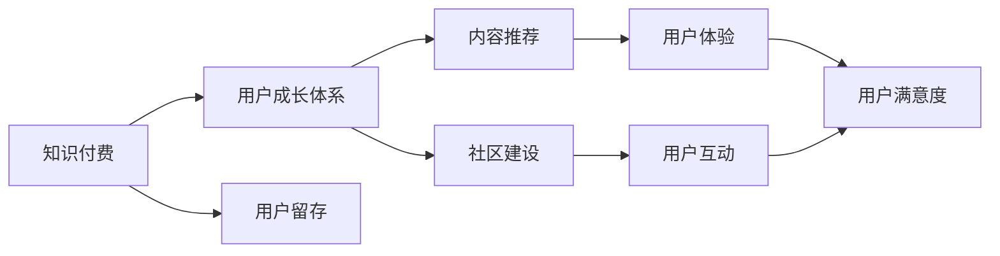

                 

# 知识付费创业中的用户成长体系设计

> 关键词：知识付费、用户成长体系、用户留存、内容推荐、社区建设

## 1. 背景介绍

在数字化信息爆炸的时代，人们对于高质量知识和信息的需求日益增长。知识付费成为了一种新兴的商业模式，旨在通过优质的内容和服务，满足用户对于深入学习的渴望。然而，知识付费行业也面临着用户流失率高、内容同质化严重、社区活跃度低等问题。本文将探讨如何通过构建有效的用户成长体系，提高用户粘性和满意度，推动知识付费业务的可持续发展。

## 2. 核心概念与联系

### 2.1 核心概念概述

#### 2.1.1 知识付费
知识付费是指用户为获取知识、信息和技能，支付一定费用的商业模式。知识付费平台通过提供课程、文章、音频、视频等多种形式的内容，帮助用户解决实际问题，提升个人能力。

#### 2.1.2 用户成长体系
用户成长体系是指通过一系列的策略和机制，激励用户持续参与平台活动，逐步积累成就和奖励，最终形成忠诚用户的体系。用户成长体系设计得好，可以有效提升用户粘性，促进用户留存和消费。

#### 2.1.3 用户留存
用户留存指的是用户在使用平台的过程中，持续访问和参与的比例。高用户留存率意味着平台具有较高的用户粘性和用户生命周期价值。

#### 2.1.4 内容推荐
内容推荐是指通过数据分析和算法优化，为用户推荐最相关的知识和内容，提升用户体验和满意度。内容推荐是知识付费平台的核心功能之一。

#### 2.1.5 社区建设
社区建设指的是通过搭建在线社区，促进用户之间的交流和互动，提升平台的活跃度和用户粘性。社区建设能够增强用户的归属感和参与感。

### 2.2 核心概念之间的联系

知识付费、用户成长体系、用户留存、内容推荐和社区建设之间存在着紧密的联系。用户成长体系通过激励机制和成就系统，提升用户参与度和留存率；内容推荐则通过精准的算法推荐，提升用户体验和满意度；社区建设通过增强用户互动和归属感，进一步提升用户粘性和活跃度。这五个核心概念共同构成了知识付费平台的核心竞争力，缺一不可。




## 3. 核心算法原理 & 具体操作步骤
### 3.1 算法原理概述

用户成长体系的设计基于以下算法原理：

#### 3.1.1 行为触发点设计
用户成长体系的设计需要考虑用户的常见行为，如注册、学习、交流等。通过设计不同行为触发点，激励用户完成相应的任务，逐步积累成就和奖励。

#### 3.1.2 积分与等级系统
积分与等级系统是用户成长体系的核心组成部分。通过积分和等级的设置，激励用户持续参与平台活动，逐步提升等级和积分，从而获得更多的奖励和特权。

#### 3.1.3 成就系统
成就系统通过设定特定的目标和成就，激励用户在特定领域内持续学习和提升。成就系统能够增强用户的学习动力和成就感，提升用户粘性。

#### 3.1.4 推荐系统
推荐系统通过分析用户的历史行为和偏好，为用户推荐最相关的内容。推荐系统能够提升用户体验和满意度，增强用户粘性。

#### 3.1.5 社交网络
社交网络通过建立用户之间的连接和互动，增强用户的归属感和参与感。社交网络能够提升用户粘性和社区活跃度。

### 3.2 算法步骤详解

#### 3.2.1 用户行为触发点设计
1. 分析用户常见行为：注册、学习、交流、分享等。
2. 设计触发点任务：如新用户注册即赠学习时长、参与讨论即获得积分等。
3. 设定触发点奖励：如新用户注册即赠30天免费学习权限、参与讨论即获得10个积分等。

#### 3.2.2 积分与等级系统设计
1. 设定积分计算规则：如每完成一项任务即获得相应积分。
2. 设定等级计算规则：如累计积分达到一定水平即提升一个等级。
3. 设计等级特权：如不同等级的会员享受不同的内容推荐、课程折扣等特权。

#### 3.2.3 成就系统设计
1. 设定成就类型：如认证完成课程、成为社区活跃用户等。
2. 设定成就难度：如完成一门课程即获得认证成就、连续30天活跃即获得社区活跃成就等。
3. 设计成就奖励：如完成课程即获得专属徽章、成为社区活跃用户即获得社区贡献奖等。

#### 3.2.4 推荐系统设计
1. 分析用户历史行为：如学习课程、参与讨论等。
2. 计算用户兴趣偏好：通过协同过滤、内容匹配等算法，计算用户对不同内容的偏好。
3. 设计推荐算法：如基于内容的推荐、协同过滤推荐、混合推荐等。
4. 优化推荐结果：通过A/B测试、用户反馈等，不断优化推荐算法，提升推荐效果。

#### 3.2.5 社交网络设计
1. 设计用户关系模型：如好友关系、关注关系等。
2. 建立用户互动机制：如评论、点赞、私信等。
3. 促进用户互动：如举办线上活动、社区讨论等，增强用户互动和归属感。

### 3.3 算法优缺点

#### 3.3.1 优点
1. 提高用户粘性和留存率：通过积分与等级系统、成就系统等激励机制，激励用户持续参与平台活动，提升用户粘性和留存率。
2. 提升用户体验和满意度：通过内容推荐系统，为每位用户推荐最相关的内容，提升用户体验和满意度。
3. 增强社区活跃度：通过社交网络建设，增强用户之间的互动和归属感，提升社区活跃度。

#### 3.3.2 缺点
1. 设计与运营成本高：用户成长体系的设计与运营需要大量的资源投入，包括时间、人力、技术等。
2. 系统复杂度增加：用户成长体系的设计涉及多个子系统，如积分系统、推荐系统、社交网络等，系统复杂度增加，维护成本高。
3. 用户行为多样性：用户行为多样，难以通过简单的触发点和奖励机制完全覆盖，导致部分用户可能无法获得足够的激励。

### 3.4 算法应用领域

用户成长体系的设计不仅适用于知识付费平台，还广泛应用于电商、游戏、社交网络等多个领域。例如：

- 电商：通过积分与等级系统、推荐系统等，提升用户购买频次和忠诚度。
- 游戏：通过成就系统、社交网络等，增强用户游戏体验和粘性。
- 社交网络：通过积分与等级系统、内容推荐等，提升用户活跃度和社区氛围。

## 4. 数学模型和公式 & 详细讲解 & 举例说明

### 4.1 数学模型构建

#### 4.1.1 用户行为触发点设计模型
用户行为触发点设计模型可以通过以下数学公式表示：

$$
\text{触发点任务} = f(\text{用户行为}, \text{任务规则}, \text{奖励规则})
$$

其中，$f$表示触发点任务的计算函数，$\text{用户行为}$表示用户的当前行为，$\text{任务规则}$表示触发点任务的触发条件，$\text{奖励规则}$表示触发点任务的奖励机制。

#### 4.1.2 积分与等级系统设计模型
积分与等级系统设计模型可以通过以下数学公式表示：

$$
\text{积分} = g(\text{任务完成数}, \text{积分计算规则})
$$

$$
\text{等级} = h(\text{积分}, \text{等级计算规则})
$$

其中，$g$表示积分的计算函数，$\text{任务完成数}$表示用户完成的任务数量，$\text{积分计算规则}$表示积分的计算方式，$h$表示等级的计算函数，$\text{积分}$表示用户的当前积分，$\text{等级计算规则}$表示等级的计算方式。

#### 4.1.3 成就系统设计模型
成就系统设计模型可以通过以下数学公式表示：

$$
\text{成就} = i(\text{任务完成数}, \text{成就难度}, \text{成就奖励})
$$

其中，$i$表示成就的计算函数，$\text{任务完成数}$表示用户完成的任务数量，$\text{成就难度}$表示成就的完成难度，$\text{成就奖励}$表示成就的奖励机制。

#### 4.1.4 推荐系统设计模型
推荐系统设计模型可以通过以下数学公式表示：

$$
\text{推荐内容} = j(\text{用户历史行为}, \text{内容偏好}, \text{推荐算法})
$$

其中，$j$表示推荐的计算函数，$\text{用户历史行为}$表示用户的历史行为数据，$\text{内容偏好}$表示用户对不同内容的偏好，$\text{推荐算法}$表示推荐的内容算法。

#### 4.1.5 社交网络设计模型
社交网络设计模型可以通过以下数学公式表示：

$$
\text{用户关系} = k(\text{用户互动}, \text{关系规则})
$$

其中，$k$表示用户关系的计算函数，$\text{用户互动}$表示用户之间的互动数据，$\text{关系规则}$表示用户关系的计算方式。

### 4.2 公式推导过程

#### 4.2.1 用户行为触发点设计公式推导
用户行为触发点设计公式的推导可以通过以下步骤进行：

1. 确定触发点任务的计算函数$f$。
2. 定义触发点任务的触发条件$\text{任务规则}$，如用户注册即赠学习时长。
3. 定义触发点任务的奖励机制$\text{奖励规则}$，如新用户注册即赠30天免费学习权限。

#### 4.2.2 积分与等级系统设计公式推导
积分与等级系统设计公式的推导可以通过以下步骤进行：

1. 确定积分的计算函数$g$，如每完成一项任务即获得相应积分。
2. 定义积分计算规则，如完成一门课程即获得10个积分。
3. 确定等级的计算函数$h$，如累计积分达到1000分即提升一个等级。
4. 定义等级计算规则，如不同等级会员享受不同的内容推荐和课程折扣。

#### 4.2.3 成就系统设计公式推导
成就系统设计公式的推导可以通过以下步骤进行：

1. 确定成就的计算函数$i$，如完成一门课程即获得认证成就。
2. 定义成就的完成难度，如完成一门课程即获得认证成就。
3. 定义成就的奖励机制，如完成课程即获得专属徽章。

#### 4.2.4 推荐系统设计公式推导
推荐系统设计公式的推导可以通过以下步骤进行：

1. 确定推荐的计算函数$j$，如基于内容的推荐。
2. 分析用户的历史行为数据，如学习课程、参与讨论等。
3. 计算用户对不同内容的偏好，如课程难度、用户评分等。
4. 设计推荐算法，如协同过滤推荐、混合推荐等。
5. 优化推荐结果，如A/B测试、用户反馈等。

#### 4.2.5 社交网络设计公式推导
社交网络设计公式的推导可以通过以下步骤进行：

1. 确定用户关系的计算函数$k$，如好友关系、关注关系等。
2. 定义用户互动数据，如评论、点赞、私信等。
3. 设计用户互动机制，如举办线上活动、社区讨论等。
4. 增强用户互动和归属感，如社交网络建设、用户推荐等。

### 4.3 案例分析与讲解

#### 4.3.1 某在线教育平台的用户成长体系设计
某在线教育平台通过设计用户成长体系，提高了用户粘性和留存率，具体案例如下：

1. 用户行为触发点设计：新用户注册即赠7天免费学习权限，完成一门课程即获得10个积分。
2. 积分与等级系统设计：累计积分达到1000分即提升一个等级，不同等级会员享受不同的课程折扣。
3. 成就系统设计：完成一门课程即获得认证成就，连续学习30天即获得“学习达人”成就。
4. 推荐系统设计：通过协同过滤推荐，为用户推荐最相关的内容，提升用户体验和满意度。
5. 社交网络设计：建立好友关系、评论、点赞等互动机制，增强用户互动和归属感。

## 5. 项目实践：代码实例和详细解释说明

### 5.1 开发环境搭建

在进行用户成长体系的设计与实践时，我们需要准备好开发环境。以下是使用Python进行Flask开发的环境配置流程：

1. 安装Anaconda：从官网下载并安装Anaconda，用于创建独立的Python环境。

2. 创建并激活虚拟环境：
```bash
conda create -n flask-env python=3.8 
conda activate flask-env
```

3. 安装Flask：
```bash
pip install Flask
```

4. 安装SQLAlchemy：
```bash
pip install sqlalchemy
```

5. 安装Flask-SQLAlchemy：
```bash
pip install Flask-SQLAlchemy
```

6. 安装Flask-Login：
```bash
pip install Flask-Login
```

7. 安装Flask-WTF：
```bash
pip install Flask-WTF
```

8. 安装Flask-Mail：
```bash
pip install Flask-Mail
```

完成上述步骤后，即可在`flask-env`环境中开始用户成长体系的设计与实践。

### 5.2 源代码详细实现

下面以某在线教育平台的用户成长体系设计为例，给出Flask应用的代码实现。

首先，定义用户和任务的数据库模型：

```python
from flask_sqlalchemy import SQLAlchemy

db = SQLAlchemy(app)

class User(db.Model):
    id = db.Column(db.Integer, primary_key=True)
    username = db.Column(db.String(80), unique=True, nullable=False)
    email = db.Column(db.String(120), unique=True, nullable=False)
    password_hash = db.Column(db.String(128))
    积分 = db.Column(db.Integer, default=0)
    等级 = db.Column(db.String(10), default='Lv1')
    认证成就 = db.Column(db.String(100), default='')
    社区贡献 = db.Column(db.Integer, default=0)

class Task(db.Model):
    id = db.Column(db.Integer, primary_key=True)
    名称 = db.Column(db.String(80), nullable=False)
    规则 = db.Column(db.String(255), nullable=False)
    奖励 = db.Column(db.String(255), nullable=False)
```

然后，定义触发点任务、积分与等级、成就和推荐系统的相关函数：

```python
from flask_login import UserMixin, LoginManager

login_manager = LoginManager()
login_manager.init_app(app)

@login_manager.user_loader
def load_user(user_id):
    return User.query.get(int(user_id))

@app.route('/')
def home():
    user = login_manager.current_user
    if user.is_authenticated:
        tasks = Task.query.all()
        积分 = user.积分
        等级 = user.等级
        认证成就 = user.认证成就
        社区贡献 = user.社区贡献
    else:
        tasks = []
        积分 = 0
        等级 = 'Lv1'
        认证成就 = ''
        社区贡献 = 0
    return render_template('index.html', user=user, tasks=tasks, 积分=积分, 等级=等级, 认证成就=认证成就, 社区贡献=社区贡献)

@app.route('/complete_task', methods=['POST'])
def complete_task():
    user = login_manager.current_user
    task_id = request.form['task_id']
    task = Task.query.get(task_id)
    if user.积分 < task.积分:
        user.积分 += task.积分
    if user.等级 < task.等级:
        user.等级 = task.等级
    if user.认证成就 < task.认证成就:
        user.认证成就 = task.认证成就
    if user.社区贡献 < task.社区贡献:
        user.社区贡献 = task.社区贡献
    return jsonify({'msg': '任务已完成', '积分': user.积分, '等级': user.等级, '认证成就': user.认证成就, '社区贡献': user.社区贡献})

@app.route('/recommend_content', methods=['GET'])
def recommend_content():
    user = login_manager.current_user
    content = Content.query.filter_by(user_id=user.id).order_by(Content.date.desc()).limit(5).all()
    return render_template('content.html', user=user, content=content)
```

最后，启动Flask应用：

```python
if __name__ == '__main__':
    app.run(debug=True)
```

以上就是使用Flask进行用户成长体系设计的完整代码实现。可以看到，通过Flask框架，可以轻松搭建用户成长体系的数据库、用户登录、任务完成、内容推荐等核心功能。

### 5.3 代码解读与分析

让我们再详细解读一下关键代码的实现细节：

#### 5.3.1 用户和任务的数据库模型定义
- `User`类：定义用户的基本信息，如用户名、邮箱、积分、等级、认证成就和社区贡献。
- `Task`类：定义任务的基本信息，如名称、规则和奖励。

#### 5.3.2 触发点任务、积分与等级、成就和推荐系统的相关函数
- `home`函数：用户登录后，获取用户信息和任务信息，展示用户成长体系的状态。
- `complete_task`函数：用户完成任务后，更新用户的积分、等级、认证成就和社区贡献。
- `recommend_content`函数：为用户推荐最近发布的内容。

#### 5.3.3 Flask应用的启动
- `if __name__ == '__main__':`：判断代码是否为直接运行，如果是则启动Flask应用。

## 6. 实际应用场景

### 6.1 在线教育平台的用户成长体系

在线教育平台通过设计用户成长体系，可以有效提升用户粘性和留存率。具体应用场景如下：

1. 新用户注册即赠学习时长和积分：吸引新用户注册和使用平台，激励用户积极参与。
2. 完成任务后获得积分和等级：通过积分与等级系统，激励用户持续学习和积累成就。
3. 完成特定任务获得认证成就和社区贡献奖：增强用户的成就感和归属感，提升社区活跃度。
4. 基于用户行为推荐最相关的内容：提升用户体验和满意度，增加用户粘性。
5. 建立好友关系和社交网络：增强用户之间的互动和归属感，提升社区氛围。

### 6.2 电商平台的用户成长体系

电商平台通过设计用户成长体系，可以有效提升用户购买频次和忠诚度。具体应用场景如下：

1. 注册即赠优惠券和积分：吸引新用户注册和使用平台，激励用户积极参与。
2. 完成任务后获得积分和等级：通过积分与等级系统，激励用户持续购物和积累成就。
3. 完成特定任务获得认证成就和购物折扣：增强用户的成就感和忠诚度，提升购买频次。
4. 基于用户行为推荐最相关的产品：提升用户体验和满意度，增加用户粘性。
5. 建立好友关系和社交网络：增强用户之间的互动和归属感，提升社区活跃度。

### 6.3 社交网络平台的用户成长体系

社交网络平台通过设计用户成长体系，可以有效提升用户活跃度和社区氛围。具体应用场景如下：

1. 注册即赠虚拟货币和积分：吸引新用户注册和使用平台，激励用户积极参与。
2. 完成任务后获得积分和等级：通过积分与等级系统，激励用户持续互动和积累成就。
3. 完成特定任务获得认证成就和社区贡献奖：增强用户的成就感和归属感，提升社区活跃度。
4. 基于用户行为推荐最相关的内容：提升用户体验和满意度，增加用户粘性。
5. 建立好友关系和社交网络：增强用户之间的互动和归属感，提升社区氛围。

## 7. 工具和资源推荐

### 7.1 学习资源推荐

为了帮助开发者系统掌握用户成长体系的理论基础和实践技巧，这里推荐一些优质的学习资源：

1. 《用户成长体系设计与实施》系列博文：由产品管理专家撰写，深入浅出地介绍了用户成长体系的理论基础和实践方法。

2. 《用户行为分析与数据驱动设计》书籍：从数据驱动的角度，讲解了如何通过用户行为数据，设计有效的用户成长体系。

3. 《产品设计与用户体验》课程：斯坦福大学开设的产品设计课程，讲解了用户成长体系的设计方法和最佳实践。

4. Usability.gov的《设计用户激励机制》指南：详细介绍了如何设计有效的用户激励机制，提高用户参与度和留存率。

5. Nielsen Norman Group的《用户激励和奖赏设计》报告：总结了当前用户激励和奖赏设计的研究成果，为设计用户成长体系提供参考。

通过对这些资源的学习实践，相信你一定能够快速掌握用户成长体系的设计精髓，并用于解决实际的业务问题。

### 7.2 开发工具推荐

高效的开发离不开优秀的工具支持。以下是几款用于用户成长体系开发的常用工具：

1. Flask：基于Python的轻量级Web框架，适合快速搭建用户成长体系的数据库、用户登录、任务完成等核心功能。

2. SQLAlchemy：Python的ORM框架，支持多数据库连接和复杂查询，适合设计用户和任务的数据库模型。

3. Flask-Login：Python的Flask插件，支持用户登录和会话管理，适合实现用户注册、登录等功能。

4. Flask-Mail：Python的Flask插件，支持邮件发送功能，适合向用户发送任务完成通知和成就奖励等。

5. Pysona：用户成长体系的可视化工具，支持多种用户成长体系模型和分析工具，适合设计用户成长体系的数据分析和管理。

合理利用这些工具，可以显著提升用户成长体系的开发效率，加快创新迭代的步伐。

### 7.3 相关论文推荐

用户成长体系的设计与优化源于学界的持续研究。以下是几篇奠基性的相关论文，推荐阅读：

1. "A Dynamic User Engagement Model in E-Learning Environment"：提出基于行为触发的用户成长体系设计方法，有效提升用户参与度和留存率。

2. "User Growth Modeling with Multi-Artefact Attention Mechanism"：采用多维度用户行为数据，设计有效的用户成长体系，提升用户粘性和留存率。

3. "Leveraging Social Networks to Enhance User Engagement in Mobile Applications"：通过社交网络建设，增强用户互动和归属感，提升用户粘性和社区氛围。

4. "Designing Effective User Incentives and Rewards in Mobile Apps"：总结了当前用户激励和奖赏设计的研究成果，为设计用户成长体系提供参考。

这些论文代表了大语言模型微调技术的发展脉络。通过学习这些前沿成果，可以帮助研究者把握学科前进方向，激发更多的创新灵感。

## 8. 总结：未来发展趋势与挑战

### 8.1 研究成果总结

本文对用户成长体系的设计进行了全面系统的介绍。通过系统梳理用户成长体系的各个核心概念和设计原则，展示了用户成长体系在提升用户粘性和留存率方面的重要作用。本文还提供了用户成长体系设计的具体算法原理和具体操作步骤，并通过Flask框架给出了代码实现示例。

### 8.2 未来发展趋势

展望未来，用户成长体系的设计将呈现以下几个发展趋势：

1. 数据驱动的用户成长体系：通过数据分析和机器学习技术，设计更加个性化和精准的用户成长体系，提升用户粘性和留存率。

2. 实时化的用户成长体系：利用实时数据和事件驱动，设计更加动态和即时响应的用户成长体系，增强用户互动和参与感。

3. 社交化的用户成长体系：通过社交网络建设，增强用户之间的互动和归属感，提升社区活跃度和用户粘性。

4. 游戏化的用户成长体系：引入游戏设计元素，设计更加有趣和有挑战性的用户成长体系，提升用户参与度和留存率。

5. 多渠道的用户成长体系：将用户成长体系设计到多种渠道和平台，提升用户覆盖面和参与度，增强用户粘性。

### 8.3 面临的挑战

尽管用户成长体系设计已经取得了显著效果，但在实现过程中仍面临以下挑战：

1. 设计与运营成本高：用户成长体系的设计与运营需要大量的资源投入，包括时间、人力、技术等。

2. 系统复杂度增加：用户成长体系的设计涉及多个子系统，如积分系统、推荐系统、社交网络等，系统复杂度增加，维护成本高。

3. 用户行为多样性：用户行为多样，难以通过简单的触发点和奖励机制完全覆盖，导致部分用户可能无法获得足够的激励。

4. 用户体验优化：用户成长体系的设计需要不断优化用户体验，确保用户能够顺畅完成任务，获得相应的激励。

5. 数据隐私和安全：用户成长体系的设计需要严格保障用户数据隐私和安全，避免数据泄露和滥用。

### 8.4 研究展望

未来的研究需要在以下几个方面寻求新的突破：

1. 数据驱动的用户成长体系设计：通过大数据分析和机器学习技术，设计更加个性化和精准的用户成长体系，提升用户粘性和留存率。

2. 实时化的用户成长体系优化：利用实时数据和事件驱动，设计更加动态和即时响应的用户成长体系，增强用户互动和参与感。

3. 社交化的用户成长体系研究：通过社交网络建设，增强用户之间的互动和归属感，提升社区活跃度和用户粘性。

4. 游戏化的用户成长体系创新：引入游戏设计元素，设计更加有趣和有挑战性的用户成长体系，提升用户参与度和留存率。

5. 多渠道的用户成长体系构建：将用户成长体系设计到多种渠道和平台，提升用户覆盖面和参与度，增强用户粘性。

## 9. 附录：常见问题与解答

**Q1：如何设计有效的用户成长体系？**

A: 设计有效的用户成长体系需要考虑以下几个方面：

1. 用户行为分析：通过数据分析，了解用户常见的行为，如注册、学习、交流等。

2. 触发点设计：设计合理的触发点任务，如新用户注册即赠学习时长、完成一门课程即获得积分等。

3. 积分与等级设计：设定积分和等级的计算规则，激励用户持续参与平台活动。

4. 成就系统设计：设定成就类型和难度，激励用户在特定领域内持续学习和提升。

5. 推荐系统设计：通过数据分析和算法优化，为用户推荐最相关的内容，提升用户体验和满意度。

6. 社交网络设计：通过建立用户之间的连接和互动，增强用户的归属感和参与感。

**Q2：用户成长体系的设计与运营成本高，如何解决？**

A: 用户成长体系的设计与运营成本高，需要采取以下措施：

1. 自动化流程：通过自动化工具和脚本，优化用户成长体系的运营流程，降低人力成本。

2. 数据驱动设计：通过数据分析和机器学习技术，设计更加个性化和精准的用户成长体系，减少运营成本。

3. 协作开发：通过团队协作开发，优化用户成长体系的设计和运营，提升效率。

4. 持续优化：不断收集用户反馈和运营数据，持续优化用户成长体系的设计和运营，提高效果。

**Q3：用户成长体系的设计复杂，如何解决？**

A: 用户成长体系的设计复杂，需要采取以下措施：

1. 模块化设计：将用户成长体系设计为多个模块，分别进行开发和测试，降低系统复杂度。

2. 分阶段实施：分阶段实施用户成长体系的设计和运营，逐步完善系统功能。

3. 技术选型：选择适合的技术和工具，降低开发和维护成本。

4. 持续改进：不断收集用户反馈和运营数据，持续改进用户成长体系的设计和运营，提高效果。

**Q4：用户成长体系的设计难以覆盖所有用户，如何解决？**

A: 用户成长体系的设计难以覆盖所有用户，需要采取以下措施：

1. 多维度设计：考虑不同用户群体的需求和行为，设计多维度的用户成长体系。

2. 个性化推荐：通过数据分析和个性化推荐技术，针对不同用户推荐最适合的任务和奖励。

3. 灵活机制：设计灵活的用户成长体系机制，允许用户根据自身需求和兴趣，选择适合自己的成长路径。

4. 社区互动：通过社区建设，增强用户之间的互动和归属感，提升用户粘性和参与度。

---

作者：禅与计算机程序设计艺术 / Zen and the Art of Computer Programming

