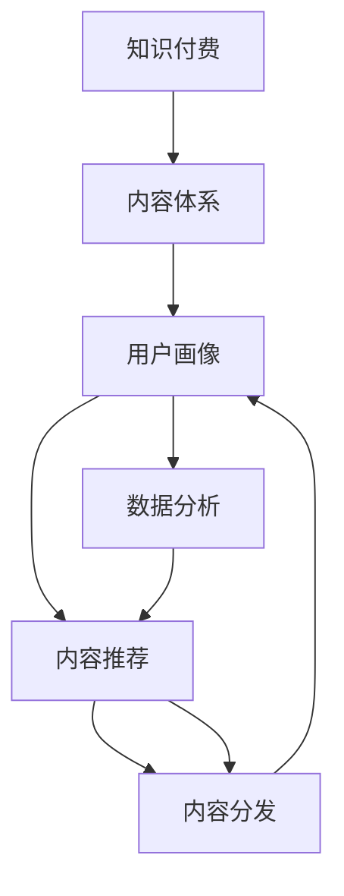

                 

# 知识付费创业的内容体系构建方法

> 关键词：知识付费, 内容体系, 用户需求, 内容分发, 数据分析, 内容推荐, 内容生成, 内容复用

## 1. 背景介绍

### 1.1 问题由来
随着互联网的发展和知识经济的兴起，越来越多的人通过线上获取和分享知识，知识付费模式应运而生。面对繁多的知识内容，如何选择、购买、学习成为用户面临的主要问题。如何构建一个高效、有吸引力的内容体系，让用户能够轻松找到并获取有价值的内容，成为知识付费平台的核心竞争力之一。

### 1.2 问题核心关键点
知识付费创业的内容体系构建，核心在于满足用户需求、提高内容分发效率、提升用户满意度。具体关键点包括：
- 用户需求分析：准确识别用户的知识需求和偏好。
- 内容质量控制：确保内容质量和知识产权合规。
- 内容分发策略：根据用户画像和行为，优化内容推荐和分发。
- 数据驱动优化：利用用户行为数据进行内容优化和推荐。
- 用户反馈机制：建立有效的用户反馈机制，持续改进内容体系。

### 1.3 问题研究意义
构建高效的知识付费内容体系，可以显著提升用户体验和满意度，增加用户黏性，提高平台收益。同时，合理的用户画像和内容推荐，可以降低用户的获取成本，提高知识转化率。

## 2. 核心概念与联系

### 2.1 核心概念概述

为了更好地理解内容体系构建的方法，本节将介绍几个核心概念：

- 知识付费(Knowledge-Based Subscription)：以提供高质量、有价值的知识内容为核心的订阅服务，用户根据内容价值进行付费。
- 内容体系(Content Ecosystem)：由内容生产、分发、消费等多个环节组成的闭环系统，包括内容生产者、消费者和平台管理者三方。
- 用户画像(User Persona)：描述用户特征、行为和需求的模型，通过用户画像指导内容推荐和分发策略。
- 内容推荐(Content Recommendation)：根据用户画像和行为数据，推荐可能感兴趣的内容。
- 内容分发(Content Distribution)：通过多渠道分发内容，使用户可以方便地获取知识。
- 数据分析(Data Analysis)：利用用户行为数据进行内容优化和推荐，提升用户体验。

这些概念之间的关系可以通过以下Mermaid流程图来展示：



这个流程图展示了知识付费创业中内容体系的各个组成部分及其相互关系：

1. 知识付费模式提供高质量知识内容。
2. 内容体系由内容生产、分发、消费三个环节组成，通过用户画像指导内容推荐。
3. 用户画像描述用户特征和行为，指导内容分发和推荐。
4. 内容分发通过多渠道，使用户方便获取知识。
5. 数据分析利用用户行为数据优化内容推荐。
6. 内容推荐根据用户画像和数据分析，进一步提升内容分发效果。

## 3. 核心算法原理 & 具体操作步骤
### 3.1 算法原理概述

知识付费创业的内容体系构建，本质上是一个数据驱动的推荐系统构建过程。其核心思想是：通过收集用户行为数据，建立用户画像和内容画像，利用机器学习算法进行内容推荐，从而优化内容分发和提升用户满意度。

具体来说，内容体系构建涉及以下几个关键步骤：

1. 数据收集：收集用户行为数据（如浏览记录、购买历史、评价反馈等）和内容元数据（如标题、作者、类别、标签等）。
2. 用户画像建模：利用机器学习算法对用户行为数据进行分析，构建用户画像模型，描述用户特征和需求。
3. 内容画像建模：利用机器学习算法对内容元数据进行分析，构建内容画像模型，描述内容质量和相关性。
4. 推荐算法构建：选择合适的推荐算法（如协同过滤、内容推荐、混合推荐等），构建推荐系统，实现内容推荐。
5. 内容分发优化：根据推荐结果，优化内容分发渠道和策略，提升用户获取内容的速度和便捷性。
6. 数据驱动优化：利用用户行为数据不断优化推荐算法和内容分发策略，提升用户体验和满意度。

### 3.2 算法步骤详解

以下是知识付费创业中内容体系构建的具体操作步骤：

**Step 1: 数据收集**
- 收集用户行为数据：包括浏览记录、购买历史、评价反馈、分享行为等。
- 收集内容元数据：包括标题、作者、类别、标签、摘要等。
- 存储数据：使用数据库或数据仓库存储收集到的数据，便于后续分析和处理。

**Step 2: 用户画像建模**
- 数据预处理：对用户行为数据和内容元数据进行清洗、去重、归一化等预处理操作。
- 特征工程：提取有意义的特征，如浏览时间、频率、内容类型、评分等。
- 模型训练：选择适合的机器学习算法（如K-means、PCA、LDA等），对用户行为数据进行建模，得到用户画像。

**Step 3: 内容画像建模**
- 数据预处理：对内容元数据进行清洗、去重、归一化等预处理操作。
- 特征工程：提取有意义的特征，如内容热度、作者可信度、类别相关性等。
- 模型训练：选择适合的机器学习算法（如K-means、PCA、LDA等），对内容元数据进行建模，得到内容画像。

**Step 4: 推荐算法构建**
- 算法选择：选择适合的推荐算法，如协同过滤、内容推荐、混合推荐等。
- 算法实现：使用机器学习框架（如Scikit-learn、TensorFlow、PyTorch等）实现推荐算法。
- 算法评估：使用交叉验证、AUC、RMSE等指标评估推荐算法效果，进行调整和优化。

**Step 5: 内容分发优化**
- 分发渠道：选择适合的线上线下渠道，如APP、网站、社交媒体等。
- 分发策略：根据用户画像和推荐结果，优化内容分发策略，提高用户获取内容的便捷性和效率。
- 反馈机制：建立有效的用户反馈机制，收集用户对内容的反馈，进行持续改进。

**Step 6: 数据驱动优化**
- 数据收集：持续收集用户行为数据和内容反馈数据。
- 数据分析：利用机器学习算法对收集到的数据进行分析，进行内容优化和推荐策略调整。
- 效果评估：使用用户满意度、留存率、回购率等指标评估内容体系的效果，进行持续改进。

### 3.3 算法优缺点

知识付费创业中内容体系构建的推荐算法，具有以下优点：

- 个性化推荐：利用用户画像和内容画像，实现个性化的内容推荐，提升用户满意度。
- 数据驱动优化：通过用户行为数据进行持续优化，提高内容分发效果。
- 多渠道分发：通过多渠道分发内容，满足不同用户的需求。

同时，该方法也存在一定的局限性：

- 数据依赖：推荐算法依赖于用户行为数据和内容元数据，数据质量直接影响推荐效果。
- 冷启动问题：新用户和内容进入平台时，推荐算法需要一段时间才能适应，容易出现推荐不准确的情况。
- 数据隐私：用户行为数据和内容元数据的收集、存储和使用，需要严格遵守隐私保护法律法规。

尽管存在这些局限性，但就目前而言，数据驱动的推荐算法仍是知识付费内容体系构建的重要手段。未来相关研究的重点在于如何进一步降低对标注数据的依赖，提高算法的普适性和可解释性，同时兼顾隐私保护和数据利用。

### 3.4 算法应用领域

知识付费创业中内容体系构建的推荐算法，已经在众多领域得到广泛应用，例如：

- 在线教育：提供个性化的课程推荐，提升用户学习体验和效果。
- 职业培训：根据学员背景和职业需求，推荐适合的培训课程。
- 技能提升：根据用户兴趣和技能水平，推荐适合的书籍、视频等资源。
- 健康管理：根据用户健康数据，推荐适合的饮食、运动、医疗资源。
- 兴趣爱好：根据用户兴趣标签，推荐相关的书籍、电影、音乐等。

除了上述这些经典应用外，内容推荐算法还被创新性地应用到更多场景中，如电商推荐、新闻推荐、旅游推荐等，为各行业带来了新的增长点。随着推荐算法和内容体系的不断进步，相信知识付费平台的内容推荐能力将进一步提升，带来更好的用户体验和更高的用户价值。

## 4. 数学模型和公式 & 详细讲解 & 举例说明

### 4.1 数学模型构建

本节将使用数学语言对知识付费创业中的推荐算法构建过程进行更加严格的刻画。

记用户画像模型为 $U$，内容画像模型为 $C$，推荐算法为 $R$。假设用户画像 $u_i$ 和内容画像 $c_j$ 的特征向量分别为 $u_{i1}, u_{i2}, ..., u_{in}$ 和 $c_{j1}, c_{j2}, ..., c_{jm}$。推荐算法 $R$ 的输出为 $r_{ij}$，表示用户 $i$ 对内容 $j$ 的兴趣度。

根据用户画像和内容画像的相似度，计算用户 $i$ 对内容 $j$ 的推荐分数，定义如下：

$$
r_{ij} = \alpha \cdot \text{similarity}(u_i, c_j) + \beta \cdot \text{item}(c_j)
$$

其中 $\alpha$ 为画像相似度权重，$\beta$ 为内容权重，$\text{similarity}(u_i, c_j)$ 为画像相似度，$\text{item}(c_j)$ 为内容特征向量。

### 4.2 公式推导过程

以下我们以协同过滤算法为例，推导推荐分数的计算公式。

设用户 $i$ 和内容 $j$ 的画像相似度为 $\text{similarity}(u_i, c_j)$，内容 $j$ 的特征向量为 $\text{item}(c_j)$。协同过滤算法假设用户和内容之间存在隐含的相似度关系，推荐分数可表示为：

$$
r_{ij} = \alpha \cdot \text{similarity}(u_i, c_j) + \beta \cdot \text{item}(c_j)
$$

其中 $\alpha$ 和 $\beta$ 为超参数，通常通过交叉验证确定。$\text{similarity}(u_i, c_j)$ 可以通过余弦相似度、Pearson相关系数等方法计算得到。$\text{item}(c_j)$ 可以表示内容的评分、热度等特征。

协同过滤算法的推荐分数计算公式为：

$$
\hat{r}_{ij} = \sum_{k=1}^N r_{ik} \cdot \frac{c_{jk}}{\sqrt{\sum_{l=1}^N r_{il}^2}} \cdot \frac{u_i}{\sqrt{\sum_{k=1}^N c_{ik}^2}}
$$

其中 $\hat{r}_{ij}$ 为预测推荐分数，$r_{ik}$ 为用户 $i$ 对内容 $k$ 的评分，$c_{jk}$ 为内容 $j$ 对用户 $k$ 的评分，$u_i$ 和 $c_k$ 为用户和内容的特征向量。

在得到推荐分数后，可以使用阈值筛选或排序选择推荐结果，完成推荐算法的设计和实现。

### 4.3 案例分析与讲解

下面以在线教育平台为例，分析协同过滤推荐算法在课程推荐中的应用。

假设在线教育平台收集了用户 $i$ 的历史评分数据 $\{(i, 1), (i, 2), (i, 3), ..., (i, n)\}$，内容 $j$ 的特征向量 $\{(j, 1), (j, 2), (j, 3), ..., (j, m)\}$。

1. **数据预处理**：对用户评分数据和内容特征向量进行清洗、去重、归一化等预处理操作。
2. **画像建模**：利用用户评分数据和内容特征向量，建立用户画像模型和内容画像模型。
3. **协同过滤**：使用协同过滤算法计算用户 $i$ 对内容 $j$ 的推荐分数 $r_{ij}$。
4. **阈值筛选**：设定推荐阈值 $\theta$，筛选推荐分数大于阈值的课程进行推荐。
5. **推荐结果展示**：在平台首页或课程详情页展示推荐课程列表，提升用户体验。

## 5. 项目实践：代码实例和详细解释说明

### 5.1 开发环境搭建

在进行内容推荐系统开发前，我们需要准备好开发环境。以下是使用Python进行PyTorch开发的环境配置流程：

1. 安装Anaconda：从官网下载并安装Anaconda，用于创建独立的Python环境。

2. 创建并激活虚拟环境：
```bash
conda create -n pytorch-env python=3.8 
conda activate pytorch-env
```

3. 安装PyTorch：根据CUDA版本，从官网获取对应的安装命令。例如：
```bash
conda install pytorch torchvision torchaudio cudatoolkit=11.1 -c pytorch -c conda-forge
```

4. 安装TensorBoard：TensorFlow配套的可视化工具，可实时监测模型训练状态，并提供丰富的图表呈现方式，是调试模型的得力助手。

5. 安装Scikit-learn：机器学习模型和算法库，用于用户画像和内容画像建模。

6. 安装Pandas：数据处理和分析库，用于数据收集和预处理。

完成上述步骤后，即可在`pytorch-env`环境中开始内容推荐系统的开发。

### 5.2 源代码详细实现

下面我们以在线教育平台为例，给出使用PyTorch和Scikit-learn实现协同过滤推荐算法的PyTorch代码实现。

首先，定义用户和内容的特征向量：

```python
from sklearn.feature_extraction.text import CountVectorizer
import pandas as pd
import torch
from torch.nn import Embedding

# 读取用户评分数据
user_ratings = pd.read_csv('user_ratings.csv')

# 读取内容元数据
content_data = pd.read_csv('content_data.csv')

# 构建用户画像模型
user_features = CountVectorizer().fit_transform(user_ratings['user_id'].astype(str))
user_embedding = Embedding(len(user_features), 10, sparse=True)

# 构建内容画像模型
content_features = CountVectorizer().fit_transform(content_data['content_id'].astype(str))
content_embedding = Embedding(len(content_features), 10, sparse=True)
```

然后，定义推荐分数计算函数：

```python
def cosine_similarity(u, c):
    u_u = u.dot(u)
    u_c = u.dot(c)
    c_c = c.dot(c)
    return u_c / (np.sqrt(u_u) * np.sqrt(c_c))

def协同过滤推荐(u, c, alpha=0.8, beta=0.2):
    u_u = u.dot(u)
    u_c = u.dot(c)
    c_u = c.dot(u)
    c_c = c.dot(c)
    similarity = cosine_similarity(u_u, c_u) / np.sqrt(u_u) / np.sqrt(c_c)
    item = c.dot(c) / np.sqrt(c_c)
    return alpha * similarity + beta * item
```

最后，实现内容推荐系统：

```python
class RecommendationSystem:
    def __init__(self, user_embedding, content_embedding):
        self.user_embedding = user_embedding
        self.content_embedding = content_embedding

    def recommend(self, user_id, num_recommendations=5):
        user_vector = self.user_embedding.weight[user_id]
        content_vectors = self.content_embedding.weight
        similarity_matrix = []
        for content_id in range(len(content_vectors)):
            similarity_matrix.append([self.协同过滤推荐(user_vector, content_vectors[content_id])])
        similarity_matrix = torch.tensor(similarity_matrix)
        _, top_indices = torch.topk(similarity_matrix, num_recommendations, dim=1)
        top_contents = [content_data.iloc[content_id]['content_name'] for content_id in top_indices[:,0]]
        return top_contents

# 构建推荐系统
recommendation_system = RecommendationSystem(user_embedding, content_embedding)

# 推荐课程
top_courses = recommendation_system.recommend(user_id=1, num_recommendations=5)
print(top_courses)
```

以上就是使用PyTorch和Scikit-learn实现协同过滤推荐算法的完整代码实现。可以看到，通过合理的特征提取和模型构建，可以轻松实现个性化课程推荐，提升用户学习体验。

### 5.3 代码解读与分析

让我们再详细解读一下关键代码的实现细节：

**CountVectorizer**：
- 用于将文本数据转换为稀疏矩阵，方便进行特征提取和计算。

**协同过滤推荐函数**：
- 利用余弦相似度计算用户画像和内容画像的相似度。
- 通过用户画像和内容画像的相似度、内容画像的特征值，计算推荐分数。
- 使用alpha和beta调节画像相似度和内容特征的权重。

**RecommendationSystem类**：
- 利用用户画像和内容画像的特征向量，构建推荐系统。
- 实现内容推荐功能，根据用户ID和推荐数量，输出推荐结果。

可以看到，实现推荐系统的关键在于用户画像和内容画像的构建，以及推荐算法的实现。通过合理设计特征工程和算法模型，可以高效实现个性化推荐，满足用户的个性化需求。

## 6. 实际应用场景
### 6.1 在线教育

在线教育平台通过协同过滤推荐算法，能够根据用户的学习历史和偏好，推荐适合的课程和资源。推荐结果可以有效提升用户体验和课程转化率，增加平台的留存率和收益。

### 6.2 职业培训

职业培训平台通过协同过滤推荐算法，能够根据学员的职业背景和培训需求，推荐适合的培训课程。推荐结果可以有效提高培训效果和就业竞争力，增加平台的用户黏性和社会价值。

### 6.3 技能提升

在线学习平台通过协同过滤推荐算法，能够根据用户的兴趣和技能水平，推荐适合的书籍、视频等资源。推荐结果可以有效提升用户的学习效率和成果，增加平台的访问量和用户满意度。

### 6.4 健康管理

健康管理平台通过协同过滤推荐算法，能够根据用户的健康数据和兴趣，推荐适合的运动、饮食和医疗资源。推荐结果可以有效提升用户的健康水平和满意度，增加平台的品牌影响力和用户忠诚度。

### 6.5 兴趣爱好

社交平台通过协同过滤推荐算法，能够根据用户的兴趣标签，推荐相关的书籍、电影、音乐等。推荐结果可以有效提升用户的使用体验和社交活跃度，增加平台的流量和用户黏性。

## 7. 工具和资源推荐
### 7.1 学习资源推荐

为了帮助开发者系统掌握内容推荐系统的理论基础和实践技巧，这里推荐一些优质的学习资源：

1. 《推荐系统实战》系列博文：由推荐系统专家撰写，深入浅出地介绍了推荐系统的基本概念和经典算法。

2. Coursera《机器学习》课程：由斯坦福大学开设的机器学习明星课程，涵盖经典机器学习算法和推荐系统的基本原理。

3. 《推荐系统：算法与实践》书籍：全面介绍了推荐系统的理论基础和实践方法，适用于推荐系统的开发和研究。

4. Kaggle竞赛：参加Kaggle推荐系统竞赛，可以实际应用推荐算法，解决实际问题，积累经验。

5. PyTorch官方文档：包含推荐系统开发的经典样例，适合快速上手推荐系统的实现。

通过对这些资源的学习实践，相信你一定能够快速掌握内容推荐系统的精髓，并用于解决实际的推荐问题。
###  7.2 开发工具推荐

高效的开发离不开优秀的工具支持。以下是几款用于内容推荐系统开发的常用工具：

1. PyTorch：基于Python的开源深度学习框架，灵活动态的计算图，适合快速迭代研究。大部分推荐系统都有PyTorch版本的实现。

2. TensorFlow：由Google主导开发的开源深度学习框架，生产部署方便，适合大规模工程应用。同样有丰富的推荐系统资源。

3. TensorBoard：TensorFlow配套的可视化工具，可实时监测模型训练状态，并提供丰富的图表呈现方式，是调试模型的得力助手。

4. Scikit-learn：机器学习模型和算法库，用于用户画像和内容画像建模。

5. Pandas：数据处理和分析库，用于数据收集和预处理。

6. Jupyter Notebook：交互式数据科学和编程环境，支持多种编程语言和库，适合进行推荐算法的开发和调试。

合理利用这些工具，可以显著提升内容推荐系统的开发效率，加快创新迭代的步伐。

### 7.3 相关论文推荐

内容推荐系统的研究和应用，源于学界的持续研究。以下是几篇奠基性的相关论文，推荐阅读：

1. Large-Scale Parallel Collaborative Filtering（ICDM 2008）：提出了基于矩阵分解的协同过滤算法，并应用于大规模推荐系统。

2. Factorization Machines for Recommender Systems（SIGKDD 2010）：提出了因子机模型，并应用于推荐系统的构建和优化。

3. Deep Collaborative Filtering Model（SIGKDD 2016）：提出了深度神经网络模型，用于推荐系统的开发和优化。

4. Attention-Based Recommender Systems（ICDM 2018）：提出了基于注意力机制的推荐系统，提升了推荐效果和模型的可解释性。

5. Generative Adversarial Networks for Recommendation（ICDM 2018）：提出了生成对抗网络模型，用于推荐系统的生成式建模。

这些论文代表了大规模推荐系统的最新进展，值得深入学习和实践。

## 8. 总结：未来发展趋势与挑战

### 8.1 总结

本文对知识付费创业中的内容体系构建方法进行了全面系统的介绍。首先阐述了内容体系构建的背景和意义，明确了用户需求分析、内容质量控制、内容分发策略等关键点。其次，从原理到实践，详细讲解了推荐算法的数学模型和实现细节，给出了具体的代码实例。同时，本文还广泛探讨了推荐算法在多个行业领域的应用前景，展示了其在提升用户体验和平台收益方面的巨大潜力。此外，本文精选了推荐算法的各类学习资源，力求为开发者提供全方位的技术指引。

通过本文的系统梳理，可以看到，内容推荐算法在大规模知识付费平台中的应用，极大地提升了用户满意度和平台收益。未来，伴随推荐算法的不断演进和内容体系的持续优化，知识付费平台的推荐能力将进一步提升，带来更好的用户体验和更高的用户价值。

### 8.2 未来发展趋势

展望未来，内容推荐算法将呈现以下几个发展趋势：

1. 实时化推荐：通过实时收集用户行为数据，进行实时推荐，提升用户满意度。
2. 多模态推荐：结合用户画像和内容画像，进行多模态推荐，提升推荐效果。
3. 跨平台推荐：实现不同平台间的推荐协同，提升推荐精度和覆盖面。
4. 个性化推荐：通过深度学习模型，实现更加精准的个性化推荐，提升用户体验。
5. 可视化推荐：利用可视化技术展示推荐结果，提升用户理解和使用。
6. 模型压缩：通过模型压缩和优化技术，降低推荐系统的计算和存储需求。

以上趋势凸显了内容推荐算法的广阔前景。这些方向的探索发展，必将进一步提升推荐系统的性能和应用范围，为知识付费平台带来更高的用户价值。

### 8.3 面临的挑战

尽管内容推荐算法已经取得了显著成就，但在迈向更加智能化、普适化应用的过程中，它仍面临着诸多挑战：

1. 数据隐私：用户行为数据的收集、存储和使用，需要严格遵守隐私保护法律法规。
2. 数据质量：推荐算法的性能依赖于高质量的用户行为数据，数据质量直接影响推荐效果。
3. 推荐偏差：推荐算法可能存在推荐偏差，导致某些用户或内容被忽视。
4. 冷启动问题：新用户和内容进入平台时，推荐算法需要一段时间才能适应，容易出现推荐不准确的情况。
5. 可解释性：推荐算法的决策过程缺乏可解释性，难以理解和调试。
6. 计算资源：推荐算法的计算和存储需求较高，需要高效的技术手段进行优化。

尽管存在这些挑战，但通过学界和产业界的共同努力，相信这些难题终将一一克服，内容推荐算法必将在构建人机协同的智能系统中扮演越来越重要的角色。

### 8.4 研究展望

面对内容推荐算法所面临的挑战，未来的研究需要在以下几个方面寻求新的突破：

1. 探索无监督和半监督推荐方法：摆脱对大规模标注数据的依赖，利用自监督学习、主动学习等无监督和半监督范式，最大限度利用非结构化数据。
2. 研究参数高效和计算高效的推荐范式：开发更加参数高效的推荐方法，在固定大部分预训练参数的同时，只更新极少量的任务相关参数。同时优化推荐算法的计算图，减少前向传播和反向传播的资源消耗。
3. 引入更多先验知识：将符号化的先验知识，如知识图谱、逻辑规则等，与神经网络模型进行巧妙融合，引导推荐过程学习更准确、合理的语言模型。同时加强不同模态数据的整合，实现视觉、语音等多模态信息与文本信息的协同建模。
4. 结合因果分析和博弈论工具：将因果分析方法引入推荐模型，识别出模型决策的关键特征，增强输出解释的因果性和逻辑性。借助博弈论工具刻画人机交互过程，主动探索并规避模型的脆弱点，提高系统稳定性。
5. 纳入伦理道德约束：在模型训练目标中引入伦理导向的评估指标，过滤和惩罚有偏见、有害的输出倾向。同时加强人工干预和审核，建立模型行为的监管机制，确保输出符合人类价值观和伦理道德。

这些研究方向的探索，必将引领内容推荐算法迈向更高的台阶，为构建安全、可靠、可解释、可控的智能系统铺平道路。面向未来，内容推荐算法还需要与其他人工智能技术进行更深入的融合，如知识表示、因果推理、强化学习等，多路径协同发力，共同推动智能交互系统的进步。只有勇于创新、敢于突破，才能不断拓展内容推荐算法的边界，让智能技术更好地造福人类社会。

## 9. 附录：常见问题与解答

**Q1：如何评估推荐算法的性能？**

A: 推荐算法的性能评估通常包括以下几个指标：

- 准确率（Precision）：推荐结果中相关内容的占比。
- 召回率（Recall）：相关内容被推荐到的占比。
- 平均精度（Average Precision）：综合考虑准确率和召回率的指标。
- F1分数（F1 Score）：综合考虑准确率和召回率的加权指标。
- 均方根误差（RMSE）：推荐分数与真实评分之间的均方根误差。
- 交叉验证（Cross Validation）：通过交叉验证评估推荐算法在不同数据集上的表现。

评估指标的选择和设定，需要根据具体业务需求和应用场景进行优化。例如，对于电商推荐，准确率和召回率通常更为重要；而对于社交平台，F1分数可能更适合评估推荐效果。

**Q2：如何优化推荐算法的计算效率？**

A: 推荐算法的计算效率优化通常包括以下几个方面：

- 特征压缩：通过特征选择和降维等技术，减少特征向量的维度，提高计算效率。
- 模型并行：利用分布式计算和多机协同，加速模型训练和推理。
- 模型压缩：通过剪枝、量化等技术，降低模型参数量和计算复杂度。
- 算法优化：改进推荐算法的设计和实现，提高算法效率。

例如，在协同过滤推荐算法中，可以使用矩阵分解技术将用户画像和内容画像转换为低维矩阵，降低计算复杂度。同时，利用稀疏矩阵的特征，加速矩阵运算。

**Q3：推荐算法如何处理冷启动问题？**

A: 冷启动问题通常指新用户或内容进入平台时，推荐算法无法提供准确推荐。以下是几种常见的解决方案：

- 基于用户的推荐：利用新用户的已有行为数据，进行个性化推荐。
- 基于内容的推荐：利用内容的已有数据，进行内容推荐。
- 混合推荐：综合利用用户画像和内容画像，进行个性化推荐。
- 基于流行度的推荐：推荐平台中最受欢迎的内容，以吸引新用户。

例如，在协同过滤推荐算法中，可以利用新用户的已有评分数据，进行基于用户的推荐。如果新用户没有评分数据，可以使用基于内容的推荐，推荐平台中最受欢迎的内容。

**Q4：推荐算法如何处理推荐偏差？**

A: 推荐偏差通常指推荐算法可能存在系统性的偏差，导致某些用户或内容被忽视。以下是几种常见的解决方案：

- 数据平衡：收集尽可能多样化的用户行为数据，避免数据偏差。
- 算法优化：通过算法改进，减少推荐偏差的影响。
- 人工干预：进行人工干预和审核，确保推荐结果公平公正。

例如，在协同过滤推荐算法中，可以通过对用户评分数据进行预处理，减少极端评分值的影响。同时，利用多样化的数据来源，减少数据偏差的影响。

**Q5：推荐算法如何处理数据隐私问题？**

A: 数据隐私问题通常指用户行为数据的收集、存储和使用，需要严格遵守隐私保护法律法规。以下是几种常见的解决方案：

- 数据匿名化：对用户行为数据进行匿名化处理，保护用户隐私。
- 数据加密：对用户行为数据进行加密处理，防止数据泄露。
- 隐私保护算法：利用差分隐私、联邦学习等技术，保护用户隐私。

例如，在协同过滤推荐算法中，可以通过对用户评分数据进行匿名化处理，减少用户隐私泄露的风险。同时，利用差分隐私技术，保护用户隐私，确保推荐算法的公平性和可靠性。

通过这些解决方案，可以有效应对推荐算法中的冷启动问题、推荐偏差和数据隐私问题，提升推荐算法的性能和可靠性。

---

作者：禅与计算机程序设计艺术 / Zen and the Art of Computer Programming

