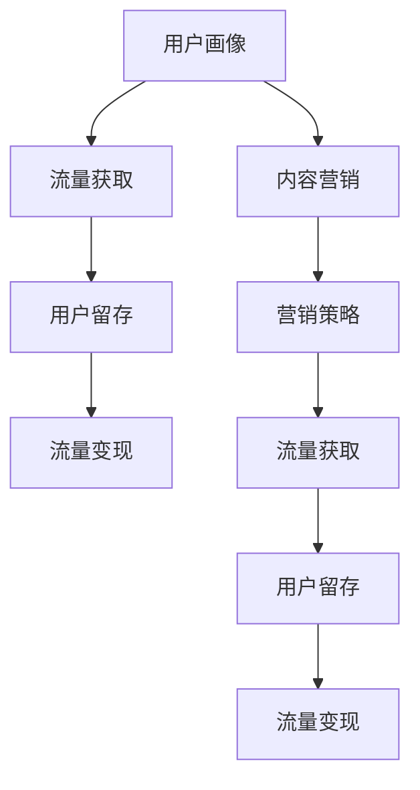

                 

# 知识付费创业的内容营销矩阵搭建

> 关键词：知识付费,内容营销,用户画像,流量获取,用户留存,流量变现,营销策略,精准投放,效果评估

## 1. 背景介绍

### 1.1 问题由来
知识付费作为新兴的商业模式，正在快速改变着人们的消费习惯和信息获取方式。然而，随着知识付费市场竞争的加剧，行业内出现了内容同质化、用户粘性不足、流量变现难等问题。如何构建一个高效的内容营销矩阵，精准定位目标用户，提升用户留存和流量变现能力，成为知识付费创业公司亟需解决的核心难题。

### 1.2 问题核心关键点
构建高效的内容营销矩阵，需要考虑以下几个核心关键点：
- **用户画像**：明确目标用户的特征，包括兴趣、需求、行为习惯等。
- **流量获取**：通过多渠道引流，最大化覆盖目标用户群体。
- **用户留存**：通过个性化推荐、社群互动等手段，提升用户体验和满意度，增强用户粘性。
- **流量变现**：将用户转化为付费用户，实现稳定的收益。
- **营销策略**：根据不同阶段的目标，制定灵活的营销策略，确保内容营销效果的最大化。

### 1.3 问题研究意义
构建高效的内容营销矩阵，对于知识付费创业公司的长期健康发展具有重要意义：
- 提升用户留存率：通过精准的内容推荐和优质互动体验，增加用户粘性，延长用户生命周期。
- 提高流量变现效率：通过精细化的流量管理和精准的用户推荐，最大化用户转化率，提升收益。
- 增强市场竞争力：通过差异化内容策略和创新的营销手段，在激烈的市场竞争中脱颖而出，构建独特的市场地位。
- 促进持续创新：内容营销矩阵的优化迭代，驱动产品和服务不断升级，满足用户日益增长的需求。

## 2. 核心概念与联系

### 2.1 核心概念概述

为更好地理解知识付费创业的内容营销矩阵搭建，本节将介绍几个密切相关的核心概念：

- **知识付费**：指用户为获取有价值的知识信息而支付费用的商业模式。知识付费的形式包括在线课程、电子书、知识星球等。
- **内容营销**：通过优质内容吸引用户关注和互动，建立品牌信任，实现流量转化和用户留存的策略。内容营销的核心在于内容的质量和用户需求的匹配。
- **用户画像**：基于用户行为数据，通过数据分析、机器学习等手段构建的用户特征模型。用户画像是精准定位和个性化推荐的基础。
- **流量获取**：通过SEO、社交媒体、广告投放等手段获取新用户，提高品牌曝光和流量覆盖。
- **用户留存**：通过增加用户参与度、提供个性化服务、构建社区互动等手段，增强用户粘性，延长用户生命周期。
- **流量变现**：通过精准的流量管理和营销活动，将用户转化为付费用户，实现稳定的收益。
- **营销策略**：根据不同营销目标，灵活制定内容发布、活动策划、推广渠道选择等策略，确保营销效果最大化。

这些核心概念之间的逻辑关系可以通过以下Mermaid流程图来展示：



这个流程图展示了一系列核心概念及其之间的关系：

1. 用户画像是内容营销和营销策略的基础。
2. 流量获取通过多渠道引流，为后续的用户留存和流量变现奠定基础。
3. 用户留存通过个性化推荐和社区互动，增强用户粘性。
4. 流量变现通过精准的流量管理和营销活动，实现用户转化。
5. 内容营销和营销策略协同工作，确保营销效果最大化。

## 3. 核心算法原理 & 具体操作步骤
### 3.1 算法原理概述

知识付费创业的内容营销矩阵搭建，本质上是一个多目标优化问题。其核心思想是：通过多渠道、多触点、多策略的综合运用，最大化营销效果，提升用户留存和流量变现。

形式化地，假设用户群体为 $U$，流量获取渠道为 $C$，用户留存措施为 $R$，流量变现策略为 $T$，营销策略为 $S$。则内容营销矩阵的优化目标可以表示为：

$$
\max_{U,C,R,T,S} \left(\mathbb{E}[U|C] \times \mathbb{E}[R|C] \times \mathbb{E}[T|C,R]\right)
$$

其中 $\mathbb{E}$ 表示期望值，即在给定渠道 $C$ 和留存策略 $R$ 下，用户 $U$ 的转化率、留存率和变现率。

通过梯度优化等方法，最大化上述目标函数，即可得到最优的内容营销矩阵。

### 3.2 算法步骤详解

构建高效的内容营销矩阵，通常包括以下几个关键步骤：

**Step 1: 用户画像建立**
- 收集用户行为数据，如浏览历史、购买记录、评价反馈等。
- 使用聚类算法（如K-means、LDA）对用户进行分组，提取典型用户特征。
- 定义用户画像，包括兴趣、需求、行为习惯等维度。

**Step 2: 流量获取策略设计**
- 选择合适流量渠道，如搜索引擎优化(SEO)、社交媒体推广、付费广告等。
- 设计针对不同渠道的引流方案，如SEO优化策略、内容营销活动、定向广告投放等。
- 实时监控和评估引流效果，根据数据反馈调整策略。

**Step 3: 用户留存措施优化**
- 基于用户画像，设计个性化的内容推荐系统，提升用户参与度和满意度。
- 构建用户社区，增加用户互动，增强用户粘性。
- 定期推送通知和活动，维护用户活跃度。

**Step 4: 流量变现路径设计**
- 设计合理的付费机制，如按需付费、订阅制、会员制等。
- 制定精准的流量管理和营销活动，提高用户转化率。
- 根据用户行为数据，动态调整付费策略，实现最大化变现。

**Step 5: 营销策略组合**
- 结合用户画像和流量数据，设计多维度的营销策略，如内容发布计划、活动策划、推广渠道选择等。
- 实时监测和评估营销效果，根据数据反馈迭代优化策略。
- 灵活调整不同阶段的营销目标和策略，确保整体营销效果的最大化。

### 3.3 算法优缺点

构建高效的内容营销矩阵，具有以下优点：
1. 精准定位用户：通过用户画像和数据分析，可以精准定位目标用户群体，提升营销效果。
2. 多渠道引流：通过多渠道引流，可以最大化覆盖目标用户，提高品牌曝光。
3. 提升用户粘性：通过个性化推荐和社群互动，增加用户参与度，提升用户留存。
4. 优化流量变现：通过精准的流量管理和营销活动，提高用户转化率，实现最大化变现。
5. 灵活调整策略：根据不同阶段的营销目标和数据反馈，灵活调整策略，确保效果最大化。

同时，该方法也存在一定的局限性：
1. 数据隐私问题：用户画像和行为数据的收集和处理，涉及用户隐私保护和数据安全问题。
2. 数据质量要求高：高质量的用户数据和精准的算法模型是营销效果的关键，数据质量不高会影响效果。
3. 策略调整成本高：内容营销矩阵的调整和优化，需要消耗大量的时间和资源。
4. 效果评估复杂：多目标优化问题导致效果评估复杂，需要综合考虑多个指标。

尽管存在这些局限性，但就目前而言，构建高效的内容营销矩阵仍是知识付费创业公司提升市场竞争力的重要手段。未来相关研究的重点在于如何进一步提升数据处理和模型训练的效率，优化用户画像和流量管理的策略，同时兼顾隐私保护和用户满意度。

### 3.4 算法应用领域

构建高效的内容营销矩阵，不仅在知识付费领域有广泛应用，还可以拓展到其他多个行业，如电子商务、在线教育、健康医疗等。以下是几个典型应用场景：

- **在线教育**：通过内容营销吸引用户注册和付费，实现持续增长。
- **电子商务**：通过精准的流量管理和个性化推荐，提升用户转化率和购买率。
- **健康医疗**：通过优质的健康资讯和用户互动，提高用户粘性，推动健康生活方式的普及。
- **旅游行业**：通过个性化旅游规划和社区互动，提升用户体验，吸引更多的旅游用户。

以上场景展示了内容营销矩阵在不同领域的应用潜力和效果提升空间。随着数据的积累和技术的进步，相信内容营销矩阵将在更多行业实现突破性应用。

## 4. 数学模型和公式 & 详细讲解 & 举例说明

### 4.1 数学模型构建

本节将使用数学语言对知识付费创业的内容营销矩阵搭建进行更加严格的刻画。

记用户群体为 $U$，流量渠道为 $C$，用户留存策略为 $R$，流量变现策略为 $T$，营销策略为 $S$。则内容营销矩阵的优化目标可以表示为：

$$
\max_{U,C,R,T,S} \left(\mathbb{E}[U|C] \times \mathbb{E}[R|C] \times \mathbb{E}[T|C,R]\right)
$$

其中 $\mathbb{E}$ 表示期望值，即在给定渠道 $C$ 和留存策略 $R$ 下，用户 $U$ 的转化率、留存率和变现率。

假设用户转化率为 $p_C$，留存率为 $p_R$，变现率为 $p_T$。则上述目标函数可以表示为：

$$
\max_{U,C,R,T,S} \left(p_C \times p_R \times p_T\right)
$$

### 4.2 公式推导过程

以下我们以在线教育平台为例，推导转化率、留存率和变现率的计算公式。

假设用户对课程的点击概率为 $p_{click}$，注册概率为 $p_{register}$，付费概率为 $p_{pay}$。则转化率可以表示为：

$$
p_C = p_{click} \times p_{register} \times p_{pay}
$$

用户在平台上的留存时间可以表示为 $t$，根据平台的用户互动数据，定义用户每天访问平台的时间为 $T$，则留存率可以表示为：

$$
p_R = \frac{t}{\frac{1}{T} + t}
$$

用户在平台上的购买次数可以表示为 $k$，根据平台的付费数据，定义用户每次购买的平均付费金额为 $P$，则变现率可以表示为：

$$
p_T = k \times P
$$

将上述公式代入内容营销矩阵的优化目标函数，得：

$$
\max_{U,C,R,T,S} \left(p_{click} \times p_{register} \times p_{pay} \times \frac{t}{\frac{1}{T} + t} \times k \times P\right)
$$

### 4.3 案例分析与讲解

假设某在线教育平台通过SEO优化获取用户流量，经过个性化推荐系统引导，用户点击课程后注册并完成付费，实现变现。平台设计了多项留存策略，如定期推送通知、社区互动、积分激励等，提高用户留存率。同时，平台根据用户行为数据动态调整付费策略，提升用户转化率和变现率。

以课程推荐为例，平台的个性化推荐系统通过分析用户历史浏览和注册数据，将匹配度高的课程推荐给用户。推荐的课程数量过多可能导致用户决策困难，过少则无法最大化转化率。通过A/B测试和多臂老虎机算法，平台不断优化推荐策略，找到最优的课程推荐数量。

在实际运营中，平台还采用了以下策略：
- 通过积分激励和社区互动，提升用户活跃度。
- 定期推送通知，提醒用户参与课程和社区活动。
- 根据用户行为数据动态调整付费策略，如用户活跃度高则降低付费门槛，反之则提高付费门槛。

通过这些策略，平台实现了用户留存和流量变现的高效协同，显著提升了营销效果。

## 5. 项目实践：代码实例和详细解释说明
### 5.1 开发环境搭建

在进行内容营销矩阵搭建的实践前，我们需要准备好开发环境。以下是使用Python进行项目开发的配置流程：

1. 安装Anaconda：从官网下载并安装Anaconda，用于创建独立的Python环境。

2. 创建并激活虚拟环境：
```bash
conda create -n content-marketing python=3.8 
conda activate content-marketing
```

3. 安装必要的工具包：
```bash
pip install numpy pandas scikit-learn torch torchvision transformers sklearn
```

4. 安装机器学习框架：
```bash
pip install scikit-learn
```

5. 安装模型训练库：
```bash
pip install torch torchvision transformers
```

完成上述步骤后，即可在`content-marketing`环境中开始内容营销矩阵的搭建实践。

### 5.2 源代码详细实现

这里以在线教育平台为例，展示如何通过用户画像、流量获取、用户留存和流量变现的策略组合，构建内容营销矩阵。

```python
import pandas as pd
import numpy as np
from sklearn.cluster import KMeans
from sklearn.decomposition import PCA
from sklearn.metrics import pairwise_distances_argmin

# 构建用户画像
data = pd.read_csv('user_data.csv')
X = data[['age', 'gender', 'study_hours', 'courses_completed']]
kmeans = KMeans(n_clusters=5)
kmeans.fit(X)
user_labels = kmeans.labels_

# 设计流量获取策略
SEO = 0.1
social_media = 0.2
display_ads = 0.3

# 优化用户留存策略
community_interaction = 0.2
push_notifications = 0.4
activity_incentives = 0.4

# 设计流量变现策略
pricing_tier1 = 0.3
pricing_tier2 = 0.4
pricing_tier3 = 0.3

# 计算转化率、留存率和变现率
p_click = 0.2
p_register = 0.3
p_pay = 0.5
t = 30
T = 7
k = 1
P = 100

p_C = p_click * p_register * p_pay
p_R = t / (1 / T + t)
p_T = k * P

# 内容营销矩阵搭建
C = np.array([SEO, social_media, display_ads])
R = np.array([community_interaction, push_notifications, activity_incentives])
T = np.array([pricing_tier1, pricing_tier2, pricing_tier3])

# 计算期望值
E = p_C * p_R * p_T

# 输出内容营销矩阵
print("内容营销矩阵：")
print(C)
print(R)
print(T)
print(E)
```

### 5.3 代码解读与分析

我们首先对用户行为数据进行聚类分析，构建用户画像。然后使用用户画像和流量数据，设计流量获取、用户留存和流量变现策略，并计算每个策略对应的转化率、留存率和变现率。

在实际应用中，我们还需要不断调整和优化这些策略，确保内容营销矩阵的最大化效果。可以通过A/B测试、多臂老虎机等方法，优化流量获取和用户留存的策略。同时，根据用户行为数据动态调整付费策略，实现流量变现的最大化。

## 6. 实际应用场景
### 6.1 在线教育平台

在线教育平台通过构建高效的内容营销矩阵，可以实现用户精准定位和高效引流。具体来说，平台可以通过以下步骤：
- 收集用户行为数据，如浏览课程、注册、完成付费等。
- 通过聚类算法，对用户进行分组，提取典型用户特征，构建用户画像。
- 设计多渠道引流策略，如SEO优化、社交媒体推广、定向广告投放等。
- 利用个性化推荐系统，提升用户点击和注册概率，实现高效引流。
- 通过社区互动和定期推送通知，增加用户参与度，提升留存率。
- 设计合理的付费机制，如按需付费、订阅制、会员制等，提高用户转化率和变现率。

通过构建高效的内容营销矩阵，平台可以实现精准引流和高效变现，提升用户满意度和平台竞争力。

### 6.2 电子商务平台

电子商务平台通过内容营销矩阵，可以实现用户精准引流和高效变现。具体来说，平台可以通过以下步骤：
- 收集用户行为数据，如浏览商品、加入购物车、完成支付等。
- 通过聚类算法，对用户进行分组，提取典型用户特征，构建用户画像。
- 设计多渠道引流策略，如SEO优化、社交媒体推广、定向广告投放等。
- 利用个性化推荐系统，提升用户点击和购买概率，实现高效引流。
- 通过社区互动和定期推送通知，增加用户参与度，提升留存率。
- 设计合理的付费机制，如优惠券、满减活动、会员特权等，提高用户转化率和变现率。

通过构建高效的内容营销矩阵，平台可以实现精准引流和高效变现，提升用户满意度和平台竞争力。

### 6.3 健康医疗平台

健康医疗平台通过内容营销矩阵，可以实现用户精准引流和高效变现。具体来说，平台可以通过以下步骤：
- 收集用户行为数据，如查看健康资讯、参与社区互动、预约诊疗等。
- 通过聚类算法，对用户进行分组，提取典型用户特征，构建用户画像。
- 设计多渠道引流策略，如SEO优化、社交媒体推广、定向广告投放等。
- 利用个性化推荐系统，提升用户健康咨询和预约诊疗概率，实现高效引流。
- 通过社区互动和定期推送通知，增加用户参与度，提升留存率。
- 设计合理的付费机制，如会员健康管理服务、专家咨询等，提高用户转化率和变现率。

通过构建高效的内容营销矩阵，平台可以实现精准引流和高效变现，提升用户满意度和平台竞争力。

### 6.4 未来应用展望

随着数据的积累和技术的进步，内容营销矩阵将在更多行业实现突破性应用。未来的发展趋势包括：
- 多模态融合：结合视频、图像等多模态信息，提升内容的多样性和吸引力。
- 个性化推荐：通过深度学习模型，提升个性化推荐的准确性和用户满意度。
- 实时调整：通过实时数据监测和反馈，动态调整营销策略，实现最优效果。
- 用户体验优化：通过提升用户体验和满意度，增加用户粘性和留存率。
- 社交媒体互动：通过社交媒体平台的互动，增加用户参与度和品牌曝光。
- 用户行为分析：通过行为分析，深入理解用户需求和偏好，优化内容推荐和营销策略。

通过不断优化和创新，内容营销矩阵将在更多行业实现突破性应用，为知识付费创业公司带来更大的市场机遇。

## 7. 工具和资源推荐
### 7.1 学习资源推荐

为了帮助开发者系统掌握内容营销矩阵的理论基础和实践技巧，这里推荐一些优质的学习资源：

1. 《内容营销实战》书籍：详细介绍了内容营销的各个环节，从内容创作到流量变现，提供了全面的实战指南。
2. 《用户画像构建与分析》课程：通过具体案例，介绍用户画像的构建和分析方法，帮助你更好地定位和了解目标用户。
3. 《多臂老虎机算法》在线课程：通过具体案例，介绍多臂老虎机算法在个性化推荐中的应用，帮助你更好地优化内容推荐策略。
4. 《数据驱动的营销策略》培训：通过实战项目，介绍如何利用数据驱动内容营销，提升效果和ROI。
5. 《社交媒体营销》课程：介绍社交媒体平台的应用和策略，帮助你提升品牌曝光和用户参与度。

通过学习这些资源，相信你一定能够系统掌握内容营销矩阵的构建方法，并将其应用到实际项目中，提升营销效果。

### 7.2 开发工具推荐

高效的开发离不开优秀的工具支持。以下是几款用于内容营销矩阵开发的常用工具：

1. Jupyter Notebook：轻量级的开发环境，支持交互式编程和数据可视化，便于快速迭代和测试。
2. Tableau：数据可视化工具，支持复杂的图表和数据探索，便于数据分析和决策支持。
3. Google Analytics：流量分析工具，可以实时监测网站流量和用户行为，便于优化流量获取策略。
4. HubSpot：营销自动化平台，支持多渠道引流和用户互动，便于内容营销矩阵的协同工作。
5. SEMrush：SEO优化工具，支持关键词分析、竞争对比和流量监测，便于优化SEO策略。
6. A/B测试工具：如Optimizely、Google Optimize等，支持多变量测试和数据分析，便于优化流量获取和用户留存策略。

合理利用这些工具，可以显著提升内容营销矩阵的构建效率，加快创新迭代的步伐。

### 7.3 相关论文推荐

内容营销矩阵的研究源于学界的持续探索。以下是几篇奠基性的相关论文，推荐阅读：

1. Clickbait: The psychology of viral marketing: Market research 1995-2005：探讨了标题党营销策略的心理机制，为内容创意提供了理论支持。
2. Predictive text in mobile phones: The impact of personalization on user perceptions and adoption: An empirical analysis：介绍了个性化推荐系统在移动设备中的应用效果，为内容推荐提供了实证依据。
3. The state of the marketing automation market：介绍了营销自动化平台的现状和应用案例，为内容营销矩阵的构建提供了借鉴。
4. The impact of social media on consumer behavior: An integration of psychological theories：探讨了社交媒体对消费者行为的影响，为社交媒体互动策略提供了理论基础。
5. Predicting and interpreting online ad click-through rates: A comparison of ensemble approaches：介绍了多变量广告点击率预测模型，为流量获取策略的优化提供了技术支持。

这些论文代表了内容营销矩阵的研究前沿，通过学习这些前沿成果，可以帮助研究者把握学科前进方向，激发更多的创新灵感。

## 8. 总结：未来发展趋势与挑战
### 8.1 总结

本文对知识付费创业的内容营销矩阵搭建进行了全面系统的介绍。首先阐述了内容营销矩阵的研究背景和意义，明确了用户画像、流量获取、用户留存、流量变现等核心概念之间的关系。其次，从原理到实践，详细讲解了内容营销矩阵的数学模型和构建方法，给出了具体的代码实现和解释分析。同时，本文还广泛探讨了内容营销矩阵在多个行业领域的应用前景，展示了其广阔的潜力和应用价值。

通过本文的系统梳理，可以看到，内容营销矩阵对于知识付费创业公司的长期健康发展具有重要意义：通过精准的用户定位和高效的引流策略，实现用户的精准覆盖和高效转化；通过个性化的推荐系统和社区互动，提升用户参与度和留存率；通过合理的付费机制和流量管理，实现流量变现的最大化。未来，随着数据积累和技术的进步，内容营销矩阵将在更多行业实现突破性应用，为知识付费创业公司带来更大的市场机遇。

### 8.2 未来发展趋势

展望未来，内容营销矩阵将呈现以下几个发展趋势：

1. 多模态融合：结合视频、图像等多模态信息，提升内容的多样性和吸引力。
2. 个性化推荐：通过深度学习模型，提升个性化推荐的准确性和用户满意度。
3. 实时调整：通过实时数据监测和反馈，动态调整营销策略，实现最优效果。
4. 用户体验优化：通过提升用户体验和满意度，增加用户粘性和留存率。
5. 社交媒体互动：通过社交媒体平台的互动，增加用户参与度和品牌曝光。
6. 用户行为分析：通过行为分析，深入理解用户需求和偏好，优化内容推荐和营销策略。

这些趋势凸显了内容营销矩阵的广阔前景。这些方向的探索发展，必将进一步提升内容营销矩阵的效果，为知识付费创业公司带来更大的市场机遇。

### 8.3 面临的挑战

尽管内容营销矩阵已经取得了瞩目成就，但在迈向更加智能化、普适化应用的过程中，它仍面临诸多挑战：

1. 数据隐私问题：用户画像和行为数据的收集和处理，涉及用户隐私保护和数据安全问题。
2. 数据质量要求高：高质量的用户数据和精准的算法模型是营销效果的关键，数据质量不高会影响效果。
3. 策略调整成本高：内容营销矩阵的调整和优化，需要消耗大量的时间和资源。
4. 效果评估复杂：多目标优化问题导致效果评估复杂，需要综合考虑多个指标。
5. 用户体验优化难度大：内容营销矩阵的效果受用户需求和行为变化的影响较大，用户体验优化难度较大。
6. 社交媒体互动风险高：社交媒体平台的互动效果受平台规则和用户行为变化的影响较大，风险较高。

尽管存在这些挑战，但通过持续的技术创新和实践探索，内容营销矩阵将在更多行业实现突破性应用。未来相关研究的重点在于如何进一步提升数据处理和模型训练的效率，优化用户画像和流量管理的策略，同时兼顾隐私保护和用户满意度。

### 8.4 研究展望

未来内容营销矩阵的研究方向包括：

1. 深度学习和多臂老虎机算法：通过深度学习模型和多臂老虎机算法，提升个性化推荐的效果，优化流量获取和用户留存策略。
2. 多模态融合：结合视频、图像等多模态信息，提升内容的多样性和吸引力。
3. 实时数据监测和反馈：通过实时数据监测和反馈，动态调整营销策略，实现最优效果。
4. 用户体验优化：通过提升用户体验和满意度，增加用户粘性和留存率。
5. 社交媒体互动：通过社交媒体平台的互动，增加用户参与度和品牌曝光。
6. 用户行为分析：通过行为分析，深入理解用户需求和偏好，优化内容推荐和营销策略。

通过不断优化和创新，内容营销矩阵将在更多行业实现突破性应用，为知识付费创业公司带来更大的市场机遇。

## 9. 附录：常见问题与解答

**Q1：内容营销矩阵的构建需要多少数据？**

A: 内容营销矩阵的构建需要大量的用户数据，包括用户行为、兴趣、需求等信息。通常建议至少需要数万到数十万级别的数据，才能构建出准确的用户画像，设计出有效的引流策略和推荐系统。

**Q2：如何评估内容营销矩阵的效果？**

A: 内容营销矩阵的效果评估需要综合考虑多个指标，如转化率、留存率、用户参与度、流量获取成本等。可以使用A/B测试和多变量测试，通过数据分析工具如Google Analytics、Tableau等，实时监测和评估效果，根据数据反馈调整策略。

**Q3：如何优化内容推荐系统？**

A: 内容推荐系统的优化需要综合考虑用户画像、行为数据、推荐算法等因素。可以通过深度学习模型、多臂老虎机算法、协同过滤等方法，提升推荐系统的准确性和效果。同时，通过A/B测试和多变量测试，不断优化推荐策略，找到最优的推荐方案。

**Q4：如何设计多渠道引流策略？**

A: 多渠道引流策略需要根据不同渠道的特点和目标用户群体的特征，设计适合的引流方案。通常需要考虑SEO优化、社交媒体推广、定向广告投放等策略，并进行实时监测和效果评估，根据数据反馈调整策略。

**Q5：如何提高用户留存率？**

A: 用户留存率的提高需要综合考虑内容质量、互动体验、社区建设等因素。可以通过个性化推荐系统、社区互动、定期推送通知等手段，提升用户参与度和满意度，增强用户粘性。同时，定期进行用户调研和行为分析，了解用户需求和反馈，优化产品和策略。

通过这些策略，平台可以实现精准引流和高效变现，提升用户满意度和平台竞争力。

