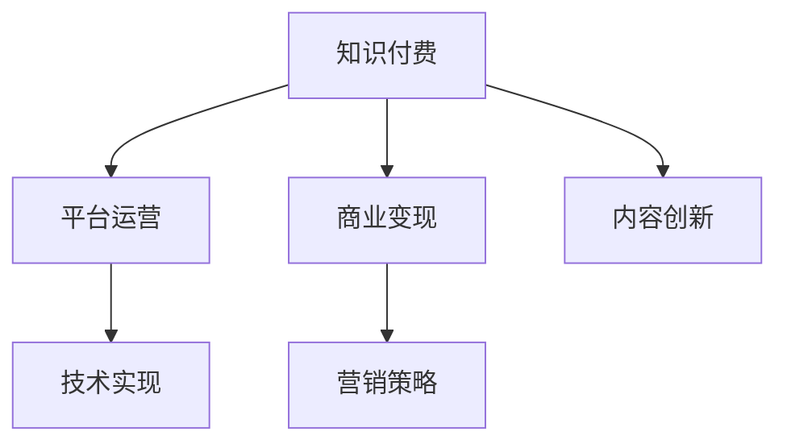

                 

# 知识付费创业的核心原理解析

> 关键词：知识付费, 创业, 市场分析, 用户需求, 商业模式, 技术实现, 营销策略

## 1. 背景介绍

### 1.1 问题由来

随着互联网的高速发展，知识付费市场不断升温，成为新的经济增长点。自2016年以来，各类知识付费平台如雨后春笋般涌现，纷纷提供音频、视频、图文等多种形式的内容。知识付费不仅丰富了网络内容生态，还极大地满足了用户对于学习的需求。

然而，伴随平台间的激烈竞争和内容同质化问题，知识付费创业逐渐面临诸多挑战。如何在激烈的市场竞争中脱颖而出？如何识别并满足用户真正的需求？如何构建可持续的商业模式？这些问题亟需创业者深入剖析。

### 1.2 问题核心关键点

知识付费创业的核心在于识别市场需求，构建合理的商业模式，并采用高效的技术手段实现高质量内容交付。具体而言：

- **市场细分**：理解不同用户群体的需求，定制内容产品。
- **平台运营**：搭建高效的内容分发和用户互动平台，提升用户体验。
- **商业模式**：设计灵活多样的收费模式，确保平台可持续发展。
- **内容创新**：制作高质量、差异化的内容，提升用户粘性。
- **技术支撑**：借助先进的AI和推荐技术，提升内容推荐效率。
- **市场拓展**：制定有效的营销策略，提升品牌知名度和用户获取率。

本文将从市场分析、用户需求、商业模式、技术实现、营销策略等方面，深度剖析知识付费创业的核心原理，旨在为创业者提供系统性的指导和启示。

## 2. 核心概念与联系

### 2.1 核心概念概述

为更好地理解知识付费创业的各个环节，本节将介绍几个核心概念：

- **知识付费**：通过订阅、购买等方式，为用户提供专业的知识和信息服务，满足其学习和提升的需求。

- **平台运营**：包括内容管理、用户互动、订单处理、数据统计等多个方面，是知识付费平台的核心职能。

- **商业变现**：通过付费订阅、按需购买、广告分成、会员增值服务等多种方式，实现平台盈利。

- **内容创新**：通过原创制作、版权采购、合作创作等方式，提供高质量、多样化的内容，提升用户满意度。

- **技术实现**：利用先进的数据分析、推荐算法、流媒体技术等，实现内容的智能化推荐和高质量交付。

- **营销策略**：通过多渠道推广、用户互动、品牌合作等方式，提高品牌知名度和用户获取率。

这些概念之间的逻辑关系可以通过以下Mermaid流程图来展示：



这个流程图展示了下游知识付费平台的各个关键环节：

1. **知识付费**：核心环节，即通过内容交付满足用户需求。
2. **平台运营**：支撑环节，即实现内容的分发和用户互动。
3. **商业变现**：盈利环节，即确保平台运营的可持续性。
4. **内容创新**：提升环节，即通过优质内容吸引和保留用户。
5. **技术实现**：保障环节，即通过技术手段提升用户体验。
6. **营销策略**：推广环节，即提升品牌知名度和用户获取率。

这些概念共同构成了知识付费创业的基本框架，其高效协同将决定平台的成败。

## 3. 核心算法原理 & 具体操作步骤

### 3.1 算法原理概述

知识付费创业的算法原理主要涉及以下几个方面：

- **市场细分**：利用聚类分析、用户画像等技术，将用户按需求进行细分，定制化内容。
- **内容推荐**：应用协同过滤、基于模型的推荐算法，提升内容的个性化推荐效果。
- **流量运营**：通过流量预测、用户行为分析等技术，实现精准营销，提高用户转化率。

这些算法技术旨在提升用户体验，同时优化平台的运营效率和盈利能力。

### 3.2 算法步骤详解

以下是知识付费创业中常用的算法步骤：

**Step 1: 数据收集与预处理**

- 收集用户行为数据，包括浏览记录、购买记录、评论反馈等。
- 清洗数据，去除噪音，填充缺失值，生成特征数据集。

**Step 2: 用户行为分析**

- 通过聚类分析，将用户按兴趣和行为特征分组。
- 利用关联规则分析，发现用户行为模式。

**Step 3: 内容推荐算法**

- 构建用户-内容矩阵，用于存储用户对内容的评分或交互行为。
- 应用协同过滤算法，预测用户可能感兴趣的内容。
- 结合内容特征，应用基于模型的推荐算法，如SVM、神经网络等，优化推荐结果。

**Step 4: 流量预测与营销**

- 利用时间序列分析，预测用户流量变化。
- 结合用户行为特征，应用机器学习模型，预测用户行为，实现精准营销。
- 通过A/B测试等技术，评估不同营销策略的效果，持续优化营销方案。

### 3.3 算法优缺点

知识付费创业中的算法技术具有以下优点：

- **个性化推荐**：通过算法推荐，提高用户满意度，增强粘性。
- **精准营销**：利用数据分析技术，实现用户精准定位和内容定向推送。
- **运营效率**：通过算法优化，减少人工运营成本，提升运营效率。

同时，算法技术也存在以下局限：

- **数据依赖**：算法效果高度依赖高质量数据，数据缺失或噪声会影响算法准确性。
- **模型复杂**：部分算法模型复杂度高，实现难度大，需要较高技术门槛。
- **用户隐私**：用户行为数据涉及隐私问题，需要妥善处理，避免滥用。

### 3.4 算法应用领域

知识付费创业中的算法技术，主要应用于以下领域：

- **个性化推荐**：应用于内容推荐系统，满足用户个性化需求。
- **流量预测与优化**：应用于流量分析和精准营销，提高用户转化率。
- **用户画像与细分**：应用于用户行为分析，细分目标用户群体。
- **风险控制**：应用于用户欺诈检测、内容版权保护等领域，保障平台安全。

## 4. 数学模型和公式 & 详细讲解 & 举例说明

### 4.1 数学模型构建

知识付费创业中的数学模型构建，主要包括以下几个方面：

- **用户聚类模型**：通过K-means、层次聚类等算法，将用户按兴趣和行为特征进行聚类。
- **推荐系统模型**：包括协同过滤、基于内容的推荐、混合推荐等模型，用于生成个性化推荐。
- **流量预测模型**：应用时间序列分析、回归模型等技术，预测用户流量变化。

### 4.2 公式推导过程

以协同过滤推荐算法为例，推导其基本原理。

设用户-内容矩阵为 $R_{m \times n}$，其中 $m$ 为用户数，$n$ 为内容数。协同过滤算法的基本思想是通过找到与目标用户相似的其他用户，并获取这些用户对内容的评分，来预测目标用户对内容的评分。

设目标用户为 $u$，内容为 $i$，则协同过滤算法的预测公式为：

$$
\hat{R}_{u,i} = \frac{\sum_{v \in \mathcal{N}_u} R_{v,i} \times \text{similarity}(u,v)}{\sum_{v \in \mathcal{N}_u} \text{similarity}(u,v)}
$$

其中 $\mathcal{N}_u$ 表示与用户 $u$ 相似的其他用户集合，similarity 表示相似度计算方法。

### 4.3 案例分析与讲解

以一个典型的知识付费平台为例，分析其推荐系统的实现流程：

1. **数据收集**：收集用户浏览、购买、评分等行为数据。
2. **数据预处理**：去除重复和异常数据，填充缺失值。
3. **用户聚类**：通过K-means算法将用户分为多个兴趣群体。
4. **内容评分**：将用户对内容的评分与用户聚类结果相结合，构建用户-内容评分矩阵。
5. **推荐算法**：应用协同过滤算法，生成个性化推荐列表。
6. **模型评估**：使用均方误差、准确率、召回率等指标，评估推荐系统的效果。

## 5. 项目实践：代码实例和详细解释说明

### 5.1 开发环境搭建

在进行项目实践前，我们需要准备好开发环境。以下是使用Python进行PyTorch开发的环境配置流程：

1. 安装Anaconda：从官网下载并安装Anaconda，用于创建独立的Python环境。

2. 创建并激活虚拟环境：
```bash
conda create -n pytorch-env python=3.8 
conda activate pytorch-env
```

3. 安装PyTorch：根据CUDA版本，从官网获取对应的安装命令。例如：
```bash
conda install pytorch torchvision torchaudio cudatoolkit=11.1 -c pytorch -c conda-forge
```

4. 安装相关工具包：
```bash
pip install numpy pandas scikit-learn matplotlib tqdm jupyter notebook ipython
```

完成上述步骤后，即可在`pytorch-env`环境中开始项目实践。

### 5.2 源代码详细实现

下面我们以推荐系统为例，给出使用PyTorch进行推荐算法的PyTorch代码实现。

首先，定义推荐系统中的基础模型类：

```python
import torch
import torch.nn as nn
import torch.nn.functional as F

class RecommendationModel(nn.Module):
    def __init__(self, n_users, n_items, embedding_dim):
        super(RecommendationModel, self).__init__()
        self.user_embeddings = nn.Embedding(n_users, embedding_dim)
        self.item_embeddings = nn.Embedding(n_items, embedding_dim)
        self.dropout = nn.Dropout(p=0.5)
        self.fc = nn.Linear(embedding_dim*2, 1)
    
    def forward(self, user_ids, item_ids):
        user_embeddings = self.user_embeddings(user_ids)
        item_embeddings = self.item_embeddings(item_ids)
        user_item = user_embeddings + item_embeddings
        user_item = self.dropout(user_item)
        output = self.fc(user_item)
        return output
```

然后，定义数据集和模型训练函数：

```python
from torch.utils.data import Dataset
from torch.utils.data import DataLoader

class RecommendationDataset(Dataset):
    def __init__(self, users, items, ratings, num_users, num_items, embedding_dim):
        self.users = users
        self.items = items
        self.ratings = ratings
        self.num_users = num_users
        self.num_items = num_items
        self.embedding_dim = embedding_dim
    
    def __len__(self):
        return len(self.ratings)
    
    def __getitem__(self, item):
        user_id = self.users[item]
        item_id = self.items[item]
        rating = self.ratings[item]
        return user_id, item_id, rating
    
class RecommendationTrainer:
    def __init__(self, model, device, optimizer, learning_rate, num_epochs):
        self.model = model
        self.device = device
        self.optimizer = optimizer
        self.learning_rate = learning_rate
        self.num_epochs = num_epochs
    
    def train(self, dataset):
        self.model.to(self.device)
        for epoch in range(self.num_epochs):
            total_loss = 0
            for user_id, item_id, rating in dataset:
                user_id = torch.tensor(user_id, dtype=torch.long).to(self.device)
                item_id = torch.tensor(item_id, dtype=torch.long).to(self.device)
                rating = torch.tensor(rating, dtype=torch.float).to(self.device)
                self.optimizer.zero_grad()
                output = self.model(user_id, item_id)
                loss = F.mse_loss(output, rating)
                loss.backward()
                self.optimizer.step()
                total_loss += loss.item()
            avg_loss = total_loss / len(dataset)
            print(f'Epoch {epoch+1}, Loss: {avg_loss:.4f}')
```

最后，启动模型训练和推荐效果评估：

```python
num_users = 1000
num_items = 1000
embedding_dim = 128

train_dataset = RecommendationDataset(
    users=torch.randint(num_users, (10000,)), 
    items=torch.randint(num_items, (10000,)), 
    ratings=torch.randn(10000, 1),
    num_users=num_users, 
    num_items=num_items, 
    embedding_dim=embedding_dim)
train_loader = DataLoader(train_dataset, batch_size=32, shuffle=True)

model = RecommendationModel(num_users, num_items, embedding_dim).to(device)
optimizer = torch.optim.Adam(model.parameters(), lr=0.001)

trainer = RecommendationTrainer(model, device, optimizer, learning_rate=0.001, num_epochs=10)
trainer.train(train_loader)
```

以上就是使用PyTorch进行推荐系统开发的完整代码实现。可以看到，通过继承nn.Module，我们可以方便地定义推荐模型。在实际开发中，我们还需要针对具体任务，对模型结构、损失函数等进行优化设计。

### 5.3 代码解读与分析

让我们再详细解读一下关键代码的实现细节：

**RecommendationModel类**：
- `__init__`方法：初始化用户和内容嵌入层，定义模型结构。
- `forward`方法：前向传播计算，将用户和内容嵌入向量相加，经过全连接层输出评分。

**RecommendationDataset类**：
- `__init__`方法：初始化数据集，包括用户ID、内容ID和评分。
- `__len__`方法：返回数据集长度。
- `__getitem__`方法：获取数据集中的单个样本。

**RecommendationTrainer类**：
- `__init__`方法：初始化模型、设备、优化器和超参数。
- `train`方法：训练模型，逐批次加载数据，计算损失并反向传播更新模型参数。

**训练流程**：
- 定义用户和内容ID以及评分，构建数据集。
- 定义模型、优化器和训练器。
- 在指定设备上加载模型和数据集。
- 在指定设备上开始模型训练，并输出每轮的平均损失。

可以看到，PyTorch提供的高级API使得推荐系统的开发变得简单高效。通过继承nn.Module，我们可以方便地实现复杂的推荐模型，并使用DataLoader进行批量数据加载，大大提高了开发效率。

当然，工业级的系统实现还需考虑更多因素，如模型的保存和部署、超参数的自动搜索、更灵活的任务适配层等。但核心的推荐系统开发流程基本与此类似。

## 6. 实际应用场景

### 6.1 智能课程推荐

智能课程推荐系统能够根据学生的学习历史、偏好和行为，智能推荐个性化的课程。这些推荐系统通常集成在MOOC平台、在线教育应用中，帮助学生发现适合自己的课程，提高学习效率。

具体实现上，推荐系统可以通过学生的浏览、点击、评分等行为数据，构建学生和课程的相似度矩阵，应用协同过滤推荐算法生成个性化推荐列表。同时，通过A/B测试等技术，不断优化推荐算法，提升用户满意度。

### 6.2 图书推荐

图书推荐系统在各大电商平台上得到了广泛应用，能够根据用户的历史购买记录、阅读行为和评分，推荐用户可能感兴趣的新书。图书推荐系统不仅可以提升用户体验，还能增加平台销量，优化库存管理。

推荐系统的实现主要依赖协同过滤、基于内容的推荐等技术，能够快速生成个性化推荐列表。同时，通过用户行为分析，识别用户的阅读偏好，实现精准推荐。

### 6.3 个性化视频推荐

视频推荐系统能够根据用户的历史观看记录、评分和标签，推荐用户可能感兴趣的视频。这些推荐系统集成在视频流平台、影视内容推荐应用中，帮助用户发现新的内容。

推荐系统通常利用协同过滤、基于内容的推荐等技术，生成个性化推荐列表。同时，通过用户行为分析，识别用户的偏好和兴趣，实现精准推荐。

### 6.4 未来应用展望

随着知识付费市场的不断壮大，推荐系统将在更多领域得到应用，为各类服务提供精准、高效的内容推荐，提升用户体验。

在智慧医疗领域，推荐系统能够根据病人的历史就医记录、病情标签等，推荐合适的医疗方案和专家。在智能教育领域，推荐系统能够根据学生的学习行为、测试成绩等，推荐个性化的学习资源和习题。在智慧金融领域，推荐系统能够根据用户的投资记录、偏好等，推荐合适的金融产品。

未来，推荐系统还将结合更多先验知识，如知识图谱、逻辑规则等，实现更加全面、准确的推荐。同时，通过引入因果推断、博弈论等理论工具，提升推荐系统的鲁棒性和可信度。

## 7. 工具和资源推荐

### 7.1 学习资源推荐

为了帮助开发者系统掌握知识付费创业的理论基础和实践技巧，这里推荐一些优质的学习资源：

1. 《推荐系统实战》系列博文：由知识付费领域的专家撰写，深入浅出地介绍了推荐系统的原理、算法和应用。

2. CS225《推荐系统》课程：斯坦福大学开设的推荐系统经典课程，涵盖推荐算法、评价指标、数据集等核心内容。

3. 《推荐系统》书籍：系统讲解推荐系统的各个方面，包括协同过滤、基于内容的推荐、混合推荐等。

4. KDD、ICML等学术会议论文：推荐系统领域的顶级会议，包含最新算法和研究成果。

5. 数据集资源平台：如Kaggle、Amazon Review等，提供丰富的数据集和推荐系统基准测试任务。

通过对这些资源的学习实践，相信你一定能够快速掌握知识付费推荐系统的精髓，并用于解决实际的推荐问题。

### 7.2 开发工具推荐

高效的开发离不开优秀的工具支持。以下是几款用于知识付费推荐系统开发的常用工具：

1. PyTorch：基于Python的开源深度学习框架，灵活动态的计算图，适合快速迭代研究。推荐系统的大部分算法都有PyTorch版本的实现。

2. TensorFlow：由Google主导开发的开源深度学习框架，生产部署方便，适合大规模工程应用。推荐系统同样有丰富的预训练语言模型资源。

3. Scikit-learn：Python的机器学习库，提供了大量的经典算法和工具，适合入门和实验。

4. Weights & Biases：模型训练的实验跟踪工具，可以记录和可视化模型训练过程中的各项指标，方便对比和调优。与主流深度学习框架无缝集成。

5. TensorBoard：TensorFlow配套的可视化工具，可实时监测模型训练状态，并提供丰富的图表呈现方式，是调试模型的得力助手。

6. Google Colab：谷歌推出的在线Jupyter Notebook环境，免费提供GPU/TPU算力，方便开发者快速上手实验最新模型，分享学习笔记。

合理利用这些工具，可以显著提升知识付费推荐系统的开发效率，加快创新迭代的步伐。

### 7.3 相关论文推荐

推荐系统的研究源于学界的持续研究。以下是几篇奠基性的相关论文，推荐阅读：

1. Collaborative Filtering for Implicit Feedback Datasets（Koren等）：提出了协同过滤算法，成为推荐系统的基础算法。

2. Matrix Factorization Techniques for Recommender Systems（Sarwar等）：提出了矩阵分解方法，在推荐系统应用中效果显著。

3. Factorization Machines for Recommendations（Zhang等）：提出因子机算法，进一步提升了推荐系统的效果。

4. Deep Recommendation（Bengio等）：探讨了深度学习在推荐系统中的应用，展示了深度模型的强大能力。

5. Learning Deep Architectures for AI（Hinton等）：介绍了深度学习的基本原理，为推荐系统提供了理论支持。

这些论文代表了大语言模型微调技术的发展脉络。通过学习这些前沿成果，可以帮助研究者把握学科前进方向，激发更多的创新灵感。

## 8. 总结：未来发展趋势与挑战

### 8.1 总结

本文对知识付费创业的核心原理进行了全面系统的介绍。首先阐述了知识付费市场的发展现状和面临的挑战，明确了推荐系统在满足用户需求、提升平台价值方面的重要角色。其次，从市场细分、用户需求、商业模式、技术实现、营销策略等方面，详细讲解了知识付费推荐系统的核心概念和实现方法。

通过本文的系统梳理，可以看到，知识付费推荐系统不仅能够提升用户体验，还能为平台带来可观的商业价值。未来，伴随技术的不断进步和市场的进一步成熟，推荐系统必将在更多领域得到应用，成为知识付费创业的重要支撑。

### 8.2 未来发展趋势

展望未来，知识付费推荐系统将呈现以下几个发展趋势：

1. 技术融合创新。推荐系统将结合更多先进技术，如深度学习、自然语言处理、强化学习等，实现更加智能和个性化的推荐。

2. 用户行为深度分析。通过更复杂的用户行为建模，识别用户的深层需求和偏好，实现更加精准的推荐。

3. 多模态推荐。推荐系统将融合视觉、语音、文本等多模态数据，提供更加全面、深入的推荐服务。

4. 实时动态优化。推荐系统将实时动态更新，根据用户行为变化调整推荐策略，实现更加灵活的推荐。

5. 数据隐私保护。推荐系统将采用更为严格的数据隐私保护措施，保障用户隐私。

6. 推荐系统伦理。推荐系统将引入伦理导向的评估指标，确保推荐的公正性和安全性。

以上趋势凸显了知识付费推荐系统的广阔前景。这些方向的探索发展，必将进一步提升推荐系统的智能化水平，为知识付费创业提供更加强大的技术支撑。

### 8.3 面临的挑战

尽管知识付费推荐系统已经取得了一定的成果，但在迈向更加智能化、普适化应用的过程中，它仍面临诸多挑战：

1. 数据质量和多样性。推荐系统的效果高度依赖高质量、多样化的数据，数据缺失或噪声会影响算法准确性。

2. 模型复杂性和可解释性。部分推荐算法模型复杂度高，难以解释，需要更高技术门槛。

3. 用户隐私和数据安全。用户行为数据涉及隐私问题，需要妥善处理，避免滥用。

4. 系统鲁棒性和健壮性。推荐系统面临模型过拟合、数据分布变化等风险，需要提高鲁棒性。

5. 推荐系统的公平性和公正性。推荐系统可能存在算法偏见，需要确保公平性。

6. 系统的实时性和稳定性。推荐系统需要高效处理大规模用户请求，确保系统实时性和稳定性。

正视推荐系统面临的这些挑战，积极应对并寻求突破，将是对知识付费创业者的一场考验。相信随着学界和产业界的共同努力，这些挑战终将一一被克服，推荐系统必将在知识付费创业中发挥更大作用。

### 8.4 研究展望

面对知识付费推荐系统所面临的种种挑战，未来的研究需要在以下几个方面寻求新的突破：

1. 探索无监督和半监督推荐方法。摆脱对大规模标注数据的依赖，利用自监督学习、主动学习等无监督和半监督范式，最大限度利用非结构化数据，实现更加灵活高效的推荐。

2. 研究参数高效和计算高效的推荐范式。开发更加参数高效的推荐方法，在固定大部分推荐参数的同时，只更新极少量的任务相关参数。同时优化推荐系统的计算图，减少前向传播和反向传播的资源消耗，实现更加轻量级、实时性的部署。

3. 融合因果和对比学习范式。通过引入因果推断和对比学习思想，增强推荐系统建立稳定因果关系的能力，学习更加普适、鲁棒的用户行为模型。

4. 引入更多先验知识。将符号化的先验知识，如知识图谱、逻辑规则等，与推荐系统进行巧妙融合，引导推荐过程学习更准确、合理的用户行为模型。同时加强不同模态数据的整合，实现视觉、语音等多模态信息与文本信息的协同建模。

5. 结合因果分析和博弈论工具。将因果分析方法引入推荐系统，识别出推荐系统决策的关键特征，增强输出解释的因果性和逻辑性。借助博弈论工具刻画人机交互过程，主动探索并规避推荐系统的脆弱点，提高系统稳定性。

6. 纳入伦理道德约束。在推荐系统训练目标中引入伦理导向的评估指标，过滤和惩罚有偏见、有害的推荐结果，确保推荐内容的健康和合规。

这些研究方向的探索，必将引领知识付费推荐系统迈向更高的台阶，为知识付费创业提供更加智能、高效、安全的推荐服务。面向未来，知识付费推荐系统还需要与其他人工智能技术进行更深入的融合，如知识表示、因果推理、强化学习等，多路径协同发力，共同推动智能推荐技术的进步。只有勇于创新、敢于突破，才能不断拓展推荐系统的边界，为知识付费创业者提供更加优质的服务。

## 9. 附录：常见问题与解答

**Q1：如何构建高质量的知识付费平台？**

A: 构建高质量的知识付费平台需要综合考虑市场定位、内容生产、用户体验等多个方面。首先，明确平台的核心竞争力，精准定位目标用户群体。其次，引入优质内容生产者，生产高质量、差异化的内容，满足用户需求。最后，通过个性化推荐系统，提升用户体验，增加用户粘性。

**Q2：如何设计灵活多样的收费模式？**

A: 设计灵活多样的收费模式需要考虑不同用户的需求和平台盈利目标。常见的收费模式包括按内容付费、按会员付费、按次付费等。通过A/B测试等技术，不断优化收费模式，提升用户满意度，同时确保平台盈利。

**Q3：如何提升推荐系统的精准性？**

A: 提升推荐系统的精准性需要不断优化算法模型和数据质量。首先，选择适合推荐系统的算法模型，如协同过滤、基于内容的推荐等。其次，清洗和扩充数据集，提高数据质量和多样性。最后，通过用户行为分析，识别用户深层需求，实现精准推荐。

**Q4：如何应对推荐系统的用户隐私问题？**

A: 应对推荐系统的用户隐私问题，需要采取多重隐私保护措施。首先，采用数据匿名化、去标识化等技术，保护用户隐私。其次，在推荐系统设计中引入隐私保护算法，如差分隐私、联邦学习等。最后，通过透明的用户隐私政策，确保用户知情权和选择权。

**Q5：如何评估推荐系统的效果？**

A: 评估推荐系统的效果需要多维度、多指标综合考量。首先，使用精确度、召回率、F1值等指标，评估推荐系统的准确性。其次，使用用户满意度调查等手段，评估用户对推荐结果的认可度。最后，通过A/B测试等技术，不断优化推荐算法和策略。

通过以上解析，相信你对于知识付费创业有了更深的理解和认识。只有不断深入理解市场、用户、技术、商业等多个维度的内涵，才能在知识付费创业中取得成功。未来，随着技术的不断进步和市场的进一步发展，知识付费推荐系统必将在更多领域得到应用，为创业者提供更多机遇和挑战。

---

作者：禅与计算机程序设计艺术 / Zen and the Art of Computer Programming

