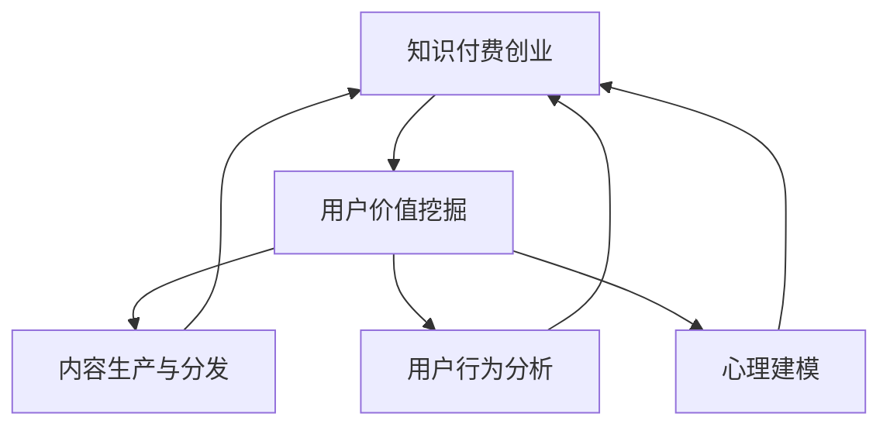

                 

# 知识付费创业的用户价值挖掘

## 1. 背景介绍

在知识付费浪潮席卷全球的当下，通过提供有价值的信息和技能来满足用户需求成为了一种热门的创业方式。随着信息时代的发展，用户对于知识的渴求日益增加，他们希望通过付费购买高效、有针对性的信息，以节约时间并提高效率。这一趋势为知识付费领域提供了广阔的市场空间。然而，创业成功与否的关键在于能否深刻理解用户需求，并据此设计出能提供真正价值的服务。本文将从用户价值挖掘的角度出发，探讨知识付费创业的可行性及具体实施策略。

## 2. 核心概念与联系

### 2.1 核心概念概述

**知识付费创业**：指通过提供优质、高效的知识内容，满足用户学习、工作、生活等多方面的需求，实现知识变现的过程。

**用户价值挖掘**：指通过对用户需求、行为、心理等进行分析，找到用户的核心痛点，从而提供能解决这些痛点的有价值的服务。

**内容生产与分发**：知识付费创业的基石，包括内容创作、质量控制、推荐算法等环节。

**用户行为分析**：通过数据采集、统计、分析等手段，了解用户的使用习惯、偏好、需求变化等，为服务优化和产品迭代提供依据。

**心理建模**：运用心理学理论，构建用户模型，预测用户行为，引导用户购买决策。

这些概念通过以下Mermaid流程图展现它们之间的联系：



### 2.2 核心概念原理和架构

知识付费创业的核心在于提供高价值的内容服务，而用户价值挖掘是实现这一目标的基础。用户价值挖掘涉及对用户需求、行为、心理等多个维度的分析，目的是构建一个完整的用户画像，进而设计出贴合用户需求的服务和产品。

**内容生产与分发**：内容生产是知识付费创业的基础，需依靠专家、学者、专业人士等提供高质量、有深度、系统化的内容。分发则通过推荐算法、营销策略、平台建设等方式，将内容精准推送至目标用户。

**用户行为分析**：通过数据分析工具（如Google Analytics、Tableau等）收集用户行为数据，并进行统计分析，从而识别用户的使用习惯、活跃时间、购买偏好等。

**心理建模**：运用心理学理论（如社会认同理论、自我决定理论等），构建用户心理模型，预测用户行为，进而引导用户进行付费购买。

## 3. 核心算法原理 & 具体操作步骤

### 3.1 算法原理概述

知识付费创业中，用户价值挖掘的核心是通过分析用户行为数据和心理特征，构建用户画像，并据此设计服务。这一过程涉及多个算法和模型，如推荐系统、情感分析、用户行为预测等。

### 3.2 算法步骤详解

1. **数据收集与预处理**：收集用户行为数据（如浏览记录、购买记录、点击率等），并进行清洗、去重、归一化等预处理。
2. **特征提取与工程**：从原始数据中提取出有意义的特征，如浏览时长、购买频率、互动深度等，并进行特征工程。
3. **用户行为预测**：构建用户行为预测模型（如随机森林、LSTM等），预测用户可能感兴趣的内容或产品。
4. **内容推荐算法**：根据预测结果，使用推荐算法（如协同过滤、基于内容的推荐等）为用户推荐个性化内容。
5. **心理建模与行为引导**：利用心理学原理，构建用户心理模型，通过引导性内容或营销策略，激发用户的购买兴趣。

### 3.3 算法优缺点

**优点**：
- 通过精细化用户画像，提供更加个性化、精准的服务，提升用户体验。
- 通过数据分析和预测，减少信息过载，降低用户决策成本。
- 提高内容推荐效率，增加平台收益。

**缺点**：
- 数据隐私问题：用户行为数据的收集和使用可能涉及隐私问题，需要严格遵守法律法规。
- 数据噪音：数据采集和预处理中可能存在噪音，影响模型准确性。
- 心理建模复杂：用户心理模型的构建复杂且难以精确预测。

### 3.4 算法应用领域

知识付费创业涉及多个领域，如在线教育、职业培训、知识管理等。以下以在线教育为例，介绍知识付费创业在实际中的应用。

**在线教育**：
1. **用户画像构建**：通过收集用户的学习历史、行为数据，构建学生画像，了解其学习习惯、知识水平、兴趣方向等。
2. **内容推荐**：根据学生画像，推荐适合的课程、视频、教材等，提高学习效率。
3. **心理建模**：利用社会认同理论，构建学生群体心理模型，设计有吸引力的激励机制，增加课程订阅率。
4. **行为分析**：分析学生在学习过程中的表现，如学习时长、进度、反馈等，进行个性化的辅导和支持。

## 4. 数学模型和公式 & 详细讲解 & 举例说明

### 4.1 数学模型构建

知识付费创业中的用户价值挖掘主要涉及推荐系统、用户行为预测、情感分析等。这里以推荐系统为例，介绍其数学模型的构建。

推荐系统的数学模型一般由用户和物品两个维度组成，其中用户维度包括用户画像、历史行为等，物品维度包括物品特征、评分等。推荐系统常用的模型包括协同过滤、基于内容的推荐、矩阵分解等。

### 4.2 公式推导过程

以协同过滤推荐算法为例，推导其基本公式：

假设用户集合为$U$，物品集合为$I$，用户$u$对物品$i$的评分表示为$r_{ui}$，矩阵$\mathbf{R}$表示用户和物品之间的评分矩阵。协同过滤算法的目标是通过用户的历史行为数据，找到与用户$u$兴趣相似的其他用户，并推荐这些用户喜欢的物品。

设$\mathbf{R}_{ui}$为$\mathbf{R}$矩阵中第$u$行第$i$列的元素，即用户$u$对物品$i$的评分。设$\mathbf{R}_{ui}^+$为$\mathbf{R}_{ui}$加上一个小的正数$\epsilon$，以避免出现除以0的情况。协同过滤算法的目标是为用户$u$推荐与评分最高的物品相似的物品，即：

$$
\hat{i} = \arg\max_{i \in I} \frac{r_{ui}^+}{\sqrt{(\sum_{j=1}^{|U|}r_{uj}^+)^2 + \epsilon}} \cdot \frac{r_{vi}^+}{\sqrt{(\sum_{j=1}^{|U|}r_{vj}^+)^2 + \epsilon}}
$$

其中，$v$为与用户$u$相似的用户，$\hat{i}$为用户$u$可能感兴趣的新物品。

### 4.3 案例分析与讲解

以Coursera平台为例，介绍如何通过推荐系统提升用户价值。

Coursera利用用户历史行为数据，构建用户画像，并通过协同过滤算法为用户推荐相关课程。例如，一个用户$u$曾订阅并学习过统计学相关课程，系统会推荐其他用户$v$对统计学课程的评价和评分，进而预测用户$u$可能感兴趣的统计学进阶课程。

系统通过不断的学习和调整，逐渐提升推荐的准确性和用户满意度，从而吸引更多用户注册和付费。

## 5. 项目实践：代码实例和详细解释说明

### 5.1 开发环境搭建

在知识付费创业项目中，开发环境搭建是基础。以下是一个Python开发环境的搭建过程：

1. **安装Python和虚拟环境**：
```
pip install python3.8
python3 -m venv env
source env/bin/activate
```

2. **安装依赖库**：
```
pip install pandas numpy scikit-learn scipy matplotlib
```

3. **配置开发工具**：
安装Jupyter Notebook、Visual Studio Code等开发工具，用于编写代码和数据可视化。

### 5.2 源代码详细实现

以Coursera为例，展示推荐系统的代码实现。

```python
import pandas as pd
import numpy as np
from sklearn.decomposition import TruncatedSVD

# 加载用户行为数据
data = pd.read_csv('user_behavior.csv')

# 构建用户-物品评分矩阵
R = np.array(data[['user_id', 'item_id', 'rating']].pivot(index='user_id', columns='item_id', values='rating').fillna(0))

# 计算均值矩阵
R_mean = np.nan_to_num(R.mean(axis=0))

# 计算标准差矩阵
R_std = np.nan_to_num(R.std(axis=0))

# 标准化评分矩阵
R_norm = (R - R_mean) / R_std

# 进行矩阵分解，构建推荐模型
svd = TruncatedSVD(n_components=20)
svd.fit(R_norm)

# 预测用户推荐物品
def predict(u):
    return svd.transform(R_norm).getrow(u).dot(svd.components_.T)

# 生成推荐列表
user = 100  # 指定用户ID
predictions = predict(user)
top_items = [item for item in predictions.argsort()[:-20:-1] if R_norm[user, item] != 0]

# 输出推荐结果
print("推荐给用户", user, "的物品：", top_items)
```

### 5.3 代码解读与分析

上述代码中，我们首先加载用户行为数据，构建用户-物品评分矩阵。然后计算均值和标准差，对评分矩阵进行标准化处理。接下来，使用TruncatedSVD算法进行矩阵分解，得到推荐模型。最后，通过模型预测用户推荐物品，并生成推荐列表。

在代码实现中，我们采用了基于协同过滤的推荐算法，通过计算均值和标准差，对原始评分矩阵进行标准化处理，以消除评分数据中的噪声。然后，利用TruncatedSVD算法进行矩阵分解，得到低秩近似矩阵，用于推荐预测。

## 6. 实际应用场景

### 6.1 在线教育

在线教育领域是知识付费创业的重要应用场景之一。通过推荐系统、学习分析、课程评估等技术，平台能够提供个性化学习体验，帮助用户高效掌握知识。

例如，Khan Academy利用用户行为数据，构建学生画像，并通过推荐算法推荐适合的课程和学习资源。平台还定期进行课程评估，收集学生反馈，据此优化课程内容和教学方法，提升用户学习效果。

### 6.2 职业培训

职业培训领域需要提供针对性强、应用性广的课程，以满足企业对员工培训的需求。通过用户行为分析和内容推荐，平台能够精准推荐课程，减少培训成本，提升培训效果。

以Coursera为例，平台通过分析用户学习历史和行为数据，推荐适合的课程和学习路径，帮助用户系统化地掌握新技能，同时提供个性化辅导，提高培训效率。

### 6.3 知识管理

知识管理领域主要涉及企业内部的知识共享和知识管理。通过推荐系统、内容管理、知识库搜索等技术，平台能够帮助员工高效获取所需信息，提升工作效率。

例如，Confluence利用推荐算法推荐相关文档，使用户能够快速找到需要的资料。平台还通过知识库搜索和内容管理，帮助用户整理和共享知识，构建知识管理系统。

## 7. 工具和资源推荐

### 7.1 学习资源推荐

1. **Coursera的《机器学习》课程**：由斯坦福大学Andrew Ng教授主讲，涵盖机器学习基础、算法、应用等方面，适合初学者和进阶者学习。
2. **《Python数据科学手册》**：详细介绍Python在数据科学中的应用，涵盖数据清洗、可视化、统计分析等，是Python学习的经典书籍。
3. **《推荐系统实战》**：深入浅出地介绍了推荐系统的构建和应用，包括协同过滤、基于内容的推荐、深度学习推荐等。
4. **Kaggle**：数据科学和机器学习竞赛平台，提供大量开源数据集和经典竞赛案例，适合学习和实践。
5. **Udacity**：提供职业培训课程，涵盖数据分析、机器学习、深度学习等，适合提升职业技能。

### 7.2 开发工具推荐

1. **Python**：Python是数据科学和机器学习的主流编程语言，拥有丰富的库和框架支持。
2. **Jupyter Notebook**：支持数据可视化、代码编写和交互式计算，是Python开发常用的IDE。
3. **TensorFlow**：Google开发的深度学习框架，支持大规模模型训练和优化。
4. **PyTorch**：Facebook开发的深度学习框架，支持动态计算图，适合研究和开发。
5. **Scikit-learn**：Python的数据科学库，涵盖数据处理、机器学习、模型评估等。

### 7.3 相关论文推荐

1. **《推荐系统构建》**：介绍了推荐系统的基本原理、算法和应用，是推荐系统研究的入门教材。
2. **《协同过滤推荐算法》**：详细介绍了协同过滤算法的原理和实现，是推荐系统研究的重要参考。
3. **《深度学习在推荐系统中的应用》**：探讨了深度学习在推荐系统中的应用，涵盖神经网络、深度学习推荐等。
4. **《用户行为分析》**：介绍了用户行为分析的基本方法和技术，是用户行为研究的经典文献。
5. **《社会心理学》**：了解用户心理特征和行为规律，有助于构建更精准的用户画像。

## 8. 总结：未来发展趋势与挑战

### 8.1 研究成果总结

本文从用户价值挖掘的角度，介绍了知识付费创业的核心技术和实际应用。通过分析用户需求、行为、心理，构建精准的用户画像，并设计个性化推荐算法，提升用户体验和平台收益。

### 8.2 未来发展趋势

1. **人工智能技术的应用**：未来，人工智能技术将在知识付费创业中发挥更加重要的作用，如利用自然语言处理技术进行内容推荐、情感分析等。
2. **用户个性化需求的提升**：随着用户需求的多样化，个性化推荐算法需要不断优化，提升推荐准确性和用户满意度。
3. **大数据与云计算的结合**：大数据和云计算技术的进步，将使得知识付费创业能够处理和分析更大规模的数据，提供更精准的服务。

### 8.3 面临的挑战

1. **数据隐私和安全问题**：用户行为数据的收集和处理可能涉及隐私和安全问题，需要严格遵守法律法规。
2. **推荐系统模型的复杂性**：推荐系统模型的构建和优化复杂，需要不断迭代和优化。
3. **用户行为变化的不确定性**：用户行为变化不确定，需要实时调整推荐策略和内容。

### 8.4 研究展望

未来，知识付费创业需要结合人工智能、大数据、云计算等前沿技术，提升推荐算法的准确性和用户满意度。同时，需要关注用户隐私保护，构建安全和透明的推荐系统。此外，需要不断探索新的数据来源和技术手段，拓展知识付费创业的应用场景和领域。

## 9. 附录：常见问题与解答

**Q1: 什么是知识付费创业？**

A: 知识付费创业指通过提供高质量、有深度的内容，满足用户学习、工作、生活等方面的需求，实现知识变现的过程。

**Q2: 如何理解用户价值挖掘？**

A: 用户价值挖掘指通过分析用户需求、行为、心理等，构建精准的用户画像，设计满足用户需求的产品和服务，提升用户体验和平台收益。

**Q3: 知识付费创业中推荐系统的核心是什么？**

A: 推荐系统的核心在于构建精准的用户画像，设计个性化推荐算法，提升推荐准确性和用户满意度。

**Q4: 知识付费创业的未来趋势是什么？**

A: 未来，知识付费创业将更加依赖人工智能、大数据、云计算等技术，提升推荐算法的准确性和用户满意度。同时，需要关注用户隐私保护，构建安全和透明的推荐系统。

**Q5: 如何进行知识付费创业？**

A: 知识付费创业需要结合市场需求，设计和开发高质量的内容产品，并通过数据挖掘和推荐算法，提供个性化服务。同时，需要不断优化和迭代，提升用户满意度和平台收益。

---

作者：禅与计算机程序设计艺术 / Zen and the Art of Computer Programming

