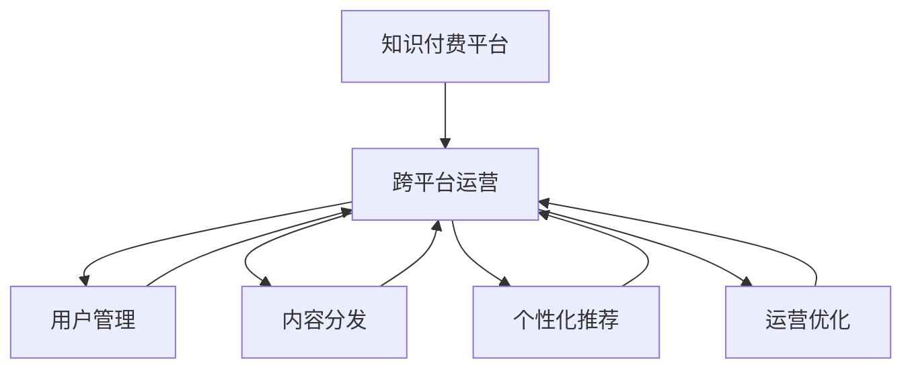

                 

# 知识付费创业的跨平台运营策略

> 关键词：知识付费, 跨平台, 用户管理, 内容分发, 个性化推荐, 运营优化

## 1. 背景介绍

### 1.1 问题由来
近年来，知识付费行业迎来了蓬勃发展，各大知识平台如雨后春笋般涌现。然而，单一平台运营模式的局限性逐渐显现：内容受限、用户粘性不高、市场竞争力不足。面对这一挑战，越来越多的知识付费平台开始探索跨平台运营策略，即在多个平台同时提供知识内容，实现用户和内容的多平台互动。这一策略不仅能够扩大内容覆盖范围，还能增强用户粘性，提升市场竞争力。

### 1.2 问题核心关键点
跨平台运营的核心在于如何高效管理不同平台上的用户数据和内容分发，确保内容在不同平台之间的一致性和关联性，同时最大化用户粘性和转化率。通过跨平台运营，平台能够汇聚更多优质内容，提升用户活跃度，拓宽市场份额。然而，这需要系统性的策略和技术支持。

### 1.3 问题研究意义
探索知识付费跨平台运营策略，对于提升知识付费平台的用户粘性和市场竞争力，推动知识付费行业健康发展具有重要意义：

1. **扩大内容覆盖**：通过跨平台分发，平台能够覆盖更广泛的用户群体，提升内容触达率。
2. **增强用户粘性**：在多个平台提供一致的高质量内容，满足用户多平台需求，增强用户粘性。
3. **提升市场竞争力**：跨平台运营能够吸引更多用户和合作伙伴，提升平台的市场地位和影响力。
4. **技术创新**：跨平台运营需要解决数据管理和内容分发等技术难题，推动相关技术的发展和应用。

## 2. 核心概念与联系

### 2.1 核心概念概述

为更好地理解跨平台运营策略，本节将介绍几个密切相关的核心概念：

- **知识付费平台(Knowledge Subscription Platform, KSP)**：以知识内容为核心，向用户提供付费订阅服务的在线平台。常见平台包括得到、喜马拉雅、知乎live等。
- **跨平台运营**：指在多个平台（如App、网站、社交媒体等）上同时运营知识内容，实现用户和内容的多平台互动。
- **用户管理(User Management)**：指跨平台运营中用户信息的集中管理和统一维护，包括用户注册、登录、个人信息管理等。
- **内容分发(Content Distribution)**：指在跨平台环境中，内容从源头向终端用户的推送和管理，包括内容的分类、排序、推荐等。
- **个性化推荐(Personalized Recommendation)**：指根据用户行为和偏好，推送个性化内容，提升用户体验和满意度。
- **运营优化(Operation Optimization)**：指通过数据驱动的策略和算法，持续优化跨平台运营的各个环节，提升运营效率和效果。

这些核心概念之间的逻辑关系可以通过以下Mermaid流程图来展示：



这个流程图展示了几大核心概念的相互关系：

1. 知识付费平台通过跨平台运营扩展其内容覆盖范围。
2. 用户管理和内容分发是跨平台运营的两个核心环节。
3. 个性化推荐和运营优化进一步提升跨平台运营的效率和效果。

这些概念共同构成了跨平台运营的框架，使得平台能够更好地管理用户和分发内容。

## 3. 核心算法原理 & 具体操作步骤
### 3.1 算法原理概述

跨平台运营的算法原理主要涉及用户管理、内容分发、个性化推荐和运营优化等多个方面。以下是各个关键点的算法原理概述：

1. **用户管理**：用户信息是跨平台运营的基础。用户管理算法主要负责用户数据的收集、整理和存储，确保用户在不同平台上的信息一致性和准确性。
2. **内容分发**：内容分发算法需要根据用户行为和偏好，将内容从源头推送到用户终端，同时保证内容的分类、排序和推荐符合用户需求。
3. **个性化推荐**：个性化推荐算法利用用户行为数据和内容标签，构建用户画像，实现内容的个性化推送，提升用户体验。
4. **运营优化**：运营优化算法通过数据分析和策略调整，持续提升跨平台运营的各项指标，包括用户增长、内容质量和用户满意度等。

### 3.2 算法步骤详解

以下是跨平台运营主要算法的详细步骤：

**Step 1: 用户信息收集与管理**
- 在各大平台收集用户基本信息，如姓名、年龄、性别等。
- 收集用户行为数据，如浏览历史、购买记录、评分反馈等。
- 建立统一的用户ID系统，确保用户在不同平台上的信息一致。
- 使用数据清洗和去重技术，保证用户数据的准确性和完整性。

**Step 2: 内容识别与分类**
- 识别用户在不同平台上的浏览和购买内容，自动分类为不同的知识领域，如科技、文学、教育等。
- 为每个分类赋予相应的权重，根据权重对内容进行优先级排序。
- 对内容进行标签标注，如难易程度、更新频率、内容质量等，便于后续推荐。

**Step 3: 内容分发策略设计**
- 根据用户行为数据和内容标签，设计合理的分发策略。如按内容领域、热度、用户偏好等进行分发。
- 考虑内容的时效性，设计动态分发策略，如热门内容优先分发。
- 引入推荐算法，如协同过滤、基于内容的推荐等，提升内容分发效果。

**Step 4: 个性化推荐模型构建**
- 构建个性化推荐模型，如协同过滤模型、基于深度学习的推荐模型等。
- 根据用户行为数据和内容标签，训练推荐模型，预测用户感兴趣的内容。
- 设计推荐算法，如基于多臂老虎机的推荐算法、基于图神经网络的推荐算法等。
- 实时更新推荐模型，根据用户反馈调整推荐策略。

**Step 5: 运营优化与反馈闭环**
- 利用数据挖掘和分析技术，持续监控和优化跨平台运营的各项指标，如用户增长、内容质量、用户满意度等。
- 设计运营优化算法，如用户留存率优化算法、内容流量分配算法等。
- 建立反馈闭环，根据用户反馈和行为数据，不断优化平台运营策略。

### 3.3 算法优缺点

跨平台运营的算法具有以下优点：

1. **覆盖范围广**：通过跨平台运营，平台能够覆盖更多的用户群体，提升内容触达率。
2. **用户粘性高**：统一的用户管理和个性化推荐能够增强用户粘性，提升用户满意度。
3. **市场竞争力强**：多平台运营能够吸引更多用户和合作伙伴，提升平台的市场地位。

同时，该算法也存在一些局限性：

1. **数据整合复杂**：不同平台的数据格式和来源各异，数据整合和同步较为复杂。
2. **内容一致性难保证**：不同平台上的内容标准和质量可能不一致，难以保证内容的整体一致性。
3. **推荐精度受限**：推荐算法依赖于用户行为数据和内容标签，推荐精度可能受限于数据质量和算法模型。
4. **运营成本高**：跨平台运营需要大量的数据管理和内容分发资源，运营成本较高。

尽管存在这些局限性，但就目前而言，跨平台运营仍然是知识付费平台的重要发展方向。未来相关研究的重点在于如何进一步简化数据整合流程，提升内容一致性，优化推荐算法，降低运营成本。

### 3.4 算法应用领域

跨平台运营的算法在知识付费平台中的应用非常广泛，涵盖了以下几个主要领域：

- **多平台用户管理**：统一管理用户在App、网站、社交媒体等不同平台上的信息，实现跨平台身份认证和登录。
- **内容分发优化**：根据用户行为数据，优化不同平台上的内容推送策略，提升内容触达率和用户满意度。
- **个性化推荐系统**：在多个平台提供个性化内容推荐，提升用户粘性和转化率。
- **运营数据监控**：利用数据分析技术，持续监控和优化跨平台运营的各项指标，提升运营效率。

## 4. 数学模型和公式 & 详细讲解 & 举例说明
### 4.1 数学模型构建

为了更系统地描述跨平台运营的算法，下面将构建几个关键的数学模型：

- **用户行为矩阵**：记录用户在不同平台上的行为数据，如浏览时间、购买记录等。
- **内容标签矩阵**：记录内容的不同标签，如主题、难度、更新频率等。
- **推荐矩阵**：根据用户行为和内容标签，预测用户感兴趣的内容。

假设用户集合为 $U$，内容集合为 $V$，行为集合为 $S$，标签集合为 $T$。则用户行为矩阵 $R$、内容标签矩阵 $L$ 和推荐矩阵 $P$ 可以分别表示为：

$$
R = \{r_{iu}\}, \quad r_{iu} \in [0,1]
$$

$$
L = \{l_{iv}\}, \quad l_{iv} \in [0,1]
$$

$$
P = \{p_{iu}\}, \quad p_{iu} \in [0,1]
$$

其中 $r_{iu}$ 表示用户 $i$ 对内容 $u$ 的评分，$l_{iv}$ 表示内容 $u$ 的标签 $v$ 的权重，$p_{iu}$ 表示用户 $i$ 对内容 $u$ 的推荐得分。

### 4.2 公式推导过程

以下我们将对用户行为矩阵 $R$、内容标签矩阵 $L$ 和推荐矩阵 $P$ 进行推导。

**用户行为矩阵 $R$**：
假设用户 $i$ 在不同平台上的行为数据为 $s_i$，内容 $u$ 的行为数据为 $r_u$。则用户行为矩阵 $R$ 可以表示为：

$$
R_{iu} = \begin{cases}
\frac{s_i}{\sum_j s_j}, & \text{如果用户 } i \text{ 浏览或购买了内容 } u \\
0, & \text{否则}
\end{cases}
$$

**内容标签矩阵 $L$**：
假设内容 $u$ 的标签为 $t$，标签权重为 $l_t$。则内容标签矩阵 $L$ 可以表示为：

$$
L_{iv} = \frac{l_v}{\sum_j l_j}, \quad v \in T
$$

**推荐矩阵 $P$**：
假设用户 $i$ 对内容 $u$ 的推荐得分 $p_iu$ 由两部分组成：用户行为得分 $r_iu$ 和内容标签得分 $l_u$。则推荐矩阵 $P$ 可以表示为：

$$
P_{iu} = \alpha r_{iu} + (1-\alpha) l_u
$$

其中 $\alpha$ 为行为得分与标签得分的权重系数。

### 4.3 案例分析与讲解

以一个简单的知识付费平台为例，分析上述模型的实际应用。

假设某知识付费平台包含两个平台（App和网站），用户集合为 $U$，内容集合为 $V$，行为集合为 $S$，标签集合为 $T$。平台收集了用户在不同平台上的行为数据，包括浏览时间、购买记录等。同时，平台对每篇内容标注了不同标签，如主题、难度、更新频率等。

**用户行为矩阵 $R$**：
平台通过数据分析，得到用户行为矩阵 $R$。例如，用户在App上浏览了10篇文章，在网站上购买了3本书。则用户行为矩阵 $R$ 为：

$$
R = \begin{bmatrix}
0.2 & 0.3 \\
0.3 & 0.5 \\
0.1 & 0.2
\end{bmatrix}
$$

**内容标签矩阵 $L$**：
平台对每篇内容标注了不同标签，如主题、难度、更新频率等。例如，内容1的主题标签权重为0.4，难度标签权重为0.3，更新频率标签权重为0.3。则内容标签矩阵 $L$ 为：

$$
L = \begin{bmatrix}
0.4 & 0.3 & 0.3 \\
0.2 & 0.5 & 0.3 \\
0.3 & 0.2 & 0.5
\end{bmatrix}
$$

**推荐矩阵 $P$**：
平台使用协同过滤算法，预测用户对每篇内容的推荐得分。例如，用户1对内容1的推荐得分为 $0.6$，对内容2的推荐得分为 $0.5$。则推荐矩阵 $P$ 为：

$$
P = \begin{bmatrix}
0.6 & 0.5 \\
0.5 & 0.7 \\
0.4 & 0.6
\end{bmatrix}
$$

通过上述模型的构建和推导，我们可以看到，跨平台运营中的用户行为、内容标签和推荐得分之间的关系，以及如何通过数据和算法来实现个性化推荐。

## 5. 项目实践：代码实例和详细解释说明
### 5.1 开发环境搭建

在进行跨平台运营的实践前，我们需要准备好开发环境。以下是使用Python进行开发的环境配置流程：

1. 安装Anaconda：从官网下载并安装Anaconda，用于创建独立的Python环境。

2. 创建并激活虚拟环境：
```bash
conda create -n ksp_env python=3.8 
conda activate ksp_env
```

3. 安装PyTorch：根据CUDA版本，从官网获取对应的安装命令。例如：
```bash
conda install pytorch torchvision torchaudio cudatoolkit=11.1 -c pytorch -c conda-forge
```

4. 安装Flask：用于搭建跨平台用户管理系统和内容分发平台。
```bash
pip install flask
```

5. 安装SQLAlchemy：用于管理用户和内容数据。
```bash
pip install sqlalchemy
```

6. 安装Scikit-learn：用于数据分析和模型训练。
```bash
pip install scikit-learn
```

完成上述步骤后，即可在`ksp_env`环境中开始跨平台运营实践。

### 5.2 源代码详细实现

这里我们以跨平台用户管理系统为例，给出使用Python Flask和SQLAlchemy进行开发的基本代码实现。

首先，定义用户模型：

```python
from flask_sqlalchemy import SQLAlchemy

db = SQLAlchemy(app)

class User(db.Model):
    id = db.Column(db.Integer, primary_key=True)
    name = db.Column(db.String(64), unique=True)
    email = db.Column(db.String(120), unique=True)
    platforms = db.relationship('Platform', backref='user', lazy='dynamic')

class Platform(db.Model):
    id = db.Column(db.Integer, primary_key=True)
    platform_name = db.Column(db.String(64))
    user_id = db.Column(db.Integer, db.ForeignKey('user.id'))
```

然后，定义平台模型：

```python
class Platform(db.Model):
    id = db.Column(db.Integer, primary_key=True)
    platform_name = db.Column(db.String(64))
    user_id = db.Column(db.Integer, db.ForeignKey('user.id'))
    content = db.relationship('Content', backref='platform', lazy='dynamic')

class Content(db.Model):
    id = db.Column(db.Integer, primary_key=True)
    content_name = db.Column(db.String(120))
    platform_id = db.Column(db.Integer, db.ForeignKey('platform.id'))
    tags = db.relationship('Tag', backref='content', lazy='dynamic')

class Tag(db.Model):
    id = db.Column(db.Integer, primary_key=True)
    tag_name = db.Column(db.String(64))
    content_id = db.Column(db.Integer, db.ForeignKey('content.id'))
```

接着，定义用户登录、注册和内容浏览等API接口：

```python
from flask import request, jsonify

@app.route('/login', methods=['POST'])
def login():
    # 实现用户登录逻辑
    pass

@app.route('/register', methods=['POST'])
def register():
    # 实现用户注册逻辑
    pass

@app.route('/content', methods=['GET'])
def get_content():
    # 实现内容浏览逻辑
    pass
```

最后，启动Flask服务器：

```python
if __name__ == '__main__':
    app.run(debug=True)
```

以上就是使用Flask和SQLAlchemy搭建跨平台用户管理系统和内容分发平台的基本代码实现。

### 5.3 代码解读与分析

让我们再详细解读一下关键代码的实现细节：

**User类**：
- `__init__`方法：初始化用户的基本信息，如姓名、邮箱等。
- `platforms`属性：记录用户在不同平台上的注册信息。

**Platform类**：
- `__init__`方法：初始化平台的基本信息，如平台名称。
- `user_id`属性：记录用户ID，与User类关联。
- `content`属性：记录该平台上的内容信息。

**Content类**：
- `__init__`方法：初始化内容的基本信息，如内容名称。
- `platform_id`属性：记录平台ID，与Platform类关联。
- `tags`属性：记录内容的标签信息。

**Tag类**：
- `__init__`方法：初始化标签的基本信息，如标签名称。
- `content_id`属性：记录内容ID，与Content类关联。

**用户登录和注册接口**：
- `/login`接口：实现用户登录逻辑，验证用户信息，生成登录令牌。
- `/register`接口：实现用户注册逻辑，生成新的用户信息，并存储到数据库。

**内容浏览接口**：
- `/content`接口：实现内容浏览逻辑，根据用户ID和平台ID查询用户浏览内容，并返回结果。

可以看到，通过Flask和SQLAlchemy，我们可以快速搭建跨平台用户管理系统和内容分发平台。开发者可以根据具体需求，进行更多的功能扩展和优化。

当然，工业级的系统实现还需考虑更多因素，如系统安全、数据备份、用户反馈等。但核心的跨平台运营逻辑基本与此类似。

## 6. 实际应用场景
### 6.1 智能客服系统

跨平台运营在智能客服系统中的应用，能够显著提升客户体验和服务效率。传统客服往往只能在一个平台上提供服务，响应速度慢，且难以保证服务质量的一致性。通过跨平台运营，智能客服系统可以在多个平台上同时提供服务，满足用户的多平台需求，提升响应速度和用户满意度。

在技术实现上，可以收集用户在各个平台上的聊天记录和用户行为数据，通过数据分析和用户画像构建，实现智能客服系统的多平台集成。用户可以在App、网站、社交媒体等不同平台上咨询客服，客服系统自动将用户信息整合，统一处理用户请求，并提供一致的服务响应。

### 6.2 在线教育平台

在线教育平台通过跨平台运营，可以实现多平台知识共享和学生管理。不同平台上的学生数据、课程内容和互动数据可以无缝整合，提升学习体验和效果。

具体而言，在线教育平台可以通过学习管理系统(LMS)实现跨平台运营。学生在App、网站、社交媒体等不同平台上注册和登录，所有学习数据和互动数据都可以通过LMS进行集中管理和分析。平台可以基于用户行为数据，推荐适合的课程和资源，同时实现个性化学习路径的设计和调整。

### 6.3 新闻聚合平台

新闻聚合平台通过跨平台运营，可以实现内容的全面覆盖和个性化推荐。不同平台上的新闻内容可以整合到一个平台上，用户可以自由浏览和选择，同时平台可以基于用户兴趣和行为数据，实现个性化新闻推荐。

具体而言，新闻聚合平台可以通过内容管理系统CMS实现跨平台运营。平台从不同来源收集新闻内容，通过CMS进行统一管理和发布。平台可以基于用户行为数据，推荐用户感兴趣的新闻，同时实现跨平台的用户互动和反馈收集。

## 7. 工具和资源推荐
### 7.1 学习资源推荐

为了帮助开发者系统掌握跨平台运营的理论基础和实践技巧，这里推荐一些优质的学习资源：

1. **《Python Web开发实战》**：全面介绍Flask等Web框架的使用，适合有一定编程基础的开发者。
2. **《SQLAlchemy实战》**：深入讲解SQLAlchemy的使用，适合数据库开发人员。
3. **《Python数据分析入门》**：介绍Python在数据分析中的应用，适合数据分析师和机器学习工程师。
4. **《TensorFlow实战》**：介绍TensorFlow在跨平台运营中的应用，适合深度学习开发者。
5. **《数据科学基础》**：介绍数据科学的基本概念和工具，适合初学者。

通过对这些资源的学习实践，相信你一定能够快速掌握跨平台运营的核心技术，并用于解决实际的运营问题。

### 7.2 开发工具推荐

高效的开发离不开优秀的工具支持。以下是几款用于跨平台运营开发的常用工具：

1. **Flask**：轻量级Web框架，易于上手，适合开发跨平台用户管理系统和内容分发平台。
2. **SQLAlchemy**：高级ORM框架，支持多种数据库，适合跨平台数据管理和存储。
3. **TensorFlow**：强大的深度学习框架，适合跨平台推荐系统和智能客服系统的开发。
4. **Kibana**：开源的数据可视化工具，适合跨平台运营数据监控和分析。
5. **JIRA**：项目管理工具，适合跨平台运营的策略制定和任务管理。

合理利用这些工具，可以显著提升跨平台运营的开发效率，加快创新迭代的步伐。

### 7.3 相关论文推荐

跨平台运营技术的发展源于学界的持续研究。以下是几篇奠基性的相关论文，推荐阅读：

1. **《Cross-Platform User Experience Design》**：介绍跨平台用户界面设计的基本原则和实现方法。
2. **《Cross-Platform Content Delivery》**：探讨跨平台内容分发技术，包括缓存策略、负载均衡等。
3. **《Cross-Platform Recommendation Systems》**：介绍跨平台推荐系统的设计原理和算法实现。
4. **《Cross-Platform User Modeling》**：介绍跨平台用户建模技术，实现用户行为数据的整合和分析。
5. **《Cross-Platform Personalization in E-commerce》**：探讨跨平台个性化推荐在电商中的应用，提升用户购物体验。

这些论文代表了大规模跨平台运营技术的发展脉络。通过学习这些前沿成果，可以帮助研究者把握学科前进方向，激发更多的创新灵感。

## 8. 总结：未来发展趋势与挑战

### 8.1 总结

本文对知识付费跨平台运营策略进行了全面系统的介绍。首先阐述了跨平台运营的背景和意义，明确了其在用户管理和内容分发方面的核心作用。其次，从原理到实践，详细讲解了用户管理、内容分发、个性化推荐和运营优化等多个关键环节的算法原理和操作步骤。同时，本文还广泛探讨了跨平台运营在智能客服、在线教育、新闻聚合等多个领域的应用前景，展示了其广阔的想象空间。此外，本文精选了跨平台运营技术的各类学习资源，力求为读者提供全方位的技术指引。

通过本文的系统梳理，可以看到，跨平台运营策略在大规模知识付费平台中的应用，极大地提升了用户粘性和市场竞争力。未来，伴随技术的不断演进，跨平台运营必将成为知识付费行业的重要趋势，为平台带来更多的机遇和挑战。

### 8.2 未来发展趋势

展望未来，跨平台运营技术将呈现以下几个发展趋势：

1. **数据融合更加高效**：随着数据技术和存储技术的发展，不同平台之间的数据融合和整合将变得更加高效。大数据技术和云计算平台的支持，将大大提升跨平台运营的效率。
2. **个性化推荐更加精准**：通过深度学习和大数据技术，推荐算法将更加精准，能够根据用户行为数据和内容标签，实现更个性化、多样化的内容推荐。
3. **多平台互动更加紧密**：通过API接口和数据共享，不同平台之间的互动将更加紧密，实现跨平台的用户协同和内容互动。
4. **内容质量不断提升**：随着内容的聚合和整合，跨平台运营平台将能够提供更多优质、高质量的内容，满足用户的多样化需求。
5. **用户体验持续优化**：通过用户行为分析和个性化推荐，跨平台运营平台将不断优化用户体验，提升用户满意度和忠诚度。

以上趋势凸显了跨平台运营技术的广阔前景。这些方向的探索发展，必将进一步提升知识付费平台的用户粘性和市场竞争力，推动知识付费行业的健康发展。

### 8.3 面临的挑战

尽管跨平台运营技术已经取得了显著成就，但在迈向更加智能化、普适化应用的过程中，仍面临诸多挑战：

1. **数据安全和隐私保护**：跨平台运营需要整合和共享大量用户数据，如何在保护用户隐私的前提下，实现数据的有效利用，是亟待解决的问题。
2. **技术复杂度高**：跨平台运营涉及多平台的数据整合、内容分发和用户管理，技术实现复杂度较高，需要系统性的解决方案。
3. **用户体验一致性**：不同平台上的用户体验可能存在差异，如何实现跨平台的一致性和连续性，提升用户体验，是跨平台运营的重要挑战。
4. **内容版权问题**：跨平台运营需要解决内容的版权问题，确保内容的合法性和合规性，避免侵权风险。
5. **市场竞争激烈**：跨平台运营吸引了众多平台和企业的关注，市场竞争激烈，如何突围，实现差异化运营，是跨平台运营的重要课题。

正视跨平台运营面临的这些挑战，积极应对并寻求突破，将是大规模跨平台运营技术的不断成熟的重要保障。相信随着学界和产业界的共同努力，这些挑战终将一一被克服，跨平台运营技术必将在知识付费行业带来更加广阔的应用前景。

### 8.4 研究展望

未来，跨平台运营技术的研究方向主要集中在以下几个方面：

1. **跨平台数据整合和共享技术**：开发高效的数据整合和共享技术，提升不同平台之间的数据融合效率。
2. **跨平台个性化推荐算法**：探索更精准的跨平台推荐算法，提升推荐效果和用户满意度。
3. **跨平台用户行为分析**：利用数据挖掘和机器学习技术，深入分析用户行为数据，实现更精细化的用户画像和个性化推荐。
4. **跨平台内容管理和版权保护**：研究跨平台内容的有效管理和版权保护技术，确保内容的合法合规。
5. **跨平台用户体验优化**：通过跨平台的用户协同和内容互动，实现更高效、更一致的用户体验。

这些研究方向的探索，将进一步推动跨平台运营技术的发展，提升知识付费平台的用户粘性和市场竞争力，为知识付费行业的健康发展提供有力支持。

## 9. 附录：常见问题与解答

**Q1：跨平台运营是否适用于所有知识付费平台？**

A: 跨平台运营在大多数知识付费平台都具有适用性，特别是对于用户群体广泛、内容多样化的平台。但对于一些特定领域或小众平台，跨平台运营可能需要根据具体情况进行优化和调整。

**Q2：如何实现跨平台数据的统一管理？**

A: 跨平台数据统一管理可以通过数据同步工具和数据仓库实现。首先，确定一个统一的数据格式和标准，然后使用ETL工具将不同平台的数据导入到数据仓库中。在数据仓库中，使用数据整合工具进行数据清洗和去重，最终实现数据的统一管理和分析。

**Q3：跨平台运营中如何保证内容的一致性？**

A: 内容一致性可以通过内容审核和校验机制实现。在内容发布前，进行严格的审核和校验，确保内容质量符合平台标准。在内容分发时，使用统一的内容标签和标准，确保不同平台上的内容一致性。同时，定期进行内容比对和审核，及时发现和解决内容不一致的问题。

**Q4：跨平台运营中如何提升个性化推荐的效果？**

A: 提升个性化推荐效果的关键在于提高数据质量和优化推荐算法。首先，收集更多高质量的用户行为数据和内容标签，提高数据精度和覆盖率。然后，选择合适的推荐算法，如协同过滤、基于内容的推荐等，不断优化推荐模型。同时，引入多臂老虎机等策略，提升推荐算法的多样性和探索性。

**Q5：跨平台运营中如何处理用户行为数据的隐私保护问题？**

A: 处理用户行为数据的隐私保护问题，可以通过数据匿名化和差分隐私技术实现。在数据收集和处理过程中，对敏感信息进行匿名化处理，使用差分隐私算法对数据进行处理，确保用户隐私不被泄露。同时，建立数据使用规范和隐私保护机制，明确数据使用的目的和范围，增强用户对平台的信任感。

通过本文的系统梳理，我们可以看到，跨平台运营策略在大规模知识付费平台中的应用，极大地提升了用户粘性和市场竞争力。未来，伴随技术的不断演进，跨平台运营必将成为知识付费行业的重要趋势，为平台带来更多的机遇和挑战。总之，跨平台运营需要开发者根据具体平台和用户需求，不断优化技术和策略，方能得到理想的效果。

---

作者：禅与计算机程序设计艺术 / Zen and the Art of Computer Programming

