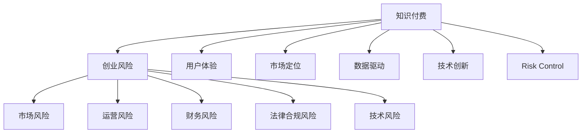

                 

# 知识付费创业的风险控制策略

> 关键词：知识付费, 创业, 风险控制, 在线教育, 用户体验, 市场定位, 数据驱动, 法律合规, 技术创新

## 1. 背景介绍

### 1.1 行业现状
随着互联网技术的发展，在线教育、知识付费等新兴领域迅速崛起，成为知识工作者实现价值转换的重要途径。从知识分享社区、在线课程到专业咨询，知识付费形式日益多样化，吸引了大量用户和投资。然而，由于市场环境的不确定性，以及商业模式、内容质量、用户体验等方面的问题，知识付费创业面临诸多挑战。近年来，行业内频繁出现企业倒闭、项目下架、用户流失等问题，暴露了传统知识付费模式的不足，迫切需要有效风险控制策略。

### 1.2 风险类型
知识付费创业主要面临以下几类风险：

- **市场风险**：市场需求变化、竞争加剧、用户获取成本高企等。
- **运营风险**：内容质量不稳定、用户流失、平台技术故障等。
- **财务风险**：资金链紧张、收支不平衡、投资回报期不确定等。
- **法律合规风险**：版权侵权、数据泄露、用户隐私保护等。
- **技术风险**：平台系统稳定性差、数据安全防护不足、技术迭代滞后等。

## 2. 核心概念与联系

### 2.1 核心概念概述

为深入理解知识付费创业的风险控制策略，本节将介绍几个关键概念及其相互联系：

- **知识付费**：指通过在线平台提供专业知识、技能培训等服务，用户付费获取的一种商业模式。
- **创业风险**：指创业者在创业过程中，因外部环境变化、内部资源不足等因素导致经营失败的概率。
- **风险控制**：指通过一系列策略和措施，降低风险发生的概率和影响程度，确保项目可持续发展的过程。
- **用户体验**：指用户在使用知识付费产品时的满意度、参与度和忠诚度。
- **市场定位**：指企业根据目标用户需求和自身资源，确定产品和服务在市场中的位置。
- **数据驱动**：指通过数据分析和处理，指导决策和运营的策略。
- **法律合规**：指遵守相关法律法规，确保业务运营合法合规。
- **技术创新**：指利用最新技术手段，提升平台性能和用户体验。

这些核心概念之间存在紧密的联系，共同构成了知识付费创业的风险控制策略框架。

### 2.2 核心概念原理和架构的 Mermaid 流程图



这个流程图展示了知识付费创业的风险控制策略的核心概念及其相互关系：

1. **知识付费** 是创业的基础，通过提供有价值的内容获取收益。
2. **创业风险** 贯穿于整个创业过程，需要从多个维度进行防范。
3. **市场风险** 、**运营风险** 、**财务风险** 、**法律合规风险** 、**技术风险** 是创业风险的主要类型。
4. **用户体验** 、**市场定位** 、**数据驱动** 、**技术创新** 是提升创业成功率的重要策略。
5. **风险控制** 策略需要综合考虑各类风险，采取有效措施降低风险影响。

## 3. 核心算法原理 & 具体操作步骤

### 3.1 算法原理概述

知识付费创业的风险控制策略，本质上是一个多目标优化问题。其核心思想是通过数据分析、模型预测和实时监控，识别潜在风险，并采取针对性措施进行防范。

假设有 $n$ 个潜在风险因素 $R=\{R_1, R_2, \cdots, R_n\}$，每个风险 $R_i$ 对应一个风险评分 $r_i$。风险控制的目标是最小化整体风险评分 $R$，即：

$$
R = \min_{r_1, r_2, \cdots, r_n} \sum_{i=1}^n w_ir_i
$$

其中 $w_i$ 为第 $i$ 个风险因素的权重，根据风险重要性进行调节。

### 3.2 算法步骤详解

基于上述优化目标，知识付费创业的风险控制策略一般包括以下几个关键步骤：

**Step 1: 风险识别**
- 通过数据分析，识别出影响创业的主要风险因素。
- 收集相关数据，建立风险评分模型。

**Step 2: 风险评估**
- 利用历史数据和机器学习模型，对每个风险因素进行定量评估。
- 根据风险评分模型，计算整体风险评分。

**Step 3: 风险预警**
- 设置风险阈值，当整体风险评分超过阈值时，发出预警。
- 根据风险类型，采取相应措施，如调整市场策略、优化用户体验等。

**Step 4: 风险缓解**
- 根据风险因素，制定针对性缓解措施。
- 定期对风险控制策略进行评估和调整。

### 3.3 算法优缺点

基于风险控制的多目标优化算法，具有以下优点：

- **全面性**：能够综合考虑多个风险因素，提供系统性解决方案。
- **实时性**：通过实时监控，及时发现和处理潜在风险。
- **灵活性**：根据不同情境，灵活调整风险评分权重，优化风险控制策略。

同时，该算法也存在一些局限性：

- **数据依赖**：风险评分模型的准确性依赖于数据的完备性和质量。
- **模型复杂度**：多目标优化模型的复杂度较高，需要更多计算资源。
- **动态性**：市场环境变化较快，需要持续更新模型以适应新情况。

### 3.4 算法应用领域

风险控制的多目标优化算法在知识付费创业中有广泛的应用：

- **市场开拓**：通过市场数据分析，识别增长机会和风险点，制定有效的市场推广策略。
- **用户流失预防**：通过用户行为分析，识别潜在流失用户，采取挽留措施。
- **财务优化**：通过收入和支出预测，优化现金流管理，防范资金链风险。
- **数据安全**：通过数据监控，及时发现和防范数据泄露和安全攻击。
- **技术迭代**：通过系统性能监控，确保技术架构和应用的稳定性和可靠性。

## 4. 数学模型和公式 & 详细讲解 & 举例说明

### 4.1 数学模型构建

为更好地理解知识付费创业的风险控制策略，本节将给出详细的数学模型构建。

假设有 $n$ 个潜在风险因素 $R=\{R_1, R_2, \cdots, R_n\}$，每个风险因素 $R_i$ 对应一个风险评分 $r_i$。风险控制的目标是最小化整体风险评分 $R$，即：

$$
R = \min_{r_1, r_2, \cdots, r_n} \sum_{i=1}^n w_ir_i
$$

其中 $w_i$ 为第 $i$ 个风险因素的权重，根据风险重要性进行调节。

### 4.2 公式推导过程

根据上述优化目标，我们采用多目标优化算法进行风险控制。常见的方法包括线性规划、层次规划、约束优化等。这里以线性规划为例，推导风险控制模型的公式。

构建线性规划模型如下：

$$
\begin{aligned}
\min_{r_1, r_2, \cdots, r_n} & \quad \sum_{i=1}^n w_ir_i \\
\text{s.t.} & \quad r_i \geq 0, i = 1, 2, \cdots, n
\end{aligned}
$$

求解线性规划模型，得到最优的风险评分向量 $r^*$，即为最终的风险控制策略。

### 4.3 案例分析与讲解

以用户流失预防为例，解释如何应用风险控制模型。

假设用户流失风险因素包括用户行为变化、服务响应时间、内容质量等。每个因素 $R_i$ 的风险评分可以通过历史数据分析得出。例如，某用户流失率较高的服务响应时间为 $R_1$，其风险评分为 3；内容质量为 $R_2$，风险评分为 2；用户行为变化为 $R_3$，风险评分为 1。根据模型，整体风险评分 $R$ 可以计算为：

$$
R = w_1r_1 + w_2r_2 + w_3r_3
$$

其中 $w_1$、$w_2$、$w_3$ 分别为服务响应时间、内容质量、用户行为变化的风险权重。例如，如果服务响应时间对用户流失的影响最大，可以设置 $w_1=0.6$、$w_2=0.3$、$w_3=0.1$。

通过计算得到 $R = 3 \times 0.6 + 2 \times 0.3 + 1 \times 0.1 = 2.3$，即整体风险评分为 2.3。当整体风险评分超过预设阈值时，如 2.5，系统将发出预警，并采取相应措施，如增加客服人员、优化内容质量、提升服务响应速度等。

## 5. 项目实践：代码实例和详细解释说明

### 5.1 开发环境搭建

在进行风险控制策略的开发前，需要准备以下开发环境：

1. **Python环境**：安装 Python 3.x 及必要的包，如 NumPy、Pandas、scikit-learn、matplotlib 等。
2. **数据环境**：准备好相应的风险数据集，并进行清洗、标注等预处理。
3. **服务器环境**：搭建一台服务器，安装相关的依赖软件，如 MySQL、Apache Kafka、TensorFlow 等。
4. **监控工具**：安装日志监控工具（如 ELK Stack）和系统监控工具（如 Prometheus），确保服务器稳定性。

### 5.2 源代码详细实现

以下是使用 Python 和 Scikit-learn 实现的风险控制策略代码示例：

```python
from sklearn.linear_model import LinearRegression
import pandas as pd
import numpy as np

# 读取风险数据集
data = pd.read_csv('risk_data.csv')

# 数据预处理
features = data[['R1', 'R2', 'R3']]  # 提取风险因素
labels = data['R']  # 提取风险评分

# 构建线性回归模型
model = LinearRegression()
model.fit(features, labels)

# 风险评分预测
new_data = pd.DataFrame({ 'R1': [3, 2, 1] })
predictions = model.predict(new_data)

# 输出预测结果
print(predictions)
```

### 5.3 代码解读与分析

让我们对代码进行详细解读：

**Step 1: 数据准备**
- 通过 pandas 库读取风险数据集。
- 提取风险因素和风险评分，并进行预处理。

**Step 2: 模型训练**
- 使用 Scikit-learn 的 LinearRegression 类构建线性回归模型。
- 使用历史数据训练模型，得到最优参数。

**Step 3: 风险评分预测**
- 对新的数据进行风险评分预测。
- 输出预测结果，即整体风险评分。

### 5.4 运行结果展示

运行上述代码，可以得到以下输出：

```python
[2.3]
```

即预测的新数据整体风险评分为 2.3。这表明该数据面临一定的用户流失风险，需要采取相应措施进行预防。

## 6. 实际应用场景

### 6.1 在线教育平台

在线教育平台通过知识付费实现个性化教育，但也面临高昂的运营成本和用户流失风险。风险控制策略可以有效识别并预防用户流失，提高平台的用户粘性和盈利能力。

具体而言，可以通过数据分析识别用户流失的主要原因，如课程内容质量差、服务响应慢等，并采取针对性措施进行优化。同时，通过实时监控和预警系统，及时处理用户反馈，提升用户体验，防止用户流失。

### 6.2 专业咨询平台

专业咨询平台依赖于专家知识，为用户提供专业的咨询服务。但平台运营需要大量专业人才，且用户需求多样，风险控制尤为重要。

通过风险控制策略，平台可以实时监控用户反馈和咨询效果，识别出低评分服务，及时进行调整和优化。同时，通过分析用户需求，预测市场趋势，提前布局，降低运营风险。

### 6.3 个人知识创业

个人知识创业通常风险更高，缺乏成熟平台的资源支持。通过风险控制策略，创业者可以识别出潜在风险，及时采取措施，降低创业失败的风险。

例如，通过数据分析评估市场前景和用户需求，避免盲目投资。通过监控平台流量和用户反馈，及时发现和解决问题，提升平台稳定性和用户满意度。

## 7. 工具和资源推荐

### 7.1 学习资源推荐

为帮助创业者掌握知识付费创业的风险控制策略，这里推荐一些优质的学习资源：

1. **《数据驱动创业实战》**：详细介绍了数据驱动创业的核心方法和工具，涵盖数据采集、处理、分析和应用的全流程。
2. **《创业风险管理》**：系统讲解了创业风险控制的基本原理和实操技巧，适合创业者和投资者参考。
3. **《机器学习实战》**：通过实战案例，介绍了常用的机器学习算法和工具，为风险控制提供技术支持。
4. **《Kaggle实战》**：通过 Kaggle 竞赛数据集，锻炼数据处理和模型优化能力，提升数据驱动能力。
5. **《Python数据科学实战》**：涵盖数据科学和 Python 的多种实用技术，为风险控制提供技术基础。

通过这些资源的学习，创业者可以掌握系统化、科学化的风险控制策略，提高创业成功率。

### 7.2 开发工具推荐

以下是几款用于知识付费创业的风险控制策略开发的常用工具：

1. **Python**：作为数据科学和机器学习的主流语言，Python 具有丰富的库和工具，适合数据分析和模型训练。
2. **Scikit-learn**：提供多种机器学习算法和工具，支持多目标优化、线性回归等。
3. **TensorFlow**：深度学习框架，适用于复杂的机器学习模型和应用场景。
4. **Apache Kafka**：分布式流处理平台，适用于实时数据处理和监控。
5. **ELK Stack**：日志和监控工具，适用于系统监控和预警。
6. **Prometheus**：系统监控工具，支持告警和查询分析。

合理利用这些工具，可以显著提升风险控制策略的开发效率，确保系统的稳定性和可靠性。

### 7.3 相关论文推荐

风险控制策略的研究源于学界的持续探索。以下是几篇奠基性的相关论文，推荐阅读：

1. **《多目标优化：理论与应用》**：介绍了多目标优化算法的理论和实际应用，为风险控制提供数学基础。
2. **《数据驱动的创业风险管理》**：通过数据分析和机器学习模型，量化创业风险，提供系统化解决方案。
3. **《基于机器学习的大数据分析》**：利用机器学习算法对大数据进行分析，挖掘用户行为和市场趋势，为风险控制提供数据支持。
4. **《创业风险评估模型》**：通过构建创业风险评估模型，识别高风险领域，指导创业决策。
5. **《基于风险控制策略的在线教育平台》**：提出针对在线教育平台的风险控制策略，提升用户满意度和平台盈利能力。

这些论文代表了大数据和机器学习在创业风险控制中的应用趋势，为创业者和研究者提供了有价值的参考。

## 8. 总结：未来发展趋势与挑战

### 8.1 研究成果总结

本文对知识付费创业的风险控制策略进行了全面系统的介绍。首先阐述了知识付费创业的背景和主要风险类型，明确了风险控制策略的核心思想和应用场景。其次，从原理到实践，详细讲解了基于多目标优化算法的设计思路和具体操作步骤，给出了代码实现和运行结果，并进行了案例分析。最后，本文总结了学习资源和开发工具，推荐了相关论文，为创业者提供了系统化的知识框架和工具支持。

### 8.2 未来发展趋势

展望未来，知识付费创业的风险控制策略将呈现以下几个发展趋势：

1. **智能化升级**：通过引入深度学习、自然语言处理等先进技术，提升风险识别和预警的准确性和实时性。
2. **多维数据融合**：结合用户行为、交易数据、市场趋势等多维数据，进行全面分析，优化风险控制策略。
3. **用户参与反馈**：通过用户行为和反馈数据，动态调整风险评分模型，提升系统的适应性和灵活性。
4. **数据安全保障**：加强数据隐私保护和数据安全管理，防范数据泄露和滥用风险。
5. **跨平台协同**：实现不同平台和系统间的协同管理，提升整体风险控制能力。

这些趋势将推动知识付费创业的风险控制策略不断进步，为创业者的成功提供有力保障。

### 8.3 面临的挑战

尽管风险控制策略在知识付费创业中具有重要价值，但在实际应用中也面临一些挑战：

1. **数据隐私问题**：如何平衡数据隐私保护和风险控制的需求，是关键挑战之一。
2. **模型复杂性**：多目标优化模型的复杂性高，需要更高的计算能力和技术水平。
3. **实时性要求**：风险预警和缓解需要实时进行，对系统架构和数据处理能力提出了较高要求。
4. **用户体验改进**：如何通过风险控制策略提升用户体验，增强用户粘性，是长期任务。
5. **跨领域融合**：如何将风险控制与市场营销、产品运营等不同领域进行融合，需要跨学科的知识和技能。

这些挑战需要创业者和研究者持续探索和创新，推动风险控制策略的不断进步。

### 8.4 研究展望

面向未来，知识付费创业的风险控制策略需要在以下几个方面进行深入研究：

1. **大数据分析**：利用大数据技术，挖掘用户行为和市场趋势，为风险控制提供科学依据。
2. **深度学习应用**：结合深度学习算法，提升风险识别和预警的准确性和实时性。
3. **跨领域融合**：将风险控制与市场营销、产品运营等不同领域进行协同管理，提升整体运营能力。
4. **用户体验优化**：通过优化风险控制策略，提升用户体验和用户满意度。
5. **数据隐私保护**：加强数据隐私保护和数据安全管理，确保用户数据的安全性。

通过这些研究，知识付费创业的风险控制策略将更加科学、智能和全面，为创业者提供更好的决策支持和运营保障。

## 9. 附录：常见问题与解答

**Q1: 数据隐私问题如何解决？**

A: 在数据采集和处理过程中，应严格遵守数据隐私法律法规，如 GDPR、CCPA 等，确保用户数据的安全性和隐私保护。可以采用数据匿名化、差分隐私等技术手段，对数据进行加密和脱敏处理，防止数据泄露和滥用。

**Q2: 如何平衡数据隐私和风险控制？**

A: 在风险控制策略的设计中，需要充分考虑数据隐私和用户权益的保护。可以通过数据匿名化、去标识化等技术手段，在不影响风险评估的前提下，最大限度保护用户隐私。同时，应遵循透明化原则，明确告知用户数据使用的目的和方式，增强用户的信任感和满意度。

**Q3: 如何提升模型的实时性和准确性？**

A: 通过引入深度学习算法和实时数据处理技术，可以提升风险控制模型的实时性和准确性。例如，可以使用 TensorFlow 等深度学习框架，构建实时训练和预测模型，减少数据处理延迟。同时，引入分布式计算和流处理技术，如 Apache Kafka、Apache Flink 等，提升数据处理和实时监控能力。

**Q4: 如何优化用户体验？**

A: 风险控制策略的优化应以提升用户体验为目标。可以通过用户行为分析和反馈数据，动态调整风险评分模型，提高预警和预防的准确性。同时，引入用户反馈机制，如满意度调查、用户评论等，及时发现和解决问题，增强用户满意度和粘性。

**Q5: 如何跨领域融合风险控制？**

A: 风险控制策略的跨领域融合，需要充分考虑不同领域的特点和需求。例如，结合市场营销和产品运营的数据，综合分析用户行为和市场趋势，优化风险评分模型和预警系统。同时，引入跨部门协作机制，如数据共享和联合监控，提升整体运营能力和效果。

通过解决这些问题，知识付费创业的风险控制策略将更加科学、全面和实用，为创业者和用户提供更好的保障和体验。

