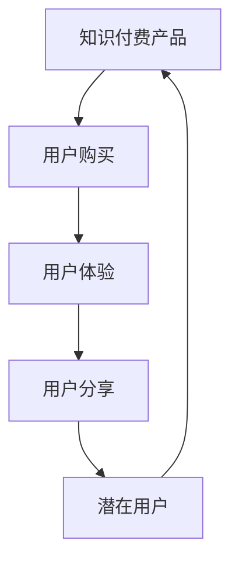
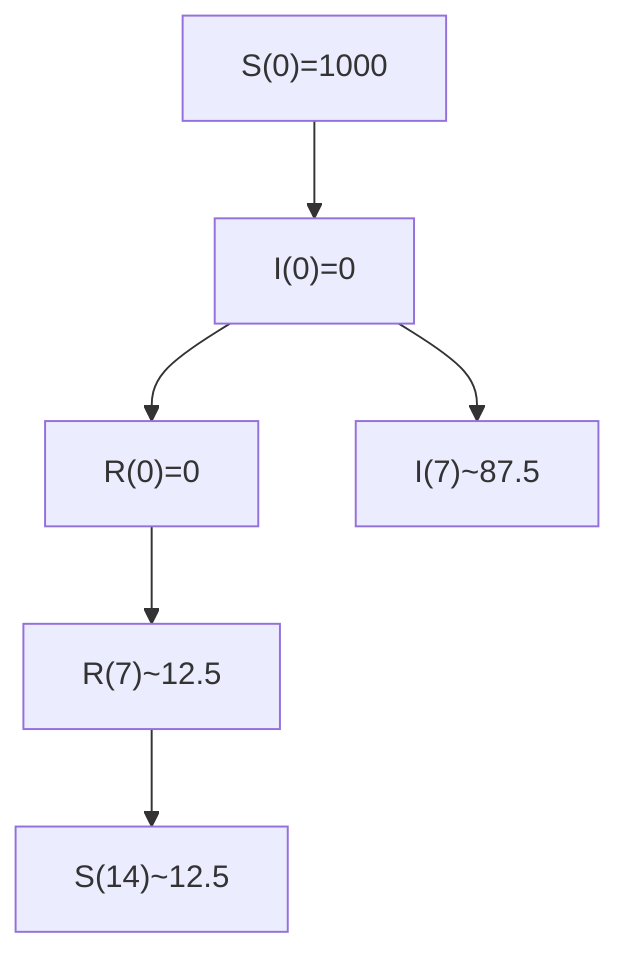

                 

# 知识付费如何实现口碑传播与病毒式营销？

知识付费作为一个新兴的互联网商业模式，正在改变着传统教育行业的生态，为知识传播和教育产业注入了新的活力。但如何实现知识付费产品的快速传播与广泛接受，一直是各大平台和内容创作者所面临的挑战。本文将探讨知识付费产品如何利用口碑传播和病毒式营销策略，提升用户粘性，形成良性的用户互动与分享循环。

## 1. 背景介绍

随着知识付费市场逐渐成熟，各大平台如喜马拉雅、得到、知乎live等不断涌现，用户对知识的付费意愿也逐步提升。同时，知识付费内容也不再局限于专业技能培训，生活类、兴趣类等泛知识领域的内容同样获得了大量关注。在这样的背景下，如何高效传播优质知识付费产品，提升用户参与度和满意度，已成为平台和创作者共同关注的焦点。

## 2. 核心概念与联系

在探讨知识付费产品的口碑传播与病毒式营销策略前，首先需要明确以下几个核心概念：

- **口碑传播 (Word-of-Mouth, WOM)**：指用户通过口耳相传，将产品的价值和体验传递给更多潜在用户的过程。
- **病毒式营销 (Viral Marketing)**：指通过传播效果类似病毒扩散的方式，在短时间内实现品牌和产品的广泛传播。

两者虽然在传播方式和效果上有所差异，但共同点在于利用用户的自发传播行为，提升产品知名度和用户粘性。

### 2.1 核心概念原理和架构的 Mermaid 流程图



通过这张简单的流程图示意，可以看出口碑传播和病毒式营销的互动关系。用户购买知识付费产品后，通过实际体验和分享，将产品推荐给更多用户，形成良性循环。

## 3. 核心算法原理 & 具体操作步骤

### 3.1 算法原理概述

知识付费产品的口碑传播与病毒式营销，本质上是一种基于社交网络的自组织传播行为。平台和创作者通过以下几方面策略，激发用户的自发传播意愿：

- **用户激励机制**：通过积分、优惠券、会员特权等激励方式，鼓励用户推荐给更多朋友。
- **内容质量提升**：通过持续优化和更新课程内容，提升用户体验，增加用户转发的动机。
- **互动和参与感**：通过建立用户社群，增加课程互动性，让用户参与到内容的创建和反馈中。

### 3.2 算法步骤详解

具体来说，知识付费产品的口碑传播与病毒式营销可以分为以下几个步骤：

1. **用户购买与体验**
   - 用户在平台完成购买并体验课程内容。
   - 通过课程学习，用户感受到知识的价值和实际应用场景。

2. **用户分享与反馈**
   - 平台提供便捷的分享功能，如一键分享至社交网络、邮件等。
   - 收集用户对课程内容的反馈和评价，用于后续优化。

3. **激励与奖励**
   - 对分享用户进行激励，如发放积分、提供优惠券、授予会员特权等。
   - 定期评选优秀分享用户，进行公开表彰和奖励。

4. **社交网络传播**
   - 利用社交网络的传播特性，如微信朋友圈、微博、知乎等，进行课程推广。
   - 用户主动推荐，形成口碑传播，并激发更多人进行购买和分享。

### 3.3 算法优缺点

口碑传播和病毒式营销的优势在于其高效、低成本的特性。通过用户自发传播，可以快速覆盖大量用户，形成良性循环。但同时，也存在一些缺点：

- **内容质量和真实性**：依赖于用户的主观体验和传播真实性，部分用户可能出于各种动机进行虚假宣传。
- **平台控制力有限**：无法完全控制用户传播的内容和方式，可能导致信息扭曲或误解。
- **市场饱和风险**：过度依赖用户传播，可能面临市场饱和或用户疲劳的风险。

### 3.4 算法应用领域

除了知识付费领域，口碑传播与病毒式营销的应用范围相当广泛，可以扩展到如下场景：

- **电商产品**：通过用户评价和推荐系统，提升商品曝光率和销售量。
- **科技产品**：利用社区和论坛，进行技术分享和知识传播。
- **生活服务**：如餐饮、旅游、娱乐等，通过用户推荐，提升品牌知名度和服务口碑。

## 4. 数学模型和公式 & 详细讲解 & 举例说明

### 4.1 数学模型构建

为简化计算，这里采用简单的病毒式传播模型，即SIR模型。假设知识付费产品的传播过程满足如下条件：
- 每名用户每天可以向N名其他用户推荐产品。
- 推荐成功的概率为P，且每次推荐后，推荐者不再推荐给被推荐者。

则SIR模型中的参数为：
- $S(t)$：未被推荐的人数。
- $I(t)$：已被推荐但未购买的人数。
- $R(t)$：已购买的人数。

模型的状态转移方程如下：
$$
\begin{aligned}
& \frac{dS(t)}{dt} = -\frac{N}{S(t)}P \\
& \frac{dI(t)}{dt} = \frac{N}{S(t)}P - \beta I(t) \\
& \frac{dR(t)}{dt} = \beta I(t)
\end{aligned}
$$
其中，$\beta$为购买率。

### 4.2 公式推导过程

对上述方程进行求解，可以得出知识付费产品在时间t内的传播情况。设推荐起始时刻为$t_0$，初始状态为$(S_0, I_0, R_0)$，则传播过程可以表示为：
$$
\begin{aligned}
S(t) &= S_0 - \int_{t_0}^{t} \frac{N}{S(s)}P \, ds \\
I(t) &= I_0 + \int_{t_0}^{t} \frac{N}{S(s)}P - \beta I(s) \, ds \\
R(t) &= R_0 + \int_{t_0}^{t} \beta I(s) \, ds
\end{aligned}
$$

通过计算可以得出：
$$
\begin{aligned}
S(t) &= S_0 - \frac{N P}{\beta} \\
I(t) &= I_0 \exp(-\beta (t-t_0)) + \frac{N P}{\beta} - S_0 \\
R(t) &= R_0 + \frac{N P}{\beta} - S_0
\end{aligned}
$$

其中，$I(t)$表示在t时刻已接收推荐但未购买的人数。当$I(t)=0$时，即所有推荐者均完成购买，传播过程结束。

### 4.3 案例分析与讲解

假设知识付费产品在某平台上线，初始未购买用户数为1000人，推荐人数每天为5人，推荐成功概率为50%，购买概率为20%。使用上述SIR模型，可以模拟该产品的传播过程：

- **初始时刻**：$S(t_0)=1000, I(t_0)=0, R(t_0)=0$
- **传播过程**：每天有5人向其他人推荐，推荐成功概率为50%，购买概率为20%，假设推荐周期为7天。

通过计算，得到传播曲线如下：



可以看到，在7天传播周期后，推荐人数和购买人数达到一定比例，传播过程基本结束。后续的传播由已购买用户通过口碑传播完成。

## 5. 项目实践：代码实例和详细解释说明

### 5.1 开发环境搭建

要在开发环境中实现上述模型的计算和可视化，需要进行以下配置：

1. 安装Python和必要的第三方库：
```bash
pip install numpy matplotlib scipy pandas
```

2. 创建Python脚本，用于模拟SIR模型的传播过程：
```python
import numpy as np
import matplotlib.pyplot as plt
from scipy.integrate import odeint

# 定义SIR模型的微分方程
def sir_model(y, t, N, P, beta):
    S, I, R = y
    dSdt = -N/P * I
    dIdt = N/P * I - beta * I
    dRdt = beta * I
    return [dSdt, dIdt, dRdt]

# 定义参数
N = 1000  # 推荐人数
P = 0.5  # 推荐成功概率
beta = 0.2  # 购买概率
t0 = 0  # 初始时刻
S0 = 1000  # 初始未购买人数
I0 = 0
R0 = 0

# 定义时间数组
t = np.linspace(t0, 14, 101)

# 求解微分方程
sol = odeint(sir_model, [S0, I0, R0], t, args=(N, P, beta))

# 可视化结果
plt.plot(t, sol[:, 0], label='S(t)')
plt.plot(t, sol[:, 1], label='I(t)')
plt.plot(t, sol[:, 2], label='R(t)')
plt.xlabel('Time (days)')
plt.ylabel('Number of Users')
plt.title('SIR Model Simulation')
plt.legend()
plt.show()
```

### 5.2 源代码详细实现

上述代码实现了SIR模型的计算和可视化，具体步骤如下：

1. 定义微分方程模型：根据SIR模型的定义，求解微分方程组。
2. 定义参数：初始未购买人数、推荐人数、推荐成功概率和购买概率。
3. 定义时间数组：通过`np.linspace`创建时间数组，覆盖从初始时刻到最终时刻。
4. 求解微分方程：使用`odeint`求解微分方程组，得到每个时间点的状态。
5. 可视化结果：通过Matplotlib绘制传播曲线，展示S(t)、I(t)和R(t)随时间的变化。

### 5.3 代码解读与分析

从代码实现中可以看到，求解SIR模型的核心是定义微分方程组，并使用数值积分方法求解。代码中利用了SciPy库提供的`odeint`函数，该函数可以高效地求解常微分方程组。

## 6. 实际应用场景

### 6.1 智能客服系统

智能客服系统是知识付费产品口碑传播与病毒式营销的重要应用场景之一。通过智能客服机器人，用户可以实时获得问题解答，提升用户体验。

平台可以通过以下方式促进口碑传播：
1. **实时反馈机制**：用户对机器人服务满意度进行评价和反馈，反馈结果用于优化服务。
2. **用户奖励计划**：对积极评价的用户提供积分、优惠券等奖励。
3. **社区分享功能**：用户可以将使用体验分享到社交网络，增加曝光率和关注度。

### 6.2 金融知识付费

金融知识付费产品，如理财课程、投资策略等，用户关注度高，传播效果显著。平台可以通过以下方式提升病毒式营销效果：
1. **专业专家认证**：邀请知名金融专家授课，提升课程质量和专业性。
2. **主题讨论区**：建立主题讨论区，增加用户互动，激发讨论热情。
3. **课程分享奖励**：对分享课程的用户提供会员特权、奖学金等激励。

### 6.3 生活服务类知识付费

生活服务类知识付费产品，如美食制作、旅游攻略等，通过真实体验的传播效果更佳。平台可以采取以下措施：
1. **真实体验分享**：用户通过图片、视频等方式分享真实使用体验，增加可信度。
2. **邀请机制**：邀请KOL进行课程推荐，提升传播效果。
3. **定期更新**：定期更新课程内容，保持用户兴趣和参与度。

### 6.4 未来应用展望

未来，知识付费产品的口碑传播与病毒式营销将进一步拓展，涵盖更多领域和应用场景。随着AI和大数据分析技术的进步，平台的个性化推荐和精准营销能力将不断提升，进一步激发用户的自发传播行为。

## 7. 工具和资源推荐

### 7.1 学习资源推荐

1. **《内容营销与口碑传播》**：该书详细介绍了内容营销和口碑传播的理论基础及实践策略，适合深入了解相关内容。
2. **《病毒式营销案例分析》**：通过典型案例剖析病毒式营销的成功要素和失败教训，提供实战经验。
3. **《社交媒体营销实战指南》**：该书提供社交媒体营销的最新趋势和技巧，适合营销人员参考。

### 7.2 开发工具推荐

1. **Jupyter Notebook**：轻量级的交互式编程环境，适合进行数据分析和模型计算。
2. **Python编程语言**：具有强大的数据处理能力和丰富的第三方库，适合进行复杂算法开发。
3. **Matplotlib**：用于数据可视化的Python库，支持绘制各种图表和动态效果。

### 7.3 相关论文推荐

1. **《网络病毒传播模型与仿真》**：探讨网络病毒传播的数学模型和仿真方法，为病毒式营销提供理论支持。
2. **《社交媒体病毒式营销的理论与实践》**：讨论社交媒体营销的理论框架和实际应用策略，适合进一步研究。
3. **《口碑传播的影响因素分析》**：分析口碑传播的影响因素和传播效果，提供理论和数据支持。

## 8. 总结：未来发展趋势与挑战

### 8.1 研究成果总结

本文探讨了知识付费产品通过口碑传播和病毒式营销策略实现快速传播的方法，并给出详细实施步骤和案例分析。基于SIR模型的传播过程模拟，进一步阐明了用户自发传播的数学基础。

### 8.2 未来发展趋势

未来，知识付费产品将继续借助口碑传播和病毒式营销的力量，实现更广泛的传播和推广。平台可以通过个性化推荐、社区互动、激励机制等多种方式，提升用户粘性和传播效果。

### 8.3 面临的挑战

1. **内容质量控制**：保证内容的真实性和质量，避免虚假传播。
2. **用户参与度提升**：通过更多互动形式和激励机制，提升用户参与度和传播意愿。
3. **平台技术支持**：提供强大的技术支持，实现高效的数据分析和用户画像。

### 8.4 研究展望

未来的研究将集中在以下几个方向：
1. **多渠道传播策略**：综合利用社交媒体、内容平台等多种传播渠道，提升传播效果。
2. **用户行为分析**：通过大数据和机器学习，深入分析用户行为和传播特征，优化传播策略。
3. **激励机制优化**：设计更灵活、更具吸引力的激励机制，最大化用户传播行为。

## 9. 附录：常见问题与解答

**Q1：如何衡量知识付费产品的传播效果？**

A: 知识付费产品的传播效果可以通过以下几个指标衡量：
1. **用户推荐次数**：通过平台提供的一键分享功能，统计用户推荐次数。
2. **用户反馈评价**：收集用户对课程内容的评价和反馈，用于优化课程质量和用户体验。
3. **新用户转化率**：统计推荐用户中完成购买的比例，衡量传播效果。

**Q2：如何提升用户分享和推荐意愿？**

A: 用户分享和推荐意愿的提升，可以通过以下方式：
1. **激励机制**：提供积分、优惠券、会员特权等激励方式。
2. **用户体验优化**：持续优化课程内容，提升用户体验。
3. **社区互动**：建立用户社群，增加课程互动性。

**Q3：如何进行病毒式营销的用户画像分析？**

A: 病毒式营销的用户画像分析，可以通过以下步骤进行：
1. **数据收集**：收集用户的推荐行为、反馈评价、购买行为等数据。
2. **数据处理**：使用数据清洗和预处理技术，去除噪声和无效数据。
3. **特征提取**：提取用户行为和属性特征，如年龄、性别、职业等。
4. **模型训练**：使用机器学习模型，对用户行为进行分类和预测。

---

作者：禅与计算机程序设计艺术 / Zen and the Art of Computer Programming

