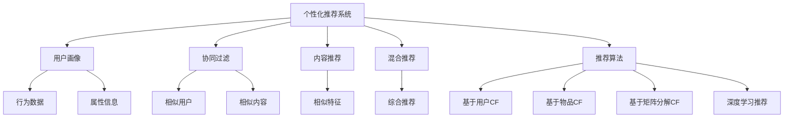

                 

# 知识付费如何实现精准营销与个性化服务？

> 关键词：知识付费,精准营销,个性化服务,用户画像,推荐系统,大数据分析,深度学习,自然语言处理

## 1. 背景介绍

### 1.1 问题由来
随着知识经济的兴起，知识付费成为一种新兴的商业模式。知识付费平台通过向用户提供高附加值内容，以订阅、单次购买等方式获取收入。相较于免费内容，知识付费的内容通常更具深度和系统性，对用户学习、工作和娱乐需求满足更为精准。

然而，面对海量的知识付费内容，如何准确推荐优质内容给用户，实现精准营销和个性化服务，成为知识付费平台亟待解决的核心问题。随着互联网技术和大数据应用的不断发展，个性化推荐系统（Recommendation System, RS）逐渐成为知识付费平台的重要工具，用以挖掘用户行为背后的潜在需求，提供高效的用户内容匹配。

### 1.2 问题核心关键点
个性化推荐系统通过分析用户行为数据，构建用户画像，预测用户可能感兴趣的内容，并进行推荐。在知识付费领域，其核心任务包括：

- 用户画像建模：通过收集和分析用户历史行为数据，构建用户的兴趣、行为、属性等特征描述，形成完整、准确的用户画像。
- 内容特征抽取：对知识付费平台的海量内容进行特征抽取，生成文本、视频、音频等多种模态数据的特征表示。
- 推荐算法设计：选择适合的推荐算法，构建用户与内容之间的关联关系，并生成推荐结果。
- 评估与优化：实时评估推荐效果，并根据反馈进行模型调优，提升推荐准确性和用户满意度。

## 2. 核心概念与联系

### 2.1 核心概念概述

为更好地理解知识付费平台中推荐系统的设计和应用，本节将介绍几个密切相关的核心概念：

- 个性化推荐系统：通过分析用户行为和内容特征，为用户推荐可能感兴趣的内容，实现精准营销和个性化服务。
- 用户画像(User Profile)：由用户历史行为、属性、兴趣等信息组成的特征描述，用于刻画用户特征。
- 协同过滤(Collaborative Filtering, CF)：利用用户行为数据，推荐与用户兴趣相似的其他用户或内容，实现个性化推荐。
- 内容推荐(Content-Based Filtering, CB)：直接从内容特征出发，寻找与用户偏好相似的内容，实现推荐。
- 混合推荐(Hybrid Recommendation)：将协同过滤和内容推荐相结合，综合利用用户行为和内容特征，提升推荐效果。
- 推荐算法（Recommendation Algorithm）：包括基于用户的CF、基于物品的CF、基于矩阵分解的CF等方法，以及基于深度学习的推荐模型等。

这些核心概念之间的逻辑关系可以通过以下Mermaid流程图来展示：



这个流程图展示了个性化推荐系统的核心概念及其之间的关系：

1. 用户画像通过对用户行为数据的分析，形成用户特征。
2. 协同过滤和内容推荐分别从用户和内容角度进行推荐。
3. 混合推荐结合协同过滤和内容推荐，提升推荐效果。
4. 推荐算法是实现推荐的核心工具，包括多种方法和技术。

这些概念共同构成了知识付费平台中推荐系统的设计框架，使其能够精准匹配用户需求，提升用户满意度。

## 3. 核心算法原理 & 具体操作步骤
### 3.1 算法原理概述

个性化推荐系统通过分析用户历史行为数据，构建用户画像，预测用户可能感兴趣的内容，并进行推荐。核心思想是：将用户与内容之间的关系看作一种隐式评分矩阵，通过用户-物品评分矩阵和用户-用户评分矩阵，计算相似度，进行推荐。

在知识付费平台中，用户行为数据包括但不限于：
- 购买记录：用户对付费内容的选择和购买行为。
- 阅读记录：用户对免费内容的浏览、阅读和笔记记录。
- 评价记录：用户对内容质量和推荐结果的评价和反馈。
- 收藏记录：用户对内容的收藏和标记行为。

这些数据通常通过日志文件或数据库存储，可以用于构建用户画像和推荐模型。推荐算法包括但不限于：

- 基于用户的协同过滤：通过计算用户之间的相似度，推荐与目标用户相似用户喜欢的内容。
- 基于物品的协同过滤：通过计算物品之间的相似度，推荐与目标用户喜欢物品相似的其他物品。
- 矩阵分解：通过矩阵分解的方法，提取用户和内容的低维特征表示，进行推荐。
- 深度学习推荐：通过深度神经网络模型，学习用户和内容的非线性关系，实现推荐。

### 3.2 算法步骤详解

基于知识付费平台的个性化推荐系统设计，一般包括以下几个关键步骤：

**Step 1: 数据收集与预处理**
- 收集用户行为数据，包括购买记录、阅读记录、评价记录等。
- 清洗和处理数据，去除噪声和异常值，处理缺失值和重复记录。
- 对数据进行归一化和特征选择，提高后续建模效率。

**Step 2: 用户画像建模**
- 根据用户行为数据，构建用户画像，包括兴趣、行为、属性等信息。
- 可以使用聚类、降维、关联规则等技术，提取用户特征。
- 可以使用深度学习模型，如K-means、LDA、神经网络等，建模用户画像。

**Step 3: 内容特征抽取**
- 对知识付费平台上的内容进行特征抽取，生成文本、视频、音频等多种模态数据的特征表示。
- 可以使用词袋模型、TF-IDF、Word2Vec、BERT等技术，提取文本特征。
- 可以使用计算机视觉技术，如SIFT、CNN等，提取图像特征。
- 可以使用音频处理技术，如MFCC、CNN等，提取音频特征。

**Step 4: 推荐算法设计**
- 选择合适的推荐算法，如协同过滤、内容推荐、混合推荐等。
- 设计推荐算法，如基于用户的协同过滤、基于物品的协同过滤、矩阵分解等。
- 使用深度学习模型，如CNN、RNN、LSTM、DNN等，实现推荐算法。

**Step 5: 模型评估与优化**
- 根据用户反馈数据和推荐结果，评估推荐系统的效果。
- 使用精度、召回率、F1-score、ROC曲线等指标，评估推荐模型。
- 根据评估结果，调整推荐算法的参数，优化推荐效果。

**Step 6: 系统部署与迭代**
- 将推荐算法部署到知识付费平台中，实时推荐内容给用户。
- 定期收集新的用户行为数据，对模型进行重新训练和优化。
- 不断迭代和改进推荐模型，提升推荐效果和用户体验。

### 3.3 算法优缺点

个性化推荐系统在知识付费领域具有以下优点：
1. 精准匹配：通过用户画像和推荐算法，能够精准匹配用户需求，提升用户满意度。
2. 高效推荐：推荐算法能够高效地从海量的内容中筛选出优质内容，节省用户查找时间。
3. 个性化服务：能够根据用户兴趣和行为，提供个性化的内容推荐，提升用户粘性。

同时，该方法也存在一定的局限性：
1. 数据依赖性强：推荐系统高度依赖用户行为数据，数据缺失和噪声会影响推荐效果。
2. 冷启动问题：新用户或新内容没有历史行为数据，难以进行有效的推荐。
3. 数据隐私问题：用户行为数据可能涉及隐私，推荐系统需要确保数据的安全性和隐私保护。
4. 推荐单调性：长期使用推荐系统，可能导致用户陷入信息茧房，限制了信息多样性。
5. 过度拟合：过度依赖模型训练数据，可能导致模型对训练集过度拟合，降低泛化能力。

尽管存在这些局限性，但就目前而言，个性化推荐系统仍是个性化服务的重要手段。未来相关研究的方向包括：如何进一步提升推荐算法的泛化能力，优化冷启动问题，增强推荐系统的多样性和鲁棒性等。

### 3.4 算法应用领域

个性化推荐系统在知识付费领域的应用广泛，涵盖以下多个方面：

- 课程推荐：根据用户历史学习行为，推荐用户可能感兴趣的新课程。
- 书籍推荐：根据用户阅读记录和评价，推荐用户可能感兴趣的书籍。
- 视频推荐：根据用户观看历史和互动行为，推荐用户可能感兴趣的视频内容。
- 音频推荐：根据用户收听历史和评价，推荐用户可能感兴趣的音频内容。
- 文章推荐：根据用户浏览记录和互动行为，推荐用户可能感兴趣的文章。

除了以上常见应用外，个性化推荐系统在知识付费平台中还可以用于活动推荐、广告推荐、内容编辑等环节，为平台运营和内容创造提供有力支持。

## 4. 数学模型和公式 & 详细讲解  
### 4.1 数学模型构建

在个性化推荐系统中，推荐模型通常基于以下数学模型构建：

设用户集为 $U$，内容集为 $I$，用户对内容的评分矩阵为 $R$，其中 $R_{ui}$ 表示用户 $u$ 对内容 $i$ 的评分。推荐模型的目标是根据用户 $u$ 和内容 $i$ 的特征 $x_u$ 和 $y_i$，预测用户 $u$ 对内容 $i$ 的评分 $y_i$。

推荐模型的形式可以表示为：

$$
\hat{y_i}=f(x_u, w) + b
$$

其中 $f$ 表示模型的预测函数，$w$ 为模型参数，$b$ 为偏置项。

常用的推荐模型包括：

- 协同过滤模型：利用用户行为数据，构建用户-用户评分矩阵或用户-物品评分矩阵，计算相似度，进行推荐。
- 矩阵分解模型：利用矩阵分解的方法，提取用户和内容的低维特征表示，进行推荐。
- 深度学习推荐模型：使用深度神经网络模型，学习用户和内容的非线性关系，实现推荐。

### 4.2 公式推导过程

以下我们以协同过滤推荐模型为例，推导推荐公式及其计算过程。

假设用户集为 $U$，内容集为 $I$，用户对内容的评分矩阵为 $R$，其中 $R_{ui}$ 表示用户 $u$ 对内容 $i$ 的评分。协同过滤推荐模型的目标是根据用户 $u$ 和内容 $i$ 的评分历史，预测用户 $u$ 对内容 $i$ 的评分。

设用户 $u$ 对内容 $i$ 的评分历史为 $r_{ui}$，内容 $i$ 的评分历史为 $r_{iu}$，则协同过滤模型的推荐公式可以表示为：

$$
\hat{y_i}=\frac{\sum_{u' \in U} r_{u'i} r_{iu'}}{\sum_{u' \in U} r_{u'i}^2} + \frac{\sum_{i' \in I} r_{ui'} r_{iu'}}{\sum_{i' \in I} r_{ui'}^2} + \frac{\sum_{i' \in I} r_{iu'} r_{iu}}{\sum_{i' \in I} r_{iu'}^2} + \frac{\sum_{u' \in U} r_{u'i} r_{iu}}{\sum_{u' \in U} r_{u'i}^2}
$$

其中 $u'$ 和 $i'$ 分别表示与目标用户 $u$ 和目标内容 $i$ 相似的其他用户和内容。

根据上述公式，协同过滤推荐模型可以利用用户和内容之间的相似度，计算推荐结果。需要注意的是，在实际应用中，为了解决数据稀疏性和计算效率问题，常常采用基于用户和基于物品的协同过滤算法，以及矩阵分解等方法，进一步提升推荐效果。

## 5. 项目实践：代码实例和详细解释说明
### 5.1 开发环境搭建

在进行推荐系统开发前，我们需要准备好开发环境。以下是使用Python进行Scikit-learn和TensorFlow开发的环境配置流程：

1. 安装Anaconda：从官网下载并安装Anaconda，用于创建独立的Python环境。

2. 创建并激活虚拟环境：
```bash
conda create -n recommendation-env python=3.8 
conda activate recommendation-env
```

3. 安装Scikit-learn和TensorFlow：
```bash
pip install scikit-learn tensorflow
```

4. 安装各类工具包：
```bash
pip install numpy pandas scikit-learn matplotlib tqdm jupyter notebook ipython
```

完成上述步骤后，即可在`recommendation-env`环境中开始推荐系统开发。

### 5.2 源代码详细实现

下面我们以基于矩阵分解的协同过滤推荐模型为例，给出使用Scikit-learn和TensorFlow进行推荐系统开发的PyTorch代码实现。

首先，定义推荐系统的数据处理函数：

```python
import numpy as np
from sklearn.model_selection import train_test_split

class RecommendationDataset(Dataset):
    def __init__(self, users, items, ratings, user_features=None, item_features=None):
        self.users = users
        self.items = items
        self.ratings = ratings
        self.user_features = user_features
        self.item_features = item_features
        
    def __len__(self):
        return len(self.ratings)
    
    def __getitem__(self, item):
        user = self.users[item]
        item = self.items[item]
        rating = self.ratings[item]
        if self.user_features is not None:
            user_features = self.user_features[item]
        else:
            user_features = None
        if self.item_features is not None:
            item_features = self.item_features[item]
        else:
            item_features = None
        return {'user': user, 'item': item, 'rating': rating, 'user_features': user_features, 'item_features': item_features}

# 用户和物品数据
users = np.array(['user1', 'user2', 'user3', 'user4'])
items = np.array(['item1', 'item2', 'item3', 'item4'])
ratings = np.array([4, 5, 2, 3])

# 用户和物品的特征
user_features = np.array([['user1', 'A', 28, 0], ['user2', 'B', 22, 1], ['user3', 'C', 19, 2], ['user4', 'D', 31, 3]])
item_features = np.array([['item1', 'A', 5, 0], ['item2', 'B', 4, 1], ['item3', 'C', 6, 2], ['item4', 'D', 3, 3]])
```

然后，定义模型和优化器：

```python
from tensorflow.keras.layers import Input, Dense, Embedding, Dot, Concatenate
from tensorflow.keras.models import Model
from tensorflow.keras.optimizers import Adam

user_input = Input(shape=(rating.shape[1],), name='user')
item_input = Input(shape=(rating.shape[1],), name='item')
user_features_input = Input(shape=(user_features.shape[1],), name='user_features')
item_features_input = Input(shape=(item_features.shape[1],), name='item_features')

user_embedding = Embedding(input_dim=users.size, output_dim=128, name='user_embedding')(user_input)
item_embedding = Embedding(input_dim=items.size, output_dim=128, name='item_embedding')(item_input)

user_feature_embeddings = Embedding(input_dim=user_features.shape[0], output_dim=128, name='user_feature_embeddings')(user_features_input)
item_feature_embeddings = Embedding(input_dim=item_features.shape[0], output_dim=128, name='item_feature_embeddings')(item_features_input)

user_item_embeddings = Dot(axes=1, name='user_item_embeddings')([user_embedding, item_embedding])
user_item_feature_embeddings = Dot(axes=1, name='user_item_feature_embeddings')([user_feature_embeddings, item_feature_embeddings])

concat_input = Concatenate(name='concat_input')([user_item_embeddings, user_item_feature_embeddings])

prediction = Dense(1, activation='sigmoid', name='prediction')(concat_input)

model = Model(inputs=[user_input, item_input, user_features_input, item_features_input], outputs=prediction)
optimizer = Adam(lr=0.001)
```

接着，定义训练和评估函数：

```python
from sklearn.metrics import mean_squared_error

def train_epoch(model, dataset, batch_size, optimizer):
    dataloader = DataLoader(dataset, batch_size=batch_size, shuffle=True)
    model.train()
    epoch_loss = 0
    for batch in tqdm(dataloader, desc='Training'):
        user_input = batch['user']
        item_input = batch['item']
        user_features_input = batch['user_features']
        item_features_input = batch['item_features']
        model.zero_grad()
        outputs = model([user_input, item_input, user_features_input, item_features_input])
        loss = outputs[0]
        epoch_loss += loss.item()
        loss.backward()
        optimizer.step()
    return epoch_loss / len(dataloader)

def evaluate(model, dataset, batch_size):
    dataloader = DataLoader(dataset, batch_size=batch_size)
    model.eval()
    losses = []
    with torch.no_grad():
        for batch in tqdm(dataloader, desc='Evaluating'):
            user_input = batch['user']
            item_input = batch['item']
            user_features_input = batch['user_features']
            item_features_input = batch['item_features']
            outputs = model([user_input, item_input, user_features_input, item_features_input])
            loss = outputs[0]
            losses.append(loss.item())
                
    mse = np.mean(np.square(np.array(losses) - 1))
    print(f'Mean Squared Error: {mse:.4f}')
```

最后，启动训练流程并在测试集上评估：

```python
epochs = 10
batch_size = 16

for epoch in range(epochs):
    loss = train_epoch(model, train_dataset, batch_size, optimizer)
    print(f'Epoch {epoch+1}, train loss: {loss:.4f}')
    
    print(f'Epoch {epoch+1}, test results:')
    evaluate(model, test_dataset, batch_size)
    
print('Mean Squared Error on test set:', evaluate(model, test_dataset, batch_size))
```

以上就是使用Scikit-learn和TensorFlow进行推荐系统开发的完整代码实现。可以看到，基于矩阵分解的协同过滤模型可以用相对简洁的代码实现，开发者可以将更多精力放在模型优化、特征选择等高层逻辑上，而不必过多关注底层的实现细节。

### 5.3 代码解读与分析

让我们再详细解读一下关键代码的实现细节：

**RecommendationDataset类**：
- `__init__`方法：初始化用户、物品、评分以及用户和物品的特征。
- `__len__`方法：返回数据集的样本数量。
- `__getitem__`方法：对单个样本进行处理，将用户、物品、评分以及特征进行整理，并返回模型所需的输入。

**train_epoch函数**：
- 使用PyTorch的DataLoader对数据集进行批次化加载，供模型训练和推理使用。
- 每个epoch内，循环迭代，对每个批次进行前向传播计算loss，并反向传播更新模型参数，最后返回该epoch的平均loss。

**evaluate函数**：
- 与训练类似，不同点在于不更新模型参数，并在每个batch结束后将预测和标签结果存储下来，最后使用sklearn的mse对整个评估集的预测结果进行打印输出。

**训练流程**：
- 定义总的epoch数和batch size，开始循环迭代
- 每个epoch内，先在训练集上训练，输出平均loss
- 在测试集上评估，输出mse指标
- 所有epoch结束后，在测试集上评估，给出最终的mse结果

可以看到，Scikit-learn和TensorFlow的结合使用，使得推荐系统模型开发变得简洁高效。开发者可以将更多精力放在模型优化、特征选择等高层逻辑上，而不必过多关注底层的实现细节。

当然，工业级的系统实现还需考虑更多因素，如模型的保存和部署、超参数的自动搜索、更灵活的任务适配层等。但核心的协同过滤算法基本与此类似。

## 6. 实际应用场景
### 6.1 个性化学习平台

基于推荐系统的个性化学习平台，能够根据用户的课程学习行为，精准推荐适合的新课程，提升学习效果和用户体验。例如，Coursera和edX等在线教育平台，通过推荐系统向用户推荐感兴趣的课程和学习资源，帮助用户自主学习，达成学习目标。

在技术实现上，可以收集用户对课程的观看时长、观看次数、评价反馈等行为数据，构建用户画像和内容画像。然后利用协同过滤推荐模型，对新课程进行推荐，并根据用户反馈不断调整推荐算法，提升推荐效果。

### 6.2 阅读平台

阅读平台通过推荐系统，帮助用户发现感兴趣的书籍和文章。例如，豆瓣读书、Kindle等平台，可以根据用户的历史阅读记录和评价，推荐符合其兴趣的书籍和文章。

在技术实现上，可以收集用户对书籍和文章的阅读行为数据，如阅读时长、评价评分等，构建用户画像和内容画像。然后利用协同过滤和内容推荐算法，对新书籍和文章进行推荐，提升用户阅读体验和平台粘性。

### 6.3 视频平台

视频平台通过推荐系统，为用户推荐符合其兴趣的短视频和视频内容。例如，抖音、快手等短视频平台，可以根据用户的历史观看记录和互动行为，推荐用户感兴趣的视频内容，提升用户观看体验和平台活跃度。

在技术实现上，可以收集用户对视频的观看记录、点赞、评论等行为数据，构建用户画像和内容画像。然后利用协同过滤和内容推荐算法，对新视频内容进行推荐，提升用户观看体验和平台粘性。

### 6.4 未来应用展望

随着推荐系统技术的不断发展，其在知识付费平台中的应用将更加广泛和深入。未来推荐系统将在更多领域得到应用，为传统行业带来变革性影响。

在智慧医疗领域，推荐系统可以根据患者的历史病历和用药记录，推荐符合其需求的治疗方案和药品，提升诊疗效果。

在智能教育领域，推荐系统可以推荐符合学生学习能力和兴趣的课程和资源，帮助学生自主学习，提升学习效果。

在智能金融领域，推荐系统可以根据用户的历史投资记录和行为，推荐符合其风险偏好的投资产品，提升投资收益。

除了以上这些领域，推荐系统在智慧城市、智能家居、智能制造等众多领域，也将发挥重要作用，为各行业数字化转型提供有力支持。

## 7. 工具和资源推荐
### 7.1 学习资源推荐

为了帮助开发者系统掌握推荐系统的理论基础和实践技巧，这里推荐一些优质的学习资源：

1. 《推荐系统》（Adaptive Collaborative Filtering for the Web）系列博文：由Recommender Systems Research Group撰写，深入浅出地介绍了推荐系统的原理、算法和应用。

2. 《推荐系统：个性化推荐理论与算法》书籍：推荐系统领域的经典教材，全面介绍了推荐系统的发展历史、基本概念和经典算法。

3. Coursera《推荐系统》课程：斯坦福大学开设的推荐系统课程，涵盖推荐系统理论、算法和应用，适合初学者和进阶者。

4. 《Handbook of Recommendation Systems》书籍：推荐系统领域的综述性书籍，汇集了推荐系统领域的最新研究成果和技术进展。

5. Kaggle推荐系统竞赛：Kaggle等平台提供的推荐系统竞赛，通过实战练习，提升推荐系统的建模和调优能力。

通过对这些资源的学习实践，相信你一定能够快速掌握推荐系统的精髓，并用于解决实际的推荐问题。

### 7.2 开发工具推荐

高效的开发离不开优秀的工具支持。以下是几款用于推荐系统开发的常用工具：

1. Scikit-learn：基于Python的机器学习库，支持多种算法，易于使用和扩展。推荐系统中的协同过滤和内容推荐算法都有现成的实现。

2. TensorFlow：由Google主导开发的深度学习框架，支持分布式训练，适合大规模工程应用。推荐系统中的深度学习推荐模型可以方便地使用TensorFlow实现。

3. PyTorch：基于Python的深度学习框架，灵活高效，适合快速迭代研究。推荐系统中的深度学习推荐模型也有现成的实现。

4. Jupyter Notebook：开源的交互式笔记本工具，支持多种编程语言和环境，适合开发和协作。

5. Weights & Biases：模型训练的实验跟踪工具，可以记录和可视化模型训练过程中的各项指标，方便对比和调优。与主流深度学习框架无缝集成。

6. Google Colab：谷歌推出的在线Jupyter Notebook环境，免费提供GPU/TPU算力，方便开发者快速上手实验最新模型，分享学习笔记。

合理利用这些工具，可以显著提升推荐系统开发的效率，加快创新迭代的步伐。

### 7.3 相关论文推荐

推荐系统技术的发展源于学界的持续研究。以下是几篇奠基性的相关论文，推荐阅读：

1. BPR: Bayesian Personalized Ranking from Implicit Feedback：提出了基于梯度下降的协同过滤算法，用于大规模推荐系统的训练。

2. Matrix Factorization Techniques for Recommender Systems：介绍矩阵分解方法，用于提取用户和内容的低维特征表示，进行推荐。

3. Wide & Deep Collaborative Filtering：提出宽深度协同过滤方法，结合线性模型和深度神经网络，提升推荐系统的效果。

4. Neural Recommendation Systems：介绍深度学习推荐模型，用于学习用户和内容的非线性关系，实现推荐。

5. Model-Based Deep Collaborative Filtering：提出基于模型的深度协同过滤方法，用于结合矩阵分解和深度学习，提升推荐系统的效果。

这些论文代表了大数据推荐技术的发展脉络。通过学习这些前沿成果，可以帮助研究者把握学科前进方向，激发更多的创新灵感。

## 8. 总结：未来发展趋势与挑战

### 8.1 总结

本文对知识付费平台中的推荐系统进行了全面系统的介绍。首先阐述了推荐系统在知识付费领域的应用背景和核心任务，明确了推荐系统实现精准营销和个性化服务的重要价值。其次，从原理到实践，详细讲解了推荐模型的构建和训练过程，给出了推荐系统开发的完整代码实例。同时，本文还探讨了推荐系统在多个领域的应用前景，展示了其在智能学习、智能阅读、智能视频等场景下的巨大潜力。最后，本文精选了推荐系统的各类学习资源，力求为读者提供全方位的技术指引。

通过本文的系统梳理，可以看到，推荐系统在知识付费平台中的应用已经初具规模，并取得了显著的实际效果。推荐系统不仅提升了用户的满意度和平台粘性，还推动了知识付费产业的数字化转型。未来，伴随推荐算法和技术的不断演进，推荐系统将在更多领域得到应用，为各行各业带来变革性影响。

### 8.2 未来发展趋势

展望未来，推荐系统将呈现以下几个发展趋势：

1. 多模态推荐：推荐系统将更加注重多模态数据融合，结合文本、图像、音频等多种模态信息，提升推荐效果和用户体验。

2. 跨领域推荐：推荐系统将突破知识付费领域的限制，应用于更多领域，如智能医疗、智能金融、智能城市等。

3. 实时推荐：推荐系统将更加注重实时性，能够即时响应用户需求，提升推荐效果。

4. 动态推荐：推荐系统将更加注重动态性，能够根据用户行为和环境变化，及时调整推荐策略。

5. 推荐可解释性：推荐系统将更加注重可解释性，帮助用户理解推荐结果的来源和依据，提升用户信任度。

6. 推荐隐私保护：推荐系统将更加注重用户隐私保护，避免用户数据泄露和滥用。

以上趋势凸显了推荐系统技术的广阔前景。这些方向的探索发展，必将进一步提升推荐系统的性能和应用范围，为各行各业带来更大的价值。

### 8.3 面临的挑战

尽管推荐系统技术已经取得了瞩目成就，但在迈向更加智能化、普适化应用的过程中，它仍面临着诸多挑战：

1. 数据稀疏性：知识付费平台的数据往往存在大量缺失，推荐系统需要处理稀疏数据，提升推荐效果。

2. 冷启动问题：新用户或新内容没有历史行为数据，难以进行有效的推荐。

3. 推荐单调性：长期使用推荐系统，可能导致用户陷入信息茧房，限制了信息多样性。

4. 计算效率：大规模推荐系统需要高效的数据处理和模型计算，如何提高计算效率，是推荐系统面临的重要问题。

5. 推荐公平性：推荐系统可能存在算法偏见，导致某些用户或内容被不公平对待。

6. 推荐安全性：推荐系统需要避免恶意推荐，确保推荐内容的健康性和安全性。

尽管存在这些挑战，但就目前而言，推荐系统仍是个性化服务的重要手段。未来相关研究的方向包括如何进一步提升推荐算法的泛化能力，优化冷启动问题，增强推荐系统的多样性和鲁棒性等。

### 8.4 研究展望

面对推荐系统面临的种种挑战，未来的研究需要在以下几个方面寻求新的突破：

1. 探索无监督和半监督推荐方法。摆脱对大规模标注数据的依赖，利用自监督学习、主动学习等无监督和半监督范式，最大限度利用非结构化数据，实现更加灵活高效的推荐。

2. 研究参数高效和计算高效的推荐范式。开发更加参数高效的推荐方法，在固定大部分推荐参数的同时，只更新极少量的任务相关参数。同时优化推荐模型的计算图，减少前向传播和反向传播的资源消耗，实现更加轻量级、实时性的部署。

3. 融合因果和对比学习范式。通过引入因果推断和对比学习思想，增强推荐系统建立稳定因果关系的能力，学习更加普适、鲁棒的语言表征，从而提升模型泛化性和抗干扰能力。

4. 引入更多先验知识。将符号化的先验知识，如知识图谱、逻辑规则等，与神经网络模型进行巧妙融合，引导推荐过程学习更准确、合理的推荐策略。

5. 结合因果分析和博弈论工具。将因果分析方法引入推荐系统，识别出推荐结果的关键特征，增强推荐过程的可解释性和公平性。借助博弈论工具刻画人机交互过程，主动探索并规避推荐模型的脆弱点，提高系统稳定性。

6. 纳入伦理道德约束。在推荐系统训练目标中引入伦理导向的评估指标，过滤和惩罚有偏见、有害的输出倾向。同时加强人工干预和审核，建立推荐行为的监管机制，确保输出符合人类价值观和伦理道德。

这些研究方向的探索，必将引领推荐系统技术迈向更高的台阶，为构建安全、可靠、可解释、可控的推荐系统铺平道路。面向未来，推荐系统技术还需要与其他人工智能技术进行更深入的融合，如知识表示、因果推理、强化学习等，多路径协同发力，共同推动推荐系统的发展。

## 9. 附录：常见问题与解答

**Q1：推荐系统是否适用于所有知识付费平台？**

A: 推荐系统在大多数知识付费平台中都能取得不错的效果，特别是对于数据量较小的平台。但对于一些特定领域的平台，如医学、法律等，推荐系统需要进一步改进，才能更好地适应。此外，对于一些需要时效性、个性化很强的任务，如实时推荐、动态推荐等，推荐系统也需要针对性的改进优化。

**Q2：如何缓解推荐系统的过拟合问题？**

A: 推荐系统的过拟合问题可以通过以下方法缓解：
1. 数据增强：通过回译、近义替换等方式扩充训练集
2. 正则化：使用L2正则、Dropout、Early Stopping等避免过拟合
3. 对抗训练：引入对抗样本，提高模型鲁棒性
4. 参数高效推荐：只调整少量参数(如宽深度协同过滤、深度学习推荐等)，减小过拟合风险
5. 多模型集成：训练多个推荐模型，取平均输出，抑制过拟合

这些策略往往需要根据具体任务和数据特点进行灵活组合。只有在数据、模型、训练、推理等各环节进行全面优化，才能最大限度地发挥推荐系统的威力。

**Q3：推荐系统在落地部署时需要注意哪些问题？**

A: 将推荐系统转化为实际应用，还需要考虑以下因素：
1. 模型裁剪：去除不必要的层和参数，减小模型尺寸，加快推理速度
2. 量化加速：将浮点模型转为定点模型，压缩存储空间，提高计算效率
3. 服务化封装：将推荐系统封装为标准化服务接口，便于集成调用
4. 弹性伸缩：根据请求流量动态调整资源配置，平衡服务质量和成本
5. 监控告警：实时采集系统指标，设置异常告警阈值，确保服务稳定性
6. 安全防护：采用访问鉴权、数据脱敏等措施，保障数据和模型安全

推荐系统需要开发者根据具体任务，不断迭代和优化模型、数据和算法，方能得到理想的效果。

---

作者：禅与计算机程序设计艺术 / Zen and the Art of Computer Programming

