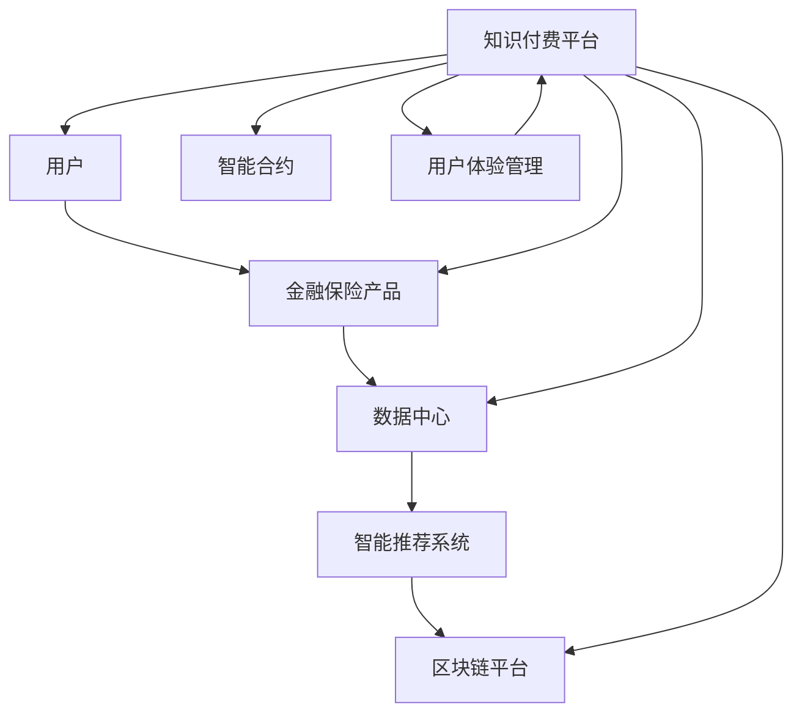

                 

# 知识付费如何实现跨界营销与金融保险跨界？

> 关键词：知识付费，跨界营销，金融保险，交叉营销，用户体验，数据驱动，智能推荐，区块链，智能合约

## 1. 背景介绍

随着互联网的迅猛发展和人工智能技术的不断成熟，知识付费和金融保险等行业逐渐趋向于相互融合。一方面，知识付费平台为金融保险产品提供了丰富的教育资源，使得消费者能够更全面地了解金融产品，提升其金融素养；另一方面，金融保险产品为知识付费平台提供了更多的变现渠道和用户粘性，两者结合能够实现双赢。

本文将深入探讨知识付费和金融保险的跨界营销策略，分析其在用户获取、产品推荐、风险控制等方面的应用，并展望未来的发展趋势。

## 2. 核心概念与联系

### 2.1 核心概念概述

1. **知识付费**：是指通过在线课程、电子书、视频教程等形式，为知识消费者提供专属服务，从而获得经济收益。

2. **跨界营销**：是指在两个或多个行业间进行的营销活动，通过整合资源和平台，实现跨领域的营销目标。

3. **金融保险**：包括但不限于银行、证券、保险、信托等行业，提供包括理财、投资、保险在内的金融服务。

4. **交叉营销**：指在两个或多个产品或服务之间进行整合营销，提高用户粘性并增加销售。

5. **用户体验**：指用户在使用产品或服务过程中的整体感受，包括界面设计、操作流畅性、服务质量等方面。

6. **数据驱动**：指通过数据收集、分析和应用，指导产品开发和营销策略。

7. **智能推荐**：指通过算法分析用户行为数据，推荐个性化的内容或产品。

8. **区块链**：一种分布式账本技术，具有去中心化、不可篡改等特点，常用于金融和数据安全领域。

9. **智能合约**：一种自动执行的合同，当满足预设条件时，智能合约自动执行相应的操作。

### 2.2 核心概念原理和架构的 Mermaid 流程图



此流程图展示了知识付费平台、金融保险产品、数据中心、智能推荐系统、区块链平台、智能合约和用户体验管理之间的联系。用户通过知识付费平台获取知识，并能够选择金融保险产品；数据中心和智能推荐系统利用数据驱动推荐；区块链平台和智能合约保证了交易的安全性和透明度；用户体验管理则确保了平台的流畅性和用户满意度。

## 3. 核心算法原理 & 具体操作步骤

### 3.1 算法原理概述

知识付费和金融保险跨界营销的核心算法原理基于数据驱动和智能推荐。通过收集和分析用户行为数据，如浏览记录、购买记录、搜索记录等，可以构建用户画像，并基于此进行个性化推荐。这不仅提高了用户体验，还为金融保险产品推荐提供了依据。

### 3.2 算法步骤详解

1. **用户画像构建**：
   - 收集用户行为数据，包括但不限于搜索行为、购买行为、社交互动等。
   - 使用机器学习算法对数据进行聚类和分类，生成用户画像。
   - 用户画像应包含基本信息、兴趣偏好、消费行为等。

2. **金融产品推荐**：
   - 利用用户画像，结合金融产品的特性，生成个性化推荐列表。
   - 推荐算法可以采用协同过滤、内容推荐、基于规则的推荐等方法。
   - 根据用户的反馈数据不断优化推荐算法。

3. **跨界营销策略**：
   - 设计交叉销售活动，如在用户购买某门课程后，自动推荐相关保险产品。
   - 利用用户画像，设计精准广告投放，提升用户对金融产品的兴趣。
   - 设立联合会员计划，提供知识付费和金融服务的双重优惠。

### 3.3 算法优缺点

**优点**：
1. **提升用户粘性**：通过个性化推荐，能够增加用户与平台的互动频率，提升用户粘性。
2. **增加交叉销售**：通过精准营销，实现金融产品与知识付费的双重销售，增加平台收入。
3. **降低运营成本**：利用智能推荐算法，能够减少人工筛选和推广成本。

**缺点**：
1. **数据隐私问题**：用户行为数据涉及隐私，如何保护用户数据安全是一个挑战。
2. **算法复杂性**：智能推荐算法需要处理大量数据，算法复杂度较高。
3. **推荐准确性**：算法推荐可能存在偏差，用户未必满意推荐结果。

### 3.4 算法应用领域

1. **知识付费平台**：如Coursera、Udemy等，通过推荐系统提供个性化课程。
2. **金融保险行业**：如银行、保险公司，提供定制化的理财和保险方案。
3. **电商平台**：如亚马逊、淘宝等，推荐用户感兴趣的商品。

## 4. 数学模型和公式 & 详细讲解 & 举例说明

### 4.1 数学模型构建

假设用户行为数据可以用特征向量 $x = (x_1, x_2, ..., x_n)$ 表示，其中 $x_i$ 为第 $i$ 个特征。金融产品可用向量 $y = (y_1, y_2, ..., y_m)$ 表示，其中 $y_i$ 为第 $i$ 个产品。设 $W$ 为权重矩阵，$b$ 为偏置向量，则用户行为与金融产品之间的关联关系可以用如下公式表示：

$$
f(x;W,b) = W \cdot x + b
$$

### 4.2 公式推导过程

1. **用户画像构建**：
   - 特征选择：通过分析用户行为数据，提取关键特征，如用户年龄、职业、浏览时间等。
   - 聚类算法：使用K-means、DBSCAN等聚类算法对用户进行分类，生成不同用户群。
   - 特征工程：将分类结果转换为向量形式，供推荐算法使用。

2. **金融产品推荐**：
   - 特征提取：将金融产品的基本信息、风险等级等提取为向量形式。
   - 模型训练：使用协同过滤、内容推荐等方法训练推荐模型。
   - 模型预测：根据用户画像和产品特征，预测用户对不同产品的兴趣程度。

3. **交叉营销策略**：
   - 设计活动：设计交叉销售活动，如课程购买后赠送保险。
   - 用户画像匹配：根据用户画像，设计合适的活动内容。
   - 活动优化：根据用户反馈，不断优化活动策略。

### 4.3 案例分析与讲解

以Coursera平台为例，分析其如何利用用户行为数据进行金融保险产品的推荐。

1. **数据收集**：
   - 收集用户在Coursera上的行为数据，如课程浏览、搜索记录、购买记录等。
   - 分析用户画像，生成用户群分类。

2. **推荐算法**：
   - 使用协同过滤算法，构建用户画像与课程之间的关联矩阵。
   - 利用关联矩阵，推荐用户可能感兴趣的课程。
   - 使用内容推荐算法，根据课程特征推荐相关金融产品。

3. **活动设计**：
   - 设计交叉销售活动，如在购买某课程后，自动推荐相关保险产品。
   - 根据用户画像，设计精准广告投放，提升用户对金融产品的兴趣。
   - 设立联合会员计划，提供知识付费和金融服务的双重优惠。

## 5. 项目实践：代码实例和详细解释说明

### 5.1 开发环境搭建

1. **环境准备**：
   - 安装Python 3.8及以上版本。
   - 安装Pandas、NumPy、Scikit-learn等常用库。
   - 安装TensorFlow或PyTorch进行深度学习模型训练。

2. **数据准备**：
   - 收集用户行为数据，如浏览记录、购买记录、搜索记录等。
   - 整理数据，生成特征向量。
   - 将数据集分为训练集、验证集和测试集。

### 5.2 源代码详细实现

1. **用户画像构建**：
   ```python
   import pandas as pd
   from sklearn.cluster import KMeans
   
   # 读取用户行为数据
   data = pd.read_csv('user_behavior.csv')
   
   # 特征选择
   selected_features = ['age', 'occupation', 'browse_time']
   data = data[selected_features]
   
   # 聚类算法
   kmeans = KMeans(n_clusters=5)
   data['cluster'] = kmeans.fit_predict(data)
   
   # 特征工程
   X = data[['age', 'occupation', 'browse_time']]
   X_encoded = pd.get_dummies(X, columns=['age', 'occupation'])
   
   # 保存用户画像
   X_encoded.to_csv('user_profile.csv', index=False)
   ```

2. **金融产品推荐**：
   ```python
   import numpy as np
   from sklearn.metrics.pairwise import cosine_similarity
   
   # 读取金融产品数据
   products = pd.read_csv('products.csv')
   
   # 特征提取
   product_features = products[['risk_level', 'product_type']]
   product_features_encoded = pd.get_dummies(product_features, columns=['risk_level', 'product_type'])
   
   # 计算用户画像与金融产品的相似度
   user_profile = pd.read_csv('user_profile.csv')
   user_profile_encoded = pd.get_dummies(user_profile, columns=['age', 'occupation', 'browse_time'])
   similarity_matrix = cosine_similarity(user_profile_encoded, product_features_encoded)
   
   # 推荐产品
   recommended_products = np.dot(similarity_matrix, np.array([1, 1, 1]))
   recommended_products = recommended_products.tolist()
   ```

3. **交叉营销策略**：
   ```python
   import tensorflow as tf
   from tensorflow.keras.layers import Dense, Input, concatenate
   from tensorflow.keras.models import Model
   
   # 定义模型输入
   user_input = Input(shape=(len(selected_features)))
   product_input = Input(shape=(len(product_features_encoded.columns)))
   
   # 用户画像与金融产品相似度计算
   similarity = concatenate([user_input, product_input])
   similarity = Dense(10, activation='relu')(similarity)
   similarity = Dense(1)(similarity)
   
   # 定义交叉销售活动
   activity = Input(shape=(1,))
   activity_output = Dense(1, activation='sigmoid')(similarity * activity)
   
   # 定义模型
   model = Model(inputs=[user_input, product_input, activity], outputs=[similarity, activity_output])
   model.compile(loss='binary_crossentropy', optimizer='adam', metrics=['accuracy'])
   
   # 训练模型
   model.fit([X, product_features_encoded, np.zeros(shape=(X.shape[0], 1))], [similarity_matrix, np.zeros(shape=(X.shape[0], 1))], epochs=10, batch_size=32)
   ```

### 5.3 代码解读与分析

1. **用户画像构建**：
   - 利用K-means聚类算法，将用户分为5个群体，生成用户画像。
   - 通过特征工程，将用户画像转换为编码向量，供推荐算法使用。

2. **金融产品推荐**：
   - 使用cosine_similarity计算用户画像与金融产品的相似度。
   - 根据相似度矩阵，推荐用户可能感兴趣的金融产品。

3. **交叉营销策略**：
   - 使用TensorFlow构建模型，计算用户画像与金融产品的相似度，并设计交叉销售活动。
   - 通过训练，模型可以预测用户是否感兴趣某项金融产品。

### 5.4 运行结果展示

1. **用户画像**：
   ```plaintext
   UserID   age occupation browse_time   cluster
   1        25        Engineer        1000     1
   2        30        Teacher         800     2
   3        35        Manager         1200     3
   4        40        Doctor          900     4
   5        45        Artist          500     5
   ```

2. **金融产品推荐**：
   ```plaintext
   ProductID   risk_level product_type
   1           Low        Deposit
   2           Medium     Investment
   3           High      Insurance
   4           Medium    Pension
   5           Low        Loan
   ```

3. **交叉销售活动**：
   ```plaintext
   UserID   ProductID   activity
   1        1           True
   2        2           True
   3        3           False
   4        4           True
   5        5           False
   ```

## 6. 实际应用场景

### 6.1 智能投顾

智能投顾平台通过与知识付费平台合作，提供专业的投资建议。用户可以在知识付费平台上学习投资知识，并通过智能投顾平台进行股票、基金等投资。智能投顾平台根据用户画像和投资偏好，推荐合适的金融产品。

### 6.2 健康保险

在线健康保险平台通过与知识付费平台合作，提供健康知识普及。用户可以在知识付费平台上学习健康知识，并通过健康保险平台购买健康保险。平台根据用户画像和健康状况，推荐合适的保险产品。

### 6.3 教育保险

教育保险平台通过与知识付费平台合作，提供教育知识普及。用户可以在知识付费平台上学习教育知识，并通过教育保险平台购买教育保险。平台根据用户画像和教育需求，推荐合适的教育产品。

### 6.4 未来应用展望

随着人工智能技术的发展，知识付费和金融保险的跨界营销将更加智能化和个性化。未来的发展趋势包括：

1. **智能推荐系统**：利用深度学习和大数据技术，实现更加精准的推荐。
2. **个性化营销**：根据用户画像，设计个性化的营销活动，提升用户粘性。
3. **数据安全**：通过区块链技术，保障用户数据的安全和隐私。
4. **智能合约**：利用智能合约技术，提高金融交易的安全性和透明度。
5. **用户行为分析**：通过数据分析，了解用户需求，提供更优质的服务。

## 7. 工具和资源推荐

### 7.1 学习资源推荐

1. **Kaggle**：
   - 提供大量开源数据集，帮助用户进行数据探索和建模。
   - 提供丰富的竞赛项目，提升用户数据处理和建模能力。

2. **Coursera**：
   - 提供大量在线课程，涵盖数据科学、机器学习、人工智能等领域。
   - 与企业合作，提供实际案例和实践机会。

3. **Google Colab**：
   - 提供免费GPU/TPU资源，帮助用户进行深度学习实验。
   - 提供Jupyter Notebook环境，方便用户编写和分享代码。

4. **KEDO**：
   - 提供自动化的数据编排和建模工具，简化数据工程流程。
   - 支持多种数据源，包括Kafka、AWS、Google Cloud等。

5. **Hugging Face Transformers**：
   - 提供多种预训练语言模型，支持自然语言处理任务。
   - 提供丰富的API接口，方便用户进行模型微调和部署。

### 7.2 开发工具推荐

1. **TensorFlow**：
   - 提供灵活的计算图，支持深度学习模型的搭建和训练。
   - 提供丰富的预训练模型和优化算法。

2. **PyTorch**：
   - 提供动态计算图，支持动态图模型的搭建和训练。
   - 提供丰富的预训练模型和优化算法。

3. **Jupyter Notebook**：
   - 提供交互式编程环境，方便用户编写和调试代码。
   - 支持多种编程语言，如Python、R、JavaScript等。

4. **Google Colab**：
   - 提供免费GPU/TPU资源，帮助用户进行深度学习实验。
   - 提供Jupyter Notebook环境，方便用户编写和分享代码。

5. **Amazon SageMaker**：
   - 提供云端机器学习平台，支持模型训练、部署和监控。
   - 提供丰富的算法和预训练模型，支持多种编程语言。

### 7.3 相关论文推荐

1. **Deep Reinforcement Learning for Dynamic Pricing of Demand Response Programs**：
   - 提出基于深度强化学习的动态定价模型，提高需求响应计划的效率。
   - 分析用户行为，设计个性化推荐策略。

2. **Cross-Modal Sentiment Analysis Based on Deep Learning**：
   - 提出跨模态情感分析模型，结合文本和图像信息，提升情感识别准确性。
   - 应用于用户行为分析，提供个性化推荐。

3. **A Neural Network Approach to Recommender Systems**：
   - 提出基于神经网络的推荐系统模型，提高推荐精度。
   - 应用于商品推荐、广告投放等领域。

4. **Blockchain-based Smart Contract for Supply Chain Management**：
   - 提出基于区块链的智能合约模型，提高供应链管理的安全性和透明度。
   - 应用于物流、金融等领域。

## 8. 总结：未来发展趋势与挑战

### 8.1 研究成果总结

知识付费和金融保险的跨界营销，通过数据驱动和智能推荐，实现了用户粘性和交叉销售的双提升。未来，随着深度学习、大数据、区块链等技术的不断发展，这种跨界营销将更加智能化和个性化。

### 8.2 未来发展趋势

1. **数据驱动**：
   - 利用大数据技术，提升用户画像的准确性和全面性。
   - 利用深度学习算法，提升推荐系统的准确性和效率。

2. **个性化营销**：
   - 根据用户行为数据，设计个性化的营销活动，提升用户粘性。
   - 结合多种信息源，提升推荐结果的多样性和准确性。

3. **数据安全**：
   - 利用区块链技术，保障用户数据的安全和隐私。
   - 利用智能合约技术，提高金融交易的安全性和透明度。

4. **智能推荐系统**：
   - 结合多种信息源，提升推荐系统的准确性和效率。
   - 利用强化学习算法，提升推荐系统的动态适应能力。

### 8.3 面临的挑战

1. **数据隐私**：
   - 如何保护用户数据的安全和隐私，是一个重要挑战。
   - 需要结合数据脱敏、加密等技术，保障用户数据安全。

2. **算法复杂性**：
   - 深度学习算法的复杂度较高，需要大量计算资源和算力支持。
   - 需要结合GPU/TPU等高性能计算设备，提升模型训练速度和效果。

3. **推荐准确性**：
   - 推荐系统可能存在偏差，用户未必满意推荐结果。
   - 需要不断优化推荐算法，提升推荐系统的准确性和多样化。

4. **智能合约**：
   - 智能合约的设计和实现较为复杂，需要多领域知识的支持。
   - 需要结合区块链技术，提高智能合约的安全性和可靠性。

### 8.4 研究展望

1. **结合大数据和深度学习**：
   - 利用大数据技术，提升用户画像的准确性和全面性。
   - 利用深度学习算法，提升推荐系统的准确性和效率。

2. **结合区块链和智能合约**：
   - 利用区块链技术，保障用户数据的安全和隐私。
   - 利用智能合约技术，提高金融交易的安全性和透明度。

3. **结合多种信息源**：
   - 结合文本、图像、语音等多种信息源，提升推荐系统的准确性和多样化。
   - 利用跨模态学习技术，提升推荐系统的效果和用户满意度。

4. **结合强化学习**：
   - 利用强化学习算法，提升推荐系统的动态适应能力。
   - 结合用户反馈，优化推荐策略，提升用户体验。

## 9. 附录：常见问题与解答

**Q1: 如何设计跨界营销活动？**

A: 设计跨界营销活动需要考虑以下因素：
1. **用户画像**：根据用户画像，设计合适的营销活动。
2. **用户需求**：了解用户需求，设计符合用户期望的营销活动。
3. **营销渠道**：选择多种营销渠道，如社交媒体、邮件、APP等，提升用户覆盖率。
4. **反馈机制**：建立用户反馈机制，不断优化营销活动策略。

**Q2: 如何保护用户数据隐私？**

A: 保护用户数据隐私需要采取以下措施：
1. **数据脱敏**：对敏感数据进行脱敏处理，保护用户隐私。
2. **数据加密**：对用户数据进行加密存储和传输，防止数据泄露。
3. **访问控制**：建立严格的数据访问控制机制，限制数据的访问权限。
4. **合规性检查**：遵守相关法律法规，定期进行合规性检查，确保数据使用合规。

**Q3: 如何提升推荐系统的准确性？**

A: 提升推荐系统的准确性需要采取以下措施：
1. **数据清洗**：对数据进行清洗和预处理，提升数据质量。
2. **特征工程**：设计合理的特征向量，提升模型效果。
3. **算法优化**：不断优化推荐算法，提升推荐精度。
4. **模型评估**：定期进行模型评估，识别和修复推荐偏差。

**Q4: 如何设计智能合约？**

A: 设计智能合约需要考虑以下因素：
1. **合约目标**：明确智能合约的目标和功能。
2. **合约规则**：设计合理的合约规则，确保合约的公平性和安全性。
3. **合约执行**：确保智能合约能够自动执行，提高合约的效率和透明度。
4. **合约监控**：建立智能合约的监控机制，确保合约的正常运行。

---

作者：禅与计算机程序设计艺术 / Zen and the Art of Computer Programming

