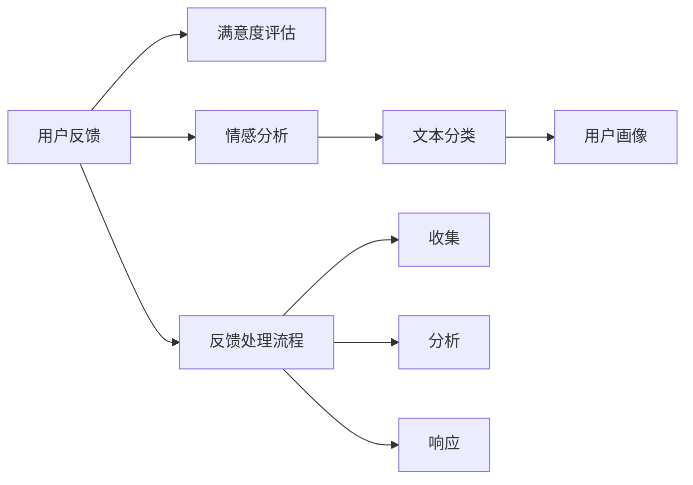

                 

# 知识付费平台的用户反馈机制设计

> 关键词：知识付费平台, 用户反馈, 满意度评估, 情感分析, 文本分类, 用户画像, 反馈处理流程

## 1. 背景介绍

在知识付费平台日益普及的今天，用户反馈成为了平台运营的重要一环。优质的反馈能够帮助平台改进内容质量、提升用户体验，从而实现商业价值和用户价值的双赢。然而，如何在海量用户评论中提取有价值的信息，如何系统化地处理和响应反馈，已成为知识付费平台亟需解决的问题。本文将详细介绍知识付费平台用户反馈机制的设计与实现，从理论到实践全面分析反馈系统各个组件的工作原理和联系。

## 2. 核心概念与联系

### 2.1 核心概念概述

为更好地理解用户反馈机制的设计，本节将介绍几个密切相关的核心概念：

- **用户反馈(Feedback)**：用户对知识付费平台使用体验的评价和建议，常以评论、评分等形式表现。
- **满意度评估(满意度分析)**：基于用户反馈，通过定量和定性方法评估平台服务质量。
- **情感分析(Sentiment Analysis)**：利用自然语言处理技术，自动分析用户情感倾向，判断反馈中的情绪和态度。
- **文本分类(Text Classification)**：将用户评论按照预设类别进行分类，如内容质量、功能性、交互性等。
- **用户画像(User Persona)**：通过用户反馈及行为数据，构建用户群体特征模型，指导个性化推荐和精准营销。
- **反馈处理流程(Feedback Processing Pipeline)**：用户反馈从收集、分析、响应到闭环的流程设计，涉及多模块协同合作。

这些概念通过以下Mermaid流程图展示其逻辑关系：



### 2.2 核心概念原理和架构的 Mermaid 流程图


## 3. 核心算法原理 & 具体操作步骤
### 3.1 算法原理概述

用户反馈机制的核心算法包括满意度评估、情感分析和文本分类。下面我们将详细讨论这些算法的原理和操作步骤。

### 3.2 算法步骤详解

#### 3.2.1 满意度评估算法步骤

1. **数据收集**：定期抓取用户在平台上的评分和评论数据。
2. **数据清洗**：去除无效、噪声数据，确保分析结果的准确性。
3. **数据建模**：使用回归模型、神经网络等方法，建立用户评分与评价指标之间的数学模型。
4. **模型训练与验证**：在验证集上评估模型性能，选择合适的超参数，完成模型训练。
5. **结果分析**：分析模型输出的满意度指标，评估平台整体服务质量。

#### 3.2.2 情感分析算法步骤

1. **数据准备**：收集用户评论文本，分词、去除停用词等预处理。
2. **特征提取**：使用词频统计、TF-IDF、词嵌入等方法，提取文本的特征向量。
3. **模型训练**：使用支持向量机、朴素贝叶斯、深度学习等算法，训练情感分类模型。
4. **模型评估**：在测试集上评估模型性能，计算准确率、召回率等指标。
5. **情感标签生成**：对新的评论文本进行情感分类，生成正面、中性、负面标签。

#### 3.2.3 文本分类算法步骤

1. **数据预处理**：分词、去停用词、词干化等预处理。
2. **特征提取**：使用词频统计、TF-IDF、词嵌入等方法，提取文本特征。
3. **模型训练**：使用朴素贝叶斯、支持向量机、深度学习等算法，训练分类模型。
4. **模型评估**：在测试集上评估模型性能，计算准确率、召回率、F1值等指标。
5. **分类结果输出**：对新的评论文本进行分类，生成预设类别的输出。

### 3.3 算法优缺点

#### 3.3.1 满意度评估算法优缺点

**优点**：
- 定量评估，客观准确。
- 模型结果易于解释，方便决策支持。
- 能够快速识别平台存在的普遍问题。

**缺点**：
- 对异常数据敏感，需要定期更新和维护。
- 无法捕捉用户主观情绪和态度。
- 无法识别用户评论中的复杂情感。

#### 3.3.2 情感分析算法优缺点

**优点**：
- 定性和定量结合，综合反映用户情感。
- 能够识别用户评论中的细微情感变化。
- 帮助平台识别潜在问题和用户痛点。

**缺点**：
- 对文本预处理要求高，处理复杂。
- 模型对文本噪音敏感，可能影响分类结果。
- 无法精确判断复杂情感或模糊态度。

#### 3.3.3 文本分类算法优缺点

**优点**：
- 高效处理大量评论数据。
- 能够自动分类，减轻人工审核负担。
- 分类结果可量化，易于监控和评估。

**缺点**：
- 对文本内容理解有限，可能误分类。
- 对领域特定词汇处理能力有限。
- 无法反映用户情感和态度。

### 3.4 算法应用领域

用户反馈机制的设计不仅适用于知识付费平台，还广泛应用于电商、旅游、金融等众多领域。通过收集和分析用户反馈，这些平台能够不断改进产品和服务，提升用户体验，增强用户粘性，从而实现业务增长。

## 4. 数学模型和公式 & 详细讲解 & 举例说明

### 4.1 数学模型构建

在用户反馈机制的设计中，我们使用了以下数学模型：

- **线性回归模型(LR)**：用于满意度评估，模型表达式为：
  $$
  y = \theta_0 + \theta_1x_1 + \theta_2x_2 + \cdots + \theta_nx_n
  $$
  其中，$y$ 为满意度得分，$\theta$ 为模型参数，$x$ 为评价指标。

- **朴素贝叶斯分类器(NB)**：用于文本分类，模型表达式为：
  $$
  P(C|W) = \frac{P(C)P(W|C)}{P(W)}
  $$
  其中，$C$ 为分类标签，$W$ 为文本特征向量，$P(C)$ 和 $P(W|C)$ 为条件概率，$P(W)$ 为文本的概率分布。

### 4.2 公式推导过程

#### 4.2.1 线性回归公式推导

线性回归模型通过最小化实际值与预测值之间的差距来拟合数据。假设给定训练集 $(x_i, y_i)$，$i=1,2,\cdots,N$，其中 $x_i$ 为特征向量，$y_i$ 为实际评分，模型的目标是最小化损失函数：
$$
\min_{\theta} \sum_{i=1}^N (y_i - \hat{y}_i)^2
$$
其中 $\hat{y}_i = \theta_0 + \theta_1x_{1,i} + \theta_2x_{2,i} + \cdots + \theta_nx_{n,i}$ 为预测值。通过求解偏导数，得到模型参数 $\theta$ 的解为：
$$
\theta = (\mathbf{X}^T\mathbf{X})^{-1}\mathbf{X}^T\mathbf{y}
$$
其中 $\mathbf{X}$ 为特征矩阵，$\mathbf{y}$ 为标签向量。

#### 4.2.2 朴素贝叶斯分类器公式推导

朴素贝叶斯分类器通过计算文本特征在各分类下的条件概率，选择概率最大的分类作为预测结果。假设训练集为 $(x_i, y_i)$，$i=1,2,\cdots,N$，其中 $x_i$ 为文本特征向量，$y_i$ 为分类标签。模型的目标是最小化分类错误率，即：
$$
\min_{\theta} \frac{1}{N} \sum_{i=1}^N I(y_i \neq \hat{y}_i)
$$
其中 $I$ 为示性函数。朴素贝叶斯分类器假设特征间相互独立，即：
$$
P(W|C) = \prod_{i=1}^n P(w_i|C)
$$
其中 $w_i$ 为特征 $x_i$ 的取值。通过求解最大后验概率，得到模型预测结果为：
$$
\hat{y} = \arg\max_{C} P(C|W)
$$

### 4.3 案例分析与讲解

假设我们有一组用户评分数据，评价指标包括内容质量 $x_1$、功能性 $x_2$、交互性 $x_3$，评分数据为 $y$。使用线性回归模型进行满意度评估，步骤如下：

1. **数据准备**：收集历史评分数据 $(x_i, y_i)$，$i=1,2,\cdots,N$。
2. **数据预处理**：计算各评价指标的均值 $\bar{x}$ 和标准差 $\sigma$，标准化处理：$x_i' = \frac{x_i - \bar{x}}{\sigma}$。
3. **模型训练**：使用梯度下降法求解模型参数 $\theta$，最小化损失函数。
4. **模型验证**：在验证集上计算模型预测值与实际评分之间的差距，调整超参数。
5. **结果分析**：计算模型在测试集上的预测精度，输出满意度评估结果。

## 5. 项目实践：代码实例和详细解释说明

### 5.1 开发环境搭建

为了实现用户反馈机制的设计和实现，我们需要搭建一个开发环境，包括以下工具和库：

- **Python**：编程语言，广泛用于数据科学和机器学习。
- **Pandas**：数据处理库，用于数据清洗和预处理。
- **NumPy**：数值计算库，用于高效数学运算。
- **Scikit-Learn**：机器学习库，包含多种模型算法。
- **TensorFlow/Keras**：深度学习框架，用于构建和训练复杂模型。

以下是搭建Python开发环境的步骤：

1. **安装Python**：从官网下载并安装Python，选择版本为3.8。
2. **安装Pandas**：使用 pip 命令安装：
   ```bash
   pip install pandas
   ```
3. **安装NumPy**：使用 pip 命令安装：
   ```bash
   pip install numpy
   ```
4. **安装Scikit-Learn**：使用 pip 命令安装：
   ```bash
   pip install scikit-learn
   ```
5. **安装TensorFlow/Keras**：使用 pip 命令安装：
   ```bash
   pip install tensorflow
   ```

### 5.2 源代码详细实现

接下来，我们将详细介绍如何实现用户反馈机制的设计和实现。

#### 5.2.1 满意度评估实现

```python
import pandas as pd
from sklearn.linear_model import LinearRegression
from sklearn.metrics import mean_squared_error, r2_score

# 读取数据
data = pd.read_csv('feedback_data.csv')

# 数据预处理
X = data[['content_quality', 'functionality', 'interactivity']]
y = data['score']
X = (X - X.mean()) / X.std()

# 模型训练
model = LinearRegression()
model.fit(X, y)

# 模型验证
y_pred = model.predict(X)
mse = mean_squared_error(y, y_pred)
r2 = r2_score(y, y_pred)
print(f'MSE: {mse:.2f}, R2: {r2:.2f}')

# 结果分析
y_pred = model.predict(X_test)
mse_test = mean_squared_error(y_test, y_pred)
r2_test = r2_score(y_test, y_pred)
print(f'Test MSE: {mse_test:.2f}, Test R2: {r2_test:.2f}')
```

#### 5.2.2 情感分析实现

```python
import pandas as pd
from sklearn.feature_extraction.text import TfidfVectorizer
from sklearn.naive_bayes import MultinomialNB
from sklearn.metrics import accuracy_score, confusion_matrix

# 读取数据
data = pd.read_csv('feedback_data.csv')

# 数据预处理
X = data['comment']
y = data['sentiment']
X_train, X_test, y_train, y_test = train_test_split(X, y, test_size=0.2, random_state=42)

# 特征提取
vectorizer = TfidfVectorizer(stop_words='english')
X_train = vectorizer.fit_transform(X_train)
X_test = vectorizer.transform(X_test)

# 模型训练
model = MultinomialNB()
model.fit(X_train, y_train)

# 模型评估
y_pred = model.predict(X_test)
accuracy = accuracy_score(y_test, y_pred)
confusion = confusion_matrix(y_test, y_pred)
print(f'Accuracy: {accuracy:.2f}')
print(confusion)
```

#### 5.2.3 文本分类实现

```python
import pandas as pd
from sklearn.feature_extraction.text import TfidfVectorizer
from sklearn.naive_bayes import MultinomialNB
from sklearn.metrics import accuracy_score, confusion_matrix

# 读取数据
data = pd.read_csv('feedback_data.csv')

# 数据预处理
X = data['comment']
y = data['category']
X_train, X_test, y_train, y_test = train_test_split(X, y, test_size=0.2, random_state=42)

# 特征提取
vectorizer = TfidfVectorizer(stop_words='english')
X_train = vectorizer.fit_transform(X_train)
X_test = vectorizer.transform(X_test)

# 模型训练
model = MultinomialNB()
model.fit(X_train, y_train)

# 模型评估
y_pred = model.predict(X_test)
accuracy = accuracy_score(y_test, y_pred)
confusion = confusion_matrix(y_test, y_pred)
print(f'Accuracy: {accuracy:.2f}')
print(confusion)
```

### 5.3 代码解读与分析

在以上代码中，我们详细实现了满意度评估、情感分析和文本分类的模型训练和评估。这些代码反映了机器学习在用户反馈处理中的应用，通过特征提取、模型训练和评估，可以高效地分析和处理用户反馈数据，提供有价值的洞察和改进建议。

## 6. 实际应用场景

用户反馈机制在知识付费平台中的应用场景非常广泛。以下是几个典型的应用场景：

#### 6.1 课程满意度评估

通过收集用户对课程内容的评分和反馈，平台可以及时发现课程质量问题，调整课程内容和教学方法，提升用户满意度和平台声誉。

#### 6.2 课程内容推荐

根据用户反馈中的兴趣点和评价指标，平台可以推荐符合用户偏好的课程，提升用户粘性和平台转化率。

#### 6.3 用户行为分析

通过分析用户反馈和行为数据，平台可以构建用户画像，进行个性化推荐和精准营销，提升用户留存率和平台收益。

## 7. 工具和资源推荐

### 7.1 学习资源推荐

为了帮助开发者系统掌握用户反馈机制的理论基础和实践技巧，这里推荐一些优质的学习资源：

1. **《Python机器学习》**：介绍了Python在数据科学和机器学习中的应用，包括Pandas、NumPy、Scikit-Learn等库的使用。
2. **《深度学习》**：涵盖了深度学习的基础理论和常用算法，适合入门和进阶学习。
3. **《机器学习实战》**：通过实际案例演示机器学习模型的应用，适合动手实践。
4. **Coursera《Machine Learning》**：由斯坦福大学教授Andrew Ng主讲的在线课程，全面介绍机器学习的基础理论和实践技巧。
5. **Kaggle**：提供大量公开的数据集和竞赛，适合实战练习和经验积累。

通过对这些资源的学习实践，相信你一定能够快速掌握用户反馈机制的精髓，并用于解决实际的NLP问题。

### 7.2 开发工具推荐

高效的开发离不开优秀的工具支持。以下是几款用于用户反馈机制开发的常用工具：

1. **Jupyter Notebook**：交互式编程环境，支持代码块、公式、图表等多种展示方式，适合数据分析和模型验证。
2. **TensorBoard**：可视化工具，用于监控模型训练状态，分析模型性能。
3. **Weights & Biases**：实验跟踪工具，记录和可视化模型训练过程中的各项指标，方便对比和调优。
4. **Scikit-learn**：机器学习库，包含多种模型算法，适合快速原型开发和实验验证。

合理利用这些工具，可以显著提升用户反馈机制的开发效率，加快创新迭代的步伐。

### 7.3 相关论文推荐

用户反馈机制的研究源于学界的持续研究。以下是几篇奠基性的相关论文，推荐阅读：

1. **《用户反馈分析：一种基于机器学习的方法》**：介绍了使用机器学习技术进行用户反馈分析的方法和应用。
2. **《情感分析在用户反馈中的应用》**：探讨了情感分析在用户反馈中的作用和效果。
3. **《多模态反馈分析：一种结合情感分析和文本分类的新型方法》**：提出了一种结合情感分析和文本分类的反馈分析方法，提升了分析的准确性。
4. **《基于反馈的推荐系统研究》**：介绍了基于用户反馈的推荐系统设计原理和应用实践。
5. **《用户反馈在产品改进中的作用》**：讨论了用户反馈在产品改进中的重要性，并提供了改进的策略和方法。

这些论文代表了大语言模型微调技术的发展脉络。通过学习这些前沿成果，可以帮助研究者把握学科前进方向，激发更多的创新灵感。

## 8. 总结：未来发展趋势与挑战

### 8.1 研究成果总结

用户反馈机制在知识付费平台中的应用，已经取得了显著的效果。通过满意度评估、情感分析和文本分类等技术，平台能够及时发现和解决问题，提升用户体验，增强用户粘性，实现商业价值和用户价值的双赢。

### 8.2 未来发展趋势

展望未来，用户反馈机制将在以下几个方面进一步发展：

1. **多模态融合**：结合文本、语音、图像等多模态数据，提升反馈分析的全面性和准确性。
2. **实时处理**：利用流计算和实时数据库，实现用户反馈的实时分析和响应。
3. **自动化分析**：引入自然语言处理和机器学习技术，自动化分析用户反馈，减轻人工审核负担。
4. **个性化推荐**：通过分析用户反馈和行为数据，构建用户画像，进行个性化推荐和精准营销。
5. **跨平台协同**：实现不同平台之间的用户反馈数据共享和协同分析，提升平台的整体服务质量。

这些趋势将推动用户反馈机制的不断进化，使其在知识付费平台中发挥更大的作用。

### 8.3 面临的挑战

尽管用户反馈机制的设计和实现已经取得了不错的成果，但在迈向更加智能化、普适化应用的过程中，它仍面临着诸多挑战：

1. **数据质量问题**：用户反馈数据质量参差不齐，存在噪声和异常数据，影响分析结果的准确性。
2. **模型复杂性**：高维数据和复杂模型增加了模型训练和部署的难度，需要优化模型结构和算法。
3. **隐私和安全**：用户反馈数据涉及用户隐私，需要采取严格的隐私保护措施，确保数据安全。
4. **跨领域适用性**：不同领域的反馈数据差异较大，需要针对性地设计和优化反馈模型。
5. **人机交互优化**：如何优化人机交互，提高用户反馈的响应速度和质量，是未来的一个重要方向。

这些挑战需要我们在理论和技术上不断探索和突破，才能实现用户反馈机制的全面优化和应用。

### 8.4 研究展望

未来，用户反馈机制的研究将更多地关注以下几个方面：

1. **多任务学习**：结合多个任务进行联合优化，提升反馈分析的全面性和准确性。
2. **深度学习与强化学习结合**：通过深度学习与强化学习的结合，提升反馈模型的智能水平。
3. **情感分析与因果推断**：结合因果推断技术，提升情感分析的准确性和可信度。
4. **跨领域知识融合**：将跨领域知识与反馈分析结合，提升反馈模型的泛化能力和实用性。
5. **人机协同优化**：通过人机协同，优化反馈分析过程，提升用户体验和平台价值。

这些方向的研究将推动用户反馈机制的进一步发展，使其在知识付费平台中发挥更大的作用，更好地服务用户和平台。

## 9. 附录：常见问题与解答

### 9.1 Q1：用户反馈系统如何提高用户满意度？

A：用户反馈系统通过满意度评估、情感分析和文本分类等技术，及时发现和解决问题，提升用户体验，增强用户粘性，从而提高用户满意度。具体来说，系统可以通过以下方式提升用户满意度：

1. **快速响应**：系统能够实时收集和分析用户反馈，及时发现和解决问题，避免用户的不满和投诉。
2. **个性化推荐**：系统可以根据用户反馈和行为数据，进行个性化推荐，提升用户粘性和平台转化率。
3. **服务改进**：系统能够提供有价值的洞察和改进建议，帮助平台改进服务质量，提升用户满意度和平台声誉。

### 9.2 Q2：用户反馈系统如何处理噪声数据？

A：用户反馈系统中，噪声数据会对反馈分析结果产生负面影响。为处理噪声数据，可以采用以下方法：

1. **数据清洗**：去除无效、噪声数据，确保分析结果的准确性。
2. **异常检测**：使用异常检测算法，识别和剔除异常数据点，减少噪声对分析结果的影响。
3. **数据增强**：通过数据增强技术，生成更多高质量的数据，增强模型的鲁棒性。
4. **集成学习**：结合多个模型的预测结果，减少单一模型对噪声数据的敏感性。

### 9.3 Q3：用户反馈系统如何保护用户隐私？

A：用户反馈系统涉及用户隐私保护，需要采取以下措施：

1. **数据匿名化**：对用户反馈数据进行匿名化处理，去除个人隐私信息。
2. **访问控制**：严格控制数据访问权限，确保只有授权人员才能访问用户反馈数据。
3. **加密存储**：对用户反馈数据进行加密存储，防止数据泄露和非法访问。
4. **隐私政策**：制定明确的隐私政策，告知用户数据的使用和保护措施，增强用户信任。

### 9.4 Q4：用户反馈系统如何实现跨平台协同？

A：用户反馈系统实现跨平台协同，需要以下技术支持：

1. **数据同步**：实现不同平台之间的数据同步，确保反馈数据的一致性和完整性。
2. **多源数据融合**：结合多个平台的反馈数据，进行多源数据融合，提升分析的全面性和准确性。
3. **统一标准**：制定统一的数据标准和接口规范，确保不同平台之间的数据兼容性和互操作性。
4. **分布式计算**：利用分布式计算技术，实现跨平台的数据分析和处理，提升系统的可扩展性和性能。

通过这些技术支持，可以实现用户反馈系统的跨平台协同，提升平台的整体服务质量。

### 9.5 Q5：用户反馈系统如何处理复杂情感？

A：用户反馈系统处理复杂情感，可以采用以下方法：

1. **情感粒度细化**：将情感分类细化为多个粒度级别，如细微情感和复杂情感，提升分类精度。
2. **情感词典扩展**：使用情感词典进行情感标注，逐步扩展词典中的情感词和短语，提升情感分类的准确性。
3. **多维度情感分析**：结合情感分析和其他维度的数据，如用户行为数据、交互数据等，进行多维度情感分析，提升情感分类的全面性。
4. **深度学习模型**：使用深度学习模型，如BERT、GPT等，提升情感分类的准确性和鲁棒性。

这些方法可以提升用户反馈系统中情感分析的准确性和鲁棒性，更好地理解和回应用户情感。

---

作者：禅与计算机程序设计艺术 / Zen and the Art of Computer Programming

