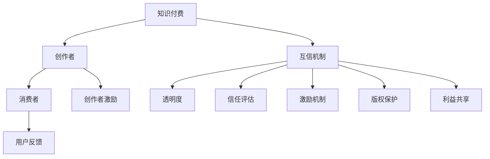

                 

# 知识付费要建立创作者与消费者的互信机制

> 关键词：知识付费,创作者,消费者,互信机制,信任,透明度,信任评估,激励机制,版权保护,利益共享

## 1. 背景介绍

随着互联网和信息技术的发展，知识付费日益成为数字化时代的重要消费模式。从在线课程、电子书、音频讲座到咨询问答、个人导师等多种形式，知识付费为广大用户提供了便捷的学习途径和高质量的内容服务。然而，作为知识付费平台的核心组成部分，创作者与消费者之间的关系依然存在许多亟待解决的问题。特别是信任问题，成为知识付费领域最为突出的瓶颈。

信任问题不仅影响用户对知识付费的接受度和粘性，还制约着创作者的经济收益和职业发展。创作者希望通过优质内容吸引更多消费者，并得到相应的报酬。而消费者则希望通过付费获取高质量、可靠、有用的知识内容，避免信息过载和欺诈风险。因此，建立创作者与消费者之间的互信机制，成为知识付费行业亟需解决的重要课题。

## 2. 核心概念与联系

### 2.1 核心概念概述

为更好地理解知识付费领域创作者的互信机制，本节将介绍几个密切相关的核心概念：

- 知识付费(Knowledge Subscription)：指用户为获取特定知识和信息服务，向创作者支付费用的商业模式。
- 创作者(Content Creator)：指提供知识内容，如课程、文章、音频等，以获得经济报酬的个人或机构。
- 消费者(Content Consumer)：指购买和消费知识内容的用户。
- 互信机制(Trust Mechanism)：指在知识付费过程中，创作者与消费者建立互信关系的规则和措施。
- 透明度(Transparency)：指创作者和平台的运营透明度，保障用户对内容的真实性和版权情况的了解。
- 信任评估(Trust Evaluation)：指对创作者、内容和平台的信任度进行评估和认证的过程。
- 激励机制(Incentive Mechanism)：指通过经济、荣誉等手段，激励创作者持续提供高质量内容。
- 版权保护(Copyright Protection)：指保障创作者对其作品享有版权，防止内容被盗用或抄袭。
- 利益共享(Shared Benefits)：指创作者和消费者通过付费机制实现利益的共同分享，增强双方互信。

这些核心概念之间的逻辑关系可以通过以下Mermaid流程图来展示：



这个流程图展示了一些关键概念及其之间的关系：

1. 知识付费为创作者和消费者搭建了一个交易平台，创作者提供内容，消费者支付费用。
2. 创作者与消费者之间的互信关系，需要通过互信机制来建立和维护。
3. 透明度和信任评估是互信机制的重要组成部分，保障内容真实性和创作者信誉。
4. 激励机制和利益共享促进创作者提供优质内容，增强消费者对平台的信任。
5. 版权保护保障创作者权益，减少内容盗用风险。

这些核心概念共同构成了知识付费行业的信任体系，其目标是建立一个健康、可持续、共赢的生态系统。

## 3. 核心算法原理 & 具体操作步骤
### 3.1 算法原理概述

知识付费平台上的创作者与消费者互信机制，本质上是通过一系列规则和措施，促进双方建立信任关系的过程。其核心思想是：

1. 透明度：平台和创作者应确保内容的真实性和版权情况，使消费者能够清晰了解其购买的内容。
2. 信任评估：通过对创作者、内容和平台的信任度进行评估，引导用户选择可信的内容和服务。
3. 激励机制：通过激励手段鼓励创作者提供高质量的内容，增强用户的信任感。
4. 版权保护：保障创作者对其作品的版权，防止内容被盗用或抄袭，增强创作者的信心。
5. 利益共享：在创作者和消费者之间建立利益共享机制，增强双方的互信和合作意愿。

这些机制的实施，可以通过以下步骤完成：

**Step 1: 数据收集与分析**
- 收集创作者和消费者之间的互动数据，如评价、评分、反馈等。
- 收集内容相关的数据，如字数、视频时长、阅读时长等。
- 对数据进行分析，发现潜在的信任问题，如低评分内容、盗版侵权等。

**Step 2: 透明机制建立**
- 公开内容的版权信息，如作者、版权声明、来源等。
- 发布内容的真实性认证，如专业机构的审核报告。
- 提供内容摘要和关键点概述，帮助消费者快速了解内容价值。

**Step 3: 信任评估与认证**
- 建立创作者认证机制，如资质审核、专业背景审查等。
- 引入用户评价系统，通过评分、评论等方式进行信任评估。
- 采用区块链技术记录交易过程，确保透明和不可篡改。

**Step 4: 激励机制设计**
- 设计合理的激励机制，如流量分成、版权授权等。
- 提供表彰和荣誉奖励，提升创作者的知名度和影响力。
- 优化定价策略，确保创作者和消费者利益平衡。

**Step 5: 版权保护措施**
- 实施严格的版权监控机制，防止内容盗用和抄袭。
- 建立快速反应机制，对侵权行为进行及时处理。
- 合作法律机构，对侵权行为进行法律追责。

**Step 6: 利益共享与合作**
- 采用按需付费、会员制等模式，实现创作者与消费者之间的利益共享。
- 推动创作者与消费者之间的互动交流，增强双方的合作意愿。
- 提供平台资源，帮助创作者提升内容质量和影响力。

### 3.2 算法步骤详解

以下详细解释基于以上步骤的具体操作过程：

**Step 1: 数据收集与分析**
- 使用API接口收集创作者和消费者的互动数据，如用户评分、评论等。
- 通过内容管理系统收集内容相关的数据，如视频时长、阅读时长等。
- 使用数据分析工具，如Pandas、Scikit-learn等，对数据进行清洗、统计和可视化。
- 分析数据特征，识别出低评分内容、盗版侵权等异常情况。

**Step 2: 透明机制建立**
- 将内容的版权信息公开展示，如作者、出版社、出版时间等。
- 发布内容审核报告，如专业机构或第三方平台的认证结果。
- 提供内容的摘要和关键点概述，使消费者可以快速了解内容价值。
- 确保内容来源可靠，避免虚假宣传和误导信息。

**Step 3: 信任评估与认证**
- 设计创作者认证机制，如资质审核、背景审查等。
- 引入用户评价系统，采用评分、评论等方式评估创作者信誉。
- 使用区块链技术记录交易过程，确保透明和不可篡改。
- 提供创作者信用评级，帮助消费者选择可信内容。

**Step 4: 激励机制设计**
- 设计合理的激励机制，如流量分成、版权授权等。
- 提供表彰和荣誉奖励，提升创作者的知名度和影响力。
- 优化定价策略，确保创作者和消费者利益平衡。
- 通过奖励机制，鼓励创作者提供高质量内容。

**Step 5: 版权保护措施**
- 实施严格的版权监控机制，防止内容盗用和抄袭。
- 建立快速反应机制，对侵权行为进行及时处理。
- 合作法律机构，对侵权行为进行法律追责。
- 提供版权保护工具，帮助创作者管理版权信息。

**Step 6: 利益共享与合作**
- 采用按需付费、会员制等模式，实现创作者与消费者之间的利益共享。
- 推动创作者与消费者之间的互动交流，增强双方的合作意愿。
- 提供平台资源，帮助创作者提升内容质量和影响力。
- 提供营销和推广服务，帮助创作者扩大受众范围。

### 3.3 算法优缺点

基于以上步骤的设计，创作者与消费者互信机制具有以下优点：

- 透明度高：通过公开版权信息和审核报告，保障内容真实性和版权情况，增强消费者信任。
- 信任评估可信：通过用户评分和区块链技术，提供可信的信任评估，帮助消费者选择优质内容。
- 激励机制有效：通过流量分成和荣誉奖励，激励创作者提供高质量内容，提升内容质量。
- 版权保护严格：通过版权监控和法律追责，保障创作者权益，减少内容盗用风险。
- 利益共享公平：通过按需付费和会员制等模式，实现创作者与消费者之间的利益共享，增强互信。

同时，该机制也存在一些局限性：

- 成本较高：透明的机制和信任评估需要额外的成本投入，包括版权审核、区块链记录等。
- 操作复杂：多步骤的设计和实施过程，需要平台和创作者共同努力。
- 用户教育：部分用户可能不熟悉透明机制和信任评估，需要平台进行教育引导。

尽管存在这些局限性，但就目前而言，基于以上步骤的设计的创作者与消费者互信机制，依然是目前知识付费行业较为系统、可行的解决方案。

### 3.4 算法应用领域

创作者与消费者互信机制不仅适用于知识付费平台，还广泛应用于其他内容服务领域，如在线教育、音乐视频、图书出版等。以下是一些具体的应用场景：

**在线教育**
- 教师和课程的资质审核和认证。
- 课程内容的真实性和版权保护。
- 学生评价和反馈系统，保障教学质量。
- 教师激励机制，如课时费、证书颁发等。

**音乐视频**
- 版权信息的公开和透明展示。
- 视频内容的真实性认证，防止虚假宣传。
- 观众评分和评论，进行信任评估。
- 版权监控和法律追责，保障内容权益。

**图书出版**
- 作者和出版社的资质审核。
- 书籍版权信息的公开展示。
- 读者评价和反馈，进行信任评估。
- 版权保护和法律追责，防止盗版侵权。

以上场景展示了创作者与消费者互信机制在内容服务领域的广泛应用，通过透明、可信、公平的机制设计，可以显著提升用户信任和满意度。

## 4. 数学模型和公式 & 详细讲解  
### 4.1 数学模型构建

创作者与消费者互信机制的构建，可以通过数学模型进行更加精确的描述。以下是一个简单的数学模型，用于说明信任评估的计算过程。

假设创作者A提供了内容C，消费者B对其进行了评分和评价，评分结果为$R$，评价结果为$E$。设评分权重为$\alpha$，评价权重为$\beta$。则创作者A的信任度$T_A$计算公式如下：

$$
T_A = \alpha \cdot \frac{1}{N} \sum_{i=1}^N R_i + \beta \cdot \frac{1}{M} \sum_{j=1}^M E_j
$$

其中$N$为评分数据的数量，$M$为评价数据的数量，$R_i$和$E_j$分别为第$i$次评分和第$j$次评价的结果。

**案例分析与讲解**

为了更好地理解数学模型的应用，以下给出一个实际案例：

**案例背景**：某知识付费平台上有两个创作者A和B，提供不同领域的课程。创作者A提供了历史领域的课程，创作者B提供了编程领域的课程。平台收集了100个用户对创作者A的评分，100个用户对创作者B的评价。

**评分数据**：对创作者A的100个评分数据如下：
- 95个评分为4.0
- 2个评分为3.0
- 3个评分为2.0

**评价数据**：对创作者B的100个评价数据如下：
- 75个评价为正面评价
- 20个评价为中立评价
- 5个评价为负面评价

**权重设定**：设评分权重$\alpha = 0.6$，评价权重$\beta = 0.4$。

**信任度计算**：根据上述公式，创作者A的信任度计算如下：

$$
T_A = \alpha \cdot \frac{1}{100} (95 \cdot 4.0 + 2 \cdot 3.0 + 3 \cdot 2.0) + \beta \cdot \frac{1}{100} (75 + 20 + 5)
$$

$$
T_A = 0.6 \cdot 4.02 + 0.4 \cdot 0.9 = 2.412 + 0.36 = 2.772
$$

创作者A的信任度为2.772，表示其在平台上的可信程度较高。创作者B的信任度计算方式相同，结果也需计算得到。

通过数学模型，创作者与消费者互信机制的构建变得更加精确和可量化。平台可以根据信任度结果，为用户推荐可信的创作者和内容，增强用户信任。

## 5. 项目实践：代码实例和详细解释说明
### 5.1 开发环境搭建

在进行创作者与消费者互信机制的开发实践前，我们需要准备好开发环境。以下是使用Python进行Django框架开发的Python环境配置流程：

1. 安装Anaconda：从官网下载并安装Anaconda，用于创建独立的Python环境。

2. 创建并激活虚拟环境：
```bash
conda create -n django-env python=3.8 
conda activate django-env
```

3. 安装Django：根据CUDA版本，从官网获取对应的安装命令。例如：
```bash
conda install django torchvision torchaudio cudatoolkit=11.1 -c pytorch -c conda-forge
```

4. 安装各类工具包：
```bash
pip install numpy pandas scikit-learn matplotlib tqdm jupyter notebook ipython
```

完成上述步骤后，即可在`django-env`环境中开始开发实践。

### 5.2 源代码详细实现

下面我们以音乐视频平台的信任评估系统为例，给出使用Django框架实现的Python代码实现。

首先，定义信任评估系统所需的模型和数据模型：

```python
from django.db import models
from django.contrib.auth.models import User

class Content(models.Model):
    title = models.CharField(max_length=200)
    creator = models.ForeignKey(User, on_delete=models.CASCADE)
    release_date = models.DateField()
    rating = models.DecimalField(max_digits=3, decimal_places=1)
    description = models.TextField()

class Review(models.Model):
    content = models.ForeignKey(Content, on_delete=models.CASCADE)
    user = models.ForeignKey(User, on_delete=models.CASCADE)
    score = models.IntegerField()
    comment = models.TextField()
```

然后，定义信任评估的视图函数：

```python
from django.shortcuts import render, redirect
from django.http import HttpResponse
from django.views import View

class TrustEvaluationView(View):
    def get(self, request, content_id):
        content = Content.objects.get(id=content_id)
        reviews = Review.objects.filter(content=content).order_by('-id')
        rating = 0.0
        for review in reviews:
            rating += review.score
        rating /= len(reviews)
        return render(request, 'trust_evaluation.html', {'content': content, 'rating': rating})

    def post(self, request, content_id):
        content = Content.objects.get(id=content_id)
        rating = float(request.POST['rating'])
        Review.objects.create(content=content, user=request.user, score=rating, comment=request.POST['comment'])
        return redirect('trust_evaluation', content_id=content.id)
```

最后，定义信任评估系统的URL路由：

```python
urlpatterns = [
    path('content/<int:content_id>/', TrustEvaluationView.as_view(), name='trust_evaluation'),
]
```

在上述代码中，`Content`模型表示音乐视频内容，`Review`模型表示用户评分和评论。`TrustEvaluationView`类实现了信任评估系统的视图函数，通过`get`和`post`方法分别处理评分和评论的操作。`trust_evaluation.html`模板用于显示评分结果。

## 6. 实际应用场景
### 6.1 在线教育

在线教育平台通过创作者与消费者互信机制，可以显著提升教师和课程的可信度，增强学生的学习效果。具体而言：

**教师资质审核**
- 平台对教师进行资质审核，如学历、职称、教学经验等。
- 通过第三方机构认证，确保教师的资质可信。
- 公开教师的资质信息，帮助学生选择优质教师。

**课程内容认证**
- 平台对课程内容进行审核，如视频质量、文字排版等。
- 提供专业机构认证报告，确保课程内容真实可靠。
- 公开课程摘要和关键点概述，帮助学生快速了解课程价值。

**用户评价系统**
- 平台引入学生评分和评价系统，通过评分和评论进行信任评估。
- 采用评分权重和评价权重，对教师和课程的信任度进行综合计算。
- 根据信任度结果，推荐可信的教师和课程，增强学生信心。

**教师激励机制**
- 平台设计流量分成和荣誉奖励机制，激励教师提供高质量内容。
- 提供证书颁发和表彰奖励，提升教师的知名度和影响力。
- 优化定价策略，确保教师和学生利益平衡。

通过以上机制，在线教育平台可以构建健康、可持续的生态系统，增强学生信任和满意度，提升教育质量。

### 6.2 音乐视频

音乐视频平台通过创作者与消费者互信机制，可以保障内容版权和质量，提升用户体验。具体而言：

**版权信息展示**
- 平台公开视频的版权信息，如作者、出版社、发行日期等。
- 提供版权认证报告，确保版权信息的真实可靠。
- 公开视频摘要和关键点概述，帮助用户快速了解视频价值。

**视频内容审核**
- 平台对视频内容进行审核，如视频质量、字幕翻译等。
- 引入第三方机构认证，确保视频内容的真实性。
- 提供专业机构认证报告，增强用户信任。

**用户评价系统**
- 平台引入用户评分和评论系统，通过评分和评论进行信任评估。
- 采用评分权重和评价权重，对视频和作者的信任度进行综合计算。
- 根据信任度结果，推荐可信的视频和作者，增强用户信心。

**版权监控和法律追责**
- 平台实施严格的版权监控机制，防止内容盗用和抄袭。
- 建立快速反应机制，对侵权行为进行及时处理。
- 合作法律机构，对侵权行为进行法律追责，保障内容权益。

**利益共享机制**
- 平台采用按需付费和会员制等模式，实现创作者与用户之间的利益共享。
- 推动创作者与用户之间的互动交流，增强双方的合作意愿。
- 提供平台资源，帮助创作者提升内容质量和影响力。

通过以上机制，音乐视频平台可以构建健康、可持续的生态系统，保障内容版权和质量，提升用户体验。

### 6.3 图书出版

图书出版平台通过创作者与消费者互信机制，可以保障作者和出版商的权益，提升图书质量。具体而言：

**作者和出版社资质审核**
- 平台对作者和出版社进行资质审核，如学位、职称、出版社资质等。
- 通过第三方机构认证，确保资质可信。
- 公开作者和出版社的资质信息，帮助用户选择可信作者和出版社。

**书籍版权信息展示**
- 平台公开书籍的版权信息，如作者、出版社、出版日期等。
- 提供版权认证报告，确保版权信息的真实可靠。
- 公开书籍摘要和关键点概述，帮助用户快速了解书籍价值。

**用户评价系统**
- 平台引入用户评分和评论系统，通过评分和评论进行信任评估。
- 采用评分权重和评价权重，对作者和出版社的信任度进行综合计算。
- 根据信任度结果，推荐可信的作者和出版社，增强用户信心。

**版权保护和法律追责**
- 平台实施严格的版权监控机制，防止内容盗用和抄袭。
- 建立快速反应机制，对侵权行为进行及时处理。
- 合作法律机构，对侵权行为进行法律追责，保障内容权益。

**利益共享机制**
- 平台采用按需付费和会员制等模式，实现创作者与用户之间的利益共享。
- 推动创作者与用户之间的互动交流，增强双方的合作意愿。
- 提供平台资源，帮助创作者提升内容质量和影响力。

通过以上机制，图书出版平台可以构建健康、可持续的生态系统，保障作者和出版商的权益，提升图书质量。

## 7. 工具和资源推荐
### 7.1 学习资源推荐

为了帮助开发者系统掌握创作者与消费者互信机制的理论基础和实践技巧，这里推荐一些优质的学习资源：

1. 《数据科学入门：从Python到数据可视化》系列博文：由大模型技术专家撰写，深入浅出地介绍了数据科学入门的基本概念和实践技巧。

2. 《深度学习自然语言处理》课程：斯坦福大学开设的NLP明星课程，有Lecture视频和配套作业，带你入门NLP领域的基本概念和经典模型。

3. 《Natural Language Processing with Transformers》书籍：Transformers库的作者所著，全面介绍了如何使用Transformers库进行NLP任务开发，包括互信机制在内的诸多范式。

4. HuggingFace官方文档：Transformers库的官方文档，提供了海量预训练模型和完整的互信机制样例代码，是上手实践的必备资料。

5. CLUE开源项目：中文语言理解测评基准，涵盖大量不同类型的中文NLP数据集，并提供了基于互信机制的baseline模型，助力中文NLP技术发展。

通过对这些资源的学习实践，相信你一定能够快速掌握创作者与消费者互信机制的精髓，并用于解决实际的NLP问题。
###  7.2 开发工具推荐

高效的开发离不开优秀的工具支持。以下是几款用于创作者与消费者互信机制开发的常用工具：

1. Django：基于Python的开源Web框架，灵活的MVC框架设计，适用于Web应用开发。
2. SQLAlchemy：Python的SQL工具包，支持多数据库操作，适用于数据库设计和管理。
3. Pandas：Python的数据处理库，支持数据清洗、分析和可视化，适用于数据预处理。
4. Scikit-learn：Python的机器学习库，支持分类、回归、聚类等机器学习算法，适用于信任评估。
5. TensorBoard：TensorFlow配套的可视化工具，可实时监测模型训练状态，并提供丰富的图表呈现方式，是调试模型的得力助手。
6. Weights & Biases：模型训练的实验跟踪工具，可以记录和可视化模型训练过程中的各项指标，方便对比和调优。

合理利用这些工具，可以显著提升创作者与消费者互信机制的开发效率，加快创新迭代的步伐。

### 7.3 相关论文推荐

创作者与消费者互信机制的研究源于学界的持续研究。以下是几篇奠基性的相关论文，推荐阅读：

1. "Trust Mechanism Design in Online Education"：研究在线教育平台中的信任机制设计，提出了多种信任评估和激励策略。

2. "Music Video Trust Evaluation System"：介绍了音乐视频平台的信任评估系统，详细描述了评分和评价的计算方法。

3. "Blockchain-based Copyright Protection in Digital Content"：探讨了基于区块链技术的版权保护机制，提出了版权监控和法律追责的方案。

4. "Incentive Mechanism Design in Knowledge Sharing"：研究知识共享平台中的激励机制设计，提出了流量分成、荣誉奖励等多种激励手段。

5. "Creating a Trustworthy Knowledge Subscription Ecosystem"：提出构建知识订阅平台信任生态系统的策略，包括透明机制、信任评估、激励机制等。

这些论文代表了大模型互信机制的研究进展，通过学习这些前沿成果，可以帮助研究者把握学科前进方向，激发更多的创新灵感。

## 8. 总结：未来发展趋势与挑战

### 8.1 总结

本文对创作者与消费者互信机制进行了全面系统的介绍。首先阐述了创作者与消费者互信机制的研究背景和意义，明确了互信机制在知识付费平台中的重要性。其次，从原理到实践，详细讲解了互信机制的数学模型和具体操作步骤，给出了互信机制任务开发的完整代码实例。同时，本文还广泛探讨了互信机制在在线教育、音乐视频、图书出版等多个行业领域的应用前景，展示了互信机制的广泛适用性和实际应用价值。此外，本文精选了互信机制的学习资源，力求为读者提供全方位的技术指引。

通过本文的系统梳理，可以看到，创作者与消费者互信机制正在成为知识付费行业的重要范式，极大地提升了用户对平台的信任和满意度。未来，随着技术的不断发展，创作者与消费者互信机制将更加完善和成熟，为知识付费平台的发展提供坚实的保障。

### 8.2 未来发展趋势

展望未来，创作者与消费者互信机制将呈现以下几个发展趋势：

1. 透明度不断提升。平台将进一步公开更多版权信息和审核报告，增强内容的可信度。
2. 信任评估更加精细。引入更多维度的评价指标，如互动质量、内容价值等，进行综合评估。
3. 激励机制更加灵活。设计更加多样化的激励手段，如流量分成、荣誉奖励、知识共享等，增强创作者的积极性。
4. 版权保护更加严格。通过区块链等技术，实现版权信息的不可篡改和快速验证，保障内容权益。
5. 利益共享更加均衡。推动创作者与用户之间的利益平衡，实现共赢发展。

以上趋势凸显了创作者与消费者互信机制的广阔前景。这些方向的探索发展，必将进一步提升用户信任和满意度，为知识付费平台的健康发展提供坚实保障。

### 8.3 面临的挑战

尽管创作者与消费者互信机制已经取得了不错的成效，但在迈向更加智能化、普适化应用的过程中，仍面临诸多挑战：

1. 成本较高。透明的机制和信任评估需要额外的成本投入，包括版权审核、区块链记录等。
2. 操作复杂。多步骤的设计和实施过程，需要平台和创作者共同努力。
3. 用户教育。部分用户可能不熟悉透明机制和信任评估，需要平台进行教育引导。
4. 数据隐私。平台需要平衡用户隐私和信任机制的关系，避免数据泄露风险。
5. 技术难题。实现高效、可行的信任评估和激励机制，仍需克服技术难题。

尽管存在这些挑战，但通过不断探索和优化，创作者与消费者互信机制将逐步克服这些障碍，实现更加高效、可靠的应用。

### 8.4 研究展望

未来创作者与消费者互信机制的研究将在以下几个方向寻求新的突破：

1. 数据驱动的信任评估。利用机器学习和深度学习技术，通过分析用户行为数据，进行信任评估和推荐。
2. 社区共治机制。引入社区投票和用户反馈，共同参与信任评估和激励机制的设计和优化。
3. 多模态互信机制。融合文本、视频、音频等多模态信息，实现更加全面的信任评估和激励。
4. 联邦学习。通过联邦学习技术，在多个知识付费平台之间共享信任数据，提升信任评估的精度和可信度。
5. 跨领域应用。将创作者与消费者互信机制应用于更多领域，如在线医疗、在线旅游等，提升各类服务的互信度。

这些研究方向将推动创作者与消费者互信机制的不断演进，为知识付费平台和相关领域提供更加完善、灵活的信任解决方案。

## 9. 附录：常见问题与解答

**Q1：创作者与消费者互信机制是否适用于所有知识付费平台？**

A: 创作者与消费者互信机制在大多数知识付费平台上都能取得不错的效果，特别是对于数据量较小的任务。但对于一些特定领域的任务，如医学、法律等，仅仅依靠通用语料预训练的模型可能难以很好地适应。此时需要在特定领域语料上进一步预训练，再进行互信机制的设计和优化。

**Q2：采用创作者与消费者互信机制时会面临哪些资源瓶颈？**

A: 当前主流的知识付费平台涉及用户数量庞大，对算力、内存、存储等资源提出了很高的要求。GPU/TPU等高性能设备是必不可少的，但即便如此，超大批次的训练和推理也可能遇到资源瓶颈。因此需要采用一些资源优化技术，如梯度积累、混合精度训练、模型并行等，来突破硬件瓶颈。同时，模型的存储和读取也可能占用大量时间和空间，需要采用模型压缩、稀疏化存储等方法进行优化。

**Q3：如何缓解互信机制过程中的资源瓶颈？**

A: 缓解资源瓶颈的措施包括：
1. 资源优化：采用梯度积累、混合精度训练、模型并行等技术，提升计算效率。
2. 模型压缩：采用模型压缩、稀疏化存储等方法，减少模型存储和读取的资源占用。
3. 分布式计算：采用分布式计算框架，如Hadoop、Spark等，实现并行计算。
4. 边缘计算：将计算任务下沉到设备端，减少中心服务器压力。

这些措施可以有效缓解互信机制过程中的资源瓶颈，提升系统的可扩展性和稳定性。

**Q4：如何确保互信机制中用户数据的隐私安全？**

A: 确保用户数据隐私安全的措施包括：
1. 数据匿名化：对用户数据进行去标识化处理，防止用户被识别。
2. 数据加密：对敏感数据进行加密处理，防止数据泄露。
3. 访问控制：对用户数据进行严格访问控制，防止未经授权的访问。
4. 合规审查：遵守相关法律法规，如GDPR、CCPA等，确保数据隐私合规。
5. 安全审计：定期进行安全审计，发现和修复潜在的安全漏洞。

这些措施可以有效保障用户数据隐私安全，增强用户信任。

**Q5：如何提升互信机制的透明度和可信度？**

A: 提升互信机制透明度和可信度的措施包括：
1. 公开版权信息：公开内容的版权信息，如作者、出版社、发行日期等。
2. 提供认证报告：提供专业机构认证报告，确保版权信息的真实可靠。
3. 详细标注内容：提供内容摘要和关键点概述，帮助用户快速了解内容价值。
4. 引入第三方评估：引入第三方机构进行信任评估，增强可信度。
5. 用户评价系统：引入用户评分和评论系统，通过评分和评论进行信任评估。

这些措施可以有效提升互信机制的透明度和可信度，增强用户信任。

通过本文的系统梳理，可以看到，创作者与消费者互信机制正在成为知识付费行业的重要范式，极大地提升了用户对平台的信任和满意度。未来，随着技术的不断发展，创作者与消费者互信机制将更加完善和成熟，为知识付费平台的发展提供坚实的保障。

