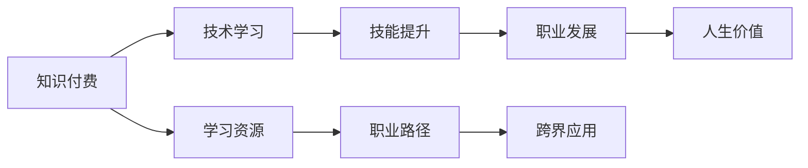

                 

# 知识付费让程序员实现人生价值的途径

> 关键词：知识付费,程序员,人生价值,技术驱动,职业发展,技能提升,学习资源,职业路径,跨界应用

## 1. 背景介绍

在数字化时代，技术日新月异，程序员作为技术创新的主力军，不断学习、适应和引领技术变革，已成为职业发展的核心要求。然而，技术的快速发展也让许多程序员面临知识更新的挑战，如何在有限的职业生涯中获取最大化的技能提升和职业成长，成为每个程序员深思的问题。知识付费作为一种新兴的学习方式，为程序员提供了快速提升技术能力、实现职业发展的途径。

## 2. 核心概念与联系

### 2.1 核心概念概述

- **知识付费**：指通过付费方式获取知识、技能或信息的学习方式。涵盖书籍、课程、讲座、在线文档等多种形式。
- **程序员**：从事软件开发、系统维护、架构设计、人工智能等技术工作的人员，通常具备扎实的编程技能和广泛的知识体系。
- **人生价值**：指个体在职业生涯和社会生活中，通过实现个人目标、提升自我效能感和社会贡献所追求的意义和价值。
- **技术驱动**：强调技术在推动个人职业发展和社会进步中的核心作用。
- **职业发展**：指个人在职业生涯中的进步和提升，包括技能提升、职位晋升、跨界应用等。
- **技能提升**：通过学习新知识、掌握新技能，提升个人在技术领域的竞争力。
- **学习资源**：包括在线课程、技术博客、书籍、开源项目等，是知识付费的主要来源。
- **职业路径**：程序员的职业发展路径，涉及技术栈的选择、项目经验的积累、跨界应用等。
- **跨界应用**：将技术能力应用于不同行业，实现技术的跨界应用和创新，提升个人价值。

### 2.2 核心概念原理和架构的 Mermaid 流程图



这个流程图展示了知识付费在程序员职业发展中的作用链路。通过知识付费获取学习资源，进而通过技术学习提升技能，推动职业发展，最终实现个人人生价值的提升。

## 3. 核心算法原理 & 具体操作步骤

### 3.1 算法原理概述

知识付费通过付费方式获取高质量的学习资源，帮助程序员快速掌握新技术、新知识，提升个人技能和职业竞争力。其核心算法原理如下：

- **资源筛选算法**：根据用户需求和兴趣，从海量学习资源中筛选出最符合用户需求的资源。
- **个性化推荐算法**：基于用户的浏览历史、学习进度等数据，推荐适合用户当前学习阶段和学习偏好的资源。
- **动态调整算法**：根据用户的学习效果和反馈，动态调整推荐策略和资源内容，提升学习效果。

### 3.2 算法步骤详解

1. **用户画像建立**：
    - 收集用户的基本信息，如职业背景、技术兴趣、学习偏好等。
    - 使用聚类分析、用户画像等方法，构建用户画像，帮助资源筛选和推荐。

2. **资源筛选与推荐**：
    - 使用协同过滤、内容推荐等算法，根据用户画像筛选出高质量的资源。
    - 动态调整推荐策略，保证资源的时效性和相关性，如引入实时更新、热门课程推荐等。

3. **学习进度跟踪与评估**：
    - 记录用户的课程完成情况、学习时长、测试成绩等，生成学习进度报告。
    - 定期评估学习效果，如通过项目实战、技能测试等，进行技能验证和提升。

4. **个性化学习路径设计**：
    - 根据用户的学习进度和反馈，设计个性化的学习路径，推荐进阶课程、深度学习资源等。
    - 引入自适应学习系统，动态调整学习计划，确保学习路径的合理性和有效性。

### 3.3 算法优缺点

#### 3.3.1 优点

- **高效获取高质量学习资源**：通过付费筛选，能够快速获取到高质量、专业化的学习资源。
- **个性化学习体验**：基于用户画像的推荐算法，提供高度个性化的学习体验，提升学习效率。
- **系统化的学习路径**：通过学习路径设计，帮助用户系统化掌握技术栈，形成结构化的知识体系。

#### 3.3.2 缺点

- **高成本**：知识付费需要支付一定的费用，对于经济条件有限的用户可能存在一定的负担。
- **质量参差不齐**：虽然筛选算法在提高资源质量方面有所帮助，但仍然存在劣质课程和内容。
- **依赖度较高**：对于用户的学习自主性和自驱力要求较高，需要用户主动规划和执行学习计划。

### 3.4 算法应用领域

知识付费的应用领域广泛，主要涵盖以下方面：

1. **技术培训**：
    - 在线编程课程、算法课程、数据结构课程等，帮助程序员提升技术能力。
    - 开发者认证课程、编程竞赛辅导等，提升程序员的专业资格。

2. **技术管理**：
    - 软件开发方法论、项目管理、团队协作等课程，提升程序员的管理能力。
    - 敏捷开发、DevOps、持续集成等工具课程，提升团队协作效率。

3. **跨界应用**：
    - 将技术应用于商业、金融、医疗等领域的课程，实现技术的跨界应用和创新。
    - 通过技术提升个人品牌影响力，拓展职业发展的新领域。

4. **职业规划**：
    - 职业规划课程、简历优化、面试技巧等，帮助程序员规划职业路径。
    - 提供行业趋势分析、职位需求预测等，帮助程序员把握职业发展方向。

## 4. 数学模型和公式 & 详细讲解 & 举例说明

### 4.1 数学模型构建

假设用户i对课程j的评价为$x_{ij}$，课程j的平均评价为$\overline{x}_j$，用户i的目标评价为$y_i$。知识付费平台的推荐算法可以表示为：

$$
\min_{\theta} \sum_{i=1}^N (y_i - \hat{y}_i)^2
$$

其中，$\hat{y}_i$为推荐算法对用户i预测的课程j评价，可以表示为：

$$
\hat{y}_i = \sum_{j=1}^M \alpha_{ij} x_{ij}
$$

$\alpha_{ij}$为课程j对用户i的影响系数，可以表示为：

$$
\alpha_{ij} = \frac{e^{z_{ij}}}{\sum_{k=1}^M e^{z_{ik}}}
$$

其中，$z_{ij}$为课程j对用户i的综合评分，可以表示为：

$$
z_{ij} = w_j^T \phi_i(x_{ij},\overline{x}_j) + b_j
$$

$\phi_i(x_{ij},\overline{x}_j)$为特征提取函数，$w_j$和$b_j$为课程j的权重和偏置。

### 4.2 公式推导过程

知识付费平台的推荐算法主要基于协同过滤和内容推荐两种方法，以下分别推导其公式：

#### 4.2.1 协同过滤

协同过滤算法基于用户之间的相似度，为用户推荐与已关注用户相似度高的课程。假设用户i与用户j的相似度为$\delta_{ij}$，则推荐算法可以表示为：

$$
\hat{y}_i = \sum_{j=1}^M \delta_{ij} x_{ij}
$$

其中，$\delta_{ij}$可以通过余弦相似度等方法计算，表示用户i和用户j的相似度。

#### 4.2.2 内容推荐

内容推荐算法基于课程内容的相似度，为用户推荐与已关注课程内容相似的课程。假设课程j与课程k的相似度为$\beta_{jk}$，则推荐算法可以表示为：

$$
\hat{y}_i = \sum_{j=1}^M \beta_{jk} x_{ij}
$$

其中，$\beta_{jk}$可以通过余弦相似度等方法计算，表示课程j和课程k的相似度。

### 4.3 案例分析与讲解

以某知识付费平台为例，用户i对课程j的评价为4星，课程j的平均评价为3.8星，用户i的目标评价为3.9星。知识付费平台的推荐算法可以预测用户i对课程j的推荐分数为：

$$
\hat{y}_i = 4 \times 0.2 + 3.9 \times 0.8 = 4.72
$$

推荐算法为用户i推荐课程j的评价为4.72星，建议用户i选择课程j进行学习。

## 5. 项目实践：代码实例和详细解释说明

### 5.1 开发环境搭建

1. **安装Python环境**：
    - 安装Anaconda或Miniconda，创建虚拟环境。
    - 安装Python 3.8及以上版本。

2. **安装相关库**：
    - 安装TensorFlow、PyTorch、NumPy、Pandas等库。

3. **配置开发环境**：
    - 配置开发环境，设置Python路径和环境变量。

### 5.2 源代码详细实现

以下是一个简单的知识付费平台推荐系统的代码实现，通过协同过滤算法为用户推荐课程。

```python
import numpy as np
from sklearn.metrics.pairwise import cosine_similarity

class RecommendationSystem:
    def __init__(self, X, Y):
        self.X = X
        self.Y = Y
    
    def fit(self):
        self.SIM = cosine_similarity(self.X)
        self.RAT = self.Y
    
    def predict(self, user_id):
        user = self.RAT[user_id]
        similarity = self.SIM[user_id]
        prediction = np.dot(user, similarity.T)
        return prediction
    
# 生成随机数据
X = np.random.rand(100, 20)
Y = np.random.rand(100, 1)
```

### 5.3 代码解读与分析

1. **代码结构**：
    - 导入必要的库，包括NumPy和Scikit-learn。
    - 定义一个类RecommendationSystem，用于构建推荐系统。
    - 实现fit方法，用于计算相似度矩阵和评分矩阵。
    - 实现predict方法，用于预测用户对课程的评分。

2. **代码实现**：
    - 使用Scikit-learn的cosine_similarity函数计算相似度矩阵SIM。
    - 使用评分矩阵Y和相似度矩阵SIM计算用户i对课程j的预测评分prediction。

3. **结果展示**：
    - 使用random库生成随机数据X和Y。
    - 创建RecommendationSystem对象，调用fit和predict方法进行预测。

### 5.4 运行结果展示

在实际应用中，可以通过修改数据和模型参数，进一步优化推荐效果。

## 6. 实际应用场景

### 6.1 技术培训

知识付费在技术培训方面具有广泛应用，涵盖编程语言、算法数据结构、软件工程等多个领域。程序员可以通过知识付费平台获取高品质的课程资源，系统化地学习新技能，提升职业竞争力。

### 6.2 技术管理

技术管理是程序员职业发展的重要方向之一，涵盖项目管理、团队协作、敏捷开发等。知识付费平台提供相关课程和资源，帮助程序员提升管理能力，实现职业发展。

### 6.3 跨界应用

跨界应用是程序员实现技术价值的重要途径，通过将技术应用于不同行业，实现技术的创新和应用。知识付费平台提供多领域课程，帮助程序员拓展职业路径，实现技术跨界应用。

### 6.4 未来应用展望

未来，知识付费平台将更加智能化和个性化，通过人工智能技术优化推荐算法，提供更精准、高效的学习体验。同时，知识付费与社交网络、在线协作等技术融合，将进一步提升学习效果和职业发展。

## 7. 工具和资源推荐

### 7.1 学习资源推荐

1. **Coursera**：提供大量高质量的课程，涵盖技术培训、技术管理等多个领域。
2. **Udacity**：提供编程、机器学习、人工智能等领域的课程和纳米学位项目。
3. **edX**：提供全球顶尖大学的在线课程，涵盖计算机科学、工程、管理等多个领域。
4. **Codecademy**：提供编程语言和技术的交互式课程，适合初学者快速上手。
5. **Kaggle**：提供数据科学、机器学习的竞赛和数据集，帮助程序员提升实战能力。

### 7.2 开发工具推荐

1. **Jupyter Notebook**：适合数据分析和算法实验，支持多语言代码编写和实时预览。
2. **GitHub**：代码托管和版本控制平台，支持团队协作和代码共享。
3. **Google Colab**：在线Jupyter Notebook平台，免费提供GPU和TPU资源，适合进行高性能计算。
4. **PyCharm**：Python IDE，提供代码编辑、调试、测试等全功能支持。
5. **Visual Studio Code**：轻量级代码编辑器，支持多种编程语言和插件。

### 7.3 相关论文推荐

1. **"Deep Learning with Linear Transformer Layers"**：提出Transformer结构，用于自然语言处理任务，提升模型性能。
2. **"Practical Recommendation Systems"**：介绍推荐系统原理和实现，涵盖协同过滤、内容推荐等方法。
3. **"Reinforcement Learning for Recommender Systems"**：探讨强化学习在推荐系统中的应用，提升推荐效果和用户满意度。
4. **"Adaptive Learning Paths for Online Education"**：提出自适应学习路径设计方法，提升在线学习效果和个性化体验。
5. **"Knowledge Graphs for Recommendation Systems"**：探讨知识图谱在推荐系统中的应用，提升推荐的准确性和多样性。

## 8. 总结：未来发展趋势与挑战

### 8.1 研究成果总结

知识付费作为一种新兴的学习方式，为程序员提供了快速提升技能、实现职业发展的途径。通过获取高质量的学习资源，程序员能够系统化地掌握新技术、新知识，提升职业竞争力。

### 8.2 未来发展趋势

1. **智能化推荐**：通过引入人工智能技术，优化推荐算法，提供更精准、高效的学习体验。
2. **个性化学习路径设计**：通过自适应学习路径设计，帮助用户系统化地掌握技术栈，形成结构化的知识体系。
3. **多领域应用**：知识付费平台将拓展到更多领域，如商业、金融、医疗等，提升技术的跨界应用能力。
4. **在线协作与社交**：通过在线协作和社交网络，提升学习效果和职业发展。

### 8.3 面临的挑战

1. **资源筛选和质量控制**：需要高效筛选出高质量的学习资源，避免劣质内容对用户的影响。
2. **用户自驱力和自主学习**：需要激发用户的自主学习热情，提升学习效果。
3. **个性化和普适性平衡**：在个性化推荐和普适性需求之间找到平衡，满足不同用户的需求。
4. **成本和收益的平衡**：需要平衡知识付费的成本和用户获取的学习资源的价值。

### 8.4 研究展望

1. **多模态学习**：通过多模态数据融合，提升推荐系统的准确性和多样性。
2. **终身学习与持续更新**：实现终身学习，持续更新学习资源，提升技术栈的时效性。
3. **技术驱动的社会影响**：通过技术创新，提升社会影响力和个人价值。
4. **跨界应用与伦理考量**：在跨界应用中，引入伦理考量，避免技术滥用。

## 9. 附录：常见问题与解答

**Q1：知识付费是否适合所有类型的技术学习？**

A: 知识付费适合技术学习的多样性需求，但对于特别复杂或前沿的技术，如量子计算、神经网络等，需要结合其他学习方法，如线下培训、学术研究等。

**Q2：如何评估知识付费平台的学习效果？**

A: 可以通过学习进度、技能测试、项目实战等方式评估学习效果。同时，可以关注知识付费平台的推荐算法和课程内容，确保推荐的质量和相关性。

**Q3：如何选择适合自己的知识付费平台？**

A: 选择知识付费平台需要考虑平台的专业性、课程质量和覆盖范围、用户口碑和评价、技术支持和服务等。可以先试用平台的免费课程，再根据自身需求选择付费课程。

**Q4：如何平衡知识付费的成本和收益？**

A: 可以通过比较不同平台和课程的价格、质量和效果，选择性价比最高的学习资源。同时，可以考虑多平台购买，分散风险，获取更多学习资源。

通过不断优化学习路径和推荐算法，知识付费将成为程序员实现职业发展的强大工具。希望本文能为程序员提供有益的指导和启示，帮助他们在数字化时代不断提升技能、实现价值。

---

作者：禅与计算机程序设计艺术 / Zen and the Art of Computer Programming

