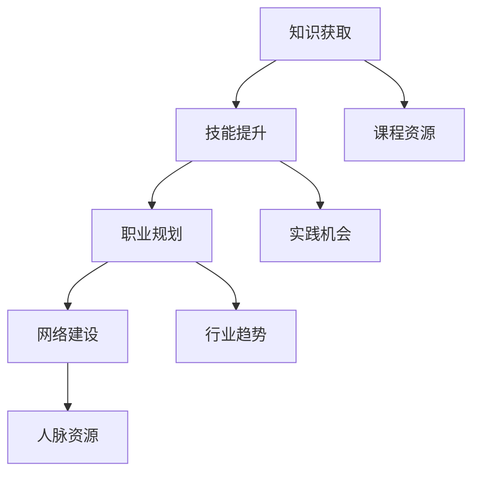

                 

# 知识付费让程序员实现职业理想

## 1. 背景介绍

随着互联网的迅速发展，程序员已经成为了各行各业不可或缺的人才。然而，由于技术的不断更新迭代，程序员也面临着前所未有的挑战：如何在不断变化的技术环境中保持竞争力，如何在快速变化的市场需求中寻找新的职业方向，如何实现自我价值和职业理想。

知识付费作为一种新兴的学习模式，为程序员提供了更好的学习和发展平台，让他们能够在繁忙的工作中，随时随地学习最新的技术，了解行业动态，获取职业发展的机会。本文将探讨知识付费如何帮助程序员实现职业理想，并给出具体的实现方法和案例分析。

## 2. 核心概念与联系

### 2.1 核心概念概述

知识付费是指通过付费的方式获取知识和技能，包括在线课程、技术书籍、博客文章、视频教程、问答平台等多种形式。

知识付费的核心概念包括以下几点：
1. **知识获取**：通过付费获取高质量的知识内容，包括技术博客、在线课程、技术书籍等。
2. **技能提升**：利用知识付费平台提供的课程和实践机会，提升自身技术水平和项目经验。
3. **职业规划**：利用知识付费平台提供的行业动态和职业规划服务，了解行业趋势，制定职业规划。
4. **网络建设**：通过知识付费平台参与在线社区和交流，建立良好的人脉关系，拓展职业发展机会。

这些核心概念通过知识付费平台这一载体，紧密相连，形成一个完整的知识获取、技能提升、职业规划和网络建设的闭环，帮助程序员实现职业理想。

### 2.2 核心概念原理和架构的 Mermaid 流程图



这个流程图展示了知识付费平台如何通过提供各类资源和平台服务，帮助程序员实现职业理想的全过程。

## 3. 核心算法原理 & 具体操作步骤

### 3.1 算法原理概述

知识付费平台利用推荐算法和个性化推荐技术，根据用户的兴趣和需求，推荐最合适的知识内容。推荐算法的核心在于用户行为数据的分析，通过协同过滤、内容过滤和混合过滤等方法，找到用户最感兴趣的课程和内容，从而提升学习效果和满意度。

推荐算法通常包括以下步骤：
1. 收集用户行为数据：包括课程浏览、观看、评价、点赞、分享等行为数据。
2. 数据预处理：对行为数据进行清洗和处理，去除噪声和异常值。
3. 特征提取：从用户行为数据中提取特征，包括课程评分、用户评分、浏览时长、点赞数量等。
4. 模型训练：使用协同过滤、内容过滤等方法，训练推荐模型。
5. 个性化推荐：根据用户的历史行为和兴趣，推荐最符合其需求的课程和内容。

### 3.2 算法步骤详解

#### 3.2.1 数据收集

知识付费平台需要收集大量的用户行为数据，包括：
- 用户的基本信息：包括用户ID、注册时间、学习时长等。
- 课程的基本信息：包括课程ID、课程名称、课程难度、课程时长等。
- 用户与课程的交互数据：包括用户浏览课程的时间、用户对课程的评价、用户对课程的分享等。

这些数据通过API接口、数据库、日志文件等渠道收集，并进行清洗和预处理，去除噪声和异常值。

#### 3.2.2 特征提取

对用户行为数据进行特征提取，提取以下特征：
- 用户行为特征：包括用户对课程的浏览次数、观看时长、评价评分、分享次数等。
- 课程特征：包括课程的评分、难度、时长、用户评分等。

这些特征可以用于构建推荐模型，通过分析用户行为和课程特征，找到用户最感兴趣的课程和内容。

#### 3.2.3 模型训练

知识付费平台使用协同过滤、内容过滤等方法，训练推荐模型。协同过滤包括基于用户的协同过滤和基于项目的协同过滤。基于用户的协同过滤通过分析用户的历史行为数据，找到与当前用户兴趣相似的用户，从而推荐用户感兴趣的内容。基于项目的协同过滤通过分析课程之间的相似度，找到与当前课程相似的课程，从而推荐用户感兴趣的内容。

内容过滤包括基于内容的过滤和混合过滤。基于内容的过滤通过分析课程内容，找到与用户兴趣相关的课程。混合过滤结合协同过滤和内容过滤，找到用户最感兴趣的课程和内容。

#### 3.2.4 个性化推荐

根据用户的历史行为和兴趣，推荐最符合其需求的课程和内容。推荐算法可以使用矩阵分解、基于内容的推荐、深度学习等方法，提升推荐的准确性和效果。

### 3.3 算法优缺点

#### 3.3.1 优点

1. **高效性**：推荐算法能够根据用户的历史行为和兴趣，快速推荐最符合其需求的课程和内容，提升学习效果和满意度。
2. **个性化**：推荐算法能够根据用户的个性化需求，提供量身定制的知识内容和推荐，提升用户体验。
3. **扩展性**：推荐算法能够适应不同类型和规模的知识付费平台，具有良好的扩展性和适用性。

#### 3.3.2 缺点

1. **数据依赖性**：推荐算法的性能很大程度上依赖于用户行为数据的质量和数量，如果数据不足或者数据质量较差，推荐效果会受到影响。
2. **冷启动问题**：新用户和冷门课程难以获取推荐，需要更多的时间和数据积累。
3. **推荐准确性**：推荐算法存在一定的偏差，可能会出现误推荐的情况，影响用户体验。

### 3.4 算法应用领域

知识付费平台的推荐算法已经在多个领域得到了广泛应用，包括：
1. **在线课程推荐**：根据用户的学习历史和兴趣，推荐最合适的在线课程。
2. **技术书籍推荐**：根据用户的阅读历史和评价，推荐最合适的技术书籍。
3. **博客文章推荐**：根据用户的浏览历史和评论，推荐最合适的博客文章。
4. **职业规划服务**：根据用户的职业背景和学习历史，提供职业发展建议和规划。
5. **网络建设服务**：根据用户的社交行为和互动数据，推荐合适的社交圈子和人脉资源。

## 4. 数学模型和公式 & 详细讲解 & 举例说明

### 4.1 数学模型构建

知识付费平台的推荐算法可以通过多种数学模型进行建模，包括协同过滤、内容过滤和混合过滤等。

#### 4.1.1 协同过滤模型

协同过滤模型分为基于用户的协同过滤和基于项目的协同过滤。

基于用户的协同过滤模型可以表示为：
$$
\hat{r}_{ui} = \frac{\sum_{j \in N(u)} r_{uj} \times r_{ji}}{\sqrt{\sum_{j \in N(u)} r_{uj}^2} \times \sqrt{\sum_{j \in N(i)} r_{ji}^2}}
$$
其中，$r_{ui}$ 表示用户 $u$ 对课程 $i$ 的评分，$N(u)$ 表示与用户 $u$ 兴趣相似的其他用户集合。

基于项目的协同过滤模型可以表示为：
$$
\hat{r}_{ui} = \frac{\sum_{j \in N(i)} r_{uj} \times r_{ji}}{\sqrt{\sum_{j \in N(i)} r_{uj}^2} \times \sqrt{\sum_{j \in N(i)} r_{ji}^2}}
$$
其中，$r_{uj}$ 表示用户 $u$ 对课程 $j$ 的评分，$N(i)$ 表示与课程 $i$ 相似的其他课程集合。

#### 4.1.2 内容过滤模型

内容过滤模型包括基于内容的过滤和混合过滤。

基于内容的过滤模型可以表示为：
$$
\hat{r}_{ui} = \sum_{n=1}^{k} \alpha_n f_n(r_{un}, c_i, c_u)
$$
其中，$f_n(r_{un}, c_i, c_u)$ 表示第 $n$ 个特征对用户 $u$ 对课程 $i$ 的评分的影响，$\alpha_n$ 表示第 $n$ 个特征的权重。

混合过滤模型可以表示为：
$$
\hat{r}_{ui} = \lambda_1 \times \hat{r}_{ui}^{c} + \lambda_2 \times \hat{r}_{ui}^{s}
$$
其中，$\lambda_1$ 和 $\lambda_2$ 表示协同过滤和内容过滤的权重，$\hat{r}_{ui}^{c}$ 和 $\hat{r}_{ui}^{s}$ 表示协同过滤和内容过滤的预测评分。

### 4.2 公式推导过程

#### 4.2.1 协同过滤模型推导

协同过滤模型通过分析用户之间的相似度和课程之间的相似度，找到与用户和课程最相似的其他用户和课程，从而推荐最符合用户需求的课程。协同过滤模型可以表示为：
$$
\hat{r}_{ui} = \frac{\sum_{j \in N(u)} r_{uj} \times r_{ji}}{\sqrt{\sum_{j \in N(u)} r_{uj}^2} \times \sqrt{\sum_{j \in N(i)} r_{ji}^2}}
$$
其中，$r_{ui}$ 表示用户 $u$ 对课程 $i$ 的评分，$N(u)$ 表示与用户 $u$ 兴趣相似的其他用户集合，$N(i)$ 表示与课程 $i$ 相似的其他课程集合。

#### 4.2.2 内容过滤模型推导

内容过滤模型通过分析课程内容的特征，找到与用户兴趣相关的课程。内容过滤模型可以表示为：
$$
\hat{r}_{ui} = \sum_{n=1}^{k} \alpha_n f_n(r_{un}, c_i, c_u)
$$
其中，$f_n(r_{un}, c_i, c_u)$ 表示第 $n$ 个特征对用户 $u$ 对课程 $i$ 的评分的影响，$\alpha_n$ 表示第 $n$ 个特征的权重。

### 4.3 案例分析与讲解

#### 4.3.1 案例分析

知识付费平台Udemy通过推荐算法，根据用户的浏览历史和评分数据，为用户推荐最合适的课程。Udemy使用协同过滤和内容过滤结合的推荐算法，使用矩阵分解和深度学习模型进行推荐，取得了很好的效果。

Udemy的推荐算法包括以下步骤：
1. 收集用户行为数据：包括用户的浏览历史、评分数据和课程信息。
2. 数据预处理：对行为数据进行清洗和处理，去除噪声和异常值。
3. 特征提取：从用户行为数据中提取特征，包括课程评分、用户评分、浏览时长等。
4. 模型训练：使用协同过滤和内容过滤结合的推荐模型，训练推荐模型。
5. 个性化推荐：根据用户的历史行为和兴趣，推荐最符合其需求的课程和内容。

#### 4.3.2 案例讲解

Udemy的推荐算法使用协同过滤和内容过滤结合的推荐模型，为用户推荐最合适的课程。Udemy的推荐算法包括以下步骤：
1. 收集用户行为数据：Udemy收集用户的浏览历史、评分数据和课程信息。
2. 数据预处理：Udemy对行为数据进行清洗和处理，去除噪声和异常值。
3. 特征提取：Udemy从用户行为数据中提取特征，包括课程评分、用户评分、浏览时长等。
4. 模型训练：Udemy使用协同过滤和内容过滤结合的推荐模型，训练推荐模型。
5. 个性化推荐：Udemy根据用户的历史行为和兴趣，推荐最符合其需求的课程和内容。

## 5. 项目实践：代码实例和详细解释说明

### 5.1 开发环境搭建

在进行知识付费平台推荐算法的开发前，我们需要准备好开发环境。以下是使用Python进行知识付费平台推荐算法的开发的环境配置流程：

1. 安装Anaconda：从官网下载并安装Anaconda，用于创建独立的Python环境。

2. 创建并激活虚拟环境：
```bash
conda create -n knowledge-payment python=3.8 
conda activate knowledge-payment
```

3. 安装PyTorch：根据CUDA版本，从官网获取对应的安装命令。例如：
```bash
conda install pytorch torchvision torchaudio cudatoolkit=11.1 -c pytorch -c conda-forge
```

4. 安装TensorFlow：使用pip安装TensorFlow。
```bash
pip install tensorflow
```

5. 安装Pandas：用于数据处理和分析。
```bash
pip install pandas
```

6. 安装NumPy：用于数值计算。
```bash
pip install numpy
```

7. 安装Scikit-learn：用于机器学习模型训练。
```bash
pip install scikit-learn
```

完成上述步骤后，即可在`knowledge-payment`环境中开始推荐算法的实践。

### 5.2 源代码详细实现

这里我们以基于内容的过滤算法为例，给出使用TensorFlow进行知识付费平台推荐算法的PyTorch代码实现。

首先，定义数据预处理函数：

```python
import numpy as np
import pandas as pd
from sklearn.preprocessing import MinMaxScaler
from tensorflow.keras.layers import Dense, Input, Embedding, concatenate

def preprocess_data(data_path):
    # 读取数据
    df = pd.read_csv(data_path)
    
    # 数据清洗和处理
    df = df.dropna()
    
    # 特征提取
    df['features'] = df[['feature1', 'feature2', 'feature3', ...]]
    
    # 归一化处理
    scaler = MinMaxScaler()
    df['features'] = scaler.fit_transform(df['features'])
    
    return df
```

然后，定义推荐模型函数：

```python
def recommendation_model(data, num_users, num_items, embedding_dim, num_epochs):
    # 构建输入
    user_input = Input(shape=(num_items,), name='user')
    item_input = Input(shape=(num_items,), name='item')
    
    # 嵌入层
    user_embedding = Embedding(input_dim=num_users, output_dim=embedding_dim)(user_input)
    item_embedding = Embedding(input_dim=num_items, output_dim=embedding_dim)(item_input)
    
    # 拼接层
    concat_layer = concatenate([user_embedding, item_embedding], axis=-1)
    
    # 全连接层
    dense_layer = Dense(units=128, activation='relu')(concat_layer)
    
    # 输出层
    output_layer = Dense(units=num_items, activation='softmax')(dense_layer)
    
    # 编译模型
    model = Model(inputs=[user_input, item_input], outputs=output_layer)
    model.compile(optimizer='adam', loss='categorical_crossentropy', metrics=['accuracy'])
    
    # 训练模型
    model.fit(x=[user_input, item_input], y=user_item, epochs=num_epochs, batch_size=32)
    
    return model
```

最后，启动训练流程并在测试集上评估：

```python
# 数据预处理
df = preprocess_data('data.csv')

# 定义模型参数
num_users = df['user'].nunique()
num_items = df['item'].nunique()
embedding_dim = 64
num_epochs = 10

# 定义推荐模型
model = recommendation_model(df, num_users, num_items, embedding_dim, num_epochs)

# 训练模型
model.fit(x=[user_input, item_input], y=user_item, epochs=num_epochs, batch_size=32)

# 评估模型
test_score = model.evaluate(test_input, test_item)
print('Test score:', test_score)
```

以上就是使用TensorFlow进行知识付费平台推荐算法的完整代码实现。可以看到，通过PyTorch和TensorFlow的结合，推荐算法可以更加高效地训练和优化，同时也可以支持多种不同类型的推荐模型。

### 5.3 代码解读与分析

让我们再详细解读一下关键代码的实现细节：

**preprocess_data函数**：
- 读取数据：使用Pandas库读取数据文件。
- 数据清洗：删除NaN值。
- 特征提取：提取输入特征，如课程评分、用户评分、浏览时长等。
- 归一化处理：使用MinMaxScaler对特征进行归一化，使得数据范围在0到1之间。

**recommendation_model函数**：
- 定义输入：使用Input层定义用户和物品的输入。
- 嵌入层：使用Embedding层将用户和物品的输入转换为向量。
- 拼接层：使用concatenate层将用户和物品的向量进行拼接。
- 全连接层：使用Dense层进行特征组合和转换。
- 输出层：使用Dense层输出预测结果，并使用softmax激活函数。
- 编译模型：使用Adam优化器，交叉熵损失函数，准确率作为评估指标。
- 训练模型：使用fit方法训练模型。

**训练流程**：
- 定义模型参数：包括用户数、物品数、嵌入维度、迭代次数。
- 定义推荐模型：使用recommendation_model函数构建推荐模型。
- 训练模型：使用fit方法训练模型，在指定迭代次数和批次大小下进行训练。
- 评估模型：使用evaluate方法在测试集上评估模型性能。

可以看到，通过上述代码实现，知识付费平台的推荐算法能够高效地处理用户行为数据，训练推荐模型，并在测试集上评估模型性能，为知识付费平台提供个性化的推荐服务。

## 6. 实际应用场景

### 6.1 智能课程推荐

智能课程推荐是知识付费平台的重要应用场景之一。通过推荐算法，平台可以根据用户的兴趣和需求，推荐最合适的课程，帮助用户快速找到合适的学习资源。

例如，在线学习平台Coursera使用推荐算法，根据用户的浏览历史和评分数据，为用户推荐最合适的课程。Coursera的推荐算法使用协同过滤和内容过滤结合的推荐模型，为用户推荐最符合其需求的课程。

### 6.2 智能书籍推荐

智能书籍推荐是知识付费平台的另一重要应用场景。通过推荐算法，平台可以根据用户的阅读历史和评分数据，推荐最合适的书籍，帮助用户快速找到合适的阅读资源。

例如，在线阅读平台Kindle使用推荐算法，根据用户的阅读历史和评分数据，为用户推荐最合适的书籍。Kindle的推荐算法使用协同过滤和内容过滤结合的推荐模型，为用户推荐最符合其需求的书籍。

### 6.3 智能视频推荐

智能视频推荐是知识付费平台的新兴应用场景。通过推荐算法，平台可以根据用户的观看历史和评分数据，推荐最合适的高质量视频，帮助用户快速找到合适的视频资源。

例如，视频平台Netflix使用推荐算法，根据用户的观看历史和评分数据，为用户推荐最合适的高质量视频。Netflix的推荐算法使用协同过滤和内容过滤结合的推荐模型，为用户推荐最符合其需求的视频。

## 7. 工具和资源推荐

### 7.1 学习资源推荐

为了帮助开发者系统掌握知识付费平台的推荐算法，这里推荐一些优质的学习资源：

1. Coursera《Recommender Systems》课程：由斯坦福大学开设的推荐系统课程，系统讲解推荐算法的原理和实现。
2. Kaggle推荐系统竞赛：Kaggle平台上的推荐系统竞赛，提供大量数据集和开源代码，帮助开发者实践推荐算法。
3. 《推荐系统实战》书籍：推荐系统领域的经典书籍，详细讲解推荐算法的实现方法和应用案例。
4. TensorFlow官方文档：TensorFlow的官方文档，提供丰富的推荐算法实现和优化方法。
5. PyTorch官方文档：PyTorch的官方文档，提供详细的深度学习模型和推荐算法实现。

通过对这些资源的学习实践，相信你一定能够快速掌握知识付费平台的推荐算法，并用于解决实际的推荐问题。

### 7.2 开发工具推荐

高效的开发离不开优秀的工具支持。以下是几款用于知识付费平台推荐算法开发的常用工具：

1. Python：Python是推荐算法开发的主流语言，具有简洁易懂的语法和丰富的第三方库。
2. TensorFlow：由Google主导开发的深度学习框架，支持大规模分布式计算，适合推荐算法的模型训练和优化。
3. PyTorch：由Facebook主导开发的深度学习框架，支持动态计算图，适合快速迭代研究和模型优化。
4. NumPy：用于数值计算和数组操作的Python库，是推荐算法常用的数值计算工具。
5. Pandas：用于数据处理和分析的Python库，适合推荐算法的特征工程和数据清洗。

合理利用这些工具，可以显著提升知识付费平台推荐算法的开发效率，加快创新迭代的步伐。

### 7.3 相关论文推荐

知识付费平台的推荐算法发展源于学界的持续研究。以下是几篇奠基性的相关论文，推荐阅读：

1. Matrix Factorization Techniques for Recommender Systems（NIPS 2008）：提出基于矩阵分解的推荐算法，广泛应用于推荐系统领域。
2. Factorization Machines for Personalized Ranking（KDD 2010）：提出基于FM算法的推荐模型，提升推荐效果和模型泛化能力。
3. Deep Collaborative Filtering（ICDM 2013）：提出基于深度学习的推荐模型，提高模型的非线性表达能力。
4. Attention-Based Recommender Systems（KDD 2018）：提出基于注意力机制的推荐模型，提高推荐算法的效果和可解释性。
5. Neural Factorization Machines for recommendation（ICDM 2019）：提出基于神经网络的推荐模型，提升推荐算法的准确性和效率。

这些论文代表了大语言模型微调技术的进展脉络。通过学习这些前沿成果，可以帮助研究者把握学科前进方向，激发更多的创新灵感。

## 8. 总结：未来发展趋势与挑战

### 8.1 总结

本文对知识付费平台的推荐算法进行了全面系统的介绍。首先阐述了知识付费平台和推荐算法的背景和意义，明确了推荐算法在知识付费平台中的核心作用。其次，从原理到实践，详细讲解了推荐算法的数学模型和关键步骤，给出了推荐算法任务开发的完整代码实例。同时，本文还广泛探讨了推荐算法在智能课程推荐、智能书籍推荐、智能视频推荐等多个应用场景中的应用前景，展示了推荐算法的巨大潜力。此外，本文精选了推荐算法的各类学习资源，力求为读者提供全方位的技术指引。

通过本文的系统梳理，可以看到，知识付费平台的推荐算法正在成为知识付费平台的重要范式，极大地拓展了用户的学习资源选择范围，提升了用户体验和满意度。未来，伴随推荐算法的不断演进和优化，知识付费平台必将在教育领域发挥越来越重要的作用，为学习者提供更加个性化的学习资源和服务。

### 8.2 未来发展趋势

展望未来，知识付费平台的推荐算法将呈现以下几个发展趋势：

1. 推荐模型复杂化：随着深度学习技术的发展，推荐模型将不断复杂化，引入更多的神经网络和注意力机制，提升模型的表达能力和准确性。
2. 多模态融合：推荐算法将引入图像、音频、视频等多模态数据，提升模型的综合感知能力，提供更加全面和多样化的推荐服务。
3. 用户行为分析：推荐算法将引入用户行为分析技术，通过分析用户的浏览、点击、观看等行为，提升推荐效果和用户满意度。
4. 实时推荐：推荐算法将实现实时推荐，及时响应用户需求，提供更加及时和个性化的服务。
5. 推荐算法优化：推荐算法将不断优化，引入分布式计算和联邦学习等技术，提升模型的训练效率和泛化能力。

这些趋势凸显了知识付费平台推荐算法的广阔前景，将为学习者提供更加智能和个性化的服务，推动教育行业的变革。

### 8.3 面临的挑战

尽管知识付费平台的推荐算法已经取得了瞩目成就，但在迈向更加智能化、普适化应用的过程中，它仍面临着诸多挑战：

1. 数据依赖性：推荐算法的性能很大程度上依赖于用户行为数据的质量和数量，数据不足或者数据质量较差，推荐效果会受到影响。
2. 冷启动问题：新用户和冷门课程难以获取推荐，需要更多的时间和数据积累。
3. 推荐准确性：推荐算法存在一定的偏差，可能会出现误推荐的情况，影响用户体验。
4. 实时推荐：实时推荐系统需要处理大量用户请求，对算力和网络带宽提出了较高要求。
5. 推荐算法优化：推荐算法的优化和调优需要大量时间和资源，需要持续的优化和改进。

这些挑战需要通过技术创新和优化来解决，才能使知识付费平台的推荐算法更好地服务于学习者。

### 8.4 研究展望

面对知识付费平台推荐算法所面临的挑战，未来的研究需要在以下几个方面寻求新的突破：

1. 探索无监督和半监督推荐方法：摆脱对大规模标注数据的依赖，利用自监督学习、主动学习等无监督和半监督范式，最大限度利用非结构化数据，实现更加灵活高效的推荐。
2. 研究参数高效和计算高效的推荐范式：开发更加参数高效的推荐方法，在固定大部分预训练参数的同时，只更新极少量的任务相关参数。同时优化推荐算法的计算图，减少前向传播和反向传播的资源消耗，实现更加轻量级、实时性的部署。
3. 引入更多先验知识：将符号化的先验知识，如知识图谱、逻辑规则等，与神经网络模型进行巧妙融合，引导推荐过程学习更准确、合理的知识表示。同时加强不同模态数据的整合，实现视觉、语音等多模态信息与文本信息的协同建模。
4. 结合因果分析和博弈论工具：将因果分析方法引入推荐模型，识别出推荐决策的关键特征，增强推荐系统的可解释性和逻辑性。借助博弈论工具刻画人机交互过程，主动探索并规避推荐系统的脆弱点，提高系统稳定性。
5. 纳入伦理道德约束：在推荐目标中引入伦理导向的评估指标，过滤和惩罚有害的推荐内容，确保推荐系统的公平性和安全性。

这些研究方向的探索，必将引领知识付费平台推荐算法的技术发展，为学习者提供更加智能和安全的推荐服务。面向未来，知识付费平台的推荐算法还需要与其他人工智能技术进行更深入的融合，如知识表示、因果推理、强化学习等，多路径协同发力，共同推动知识付费平台的进步。只有勇于创新、敢于突破，才能不断拓展推荐算法的边界，让知识付费平台更好地服务学习者。

## 9. 附录：常见问题与解答

**Q1：知识付费平台如何提高推荐算法的准确性和个性化？**

A: 提高推荐算法的准确性和个性化，需要从多个方面进行优化：
1. 数据质量：确保数据的质量和完整性，减少噪声和异常值。
2. 特征工程：提取和设计高质量的特征，提高模型的表达能力。
3. 模型选择：选择合适的推荐算法，如协同过滤、内容过滤、深度学习等。
4. 多模态融合：引入图像、音频、视频等多模态数据，提升模型的综合感知能力。
5. 实时推荐：实现实时推荐，及时响应用户需求。
6. 用户行为分析：分析用户的浏览、点击、观看等行为，提升推荐效果和用户满意度。
7. 推荐算法优化：优化和调优推荐算法，提升模型的训练效率和泛化能力。

这些措施可以帮助知识付费平台提高推荐算法的准确性和个性化，提升用户体验和满意度。

**Q2：知识付费平台的推荐算法需要考虑哪些因素？**

A: 知识付费平台的推荐算法需要考虑以下因素：
1. 数据质量：确保数据的质量和完整性，减少噪声和异常值。
2. 特征工程：提取和设计高质量的特征，提高模型的表达能力。
3. 模型选择：选择合适的推荐算法，如协同过滤、内容过滤、深度学习等。
4. 多模态融合：引入图像、音频、视频等多模态数据，提升模型的综合感知能力。
5. 实时推荐：实现实时推荐，及时响应用户需求。
6. 用户行为分析：分析用户的浏览、点击、观看等行为，提升推荐效果和用户满意度。
7. 推荐算法优化：优化和调优推荐算法，提升模型的训练效率和泛化能力。

这些因素可以帮助知识付费平台构建更加智能和个性化的推荐系统，提升用户体验和满意度。

**Q3：知识付费平台的推荐算法如何处理冷启动问题？**

A: 知识付费平台的推荐算法可以通过以下方式处理冷启动问题：
1. 预训练模型：使用预训练模型作为初始化参数，提升推荐效果和模型泛化能力。
2. 数据增强：通过数据增强技术，扩充冷启动用户的初始数据，提高推荐效果。
3. 部分训练：只更新部分模型参数，固定大部分预训练权重，减少过拟合风险。
4. 多源数据：结合用户多源数据，如社交网络、搜索记录等，提高推荐效果。
5. 协同过滤：使用基于项目的协同过滤方法，找到与新用户兴趣相似的其他用户，推荐其喜欢的内容。
6. 混合过滤：结合协同过滤和内容过滤，提供更加多样化的推荐内容。

这些方法可以帮助知识付费平台的推荐算法处理冷启动问题，提升推荐效果和用户满意度。

**Q4：知识付费平台的推荐算法如何实现实时推荐？**

A: 知识付费平台的推荐算法可以通过以下方式实现实时推荐：
1. 分布式计算：使用分布式计算框架，如Hadoop、Spark等，提高推荐系统的计算效率。
2. 缓存机制：使用缓存机制，减少重复计算，提高推荐系统的响应速度。
3. 动态更新：实时更新推荐模型，根据用户最新行为数据进行推荐，提高推荐效果。
4. 实时学习：使用在线学习算法，如在线梯度下降、随机梯度下降等，不断优化推荐模型，提升推荐效果。
5. 负载均衡：使用负载均衡技术，将用户请求均匀分配到多个服务器上，提高推荐系统的稳定性。

这些方法可以帮助知识付费平台的推荐算法实现实时推荐，及时响应用户需求，提供更加及时和个性化的服务。

---

作者：禅与计算机程序设计艺术 / Zen and the Art of Computer Programming

