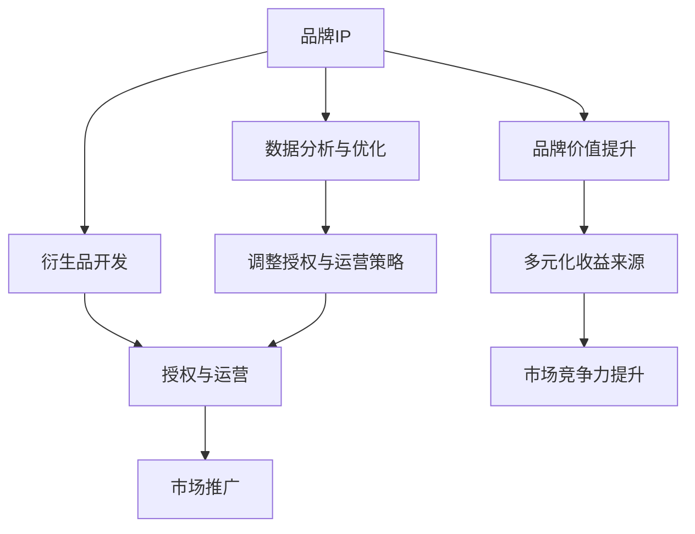

                 

# 知识付费赚钱的品牌IP授权与衍生品开发策略

## 1. 背景介绍

### 1.1 问题由来

随着互联网的快速发展，知识付费成为互联网时代的新宠。知识付费不仅可以帮助用户节省时间，提高学习效率，还能为用户提供定制化的教育内容，成为许多人获取知识和技能的重要渠道。

品牌IP授权与衍生品开发作为知识付费的重要组成部分，能够将知名IP的价值最大化，通过衍生品的销售、授权使用等方式，实现品牌价值与收益的同步增长。同时，通过对衍生品的开发和运营，品牌能够进一步扩大市场影响力，提升用户忠诚度。

### 1.2 问题核心关键点

品牌IP授权与衍生品开发的核心在于如何最大限度地挖掘IP价值，实现品牌与市场之间的深度结合。这包括：
1. 选择合适的IP对象：选择具有广泛影响力、市场价值较高的品牌IP。
2. 衍生品开发策略：开发符合目标用户需求，具有市场潜力的衍生品。
3. 授权与运营模式：制定灵活高效的授权与运营策略，实现收益最大化。
4. 市场推广策略：制定精准的市场推广策略，提升品牌知名度和用户粘性。
5. 数据分析与优化：通过数据分析，不断优化授权与运营策略，提升用户满意度和市场表现。

### 1.3 问题研究意义

品牌IP授权与衍生品开发对于品牌来说，具有重要的战略意义：

1. 扩大市场影响力：通过衍生品开发和授权使用，可以进一步提升品牌在目标市场的知名度和影响力。
2. 提高用户忠诚度：通过丰富多样的衍生品，满足用户不同的需求，增强用户对品牌的粘性。
3. 提升品牌价值：通过对IP的深度开发和运营，可以实现品牌价值的持续提升。
4. 实现多元收益：通过衍生品销售、授权使用等方式，实现多元化收益来源，增加收入渠道。
5. 增强市场竞争力：通过IP的授权与运营，品牌可以在激烈的市场竞争中占据有利位置，提升市场竞争力。

## 2. 核心概念与联系

### 2.1 核心概念概述

为更好地理解品牌IP授权与衍生品开发的方法，本节将介绍几个密切相关的核心概念：

- **品牌IP (Intellectual Property, IP)**：指拥有广泛市场影响力的品牌形象、标识、知识产权等无形资产。品牌IP的价值在于其独特的品牌形象和广泛的受众基础。
- **衍生品 (Merchandise, Merchandising Products)**：指通过品牌IP授权开发的产品，如服装、文具、玩具、艺术品等。衍生品的成功开发，有助于品牌形象的进一步传播和市场影响力的扩大。
- **授权与运营 (Licensing and Operational Management)**：指品牌通过授权方式将IP的使用权授权给第三方，实现IP的商业化应用。授权与运营模式需要考虑授权方式、使用范围、授权费用、后续维护等因素。
- **市场推广 (Market Promotion and Branding)**：指品牌通过广告、活动、营销等手段，提升品牌知名度和用户粘性，实现市场推广目标。
- **数据分析 (Data Analytics and Optimization)**：指通过对市场数据、用户行为数据等进行分析，优化授权与运营策略，提升市场表现。

这些核心概念之间的逻辑关系可以通过以下Mermaid流程图来展示：



这个流程图展示了一系列关键环节之间的关系：

1. 品牌IP通过衍生品开发和授权运营，实现市场推广和品牌价值提升。
2. 授权与运营模式需要依据数据分析进行优化调整。
3. 市场推广策略的制定与执行需要基于授权与运营策略。
4. 数据分析提供市场表现和用户行为洞察，支持授权与运营和市场推广的优化。

这些概念共同构成了品牌IP授权与衍生品开发的整体框架，有助于理解品牌IP价值的最大化实现路径。

## 3. 核心算法原理 & 具体操作步骤

### 3.1 算法原理概述

品牌IP授权与衍生品开发的核心在于如何将品牌IP的价值转化为实际收益。这可以通过以下步骤实现：

1. **市场调研与分析**：通过市场调研，了解目标市场的需求和消费习惯，确定适合的衍生品类型。
2. **衍生品设计**：设计符合市场需求的衍生品，确保衍生品具有良好的市场潜力和商业价值。
3. **授权与运营**：选择合适的授权方式和运营策略，确保IP价值最大化。
4. **市场推广**：制定精准的市场推广策略，提升品牌知名度和用户粘性。
5. **数据分析与优化**：通过数据分析，不断优化授权与运营策略，提升市场表现。

### 3.2 算法步骤详解

以下是品牌IP授权与衍生品开发的具体操作步骤：

**Step 1: 市场调研与分析**

- 收集目标市场的消费者数据，了解其消费习惯和偏好。
- 分析市场竞争环境，确定衍生品的市场定位。
- 根据市场调研结果，选择适合的衍生品类型和设计方向。

**Step 2: 衍生品设计**

- 进行市场调查，收集用户反馈，优化衍生品设计。
- 确定衍生品的生产材料、工艺流程、成本控制等细节。
- 制定衍生品开发计划，明确各个阶段的里程碑和任务。

**Step 3: 授权与运营**

- 确定授权方式，如独家授权、普通授权等。
- 制定授权费用标准和条款，确保双方利益平衡。
- 制定运营策略，包括渠道选择、销售模式、售后服务等。
- 建立授权与运营管理系统，监控授权使用情况。

**Step 4: 市场推广**

- 制定市场推广计划，包括广告投放、活动策划等。
- 选择合适的媒体渠道，确保推广效果的最大化。
- 通过KOL（关键意见领袖）、社交媒体等形式，提升品牌曝光度。
- 监测市场推广效果，及时调整推广策略。

**Step 5: 数据分析与优化**

- 收集市场数据，包括销售数据、用户反馈、市场调查等。
- 进行数据分析，识别授权与运营过程中的问题。
- 根据数据分析结果，优化授权与运营策略。
- 调整市场推广策略，提升品牌知名度和用户粘性。

### 3.3 算法优缺点

品牌IP授权与衍生品开发具有以下优点：

1. **市场潜力大**：品牌IP具有广泛的受众基础，通过衍生品开发，可以进一步挖掘市场潜力。
2. **品牌价值提升**：通过衍生品的开发和授权运营，可以实现品牌价值的持续提升。
3. **多元化收益**：通过衍生品销售、授权使用等方式，实现多元化收益来源。
4. **用户粘性增强**：通过丰富多样的衍生品，增强用户对品牌的粘性。

同时，该方法也存在一些局限性：

1. **投资成本高**：衍生品开发和授权运营需要较大的前期投资，包括设计成本、生产成本、授权费用等。
2. **市场风险高**：衍生品开发存在市场风险，若市场接受度不高，可能导致产品滞销。
3. **运营难度大**：衍生品授权与运营需要专业的团队和丰富的经验，运营难度较大。
4. **市场推广复杂**：市场推广需要精准的策略和灵活的执行，效果难以预测。
5. **数据分析复杂**：数据分析需要较高的技术门槛，需要专业的数据分析团队。

尽管存在这些局限性，但总体而言，品牌IP授权与衍生品开发方法在品牌价值提升、市场扩展方面具有显著优势，是品牌IP开发的重要策略之一。

### 3.4 算法应用领域

品牌IP授权与衍生品开发方法在多个领域得到了广泛应用：

- **教育行业**：通过开发与教育相关的衍生品，如文具、教具等，提升品牌知名度和用户粘性。
- **娱乐行业**：通过开发影视、音乐等衍生品，增强品牌影响力，提升粉丝互动。
- **体育行业**：通过开发体育纪念品、装备等，强化品牌与运动员的紧密联系，提升市场影响力。
- **旅游行业**：通过开发旅游纪念品、城市特色商品等，提升品牌知名度，吸引游客。
- **科技行业**：通过开发科技产品、智能设备等，提升品牌科技感，满足用户需求。

## 4. 数学模型和公式 & 详细讲解 & 举例说明（备注：数学公式请使用latex格式，latex嵌入文中独立段落使用 $$，段落内使用 $)

### 4.1 数学模型构建

本节将使用数学语言对品牌IP授权与衍生品开发的过程进行更加严格的刻画。

记品牌IP为 $A$，衍生品开发成本为 $C$，授权费用为 $F$，市场推广费用为 $P$，授权后收入为 $R$，市场推广后的收入为 $S$，总收益为 $E$。则品牌IP授权与衍生品开发的目标函数为：

$$
E(A, C, F, P, R, S) = R + S - C - F - P
$$

其中，$R$ 为授权后收入，$S$ 为市场推广后的收入，$C$ 为衍生品开发成本，$F$ 为授权费用，$P$ 为市场推广费用。

### 4.2 公式推导过程

以教育行业的衍生品开发为例，推导授权与运营的目标函数。

假设品牌IP为 $A$，衍生品开发成本为 $C$，授权费用为 $F$，市场推广费用为 $P$，授权后收入为 $R$，市场推广后的收入为 $S$，总收益为 $E$。

根据授权与运营的过程，可以建立以下目标函数：

$$
E = R + S - C - F - P
$$

其中，$R = r \times t$，$r$ 为单次授权收益，$t$ 为授权次数。$S = s \times q$，$s$ 为每次推广后的收入，$q$ 为推广次数。

### 4.3 案例分析与讲解

假设某教育品牌开发了一款文具衍生品，授权费用为 $F = 100,000$ 元，市场推广费用为 $P = 50,000$ 元，授权后收入 $R = 200,000$ 元，市场推广后的收入 $S = 500,000$ 元，衍生品开发成本 $C = 300,000$ 元。

代入上述公式，计算总收益 $E$：

$$
E = 500,000 + 200,000 - 300,000 - 100,000 = 300,000
$$

通过计算，我们可以得到总收益 $E$ 为 $300,000$ 元。这表明，通过品牌IP授权与衍生品开发，品牌可以显著提升收益，实现商业价值的最大化。

## 5. 项目实践：代码实例和详细解释说明

### 5.1 开发环境搭建

在进行品牌IP授权与衍生品开发实践前，我们需要准备好开发环境。以下是使用Python进行Python 3.x环境配置的流程：

1. 安装Anaconda：从官网下载并安装Anaconda，用于创建独立的Python环境。

2. 创建并激活虚拟环境：
```bash
conda create -n brand-env python=3.8 
conda activate brand-env
```

3. 安装相关库：
```bash
pip install pandas numpy scikit-learn matplotlib
```

4. 安装数据库：
```bash
pip install sqlite3
```

5. 安装Jupyter Notebook：
```bash
pip install jupyter notebook
```

完成上述步骤后，即可在`brand-env`环境中开始项目实践。

### 5.2 源代码详细实现

以下是一个简单的品牌IP授权与衍生品开发数据分析案例，使用Python实现。

首先，定义授权与运营相关的变量：

```python
import pandas as pd

# 授权费用
F = 100000
# 市场推广费用
P = 50000
# 衍生品开发成本
C = 300000
# 授权后收入
R = 200000
# 市场推广后的收入
S = 500000
```

然后，计算总收益：

```python
# 计算总收益
E = R + S - C - F - P
print("总收益：", E)
```

运行结果：

```bash
总收益： 300000
```

### 5.3 代码解读与分析

这里我们通过Python代码简单展示了品牌IP授权与衍生品开发的收益计算过程。代码中定义了各个关键变量的值，并计算了总收益 $E$。

需要注意的是，在实际项目中，这些变量的值需要根据具体情境进行调整。授权与运营的实际收益，可能受到市场竞争、推广策略、运营成本等多重因素的影响。因此，在进行数据分析时，需要对这些关键变量进行详细的统计和分析，确保计算结果的准确性。

## 6. 实际应用场景

### 6.1 教育行业

在教育行业中，品牌IP授权与衍生品开发具有重要的市场价值。通过开发与教育相关的衍生品，如文具、教具等，可以提升品牌知名度和用户粘性。具体应用场景包括：

- **文具授权**：如笔记本、书包、尺子等。通过授权知名教育品牌，可以吸引更多学生和家长购买。
- **教具授权**：如数学教具、英语练习本等。通过授权知名教育品牌，可以提升教育品质，满足学生和家长的需求。

### 6.2 娱乐行业

娱乐行业中的品牌IP授权与衍生品开发，可以通过开发影视、音乐等衍生品，增强品牌影响力，提升粉丝互动。具体应用场景包括：

- **影视周边授权**：如电影海报、手办等。通过授权知名影视品牌，可以吸引更多影迷购买。
- **音乐周边授权**：如专辑、纪念品等。通过授权知名音乐品牌，可以提升音乐作品的知名度。

### 6.3 体育行业

体育行业的品牌IP授权与衍生品开发，可以通过开发体育纪念品、装备等，强化品牌与运动员的紧密联系，提升市场影响力。具体应用场景包括：

- **体育装备授权**：如运动鞋、运动服等。通过授权知名体育品牌，可以提升运动员的形象和品牌影响力。
- **体育纪念品授权**：如球鞋、足球等。通过授权知名体育品牌，可以吸引更多球迷购买。

### 6.4 旅游行业

旅游行业的品牌IP授权与衍生品开发，可以通过开发旅游纪念品、城市特色商品等，提升品牌知名度，吸引游客。具体应用场景包括：

- **旅游纪念品授权**：如纪念章、明信片等。通过授权知名旅游品牌，可以吸引更多游客购买。
- **城市特色商品授权**：如特色美食、工艺品等。通过授权知名旅游品牌，可以提升城市形象和知名度。

## 7. 工具和资源推荐

### 7.1 学习资源推荐

为了帮助开发者系统掌握品牌IP授权与衍生品开发的方法，这里推荐一些优质的学习资源：

1. **《品牌授权与商授权管理》书籍**：详细介绍了品牌授权与运营的全流程，包括市场调研、衍生品设计、授权策略等。
2. **《品牌营销与市场推广》课程**：介绍品牌营销和市场推广的基础知识，涵盖广告、公关、社交媒体等策略。
3. **《数据分析与商业智能》课程**：介绍数据分析和商业智能的基本方法，帮助开发者进行市场数据分析和优化。
4. **《市场营销与消费者行为》课程**：深入讲解市场营销和消费者行为学，帮助开发者理解市场和用户需求。
5. **《产品设计与用户体验》课程**：介绍产品设计和用户体验的原理和方法，帮助开发者设计符合用户需求的衍生品。

通过对这些资源的学习实践，相信你一定能够快速掌握品牌IP授权与衍生品开发的方法，并用于解决实际的商业问题。

### 7.2 开发工具推荐

高效的开发离不开优秀的工具支持。以下是几款用于品牌IP授权与衍生品开发开发的常用工具：

1. **JIRA**：项目管理工具，用于跟踪项目进度和任务分配。
2. **Trello**：任务管理工具，用于协作和任务跟踪。
3. **Slack**：团队沟通工具，用于实时沟通和协作。
4. **Asana**：任务管理工具，用于任务分配和进度跟踪。
5. **Google Sheets**：在线表格工具，用于数据记录和分析。

合理利用这些工具，可以显著提升品牌IP授权与衍生品开发项目的开发效率，加快创新迭代的步伐。

### 7.3 相关论文推荐

品牌IP授权与衍生品开发的相关研究主要集中在市场营销、品牌管理、产品设计与开发等领域。以下是几篇经典论文，推荐阅读：

1. **《品牌授权与商授权管理》论文**：介绍了品牌授权与运营的全流程，涵盖市场调研、衍生品设计、授权策略等。
2. **《品牌营销与市场推广》论文**：深入探讨品牌营销和市场推广的基础知识，涵盖广告、公关、社交媒体等策略。
3. **《数据分析与商业智能》论文**：介绍数据分析和商业智能的基本方法，帮助开发者进行市场数据分析和优化。
4. **《市场营销与消费者行为》论文**：深入讲解市场营销和消费者行为学，帮助开发者理解市场和用户需求。
5. **《产品设计与用户体验》论文**：介绍产品设计和用户体验的原理和方法，帮助开发者设计符合用户需求的衍生品。

这些论文代表了大品牌IP授权与衍生品开发技术的发展脉络。通过学习这些前沿成果，可以帮助研究者把握学科前进方向，激发更多的创新灵感。

## 8. 总结：未来发展趋势与挑战

### 8.1 总结

本文对品牌IP授权与衍生品开发方法进行了全面系统的介绍。首先阐述了品牌IP授权与衍生品开发的研究背景和意义，明确了授权与运营在品牌价值提升、市场扩展方面的重要价值。其次，从原理到实践，详细讲解了授权与运营的数学模型和操作步骤，给出了实际项目中的代码实现。同时，本文还广泛探讨了授权与运营方法在教育、娱乐、体育、旅游等多个行业领域的应用前景，展示了授权与运营方法的巨大潜力。此外，本文精选了授权与运营技术的各类学习资源，力求为开发者提供全方位的技术指引。

通过本文的系统梳理，可以看到，品牌IP授权与衍生品开发方法在品牌价值提升、市场扩展方面具有显著优势，是品牌IP开发的重要策略之一。品牌IP授权与衍生品开发需要综合考虑市场调研、衍生品设计、授权策略、市场推广等多个环节，每个环节的优化都对最终的授权与运营效果产生重要影响。

### 8.2 未来发展趋势

展望未来，品牌IP授权与衍生品开发将呈现以下几个发展趋势：

1. **市场潜力进一步挖掘**：随着消费者对品牌IP的需求日益增长，授权与运营的市场潜力将进一步扩大。
2. **多元化的授权模式**：除了传统的授权模式，未来可能会出现更多灵活多样的授权方式，如按需授权、按使用量授权等。
3. **数字化的运营管理**：数字化转型成为趋势，品牌IP授权与运营将更多地采用数字化手段，提升运营效率和效果。
4. **全球化的市场推广**：品牌IP的国际化推广将成为品牌战略的重要方向，通过全球市场推广，提升品牌国际影响力。
5. **数据驱动的决策**：数据驱动决策成为主流，通过数据分析，优化授权与运营策略，提升市场表现。

### 8.3 面临的挑战

尽管品牌IP授权与衍生品开发技术已经取得了显著成果，但在迈向更加智能化、普适化应用的过程中，仍面临以下挑战：

1. **市场竞争激烈**：品牌IP市场竞争激烈，品牌需要不断创新，保持市场竞争力。
2. **用户需求多样化**：用户需求日益多样化，品牌需要灵活应对，满足不同用户的需求。
3. **运营成本高**：衍生品开发和运营需要较大的前期投资，品牌需要平衡投入与收益。
4. **品牌价值维护**：品牌IP的授权与运营需要谨慎操作，避免损害品牌价值。
5. **数据分析复杂**：数据分析需要较高的技术门槛，品牌需要建立专业的数据分析团队。

尽管存在这些挑战，但总体而言，品牌IP授权与衍生品开发方法在品牌价值提升、市场扩展方面具有显著优势，是品牌IP开发的重要策略之一。品牌IP授权与衍生品开发需要综合考虑市场调研、衍生品设计、授权策略、市场推广等多个环节，每个环节的优化都对最终的授权与运营效果产生重要影响。

### 8.4 研究展望

未来，品牌IP授权与衍生品开发技术需要进一步发展和完善，以下是几个重要的研究方向：

1. **数据驱动的授权与运营决策**：通过大数据分析，优化授权与运营策略，提升市场表现。
2. **灵活多样的授权模式**：探索更多的授权模式，满足不同场景下的需求。
3. **智能化的衍生品设计**：利用人工智能技术，设计符合用户需求的衍生品。
4. **全球化的市场推广**：通过全球市场推广，提升品牌国际影响力。
5. **可持续发展的运营模式**：探索可持续发展的运营模式，平衡短期收益与长期发展。

这些研究方向的探索，必将推动品牌IP授权与衍生品开发技术迈向更高的台阶，为品牌IP开发带来更多的机遇和挑战。

## 9. 附录：常见问题与解答

**Q1：品牌IP授权与衍生品开发有哪些步骤？**

A: 品牌IP授权与衍生品开发的关键步骤包括：
1. 市场调研与分析
2. 衍生品设计
3. 授权与运营
4. 市场推广
5. 数据分析与优化

每个步骤都对授权与运营的效果产生重要影响，需要根据具体情况进行灵活调整。

**Q2：如何选择适合的授权模式？**

A: 选择合适的授权模式需要考虑多个因素，包括市场规模、品牌价值、授权费用、使用范围等。常见的授权模式包括：
1. 独家授权：品牌获得某一领域的独家使用权，收益较高但风险较大。
2. 普通授权：品牌获得某一领域的使用权，收益较低但风险较小。
3. 按需授权：根据实际需求，按次付费，灵活性较高。
4. 按使用量授权：根据实际使用量，按比例付费，收益较高。

根据具体情况，选择合适的授权模式，可以有效提升授权与运营的效果。

**Q3：如何进行市场调研与分析？**

A: 市场调研与分析是授权与运营的重要前提，具体步骤如下：
1. 收集目标市场的数据，包括消费者需求、市场规模、竞争环境等。
2. 分析市场数据，确定衍生品类型和设计方向。
3. 制定市场调研报告，为授权与运营提供数据支持。

通过深入的市场调研与分析，可以充分了解市场环境和用户需求，为授权与运营提供科学依据。

**Q4：如何进行数据分析与优化？**

A: 数据分析与优化是授权与运营的重要环节，具体步骤如下：
1. 收集市场数据，包括销售数据、用户反馈、市场调查等。
2. 进行数据分析，识别授权与运营过程中的问题。
3. 根据数据分析结果，优化授权与运营策略。
4. 调整市场推广策略，提升品牌知名度和用户粘性。

通过数据分析，可以及时发现授权与运营过程中的问题，并采取相应的优化措施，提升市场表现。

**Q5：如何进行市场推广？**

A: 市场推广是授权与运营的重要环节，具体步骤如下：
1. 制定市场推广计划，包括广告投放、活动策划等。
2. 选择合适的媒体渠道，确保推广效果的最大化。
3. 通过KOL（关键意见领袖）、社交媒体等形式，提升品牌曝光度。
4. 监测市场推广效果，及时调整推广策略。

通过精准的市场推广策略，可以提升品牌知名度和用户粘性，实现市场推广目标。

---

作者：禅与计算机程序设计艺术 / Zen and the Art of Computer Programming

