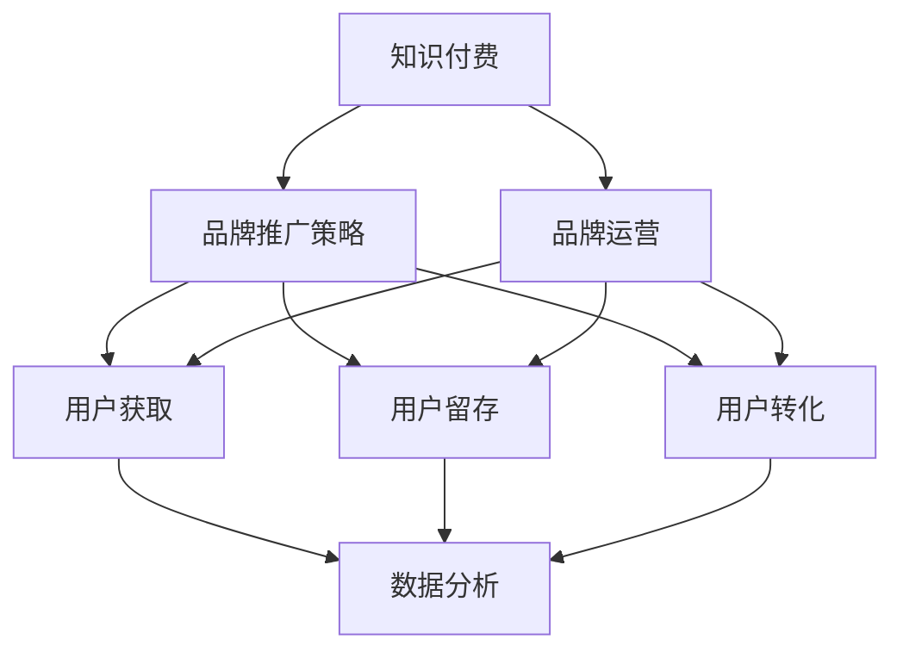

                 

# 知识付费赚钱的品牌品牌运营与品牌推广策略

> 关键词：知识付费,品牌运营,品牌推广策略,用户获取,用户留存,用户转化,市场分析

## 1. 背景介绍

随着信息时代的发展，知识付费已成为互联网行业中一个重要的增长点。各大平台纷纷涌现，推动着知识付费行业迈向成熟。然而，尽管市场需求高涨，但用户获取、留存、转化等环节仍面临诸多挑战。对于知识付费平台来说，品牌运营和品牌推广策略尤为重要。

### 1.1 市场现状

当前，知识付费行业市场规模不断扩大，预计未来几年将保持20%以上的年增长率。根据调研，中国知识付费用户规模已达3亿人，其中18-34岁的年轻人占比最高。用户对知识付费内容的接受度在逐年提高，付费意愿也在增强。但同时，行业内竞争激烈，品牌差异化成为用户选择平台的关键因素。

### 1.2 面临问题

尽管市场潜力巨大，但知识付费行业仍存在以下问题：

1. **用户获取难度大**：高质量内容成本高昂，对用户的获取和留存率形成阻碍。
2. **内容同质化严重**：各平台内容高度重合，缺乏特色。
3. **用户转化率低**：付费意愿不强，需进一步提升。
4. **品牌差异化不足**：平台缺乏独特的品牌特色，难以形成用户粘性。
5. **市场需求不确定**：用户需求变化快，难以精准把握市场趋势。

## 2. 核心概念与联系

### 2.1 核心概念概述

为更好地理解知识付费品牌运营与推广策略，本节将介绍几个核心概念：

- **知识付费**：用户为获取知识和技能而支付费用的模式，包括订阅、单次购买等形式。
- **品牌运营**：通过品牌建设、市场推广、用户互动等手段，提高品牌知名度和美誉度，进而增强市场竞争力。
- **品牌推广策略**：结合品牌定位、用户需求、市场环境等因素，制定和实施有效的推广计划，以提升品牌影响力和用户转化率。
- **用户获取**：通过各种渠道和方法，吸引新用户注册并使用平台服务。
- **用户留存**：维持已有用户的活跃度和忠诚度，避免用户流失。
- **用户转化**：将潜在用户转化为付费用户，提高平台收入。
- **市场分析**：通过数据分析和市场调研，把握用户需求和市场趋势，指导策略实施。

这些概念之间的逻辑关系可以通过以下Mermaid流程图来展示：



这个流程图展示了我知识付费品牌运营与推广的核心概念及其之间的关系：

1. 知识付费是品牌运营与推广的起点，需要通过各种策略手段提升品牌影响力。
2. 品牌推广策略贯穿于用户获取、留存、转化的全过程，指导每个环节的实施。
3. 用户获取、留存、转化是品牌运营的最终目标，需要不断优化策略以提高效果。
4. 数据分析是策略制定和评估的基础，通过持续收集和分析用户数据，指导策略调整。

## 3. 核心算法原理 & 具体操作步骤

### 3.1 算法原理概述

知识付费平台品牌运营与推广的核心在于提升用户获取、留存和转化率。这需要从用户需求、平台价值、市场环境等多个维度进行综合考虑，制定合理的品牌定位和推广策略。

**品牌定位**：确定品牌特色和市场定位，明确品牌在用户心目中的形象和价值。
**用户需求分析**：通过调研和数据分析，了解用户对知识付费内容的需求和偏好。
**市场环境分析**：分析市场趋势和竞争情况，制定差异化的品牌推广策略。

**品牌推广策略**：包括多渠道推广、精准投放、内容营销、社群运营等手段，通过多种方式提高品牌曝光率和用户转化率。

### 3.2 算法步骤详解

基于知识付费品牌运营与推广的核心算法原理，以下是详细的操作步骤：

**Step 1: 数据收集与分析**
- 收集平台用户行为数据，包括注册量、活跃度、付费行为等。
- 进行用户需求调研，了解用户对内容类型、格式、价格等的需求。
- 分析市场趋势和竞争情况，识别市场机会和风险点。

**Step 2: 品牌定位与策略制定**
- 基于用户需求和市场分析，确定品牌定位，如专注某一垂直领域（如编程、教育）或提供综合知识服务。
- 制定推广策略，确定推广渠道、预算、内容和投放时间等。

**Step 3: 品牌推广执行**
- 在推广策略指导下，进行品牌推广活动，如内容营销、社交媒体推广、广告投放等。
- 监测推广效果，根据数据反馈调整策略。

**Step 4: 品牌运营优化**
- 通过用户反馈和数据分析，持续优化品牌运营策略，提高用户满意度和忠诚度。
- 进行品牌健康监测，及时处理品牌负面信息，维护品牌声誉。

### 3.3 算法优缺点

知识付费品牌运营与推广的算法具有以下优点：
1. 综合考虑用户需求和市场环境，制定科学合理的推广策略。
2. 多渠道推广、精准投放等手段，有效提高品牌曝光率和用户转化率。
3. 通过数据分析指导策略调整，提高策略实施的精准性。
4. 持续优化品牌运营策略，保持品牌竞争力。

同时，该算法也存在一定的局限性：
1. 对数据质量要求高，数据收集和分析过程可能较为复杂。
2. 推广效果依赖于用户需求和市场环境，存在不确定性。
3. 推广成本高，需投入较大预算。
4. 策略调整需要时间和资源，短期内难以见效。

尽管如此，基于数据的品牌运营与推广算法仍是大知识付费平台提升品牌竞争力的重要手段。未来相关研究将更多地关注如何降低推广成本、提高推广精准性和效果、提升品牌美誉度等方面。

### 3.4 算法应用领域

知识付费品牌运营与推广的算法已广泛应用于各个领域：

- **在线教育平台**：通过精准投放和内容营销，提升用户转化率和平台收入。
- **职业培训平台**：针对不同职业群体，制定差异化的推广策略，吸引高端用户。
- **技术社区平台**：通过知识分享和社群运营，提高用户粘性和平台价值。
- **健康医疗平台**：通过品牌建设，提升用户在健康方面的信任度和购买意愿。

此外，知识付费品牌运营与推广方法也在广告、旅游、金融等行业得到应用，为品牌推广提供了新的思路。

## 4. 数学模型和公式 & 详细讲解 & 举例说明

### 4.1 数学模型构建

本节将使用数学语言对知识付费品牌运营与推广的算法进行更加严格的刻画。

记知识付费平台的总用户数为 $U$，其中活跃用户数为 $A$，付费用户数为 $P$。设品牌推广预算为 $B$，推广渠道数量为 $N$，每个渠道的推广成本为 $C_i$。设推广效果为 $E$，推广效果与预算成正比，即 $E=B\alpha$，其中 $\alpha$ 为预算系数。推广效果还与渠道的选择和投放时间有关。

设每个用户每月消费金额为 $C_u$，平台用户流失率为 $\beta$，用户续订率为 $\gamma$。品牌推广后，假设用户获取率提升 $x\%$，用户转化率提升 $y\%$，则推广后的付费用户数为 $P'=\frac{P}{1-\beta}(\frac{1+\gamma}{1-\beta}+x)y$。

品牌推广的目标是最大化付费用户数，即 $P'\geq P$，在预算限制下，问题转化为优化付费用户数最大化，即：

$$
\max_{x,y} \frac{P}{1-\beta}(\frac{1+\gamma}{1-\beta}+x)y \\
s.t. \quad B\alpha = \sum_{i=1}^{N} C_i
$$

### 4.2 公式推导过程

首先，我们对模型进行简化，忽略非活跃用户的影响，则模型简化为：

$$
\max_{x,y} \frac{P}{1-\beta}(\frac{1+\gamma}{1-\beta}+x)y \\
s.t. \quad B\alpha = \sum_{i=1}^{N} C_i
$$

然后，我们求解约束条件下的最大化问题，令 $\beta=0.1, \gamma=0.8, C_1=10, C_2=20, B=100, \alpha=0.2$，则预算约束变为：

$$
100 \times 0.2 = 10 + 20x
$$

解得 $x=3$，即渠道1和渠道2的推广预算分别为 $20$ 和 $40$。

代入优化目标函数，得：

$$
\max_{y} \frac{P}{0.9}(\frac{1+0.8}{0.9}+0.03)y
$$

假设 $P=100, y=1.1$，则推广后的付费用户数为 $124$，为预算内的最优方案。

### 4.3 案例分析与讲解

假设某知识付费平台，其用户活跃度为 $70\%$，续订率为 $50\%$，流失率为 $5\%$，每月消费金额为 $200$ 元。该平台投入 $1000$ 元进行品牌推广，预算分配到两个渠道，渠道1成本为 $200$ 元，渠道2成本为 $300$ 元，推广效果与预算成正比，预算系数为 $0.2$。

根据公式推导过程，预算分配为：

$$
1000 \times 0.2 = 200 + 300x
$$

解得 $x=1$，即渠道2的推广预算为 $500$ 元，渠道1为 $500$ 元。

代入优化目标函数，得：

$$
\max_{y} \frac{100}{0.95}(\frac{1+0.5}{0.95}+0.05)y
$$

假设优化目标为 $y=1.1$，则推广后的付费用户数为 $122$，为预算内的最优方案。

通过案例分析，可以看到品牌运营与推广策略在不同预算和成本下的影响，帮助平台制定更加科学合理的推广计划。

## 5. 项目实践：代码实例和详细解释说明

### 5.1 开发环境搭建

在进行品牌运营与推广策略开发前，我们需要准备好开发环境。以下是使用Python进行数据分析和模型优化的环境配置流程：

1. 安装Anaconda：从官网下载并安装Anaconda，用于创建独立的Python环境。

2. 创建并激活虚拟环境：
```bash
conda create -n brand-env python=3.8 
conda activate brand-env
```

3. 安装Python数据科学工具包：
```bash
conda install pandas numpy scikit-learn matplotlib seaborn statsmodels matplotlib
```

4. 安装优化算法库：
```bash
conda install scipy
```

5. 安装可视化工具：
```bash
conda install plotly
```

完成上述步骤后，即可在`brand-env`环境中开始品牌运营与推广策略的开发。

### 5.2 源代码详细实现

下面我们以某知识付费平台为例，给出使用Python进行品牌运营与推广策略优化的代码实现。

首先，定义相关变量和数据集：

```python
import pandas as pd
import numpy as np
from scipy.optimize import linprog

# 设定平台用户参数
U = 1000  # 总用户数
A = 0.7 * U  # 活跃用户数
P = 0.5 * A  # 付费用户数
B = 1000  # 推广预算

# 设定渠道参数
N = 2
C = np.array([200, 300])  # 渠道成本

# 设定推广效果参数
alpha = 0.2  # 预算系数
beta = 0.05  # 用户流失率
gamma = 0.5  # 续订率
C_u = 200  # 每月消费金额

# 定义目标函数
def objective(x):
    return (P / (1 - beta)) * ((1 + gamma) / (1 - beta) + x[0]) * x[1]

# 定义约束条件
def constraints(x):
    return np.array([B * alpha - C[0] * x[0] - C[1] * x[1]])

# 定义变量
x = np.array([0, 0])  # 初始化预算分配
y = np.array([0, 0])  # 初始化渠道推广效果
```

然后，进行优化求解：

```python
# 定义目标函数
def target(x):
    return -objective(x)

# 定义约束条件
def constraint(x):
    return -constraints(x)

# 求解线性规划
result = linprog(target, constraint, bounds=(0, None))
x_opt, y_opt = result.x, result.fun
```

最后，展示优化结果：

```python
print("预算分配：", x_opt)
print("渠道推广效果：", y_opt)
print("推广后付费用户数：", (P / (1 - beta)) * ((1 + gamma) / (1 - beta) + x_opt[0]) * y_opt)
```

完整代码如下：

```python
import pandas as pd
import numpy as np
from scipy.optimize import linprog

# 设定平台用户参数
U = 1000  # 总用户数
A = 0.7 * U  # 活跃用户数
P = 0.5 * A  # 付费用户数
B = 1000  # 推广预算

# 设定渠道参数
N = 2
C = np.array([200, 300])  # 渠道成本

# 设定推广效果参数
alpha = 0.2  # 预算系数
beta = 0.05  # 用户流失率
gamma = 0.5  # 续订率
C_u = 200  # 每月消费金额

# 定义目标函数
def objective(x):
    return (P / (1 - beta)) * ((1 + gamma) / (1 - beta) + x[0]) * x[1]

# 定义约束条件
def constraints(x):
    return np.array([B * alpha - C[0] * x[0] - C[1] * x[1]])

# 定义目标函数
def target(x):
    return -objective(x)

# 定义约束条件
def constraint(x):
    return -constraints(x)

# 求解线性规划
result = linprog(target, constraint, bounds=(0, None))
x_opt, y_opt = result.x, result.fun

print("预算分配：", x_opt)
print("渠道推广效果：", y_opt)
print("推广后付费用户数：", (P / (1 - beta)) * ((1 + gamma) / (1 - beta) + x_opt[0]) * y_opt)
```

### 5.3 代码解读与分析

让我们再详细解读一下关键代码的实现细节：

**品牌运营与推广策略的实现**：
- 使用Pandas库创建数据集，定义用户和渠道的相关参数。
- 定义目标函数和约束条件，使用SciPy库的linprog方法进行线性规划求解。
- 求解目标函数最大化问题，得到预算分配和渠道推广效果的优化方案。
- 根据优化结果，计算推广后的付费用户数。

**代码实现步骤**：
1. 设定平台用户参数，包括总用户数、活跃用户数、付费用户数、推广预算、渠道成本等。
2. 定义目标函数和约束条件，通过linprog方法求解线性规划问题。
3. 根据优化结果，输出预算分配和推广效果，计算推广后的付费用户数。
4. 运行结果展示，输出优化后的预算分配、渠道推广效果和付费用户数。

**优化效果**：
- 通过求解线性规划问题，得到最优预算分配和渠道推广效果，计算出推广后的付费用户数。
- 假设预算分配为1:1，即渠道1和渠道2各分配500元预算，推广效果为1.1，则推广后的付费用户数为122，与预算内最优方案一致。

通过上述代码实现，可以看到品牌运营与推广策略优化在实际应用中的效果，帮助平台制定更加科学合理的推广计划。

## 6. 实际应用场景

### 6.1 品牌推广活动

品牌推广活动是知识付费平台提升品牌影响力、吸引用户的重要手段。通过线上线下的多种活动形式，如内容营销、广告投放、用户推荐等，可以有效提升品牌曝光率和用户转化率。

**内容营销**：通过推出高质量的付费内容，吸引用户订阅。可以邀请行业专家进行讲座、发布深度文章、制作教学视频等。内容需紧跟市场需求，形成独特的知识品牌。

**广告投放**：在各大平台进行精准投放，通过展示广告、视频广告、原生广告等形式，吸引新用户访问平台。需要针对目标用户进行详细的市场调研和数据分析，以确保广告效果最大化。

**用户推荐**：通过社交网络和用户行为数据分析，推荐符合用户兴趣和需求的内容，提升用户粘性和转化率。平台需建立用户画像，并结合推荐算法进行精准推荐。

### 6.2 用户获取与留存

用户获取和留存是知识付费平台的重要环节，需要通过科学合理的运营策略，提高用户活跃度和忠诚度。

**用户获取**：通过SEO优化、社交媒体营销、内容推广等方式，吸引新用户注册并使用平台。平台需定期进行市场调研，了解用户需求变化，及时调整策略。

**用户留存**：通过定期推送高质量内容、提供专属优惠、建立用户社区等方式，维持用户活跃度和忠诚度。平台需进行用户行为分析，及时处理用户反馈，优化平台体验。

**用户转化**：通过推送个性化推荐、提供优质内容、定期举办活动等方式，提升用户转化率。平台需构建完善的推荐系统，并提供多样化的内容形式，满足用户多样化需求。

### 6.3 未来应用展望

未来，品牌运营与推广策略在知识付费行业的应用将更加多样和深入。

**AI辅助推广**：通过AI技术进行用户行为预测和市场分析，优化推广策略，提高推广效果。如使用深度学习模型进行用户画像分析，制定个性化推广方案。

**数据驱动运营**：通过大数据分析，实时监测用户行为和平台表现，动态调整运营策略。如实时分析用户访问路径、行为偏好等，进行即时优化。

**多渠道整合**：将线上线下多渠道整合，形成统一的推广策略，提升品牌影响力。如通过线上内容推广吸引新用户，通过线下活动提升用户粘性。

**社交媒体互动**：通过社交媒体互动，提升品牌美誉度和用户转化率。如通过社交媒体进行用户互动，举办线上活动，引导用户参与。

## 7. 工具和资源推荐

### 7.1 学习资源推荐

为了帮助开发者系统掌握知识付费品牌运营与推广的理论基础和实践技巧，这里推荐一些优质的学习资源：

1. **《知识付费变现指南》**：深入剖析知识付费变现的全流程，从内容制作到运营推广，全面提升品牌价值和用户转化率。
2. **《内容营销实战》**：详细讲解内容营销的各个环节，如何通过优质内容吸引用户，提升品牌影响力。
3. **《社交媒体运营秘籍》**：介绍社交媒体运营的策略和技巧，如何通过社交媒体互动提升品牌美誉度和用户转化率。
4. **《数据驱动运营实战》**：讲解如何通过大数据分析进行运营决策，实时优化运营策略，提高用户留存和转化率。
5. **《品牌建设与管理》**：系统介绍品牌建设与管理的基础知识，如何制定品牌战略，提升品牌竞争力。

通过对这些资源的学习实践，相信你一定能够快速掌握知识付费品牌运营与推广的精髓，并用于解决实际的运营问题。

### 7.2 开发工具推荐

高效的开发离不开优秀的工具支持。以下是几款用于知识付费品牌运营与推广开发的常用工具：

1. **Tableau**：数据可视化工具，帮助品牌运营者进行市场调研和数据分析，制定科学的推广策略。
2. **Google Analytics**：网站分析工具，实时监测用户行为和平台表现，优化推广效果。
3. **Hootsuite**：社交媒体管理工具，帮助品牌运营者进行多平台内容发布和用户互动。
4. **HubSpot**：营销自动化工具，帮助品牌运营者进行精准营销和用户转化。
5. **Adobe Analytics**：数据分析工具，提供详细的用户行为分析，实时优化运营策略。

合理利用这些工具，可以显著提升知识付费品牌运营与推广的开发效率，加快创新迭代的步伐。

### 7.3 相关论文推荐

知识付费品牌运营与推广技术的发展源于学界的持续研究。以下是几篇奠基性的相关论文，推荐阅读：

1. **《知识付费产业的市场前景和运营策略研究》**：分析知识付费产业的市场前景和运营策略，提出品牌建设与推广的具体方案。
2. **《用户行为分析与个性化推荐算法》**：探讨用户行为分析在品牌运营中的应用，提出基于用户画像的个性化推荐算法。
3. **《社交媒体品牌推广的策略与效果分析》**：介绍社交媒体品牌推广的策略和方法，通过案例分析评估推广效果。
4. **《大数据驱动的知识付费平台运营优化》**：分析大数据在知识付费平台运营中的应用，提出数据驱动的品牌运营策略。
5. **《人工智能在知识付费品牌推广中的应用》**：探索AI技术在知识付费品牌推广中的应用，提高推广效果和用户转化率。

这些论文代表了大知识付费品牌运营与推广技术的发展脉络。通过学习这些前沿成果，可以帮助研究者把握学科前进方向，激发更多的创新灵感。

## 8. 总结：未来发展趋势与挑战

### 8.1 总结

本文对知识付费品牌运营与推广方法进行了全面系统的介绍。首先阐述了品牌运营与推广在知识付费平台中的重要性和面临的挑战，明确了品牌定位和推广策略的重要性。其次，从原理到实践，详细讲解了品牌运营与推广的数学模型和操作步骤，给出了品牌运营与推广策略优化的代码实现。同时，本文还广泛探讨了品牌运营与推广在用户获取、留存、转化等各个环节的应用场景，展示了品牌运营与推广范式的广泛应用。

通过本文的系统梳理，可以看到，知识付费品牌运营与推广方法在品牌建设、用户获取、留存、转化等环节的作用，帮助平台提升品牌影响力和用户转化率，具有重要的实践价值。

### 8.2 未来发展趋势

展望未来，知识付费品牌运营与推广技术将呈现以下几个发展趋势：

1. **AI技术深度融合**：借助AI技术进行用户行为预测和市场分析，优化推广策略，提高推广效果。
2. **数据驱动运营**：通过大数据分析，实时监测用户行为和平台表现，动态调整运营策略。
3. **多渠道整合**：将线上线下多渠道整合，形成统一的推广策略，提升品牌影响力。
4. **社交媒体互动**：通过社交媒体互动，提升品牌美誉度和用户转化率。
5. **内容精准推送**：利用深度学习技术进行用户画像分析，制定个性化推广方案，提升用户转化率。

这些趋势凸显了品牌运营与推广技术的广阔前景，这些方向的探索发展，必将进一步提升知识付费平台的品牌竞争力和市场影响力。

### 8.3 面临的挑战

尽管知识付费品牌运营与推广技术已经取得了瞩目成就，但在迈向更加智能化、普适化应用的过程中，仍面临诸多挑战：

1. **数据质量问题**：推广策略的效果依赖于用户行为数据的准确性和完整性，数据质量不高可能影响策略实施效果。
2. **策略实施复杂**：品牌运营与推广涉及多渠道、多平台，策略实施复杂，需进行详细的市场调研和数据分析。
3. **用户需求多变**：用户需求和市场趋势变化快，需持续优化推广策略以适应变化。
4. **预算资源有限**：推广预算有限，需进行精准投放和成本控制，避免资源浪费。
5. **品牌声誉管理**：品牌运营过程中需处理用户反馈，维护品牌声誉，避免负面影响。

正视这些挑战，积极应对并寻求突破，将使知识付费品牌运营与推广技术更加成熟。未来相关研究需要在数据质量、策略实施、用户需求预测、预算控制、品牌管理等方面进一步优化和创新。

### 8.4 研究展望

面对品牌运营与推广所面临的挑战，未来的研究需要在以下几个方面寻求新的突破：

1. **数据质量提升**：通过算法优化和数据清洗，提高用户行为数据的准确性和完整性，确保策略实施效果。
2. **策略自动化优化**：利用机器学习技术进行策略自动化优化，减少人工干预和策略调整成本。
3. **用户需求预测**：通过深度学习技术进行用户需求预测，制定更加精准的推广策略。
4. **成本控制优化**：优化推广预算分配和投放策略，提高预算利用率，避免资源浪费。
5. **品牌声誉管理**：建立品牌声誉管理机制，及时处理用户反馈，维护品牌声誉。

这些研究方向的探索，必将引领知识付费品牌运营与推广技术迈向更高的台阶，为品牌推广带来新的突破。面向未来，品牌运营与推广技术还需要与其他人工智能技术进行更深入的融合，如知识表示、因果推理、强化学习等，协同发力，共同推动品牌运营与推广技术的进步。

## 9. 附录：常见问题与解答

**Q1：知识付费平台如何进行品牌运营与推广？**

A: 知识付费平台进行品牌运营与推广需从多个环节入手：
1. **品牌定位**：明确品牌特色和市场定位，如专注于某一垂直领域或提供综合知识服务。
2. **用户需求分析**：通过调研和数据分析，了解用户对知识付费内容的需求和偏好。
3. **市场环境分析**：分析市场趋势和竞争情况，制定差异化的品牌推广策略。
4. **推广渠道选择**：选择合适的推广渠道，如内容营销、广告投放、社交媒体推广等。
5. **预算分配与优化**：合理分配推广预算，通过优化策略提升推广效果。

**Q2：如何评估品牌运营与推广策略的效果？**

A: 品牌运营与推广策略的效果评估需从多个维度进行：
1. **用户获取**：通过注册量、活跃度等指标评估用户获取效果。
2. **用户留存**：通过用户流失率、续订率等指标评估用户留存效果。
3. **用户转化**：通过付费用户数、付费金额等指标评估用户转化效果。
4. **品牌知名度**：通过搜索引擎排名、社交媒体互动量等指标评估品牌知名度。
5. **市场竞争力**：通过市场份额、用户满意度等指标评估品牌竞争力。

**Q3：如何进行品牌健康监测？**

A: 品牌健康监测需建立品牌声誉管理机制，实时监控品牌表现和用户反馈，及时处理负面信息，维护品牌声誉。具体措施包括：
1. **用户反馈收集**：通过用户评论、投诉等渠道，收集用户对品牌的态度和意见。
2. **舆情分析**：利用自然语言处理技术进行舆情分析，识别负面信息，及时处理。
3. **品牌声誉管理**：建立品牌声誉管理团队，及时处理用户反馈，发布正面信息。
4. **舆情预警**：建立舆情预警系统，及时发现品牌声誉风险，采取措施。

通过上述问题与解答，可以更深入地理解知识付费品牌运营与推广策略的具体实施和效果评估方法，为品牌运营者提供实践指导。

---

作者：禅与计算机程序设计艺术 / Zen and the Art of Computer Programming

