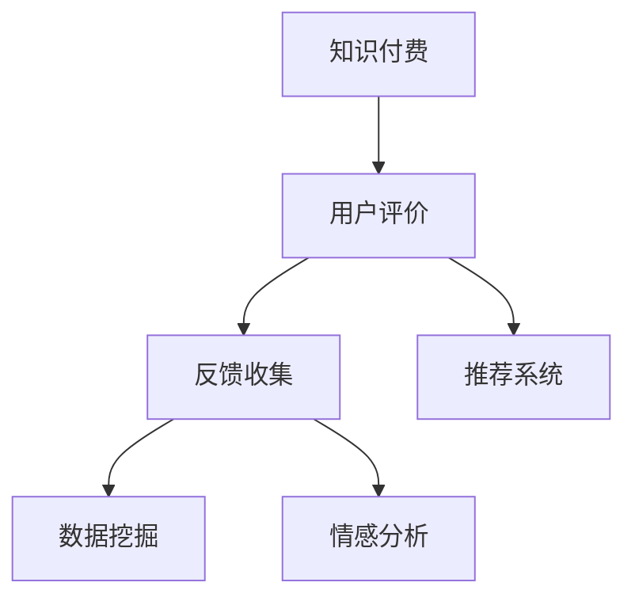

                 

# 知识付费赚钱的用户课程评价与反馈收集机制

> 关键词：知识付费, 用户评价, 反馈收集, 数据挖掘, 推荐系统

## 1. 背景介绍

### 1.1 问题由来
随着知识经济的兴起，知识付费作为一种新型商业模式迅速发展。通过在线课程、电子书、咨询等服务，用户支付一定的费用，获得更有价值、高效的学习资源。知识付费平台如雨后春笋般涌现，竞争日趋激烈。如何吸引用户付费、提升用户体验、增加平台收入，成为了知识付费领域亟需解决的问题。

### 1.2 问题核心关键点
用户体验是知识付费平台成功的关键。优质的课程内容能够满足用户的深度学习需求，用户评价和反馈则是对课程质量的最直接评价。课程评价能够帮助平台了解用户的学习体验，及时发现问题并改进课程，进而提高用户满意度和平台收入。

## 2. 核心概念与联系

### 2.1 核心概念概述

为更好地理解知识付费平台的用户课程评价与反馈收集机制，本节将介绍几个密切相关的核心概念：

- **知识付费(Knowledge Pricing)**：通过在线课程、电子书、咨询等服务，用户支付一定的费用获取高质量的学习资源。知识付费模式使得知识生产和消费更加高效，推动了知识的传播和应用。

- **用户评价(User Evaluation)**：用户对课程内容、质量、服务等的评分或反馈。是衡量课程受欢迎程度和用户体验的重要指标。

- **反馈收集(Feedback Collection)**：收集用户对课程的评价、意见和建议，通过数据分析识别课程优点和不足。反馈收集是提升课程质量、优化用户体验的基础。

- **推荐系统(Recommendation System)**：根据用户行为和评价数据，推荐最适合用户的课程内容，提高用户粘性，提升平台收入。

- **数据挖掘(Data Mining)**：从大量用户评价数据中提取有用信息，如用户偏好、评价趋势、课程热度等。通过数据挖掘优化课程推荐策略，提高推荐准确性。

- **情感分析(Sentiment Analysis)**：对用户评价文本进行情感极性分析，了解用户对课程的满意度和情感倾向。情感分析可以帮助平台识别评价中的积极和消极情绪，优化课程内容和服务。

这些核心概念之间的逻辑关系可以通过以下Mermaid流程图来展示：



这个流程图展示了几类核心概念及其之间的关系：

1. 用户通过知识付费获取课程，并作出评价。
2. 平台通过反馈收集，获取用户的评价和建议。
3. 平台利用数据挖掘和情感分析，从评价数据中提取有价值信息。
4. 推荐系统根据评价和挖掘结果，为用户推荐合适课程，提高用户粘性和满意度。

这些概念共同构成了知识付费平台的用户课程评价与反馈收集机制，为其用户管理和课程优化提供了重要手段。

## 3. 核心算法原理 & 具体操作步骤
### 3.1 算法原理概述

知识付费平台的用户课程评价与反馈收集机制，本质上是一个基于用户行为和评价数据的信息抽取与推荐过程。其核心思想是：通过收集和分析用户对课程的评价数据，提取有价值的信息，指导课程的优化和推荐，提升用户体验和平台收入。

形式化地，假设课程为 $C$，用户为 $U$，用户评价为 $E$。平台的优化目标是最小化用户不满意度，即找到最优课程：

$$
\hat{C}=\mathop{\arg\min}_{C} \sum_{u \in U} f(u, C)
$$

其中 $f(u, C)$ 为课程 $C$ 对用户 $u$ 的不满意度函数，可以通过用户评价和行为数据进行建模。

### 3.2 算法步骤详解

知识付费平台的用户课程评价与反馈收集机制一般包括以下几个关键步骤：

**Step 1: 数据收集与预处理**
- 收集用户对课程的评分、评论、使用时长等数据，构建用户行为数据集。
- 对数据进行清洗、去重、分类等预处理，确保数据的质量和一致性。

**Step 2: 用户评价分析**
- 对用户评价进行文本处理，包括分词、去除停用词、提取情感词等步骤。
- 应用情感分析算法，如基于词典、机器学习、深度学习等方法，对评价情感进行极性判断。
- 根据情感极性，将评价分为积极、中性、消极三种类型。

**Step 3: 特征提取与建模**
- 通过TF-IDF、Word2Vec、BERT等方法，提取评价文本的关键词、短语、主题等信息。
- 构建用户行为特征向量，包括评分、评论长度、使用时长等指标。
- 应用聚类算法、关联规则算法等方法，分析用户行为数据，识别用户兴趣和需求。

**Step 4: 推荐系统构建**
- 选择合适的推荐算法，如基于内容的推荐、协同过滤推荐、深度学习推荐等。
- 结合用户行为数据和评价结果，构建推荐模型，并训练优化。
- 在推荐模型上进行预测，生成个性化的课程推荐列表。

**Step 5: 反馈循环与优化**
- 将推荐结果展示给用户，收集用户的新评价数据。
- 定期对课程进行优化和调整，根据新评价更新课程内容。
- 持续迭代优化推荐模型，提升推荐效果和用户满意度。

以上是知识付费平台用户课程评价与反馈收集机制的一般流程。在实际应用中，还需要针对具体平台的特点，对各个环节进行优化设计，如改进情感分析算法、采用更高级的推荐模型、优化推荐策略等，以进一步提升推荐效果。

### 3.3 算法优缺点

知识付费平台的用户课程评价与反馈收集机制具有以下优点：
1. 实时响应：通过快速收集和分析用户评价，平台能够及时调整课程策略，提升用户体验。
2. 个性化推荐：根据用户评价和行为数据，提供个性化的课程推荐，提高用户粘性和满意度。
3. 提升收入：优质的课程内容和个性化的推荐策略，能够吸引更多用户付费，增加平台收入。
4. 用户参与：用户评价和反馈是双向的，能够增加用户参与感和平台粘性。

同时，该机制也存在一定的局限性：
1. 数据噪音：用户评价数据中可能存在噪声和不一致性，需要应用数据清洗和处理技术。
2. 隐私保护：用户评价涉及个人隐私，需要在收集和处理过程中保证数据的安全和隐私。
3. 推荐算法复杂度：高效的推荐算法需要大量的计算资源，可能需要在大规模数据集上进行优化和调参。
4. 动态变化：用户行为和需求随时间变化，需要持续进行数据收集和算法优化。

尽管存在这些局限性，但就目前而言，用户评价与反馈收集机制仍是知识付费平台的重要组成部分，是提升平台竞争力和用户满意度的重要手段。未来相关研究的方向在于如何进一步优化推荐算法，提高评价数据的准确性，保护用户隐私，同时兼顾动态变化的用户行为。

### 3.4 算法应用领域

知识付费平台的用户课程评价与反馈收集机制，在多个领域得到了广泛应用，如在线教育、职业培训、职业技能认证等。以下以在线教育为例，详细说明其应用场景：

**在线教育平台**：在线教育平台通过用户评价与反馈收集机制，对课程进行优化和调整，提升课程质量，吸引更多用户付费。

**具体应用场景**：
1. **课程评价系统**：用户对课程内容、教学质量、互动效果等进行评分，平台根据评分数据优化课程设计。
2. **课程推荐系统**：根据用户历史评分和行为数据，推荐用户感兴趣的新课程，提高用户满意度和粘性。
3. **课程改进建议**：平台收集用户对课程的意见和建议，反馈给教师团队，指导课程内容更新和优化。
4. **用户满意度调查**：定期对用户进行满意度调查，了解用户需求和痛点，提升整体课程服务质量。

**业务效益**：
1. **提高课程质量**：通过用户评价数据，平台能够识别课程优点和不足，及时进行优化和改进。
2. **提升用户满意度**：个性化的课程推荐和及时的课程改进，能够显著提升用户的学习体验和满意度。
3. **增加用户粘性**：持续优化推荐策略，增加用户重复购买和长期留存。
4. **增加平台收入**：优质的课程内容和用户粘性提升，能够吸引更多用户付费，增加平台收入。

## 4. 数学模型和公式 & 详细讲解 & 举例说明（备注：数学公式请使用latex格式，latex嵌入文中独立段落使用 $$，段落内使用 $)
### 4.1 数学模型构建

本节将使用数学语言对知识付费平台的用户课程评价与反馈收集机制进行更加严格的刻画。

假设课程为 $C$，用户为 $U$，用户评价为 $E$。平台的目标是最小化用户不满意度 $f(u, C)$。

设 $u_i$ 为第 $i$ 个用户，$C_j$ 为第 $j$ 门课程。用户对课程 $C_j$ 的评分和评价为 $s_{u_i, C_j}$ 和 $e_{u_i, C_j}$。设 $s_{u_i, C_j} \in [0, 5]$，$e_{u_i, C_j} \in \{P, N, O\}$，其中 $P$ 表示积极评价，$N$ 表示消极评价，$O$ 表示中性评价。

平台的目标函数为：

$$
\hat{C}=\mathop{\arg\min}_{C} \sum_{u \in U} \lambda_1 \max(\mathbb{I}(e_{u, C} \neq O), \lambda_2 s_{u, C})
$$

其中 $\lambda_1$ 和 $\lambda_2$ 为权重系数，$\mathbb{I}$ 为示性函数。

### 4.2 公式推导过程

为了更清晰地理解目标函数的含义，下面推导该公式：

首先，将用户评价 $e_{u, C}$ 转化为 $e'_{u, C} \in [0, 1]$，表示评价情感的极性。

$$
e'_{u, C} = 
\begin{cases}
1 & \text{if } e_{u, C} = P \\
0.5 & \text{if } e_{u, C} = O \\
0 & \text{if } e_{u, C} = N
\end{cases}
$$

将目标函数重写为：

$$
\hat{C}=\mathop{\arg\min}_{C} \sum_{u \in U} (\lambda_1 \max(\mathbb{I}(e'_{u, C} \neq 0.5), \lambda_2 s_{u, C})
$$

化简后得：

$$
\hat{C}=\mathop{\arg\min}_{C} \sum_{u \in U} \lambda_1 \mathbb{I}(e'_{u, C} \neq 0.5) + \lambda_2 s_{u, C}
$$

该目标函数的意义为：平台希望最大化积极评价的数量，同时最小化用户评分，提升课程质量，增强用户体验。

### 4.3 案例分析与讲解

以在线教育平台为例，应用上述目标函数对课程进行优化。

假设课程 $C_j$ 有 $N$ 个用户，用户对课程的评分数据如下：

| 用户 | 评分 | 评价情感 |
| --- | --- | --- |
| 用户1 | 4.5 | P |
| 用户2 | 3.8 | N |
| 用户3 | 5.0 | P |
| ... | ... | ... |

设 $\lambda_1 = 0.5$，$\lambda_2 = 0.5$。则目标函数变为：

$$
\hat{C}=\mathop{\arg\min}_{C} \sum_{u \in U} 0.5 \mathbb{I}(e'_{u, C} \neq 0.5) + 0.5 s_{u, C}
$$

对每个用户 $u_i$，目标函数可以进一步化简为：

$$
\hat{C}_j=\mathop{\arg\min}_{C_j} 0.5 \mathbb{I}(e'_{u_i, C_j} \neq 0.5) + 0.5 s_{u_i, C_j}
$$

对于用户1，目标函数为：

$$
\hat{C}_j=\mathop{\arg\min}_{C_j} 0.5 \times 1 + 0.5 \times 4.5 = 3.5
$$

对于用户2，目标函数为：

$$
\hat{C}_j=\mathop{\arg\min}_{C_j} 0.5 \times 1 + 0.5 \times 3.8 = 3.4
$$

以此类推，最终计算出所有用户的目标评分，得：

$$
\hat{C}_j = \frac{1}{N} \sum_{u \in U} (0.5 \mathbb{I}(e'_{u, C_j} \neq 0.5) + 0.5 s_{u, C_j})
$$

得到课程 $C_j$ 的目标评分后，可以据此对课程内容进行优化和调整，提高课程质量。

## 5. 项目实践：代码实例和详细解释说明
### 5.1 开发环境搭建

在进行项目实践前，我们需要准备好开发环境。以下是使用Python进行Flask开发的环境配置流程：

1. 安装Anaconda：从官网下载并安装Anaconda，用于创建独立的Python环境。

2. 创建并激活虚拟环境：
```bash
conda create -n flask-env python=3.8 
conda activate flask-env
```

3. 安装Flask：
```bash
pip install flask
```

4. 安装其他必要的工具包：
```bash
pip install numpy pandas scikit-learn
```

完成上述步骤后，即可在`flask-env`环境中开始项目开发。

### 5.2 源代码详细实现

我们以下载并预处理用户评价数据，构建推荐系统的代码实现为例：

```python
from flask import Flask, request, jsonify
from sklearn.feature_extraction.text import TfidfVectorizer
from sklearn.metrics.pairwise import cosine_similarity
import pandas as pd

app = Flask(__name__)

# 加载用户评价数据
data = pd.read_csv('user_reviews.csv')

# 预处理数据
# 假设每个用户只有一个课程评价
data['course'] = data.groupby('user_id')['course'].first()
data['review'] = data.groupby('user_id')['review'].first()

# 构建词频向量
vectorizer = TfidfVectorizer()
X = vectorizer.fit_transform(data['review'])

# 构建用户评分矩阵
Y = pd.DataFrame(data.groupby('user_id')['rating'].mean())

# 计算相似度
similarity_matrix = cosine_similarity(X, X)

# 定义推荐函数
def recommend_course(user_id):
    # 获取用户评分
    user_ratings = Y.loc[user_id]
    
    # 计算用户与其他用户之间的相似度
    user_similarity = similarity_matrix[user_id]
    
    # 计算每个课程的加权平均评分
    course_scores = np.dot(user_ratings, user_similarity) / np.linalg.norm(user_similarity)
    
    # 根据评分排序，返回推荐课程列表
    recommendations = data['course'].tolist()[np.argsort(course_scores)[::-1]][1:3]
    return recommendations

# 获取推荐课程
@app.route('/recommend', methods=['POST'])
def get_recommendations():
    user_id = request.json['user_id']
    courses = recommend_course(user_id)
    return jsonify(courses)

if __name__ == '__main__':
    app.run(debug=True)
```

### 5.3 代码解读与分析

让我们再详细解读一下关键代码的实现细节：

**Flask应用**：
- 通过Flask框架搭建一个简单的RESTful API，处理用户请求。
- 定义了`/recommend`接口，接收用户ID，返回推荐的课程列表。

**数据预处理**：
- 使用pandas加载用户评价数据，按用户ID进行聚合，取每条记录的最先记录。
- 将课程和评价文本进行向量化，构建词频向量矩阵。

**推荐函数**：
- 计算用户与其他用户之间的相似度，得到用户向量。
- 根据用户向量计算每个课程的加权平均评分，排序后返回推荐课程列表。

**接口调用**：
- 通过POST请求发送用户ID，获取推荐课程列表。

以上代码实现了基于用户评价的课程推荐功能。需要注意的是，在实际应用中，数据预处理和推荐算法还需要进一步优化，如应用更高效的向量相似度计算方法，优化课程评分模型等，以提高推荐效果。

## 6. 实际应用场景
### 6.1 智能教育

在线教育平台通过用户评价与反馈收集机制，能够实时了解课程效果，优化课程设计，提升用户满意度和平台收入。具体应用场景包括：

- **课程评价系统**：通过收集用户评分和评论，平台能够快速识别课程优点和不足，及时进行调整优化。
- **个性化推荐系统**：根据用户评价和行为数据，提供个性化的课程推荐，提高用户粘性和满意度。
- **课程改进建议**：平台收集用户对课程的意见和建议，反馈给教师团队，指导课程内容更新和优化。
- **用户满意度调查**：定期对用户进行满意度调查，了解用户需求和痛点，提升整体课程服务质量。

通过持续优化课程内容和推荐策略，平台能够提供更优质的教育资源，吸引更多用户付费，增加平台收入。

### 6.2 职业培训

职业培训平台通过用户评价与反馈收集机制，能够及时调整培训课程内容和形式，提升培训效果和用户满意度。具体应用场景包括：

- **课程评价系统**：通过收集用户评分和反馈，平台能够快速识别培训课程中的优点和不足，及时进行调整优化。
- **个性化推荐系统**：根据用户评价和行为数据，提供个性化的课程推荐，提高用户粘性和满意度。
- **课程改进建议**：平台收集用户对课程的意见和建议，反馈给培训师团队，指导课程内容更新和优化。
- **用户满意度调查**：定期对用户进行满意度调查，了解用户需求和痛点，提升整体培训服务质量。

通过持续优化培训内容和推荐策略，平台能够提供更高效、实用的培训资源，增加用户粘性，提升平台收入。

### 6.3 在线招聘

在线招聘平台通过用户评价与反馈收集机制，能够快速了解用户对招聘信息的满意度，优化招聘流程和效果。具体应用场景包括：

- **职位评价系统**：通过收集用户评分和评论，平台能够快速识别招聘信息中的优点和不足，及时进行调整优化。
- **个性化推荐系统**：根据用户评价和行为数据，提供个性化的职位推荐，提高用户粘性和满意度。
- **招聘信息改进建议**：平台收集用户对招聘信息的意见和建议，反馈给招聘方，指导职位信息更新和优化。
- **用户满意度调查**：定期对用户进行满意度调查，了解用户需求和痛点，提升整体招聘服务质量。

通过持续优化招聘信息和推荐策略，平台能够提供更优质、匹配的招聘资源，吸引更多用户访问，增加平台收入。

## 7. 工具和资源推荐
### 7.1 学习资源推荐

为了帮助开发者系统掌握知识付费平台的用户评价与反馈收集机制的理论基础和实践技巧，这里推荐一些优质的学习资源：

1. **《数据科学入门》系列博文**：由大数据专家撰写，详细介绍了数据科学的基本概念和实践技巧，适合入门读者。
2. **Kaggle在线课程**：提供丰富的大数据和机器学习实战课程，涵盖从数据预处理到模型训练的各个环节。
3. **《Python数据科学手册》书籍**：系统讲解了Python在数据科学中的应用，适合进阶学习。
4. **Scikit-learn官方文档**：详细的库文档，提供丰富的示例代码和算法说明，适合深入学习。
5. **Flask官方文档**：提供完整的API开发指南和示例代码，适合Web应用开发。

通过对这些资源的学习实践，相信你一定能够快速掌握知识付费平台的用户评价与反馈收集机制，并用于解决实际的商业问题。

### 7.2 开发工具推荐

高效的开发离不开优秀的工具支持。以下是几款用于知识付费平台开发的常用工具：

1. **Anaconda**：用于创建和管理Python环境的工具，提供了丰富的科学计算和数据分析工具。
2. **Flask**：轻量级的Web框架，适合快速开发RESTful API，方便接入数据库和第三方服务。
3. **SQLAlchemy**：流行的Python ORM框架，支持关系型数据库的快速开发和查询。
4. **Pandas**：数据处理和分析工具，提供丰富的数据操作和分析功能。
5. **Scikit-learn**：机器学习库，提供丰富的算法实现和工具支持。

合理利用这些工具，可以显著提升知识付费平台的开发效率，加快创新迭代的步伐。

### 7.3 相关论文推荐

知识付费平台的用户评价与反馈收集机制的研究源于学界的持续研究。以下是几篇奠基性的相关论文，推荐阅读：

1. **《大数据时代的用户行为分析与建模》**：介绍了大数据技术在用户行为分析中的应用，包括情感分析和推荐系统。
2. **《机器学习在推荐系统中的应用》**：系统讲解了推荐算法的基本原理和实现方法，涵盖了协同过滤、基于内容的推荐等。
3. **《用户评价分析与情感极性识别》**：详细介绍了用户评价数据的预处理和情感分析方法，探讨了情感极性对推荐效果的影响。
4. **《个性化推荐系统设计与实现》**：介绍了个性化推荐系统的基本框架和算法实现，包括用户行为建模和推荐模型训练。
5. **《推荐系统的多模态融合与跨领域迁移》**：探讨了将多模态数据融合到推荐系统中的方法，提升了推荐系统的准确性和鲁棒性。

这些论文代表了大数据和机器学习领域的研究方向，通过学习这些前沿成果，可以帮助研究者把握学科前进方向，激发更多的创新灵感。

## 8. 总结：未来发展趋势与挑战

### 8.1 总结

本文对知识付费平台的用户评价与反馈收集机制进行了全面系统的介绍。首先阐述了知识付费平台在用户评价和反馈收集方面的重要性和核心关键点，明确了评价与反馈机制在提升用户体验和平台收入方面的独特价值。其次，从原理到实践，详细讲解了评价与反馈的数学模型和操作步骤，给出了推荐系统的代码实现。同时，本文还广泛探讨了评价与反馈机制在智能教育、职业培训、在线招聘等多个领域的应用前景，展示了其广阔的应用空间。

通过本文的系统梳理，可以看到，用户评价与反馈机制在知识付费平台中发挥了重要作用，是提升用户体验和平台竞争力的关键手段。

### 8.2 未来发展趋势

展望未来，用户评价与反馈收集机制将呈现以下几个发展趋势：

1. **实时化**：通过实时收集和分析用户评价，平台能够及时调整课程策略，提升用户体验。实时化数据流处理技术和大数据平台的应用，使得实时化成为可能。
2. **多模态融合**：用户评价不仅仅包括文本数据，还包括行为数据、语音数据等。将多模态数据融合到评价与反馈机制中，能够提供更全面、准确的用户画像。
3. **自适应推荐**：利用机器学习和深度学习技术，实现用户评价的动态调整和自适应推荐，提升推荐效果。自适应推荐算法能够根据用户行为和评价数据进行实时优化。
4. **个性化体验**：通过个性化推荐和动态调整，提升用户个性化体验。个性化的推荐系统能够根据用户历史行为和当前偏好，提供更精准的课程推荐。
5. **跨平台集成**：将用户评价与反馈机制集成到多个平台中，如社交媒体、在线游戏等，提供更丰富的用户互动和反馈途径。
6. **人工智能融合**：将人工智能技术，如自然语言处理、计算机视觉等，融合到用户评价与反馈机制中，提供更智能、高效的评价与反馈体验。

以上趋势凸显了用户评价与反馈机制的广阔前景。这些方向的探索发展，必将进一步提升平台的用户体验和粘性，推动知识付费平台的创新和进步。

### 8.3 面临的挑战

尽管用户评价与反馈收集机制已经取得了不错的成效，但在迈向更加智能化、普适化应用的过程中，它仍面临着诸多挑战：

1. **数据噪音**：用户评价数据中可能存在噪声和不一致性，需要应用数据清洗和处理技术。
2. **隐私保护**：用户评价涉及个人隐私，需要在收集和处理过程中保证数据的安全和隐私。
3. **动态变化**：用户行为和需求随时间变化，需要持续进行数据收集和算法优化。
4. **推荐算法复杂度**：高效的推荐算法需要大量的计算资源，可能需要在大规模数据集上进行优化和调参。
5. **用户满意度评价**：用户评价结果可能存在主观性和误差，需要进行客观评估和验证。
6. **多模态数据融合**：多模态数据的融合需要更多算法和技术的支持，提升融合效果和算法复杂度。

尽管存在这些挑战，但用户评价与反馈收集机制在知识付费平台中仍然不可或缺，是提升平台竞争力和用户体验的重要手段。未来相关研究需要在这些方面寻求新的突破，以推动用户评价与反馈机制的持续优化和发展。

### 8.4 研究展望

面对用户评价与反馈收集机制所面临的种种挑战，未来的研究需要在以下几个方面寻求新的突破：

1. **数据清洗与预处理**：开发更高效的数据清洗和预处理算法，提高评价数据的准确性和一致性。
2. **用户隐私保护**：研究和应用隐私保护技术，如差分隐私、联邦学习等，保护用户隐私数据。
3. **动态推荐优化**：利用动态系统优化技术，实时调整推荐算法，提升推荐效果。
4. **自适应推荐算法**：研究和应用自适应推荐算法，提升推荐系统的智能化和适应性。
5. **多模态数据融合**：开发高效的多模态数据融合算法，提升用户画像的全面性和准确性。
6. **人工智能融合**：将人工智能技术，如自然语言处理、计算机视觉等，融合到评价与反馈机制中，提供更智能、高效的评价与反馈体验。

这些研究方向的探索，必将引领用户评价与反馈收集机制迈向更高的台阶，为构建智能、普适化的知识付费平台提供新的技术支持。面向未来，用户评价与反馈收集机制需要与其他人工智能技术进行更深入的融合，共同推动知识付费平台的进步和发展。

## 9. 附录：常见问题与解答

**Q1：用户评价与反馈收集机制如何降低数据噪音？**

A: 降低数据噪音主要通过以下方法：
1. 数据清洗：移除明显错误、重复、异常的评价数据。
2. 文本处理：应用分词、去除停用词、去除噪声词等技术，提高评价数据的清晰度。
3. 情感分析：利用情感分析技术，识别和剔除负面情感过强的评价数据。
4. 众包验证：引入众包机制，通过多个人类标注验证评价数据的质量。

**Q2：如何保护用户评价数据的隐私？**

A: 保护用户评价数据隐私主要通过以下方法：
1. 数据脱敏：对敏感数据进行匿名化、加密等处理，保护用户隐私。
2. 访问控制：设置严格的访问权限，确保只有授权人员能够访问评价数据。
3. 数据隔离：将评价数据隔离在不同的系统或环境中，防止泄露。
4. 隐私计算：采用隐私计算技术，如差分隐私、联邦学习等，在保护隐私的前提下进行数据处理和分析。

**Q3：推荐算法复杂度较高，如何优化？**

A: 优化推荐算法复杂度主要通过以下方法：
1. 特征降维：应用特征选择和降维技术，减少输入特征数量。
2. 算法优化：优化推荐算法的算法结构，减少计算量和资源消耗。
3. 分布式计算：利用分布式计算平台，进行大规模数据集的推荐算法优化。
4. 硬件加速：利用GPU、TPU等硬件设备，加速推荐算法的计算过程。

**Q4：如何评估用户评价与反馈的效果？**

A: 评估用户评价与反馈的效果主要通过以下方法：
1. 用户满意度调查：定期对用户进行满意度调查，了解用户对平台和课程的评价。
2. 评价数据统计：分析用户评价数据，统计用户评分、情感极性等指标。
3. 用户行为分析：通过用户行为数据，评估推荐系统的效果和用户粘性。
4. 效果指标对比：比较不同评价与反馈机制下的推荐效果，选择最优方案。

**Q5：多模态数据融合有哪些挑战？**

A: 多模态数据融合的挑战主要包括：
1. 数据格式不统一：不同模态的数据格式和单位不同，需要进行统一处理。
2. 数据融合难度大：多模态数据的融合需要更多的算法和技术支持，提升融合效果。
3. 算法复杂度高：多模态数据的融合和分析需要更高的计算复杂度，需要优化算法结构。
4. 融合效果不理想：多模态数据融合的效果可能不理想，需要进行多次试验和优化。

正视用户评价与反馈机制所面临的这些挑战，积极应对并寻求突破，将是大数据和机器学习技术在知识付费平台中不断进步的关键。

