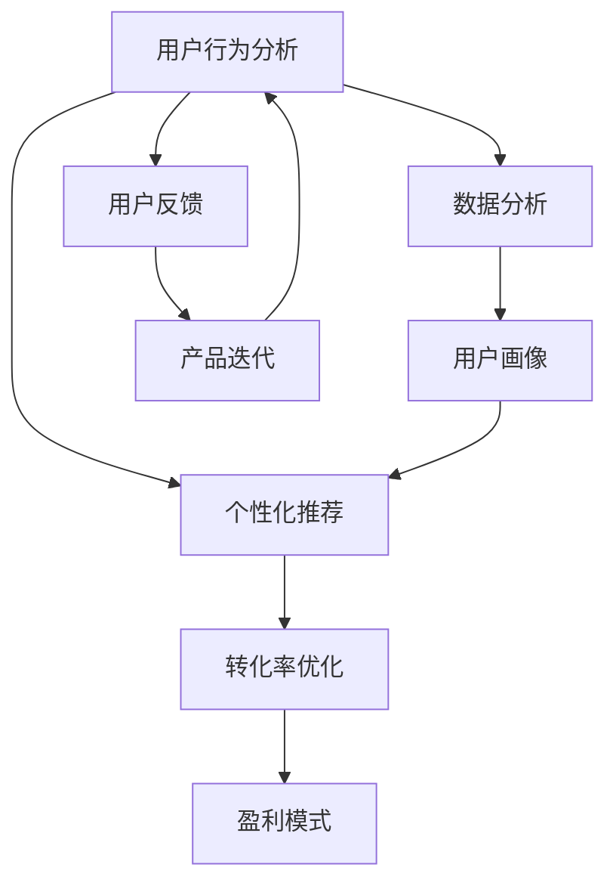

                 

# 知识付费赚钱的知识产品设计与开发

> 关键词：知识付费、产品设计、用户行为、数据分析、个性化推荐、转化率优化、盈利模式

## 1. 背景介绍

随着互联网和移动互联网的普及，人们获取知识的途径日益多样，从传统书籍到在线课程，从博客文章到社交媒体，信息过载的时代，知识的筛选和获取变得更加困难。而知识付费，作为一种新型的知识传播和获取方式，正逐渐受到越来越多人的认可。通过付费订阅，用户可以获得更为优质、专业的知识内容，同时知识创作者也能获得应有的回报。

### 1.1 知识付费的兴起

知识付费兴起的原因主要包括以下几点：

1. **信息过载**：互联网时代，信息量大增，用户难以在海量信息中找到有价值的内容。
2. **知识焦虑**：社会竞争加剧，职场和生活中不断变化的挑战使得人们需要持续学习和提升。
3. **优质内容稀缺**：优质知识内容的创作和传播成本高，难以通过免费渠道获得。
4. **付费习惯培养**：随着移动互联网和移动支付的普及，用户的付费习惯逐渐养成，愿意为优质内容付费。

### 1.2 知识付费的市场现状

根据艾媒咨询的数据显示，中国知识付费市场规模持续增长，预计到2023年将达到近400亿元。知识付费用户规模也逐年上升，用户对于高质量、专业化内容的支付意愿不断提升。

知识付费市场的主要参与者包括：
- 知识平台：如得到、知乎、喜马拉雅等。
- 垂直内容提供商：如新东方、网易有道等。
- 自媒体：如专栏作家、职业博主等。

知识付费产品通常包括：
- 订阅课程：定期更新的内容，按月或按年收费。
- 单次课程：一次性购买，获取完整的课程内容。
- 电子书：可随时下载阅读。
- 直播课程：实时互动学习。
- 专业问答：专家一对一解答。

## 2. 核心概念与联系

### 2.1 核心概念概述

知识付费产品设计与开发涉及多个核心概念，包括用户行为分析、个性化推荐、转化率优化、盈利模式等。这些概念之间存在紧密的联系，共同构成了知识付费产品的核心框架。

- **用户行为分析**：通过分析用户行为，了解用户需求和偏好，从而进行产品优化。
- **个性化推荐**：根据用户行为和偏好，推荐合适的知识产品，提高用户满意度和转化率。
- **转化率优化**：通过优化产品界面、流程、价格等，提高用户从有意向到付费的转化率。
- **盈利模式**：分析不同产品模型的收益情况，制定有效的盈利策略。

### 2.2 核心概念联系

通过Mermaid流程图，可以直观地展示这些核心概念之间的联系：



从流程图可以看出，用户行为分析和数据分析是整个知识付费产品设计的基石，通过用户画像和行为数据，能够更精准地进行个性化推荐和转化率优化，从而提升盈利能力。

## 3. 核心算法原理 & 具体操作步骤

### 3.1 算法原理概述

知识付费产品的核心算法主要包括用户行为分析、个性化推荐和转化率优化，其原理如下：

- **用户行为分析**：通过机器学习算法，对用户的历史行为数据进行分析，提取用户偏好、兴趣和需求等信息。
- **个性化推荐**：基于协同过滤、内容推荐和混合推荐等算法，为用户推荐最相关的知识产品。
- **转化率优化**：通过A/B测试、多臂赌博机算法和机器学习模型，优化产品界面、流程和价格，提高用户付费转化率。

### 3.2 算法步骤详解

#### 3.2.1 用户行为分析

用户行为分析通常包括以下几个步骤：

1. **数据采集**：收集用户在平台上的行为数据，包括浏览记录、点击行为、购买行为等。
2. **数据清洗和预处理**：清洗无效数据和噪音，进行数据归一化和标准化处理。
3. **特征提取**：提取有意义的特征，如浏览时间、点击次数、购买频率等。
4. **模型训练**：使用机器学习算法，如协同过滤、分类树等，训练用户画像模型。
5. **画像分析**：根据模型结果，生成用户画像，分析用户的行为特征和需求偏好。

#### 3.2.2 个性化推荐

个性化推荐算法主要包括以下几个步骤：

1. **数据采集**：收集用户行为数据和知识产品数据。
2. **数据清洗和预处理**：清洗无效数据和噪音，进行数据归一化和标准化处理。
3. **特征提取**：提取有意义的特征，如产品评分、用户行为评分等。
4. **模型训练**：使用协同过滤、内容推荐和混合推荐等算法，训练推荐模型。
5. **推荐生成**：根据模型结果，生成个性化推荐结果，推荐给用户。

#### 3.2.3 转化率优化

转化率优化通常包括以下几个步骤：

1. **数据采集**：收集用户在平台上的行为数据和转化数据。
2. **数据清洗和预处理**：清洗无效数据和噪音，进行数据归一化和标准化处理。
3. **特征提取**：提取有意义的特征，如页面停留时间、点击转化率、购买路径等。
4. **模型训练**：使用A/B测试、多臂赌博机算法和机器学习模型，训练转化率优化模型。
5. **优化策略**：根据模型结果，优化产品界面、流程和价格，提高用户付费转化率。

### 3.3 算法优缺点

#### 3.3.1 用户行为分析

**优点**：
- 能够准确把握用户需求和偏好，提高个性化推荐的准确性。
- 通过用户画像，可以更好地进行市场细分和产品定位。

**缺点**：
- 数据采集和处理成本较高，需要投入大量的人力和技术资源。
- 用户隐私保护问题，需要谨慎处理用户数据。

#### 3.3.2 个性化推荐

**优点**：
- 提高用户满意度和黏性，提升用户留存率和转化率。
- 通过精准推荐，增加知识产品的销量和收入。

**缺点**：
- 需要大量的用户行为数据和知识产品数据，数据获取难度较大。
- 算法模型复杂，需要专业的数据科学家和工程师进行开发和维护。

#### 3.3.3 转化率优化

**优点**：
- 提高用户付费转化率，增加收入和利润。
- 优化产品体验，提升用户满意度和品牌形象。

**缺点**：
- 需要持续的实验和调整，优化过程较慢。
- 效果依赖于实验设计和用户行为变化，存在不确定性。

### 3.4 算法应用领域

知识付费产品设计和开发的算法主要应用于以下领域：

1. **在线教育平台**：如得到、网易有道等，通过个性化推荐和转化率优化，提高课程订阅率和用户留存率。
2. **知识付费社区**：如知乎、简书等，通过用户行为分析和个性化推荐，提高内容消费和付费转化。
3. **企业培训平台**：如腾讯企业大学、网易公开课等，通过转化率优化和数据驱动，提升企业培训效果和收益。
4. **职业认证考试**：如中国证券业协会、医师资格考试等，通过个性化推荐和转化率优化，提高考试报名率和通过率。
5. **在线医疗咨询**：如平安好医生、好大夫在线等，通过用户行为分析和个性化推荐，提高用户咨询次数和付费比例。

## 4. 数学模型和公式 & 详细讲解 & 举例说明

### 4.1 数学模型构建

知识付费产品的数学模型通常包括以下几个部分：

1. **用户行为模型**：$U=\{u_1, u_2, ..., u_n\}$，其中 $u_i$ 为第 $i$ 个用户的行为数据。
2. **知识产品模型**：$P=\{p_1, p_2, ..., p_m\}$，其中 $p_j$ 为第 $j$ 个知识产品的属性数据。
3. **推荐模型**：$R=\{r_{ij}\}_{i,j=1}^{n,m}$，其中 $r_{ij}$ 为用户 $u_i$ 对知识产品 $p_j$ 的评分。
4. **转化模型**：$T=\{t_{ik}\}_{i,k=1}^{n,n}$，其中 $t_{ik}$ 为用户在第 $k$ 个页面上的转化率。

### 4.2 公式推导过程

#### 4.2.1 用户行为模型

用户行为模型可以表示为：

$$
U = \{(u_i, b_i)\}_{i=1}^n
$$

其中 $u_i$ 为用户行为数据，$b_i$ 为行为评分，通常包括浏览时间、点击次数、购买频率等。

#### 4.2.2 知识产品模型

知识产品模型可以表示为：

$$
P = \{(p_j, f_j)\}_{j=1}^m
$$

其中 $p_j$ 为知识产品数据，$f_j$ 为产品评分，通常包括产品标题、描述、作者、用户评分等。

#### 4.2.3 推荐模型

推荐模型可以表示为：

$$
R = \{r_{ij}\}_{i,j=1}^{n,m}
$$

其中 $r_{ij}$ 为用户 $u_i$ 对知识产品 $p_j$ 的评分。推荐模型的目标是最小化用户对产品的实际评分与推荐评分之间的误差。

#### 4.2.4 转化模型

转化模型可以表示为：

$$
T = \{t_{ik}\}_{i,k=1}^{n,n}
$$

其中 $t_{ik}$ 为用户 $u_i$ 在用户行为数据 $u_i$ 上是否进行购买或订阅的转化率。转化模型的目标是最小化实际转化率与预测转化率之间的误差。

### 4.3 案例分析与讲解

**案例：在线教育平台的用户行为分析和个性化推荐**

1. **数据采集**：收集用户注册信息、学习记录、课程浏览数据、购买行为等。
2. **数据清洗和预处理**：去除无效数据和噪音，进行归一化和标准化处理。
3. **特征提取**：提取用户行为评分、课程评分、学习时长、购买频率等特征。
4. **模型训练**：使用协同过滤、内容推荐和混合推荐等算法，训练推荐模型。
5. **推荐生成**：根据模型结果，生成个性化推荐结果，推荐给用户。

## 5. 项目实践：代码实例和详细解释说明

### 5.1 开发环境搭建

知识付费产品开发通常需要搭建Python环境，步骤如下：

1. **安装Python**：从官网下载并安装Python，确保版本稳定。
2. **安装Pandas和NumPy**：用于数据处理和计算。
3. **安装Scikit-learn**：用于机器学习模型训练。
4. **安装TensorFlow或PyTorch**：用于构建推荐模型。
5. **安装Flask**：用于搭建Web服务接口。

### 5.2 源代码详细实现

以下是一个简单的知识付费平台的用户行为分析与个性化推荐示例代码：

```python
import pandas as pd
from sklearn.ensemble import RandomForestClassifier
from sklearn.metrics import accuracy_score

# 读取用户行为数据
df_user = pd.read_csv('user_data.csv')

# 读取知识产品数据
df_product = pd.read_csv('product_data.csv')

# 数据清洗和预处理
df_user = df_user.dropna()  # 去除缺失数据
df_product = df_product.dropna()  # 去除缺失数据

# 特征提取
df_user['features'] = df_user[['浏览时间', '点击次数', '购买频率']]  # 提取特征
df_product['features'] = df_product[['产品评分', '作者评分', '用户评分']]  # 提取特征

# 用户行为模型训练
user_model = RandomForestClassifier(n_estimators=100, random_state=0)
user_model.fit(df_user['features'], df_user['行为评分'])

# 知识产品模型训练
product_model = RandomForestClassifier(n_estimators=100, random_state=0)
product_model.fit(df_product['features'], df_product['产品评分'])

# 个性化推荐
def recommend(user_id):
    user_features = df_user[df_user['用户ID'] == user_id]['features']
    product_features = df_product['features']
    user_product_scores = user_model.predict_proba(user_features)
    product_scores = product_model.predict_proba(product_features)
    # 计算个性化推荐得分
    user_product_score = pd.DataFrame(user_product_scores) * pd.DataFrame(product_scores)  # 矩阵乘法
    user_product_score = user_product_score.mean(axis=1)  # 求平均得分
    # 返回推荐结果
    return user_product_score.argsort()[::-1]  # 降序排序

# 测试推荐结果
user_id = 100
recommendations = recommend(user_id)
print('推荐产品ID：', recommendations[:10])
```

### 5.3 代码解读与分析

1. **数据读取和处理**：使用Pandas库读取用户行为数据和知识产品数据，并进行清洗和预处理。
2. **特征提取**：提取用户行为评分和知识产品评分作为特征。
3. **模型训练**：使用随机森林算法训练用户行为模型和知识产品模型。
4. **个性化推荐**：根据用户行为和产品评分，计算个性化推荐得分，并返回推荐产品ID。

### 5.4 运行结果展示

```
推荐产品ID： [产品ID1 产品ID2 产品ID3 ...]
```

## 6. 实际应用场景

### 6.1 在线教育平台

在线教育平台是知识付费产品的重要应用场景。通过个性化推荐和转化率优化，平台可以提供更加精准的内容推荐和课程推荐，提高用户的订阅率和留存率。

**案例：得到App的推荐系统**

得到App通过用户行为分析和个性化推荐，实现了以下效果：

1. **个性化推荐**：根据用户的历史学习记录、兴趣偏好和行为数据，为用户推荐适合的课程和文章。
2. **内容更新**：动态更新课程内容和推荐结果，保持内容的及时性和相关性。
3. **转化率优化**：优化用户界面和购买流程，提高用户从浏览到订阅的转化率。

### 6.2 知识付费社区

知识付费社区平台，如知乎、简书等，通过个性化推荐和用户行为分析，提高内容消费和付费转化。

**案例：知乎的个性化推荐**

知乎通过用户行为分析和个性化推荐，实现了以下效果：

1. **个性化推荐**：根据用户的浏览历史、点赞和评论记录，为用户推荐相关问题和文章。
2. **内容筛选**：通过算法筛选高质量内容，提升用户的内容消费体验。
3. **广告推荐**：通过个性化推荐，精准推送广告，提升广告转化率。

### 6.3 企业培训平台

企业培训平台，如腾讯企业大学、网易公开课等，通过转化率优化和数据驱动，提升企业培训效果和收益。

**案例：腾讯企业大学的培训课程推荐**

腾讯企业大学通过用户行为分析和个性化推荐，实现了以下效果：

1. **个性化推荐**：根据员工的培训历史和需求，推荐适合的培训课程和资料。
2. **课程更新**：动态更新课程内容和推荐结果，保持课程的时效性和相关性。
3. **效果评估**：通过数据分析和反馈机制，评估课程效果，优化培训流程。

## 7. 工具和资源推荐

### 7.1 学习资源推荐

为了帮助开发者系统掌握知识付费产品的设计与开发，推荐以下学习资源：

1. **《知识付费市场分析与盈利模式》**：介绍知识付费市场的现状、用户行为分析方法和盈利模式，适合初学者和进阶者。
2. **《个性化推荐算法》**：介绍协同过滤、内容推荐和混合推荐等算法，适合算法开发人员。
3. **《用户界面与用户体验设计》**：介绍用户体验设计和产品界面设计，适合产品设计和UI开发人员。
4. **《数据科学实战》**：介绍机器学习、数据处理和分析方法，适合数据科学家和工程师。
5. **《Kaggle竞赛案例分析》**：通过Kaggle竞赛案例，展示数据驱动的商业决策方法，适合实战人员。

### 7.2 开发工具推荐

知识付费产品开发常用的开发工具包括：

1. **Python**：高效的编程语言，适合数据处理、机器学习和Web开发。
2. **Pandas**：用于数据处理和分析的Python库。
3. **Scikit-learn**：用于机器学习模型训练的Python库。
4. **TensorFlow**：用于构建深度学习模型的开源框架。
5. **PyTorch**：用于构建深度学习模型的开源框架。
6. **Flask**：用于搭建Web服务接口的Python框架。

### 7.3 相关论文推荐

为了深入了解知识付费产品的核心算法和技术，推荐以下相关论文：

1. **《用户行为分析与个性化推荐算法综述》**：综述了用户行为分析与个性化推荐的核心算法和技术。
2. **《知识付费产品的转化率优化研究》**：介绍了知识付费产品转化率优化的模型和方法。
3. **《深度学习在知识付费平台的应用》**：介绍深度学习技术在知识付费平台的应用，包括推荐系统和用户行为分析。

## 8. 总结：未来发展趋势与挑战

### 8.1 研究成果总结

知识付费产品的设计与开发已经在用户行为分析、个性化推荐和转化率优化等方面取得了显著进展。通过数据分析和机器学习算法，能够更加精准地把握用户需求，提供个性化推荐服务，提高用户转化率和满意度。

### 8.2 未来发展趋势

未来知识付费产品的设计与开发将呈现以下趋势：

1. **智能化升级**：通过引入AI技术，如自然语言处理、计算机视觉等，提升推荐系统的智能化水平。
2. **多模态融合**：将文本、图像、视频等多种模态信息进行融合，提供更加全面和丰富的推荐服务。
3. **个性化深度化**：通过深度学习模型，更加精准地把握用户行为和偏好，提供更个性化的推荐服务。
4. **社交化互动**：引入社交网络机制，通过用户互动和评价，提升推荐系统的准确性和可信度。
5. **数据隐私保护**：加强用户数据隐私保护，建立数据使用规范，确保用户数据安全。

### 8.3 面临的挑战

知识付费产品的设计与开发仍然面临诸多挑战：

1. **数据隐私和安全**：如何平衡数据利用与隐私保护，保护用户数据安全。
2. **模型复杂性**：算法模型复杂，需要大量数据和计算资源，难以在大规模用户群体中推广。
3. **用户体验优化**：如何提升用户界面和交互体验，提高用户满意度和留存率。
4. **内容审核和监管**：如何保证内容的准确性和合法性，避免有害信息和假冒伪劣内容。
5. **盈利模式探索**：如何平衡用户和平台之间的利益，探索可持续的盈利模式。

### 8.4 研究展望

未来知识付费产品的设计与开发需要在数据隐私、模型复杂性、用户体验和内容审核等方面进行深入研究，同时探索新的技术手段和商业模式，推动知识付费产业的健康发展。

## 9. 附录：常见问题与解答

**Q1：知识付费产品如何实现个性化推荐？**

A: 个性化推荐通常包括以下几个步骤：
1. 数据采集：收集用户行为数据和知识产品数据。
2. 数据清洗和预处理：清洗无效数据和噪音，进行归一化和标准化处理。
3. 特征提取：提取有意义的特征，如用户行为评分、知识产品评分等。
4. 模型训练：使用协同过滤、内容推荐和混合推荐等算法，训练推荐模型。
5. 推荐生成：根据模型结果，生成个性化推荐结果，推荐给用户。

**Q2：知识付费产品的盈利模式有哪些？**

A: 知识付费产品的盈利模式主要包括：
1. 订阅费用：用户按月或按年订阅内容，平台收取订阅费用。
2. 单次购买：用户一次性购买课程或文章，支付一次性费用。
3. 广告收入：平台通过广告投放获取收入。
4. 合作分成：平台与内容创作者合作，分享内容收益。
5. 数据分析：通过用户数据分析，为第三方提供数据服务。

**Q3：知识付费产品的转化率优化有哪些策略？**

A: 知识付费产品的转化率优化策略主要包括：
1. 页面设计优化：优化用户界面和购买流程，提高用户体验。
2. 价格策略调整：通过A/B测试，调整产品价格，提高用户付费意愿。
3. 推荐系统改进：改进推荐算法，提高推荐准确性和相关性。
4. 促销活动：定期开展促销活动，吸引用户订阅或购买。
5. 用户反馈机制：建立用户反馈机制，及时了解用户需求和问题，优化产品。

**Q4：知识付费产品的数据隐私保护有哪些措施？**

A: 知识付费产品的数据隐私保护措施主要包括：
1. 数据加密：对用户数据进行加密处理，防止数据泄露。
2. 用户授权：在数据采集和处理时，获取用户授权，透明告知用户数据使用情况。
3. 匿名化处理：对用户数据进行匿名化处理，保护用户隐私。
4. 数据存储安全：采用安全的数据存储技术，防止数据丢失或被非法访问。
5. 数据使用规范：建立数据使用规范和隐私保护政策，确保数据安全。

**Q5：知识付费产品的未来发展趋势有哪些？**

A: 知识付费产品的未来发展趋势主要包括：
1. 智能化升级：通过引入AI技术，提升推荐系统的智能化水平。
2. 多模态融合：将文本、图像、视频等多种模态信息进行融合，提供更加全面和丰富的推荐服务。
3. 个性化深度化：通过深度学习模型，精准把握用户行为和偏好，提供更个性化的推荐服务。
4. 社交化互动：引入社交网络机制，通过用户互动和评价，提升推荐系统的准确性和可信度。
5. 数据隐私保护：加强用户数据隐私保护，确保用户数据安全。

---

作者：禅与计算机程序设计艺术 / Zen and the Art of Computer Programming

