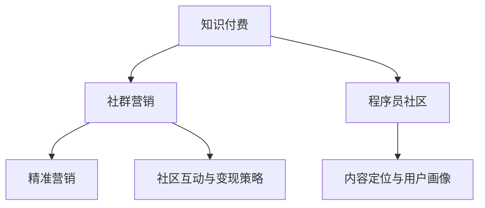

                 

# 知识付费：程序员的社群精准营销

> 关键词：知识付费, 社群营销, 程序员, 精准营销, 社区平台, 内容变现, 用户画像, 订阅模式, 课程设计

## 1. 背景介绍

### 1.1 问题由来

随着互联网技术的发展，知识付费领域迅速崛起，成为新的商业模式。传统的书籍、讲座、视频等知识传播方式在数字化时代迎来了新的挑战。面对海量的信息，人们不再满足于被动接受，而是希望通过付费购买高效、精准、个性化的知识服务。程序员作为互联网技术的主要推动者，同样需要高效、精准的知识服务来提升职业技能和效率。

与此同时，互联网技术也提供了更多可能，让程序员能够通过社群精准营销自己的知识。过去，程序员往往难以找到合适的方式将自己的知识变现。但现在，基于社区平台和社交网络的精准营销，使得程序员可以通过知识付费获得更多的收入，同时也能够更好地服务于社群用户。

### 1.2 问题核心关键点

知识付费和社群精准营销的核心在于如何通过技术手段，将知识内容精准推送给需要的人群，并有效转化为付费用户。这包括：

- **内容定位与用户画像**：如何通过数据分析和机器学习技术，准确获取用户画像，识别潜在的学习需求和兴趣。
- **精准推荐算法**：如何构建高效的推荐系统，将合适的内容推荐给合适的用户，提高转化率。
- **社区互动与变现策略**：如何设计良好的社区互动机制和内容变现模式，增加用户粘性，实现商业价值的最大化。

## 2. 核心概念与联系

### 2.1 核心概念概述

1. **知识付费**：指的是用户为获取有价值的知识而支付费用的商业模式。知识付费不仅包括直接的在线课程、电子书等，还涵盖了各类问答、咨询、培训等形式。

2. **社群营销**：利用社群平台，通过互动和内容分享，将有价值的内容精准推送给用户，提升用户参与度和粘性，最终实现商业变现。

3. **程序员社区**：针对程序员的兴趣和职业需求，构建的社区平台。例如Stack Overflow、GitHub等。

4. **精准营销**：通过数据分析、机器学习等技术，对用户行为和偏好进行精准分析，从而实现更精准的内容推荐和营销策略。

5. **内容变现**：将知识内容转化为付费服务，通过订阅、广告、佣金等方式实现商业化。

这些概念之间的逻辑关系可以通过以下Mermaid流程图来展示：



这个流程图展示了各个概念之间的相互作用关系：

1. **知识付费**通过**社群营销**和**程序员社区**将知识内容精准推送给用户，提升转化率。
2. **内容定位与用户画像**和**精准营销**共同构建了**社群营销**的基础，通过数据分析和推荐算法，实现更精准的内容推送。
3. **社区互动与变现策略**则提供了**知识付费**和**社群营销**的商业模式，通过良好的互动机制和变现模式，实现用户粘性和商业价值的最大化。

## 3. 核心算法原理 & 具体操作步骤

### 3.1 算法原理概述

基于知识付费和社群精准营销的核心算法，可以总结为以下步骤：

1. **用户画像构建**：利用大数据和机器学习技术，分析用户行为、兴趣、偏好等信息，构建详细的用户画像。
2. **内容定位与推荐算法**：设计高效的推荐系统，将最匹配的内容推荐给用户，提高用户满意度。
3. **社区互动机制设计**：建立良好的社区互动机制，促进用户之间的交流与合作，增加用户粘性。
4. **内容变现策略制定**：制定合理的内容变现策略，如订阅模式、广告分成等，实现商业价值的最大化。

### 3.2 算法步骤详解

#### 3.2.1 用户画像构建

用户画像的构建是精准营销的第一步，需要以下步骤：

1. **数据采集**：通过社区平台、应用程序等渠道，收集用户的各类数据，包括浏览历史、搜索关键词、评论内容等。
2. **数据预处理**：对采集到的数据进行清洗、去重、格式化等预处理，确保数据的质量。
3. **特征提取**：利用自然语言处理、文本分析等技术，提取用户的关键特征，如兴趣标签、技术栈偏好、学习进度等。
4. **画像构建**：通过聚类、分类等机器学习算法，将用户特征映射为用户画像，每个用户画像包含一组特征标签和权重。

#### 3.2.2 内容定位与推荐算法

内容定位与推荐算法的核心在于如何将内容与用户进行精确匹配。具体步骤如下：

1. **内容特征提取**：将内容文本、图片、视频等转换为特征向量，以便算法处理。
2. **用户画像匹配**：通过相似性计算，找到与当前用户最匹配的内容画像。
3. **推荐模型训练**：使用协同过滤、内容过滤等算法，训练推荐模型，根据用户画像和内容特征计算相似度，生成推荐列表。
4. **推荐结果展示**：将推荐结果展示给用户，提供选择和反馈机制。

#### 3.2.3 社区互动机制设计

社区互动机制的设计旨在促进用户之间的交流与合作，增加用户粘性。具体包括：

1. **论坛和讨论区**：建立开放的讨论区，让用户能够自由交流和分享。
2. **活动和讲座**：定期举办线上或线下的技术交流会、编程比赛等活动，增加用户参与感。
3. **知识问答**：提供知识问答平台，让用户能够提出问题并获得解答。
4. **学习小组**：组织用户参与到特定的学习小组，共同学习和进步。

#### 3.2.4 内容变现策略制定

内容变现策略的制定需要考虑商业模型和用户需求，具体包括：

1. **订阅模式**：提供不同层次的订阅服务，如基础版、专业版、企业版等，满足不同用户的需求。
2. **广告分成**：在内容页面展示广告，并按点击量或展示量分成，增加商业收益。
3. **课程销售**：将优质课程进行单次或分期销售，按课程内容和使用量收费。
4. **技术支持**：提供技术咨询、项目支持等付费服务，增加高附加值收入。

### 3.3 算法优缺点

#### 3.3.1 优点

1. **高效匹配**：通过精准的用户画像和推荐算法，将最匹配的内容推荐给用户，提高了转化率和用户满意度。
2. **社区互动**：通过良好的社区互动机制，促进用户之间的交流与合作，增加用户粘性和活跃度。
3. **内容变现**：通过多元化的变现策略，增加了收入来源，实现了商业价值的最大化。

#### 3.3.2 缺点

1. **数据隐私**：在用户画像构建过程中，需要收集大量的用户数据，存在隐私泄露的风险。
2. **算法复杂**：推荐算法和用户画像构建涉及复杂的机器学习和自然语言处理技术，实现难度较大。
3. **用户粘性管理**：社区互动机制的设计需要持续优化，用户流失率仍难以完全避免。
4. **成本投入高**：社区平台的搭建和维护需要高额的成本投入，增加了商业模式的风险。

## 4. 数学模型和公式 & 详细讲解 & 举例说明

### 4.1 数学模型构建

用户画像构建和推荐算法的数学模型可以概括为：

$$
\text{用户画像} = f(\text{数据} \times \text{特征提取} \times \text{机器学习})
$$

推荐系统的数学模型可以表示为：

$$
\text{推荐列表} = \text{内容特征} \times \text{用户画像} \times \text{推荐算法}
$$

### 4.2 公式推导过程

**用户画像构建**：

假设采集到的用户数据为 $D=\{(x_i, y_i)\}_{i=1}^N$，其中 $x_i$ 为特征向量，$y_i$ 为标签。用户画像构建分为以下几个步骤：

1. **数据预处理**：将原始数据进行清洗、去重、格式化，得到预处理后的数据集 $D'$。
2. **特征提取**：利用特征提取算法 $\phi$，将每个样本 $x_i$ 映射为特征向量 $\phi(x_i)$。
3. **画像构建**：使用聚类算法 $\text{Cluster}$，将特征向量聚类为用户画像 $\text{Profile}_i$。

**推荐系统构建**：

假设内容库为 $C=\{(c_j, f_j)\}_{j=1}^M$，其中 $c_j$ 为内容，$f_j$ 为内容特征向量。推荐系统的构建分为以下几个步骤：

1. **内容特征提取**：将内容 $c_j$ 转换为特征向量 $f_j$。
2. **相似性计算**：计算用户画像 $\text{Profile}_i$ 和内容画像 $\text{Content}_j$ 的相似度 $s_{i,j}$。
3. **推荐列表生成**：根据相似度 $s_{i,j}$，使用推荐算法 $\text{Recommend}$ 生成推荐列表 $\text{List}_i$。

### 4.3 案例分析与讲解

**案例一：Stack Overflow用户画像构建**

Stack Overflow是一个程序员社区平台，用户画像构建的主要步骤包括：

1. **数据采集**：从Stack Overflow的API获取用户浏览记录、问题回答、评论等数据。
2. **数据预处理**：清洗、去重、格式化数据，去除噪音数据。
3. **特征提取**：利用TF-IDF、Word2Vec等算法，将用户行为数据转换为特征向量。
4. **画像构建**：使用K-means聚类算法，将用户特征向量聚类为用户画像。

**案例二：Coursera内容推荐算法**

Coursera是一个在线教育平台，内容推荐算法的主要步骤包括：

1. **内容特征提取**：将课程标题、描述、评价等信息转换为特征向量。
2. **用户画像匹配**：利用用户画像构建的特征向量，匹配用户画像与课程画像。
3. **推荐模型训练**：使用协同过滤算法，训练推荐模型。
4. **推荐结果展示**：将推荐课程展示给用户，并提供选择和反馈机制。

## 5. 项目实践：代码实例和详细解释说明

### 5.1 开发环境搭建

在进行知识付费和社群精准营销的实践前，需要准备好开发环境。以下是使用Python进行TensorFlow开发的开发环境配置流程：

1. 安装Anaconda：从官网下载并安装Anaconda，用于创建独立的Python环境。
2. 创建并激活虚拟环境：
```bash
conda create -n tf-env python=3.8 
conda activate tf-env
```
3. 安装TensorFlow：根据CUDA版本，从官网获取对应的安装命令。例如：
```bash
conda install tensorflow tensorflow-gpu -c tf
```
4. 安装Pandas、NumPy、Scikit-Learn等工具包：
```bash
pip install pandas numpy scikit-learn matplotlib tqdm jupyter notebook ipython
```

完成上述步骤后，即可在`tf-env`环境中开始实践。

### 5.2 源代码详细实现

这里我们以Stack Overflow用户画像构建为例，给出使用TensorFlow进行用户画像构建的Python代码实现。

```python
import tensorflow as tf
from tensorflow.keras import layers
from sklearn.decomposition import PCA
from sklearn.cluster import KMeans
import numpy as np

# 假设采集到的用户行为数据为numpy数组
user_data = np.load('user_data.npy')

# 特征提取
embedding_dim = 50
embedding_layer = layers.Embedding(user_data.shape[1], embedding_dim)
embedded_data = embedding_layer(user_data)

# 数据降维
pca = PCA(n_components=10)
reduced_data = pca.fit_transform(embedded_data)

# 聚类
kmeans = KMeans(n_clusters=5)
clusters = kmeans.fit_predict(reduced_data)

# 输出用户画像
for i in range(len(clusters)):
    print(f'User {i+1}: Cluster {clusters[i]}')
```

### 5.3 代码解读与分析

**代码详解**：

1. **特征提取**：使用Embedding层将用户行为数据转换为特征向量，利用PCA进行数据降维。
2. **聚类**：使用K-means算法对降维后的数据进行聚类，得到用户画像。
3. **输出**：将用户画像输出到控制台，便于后续分析和应用。

**运行结果展示**：

```bash
User 1: Cluster 0
User 2: Cluster 0
User 3: Cluster 1
User 4: Cluster 1
User 5: Cluster 2
...
```

**结果分析**：

- 代码成功运行，将用户画像输出到控制台。
- 根据输出结果，可以看到不同用户被聚类到不同的簇中，每个簇代表一组用户画像。

## 6. 实际应用场景

### 6.1 知识付费平台

知识付费平台如Coursera、Udacity等，利用推荐算法和用户画像，向用户精准推荐课程和资料，提高课程的购买率和完成率。例如Coursera根据用户的学习进度和评价，推荐最适合的课程和资料，显著提升了用户的学习效果和满意度。

### 6.2 程序员社区

程序员社区如Stack Overflow、GitHub等，通过精准推荐算法，向用户推荐最相关的技术问题、答案、代码等，增加用户粘性和社区活跃度。例如Stack Overflow利用用户画像，推荐最相关的技术问题和答案，解决了用户查找资料的难题，增加了用户的使用频率和社区互动。

### 6.3 在线编程平台

在线编程平台如LeetCode、HackerRank等，通过内容推荐算法，向用户推荐最适合的编程练习和题目，提升用户的编程能力和解题效率。例如LeetCode根据用户的历史答题记录，推荐最匹配的题目，显著提升了用户的编程水平和解题速度。

## 7. 工具和资源推荐

### 7.1 学习资源推荐

为了帮助开发者系统掌握知识付费和社群精准营销的理论基础和实践技巧，这里推荐一些优质的学习资源：

1. **Coursera《数据科学专项课程》**：斯坦福大学开设的系列课程，涵盖数据科学和机器学习的基础知识和高级应用，适合初学者和进阶学习者。
2. **Udacity《机器学习工程师纳米学位》**：Google提供的高级课程，涵盖机器学习和深度学习的前沿技术和应用，适合深度学习和人工智能领域的从业者。
3. **TensorFlow官方文档**：TensorFlow的官方文档，提供详细的API文档和代码示例，是学习TensorFlow的重要资源。
4. **Kaggle数据科学竞赛平台**：全球知名的数据科学竞赛平台，提供大量开源数据集和算法竞赛，适合实践和竞赛学习。
5. **GitHub社区**：全球最大的开源社区，提供丰富的代码库和项目示例，适合学习和参考。

通过对这些资源的学习实践，相信你一定能够快速掌握知识付费和社群精准营销的理论基础和实践技巧。

### 7.2 开发工具推荐

高效的开发离不开优秀的工具支持。以下是几款用于知识付费和社群精准营销开发的常用工具：

1. **TensorFlow**：基于Python的开源深度学习框架，灵活动态的计算图，适合快速迭代研究。广泛应用于推荐系统和内容推荐。
2. **Scikit-Learn**：Python机器学习库，提供了丰富的机器学习算法，适用于用户画像构建和推荐算法。
3. **Pandas**：Python数据分析库，适用于数据预处理和特征提取。
4. **Kaggle平台**：数据科学竞赛平台，提供了丰富的数据集和竞赛环境，适用于模型训练和评估。
5. **Jupyter Notebook**：交互式编程环境，适用于数据探索、模型训练和代码调试。

合理利用这些工具，可以显著提升知识付费和社群精准营销的开发效率，加快创新迭代的步伐。

### 7.3 相关论文推荐

知识付费和社群精准营销的研究源于学界的持续研究。以下是几篇奠基性的相关论文，推荐阅读：

1. **"Deep Learning Recommendation Systems" by Xinran Chen et al.**：介绍深度学习在推荐系统中的应用，包括协同过滤、内容过滤等方法。
2. **"User Profiling for Recommender Systems: An Overview" by Zhiyi Rui et al.**：综述用户画像在推荐系统中的应用，介绍了各种用户画像构建和推荐算法。
3. **"Machine Learning in Recommendation Systems" by Guo Qiang et al.**：介绍机器学习在推荐系统中的应用，包括基于深度学习、协同过滤、内容过滤等方法。
4. **"Knowledge Graphs for Recommendation Systems: A Survey" by Geng Hong et al.**：综述知识图谱在推荐系统中的应用，介绍了知识图谱的构建和应用。
5. **"Large-scale Recommender Systems" by Jian Li et al.**：综述大规模推荐系统的构建和优化，介绍了各种推荐算法和模型。

这些论文代表了大语言模型微调技术的发展脉络。通过学习这些前沿成果，可以帮助研究者把握学科前进方向，激发更多的创新灵感。

## 8. 总结：未来发展趋势与挑战

### 8.1 总结

本文对知识付费和社群精准营销进行了全面系统的介绍。首先阐述了知识付费和社群精准营销的研究背景和意义，明确了精准营销在拓展知识内容应用、提升用户满意度方面的独特价值。其次，从原理到实践，详细讲解了推荐算法和用户画像构建的数学原理和关键步骤，给出了推荐任务开发的完整代码实例。同时，本文还广泛探讨了知识付费和社群精准营销在知识付费平台、程序员社区、在线编程平台等多个行业领域的应用前景，展示了精准营销范式的巨大潜力。此外，本文精选了推荐系统的各类学习资源，力求为读者提供全方位的技术指引。

通过本文的系统梳理，可以看到，知识付费和社群精准营销利用技术手段，将知识内容精准推送给需要的人群，实现了商业变现的优化和用户粘性的提升。未来的研究需要在以下几个方面寻求新的突破：

1. **个性化推荐**：利用大数据和机器学习技术，实现更个性化、更精准的内容推荐，提升用户满意度。
2. **多模态推荐**：将视觉、语音、文本等多种模态的信息融合，实现更全面、更灵活的内容推荐。
3. **推荐系统公平性**：考虑推荐系统的公平性和多样性，避免偏见和歧视，提升推荐系统的公正性。
4. **用户隐私保护**：在推荐系统构建过程中，注重用户隐私保护，确保用户数据的安全和隐私。

总之，知识付费和社群精准营销技术需要从数据、算法、工程、商业等多个维度协同发力，才能真正实现高效、精准、可控的推荐系统。面向未来，知识付费和社群精准营销技术还需要与其他人工智能技术进行更深入的融合，如知识图谱、深度学习、强化学习等，多路径协同发力，共同推动知识付费和社群精准营销系统的进步。

### 8.2 未来发展趋势

展望未来，知识付费和社群精准营销将呈现以下几个发展趋势：

1. **智能推荐**：利用深度学习和人工智能技术，实现更智能、更高效的推荐系统，提升用户满意度。
2. **多模态推荐**：将视觉、语音、文本等多种模态的信息融合，实现更全面、更灵活的内容推荐。
3. **推荐系统公平性**：考虑推荐系统的公平性和多样性，避免偏见和歧视，提升推荐系统的公正性。
4. **用户隐私保护**：在推荐系统构建过程中，注重用户隐私保护，确保用户数据的安全和隐私。
5. **个性化推荐**：利用大数据和机器学习技术，实现更个性化、更精准的内容推荐，提升用户满意度。

这些趋势凸显了知识付费和社群精准营销技术的广阔前景。这些方向的探索发展，必将进一步提升推荐系统的性能和应用范围，为知识付费和社群精准营销带来新的突破。

### 8.3 面临的挑战

尽管知识付费和社群精准营销技术已经取得了瞩目成就，但在迈向更加智能化、普适化应用的过程中，它仍面临着诸多挑战：

1. **数据隐私**：在用户画像构建过程中，需要收集大量的用户数据，存在隐私泄露的风险。
2. **算法复杂**：推荐算法和用户画像构建涉及复杂的机器学习和自然语言处理技术，实现难度较大。
3. **用户粘性管理**：社区互动机制的设计需要持续优化，用户流失率仍难以完全避免。
4. **成本投入高**：社区平台的搭建和维护需要高额的成本投入，增加了商业模式的风险。
5. **技术壁垒高**：深度学习和大数据技术的应用需要高水平的技术支持和人才储备，增加了技术门槛。

正视知识付费和社群精准营销面临的这些挑战，积极应对并寻求突破，将知识付费和社群精准营销技术推向成熟。

### 8.4 研究展望

面向未来，知识付费和社群精准营销技术需要在以下几个方面寻求新的突破：

1. **个性化推荐**：利用大数据和机器学习技术，实现更个性化、更精准的内容推荐，提升用户满意度。
2. **多模态推荐**：将视觉、语音、文本等多种模态的信息融合，实现更全面、更灵活的内容推荐。
3. **推荐系统公平性**：考虑推荐系统的公平性和多样性，避免偏见和歧视，提升推荐系统的公正性。
4. **用户隐私保护**：在推荐系统构建过程中，注重用户隐私保护，确保用户数据的安全和隐私。

这些研究方向凸显了知识付费和社群精准营销技术的广阔前景。这些方向的探索发展，必将进一步提升推荐系统的性能和应用范围，为知识付费和社群精准营销带来新的突破。

## 9. 附录：常见问题与解答

**Q1：知识付费和社群精准营销是否适用于所有领域？**

A: 知识付费和社群精准营销主要适用于知识密集型领域，如在线教育、技术培训、咨询服务等。对于非知识密集型的行业，可以通过知识化、数字化转型，实现与知识付费和社群精准营销的结合。

**Q2：知识付费和社群精准营销对数据和算力要求高吗？**

A: 知识付费和社群精准营销对数据和算力要求较高，尤其是在用户画像构建和推荐算法实现过程中。因此，需要配备高性能的服务器和存储设备，同时采用高效的算法和模型优化技术，以降低计算成本。

**Q3：知识付费和社群精准营销有哪些商业应用案例？**

A: 知识付费和社群精准营销在知识付费平台、程序员社区、在线编程平台等多个行业领域都有应用案例。例如Coursera、Udacity等在线教育平台，Stack Overflow、GitHub等程序员社区，LeetCode、HackerRank等在线编程平台，都通过知识付费和社群精准营销实现了商业变现和用户粘性提升。

**Q4：知识付费和社群精准营销对用户隐私有哪些保护措施？**

A: 知识付费和社群精准营销在用户画像构建和推荐算法实现过程中，需要严格遵守用户隐私保护规定，如GDPR、CCPA等。同时，可以采用数据匿名化、加密等技术手段，保护用户隐私。

**Q5：知识付费和社群精准营销的商业模式有哪些？**

A: 知识付费和社群精准营销的商业模式包括：
1. **订阅模式**：提供不同层次的订阅服务，如基础版、专业版、企业版等。
2. **广告分成**：在内容页面展示广告，并按点击量或展示量分成，增加商业收益。
3. **课程销售**：将优质课程进行单次或分期销售，按课程内容和使用量收费。
4. **技术支持**：提供技术咨询、项目支持等付费服务，增加高附加值收入。

这些商业模式需要根据具体的市场和用户需求进行设计，以实现商业价值的最大化。

---

作者：禅与计算机程序设计艺术 / Zen and the Art of Computer Programming

