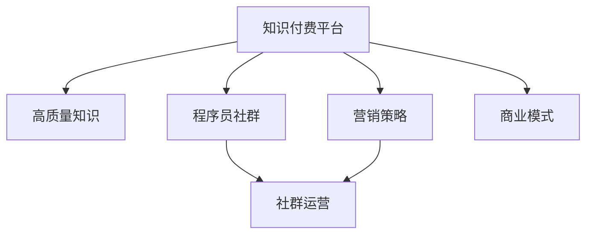

                 

# 知识付费：程序员的社群运营战术

> 关键词：知识付费, 程序员, 社群运营, 营销策略, 商业模式

## 1. 背景介绍

### 1.1 问题由来
在数字化时代，信息爆炸与知识碎片化愈发明显，人们更加倾向于从精准的、高质量的内容中获取所需知识。与此同时，互联网和移动设备普及程度的提升，使得获取知识的途径更加便捷。在这种趋势下，知识付费平台应运而生，成为连接知识创造者与消费者的新型桥梁。

对于程序员而言，知识付费平台不仅可以提供编程语言、开发工具、技术框架、算法设计等专业知识，还能够帮助其快速掌握最新行业动态，提升技术水平，拓展职业发展。因此，程序员成为知识付费平台的重要用户群体。

### 1.2 问题核心关键点
程序员作为知识付费平台的核心用户，对其社群运营战术的探讨具有重要意义：

- **知识提供**：平台如何筛选和推送高质量的编程知识？
- **社群互动**：平台如何构建活跃、有粘性的程序员社群？
- **变现模式**：平台如何实现盈利，确保可持续发展？
- **营销策略**：如何精准触达程序员，提升用户转化率？
- **技术支持**：如何利用技术手段提升运营效率，降低成本？

这些关键点共同构成了程序员知识付费平台社群运营的挑战与机遇。

## 2. 核心概念与联系

### 2.1 核心概念概述

为更好地理解知识付费平台面向程序员的社群运营战术，本节将介绍几个密切相关的核心概念：

- **知识付费平台**：指通过互联网提供高质量知识内容，并收取相应费用的平台，如得到、知识星球、知乎付费等。
- **程序员社群**：指以程序员为主体，围绕技术交流、职业发展、生活分享等主题构建的线上社群，如Stack Overflow、GitHub社区、Reddit的r/programming等。
- **社群运营**：指通过策略、工具、技术等手段，推动社群成员间的互动与交流，提升社群活跃度和粘性。
- **营销策略**：指在特定用户群体（程序员）中推广知识付费平台的策略与手段，包括内容推荐、广告投放、社区活动等。
- **商业模式**：指知识付费平台的盈利方式，包括付费订阅、按需付费、广告分成等。

这些概念之间的关系可以通过以下Mermaid流程图来展示：



这个流程图展示了几大核心概念及其之间的关系：

1. 知识付费平台通过提供高质量知识吸引用户，进而形成社群。
2. 社群运营通过互动与交流，提升社群成员的粘性和活跃度。
3. 营销策略推动用户转化，提高平台用户量和订阅率。
4. 商业模式通过各种方式实现平台的盈利和可持续发展。

这些概念共同构成了知识付费平台面向程序员的运营框架，使其能够有效连接知识创作者与消费者，实现商业价值。

## 3. 核心算法原理 & 具体操作步骤
### 3.1 算法原理概述

面向程序员的知识付费平台运营，本质上是一种基于数据驱动的社群运营过程。其核心思想是：通过精准推送高质量编程知识，激发社群互动，形成良性循环，并通过有效的营销策略和商业模式实现平台盈利。

具体而言，包括以下几个步骤：

1. **数据获取与分析**：收集程序员的搜索行为、订阅记录、互动日志等数据，分析其需求与兴趣。
2. **内容筛选与推送**：基于分析结果，筛选并推送与程序员兴趣匹配的高质量编程知识。
3. **社群互动与反馈**：通过评论、点赞、分享等互动机制，提升社群成员的粘性和活跃度，并收集反馈信息，优化内容推送。
4. **营销推广**：结合数据洞察，策划有针对性的营销活动，吸引新用户，并提升现有用户的续费率。
5. **商业变现**：探索多种商业模式，实现平台的可持续发展。

### 3.2 算法步骤详解

面向程序员的知识付费平台运营，主要包括以下关键步骤：

**Step 1: 数据获取与分析**
- 收集程序员在平台上的各类行为数据，包括搜索历史、订阅记录、互动日志等。
- 利用数据挖掘与机器学习技术，分析程序员的需求和兴趣点。
- 通过聚类算法（如K-means）对程序员进行兴趣分类，生成用户画像。

**Step 2: 内容筛选与推送**
- 根据程序员画像，筛选出与程序员兴趣匹配的高质量编程知识，包括课程、文章、视频等。
- 利用协同过滤算法（如ALS），为程序员推荐与其兴趣相似的其他用户订阅的知识内容。
- 通过增量式更新算法（如Adaptive RFM），实时调整知识推送策略，优化用户体验。

**Step 3: 社群互动与反馈**
- 设计评论、点赞、分享、提问等互动机制，促进社群成员间的交流。
- 利用情感分析算法（如TextBlob），分析程序员对内容的情感倾向，优化内容质量。
- 采用用户反馈循环机制，根据社群互动数据，不断优化内容推送策略。

**Step 4: 营销推广**
- 结合程序员的兴趣画像，策划有针对性的营销活动，如专题讲座、在线竞赛等。
- 利用程序化广告投放技术，通过平台内部的展示位、搜索结果、推送通知等渠道，精准触达程序员。
- 运用A/B测试和多臂老虎机（Multi-Armed Bandit）算法，评估营销策略的效果，进行动态调整。

**Step 5: 商业变现**
- 探索多种商业模式，包括付费订阅、按需付费、广告分成等。
- 利用经济计量模型（如线性回归、时间序列分析），预测用户续费率和广告点击率，优化定价策略。
- 通过区块链技术（如以太坊智能合约），保障平台与内容创作者的交易安全。

通过上述步骤，知识付费平台可以有效地运营面向程序员的社群，实现商业价值。

### 3.3 算法优缺点

面向程序员的知识付费平台运营，具有以下优点：

1. **精准推送**：通过数据分析与算法推荐，能够精准推送程序员感兴趣的高质量知识，提升用户体验。
2. **互动活跃**：设计多样化的互动机制，促进程序员间的交流与协作，形成活跃的社群氛围。
3. **高效运营**：通过技术手段优化数据处理与内容推荐，降低运营成本，提高效率。
4. **多样化变现**：探索多种商业模式，确保平台的可持续发展。

同时，该方法也存在一定的局限性：

1. **数据隐私**：收集和分析程序员行为数据可能引发隐私问题，需要严格的数据保护措施。
2. **算法偏差**：算法推荐可能存在一定的偏差，影响推荐的公平性和准确性。
3. **技术门槛**：需要对数据科学、机器学习、区块链等技术有一定的了解，才能有效实施。
4. **市场竞争**：面临来自其他知识付费平台的竞争，需要不断创新以保持竞争力。

尽管存在这些局限性，但就目前而言，基于数据驱动的运营策略仍是大语言模型微调范式中的主流方法。未来相关研究的重点在于如何进一步提升运营的精准性和公平性，同时兼顾隐私和安全性等因素。

### 3.4 算法应用领域

面向程序员的知识付费平台运营，在多个领域已经得到了广泛应用，包括但不限于：

- **编程学习**：提供从入门到进阶的编程课程，满足程序员的多层次学习需求。
- **技术资讯**：实时推送最新技术动态、开源项目、技术社区等，帮助程序员掌握行业前沿。
- **职业发展**：提供简历指导、面试准备、职业规划等职业发展相关内容。
- **问题解决**：通过社区问答、技术支持等方式，帮助程序员解决编程中遇到的问题。
- **生活分享**：提供工作心得、生活感悟、兴趣分享等，促进程序员间的情感交流。

除了上述这些经典应用外，面向程序员的知识付费平台还在不断拓展新的领域，如编程游戏、开发竞赛、技能认证等，为程序员提供了更多元化的学习和交流途径。

## 4. 数学模型和公式 & 详细讲解  
### 4.1 数学模型构建

本节将使用数学语言对知识付费平台面向程序员的运营过程进行更加严格的刻画。

记程序员群体为 $G$，知识内容为 $K$，知识付费平台为 $P$。假设平台通过用户画像算法 $f_G$，将程序员群体分为 $k$ 类兴趣群体 $G_1, G_2, ..., G_k$。

平台的内容推送模型为 $M_K$，用于根据用户画像推荐高质量知识内容。模型的输入为程序员画像 $f_G(x)$，输出为推荐内容集合 $K$。

平台的营销策略为 $S_P$，用于策划有针对性的营销活动。策略的输入为知识付费平台 $P$ 和程序员画像 $f_G(x)$，输出为营销活动列表 $S$。

平台的商业模式为 $C_P$，用于实现商业变现。商业模式的输入为知识付费平台 $P$ 和程序员画像 $f_G(x)$，输出为商业收益 $R$。

### 4.2 公式推导过程

以下我们以推荐系统为例，推导推荐算法及其梯度计算公式。

假设程序员画像为 $x \in \mathbb{R}^n$，知识内容的特征向量为 $y \in \mathbb{R}^m$，推荐算法 $M_K$ 为矩阵分解模型，即：

$$
\hat{y} = \mathcal{A}x \cdot \mathcal{B}^T
$$

其中 $\mathcal{A}$ 为程序员画像矩阵，$\mathcal{B}$ 为知识内容矩阵。

推荐算法 $M_K$ 的损失函数为均方误差损失函数，即：

$$
\mathcal{L}(M_K) = \frac{1}{N} \sum_{i=1}^N (y_i - \hat{y}_i)^2
$$

其梯度为：

$$
\nabla_{\mathcal{A}}\mathcal{L}(M_K) = -2\frac{1}{N}\sum_{i=1}^N (y_i - \hat{y}_i)(\mathcal{B}_i^T) \in \mathbb{R}^{n \times m}
$$

通过梯度下降等优化算法，推荐算法不断更新参数 $\mathcal{A}$，最小化损失函数 $\mathcal{L}(M_K)$，使得推荐结果逼近真实标签。重复上述过程直至收敛，最终得到适应程序员兴趣的推荐模型 $M_{K^*}$。

在得到推荐模型后，平台可以依据程序员画像和推荐模型，实现内容推荐策略 $S_P$ 和商业变现模型 $C_P$。

## 5. 项目实践：代码实例和详细解释说明
### 5.1 开发环境搭建

在进行知识付费平台面向程序员的运营实践前，我们需要准备好开发环境。以下是使用Python进行PyTorch开发的环境配置流程：

1. 安装Anaconda：从官网下载并安装Anaconda，用于创建独立的Python环境。

2. 创建并激活虚拟环境：
```bash
conda create -n pytorch-env python=3.8 
conda activate pytorch-env
```

3. 安装PyTorch：根据CUDA版本，从官网获取对应的安装命令。例如：
```bash
conda install pytorch torchvision torchaudio cudatoolkit=11.1 -c pytorch -c conda-forge
```

4. 安装TensorFlow：
```bash
conda install tensorflow tensorflow-gpu
```

5. 安装各类工具包：
```bash
pip install numpy pandas scikit-learn matplotlib tqdm jupyter notebook ipython
```

完成上述步骤后，即可在`pytorch-env`环境中开始运营实践。

### 5.2 源代码详细实现

这里我们以基于协同过滤推荐算法为例，展示使用PyTorch进行面向程序员的推荐系统开发。

首先，定义协同过滤推荐算法的类：

```python
import torch
import torch.nn as nn
from torch.nn import functional as F

class CollaborativeFiltering(nn.Module):
    def __init__(self, n_users, n_items, embedding_dim=128):
        super(CollaborativeFiltering, self).__init__()
        self.user_matrix = nn.EmbeddingBag(n_users, embedding_dim)
        self.item_matrix = nn.EmbeddingBag(n_items, embedding_dim)
        self.lin = nn.Linear(embedding_dim * 2, 1)

    def forward(self, user_vector, item_vector):
        user_embed = self.user_matrix(user_vector).sum(dim=1)
        item_embed = self.item_matrix(item_vector).sum(dim=1)
        lin_input = torch.cat((user_embed, item_embed), dim=1)
        prediction = self.lin(lin_input)
        return prediction
```

然后，训练模型并推荐内容：

```python
import pandas as pd
import numpy as np
from sklearn.model_selection import train_test_split
from scipy.sparse import coo_matrix

# 读取用户行为数据
data = pd.read_csv('user_behavior.csv', index_col='user_id')

# 构造稀疏矩阵
user_ids, item_ids, ratings = data['user_id'], data['item_id'], data['rating']
user_item_matrix = coo_matrix((ratings, (user_ids, item_ids)), shape=(max(user_ids) + 1, max(item_ids) + 1))

# 划分数组数据
train_data, test_data = train_test_split(user_item_matrix, test_size=0.2, random_state=42)

# 定义训练函数
def train_model(model, optimizer, train_data, test_data):
    device = torch.device('cuda') if torch.cuda.is_available() else torch.device('cpu')
    model.to(device)
    optimizer = torch.optim.Adam(model.parameters(), lr=0.01)

    for epoch in range(1, 11):
        model.train()
        loss = 0.0
        for user, item, rating in train_data:
            user_vector = torch.LongTensor(user)
            item_vector = torch.LongTensor(item)
            rating_tensor = torch.FloatTensor([rating]).to(device)
            optimizer.zero_grad()
            output = model(user_vector, item_vector)
            loss += F.mse_loss(output.view(-1), rating_tensor).to(device)
            loss.backward()
            optimizer.step()
        train_loss = loss / len(train_data)
        model.eval()
        with torch.no_grad():
            loss = 0.0
            for user, item, rating in test_data:
                user_vector = torch.LongTensor(user)
                item_vector = torch.LongTensor(item)
                rating_tensor = torch.FloatTensor([rating]).to(device)
                output = model(user_vector, item_vector)
                loss += F.mse_loss(output.view(-1), rating_tensor).to(device)
            test_loss = loss / len(test_data)
        print(f"Epoch {epoch}, train loss: {train_loss:.3f}, test loss: {test_loss:.3f}")

    return model

# 训练推荐模型
model = CollaborativeFiltering(n_users=2000, n_items=2000)
model = train_model(model, optimizer, train_data, test_data)

# 推荐内容
def recommend(model, user_id, n_recommendations=10):
    user_vector = torch.LongTensor([user_id])
    user_item_matrix = user_item_matrix[user_vector].nonzero().tocoo().indices
    user_item_matrix = torch.tensor(user_item_matrix.T, dtype=torch.long)
    item_vector = user_item_matrix[1]
    recommendations = []
    for _ in range(n_recommendations):
        item_vector = torch.LongTensor(item_vector)
        rating = model(user_vector, item_vector).squeeze(1).tolist()
        rating_indices = torch.argsort(rating, descending=True)
        recommendations.append(item_vector[rating_indices[0]])
        item_vector = item_vector[rating_indices[1:]]

    return recommendations
```

以上就是使用PyTorch进行协同过滤推荐系统的代码实现。可以看到，通过简单的逻辑封装和算法实现，我们即可快速搭建推荐系统，实现内容推荐功能。

### 5.3 代码解读与分析

让我们再详细解读一下关键代码的实现细节：

**CollaborativeFiltering类**：
- `__init__`方法：定义模型的结构，包括用户矩阵、物品矩阵和线性层。
- `forward`方法：前向传播计算推荐结果。
- `train_model`函数：定义训练过程，包含前向传播、反向传播和优化器更新。
- `recommend`函数：根据用户行为数据，推荐程序员可能感兴趣的内容。

**train_model函数**：
- 定义训练数据和测试数据。
- 构建稀疏矩阵，以表示程序员与知识内容之间的交互关系。
- 定义训练函数，循环迭代训练模型。
- 在每个epoch中，计算损失函数并进行反向传播。
- 在训练结束后，计算模型在测试数据上的损失，并输出结果。

**recommend函数**：
- 根据程序员的行为数据，提取程序员与知识内容的交互关系。
- 定义推荐函数，依次为程序员推荐最可能感兴趣的知识内容。

可以看出，通过简单的代码实现，我们能够有效地构建面向程序员的推荐系统，提升用户体验，实现内容的精准推送。

当然，实际运营中还需要考虑更多因素，如推荐算法的多样性、用户反馈的实时处理、营销活动的策划与执行等。但核心的算法逻辑和代码实现，可以帮助运营者快速构建推荐系统，并根据实际需求进行优化。

## 6. 实际应用场景
### 6.1 程序员学习平台

面向程序员的学习平台可以为用户提供从初级到高级的编程课程，满足不同层次的学习需求。通过精准的课程推荐和互动学习社区，平台能够有效提升程序员的学习效率和效果。

具体而言，平台可以收集程序员的浏览、搜索、订阅、互动等行为数据，利用协同过滤、基于内容的推荐等算法，为程序员推荐最符合其兴趣的课程和资料。同时，平台还可以设计在线课程、实战项目、编程挑战等多种学习形式，吸引程序员持续参与学习。

### 6.2 技术资讯平台

面向程序员的技术资讯平台主要提供最新的技术动态、开源项目、技术社区等，帮助程序员掌握行业前沿，了解最新技术趋势。通过精准的新闻推荐和社区讨论，平台能够激发程序员的积极参与，形成活跃的社群氛围。

在技术资讯平台的运营中，可以通过爬虫技术抓取热门技术新闻，利用自然语言处理技术对新闻进行主题分类，再根据程序员画像进行精准推送。同时，平台还可以设计技术讨论区、开源项目分享、技术峰会直播等多种互动形式，促进程序员之间的交流与合作。

### 6.3 职业发展平台

面向程序员的职业发展平台主要提供简历指导、面试准备、职业规划等职业发展相关内容，帮助程序员提升职业竞争力。通过职业发展的课程和指导，平台能够为程序员的职业转型和晋升提供支持。

在职业发展平台的运营中，可以通过收集程序员的职业发展需求，利用聚类算法和关联规则挖掘等技术，为程序员推荐最符合其职业发展规划的内容和资源。同时，平台还可以设计职业规划咨询、职业指导课程、企业合作推荐等多种服务形式，帮助程序员实现职业目标。

### 6.4 未来应用展望

随着知识付费平台的发展，面向程序员的运营策略也在不断演进。未来，平台可能会拓展更多的应用场景，如编程游戏、开发竞赛、技能认证等，为程序员提供更多元化的学习和交流途径。

此外，随着人工智能和大数据分析技术的进步，平台的运营策略也将更加智能化和个性化。通过AI算法和数据挖掘技术，平台能够更好地理解程序员的需求，提供更精准的内容推荐和互动形式，进一步提升用户体验。

## 7. 工具和资源推荐
### 7.1 学习资源推荐

为了帮助开发者系统掌握知识付费平台的运营理论基础和实践技巧，这里推荐一些优质的学习资源：

1. 《推荐系统实战》书籍：由权威推荐系统专家撰写，系统介绍了推荐算法的原理与实现。
2. 《数据科学实战》课程：由知名数据科学社区提供，涵盖数据挖掘、机器学习等核心内容，是数据科学入门必选。
3. 《程序员社区运营指南》博客：由资深社区运营专家撰写，分享了多种社区运营的策略与技巧。
4. 《知识付费平台商业模式》讲座：由顶尖商学院教授主讲，探讨知识付费平台的盈利模式和运营策略。

通过对这些资源的学习实践，相信你一定能够快速掌握知识付费平台的运营技巧，并用于解决实际的运营问题。

### 7.2 开发工具推荐

高效的开发离不开优秀的工具支持。以下是几款用于知识付费平台面向程序员的运营开发的常用工具：

1. Apache Spark：用于大数据处理和机器学习任务，适合海量数据下的推荐算法开发。
2. Apache Kafka：用于数据流处理和消息传输，适合实时数据下的推荐系统构建。
3. ELK Stack：用于日志管理和搜索分析，适合用户行为数据的收集与分析。
4. Jupyter Notebook：用于数据科学和机器学习任务的开发与测试。
5. PyCharm：专业的Python开发工具，支持智能代码补全、版本控制等高级功能。

合理利用这些工具，可以显著提升知识付费平台面向程序员的运营效率，加快创新迭代的步伐。

### 7.3 相关论文推荐

知识付费平台面向程序员的运营策略涉及多个前沿技术，以下是几篇奠基性的相关论文，推荐阅读：

1. "Collaborative Filtering for Implicit Feedback Datasets"：由eBay团队发表，介绍协同过滤算法的基本原理和实现方法。
2. "Recommender Systems Handbook"：由推荐系统专家撰写，全面介绍了推荐系统的理论基础和最新进展。
3. "Adaptive Ranking for Collaborative Filtering"：由新加坡南洋理工团队发表，介绍自适应排序算法在推荐系统中的应用。
4. "Knowledge-Based Recommendation System"：由斯坦福大学团队发表，介绍基于知识的推荐系统在推荐算法中的应用。
5. "Optimizing Recommendation by Contextual Bandits"：由Google团队发表，介绍上下文感知推荐算法在推荐系统中的应用。

这些论文代表了大语言模型微调技术的发展脉络。通过学习这些前沿成果，可以帮助研究者把握学科前进方向，激发更多的创新灵感。

## 8. 总结：未来发展趋势与挑战

### 8.1 总结

本文对知识付费平台面向程序员的运营策略进行了全面系统的介绍。首先阐述了面向程序员的知识付费平台的背景和意义，明确了运营策略在提升用户体验和平台价值方面的重要作用。其次，从原理到实践，详细讲解了面向程序员的知识付费平台运营的数学原理和关键步骤，给出了运营任务开发的完整代码实例。同时，本文还广泛探讨了面向程序员的运营策略在多个行业领域的应用前景，展示了运营策略的巨大潜力。此外，本文精选了运营策略的相关学习资源，力求为读者提供全方位的技术指引。

通过本文的系统梳理，可以看到，面向程序员的知识付费平台运营策略在大语言模型微调范式中具有重要价值。这些策略不仅能够提升用户体验，还能有效实现商业变现，构建具有可持续性的知识付费平台。未来，随着人工智能和大数据分析技术的进步，知识付费平台的运营策略将更加智能化和个性化，进一步拓展其应用范围，引领知识付费行业的发展方向。

### 8.2 未来发展趋势

面向程序员的知识付费平台运营策略将呈现以下几个发展趋势：

1. **个性化推荐**：利用大数据和机器学习技术，实现个性化推荐系统，满足程序员的多样化需求。
2. **互动社区**：构建活跃的互动社区，促进程序员之间的交流与合作，形成强大的社群力量。
3. **AI驱动**：引入AI技术，提升内容推荐和社区管理的智能化水平，提高运营效率。
4. **多模态融合**：结合图像、视频、语音等多模态数据，提升推荐系统的丰富度和准确性。
5. **多渠道推广**：通过社交媒体、搜索引擎、合作伙伴等多种渠道推广平台，扩大用户覆盖面。
6. **区块链应用**：引入区块链技术，保障内容创作者和用户的数据安全，提升平台信任度。

以上趋势凸显了面向程序员的知识付费平台运营策略的前景，这些方向的探索发展，必将进一步提升平台的用户体验和运营效率，为知识付费行业带来更多创新和机遇。

### 8.3 面临的挑战

尽管面向程序员的知识付费平台运营策略已经取得了显著成就，但在迈向更加智能化、普适化应用的过程中，仍面临诸多挑战：

1. **数据隐私保护**：在运营过程中，需要严格保护程序员的隐私数据，防止数据泄露和滥用。
2. **算法公平性**：推荐算法可能存在一定的偏差，影响推荐的公平性和多样性。
3. **平台稳定性**：在处理海量用户数据和复杂算法时，需要保证平台的稳定性和高可用性。
4. **用户流失**：如何有效提升用户粘性，防止用户流失，是平台运营面临的重要问题。
5. **商业模式创新**：在激烈的市场竞争中，需要不断创新商业模式，确保平台的可持续发展。

尽管存在这些挑战，但面向程序员的知识付费平台运营策略仍是大语言模型微调范式中的主流方法。未来相关研究的重点在于如何进一步提升运营的精准性和公平性，同时兼顾隐私和安全性等因素。

### 8.4 研究展望

面对知识付费平台运营策略所面临的挑战，未来的研究需要在以下几个方面寻求新的突破：

1. **数据治理**：研究如何构建和治理程序员数据资产，保障数据安全和隐私。
2. **算法优化**：开发更加高效、公平的推荐算法，提升推荐系统的准确性和多样性。
3. **用户行为分析**：深入研究程序员的行为模式和心理特征，优化内容和社区管理策略。
4. **跨平台融合**：实现跨平台的多渠道推广，提升用户覆盖面和转化率。
5. **区块链应用**：探索区块链技术在知识付费平台中的应用，保障内容创作者和用户的数据安全。

这些研究方向的探索，必将引领面向程序员的知识付费平台运营策略迈向更高的台阶，为知识付费行业带来更多创新和机遇。面向未来，知识付费平台的运营策略还需要与其他人工智能技术进行更深入的融合，如知识表示、因果推理、强化学习等，多路径协同发力，共同推动知识付费行业的发展方向。只有勇于创新、敢于突破，才能不断拓展知识付费平台的边界，让知识付费平台更好地服务于程序员，提升其工作效率和生活质量。

## 9. 附录：常见问题与解答

**Q1：知识付费平台如何筛选和推送高质量的编程知识？**

A: 知识付费平台可以通过数据挖掘与机器学习技术，分析程序员的需求和兴趣点，筛选并推送与程序员兴趣匹配的高质量编程知识。具体而言，平台可以收集程序员的浏览、搜索、订阅、互动等行为数据，利用协同过滤、基于内容的推荐等算法，为程序员推荐最符合其兴趣的课程和资料。同时，平台还可以通过用户反馈循环机制，不断优化内容推送策略，提升用户体验。

**Q2：知识付费平台如何构建活跃、有粘性的程序员社群？**

A: 知识付费平台可以通过设计多样化的互动机制，促进程序员之间的交流与协作，形成活跃的社群氛围。具体而言，平台可以设计在线课程、实战项目、编程挑战等多种学习形式，吸引程序员持续参与学习。同时，平台还可以设计技术讨论区、开源项目分享、技术峰会直播等多种互动形式，促进程序员之间的交流与合作。此外，平台还可以通过定期举办线上线下活动，增强社群的凝聚力和黏性。

**Q3：知识付费平台如何实现盈利，确保可持续发展？**

A: 知识付费平台可以通过多种商业模式，实现商业变现，确保平台的可持续发展。具体而言，平台可以探索付费订阅、按需付费、广告分成等多种盈利模式。同时，平台还可以通过开源项目、技术社区、企业合作等多种方式，拓展平台的收入来源。此外，平台还可以引入区块链技术，保障内容创作者和用户的数据安全，提升平台信任度，吸引更多用户和创作者参与。

**Q4：知识付费平台如何精准触达程序员，提升用户转化率？**

A: 知识付费平台可以通过程序化广告投放技术，精准触达程序员，提升用户转化率。具体而言，平台可以利用程序员的兴趣画像，策划有针对性的营销活动，如专题讲座、在线竞赛等。同时，平台还可以通过平台内部的展示位、搜索结果、推送通知等渠道，精准触达程序员，提升用户转化率。此外，平台还可以利用A/B测试和多臂老虎机（Multi-Armed Bandit）算法，评估营销策略的效果，进行动态调整。

**Q5：知识付费平台如何利用技术手段提升运营效率，降低成本？**

A: 知识付费平台可以通过技术手段优化数据处理与内容推荐，降低运营成本，提高效率。具体而言，平台可以利用大数据处理和机器学习技术，提升推荐算法的准确性和效率。同时，平台还可以通过算法优化和模型压缩等技术，提升平台的性能和响应速度，降低计算和存储成本。此外，平台还可以引入AI技术，提升内容推荐和社区管理的智能化水平，提高运营效率。

这些问题的解答，希望能对知识付费平台面向程序员的运营策略提供更多帮助，提升平台的运营效果，实现商业价值的最大化。

---

作者：禅与计算机程序设计艺术 / Zen and the Art of Computer Programming

