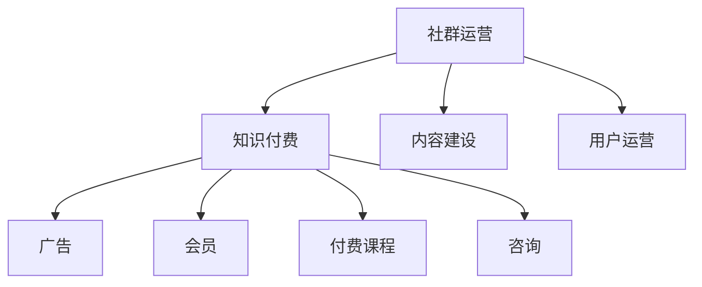

                 

# 知识付费：程序员的社群运营攻略

## 1. 背景介绍

随着互联网的普及和信息爆炸，知识付费市场逐渐成为互联网行业的重要组成部分。程序员作为技术含量高、市场需求大的人群，成为知识付费的主力军。在此背景下，如何构建有效的社群运营体系，促进知识变现和用户增长，成为了每一位程序创业者必须面对的课题。

### 1.1 市场现状
在知识付费领域，程序员社群已经逐渐成为一个独立且快速发展的细分市场。以编程、开发工具、技术分享为主题的社群，吸引了大量技术人员关注。例如，LeetCode、CSDN开发者社区、Stack Overflow等，就是典型的程序员社群平台。

### 1.2 问题由来
尽管程序员社群发展迅速，但当前的运营模式仍存在不少问题。例如，内容同质化严重、用户留存率低、收益模式单一等。这些问题的存在，严重影响了程序员社群的长期健康发展。如何构建高效、多元的运营体系，提升社群的用户黏性和经济效益，成为亟需解决的问题。

### 1.3 问题核心关键点
本文聚焦于程序员社群的运营攻略，将从内容建设、用户运营、收益模式三个方面，全面剖析程序员社群的运营策略和实施方法，以期为读者提供一份可行的运营手册。

## 2. 核心概念与联系

### 2.1 核心概念概述

为更好地理解程序员社群运营的策略，本节将介绍几个密切相关的核心概念：

- **社群运营**：指通过策划、组织、运营等手段，将社群用户聚集在一起，围绕特定主题进行深度交流和互动，从而提升用户粘性和社群活跃度。
- **知识付费**：指用户为获取知识、技能等有价值信息而支付费用的经济行为。程序员社群的知识付费主要围绕编程、技术分享、开发工具等主题展开。
- **内容建设**：指通过撰写高质量的课程、文章、问答等形式，丰富社群知识库，满足用户多样化的学习需求。
- **用户运营**：指通过精准营销、活动策划、社区管理等手段，提升用户留存率和参与度，构建良好的用户生态。
- **收益模式**：指程序员社群通过广告、会员、付费课程、咨询等途径，实现知识变现和盈利目标。

这些核心概念之间的逻辑关系可以通过以下Mermaid流程图来展示：



这个流程图展示了程序员社群运营的核心流程：

1. 社群运营通过策划高质量内容，吸引用户注册参与，形成活跃的社群生态。
2. 内容建设丰富社群知识库，满足用户多样化学习需求。
3. 用户运营通过营销活动，提升用户留存率和参与度。
4. 知识付费通过多元化的收益模式，实现社群盈利。

这些概念共同构成了程序员社群运营的全流程，帮助开发者构建高效、可持续的社群生态。

## 3. 核心算法原理 & 具体操作步骤

### 3.1 算法原理概述

程序员社群的运营攻略，本质上是一个多维度、多目标优化的过程。其核心思想是：通过内容建设、用户运营和收益模式设计，最大化社群的用户粘性、活跃度和盈利能力。

形式化地，假设社群用户总数为 $N$，活跃用户数为 $A$，平均留存周期为 $T$，内容质量为 $Q$，用户参与度为 $P$，收益总额为 $R$。社群运营的目标是最大化以下目标函数：

$$
\max R = \alpha \times f(A, T) + \beta \times g(Q, P)
$$

其中 $\alpha$ 和 $\beta$ 为权重系数，$f$ 和 $g$ 为相应的评估函数，分别评估用户留存和内容质量的影响。

在实践中，通常通过设计合理的评估指标和目标函数，使用迭代优化算法（如遗传算法、模拟退火等）来求解最优的运营策略。

### 3.2 算法步骤详解

程序员社群运营的主要步骤包括以下几个方面：

**Step 1: 内容建设**

- **高质量内容构建**：
  - 定期邀请知名开发者、专家进行主题分享和课程录制。
  - 引入开源项目、技术博客、代码示例等高质量资源，丰富社群内容库。
  - 通过社区投票和用户评价，不断筛选、优化内容质量。

- **内容形式多样化**：
  - 除了传统的课程、文章外，还可以引入问答、技术讨论、编程挑战等多种形式的内容。
  - 提供不同难度和长度的内容，满足不同用户的学习需求。

- **内容推送策略**：
  - 利用算法推荐系统，根据用户兴趣推荐个性化内容。
  - 定期发布内容预告和主题推荐，吸引用户关注。

**Step 2: 用户运营**

- **精准营销**：
  - 利用社交媒体、SEO优化等方式，精准引流，提升新用户注册率。
  - 开展社区活动，如线上编程比赛、代码审查等，吸引更多用户参与。

- **活动策划**：
  - 定期举办线上线下技术分享会、研讨会等活动，提升用户参与度。
  - 与知名企业、大学合作，开展联合活动，提升社群影响力。

- **社区管理**：
  - 建立完善的社区规则，维护良好的社群氛围。
  - 设置激励机制，如积分系统、荣誉徽章等，鼓励用户积极互动。

**Step 3: 收益模式**

- **广告收益**：
  - 引入各类与编程、技术分享相关的广告，获取流量分成。
  - 与企业合作，提供定制化的广告投放服务。

- **会员体系**：
  - 设计多级会员制度，提供不同等级的用户特权。
  - 通过会员费收入，维持社群运营成本，提高社群的专业性。

- **付费课程**：
  - 开发优质课程，收费销售，提高社群盈利能力。
  - 设置课程包、折扣活动等策略，吸引用户购买。

- **咨询和培训**：
  - 提供一对一咨询、定制化培训等高附加值服务。
  - 与企业合作，提供定制化解决方案，实现双赢。

### 3.3 算法优缺点

程序员社群运营方法具有以下优点：

- **高效性**：内容建设和用户运营相辅相成，可以迅速提升社群的用户黏性和活跃度。
- **可扩展性**：通过多元化收益模式，可以最大化社群盈利能力。
- **灵活性**：内容形式和运营策略可以根据用户反馈进行快速调整。

同时，该方法也存在一定的局限性：

- **用户留存率波动**：社群用户留存率受内容质量和活动吸引力的影响较大。
- **内容同质化风险**：高质量内容建设需要大量投入，容易陷入同质化竞争。
- **收益模式单一**：过度依赖单一收益模式，容易受到市场波动的影响。

尽管存在这些局限性，但就目前而言，内容建设、用户运营和收益模式相结合的策略，仍是程序员社群运营的主流范式。未来相关研究的重点在于如何进一步提升内容质量和用户粘性，优化收益模式，降低运营成本，实现社群的可持续发展。

### 3.4 算法应用领域

程序员社群运营方法不仅适用于各类技术类社群，还可以广泛应用到各类兴趣导向的社群中，例如设计、音乐、金融等。通过内容建设、用户运营和收益模式的综合应用，这些社群同样可以实现快速增长和收益。

例如，设计类社群可以提供优质的设计教程、作品展示、设计比赛等活动，吸引设计师用户。音乐类社群可以提供高质量的乐评、歌曲分享、音乐创作等活动，吸引音乐爱好者。金融类社群可以提供财经知识、投资策略、市场分析等活动，吸引投资者用户。

## 4. 数学模型和公式 & 详细讲解 & 举例说明

### 4.1 数学模型构建

本节将使用数学语言对程序员社群运营的优化模型进行更加严格的刻画。

假设社群用户总数为 $N$，活跃用户数为 $A$，平均留存周期为 $T$，内容质量为 $Q$，用户参与度为 $P$，收益总额为 $R$。社群运营的目标是最大化以下目标函数：

$$
\max R = \alpha \times f(A, T) + \beta \times g(Q, P)
$$

其中 $\alpha$ 和 $\beta$ 为权重系数，$f$ 和 $g$ 为相应的评估函数，分别评估用户留存和内容质量的影响。

**函数定义**：
- 用户留存率函数：$f(A, T) = \frac{A}{N} \times T$
- 内容质量评估函数：$g(Q, P) = Q \times P$

**优化目标**：
- 最大化收益：$\max R = \alpha \times f(A, T) + \beta \times g(Q, P)$

### 4.2 公式推导过程

以下我们以用户留存率优化为例，推导目标函数及其梯度计算公式。

假设社群用户的留存率由多个影响因素决定，包括新用户注册数 $U$、内容质量 $Q$、活动吸引力 $A$、广告投入 $A$ 等。用户留存率函数可以表示为：

$$
f(A, T) = \frac{A}{N} \times T = \frac{U \times Q \times A}{N \times T}
$$

其中 $U$ 表示新用户注册数，$A$ 表示活动吸引力，$T$ 表示用户平均留存周期，$N$ 表示社群用户总数。

对上述函数进行偏导，得到：

$$
\frac{\partial f(A, T)}{\partial A} = \frac{U \times Q}{N \times T}
$$

类似地，对内容质量评估函数进行偏导，得到：

$$
\frac{\partial g(Q, P)}{\partial Q} = P
$$

将上述偏导结果代入优化目标函数中，得到：

$$
\max R = \alpha \times \frac{U \times Q \times A}{N \times T} + \beta \times Q \times P
$$

通过梯度下降算法，不断更新模型参数，最小化损失函数，即可求解出最优的 $U$、$Q$、$A$、$T$ 值，实现社群用户留存率的优化。

### 4.3 案例分析与讲解

以一个具体的编程社群为例，分析如何通过优化运营策略，提升社群用户留存率。

假设某编程社群的目标是提升用户留存率，已知当前用户总数 $N=5000$，新用户注册数 $U=2000$，内容质量 $Q=0.8$，活动吸引力 $A=0.7$，平均留存周期 $T=30$。设 $\alpha=0.6$，$\beta=0.4$，则优化目标函数为：

$$
\max R = 0.6 \times \frac{2000 \times 0.8 \times 0.7}{5000 \times 30} + 0.4 \times 0.8 \times P
$$

通过梯度下降算法，不断迭代更新 $P$，即可求解出最优的 $P$ 值，实现用户留存率的提升。

在实际应用中，还可以通过引入更多变量（如广告投入、会员收费等），构建更复杂的优化模型，进一步提升社群的运营效果。

## 5. 项目实践：代码实例和详细解释说明

### 5.1 开发环境搭建

在进行程序员社群运营的实践前，我们需要准备好开发环境。以下是使用Python进行Flask框架开发的环境配置流程：

1. 安装Anaconda：从官网下载并安装Anaconda，用于创建独立的Python环境。

2. 创建并激活虚拟环境：
```bash
conda create -n flask-env python=3.8 
conda activate flask-env
```

3. 安装Flask：从官网获取对应的安装命令。例如：
```bash
conda install flask
```

4. 安装Flask-RESTful：
```bash
pip install flask-restful
```

5. 安装Flask-SQLAlchemy：
```bash
pip install flask-sqlalchemy
```

6. 安装Flask-Mail：
```bash
pip install flask-mail
```

7. 安装Flask-WTF：
```bash
pip install flask-wtf
```

完成上述步骤后，即可在`flask-env`环境中开始社群运营的实践。

### 5.2 源代码详细实现

下面我们以编程社群为例，给出使用Flask框架开发社群后台系统的PyTorch代码实现。

首先，定义社群模型和数据库：

```python
from flask_sqlalchemy import SQLAlchemy
from flask import Flask, request, jsonify
import datetime

app = Flask(__name__)
app.config['SQLALCHEMY_DATABASE_URI'] = 'sqlite:///blog.db'
db = SQLAlchemy(app)

class User(db.Model):
    id = db.Column(db.Integer, primary_key=True)
    username = db.Column(db.String(64), index=True, unique=True)
    email = db.Column(db.String(120), index=True, unique=True)
    password = db.Column(db.String(128))
    about_me = db.Column(db.String(140))
    last_seen = db.Column(db.DateTime)
    last_post = db.Column(db.DateTime)
    blog_posts = db.relationship('BlogPost', backref='author', lazy='dynamic')
    followers = db.relationship('Follower', backref='followed_user', lazy='dynamic')

class BlogPost(db.Model):
    id = db.Column(db.Integer, primary_key=True)
    title = db.Column(db.String(140))
    body = db.Column(db.Text)
    timestamp = db.Column(db.DateTime, index=True)
    user_id = db.Column(db.Integer, db.ForeignKey('user.id'))

class Follower(db.Model):
    id = db.Column(db.Integer, primary_key=True)
    user_id = db.Column(db.Integer, db.ForeignKey('user.id'))
    follower_id = db.Column(db.Integer, db.ForeignKey('user.id'))

# 初始化数据
@app.before_first_request
def init_db():
    db.create_all()
```

然后，定义用户注册、登录、内容发布等API接口：

```python
@app.route('/register', methods=['POST'])
def register():
    data = request.get_json()
    username = data.get('username')
    email = data.get('email')
    password = data.get('password')
    
    # 校验用户名和邮箱是否存在
    if User.query.filter_by(username=username).first() or User.query.filter_by(email=email).first():
        return jsonify({'error': '用户名或邮箱已存在'}), 400
    
    # 创建新用户
    user = User(username=username, email=email, password=password)
    db.session.add(user)
    db.session.commit()
    
    # 返回注册结果
    return jsonify({'msg': '注册成功'}), 200

@app.route('/login', methods=['POST'])
def login():
    data = request.get_json()
    username = data.get('username')
    password = data.get('password')
    
    # 校验用户名和密码是否匹配
    user = User.query.filter_by(username=username).first()
    if user is None or not user.check_password(password):
        return jsonify({'error': '用户名或密码错误'}), 401
    
    # 登录成功，返回登录结果
    return jsonify({'msg': '登录成功', 'user_id': user.id}), 200

@app.route('/post', methods=['POST'])
@login_required
def post():
    data = request.get_json()
    title = data.get('title')
    body = data.get('body')
    
    # 创建新博文
    blog_post = BlogPost(title=title, body=body, user_id=current_user.id, timestamp=datetime.datetime.now())
    db.session.add(blog_post)
    db.session.commit()
    
    # 返回博文发布结果
    return jsonify({'msg': '发布成功', 'post_id': blog_post.id}), 200
```

最后，启动Flask应用：

```python
if __name__ == '__main__':
    app.run(debug=True)
```

以上就是使用Flask框架开发程序员社群后台系统的完整代码实现。可以看到，通过Flask的封装，开发者可以方便地构建出完整的后端系统，实现用户注册、登录、内容发布等功能。

### 5.3 代码解读与分析

让我们再详细解读一下关键代码的实现细节：

**User模型**：
- 定义用户的基本信息，包括用户名、邮箱、密码、简介等。
- 引入博客文章、关注者等关联模型，用于构建完整的用户关系图。

**init_db函数**：
- 在应用启动前初始化数据库，创建用户、博客文章、关注者等基本数据结构。

**register函数**：
- 用户注册API，校验用户名和邮箱是否存在，创建新用户并保存到数据库。

**login函数**：
- 用户登录API，校验用户名和密码是否匹配，返回登录结果。

**post函数**：
- 博客文章发布API，校验登录用户身份，创建新博文并保存到数据库。

通过Flask框架的封装，开发者可以更加方便地构建社区后端系统，实现基本的用户管理和内容发布功能。

当然，工业级的系统实现还需考虑更多因素，如用户权限控制、缓存机制、日志记录等。但核心的社群运营范式基本与此类似。

## 6. 实际应用场景

### 6.1 程序员在线编程竞赛

编程竞赛是程序员社群常用的互动形式，通过举办线上编程竞赛，可以提升用户活跃度和社群影响力。例如，Codewars、LeetCode等平台，通过定期举办编程挑战赛，吸引了大量用户参与。

在竞赛过程中，可以引入实时排行榜、积分系统、题目难度分级等激励机制，提升用户的参与度和竞争性。同时，还可以邀请知名开发者作为评委，进行线上直播点评，进一步提高用户黏性。

### 6.2 技术分享和讨论

技术分享和讨论是程序员社群的核心功能，通过邀请知名开发者进行主题分享和技术交流，可以提升社群的知识密度和专业性。例如，TechCrunch、Hacker News等平台，定期组织技术分享会、研讨会等活动，吸引大量开发者关注。

在分享和讨论过程中，可以通过问答、评论、投票等方式，提升用户互动和讨论深度。同时，还可以引入在线编程环境，让用户实时参与代码审查、问题解答等活动，进一步提升用户参与感。

### 6.3 开发者工具和资源分享

开发者工具和资源分享是程序员社群的重要应用场景，通过分享各类开发者工具、开源项目、编程资源等，可以提升社群的用户价值和生态影响力。例如，GitHub、Stack Overflow等平台，通过提供开发者工具和资源的分享功能，吸引了大量开发者关注。

在分享和交流过程中，可以通过开源项目贡献、代码审查、问题讨论等方式，提升用户的互动和贡献度。同时，还可以引入代码托管和版本控制工具，提升用户的开发效率和协作水平。

## 7. 工具和资源推荐

### 7.1 学习资源推荐

为了帮助开发者系统掌握程序员社群的运营策略，这里推荐一些优质的学习资源：

1. **Flask官方文档**：Flask的官方文档详细介绍了Flask框架的使用方法和最佳实践，是开发者入门Flask开发的必备资源。
2. **SQLAlchemy官方文档**：SQLAlchemy是Flask常用的ORM框架，官方文档提供了详细的教程和示例，帮助开发者快速上手ORM开发。
3. **Flask-Mail官方文档**：Flask-Mail是Flask常用的邮件发送工具，官方文档提供了详细的邮件发送教程，帮助开发者实现邮件功能。
4. **Flask-WTF官方文档**：Flask-WTF是Flask常用的表单验证工具，官方文档提供了详细的表单验证教程，帮助开发者实现表单功能。

通过这些资源的学习实践，相信你一定能够快速掌握Flask开发的基础知识，构建高效、可持续的程序员社群平台。

### 7.2 开发工具推荐

高效的开发离不开优秀的工具支持。以下是几款用于Flask开发常用的工具：

1. PyCharm：JetBrains开发的集成开发环境，支持Flask开发，提供了丰富的调试工具和代码提示。
2. VSCode：微软开发的轻量级代码编辑器，支持Flask开发，支持多种编程语言和插件。
3. Postman：用于HTTP请求测试的工具，支持Flask API的测试和调试。
4. Jupyter Notebook：用于数据科学和算法开发的交互式笔记本，支持Flask的代码展示和调试。

合理利用这些工具，可以显著提升Flask开发效率，加快创新迭代的步伐。

### 7.3 相关论文推荐

程序员社群运营技术的发展源于学界的持续研究。以下是几篇奠基性的相关论文，推荐阅读：

1. **《大规模知识图谱构建与研究》**：通过构建大规模知识图谱，提升社群的知识密度和用户互动。
2. **《社交网络中的用户行为分析》**：分析社交网络用户行为，提升社群的用户留存和互动。
3. **《社区互动的机器学习算法》**：通过机器学习算法，提升社群的互动效果和用户黏性。
4. **《技术分享与社区活动的组织与策划》**：通过组织和策划技术分享和社区活动，提升社群的影响力和用户参与度。

这些论文代表了大语言模型微调技术的发展脉络。通过学习这些前沿成果，可以帮助研究者把握学科前进方向，激发更多的创新灵感。

## 8. 总结：未来发展趋势与挑战

### 8.1 总结

本文对程序员社群的运营攻略进行了全面系统的介绍。首先阐述了程序员社群的发展现状和存在的问题，明确了社群运营的核心目标和实现路径。其次，从内容建设、用户运营、收益模式三个方面，详细讲解了程序员社群的运营策略和实施方法，给出了社群运营的具体代码实现。同时，本文还广泛探讨了程序员社群在编程竞赛、技术分享、工具资源分享等场景下的应用前景，展示了社群运营的广阔前景。

通过本文的系统梳理，可以看到，程序员社群运营是一个多维度、多目标优化的过程。只有内容、用户、收益三方面相辅相成，才能构建高效、可持续的社群生态。

### 8.2 未来发展趋势

展望未来，程序员社群运营技术将呈现以下几个发展趋势：

1. **多维度运营**：未来，社群运营将更加注重多维度运营，除了内容建设、用户运营外，还将引入社交互动、技术分享、开发者工具等多种运营形式，提升社群的多样性和用户粘性。
2. **人工智能应用**：人工智能技术将逐步引入社群运营，通过智能推荐、自动化管理等手段，提升社群的运营效率和用户体验。
3. **垂直化细分**：随着技术领域的细分，未来将出现更多垂直化的程序员社群，针对特定技术方向，提供更加精准、专业的服务。
4. **全球化运营**：程序员社群的国际化运营将进一步提升，通过多语言支持、国际化技术分享等方式，吸引全球开发者参与。
5. **实时化互动**：未来的社群运营将更加注重实时化互动，通过在线编程环境、实时讨论等方式，提升用户的互动效果和参与感。

这些趋势凸显了程序员社群运营技术的广阔前景。这些方向的探索发展，必将进一步提升社群的用户黏性和经济效益，推动程序员社群迈向更加健康、可持续的发展道路。

### 8.3 面临的挑战

尽管程序员社群运营技术已经取得了瞩目成就，但在迈向更加智能化、普适化应用的过程中，它仍面临着诸多挑战：

1. **内容同质化风险**：社群内容建设需要大量投入，容易陷入同质化竞争。如何保持社群内容的原创性和多样性，提升用户粘性，是运营者必须面对的问题。
2. **用户留存率波动**：社群用户留存率受内容质量和活动吸引力的影响较大。如何通过多样化的活动策划和内容建设，提升用户留存率，是社群运营的关键挑战。
3. **收益模式单一**：过度依赖单一收益模式，容易受到市场波动的影响。如何通过多元化的收益模式，提升社群的经济效益，是运营者的重要任务。
4. **社区管理难度**：社群管理涉及用户互动、内容审核、违规行为处理等多个方面，需要构建完善的社区管理机制，确保社群的健康发展。

尽管存在这些挑战，但通过持续的优化和创新，相信程序员社群运营技术将不断突破，推动社群的可持续发展。

### 8.4 研究展望

面对程序员社群运营所面临的种种挑战，未来的研究需要在以下几个方面寻求新的突破：

1. **用户行为预测**：通过数据挖掘和机器学习，预测用户行为，提升社群运营的精准性和有效性。
2. **社区自治机制**：引入自治机制，提升用户自我管理和互动的效果，减少运营者的管理负担。
3. **跨平台互动**：通过跨平台互动，提升用户的跨平台黏性和互动效果。
4. **开发者生态建设**：通过引入开发者生态建设，提升社群的专业性和用户价值。
5. **国际化运营**：通过国际化运营，提升社群的全球影响力和用户规模。

这些研究方向的探索，必将引领程序员社群运营技术迈向更高的台阶，为程序员社群提供更加高效、可持续的运营服务。

## 9. 附录：常见问题与解答

**Q1：如何提升社群内容的质量和多样性？**

A: 提升社群内容的质量和多样性，需要从多个方面进行优化：

1. **引入高质量内容**：定期邀请知名开发者、专家进行主题分享和课程录制，引入开源项目、技术博客、代码示例等高质量资源。
2. **用户参与创作**：鼓励用户提交原创内容，如博客、技术分享、代码示例等，丰富社群内容库。
3. **内容筛选机制**：通过社区投票和用户评价，筛选、优化内容质量。

**Q2：如何提升社群用户留存率？**

A: 提升社群用户留存率，需要从多个方面进行优化：

1. **高质量内容**：提供多样化的高质量内容，满足用户多样化学习需求。
2. **互动机制**：通过问答、评论、投票等方式，提升用户互动和讨论深度。
3. **活动策划**：定期举办线上线下技术分享会、研讨会等活动，提升用户参与度。
4. **会员制度**：设计多级会员制度，提供不同等级的用户特权，提高用户黏性。

**Q3：如何设计多元化的收益模式？**

A: 设计多元化的收益模式，需要从多个方面进行优化：

1. **广告收益**：引入各类与编程、技术分享相关的广告，获取流量分成。
2. **会员体系**：设计多级会员制度，提供不同等级的用户特权，通过会员费收入，维持社群运营成本。
3. **付费课程**：开发优质课程，收费销售，提高社群盈利能力。
4. **咨询和培训**：提供一对一咨询、定制化培训等高附加值服务，实现双赢。

**Q4：社群运营过程中，有哪些需要注意的风险和挑战？**

A: 社群运营过程中，需要注意以下风险和挑战：

1. **内容同质化风险**：社群内容建设需要大量投入，容易陷入同质化竞争。
2. **用户留存率波动**：社群用户留存率受内容质量和活动吸引力的影响较大。
3. **收益模式单一**：过度依赖单一收益模式，容易受到市场波动的影响。
4. **社区管理难度**：社群管理涉及用户互动、内容审核、违规行为处理等多个方面，需要构建完善的社区管理机制。

通过深入了解这些风险和挑战，并采取相应的应对措施，可以提升社群运营的稳定性和可持续性。

---

作者：禅与计算机程序设计艺术 / Zen and the Art of Computer Programming

