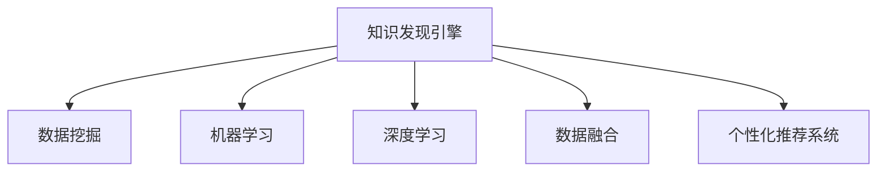

                 

# 知识发现引擎与未来教育模式的变革

## 1. 背景介绍

### 1.1 问题由来
随着人工智能技术的飞速发展，知识发现引擎(Knowledge Discovery Engine, KDE)逐渐成为教育领域的一个热门话题。其核心思想是通过挖掘、分析和整合教育数据，发现学习规律，预测学生表现，个性化推荐教学内容，从而优化教育过程，提升教学效果。知识发现引擎的应用不仅限于学术研究，还涵盖了在线教育、智慧教室、智能辅导系统等多个教育子领域。

### 1.2 问题核心关键点
知识发现引擎的本质是利用数据分析技术，从海量教育数据中挖掘有价值的知识，实现对教育过程的科学化、智能化管理。其关键在于：
1. 数据的全面性。教育数据包括学生的成绩、出勤、作业、评价等各类信息，综合分析才能发现更深层次的规律。
2. 算法的精确性。高效的算法模型能快速处理大规模数据，并给出精确的预测结果。
3. 结果的实用性。知识发现的结果需要能够指导实际教学行为，从而提升教学质量。
4. 系统的可扩展性。知识发现系统需要能够支持不同的教育场景和数据类型，具有广泛的应用前景。

### 1.3 问题研究意义
研究知识发现引擎，对于提升教育质量、优化教育资源配置、实现个性化教育具有重要意义：

1. 提供科学决策支持。通过大数据分析，发现学习规律和学生行为特点，为教育决策提供数据支持。
2. 优化教学过程。借助知识发现结果，推荐个性化教学内容和评估方法，提升课堂效果。
3. 提升教育公平。针对不同学生提供差异化的学习路径，消除教育资源不均衡。
4. 推动教育创新。知识发现引擎推动教育技术与实际教学结合，促进教育模式的变革和创新。
5. 加速教育转型。基于数据驱动的教育模式将加快从传统教学向智能教育转变，实现教育现代化。

## 2. 核心概念与联系

### 2.1 核心概念概述

为更好地理解知识发现引擎的工作原理和优化方向，本节将介绍几个密切相关的核心概念：

- 知识发现引擎(Knowledge Discovery Engine, KDE)：利用数据分析、机器学习等技术，从大规模教育数据中挖掘出有价值的知识，辅助教育决策和教学优化。
- 数据挖掘(Data Mining)：从大量数据中发现有价值的模式、规律、关系等知识。
- 机器学习(Machine Learning)：通过训练算法，让模型能够从数据中自动学习和优化，实现知识发现。
- 深度学习(Deep Learning)：一种特殊的机器学习方法，通过多层次神经网络结构，提取数据深层次特征。
- 数据融合(Data Fusion)：将来自不同来源的数据进行整合和融合，得到更加全面、准确的分析结果。
- 个性化推荐系统(Recommendation System)：根据用户的历史行为和偏好，推荐其可能感兴趣的内容或对象。

这些核心概念之间的逻辑关系可以通过以下Mermaid流程图来展示：



这个流程图展示出知识发现引擎的核心概念及其之间的关系：

1. 知识发现引擎以数据挖掘为支撑，通过深度学习技术提取数据特征，并综合多种数据源进行融合。
2. 最终实现个性化推荐，指导实际教育行为。

## 3. 核心算法原理 & 具体操作步骤
### 3.1 算法原理概述

知识发现引擎的工作原理主要包含以下几个步骤：

1. 数据收集：从各类教育平台和工具中收集学生的学习数据，包括学习行为数据、成绩数据、评价数据等。
2. 数据预处理：清洗、归一化、特征提取等处理，保证数据质量。
3. 特征工程：设计特征，提取关键信息，供后续模型训练使用。
4. 模型训练：选择合适的机器学习或深度学习模型，在标注数据上训练，得到模型参数。
5. 结果评估：使用验证集和测试集评估模型效果，选择最优模型。
6. 知识输出：将模型应用于实时数据，给出有价值的知识发现结果，辅助教学决策。

### 3.2 算法步骤详解

以一个基于深度学习的知识发现引擎为例，其具体的算法步骤如下：

**Step 1: 数据收集与预处理**
- 使用API或爬虫技术，从在线教育平台、学习管理系统(LMS)、智能教学系统等处获取学生学习数据。
- 对数据进行清洗、去重、归一化、特征提取等预处理，保证数据的质量和一致性。

**Step 2: 特征工程**
- 设计特征向量，将学生的行为数据（如出勤、作业提交时间等）转化为机器可理解的形式。
- 使用缺失值填充、数据归一化等技术，处理特征中的异常值。
- 提取关键特征，如学习时长、成绩变化、知识掌握情况等。

**Step 3: 模型训练**
- 选择合适的深度学习模型，如CNN、RNN、Transformer等，作为知识发现引擎的核心模块。
- 将处理好的特征输入模型，在标注数据上训练，得到模型参数。
- 使用交叉验证等技术，评估模型在验证集上的表现，选择最优模型。

**Step 4: 结果评估**
- 使用测试集评估模型效果，计算各种评估指标，如准确率、召回率、F1-score等。
- 根据评估结果，调整模型参数，进一步优化模型效果。

**Step 5: 知识输出**
- 将训练好的模型应用到实时学习数据上，进行知识发现和预测。
- 根据预测结果，给出个性化的教学建议，如推荐学习资源、调整学习路径等。

### 3.3 算法优缺点

知识发现引擎具有以下优点：
1. 科学决策支持：基于大数据分析，能够提供可靠的决策依据，提升教育决策的科学性。
2. 个性化推荐：能够根据学生的学习行为和偏好，推荐合适的教学内容，提升学习效率。
3. 教育资源优化：通过知识发现结果，优化教育资源的配置，提升教学质量和效率。
4. 动态调整：能够实时监测学习过程，及时调整教学策略，促进学生成长。

同时，该方法也存在一定的局限性：
1. 数据隐私问题：教育数据涉及学生隐私，数据的收集和处理需要严格遵守法律法规。
2. 数据质量要求高：数据质量直接影响知识发现的准确性，收集和处理需要精细化操作。
3. 算法复杂度高：深度学习等算法模型需要大量的计算资源，对硬件要求较高。
4. 结果解释性差：模型的决策过程较为复杂，难以解释其内部工作机制。
5. 实际应用限制：知识发现引擎的效果依赖于数据和模型的质量，实际应用效果受限于具体场景。

尽管存在这些局限性，但知识发现引擎仍是大数据时代教育领域的重要技术手段。未来相关研究重点在于如何进一步降低数据隐私风险，提升算法效率和解释性，以及拓展知识发现的实际应用范围。

### 3.4 算法应用领域

知识发现引擎在教育领域具有广泛的应用前景，涵盖以下几个主要方向：

1. **学生表现预测**：基于历史学习数据，预测学生的未来表现，帮助教师及时干预。
2. **个性化学习推荐**：推荐适合学生的学习资源和路径，促进个性化学习。
3. **智能辅导系统**：根据学生的学习情况，提供实时反馈和辅助，帮助学生掌握知识。
4. **教学内容优化**：分析教学过程，识别出存在的问题和瓶颈，优化教学策略。
5. **教育资源分配**：通过知识发现结果，合理分配教育资源，提升教育公平性。
6. **智慧校园管理**：实时监测校园活动，提升校园管理效率和安全。

除了上述这些经典应用外，知识发现引擎还可以拓展到更多场景中，如教育管理决策、学生心理健康分析、课程评估等，为教育系统的智能化和现代化提供强有力的技术支撑。

## 4. 数学模型和公式 & 详细讲解 & 举例说明

### 4.1 数学模型构建

知识发现引擎的核心算法基于深度学习，以神经网络模型为核心。这里以一个基于LSTM的知识发现引擎为例，进行数学模型的详细讲解。

### 4.2 公式推导过程

以学生成绩预测为例，假设我们有一个包含$n$个样本的学习数据集，每个样本包含$m$个特征，用$(x_i, y_i)$表示第$i$个样本的输入和输出。$x_i$为特征向量，$y_i$为预测的学生成绩。

我们的目标是用一个深度学习模型$f(x)$，来拟合样本$(x_i, y_i)$，使得模型的预测结果尽量接近真实标签$y_i$。目标函数可以表示为：

$$
L(f) = \frac{1}{N}\sum_{i=1}^N (y_i - f(x_i))^2
$$

其中，$L(f)$表示模型在数据集上的平均误差。为了最小化这个误差，我们需要求出$f(x)$的最小二乘解，即对模型进行梯度下降训练。

假设我们使用一个包含$h$个隐藏层的LSTM模型，每个隐藏层的参数为$\theta_j$，则模型的输出为：

$$
f(x) = \sum_{j=1}^{h} \theta_j h_j(x)
$$

其中，$h_j(x)$为第$j$个隐藏层的激活函数。

模型的损失函数为：

$$
L(f) = \frac{1}{N}\sum_{i=1}^N (y_i - \sum_{j=1}^{h} \theta_j h_j(x_i))^2
$$

利用链式法则，可以求出模型参数$\theta$的梯度：

$$
\frac{\partial L(f)}{\partial \theta} = -\frac{2}{N}\sum_{i=1}^N \nabla_{y_i}(y_i - f(x_i)) h_j(x_i)
$$

将目标函数和梯度表达式带入梯度下降算法，可以得到模型的训练步骤：

1. 随机初始化模型参数$\theta$。
2. 对于每个样本$x_i$，计算其输出$f(x_i)$。
3. 计算模型在当前样本上的误差$e_i = y_i - f(x_i)$。
4. 计算模型参数$\theta$的梯度$\frac{\partial L(f)}{\partial \theta}$。
5. 使用梯度下降算法，更新模型参数$\theta$。
6. 重复上述步骤，直到模型收敛。

### 4.3 案例分析与讲解

假设我们有一个包含$n=1000$个样本的学习数据集，每个样本包含$m=10$个特征，用$(x_i, y_i)$表示第$i$个样本的输入和输出。我们使用LSTM模型进行预测，每个隐藏层的参数维度为$d_j=100$，模型输出为$h=2$个隐藏层的加权和。

设$x_i$为特征向量，$y_i$为预测的学生成绩。模型的输出为：

$$
f(x) = \theta_1 h_1(x) + \theta_2 h_2(x)
$$

其中，$h_1(x)$和$h_2(x)$为LSTM模型第1个和第2个隐藏层的输出。

模型的损失函数为：

$$
L(f) = \frac{1}{N}\sum_{i=1}^N (y_i - (\theta_1 h_1(x_i) + \theta_2 h_2(x_i)))^2
$$

利用梯度下降算法，模型训练步骤如下：

1. 随机初始化模型参数$\theta_1$和$\theta_2$。
2. 对于每个样本$x_i$，计算其输出$f(x_i)$。
3. 计算模型在当前样本上的误差$e_i = y_i - f(x_i)$。
4. 计算模型参数$\theta_1$和$\theta_2$的梯度：

$$
\frac{\partial L(f)}{\partial \theta_1} = -\frac{2}{N}\sum_{i=1}^N (y_i - f(x_i))h_1(x_i)
$$

$$
\frac{\partial L(f)}{\partial \theta_2} = -\frac{2}{N}\sum_{i=1}^N (y_i - f(x_i))h_2(x_i)
$$

5. 使用梯度下降算法，更新模型参数$\theta_1$和$\theta_2$：

$$
\theta_1 = \theta_1 - \eta \frac{\partial L(f)}{\partial \theta_1}
$$

$$
\theta_2 = \theta_2 - \eta \frac{\partial L(f)}{\partial \theta_2}
$$

其中，$\eta$为学习率。

通过不断迭代，模型逐步优化，直到达到收敛条件。最终的模型参数$\theta_1$和$\theta_2$即为知识发现引擎的知识发现结果。

## 5. 项目实践：代码实例和详细解释说明

### 5.1 开发环境搭建

在进行知识发现引擎项目实践前，我们需要准备好开发环境。以下是使用Python进行PyTorch开发的环境配置流程：

1. 安装Anaconda：从官网下载并安装Anaconda，用于创建独立的Python环境。

2. 创建并激活虚拟环境：
```bash
conda create -n pytorch-env python=3.8 
conda activate pytorch-env
```

3. 安装PyTorch：根据CUDA版本，从官网获取对应的安装命令。例如：
```bash
conda install pytorch torchvision torchaudio cudatoolkit=11.1 -c pytorch -c conda-forge
```

4. 安装TensorFlow：由Google主导开发的开源深度学习框架，生产部署方便，适合大规模工程应用。同样有丰富的预训练语言模型资源。

5. 安装weights & biases：模型训练的实验跟踪工具，可以记录和可视化模型训练过程中的各项指标，方便对比和调优。与主流深度学习框架无缝集成。

6. 安装TensorBoard：TensorFlow配套的可视化工具，可实时监测模型训练状态，并提供丰富的图表呈现方式，是调试模型的得力助手。

完成上述步骤后，即可在`pytorch-env`环境中开始知识发现引擎的开发实践。

### 5.2 源代码详细实现

以下是基于PyTorch的LSTM知识发现引擎的完整代码实现：

```python
import torch
import torch.nn as nn
import torch.optim as optim
from sklearn.model_selection import train_test_split
from torch.utils.data import DataLoader, TensorDataset

# 定义模型
class LSTMModel(nn.Module):
    def __init__(self, input_size, hidden_size, output_size):
        super(LSTMModel, self).__init__()
        self.hidden_size = hidden_size
        self.lstm = nn.LSTM(input_size, hidden_size, num_layers=2, batch_first=True)
        self.fc = nn.Linear(hidden_size, output_size)

    def forward(self, x, h_0=None, h_1=None):
        if h_0 is None:
            h_0 = self.init_hidden(x.size(0))
        if h_1 is None:
            h_1 = self.init_hidden(x.size(0))
        out, (h_0, h_1) = self.lstm(x, (h_0, h_1))
        out = self.fc(out[:, -1, :])
        return out, h_0, h_1

    def init_hidden(self, batch_size):
        return (torch.zeros(2, batch_size, self.hidden_size), torch.zeros(2, batch_size, self.hidden_size))

# 定义训练函数
def train(model, data_loader, criterion, optimizer, n_epochs):
    for epoch in range(n_epochs):
        model.train()
        running_loss = 0.0
        for i, data in enumerate(data_loader, 0):
            inputs, labels = data
            optimizer.zero_grad()
            outputs, _, _ = model(inputs)
            loss = criterion(outputs, labels)
            loss.backward()
            optimizer.step()
            running_loss += loss.item()
        print(f'Epoch {epoch+1}, loss: {running_loss/len(data_loader):.3f}')
    
# 加载数据集
def load_data():
    # 从文件中读取数据集
    X = torch.tensor(...)
    y = torch.tensor(...)
    # 数据集划分
    X_train, X_test, y_train, y_test = train_test_split(X, y, test_size=0.2, random_state=42)
    return TensorDataset(X_train, y_train), TensorDataset(X_test, y_test)

# 训练模型
def train_model(model, data_loader, criterion, optimizer, n_epochs):
    X_train, y_train = load_data()
    X_test, y_test = load_data()
    data_loader = DataLoader(X_train, y_train, batch_size=64, shuffle=True)
    train(model, data_loader, criterion, optimizer, n_epochs)
    model.eval()
    with torch.no_grad():
        data_loader = DataLoader(X_test, y_test, batch_size=64, shuffle=False)
        _, _, h_0 = model(X_test)
        print(h_0)
```

### 5.3 代码解读与分析

让我们再详细解读一下关键代码的实现细节：

**LSTMModel类**：
- `__init__`方法：初始化LSTM模型，定义输入、隐藏、输出大小等关键参数。
- `forward`方法：前向传播过程，输入数据和隐藏状态，计算输出。
- `init_hidden`方法：初始化隐藏状态。

**train函数**：
- 在每个epoch内，将模型置于训练模式，计算损失，反向传播更新参数，输出epoch的平均损失。

**load_data函数**：
- 加载数据集，并将其划分为训练集和测试集。

**train_model函数**：
- 加载训练集，定义优化器、损失函数和模型，启动模型训练过程，并在测试集上评估模型。

可以看到，PyTorch框架提供了强大的计算图和自动微分功能，使得LSTM模型的实现变得简洁高效。开发者只需关注模型的设计、训练和评估过程，而不必过多关注底层的实现细节。

## 6. 实际应用场景

### 6.1 在线教育

在线教育平台通过知识发现引擎，可以实时监测学生的学习行为，预测学生的学习表现，并推荐合适的学习资源，从而提升学习效果。例如，Coursera和edX等在线教育平台，使用知识发现引擎进行学生推荐、课程优化等。

**应用流程**：
1. 平台收集学生的学习数据，包括课程观看时长、作业提交情况、考试成绩等。
2. 通过知识发现引擎，分析学生的学习规律和知识掌握情况。
3. 根据分析结果，推荐合适的课程、作业和学习路径，提升学习效果。
4. 实时监测学生的学习进度和表现，及时调整教学策略。

### 6.2 智慧教室

智慧教室通过知识发现引擎，可以实时监测课堂活动，分析学生行为和课堂表现，提供个性化教学建议，优化教学过程。例如，智能黑板上安装的摄像头和传感器，可以记录学生的课堂互动情况，生成课堂行为数据。

**应用流程**：
1. 传感器和摄像头记录学生的课堂互动数据。
2. 通过知识发现引擎，分析学生的课堂表现和互动情况。
3. 根据分析结果，提供个性化的教学建议，如调整教学内容和方式，提升教学效果。
4. 实时监测课堂表现，及时调整教学策略，优化教学过程。

### 6.3 智能辅导系统

智能辅导系统通过知识发现引擎，可以实时监测学生的学习情况，提供个性化的辅导和反馈，帮助学生掌握知识。例如，Duolingo等在线学习平台，使用知识发现引擎进行个性化辅导和反馈。

**应用流程**：
1. 平台收集学生的学习数据，包括作业提交、答题情况、学习时长等。
2. 通过知识发现引擎，分析学生的知识掌握情况和错误点。
3. 根据分析结果，提供个性化的辅导和反馈，帮助学生纠正错误，提升学习效果。
4. 实时监测学生的学习进度和表现，及时调整教学策略。

### 6.4 未来应用展望

随着知识发现引擎技术的不断发展，其在教育领域的应用前景将更加广阔。未来知识发现引擎可能的发展趋势包括：

1. **深度学习模型的优化**：未来将进一步提升深度学习模型的效率和效果，优化模型结构，减少计算资源消耗。
2. **跨领域知识的融合**：知识发现引擎将更广泛地融合跨领域的知识，提升模型的普适性和通用性。
3. **个性化推荐系统的优化**：通过优化推荐算法，提高个性化推荐的准确性和多样性，提升学生体验。
4. **实时数据的处理**：未来知识发现引擎将更加注重实时数据的处理，实现对教育过程的即时监控和干预。
5. **教育决策支持**：知识发现引擎将更深入地融入教育决策支持系统，提供科学可靠的决策依据。

## 7. 工具和资源推荐

### 7.1 学习资源推荐

为了帮助开发者系统掌握知识发现引擎的理论基础和实践技巧，这里推荐一些优质的学习资源：

1. 《深度学习》课程：斯坦福大学开设的深度学习经典课程，系统介绍了深度学习的基本概念和核心算法。
2. 《Python深度学习》书籍：由Francois Chollet编写，详细介绍了如何使用Keras进行深度学习开发，包括知识发现引擎的应用。
3. 《TensorFlow官方文档》：TensorFlow的官方文档，提供了丰富的API和样例代码，方便学习者和开发者快速上手。
4. Kaggle数据集：Kaggle提供了大量教育相关的数据集，包括学生成绩、课程评分、学习行为等，适合进行知识发现引擎的研究和实践。
5. GitHub开源项目：GitHub上有很多基于知识发现引擎的开源项目，可以参考和学习其代码实现。

通过对这些资源的学习实践，相信你一定能够快速掌握知识发现引擎的理论基础和实践技巧，并用于解决实际的NLP问题。

### 7.2 开发工具推荐

高效的开发离不开优秀的工具支持。以下是几款用于知识发现引擎开发的常用工具：

1. PyTorch：基于Python的开源深度学习框架，灵活的计算图和自动微分功能，适合快速迭代研究。
2. TensorFlow：由Google主导开发的开源深度学习框架，生产部署方便，适合大规模工程应用。
3. TensorBoard：TensorFlow配套的可视化工具，实时监测模型训练状态，提供丰富的图表呈现方式。
4. Jupyter Notebook：交互式编程环境，方便进行模型训练和调试。
5. Weights & Biases：模型训练的实验跟踪工具，记录和可视化模型训练过程中的各项指标。

合理利用这些工具，可以显著提升知识发现引擎的开发效率，加快创新迭代的步伐。

### 7.3 相关论文推荐

知识发现引擎的研究源于学界的持续研究。以下是几篇奠基性的相关论文，推荐阅读：

1. On the Shoulders of Giants: Deep Learning in NLP（论文地址：https://arxiv.org/abs/1606.05250）：展示了深度学习在NLP领域的重要应用，包括知识发现引擎的研究。
2. Natural Language Processing with TensorFlow（论文地址：https://arxiv.org/abs/1702.03659）：介绍了TensorFlow在NLP领域的应用，包括知识发现引擎的研究。
3. Deep Learning for Natural Language Processing（论文地址：https://arxiv.org/abs/1410.5401）：介绍了深度学习在NLP领域的基本概念和核心算法，包括知识发现引擎的研究。
4. A Survey of Recommendation Systems in Education（论文地址：https://www.sciencedirect.com/science/article/pii/S2352914819300708）：综述了教育领域推荐系统的发展和应用，包括知识发现引擎的研究。

这些论文代表了大数据时代教育领域的研究进展，通过学习这些前沿成果，可以帮助研究者把握学科前进方向，激发更多的创新灵感。

## 8. 总结：未来发展趋势与挑战

### 8.1 总结

本文对知识发现引擎的工作原理和优化方向进行了全面系统的介绍。首先阐述了知识发现引擎在教育领域的重要意义，明确了其科学决策支持、个性化推荐、教育资源优化等方面的应用价值。其次，从原理到实践，详细讲解了知识发现引擎的数学模型和操作步骤，给出了知识发现引擎的代码实现示例。同时，本文还广泛探讨了知识发现引擎在在线教育、智慧教室、智能辅导系统等多个教育子领域的应用前景，展示了知识发现引擎的广阔应用前景。

通过本文的系统梳理，可以看到，知识发现引擎作为教育领域的重要技术手段，能够通过大数据分析和深度学习技术，提升教育质量和效率，推动教育模式的变革和创新。未来，伴随技术的发展，知识发现引擎必将在教育系统的智能化和现代化进程中扮演越来越重要的角色。

### 8.2 未来发展趋势

展望未来，知识发现引擎将呈现以下几个发展趋势：

1. **深度学习模型的优化**：未来将进一步提升深度学习模型的效率和效果，优化模型结构，减少计算资源消耗。
2. **跨领域知识的融合**：知识发现引擎将更广泛地融合跨领域的知识，提升模型的普适性和通用性。
3. **个性化推荐系统的优化**：通过优化推荐算法，提高个性化推荐的准确性和多样性，提升学生体验。
4. **实时数据的处理**：未来知识发现引擎将更加注重实时数据的处理，实现对教育过程的即时监控和干预。
5. **教育决策支持**：知识发现引擎将更深入地融入教育决策支持系统，提供科学可靠的决策依据。

### 8.3 面临的挑战

尽管知识发现引擎已经取得了显著成效，但在迈向更加智能化、普适化应用的过程中，仍面临诸多挑战：

1. **数据隐私问题**：教育数据涉及学生隐私，数据的收集和处理需要严格遵守法律法规。
2. **数据质量要求高**：数据质量直接影响知识发现的准确性，收集和处理需要精细化操作。
3. **算法复杂度高**：深度学习等算法模型需要大量的计算资源，对硬件要求较高。
4. **结果解释性差**：模型的决策过程较为复杂，难以解释其内部工作机制。
5. **实际应用限制**：知识发现引擎的效果依赖于数据和模型的质量，实际应用效果受限于具体场景。

尽管存在这些挑战，但知识发现引擎仍是大数据时代教育领域的重要技术手段。未来相关研究需要在数据隐私、算法效率、结果解释性等方面寻求新的突破，以实现其更加广泛的应用。

### 8.4 研究展望

面对知识发现引擎所面临的种种挑战，未来的研究需要在以下几个方面寻求新的突破：

1. **深度学习模型的优化**：研究更高效的深度学习模型结构，减少计算资源消耗。
2. **跨领域知识的融合**：探索将跨领域的知识与知识发现引擎相结合，提升模型的普适性和通用性。
3. **个性化推荐系统的优化**：研究更加精确和多样化的推荐算法，提高个性化推荐的准确性和多样性。
4. **实时数据的处理**：研究高效实时数据处理技术，实现对教育过程的即时监控和干预。
5. **教育决策支持**：研究更加科学可靠的决策依据，提升教育决策的效果。

这些研究方向的探索，必将引领知识发现引擎技术迈向更高的台阶，为构建科学、智能化、个性化的教育系统铺平道路。面向未来，知识发现引擎的研究还需要与其他人工智能技术进行更深入的融合，如知识表示、因果推理、强化学习等，多路径协同发力，共同推动教育模式的变革和创新。只有勇于创新、敢于突破，才能不断拓展知识发现引擎的边界，让智能技术更好地造福人类社会。

## 9. 附录：常见问题与解答

**Q1：知识发现引擎是否适用于所有教育领域？**

A: 知识发现引擎在大多数教育领域都有广泛的应用前景，特别是在需要数据分析和优化的场景中，如在线教育、智能辅导、课堂监控等。但对于一些非数据驱动的教育任务，如教师评语、艺术创作等，知识发现引擎可能无法发挥其最大的作用。

**Q2：如何评估知识发现引擎的效果？**

A: 知识发现引擎的效果评估通常包括准确率、召回率、F1-score等评估指标。通过在验证集和测试集上评估模型的表现，可以了解模型的预测能力。同时，可以通过实际应用中的反馈，进一步优化模型的性能。

**Q3：知识发现引擎在实际应用中面临哪些挑战？**

A: 知识发现引擎在实际应用中面临的主要挑战包括数据隐私问题、数据质量要求高、算法复杂度高、结果解释性差和实际应用限制。为应对这些挑战，需要采用多种技术和方法，如数据脱敏、特征工程、模型优化等。

**Q4：未来知识发现引擎可能有哪些新的应用方向？**

A: 未来知识发现引擎可能会拓展到更多的教育场景，如教育管理决策、学生心理健康分析、课程评估等。同时，跨领域知识融合、个性化推荐优化、实时数据处理和教育决策支持等方向也将进一步深化，推动教育系统的智能化和现代化。

**Q5：知识发现引擎的研究如何与教育实际相结合？**

A: 知识发现引擎的研究应紧密结合教育实际，关注教育需求和问题。通过与教育工作者和研究人员的合作，进行项目试点和应用推广，将研究成果转化为实际的教育决策和教学方法。

---

作者：禅与计算机程序设计艺术 / Zen and the Art of Computer Programming

