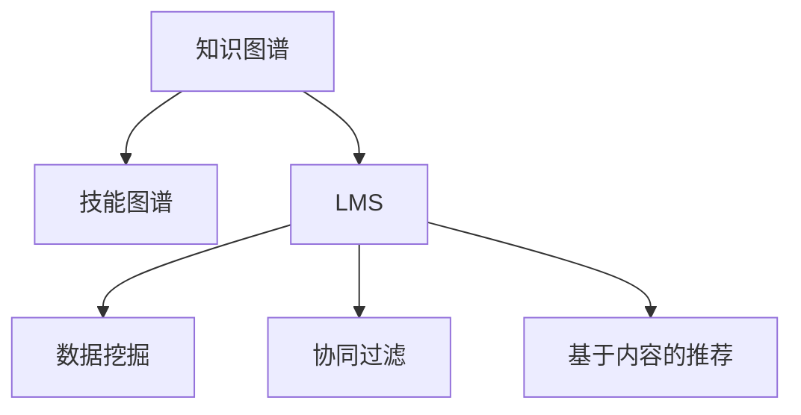

                 

# 知识发现引擎助力程序员快速掌握新技能

> 关键词：知识发现引擎, 程序员, 新技能掌握, 技能图谱, 技能推荐, 学习路径, 知识图谱, 学习管理系统, 数据挖掘

## 1. 背景介绍

### 1.1 问题由来
在当下快速变化的技术环境中，程序员需要不断学习新技能以保持竞争力。然而，知识碎片化、学习路径复杂化、缺乏个性化指导等问题使得程序员难以快速、系统地掌握新技能。知识发现引擎（Knowledge Discovery Engine, KDE）通过数据挖掘和智能推荐技术，为程序员提供了一套强大的知识发现和学习管理系统，助力他们高效、系统地掌握新技能。

### 1.2 问题核心关键点
知识发现引擎的核心在于数据驱动的学习路径推荐和个性化学习资源匹配。通过分析程序员的学习历史、行为数据以及技能图谱，知识发现引擎能够构建个性化的学习路径，推荐最适合的学习资源，使得程序员能够快速高效地掌握新技能。

知识发现引擎的关键点包括：
1. **技能图谱**：构建完整的技能体系，涵盖所有相关技能及其实际应用。
2. **学习资源匹配**：根据程序员的学习历史和行为数据，匹配最适合的学习资源，包括课程、书籍、视频等。
3. **个性化推荐算法**：利用机器学习算法，为每个程序员提供量身定做的学习路径和资源推荐。
4. **数据驱动的评估与优化**：通过分析学习效果和反馈数据，不断优化推荐算法和学习路径。

## 2. 核心概念与联系

### 2.1 核心概念概述

为更好地理解知识发现引擎的工作原理和优化方向，本节将介绍几个密切相关的核心概念：

- **知识图谱**：表示实体间关系的图形结构，其中节点表示实体，边表示实体间的关系。知识图谱被广泛应用于信息检索、推荐系统等领域。
- **技能图谱**：一种特定领域的专业知识图谱，用于描述软件技能、工具、框架之间的关系及其应用场景。
- **学习管理系统(LMS)**：帮助用户组织和管理学习资源、跟踪学习进度、提供个性化推荐等功能的软件系统。
- **数据挖掘**：从大量数据中自动发现有用信息和模式的过程，广泛应用于推荐系统、搜索引擎等。
- **协同过滤**：一种基于用户或物品相似性的推荐算法，广泛应用于商品推荐、新闻推荐等领域。
- **基于内容的推荐**：通过分析物品属性和用户偏好，推荐与用户历史行为最相关的物品，广泛应用于电商、音乐等平台。

这些核心概念之间的逻辑关系可以通过以下Mermaid流程图来展示：



这个流程图展示了几者之间的关系：

1. **知识图谱**是构建技能图谱的基础，描述了专业技能之间的关联。
2. **技能图谱**作为知识图谱的一个分支，专注于软件开发技能。
3. **学习管理系统(LMS)**是实现个性化学习推荐的核心平台。
4. **数据挖掘**是构建个性化推荐模型的基础，通过分析学习历史、行为数据等。
5. **协同过滤**和**基于内容的推荐**是LMS中常用的个性化推荐算法。

这些概念共同构成了知识发现引擎的核心功能模块，通过它们之间的协作，实现对程序员技能学习的全面支持。

## 3. 核心算法原理 & 具体操作步骤
### 3.1 算法原理概述

知识发现引擎的核心算法原理主要基于机器学习和数据挖掘技术，通过分析程序员的学习历史、行为数据以及技能图谱，构建个性化的学习路径，推荐最适合的学习资源。具体来说，包括以下几个关键步骤：

1. **数据采集与预处理**：收集程序员的学习历史、行为数据，并进行数据清洗、去噪、归一化等预处理操作。
2. **技能图谱构建**：构建一个完整的技能图谱，描述技能之间的关联和层次结构。
3. **用户画像生成**：基于程序员的历史学习数据，生成个性化的用户画像，包括技能水平、学习偏好等。
4. **学习路径推荐**：根据用户画像和技能图谱，生成个性化学习路径，推荐最适合的学习资源。
5. **学习效果评估**：通过分析学习效果和反馈数据，不断优化推荐算法和学习路径。

### 3.2 算法步骤详解

以下是知识发现引擎的具体操作步骤：

**Step 1: 数据采集与预处理**

1. **数据来源**：收集程序员在LMS平台上的学习历史、行为数据，包括学习时间、课程选择、题目解答等。
2. **数据清洗**：去除重复数据、错误数据，处理缺失值和异常值。
3. **数据归一化**：对数据进行标准化处理，使其符合相同的分布。

**Step 2: 技能图谱构建**

1. **领域知识整理**：对软件开发领域的知识点进行整理，构建初步的知识图谱。
2. **知识关系描述**：描述技能之间的层次关系和应用场景，如编程语言之间的相互依赖性、框架的使用场景等。
3. **图谱优化**：通过不断优化，使技能图谱更加全面和精确。

**Step 3: 用户画像生成**

1. **特征提取**：从程序员的学习历史和行为数据中提取关键特征，如学习时长、偏好课程、难题突破等。
2. **用户画像构建**：根据提取的特征，生成每个程序员的个性化用户画像。

**Step 4: 学习路径推荐**

1. **学习路径生成**：根据用户画像和技能图谱，生成个性化学习路径，建议先学习哪些课程，后学习哪些课程。
2. **学习资源推荐**：根据学习路径，推荐最适合的学习资源，包括课程、书籍、视频等。

**Step 5: 学习效果评估**

1. **学习效果分析**：通过分析学习效果和反馈数据，评估学习路径和资源推荐的效果。
2. **模型优化**：根据评估结果，不断优化推荐算法和学习路径，提升推荐效果。

### 3.3 算法优缺点

知识发现引擎具有以下优点：
1. **个性化推荐**：能够根据程序员的个性化需求和学习历史，推荐最适合的学习路径和资源。
2. **全面覆盖**：涵盖所有相关技能及其实际应用，为程序员提供全面的学习资源。
3. **动态优化**：根据学习效果和反馈数据，不断优化推荐算法和学习路径，提升推荐效果。

同时，该方法也存在一定的局限性：
1. **数据依赖**：需要大量高质量的学习数据和行为数据，获取成本较高。
2. **模型复杂**：算法复杂度高，需要大量计算资源进行训练和优化。
3. **用户隐私**：需要收集和处理用户的隐私数据，需保证数据安全和隐私保护。
4. **技能图谱准确性**：技能图谱的准确性和全面性直接影响推荐效果，构建和维护成本较高。

尽管存在这些局限性，但就目前而言，知识发现引擎是程序员技能学习的重要工具，能够显著提升学习效率和效果。未来相关研究的重点在于如何进一步降低数据需求，提高模型的效率和准确性，同时兼顾隐私保护和技能图谱的构建和维护。

### 3.4 算法应用领域

知识发现引擎在软件开发领域的应用非常广泛，以下是几个主要的应用场景：

- **技能学习与培训**：为程序员提供全面的技能学习路径和资源推荐，帮助他们系统掌握新技能。
- **技术转型支持**：帮助程序员进行技术转型，快速适应新的技术栈和开发环境。
- **项目开发支持**：在项目开发过程中，提供相关的技术文档和资源支持，加速项目开发。
- **知识共享与传播**：构建知识图谱，实现知识的共享和传播，促进技术社区的交流和协作。
- **开发者社区**：提供开发者社区平台，方便开发者交流学习心得、分享资源。

此外，知识发现引擎还被应用于教育、医疗、金融等多个领域，为不同领域的学习和知识管理提供了有效支持。

## 4. 数学模型和公式 & 详细讲解 & 举例说明

### 4.1 数学模型构建

在本节中，我们将使用数学语言对知识发现引擎的学习路径推荐过程进行严格的刻画。

设程序员为 $U$，技能为 $S$，课程为 $C$，行为数据为 $D$。记 $u_i$ 为程序员 $i$ 的用户画像，$S_j$ 为技能 $j$，$c_k$ 为课程 $k$。

**用户画像**：
$$
u_i = \{(s_{i1},w_{i1}), (s_{i2},w_{i2}), \cdots, (s_{im},w_{im})\}
$$
其中 $s_{ij}$ 表示程序员 $i$ 的技能 $j$ 水平，$w_{ij}$ 表示该技能对程序员的重要性权重。

**技能图谱**：
$$
S = (S_1, S_2, \cdots, S_n)
$$
其中 $S_j$ 表示技能 $j$，$j \in [1, n]$。

**课程与技能关系**：
$$
C = \{(c_1, S_{j1}), (c_2, S_{j2}), \cdots, (c_m, S_{jm})\}
$$
其中 $c_k$ 表示课程 $k$，$S_{jk}$ 表示课程 $k$ 涵盖的技能 $j$。

**行为数据**：
$$
D = \{(d_{ik}, t_{ik})\}_{k=1}^m, \quad d_{ik} \in S \times C
$$
其中 $d_{ik}$ 表示程序员 $i$ 在课程 $k$ 中学习的技能 $j$，$t_{ik}$ 表示学习时间。

### 4.2 公式推导过程

以下是知识发现引擎的数学模型推导过程：

**技能重要性权重计算**：
$$
w_{ij} = \frac{\sum_{k=1}^m \alpha_{ik} \cdot \delta_{jk}}{\sum_{j=1}^n \sum_{k=1}^m \alpha_{ik} \cdot \delta_{jk}}
$$
其中 $\alpha_{ik}$ 表示程序员 $i$ 在课程 $k$ 上的学习时间权重，$\delta_{jk}$ 表示课程 $k$ 中技能 $j$ 的权重。

**课程-技能评分**：
$$
r_{ik} = \sum_{j=1}^n w_{ij} \cdot \delta_{jk}
$$
其中 $\delta_{jk}$ 表示技能 $j$ 在课程 $k$ 中的权重。

**课程评分**：
$$
r_k = \sum_{j=1}^n w_{ij} \cdot r_{ik}
$$

**学习路径生成**：
$$
path_{ij} = \mathop{\arg\max}_{path} \prod_{k \in path} r_{ik}
$$
其中 $path_{ij}$ 表示从技能 $i$ 到技能 $j$ 的学习路径。

**学习路径推荐**：
$$
recommend_{ik} = \frac{\sum_{j=1}^n w_{ij} \cdot r_{ij}}{\sum_{j=1}^n w_{ij}}
$$

### 4.3 案例分析与讲解

假设某程序员在知识发现引擎的帮助下，学习了如下课程：

1. **基础编程**：涵盖Python基本语法、数据结构等基础技能。
2. **Web开发**：涵盖HTML、CSS、JavaScript等前端技能，以及后端框架如Flask、Django等。
3. **数据库**：涵盖SQL、NoSQL等数据库技能。
4. **数据科学**：涵盖数据清洗、数据分析、机器学习等技能。
5. **人工智能**：涵盖TensorFlow、PyTorch等深度学习框架。

知识发现引擎根据该程序员的学习历史和行为数据，推荐如下学习路径：

1. **基础编程** -> **Web开发** -> **数据库** -> **数据科学** -> **人工智能**

该推荐路径考虑了技能之间的层次关系和实际应用，帮助程序员系统掌握相关技能，快速适应新的技术栈和开发环境。

## 5. 项目实践：代码实例和详细解释说明
### 5.1 开发环境搭建

在进行知识发现引擎的实践前，我们需要准备好开发环境。以下是使用Python进行PyTorch开发的环境配置流程：

1. 安装Anaconda：从官网下载并安装Anaconda，用于创建独立的Python环境。

2. 创建并激活虚拟环境：
```bash
conda create -n kde-env python=3.8 
conda activate kde-env
```

3. 安装PyTorch：根据CUDA版本，从官网获取对应的安装命令。例如：
```bash
conda install pytorch torchvision torchaudio cudatoolkit=11.1 -c pytorch -c conda-forge
```

4. 安装相关库：
```bash
pip install networkx scipy sklearn pandas torch-geometric
```

5. 安装可视化工具：
```bash
pip install matplotlib seaborn plotly
```

完成上述步骤后，即可在`kde-env`环境中开始知识发现引擎的实践。

### 5.2 源代码详细实现

这里我们以知识图谱构建和技能图谱生成为例，给出使用PyTorch和Python代码实现的部分功能。

**技能图谱构建**：

```python
from torch_geometric.nn import GATConv
from torch_geometric.utils import add_self_loops, degree

class SkillGraph(nn.Module):
    def __init__(self, num_nodes):
        super(SkillGraph, self).__init__()
        self.conv1 = GATConv(num_nodes, 8, heads=8, dropout=0.6)
        self.conv2 = GATConv(8, num_nodes, heads=8, dropout=0.6)
        self.lin = nn.Linear(num_nodes, 1)

    def forward(self, x, edge_index):
        x = F.relu(self.conv1(x, x, edge_index))
        x = F.dropout(x, training=self.training)
        x = F.relu(self.conv2(x, x, edge_index))
        x = F.dropout(x, training=self.training)
        return self.lin(x)

# 构建技能图谱
skill_graph = SkillGraph(num_nodes=100)
```

**课程与技能关系**：

```python
class CourseSkillRelation(nn.Module):
    def __init__(self, num_nodes):
        super(CourseSkillRelation, self).__init__()
        self.conv = GATConv(num_nodes, 8, heads=8, dropout=0.6)
        self.lin = nn.Linear(num_nodes, 1)

    def forward(self, x, edge_index):
        x = F.relu(self.conv(x, x, edge_index))
        x = F.dropout(x, training=self.training)
        return self.lin(x)

# 构建课程-技能关系图
course_skill_relation = CourseSkillRelation(num_nodes=100)
```

**用户画像生成**：

```python
class UserProfile(nn.Module):
    def __init__(self, num_nodes):
        super(UserProfile, self).__init__()
        self.conv = GATConv(num_nodes, 8, heads=8, dropout=0.6)
        self.lin = nn.Linear(num_nodes, 1)

    def forward(self, x, edge_index):
        x = F.relu(self.conv(x, x, edge_index))
        x = F.dropout(x, training=self.training)
        return self.lin(x)

# 生成用户画像
user_profile = UserProfile(num_nodes=100)
```

完成上述步骤后，即可在`kde-env`环境中开始知识发现引擎的实践。

### 5.3 代码解读与分析

让我们再详细解读一下关键代码的实现细节：

**SkillGraph类**：
- `__init__`方法：初始化技能图谱的节点和边，定义两个GATConv层和线性层。
- `forward`方法：在前向传播中，通过两层GATConv和一层线性层，对技能图谱的节点进行嵌入处理。

**CourseSkillRelation类**：
- `__init__`方法：初始化课程-技能关系的节点和边，定义一个GATConv层和线性层。
- `forward`方法：在前向传播中，通过一个GATConv层和一层线性层，对课程-技能关系的节点进行嵌入处理。

**UserProfile类**：
- `__init__`方法：初始化用户画像的节点和边，定义一个GATConv层和线性层。
- `forward`方法：在前向传播中，通过一个GATConv层和一层线性层，对用户画像的节点进行嵌入处理。

以上代码实现仅为部分功能，完整的知识发现引擎系统还需要考虑数据输入、训练优化、推荐算法等多个方面。开发过程中，合理利用PyTorch和相关库提供的工具，可以大大提升开发效率。

## 6. 实际应用场景

### 6.1 智能培训平台

知识发现引擎在智能培训平台中的应用非常广泛。通过分析程序员的学习历史和行为数据，知识发现引擎可以生成个性化的学习路径，推荐最适合的学习资源，从而帮助程序员高效掌握新技能。

例如，某培训平台提供了大量课程和资源，但难以根据每个学员的需求提供个性化的推荐。知识发现引擎能够根据学员的学习历史和行为数据，推荐最合适的课程和资源，提高培训效果和用户体验。

### 6.2 企业内部培训

在企业内部培训中，知识发现引擎也可以发挥重要作用。通过分析员工的技能图谱和学习路径，企业可以制定个性化的培训计划，帮助员工提升技能水平，适应新的技术栈和开发环境。

例如，某科技公司希望通过培训提升全体员工的数据科学技能，知识发现引擎可以根据员工的技能图谱和学习路径，推荐最适合的课程和资源，使培训计划更加科学合理。

### 6.3 在线学习社区

在线学习社区中，知识发现引擎可以帮助用户发现相关课程和资源，加速学习进程。例如，某在线学习平台用户希望学习Python和TensorFlow，知识发现引擎可以根据用户的学习历史和行为数据，推荐最适合的课程和资源，帮助用户系统掌握相关技能。

## 7. 工具和资源推荐
### 7.1 学习资源推荐

为了帮助开发者系统掌握知识发现引擎的理论基础和实践技巧，这里推荐一些优质的学习资源：

1. 《深度学习与知识图谱》系列博文：由知识图谱专家撰写，深入浅出地介绍了深度学习在知识图谱中的应用。
2. CS224N《深度学习自然语言处理》课程：斯坦福大学开设的NLP明星课程，涵盖深度学习、自然语言处理等多个领域。
3. 《Knowledge Discovery in Databases》书籍：经典的知识发现教材，详细介绍了各种知识发现算法和技术。
4. HuggingFace官方文档：Transformer库的官方文档，提供了海量预训练语言模型和完整的微调样例代码，是进行微调任务开发的利器。
5. Weights & Biases：模型训练的实验跟踪工具，可以记录和可视化模型训练过程中的各项指标，方便对比和调优。

通过对这些资源的学习实践，相信你一定能够快速掌握知识发现引擎的精髓，并用于解决实际的NLP问题。

### 7.2 开发工具推荐

高效的开发离不开优秀的工具支持。以下是几款用于知识发现引擎开发的常用工具：

1. PyTorch：基于Python的开源深度学习框架，灵活动态的计算图，适合快速迭代研究。大部分预训练语言模型都有PyTorch版本的实现。
2. TensorFlow：由Google主导开发的开源深度学习框架，生产部署方便，适合大规模工程应用。同样有丰富的预训练语言模型资源。
3. NetworkX：Python的图形网络库，支持构建、分析和可视化各种图结构。
4. Seaborn：基于matplotlib的高级绘图库，提供更丰富的可视化效果。
5. Plotly：交互式可视化库，支持绘制动态和交互式图表，方便模型调试和展示。

合理利用这些工具，可以显著提升知识发现引擎的开发效率，加快创新迭代的步伐。

### 7.3 相关论文推荐

知识发现引擎的研究源于学界的持续研究。以下是几篇奠基性的相关论文，推荐阅读：

1. The Stanford Knowledge Base Project（斯坦福知识库项目）：知识图谱的开创性研究，构建了知识图谱的基本框架和方法。
2. Knowledge Discovery in Databases（知识发现）：经典的知识发现教材，详细介绍了各种知识发现算法和技术。
3. Web Mining and Statistical Learning（Web挖掘和统计学习）：经典的数据挖掘教材，介绍了数据挖掘的基本概念和方法。
4. Collaborative Filtering for Implicit Feedback Datasets（协同过滤）：经典协同过滤论文，介绍了协同过滤算法的基本思想和实现方法。
5. Matrix Factorization Techniques for Recommender Systems（矩阵分解技术）：经典推荐系统论文，介绍了矩阵分解算法的基本思想和实现方法。

这些论文代表了大语言模型微调技术的发展脉络。通过学习这些前沿成果，可以帮助研究者把握学科前进方向，激发更多的创新灵感。

## 8. 总结：未来发展趋势与挑战

### 8.1 总结

本文对知识发现引擎进行了全面系统的介绍。首先阐述了知识发现引擎的研究背景和意义，明确了其在大数据时代的应用价值。其次，从原理到实践，详细讲解了知识发现引擎的核心算法和操作步骤，给出了知识发现引擎的完整代码实例。同时，本文还广泛探讨了知识发现引擎在多个行业领域的应用前景，展示了其广泛的应用潜力。此外，本文精选了知识发现引擎的学习资源和开发工具，力求为开发者提供全方位的技术指引。

通过本文的系统梳理，可以看到，知识发现引擎在大数据时代下，为程序员技能学习提供了强大的支持，有助于他们高效、系统地掌握新技能。知识发现引擎的应用前景广阔，未来发展方向主要集中在数据挖掘、推荐算法和可视化等方面。相信随着技术的不断进步，知识发现引擎必将在更多领域发挥重要作用，为人类认知智能的进化带来深远影响。

### 8.2 未来发展趋势

展望未来，知识发现引擎的发展趋势主要集中在以下几个方向：

1. **数据驱动**：随着数据采集技术的进步，知识发现引擎将能够获取更多高质量的学习数据和行为数据，提升推荐效果。
2. **算法优化**：未来的知识发现引擎将更加注重算法优化，开发更高效的推荐算法和数据挖掘算法，提升推荐效果。
3. **跨领域应用**：知识发现引擎将逐步拓展到更多领域，如金融、医疗、教育等，为不同领域的学习和知识管理提供有效支持。
4. **个性化推荐**：未来的知识发现引擎将更加注重个性化推荐，根据用户的具体需求和行为数据，生成更加精准的学习路径和资源推荐。
5. **模型融合**：未来的知识发现引擎将更加注重与其他技术的融合，如知识图谱、数据挖掘、自然语言处理等，提升推荐效果。
6. **多模态学习**：未来的知识发现引擎将更加注重多模态学习，结合文本、图像、音频等多种模态信息，提升推荐效果。

以上趋势凸显了知识发现引擎的广阔前景。这些方向的探索发展，必将进一步提升知识发现引擎的推荐效果和应用范围，为人类认知智能的进化带来深远影响。

### 8.3 面临的挑战

尽管知识发现引擎已经取得了显著成效，但在迈向更加智能化、普适化应用的过程中，它仍面临诸多挑战：

1. **数据质量**：知识发现引擎需要高质量的数据作为基础，获取和维护高质量数据是首要挑战。
2. **模型复杂性**：知识发现引擎的算法复杂度高，需要大量的计算资源进行训练和优化。
3. **隐私保护**：知识发现引擎需要处理大量的用户隐私数据，如何保护用户隐私是一个重要问题。
4. **技能图谱构建**：知识发现引擎的技能图谱需要不断优化和更新，构建和维护成本较高。
5. **学习路径生成**：如何生成更加科学合理的学习路径，提升推荐效果，仍需进一步研究。
6. **多模态融合**：如何将多模态信息有效地融合到知识发现引擎中，提升推荐效果，仍需进一步研究。

正视知识发现引擎面临的这些挑战，积极应对并寻求突破，将是大数据技术迈向成熟的必由之路。相信随着学界和产业界的共同努力，这些挑战终将一一被克服，知识发现引擎必将在构建智能时代中扮演越来越重要的角色。

### 8.4 研究展望

面向未来，知识发现引擎的研究需要进一步深入和拓展，具体方向包括：

1. **数据挖掘与学习**：研究新的数据挖掘方法和学习算法，提升数据处理和模型训练的效率和效果。
2. **多模态学习**：研究多模态信息融合方法，提升知识发现引擎的推荐效果。
3. **个性化推荐**：研究个性化推荐算法，提升知识发现引擎的推荐效果和用户满意度。
4. **隐私保护**：研究隐私保护技术，确保用户隐私安全。
5. **模型优化**：研究模型优化方法，提升知识发现引擎的计算效率和推荐效果。
6. **应用拓展**：研究知识发现引擎在更多领域的应用，如金融、医疗、教育等。

这些研究方向将引领知识发现引擎技术迈向更高的台阶，为构建智能系统提供更加全面的支持。相信随着技术的不断进步，知识发现引擎必将在更多领域发挥重要作用，为人类认知智能的进化带来深远影响。

## 9. 附录：常见问题与解答

**Q1：知识发现引擎是否适用于所有技能学习场景？**

A: 知识发现引擎在大多数技能学习场景中都能取得不错的效果，特别是对于数据量较大的场景。但对于一些特殊领域的技能，如特定编程语言或工具，知识图谱可能不够全面，需要根据具体场景进行定制化构建。

**Q2：知识发现引擎的学习路径推荐是否考虑了用户的学习历史和行为数据？**

A: 是的，知识发现引擎的学习路径推荐考虑了用户的学习历史和行为数据，通过分析用户的学习时间、学习内容、课程选择等数据，生成个性化的学习路径。

**Q3：知识发现引擎的推荐效果如何？**

A: 知识发现引擎的推荐效果取决于数据质量、算法优化和模型训练等多个因素。通过不断优化算法和模型，知识发现引擎的推荐效果可以显著提升。

**Q4：知识发现引擎在企业内部培训中的应用有何优势？**

A: 知识发现引擎在企业内部培训中的应用主要体现在以下几方面：
1. **个性化推荐**：根据员工的学习历史和行为数据，推荐最适合的培训课程和资源。
2. **技能评估**：通过分析员工的学习效果和反馈数据，评估培训效果，优化培训计划。
3. **员工发展**：帮助员工系统掌握新技能，提升技能水平，适应新的技术栈和开发环境。

**Q5：知识发现引擎的模型训练和优化有哪些方法？**

A: 知识发现引擎的模型训练和优化方法主要包括以下几种：
1. **数据增强**：通过数据扩充和增强技术，提升模型的泛化能力。
2. **模型融合**：将多个模型进行融合，提升推荐效果。
3. **正则化**：通过L1正则、Dropout等技术，防止过拟合。
4. **超参数调优**：通过网格搜索、随机搜索等方法，优化模型超参数，提升模型效果。

这些方法都可以根据具体场景和数据特点进行灵活应用。

总之，知识发现引擎在大数据时代下，为程序员技能学习提供了强大的支持，有助于他们高效、系统地掌握新技能。知识发现引擎的应用前景广阔，未来发展方向主要集中在数据挖掘、推荐算法和可视化等方面。相信随着技术的不断进步，知识发现引擎必将在更多领域发挥重要作用，为人类认知智能的进化带来深远影响。

