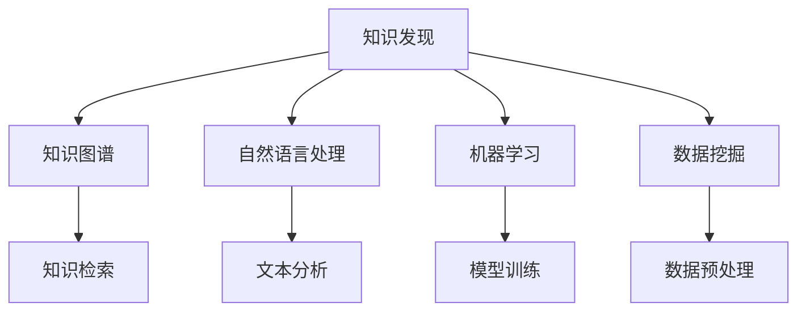

                 

# 知识发现引擎助力程序员解决难题

> 关键词：知识发现, 程序员, 问题解决, 数据挖掘, 机器学习

## 1. 背景介绍

### 1.1 问题由来
在软件开发领域，程序员经常面临复杂多变的技术难题。这些问题可能源于对新技术的不熟悉、代码复杂度的提升、系统架构设计的瓶颈，或者市场需求的迅速变化。传统的解决方式往往依赖经验积累，效率低下且难以泛化。

随着数据科学和人工智能技术的成熟，越来越多的团队开始探索基于数据驱动的解决方案，其中，知识发现(Knowledge Discovery)技术显得尤为重要。知识发现旨在从海量数据中提取有用信息，辅助程序员更快速、更准确地解决问题。

### 1.2 问题核心关键点
知识发现引擎(Knowledge Discovery Engine, KDE)的核心思想是，通过收集、处理和分析与问题相关的数据，识别出问题的关键特征和潜在解法。其关键点包括：

- 数据收集与预处理：收集与问题相关的数据，包括代码片段、API文档、社区讨论、开发者文档等，并进行清洗、转换和标准化。
- 特征提取与选择：从数据中提取有用的特征，如代码中的关键字、函数调用频率、API文档的主题等，并从大量特征中筛选出最有信息量的特征。
- 模型构建与训练：基于机器学习算法构建知识发现模型，对问题进行分类、预测或关联分析，生成结构化的知识图谱。
- 知识检索与推荐：将提取的知识图谱存储在知识库中，支持基于关键词、类别等维度的知识检索和推荐。

这些核心环节共同构成了知识发现引擎的工作原理，旨在帮助程序员在解决技术难题时，快速定位问题、识别潜在解法、构建解决方案。

### 1.3 问题研究意义
知识发现引擎的开发与应用，对于提升软件开发效率、推动技术创新具有重要意义：

1. 提升问题解决效率：知识发现引擎能够快速定位问题，提供多种潜在解法，显著降低技术难题的解决成本。
2. 推动技术创新：通过对大量问题解决案例的学习，知识发现引擎可以提炼出技术趋势和最佳实践，加速新技术的普及和应用。
3. 加速知识共享：构建团队知识库，支持跨团队、跨项目的信息交流，提升整体技术水平和团队协作效率。
4. 促进持续学习：不断收集和分析新问题，更新知识库，提升知识发现引擎的自我学习能力，实现知识的积累和迭代。
5. 辅助决策制定：知识发现引擎提供的数据支持，有助于项目经理和技术决策者进行合理规划和决策，避免盲目尝试。

## 2. 核心概念与联系

### 2.1 核心概念概述

为更好地理解知识发现引擎的工作原理，本节将介绍几个密切相关的核心概念：

- 知识发现(Knowledge Discovery, KD)：从数据中提取有用信息和知识的过程，包括数据预处理、特征提取、模型训练、知识检索等环节。
- 知识图谱(Knowledge Graph)：将知识以图形化的方式表示和存储，通过节点和边的关系，展示知识的结构和逻辑。
- 自然语言处理(Natural Language Processing, NLP)：使计算机能够理解、处理和生成自然语言的技术，常用于知识提取和文本分析。
- 机器学习(Machine Learning, ML)：通过算法训练，使计算机从数据中学习规律和知识，并应用于问题解决。
- 数据挖掘(Data Mining)：从大规模数据中提取有用信息和知识的过程，常用于知识发现和模式识别。

这些核心概念之间的逻辑关系可以通过以下Mermaid流程图来展示：



这个流程图展示了几大核心概念及其之间的关系：

1. 知识发现通过数据预处理、特征提取、模型训练等环节，将知识表示为结构化的知识图谱。
2. 自然语言处理作为知识发现的重要组成部分，帮助系统理解和处理自然语言文本，提取有用的信息。
3. 机器学习作为知识发现的主要工具，通过模型训练和优化，生成预测或分类结果。
4. 数据挖掘通过大量数据的学习，提炼出有价值的模式和规律，辅助知识发现过程。
5. 知识图谱作为知识发现的结果，提供检索和推荐支持，帮助问题解决。

这些概念共同构成了知识发现引擎的技术框架，使其能够高效、准确地辅助程序员解决技术难题。

## 3. 核心算法原理 & 具体操作步骤
### 3.1 算法原理概述

知识发现引擎的核心原理是基于数据驱动的机器学习方法。其基本思想是通过对与问题相关的数据进行收集和分析，提取有用的特征和知识，辅助程序员快速定位问题并找到解决方案。

具体而言，知识发现引擎包括以下几个关键步骤：

1. 数据收集与预处理：收集与问题相关的数据，并进行清洗、转换和标准化。
2. 特征提取与选择：从数据中提取有用的特征，如代码中的关键字、函数调用频率、API文档的主题等。
3. 模型构建与训练：基于机器学习算法构建知识发现模型，对问题进行分类、预测或关联分析。
4. 知识检索与推荐：将提取的知识图谱存储在知识库中，支持基于关键词、类别等维度的知识检索和推荐。

### 3.2 算法步骤详解

下面详细介绍知识发现引擎的各个步骤：

**Step 1: 数据收集与预处理**

1. 数据源选择：从代码仓库、API文档、社区讨论、开发者文档等多个渠道，收集与问题相关的数据。
2. 数据清洗：去除噪声数据、处理缺失值、纠正错误数据等。
3. 数据转换：将数据格式转换为统一的格式，如转换为JSON、CSV等。
4. 数据标准化：对数据进行归一化、缩放等操作，使其符合模型的输入要求。

**Step 2: 特征提取与选择**

1. 特征提取：从数据中提取有用的特征，如代码中的关键字、函数调用频率、API文档的主题等。
2. 特征选择：使用特征选择算法（如递归特征消除、L1正则化等），从大量特征中筛选出最有信息量的特征。

**Step 3: 模型构建与训练**

1. 模型选择：根据任务类型，选择合适的机器学习模型，如分类模型、聚类模型、回归模型等。
2. 模型训练：使用训练数据集对模型进行训练，调整模型参数，使其能够准确预测或分类问题。
3. 模型评估：使用测试数据集对模型进行评估，衡量模型的预测准确率和鲁棒性。

**Step 4: 知识检索与推荐**

1. 知识存储：将提取的知识图谱存储在知识库中，可以使用图数据库（如Neo4j、ArangoDB等）进行存储。
2. 知识检索：根据输入的查询词，从知识库中检索出相关的知识图谱节点。
3. 知识推荐：使用推荐算法（如协同过滤、基于内容的推荐等），推荐最相关的知识图谱节点。

### 3.3 算法优缺点

知识发现引擎的优势在于：

1. 数据驱动：基于大量数据的学习，能够发现问题的深层次特征和潜在解法。
2. 泛化能力强：通过广泛的数据集训练，知识发现引擎能够泛化到新的问题上。
3. 自动学习：使用机器学习算法，能够自动从数据中提取有用特征，无需人工干预。

但其也存在一些缺点：

1. 数据依赖：依赖于高质量的数据源，数据质量差会影响模型的性能。
2. 模型复杂：需要构建复杂的机器学习模型，对算法选择和调参要求高。
3. 计算资源消耗大：处理大量数据和复杂模型，对计算资源有较高要求。
4. 知识表示复杂：知识图谱的构建和维护复杂，需要专业知识。
5. 可解释性差：模型训练过程复杂，难以解释模型的内部机制和决策逻辑。

尽管存在这些缺点，但总体而言，知识发现引擎在提升问题解决效率和加速技术创新方面具有显著的优势。

### 3.4 算法应用领域

知识发现引擎的应用范围非常广泛，以下是几个典型领域：

1. 代码维护：在代码审查、代码重构、代码复用等场景中，通过分析代码中的关键特征，辅助程序员进行代码优化和重构。
2. 技术支持：在技术支持、故障诊断等场景中，通过知识图谱的检索和推荐，快速定位问题并提供解决方案。
3. 需求分析：在需求分析、产品设计等场景中，通过分析市场和用户需求，提取关键特征，辅助产品经理进行需求设计。
4. 知识管理：在知识管理、文档管理等场景中，通过构建团队知识库，支持团队成员快速查找和学习相关知识。
5. 技术趋势分析：在技术趋势分析、未来技术预测等场景中，通过分析大量技术论文、专利等数据，提取技术发展趋势和最佳实践。

## 4. 数学模型和公式 & 详细讲解 & 举例说明
### 4.1 数学模型构建

本节将使用数学语言对知识发现引擎的主要模型进行系统介绍。

假设知识发现引擎的任务是对问题进行分类，输入数据集为 $\mathcal{D}=\{(x_i,y_i)\}_{i=1}^N$，其中 $x_i \in \mathcal{X}$ 为输入特征，$y_i \in \mathcal{Y}$ 为分类标签。模型的目标是最小化分类误差，即找到最优参数 $\theta$：

$$
\theta^* = \mathop{\arg\min}_{\theta} \frac{1}{N} \sum_{i=1}^N L(\hat{y_i},y_i)
$$

其中 $L(\hat{y_i},y_i)$ 为分类误差函数，如交叉熵损失函数。

在模型训练过程中，我们使用监督学习算法（如逻辑回归、支持向量机等），通过最小化损失函数，更新模型参数 $\theta$。模型评估过程中，使用测试数据集对模型进行评估，计算分类准确率等指标。

### 4.2 公式推导过程

以下以逻辑回归模型为例，推导分类误差函数的计算公式。

假设模型 $M_{\theta}$ 为逻辑回归模型，输出 $\hat{y}=M_{\theta}(x) \in [0,1]$，表示样本属于正类的概率。真实标签 $y \in \{0,1\}$。则交叉熵损失函数定义为：

$$
L(\hat{y},y) = -[y\log \hat{y} + (1-y)\log(1-\hat{y})]
$$

将其代入经验风险公式，得：

$$
\mathcal{L}(\theta) = -\frac{1}{N}\sum_{i=1}^N [y_i\log M_{\theta}(x_i)+(1-y_i)\log(1-M_{\theta}(x_i))]
$$

在得到损失函数的梯度后，即可带入模型训练公式，完成模型的迭代优化。重复上述过程直至收敛，最终得到适应分类任务的最优模型参数 $\theta^*$。

### 4.3 案例分析与讲解

假设有一家软件公司的技术支持团队，每天都会收到大量的技术问题咨询，需要快速定位问题并给出解决方案。

团队收集了过去一年中的所有技术问题，包括问题描述、标签、解决方案等信息，希望通过知识发现引擎辅助日常工作。

**数据收集与预处理**

1. 数据源选择：从公司的技术支持系统、邮件、知识库等多个渠道收集数据。
2. 数据清洗：去除重复和无关的问题描述，修正语法错误。
3. 数据转换：将问题描述转换为文本格式，并存储在数据库中。
4. 数据标准化：对问题描述进行分词、去除停用词等操作，标准化数据格式。

**特征提取与选择**

1. 特征提取：从问题描述中提取有用的特征，如关键词、函数调用频率等。
2. 特征选择：使用TF-IDF算法选择最能描述问题的特征，去除冗余特征。

**模型构建与训练**

1. 模型选择：选择逻辑回归模型，用于问题分类。
2. 模型训练：使用训练数据集对模型进行训练，调整模型参数，使其能够准确预测问题分类。
3. 模型评估：使用测试数据集对模型进行评估，计算分类准确率等指标。

**知识检索与推荐**

1. 知识存储：将提取的知识图谱存储在知识库中，存储节点和边的关系，支持高效的检索和推荐。
2. 知识检索：根据输入的问题描述，从知识库中检索出相关的知识图谱节点。
3. 知识推荐：使用协同过滤算法，推荐最相关的解决方案。

经过以上步骤，技术支持团队能够快速定位问题，并通过知识库推荐解决方案，大大提升了问题解决效率。

## 5. 项目实践：代码实例和详细解释说明
### 5.1 开发环境搭建

在进行知识发现引擎开发前，我们需要准备好开发环境。以下是使用Python进行scikit-learn开发的开发环境配置流程：

1. 安装Anaconda：从官网下载并安装Anaconda，用于创建独立的Python环境。

2. 创建并激活虚拟环境：
```bash
conda create -n sklearn-env python=3.8 
conda activate sklearn-env
```

3. 安装scikit-learn：
```bash
conda install scikit-learn
```

4. 安装其他工具包：
```bash
pip install numpy pandas matplotlib scikit-learn tqdm jupyter notebook ipython
```

完成上述步骤后，即可在`sklearn-env`环境中开始知识发现引擎的开发。

### 5.2 源代码详细实现

下面以问题分类任务为例，给出使用scikit-learn进行知识发现引擎开发的PyTorch代码实现。

首先，定义问题分类模型的训练和评估函数：

```python
from sklearn.datasets import fetch_20newsgroups
from sklearn.model_selection import train_test_split
from sklearn.feature_extraction.text import CountVectorizer, TfidfTransformer
from sklearn.linear_model import LogisticRegression
from sklearn.metrics import classification_report
from sklearn.pipeline import Pipeline

# 加载数据集
newsgroups_train = fetch_20newsgroups(subset='train', remove=('headers', 'footers', 'quotes'))
newsgroups_test = fetch_20newsgroups(subset='test', remove=('headers', 'footers', 'quotes'))

# 定义模型和管道
clf = LogisticRegression(solver='liblinear', C=1.0, multi_class='auto')
pipeline = Pipeline([
    ('vect', CountVectorizer()),
    ('tfidf', TfidfTransformer()),
    ('clf', clf)
])

# 训练和评估模型
pipeline.fit(newsgroups_train.data, newsgroups_train.target)
y_pred = pipeline.predict(newsgroups_test.data)
print(classification_report(newsgroups_test.target, y_pred))
```

然后，定义知识库的存储和检索函数：

```python
import neo4j

# 连接知识库
graph_db = neo4j.GraphDatabase.driver('bolt://localhost:7687', auth=('neo4j', 'password'))

# 添加节点
def add_node(name, type):
    query = '''
        CREATE (n:%s {name: $name}) RETURN n
    '''
    result = graph_db.run(query, name=name, type=type)
    return result.single()

# 添加边
def add_edge(source, target, rel_type):
    query = '''
        MATCH (s:%s), (t:%s)
        WHERE s.name = $source AND t.name = $target
        CREATE (s)-[r:%s]->(t)
        RETURN r
    '''
    result = graph_db.run(query, source=source, target=target, rel_type=rel_type)
    return result.single()

# 检索节点
def retrieve_node(query, params=None):
    result = graph_db.run(query, params=params)
    return [node['name'] for node in result]

# 检索边的数量
def retrieve_edge_count(query, params=None):
    result = graph_db.run(query, params=params)
    return result.single().get('count', 0)

# 添加示例数据
add_node('Node1', 'Topic')
add_node('Node2', 'Solution')
add_edge('Node1', 'Node2', 'Solution')

# 检索示例数据
retrieve_node('MATCH (n:%s) RETURN n', type='Topic')
retrieve_edge_count('MATCH (s:%s)-[r]->(t:%s) RETURN count(r)', ('s:Topic', 't:Solution'))
```

最后，启动知识发现引擎的训练和测试流程：

```python
# 训练模型
pipeline.fit(newsgroups_train.data, newsgroups_train.target)

# 检索知识图谱
retrieve_node('MATCH (n:%s) RETURN n', type='Topic')
retrieve_edge_count('MATCH (s:%s)-[r]->(t:%s) RETURN count(r)', ('s:Topic', 't:Solution'))
```

以上就是使用scikit-learn和neo4j进行问题分类任务知识发现引擎开发的完整代码实现。可以看到，利用现有的工具和库，我们可以快速构建和测试知识发现引擎。

### 5.3 代码解读与分析

让我们再详细解读一下关键代码的实现细节：

**fetch_20newsgroups函数**：
- 从scikit-learn库中加载20个新闻组的训练集和测试集，预处理并去除无关文本内容。

**Pipeline管道**：
- 定义一个管道，依次进行文本向量化、TF-IDF变换和逻辑回归模型的训练。
- 管道自动将中间结果传递给下一个步骤，简化了模型构建的流程。

**add_node和add_edge函数**：
- 定义函数用于添加节点和边，分别表示问题类别和解决方案。
- 使用neo4j库连接数据库，并构建知识图谱。

**retrieve_node和retrieve_edge_count函数**：
- 定义函数用于检索知识图谱中的节点和边的数量。
- 通过SQL语句查询数据库，获取相关信息。

**示例数据**：
- 通过示例代码演示了如何添加和检索知识图谱中的节点和边。

可以看到，scikit-learn和neo4j的结合，使知识发现引擎的开发和测试变得高效便捷。开发者可以根据具体任务的需求，灵活使用不同的工具和算法，构建知识发现引擎。

## 6. 实际应用场景
### 6.1 智能客服系统

在智能客服系统中，知识发现引擎可以帮助快速定位客户问题，推荐最合适的解决方案。

**数据收集与预处理**

1. 数据源选择：从客服系统、聊天记录、客户反馈等多个渠道收集数据。
2. 数据清洗：去除无关的对话内容，修正语法错误。
3. 数据转换：将对话内容转换为文本格式，并存储在数据库中。
4. 数据标准化：对对话内容进行分词、去除停用词等操作，标准化数据格式。

**特征提取与选择**

1. 特征提取：从对话内容中提取有用的特征，如常见问题、常见解决方案等。
2. 特征选择：使用TF-IDF算法选择最能描述问题的特征，去除冗余特征。

**模型构建与训练**

1. 模型选择：选择分类模型，用于问题分类。
2. 模型训练：使用训练数据集对模型进行训练，调整模型参数，使其能够准确预测问题分类。
3. 模型评估：使用测试数据集对模型进行评估，计算分类准确率等指标。

**知识检索与推荐**

1. 知识存储：将提取的知识图谱存储在知识库中，存储节点和边的关系，支持高效的检索和推荐。
2. 知识检索：根据输入的客户问题，从知识库中检索出相关的知识图谱节点。
3. 知识推荐：使用协同过滤算法，推荐最相关的解决方案。

通过知识发现引擎的辅助，智能客服系统能够快速定位客户问题，并推荐最合适的解决方案，提升客户满意度和服务效率。

### 6.2 金融舆情监测

在金融领域，知识发现引擎可以帮助快速监测市场舆情，分析负面信息传播趋势，及时预警风险。

**数据收集与预处理**

1. 数据源选择：从金融新闻网站、社交媒体、金融论坛等多个渠道收集数据。
2. 数据清洗：去除无关的文本内容，修正语法错误。
3. 数据转换：将文本内容转换为文本格式，并存储在数据库中。
4. 数据标准化：对文本内容进行分词、去除停用词等操作，标准化数据格式。

**特征提取与选择**

1. 特征提取：从文本内容中提取有用的特征，如关键词、情感倾向等。
2. 特征选择：使用TF-IDF算法选择最能描述舆情的特征，去除冗余特征。

**模型构建与训练**

1. 模型选择：选择情感分析模型，用于舆情分析。
2. 模型训练：使用训练数据集对模型进行训练，调整模型参数，使其能够准确预测文本情感。
3. 模型评估：使用测试数据集对模型进行评估，计算情感分析的准确率等指标。

**知识检索与推荐**

1. 知识存储：将提取的知识图谱存储在知识库中，存储节点和边的关系，支持高效的检索和推荐。
2. 知识检索：根据输入的金融新闻或社交媒体内容，从知识库中检索出相关的知识图谱节点。
3. 知识推荐：使用协同过滤算法，推荐最相关的风险预警信息。

通过知识发现引擎的辅助，金融舆情监测系统能够快速识别负面信息传播趋势，及时预警金融风险，帮助金融机构制定合理的风险控制策略。

### 6.3 个性化推荐系统

在个性化推荐系统中，知识发现引擎可以帮助快速推荐用户感兴趣的商品或服务。

**数据收集与预处理**

1. 数据源选择：从用户浏览记录、点击记录、评分记录等多个渠道收集数据。
2. 数据清洗：去除无关的记录内容，修正语法错误。
3. 数据转换：将记录内容转换为文本格式，并存储在数据库中。
4. 数据标准化：对记录内容进行分词、去除停用词等操作，标准化数据格式。

**特征提取与选择**

1. 特征提取：从记录内容中提取有用的特征，如商品名称、用户评分等。
2. 特征选择：使用TF-IDF算法选择最能描述用户偏好的特征，去除冗余特征。

**模型构建与训练**

1. 模型选择：选择推荐模型，用于商品推荐。
2. 模型训练：使用训练数据集对模型进行训练，调整模型参数，使其能够准确预测用户偏好。
3. 模型评估：使用测试数据集对模型进行评估，计算推荐准确率等指标。

**知识检索与推荐**

1. 知识存储：将提取的知识图谱存储在知识库中，存储节点和边的关系，支持高效的检索和推荐。
2. 知识检索：根据输入的用户浏览记录，从知识库中检索出相关的商品节点。
3. 知识推荐：使用协同过滤算法，推荐最相关的商品。

通过知识发现引擎的辅助，个性化推荐系统能够快速推荐用户感兴趣的商品，提升用户体验和满意度。

### 6.4 未来应用展望

知识发现引擎的未来应用前景广阔，主要体现在以下几个方面：

1. 数据驱动的决策支持：知识发现引擎能够从大量数据中提取有用信息，辅助决策者制定科学合理的决策，提高决策效率和质量。
2. 跨领域知识融合：知识发现引擎可以整合来自不同领域的数据，实现知识的跨领域融合，提升知识的广度和深度。
3. 动态知识更新：知识发现引擎可以实时更新知识库，保持知识的实时性和时效性，满足不断变化的市场需求。
4. 智能化信息检索：知识发现引擎能够构建更加智能化的检索系统，提升信息检索的准确率和效率，支持快速定位和问题解决。
5. 跨团队协作：知识发现引擎可以构建团队知识库，支持跨团队、跨项目的知识共享和协作，提升整体技术水平和团队效率。
6. 自动化知识生成：知识发现引擎可以自动生成知识图谱，辅助专家快速构建知识体系，提升知识生成效率。

总之，知识发现引擎在提升问题解决效率、推动技术创新、促进知识共享等方面具有重要意义，必将在更多领域得到广泛应用。

## 7. 工具和资源推荐
### 7.1 学习资源推荐

为了帮助开发者掌握知识发现引擎的理论基础和实践技巧，这里推荐一些优质的学习资源：

1. 《Python数据科学手册》系列博文：由大模型技术专家撰写，深入浅出地介绍了Python数据科学的相关知识，包括数据预处理、特征提取、机器学习等。

2. 《深度学习》课程：由斯坦福大学开设的深度学习课程，涵盖了深度学习的基本概念和经典算法，适合初学者和进阶学习者。

3. 《机器学习实战》书籍：由微软工程师撰写，通过实战项目，介绍了机器学习模型的构建和调参技巧，适合实战开发者学习。

4. 《NLP实战》书籍：由自然语言处理领域的专家撰写，介绍了NLP技术在文本分析、情感分析、机器翻译等方面的应用，适合NLP开发者学习。

5. 《数据科学实战》课程：由Coursera提供的跨学科数据科学课程，涵盖了数据科学各个环节的知识，适合全面学习数据科学。

通过对这些资源的学习实践，相信你一定能够系统掌握知识发现引擎的理论基础和实践技巧，并用于解决实际的NLP问题。
###  7.2 开发工具推荐

高效的开发离不开优秀的工具支持。以下是几款用于知识发现引擎开发的常用工具：

1. Python：作为知识发现引擎开发的通用语言，具有丰富的库和框架支持，适合数据科学和机器学习的开发。

2. scikit-learn：基于Python的数据挖掘和机器学习库，提供了各种经典算法的实现和高效的模型训练接口。

3. Neo4j：开源图形数据库，支持高效存储和检索知识图谱，适合构建复杂关系网络。

4. Elasticsearch：开源搜索引擎，支持高效文本检索和信息推荐，适合构建大规模知识库。

5. PyTorch：基于Python的开源深度学习框架，支持动态计算图，适合模型构建和训练。

6. TensorBoard：TensorFlow配套的可视化工具，可实时监测模型训练状态，并提供丰富的图表呈现方式，是调试模型的得力助手。

合理利用这些工具，可以显著提升知识发现引擎的开发效率，加快创新迭代的步伐。

### 7.3 相关论文推荐

知识发现引擎的研究源于学界的持续研究。以下是几篇奠基性的相关论文，推荐阅读：

1. "The Knowledge Discovery Process"（《知识发现过程》）：由Jerry Kilian和Jamie Lewis撰写，详细介绍了知识发现的流程和方法。

2. "Knowledge Discovery in Databases: An Overview"（《数据库中的知识发现综述》）：由Peter J. Fayyad等撰写，综述了知识发现领域的基本概念和技术。

3. "An Introduction to Statistical Learning"（《统计学习导论》）：由Gareth James等撰写，介绍了机器学习的基本算法和应用，适合入门学习。

4. "Knowledge Discovery in Databases: A Practitioner's Guide"（《数据库中的知识发现实践指南》）：由Jerry Kilian和Jamie Lewis撰写，介绍了知识发现工程的实践经验和方法。

5. "Learning from Data: A Framework for Knowledge Discovery and Statistical Learning"（《从数据学习：知识发现和统计学习框架》）：由D. Ross Quinlan撰写，介绍了知识发现和机器学习的基本框架和算法。

这些论文代表了大语言模型微调技术的发展脉络。通过学习这些前沿成果，可以帮助研究者把握学科前进方向，激发更多的创新灵感。

## 8. 总结：未来发展趋势与挑战
### 8.1 总结

本文对知识发现引擎的工作原理和实践方法进行了全面系统的介绍。首先阐述了知识发现引擎的研究背景和意义，明确了知识发现引擎在提升问题解决效率、推动技术创新等方面的独特价值。其次，从原理到实践，详细讲解了知识发现引擎的数学模型和实现步骤，给出了知识发现引擎的代码实例和详细解释。同时，本文还广泛探讨了知识发现引擎在智能客服、金融舆情、个性化推荐等多个行业领域的应用前景，展示了知识发现引擎的广阔前景。

通过本文的系统梳理，可以看到，知识发现引擎在解决技术难题、提升问题解决效率方面具有显著优势。借助机器学习和大数据技术，知识发现引擎能够从海量数据中提取有用信息，辅助程序员快速定位问题并找到解决方案。未来，知识发现引擎必将在更多领域得到应用，成为人工智能技术落地落地的重要工具。

### 8.2 未来发展趋势

展望未来，知识发现引擎将呈现以下几个发展趋势：

1. 数据驱动的智能化：随着数据量的不断增长，知识发现引擎将变得更加智能化，能够从大量数据中自动提取有用信息，提供智能化的决策支持。

2. 跨领域知识融合：知识发现引擎将能够整合来自不同领域的数据，实现知识的跨领域融合，提升知识的广度和深度。

3. 动态知识更新：知识发现引擎将实时更新知识库，保持知识的实时性和时效性，满足不断变化的市场需求。

4. 智能化信息检索：知识发现引擎将构建更加智能化的检索系统，提升信息检索的准确率和效率，支持快速定位和问题解决。

5. 自动化知识生成：知识发现引擎将自动生成知识图谱，辅助专家快速构建知识体系，提升知识生成效率。

6. 智能决策支持：知识发现引擎将与决策系统集成，提供智能化的决策支持，帮助决策者制定科学合理的决策。

以上趋势凸显了知识发现引擎的广阔前景。这些方向的探索发展，必将进一步提升知识发现引擎的性能和应用范围，为人工智能技术落地应用带来新的突破。

### 8.3 面临的挑战

尽管知识发现引擎已经取得了显著进展，但在迈向更加智能化、普适化应用的过程中，它仍面临着诸多挑战：

1. 数据依赖：依赖于高质量的数据源，数据质量差会影响模型的性能。
2. 模型复杂：需要构建复杂的机器学习模型，对算法选择和调参要求高。
3. 计算资源消耗大：处理大量数据和复杂模型，对计算资源有较高要求。
4. 知识表示复杂：知识图谱的构建和维护复杂，需要专业知识。
5. 可解释性差：模型训练过程复杂，难以解释模型的内部机制和决策逻辑。

尽管存在这些缺点，但总体而言，知识发现引擎在提升问题解决效率和加速技术创新方面具有显著优势。

### 8.4 研究展望

面对知识发现引擎所面临的挑战，未来的研究需要在以下几个方面寻求新的突破：

1. 探索无监督和半监督知识发现方法。摆脱对大规模标注数据的依赖，利用自监督学习、主动学习等无监督和半监督范式，最大限度利用非结构化数据，实现更加灵活高效的知识发现。

2. 研究参数高效和计算高效的模型。开发更加参数高效的模型，在固定大部分预训练参数的同时，只更新极少量的任务相关参数。同时优化模型计算图，减少前向传播和反向传播的资源消耗，实现更加轻量级、实时性的部署。

3. 融合因果和对比学习范式。通过引入因果推断和对比学习思想，增强知识发现模型建立稳定因果关系的能力，学习更加普适、鲁棒的知识表示。

4. 引入更多先验知识。将符号化的先验知识，如知识图谱、逻辑规则等，与神经网络模型进行巧妙融合，引导知识发现过程学习更准确、合理的知识表示。同时加强不同模态数据的整合，实现视觉、语音等多模态信息与文本信息的协同建模。

5. 结合因果分析和博弈论工具。将因果分析方法引入知识发现模型，识别出模型决策的关键特征，增强输出解释的因果性和逻辑性。借助博弈论工具刻画人机交互过程，主动探索并规避模型的脆弱点，提高系统稳定性。

6. 纳入伦理道德约束。在知识发现模型训练目标中引入伦理导向的评估指标，过滤和惩罚有偏见、有害的输出倾向。同时加强人工干预和审核，建立模型行为的监管机制，确保输出符合人类价值观和伦理道德。

这些研究方向的探索，必将引领知识发现引擎技术迈向更高的台阶，为构建安全、可靠、可解释、可控的智能系统铺平道路。面向未来，知识发现引擎还需要与其他人工智能技术进行更深入的融合，如知识表示、因果推理、强化学习等，多路径协同发力，共同推动人工智能技术的发展。只有勇于创新、敢于突破，才能不断拓展知识发现引擎的边界，让智能技术更好地造福人类社会。

## 9. 附录：常见问题与解答
**Q1: 知识发现引擎如何处理大数据？**

A: 知识发现引擎通常使用分布式计算框架（如Hadoop、Spark）来处理大数据。通过将数据划分为多个小批次，并行处理，可以大大提升计算效率。同时，知识发现引擎也支持高效的索引和查询算法，支持大规模数据集的高效检索和分析。

**Q2: 知识发现引擎与传统数据分析工具有何区别？**

A: 知识发现引擎与传统数据分析工具的区别在于其数据驱动和自动化的特点。传统数据分析工具需要手动提取特征、编写查询语句等，工作量较大。而知识发现引擎能够自动从数据中提取有用特征，并通过机器学习算法进行训练，大大降低了人工干预的工作量。

**Q3: 知识发现引擎在哪些场景下能够提升效率？**

A: 知识发现引擎在以下场景下能够提升效率：
1. 数据驱动的决策支持：帮助决策者从大量数据中提取有用信息，制定科学合理的决策。
2. 智能化的信息检索：构建高效的检索系统，快速定位和解决问题。
3. 知识共享和协作：构建团队知识库，支持跨团队、跨项目的知识共享和协作。
4. 技术创新和趋势分析：通过分析大量数据，提炼出技术趋势和最佳实践，推动技术创新。

**Q4: 知识发现引擎是否适用于所有领域？**

A: 知识发现引擎适用于数据量较大、特征复杂、问题多样化的领域。但对于一些领域特定的任务，如医疗、法律等，需要结合领域知识进行模型构建和训练，才能取得理想效果。因此，在实际应用中，需要根据具体任务和数据特点，选择适合的模型和方法。

总之，知识发现引擎在提升问题解决效率、推动技术创新、促进知识共享等方面具有重要意义。相信随着技术的发展和应用场景的拓展，知识发现引擎必将在更多领域得到广泛应用，成为人工智能技术落地落地的重要工具。

---

作者：禅与计算机程序设计艺术 / Zen and the Art of Computer Programming

