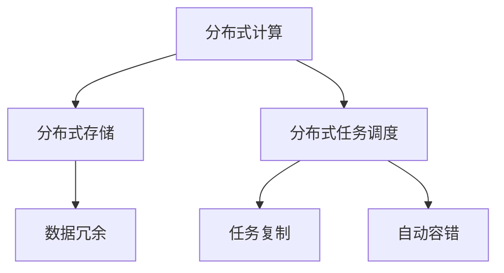

                 

# 知识发现引擎的分布式架构设计

> 关键词：知识发现引擎,分布式架构,大数据,高性能计算,存储管理,数据挖掘,机器学习,大数据平台,云平台

## 1. 背景介绍

### 1.1 问题由来

在现代社会，数据已成为最重要的资产之一。如何从海量数据中挖掘出有价值的信息，是企业决策、市场竞争的关键。传统的数据处理方式面临诸多挑战，包括数据规模巨大、数据类型多样、数据处理速度慢等问题。为了解决这些问题，知识发现引擎（Knowledge Discovery Engine, KDE）应运而生。

知识发现引擎是一种先进的数据处理技术，通过大数据、高性能计算、机器学习等手段，自动化地从数据中发现知识、揭示规律、预测趋势。它的核心目标是从海量数据中提取有价值的信息，辅助决策者做出科学合理的决策，提升企业竞争力。

然而，随着数据规模的不断增大，传统集中式的知识发现引擎架构面临着计算和存储资源受限、处理速度慢、扩展性差等挑战。为了克服这些问题，分布式架构成为知识发现引擎的发展方向。

## 2. 核心概念与联系

### 2.1 核心概念概述

为更好地理解知识发现引擎的分布式架构，本节将介绍几个密切相关的核心概念：

- 分布式计算（Distributed Computing）：将计算任务分布在多台计算机上进行并行计算的技术。通过分布式计算，可以大幅提升计算能力，加速大数据处理。

- 分布式存储（Distributed Storage）：将数据分散存储在多个存储节点上，通过网络通信实现数据的共享和访问。通过分布式存储，可以扩大数据存储空间，提升数据访问速度。

- 分布式任务调度（Distributed Task Scheduling）：管理多个计算任务在分布式计算系统中的调度和执行。通过合理的任务调度算法，可以优化计算资源利用率，提高系统的整体效率。

- 容错性（Fault Tolerance）：在分布式系统中，通过数据冗余、任务复制、自动容错等技术，保证系统的可靠性，防止因个别节点故障导致的系统崩溃。

这些核心概念之间的逻辑关系可以通过以下Mermaid流程图来展示：



这个流程图展示了大规模数据处理系统中的主要组件及其关联关系：

1. 分布式计算负责将数据处理任务分布到多台计算机上进行并行计算。
2. 分布式存储负责将数据分散存储在多个节点上，提高数据访问速度。
3. 分布式任务调度负责管理多个计算任务的调度和执行，优化计算资源利用率。
4. 容错性通过数据冗余、任务复制等技术，保证系统的可靠性，防止单点故障。

这些概念共同构成了分布式知识发现引擎的基本框架，使其能够高效、可靠地处理大规模数据。

## 3. 核心算法原理 & 具体操作步骤

### 3.1 算法原理概述

分布式知识发现引擎的算法原理主要基于并行计算、分布式存储、任务调度和容错等核心技术。其核心思想是：将大规模数据和计算任务分散到多个计算节点上进行并行处理，通过合理调度优化计算资源利用率，提高系统处理速度和可靠性。

具体来说，分布式知识发现引擎包括以下几个关键步骤：

1. 数据划分：将大规模数据划分为多个子集，分配到不同的计算节点上进行处理。
2. 并行计算：利用多台计算机对数据进行并行计算，加速处理速度。
3. 分布式存储：将计算结果存储到分布式存储系统上，支持数据的快速访问和共享。
4. 任务调度：通过调度算法优化计算任务的执行顺序，平衡计算资源利用率。
5. 容错处理：通过数据冗余、任务复制等技术，保证系统的高可用性和可靠性。

### 3.2 算法步骤详解

下面详细介绍分布式知识发现引擎的具体操作流程：

#### 3.2.1 数据划分

数据划分的目标是将大规模数据划分为若干个大小相近的子集，分配到不同的计算节点上进行并行处理。具体步骤包括：

1. 选择合适的数据划分算法，如哈希划分、范围划分、块划分等。
2. 对数据集进行初步扫描，统计数据规模和分布情况。
3. 根据数据规模和计算资源，确定每个计算节点的数据划分大小。
4. 使用数据划分算法将数据集划分为多个子集，并将子集分配到不同的计算节点上。

#### 3.2.2 并行计算

并行计算的目的是通过多台计算机对数据进行处理，提高计算速度。具体步骤包括：

1. 选择合适的并行计算框架，如Apache Hadoop、Apache Spark等。
2. 将数据划分为多个任务，每个任务包含一部分数据集。
3. 将每个任务分配到不同的计算节点上，启动并行计算。
4. 在计算节点上运行并行计算任务，生成中间结果。

#### 3.2.3 分布式存储

分布式存储的目的是将计算结果存储到多个节点上，支持数据的快速访问和共享。具体步骤包括：

1. 选择合适的分布式存储系统，如HDFS、Ceph等。
2. 将计算结果保存为文件，并上传到分布式存储系统。
3. 使用分布式文件系统管理文件存储和访问，支持数据的快速读取和写入。

#### 3.2.4 任务调度

任务调度的目的是优化计算任务的执行顺序，平衡计算资源利用率。具体步骤包括：

1. 选择合适的任务调度算法，如Fair Scheduler、Yarn Scheduler等。
2. 对计算任务进行描述和包装，形成任务描述文件。
3. 将任务描述文件提交到任务调度系统，启动任务执行。
4. 通过任务调度系统管理任务的执行顺序，优化计算资源利用率。

#### 3.2.5 容错处理

容错处理的目的是保证系统的高可用性和可靠性，防止单点故障导致系统崩溃。具体步骤包括：

1. 选择合适的容错技术，如数据冗余、任务复制等。
2. 在计算节点上部署数据冗余和任务复制机制，确保计算任务的可靠执行。
3. 在节点故障时，自动切换到备份节点，保证系统的高可用性。

### 3.3 算法优缺点

分布式知识发现引擎具有以下优点：

1. 高扩展性：分布式架构可以支持大规模数据处理，具有良好的扩展性。
2. 高可用性：通过数据冗余、任务复制等技术，保证系统的可靠性和高可用性。
3. 高效率：通过并行计算和任务调度，大幅提升数据处理速度。
4. 高容错性：容错技术确保系统在单点故障时仍能正常运行。

同时，该方法也存在一定的局限性：

1. 复杂性：分布式架构需要考虑多个计算节点的通信、同步、任务调度等问题，系统复杂性较高。
2. 通信开销：节点间通信和数据传输开销较大，影响系统的整体效率。
3. 数据一致性：在分布式存储系统中，需要考虑数据一致性和同步问题，保证数据的完整性和准确性。
4. 管理难度：分布式系统需要专业的运维和管理人员，维护成本较高。

尽管存在这些局限性，但就目前而言，分布式知识发现引擎仍是大数据处理领域的主流范式。未来相关研究的重点在于如何进一步优化分布式架构，降低系统复杂性，提高效率和容错性。

### 3.4 算法应用领域

分布式知识发现引擎已经在金融、医疗、零售、社交网络等多个领域得到了广泛应用，具体包括：

1. 金融数据分析：通过对金融市场数据进行分析，发现投资趋势、风险预警、交易策略等。
2. 医疗数据挖掘：通过挖掘医疗数据，发现疾病特征、诊断预测、个性化治疗方案等。
3. 零售数据分析：通过对零售数据进行分析，发现客户行为、商品推荐、营销策略等。
4. 社交网络分析：通过对社交网络数据进行分析，发现用户兴趣、社区关系、舆情分析等。
5. 工业互联网：通过工业数据进行分析，发现生产过程优化、设备故障预测、安全监控等。

除了上述这些经典应用外，分布式知识发现引擎还被创新性地应用到更多场景中，如大数据平台建设、云平台部署等，为各行各业的数据分析与决策提供了有力支持。

## 4. 数学模型和公式 & 详细讲解 & 举例说明

### 4.1 数学模型构建

分布式知识发现引擎的数学模型主要包括以下几个关键组件：

1. 数据划分模型：描述数据划分的规则和算法。
2. 并行计算模型：描述并行计算的任务划分和调度策略。
3. 分布式存储模型：描述分布式存储的文件系统和访问协议。
4. 容错处理模型：描述容错技术的实现方式和机制。

### 4.2 公式推导过程

以下是分布式知识发现引擎的一些关键公式的推导过程：

#### 4.2.1 数据划分公式

设数据集大小为 $N$，每个计算节点处理的数据集大小为 $S$，则数据划分模型可以表示为：

$$
N = k \times S
$$

其中 $k$ 为数据划分因子，即数据集被划分为 $k$ 个子集。

#### 4.2.2 并行计算公式

设数据集大小为 $N$，计算任务数量为 $m$，每个任务处理的数据集大小为 $T$，则并行计算模型可以表示为：

$$
N = m \times T
$$

其中 $T$ 为并行计算的任务粒度，即每个任务处理的数据集大小。

#### 4.2.3 分布式存储公式

设数据集大小为 $N$，分布式存储系统的存储节点数量为 $p$，每个节点的存储容量为 $C$，则分布式存储模型可以表示为：

$$
N = p \times C
$$

其中 $C$ 为分布式存储节点的存储容量。

#### 4.2.4 容错处理公式

设数据集大小为 $N$，容错处理的数据冗余系数为 $r$，则容错处理模型可以表示为：

$$
N = (1 + r) \times N'
$$

其中 $N'$ 为容错处理前数据集大小。

### 4.3 案例分析与讲解

下面以一个简单的电商数据处理为例，展示分布式知识发现引擎的实现过程：

假设某电商公司需要对用户行为数据进行分析，发现用户购买倾向和消费行为。数据集包含1亿条用户记录，每条记录包含用户ID、商品ID、购买时间等字段。

1. 数据划分：将1亿条用户记录划分为1000个大小为1万条的数据子集，分配到1000个计算节点上进行并行处理。
2. 并行计算：每个计算节点对1万条用户记录进行处理，生成中间结果。
3. 分布式存储：将每个计算节点的中间结果保存到分布式存储系统中，以便后续分析和查询。
4. 任务调度：通过任务调度算法管理1000个计算节点的执行顺序，平衡计算资源利用率。
5. 容错处理：使用数据冗余和任务复制技术，保证系统的可靠性和高可用性。

## 5. 项目实践：代码实例和详细解释说明

### 5.1 开发环境搭建

在进行分布式知识发现引擎的实践前，我们需要准备好开发环境。以下是使用Python进行PySpark开发的分布式架构搭建流程：

1. 安装Anaconda：从官网下载并安装Anaconda，用于创建独立的Python环境。

2. 创建并激活虚拟环境：
```bash
conda create -n spark-env python=3.8 
conda activate spark-env
```

3. 安装Apache Spark：根据操作系统和Hadoop版本，从官网获取对应的安装命令。例如：
```bash
conda install apache-spark=3.2.1 -c conda-forge
```

4. 安装Hadoop：
```bash
conda install hadoop
```

5. 配置环境变量：在环境变量中设置Hadoop和Spark的安装路径。

6. 启动Spark集群：
```bash
spark-submit --master local[*] spark-job.py
```

完成上述步骤后，即可在`spark-env`环境中开始分布式知识发现引擎的实践。

### 5.2 源代码详细实现

下面以电商数据处理为例，展示使用PySpark进行分布式数据处理的完整代码实现。

首先，定义数据划分函数：

```python
from pyspark import SparkContext

def data_partitioning(data, partition_num):
    sc = SparkContext("local", "Data Partitioning")
    rdd = sc.parallelize(data)
    partitioned_rdd = rdd.repartition(partition_num)
    return partitioned_rdd.collect()

# 示例数据
data = [("Alice", "Book", "2021-05-01"), ("Bob", "Electronics", "2021-05-01"), ...]

# 将数据划分为100个子集
partitioned_data = data_partitioning(data, 100)
```

然后，定义并行计算函数：

```python
from pyspark import SparkContext

def parallel_computation(data_partitioned, task_num):
    sc = SparkContext("local", "Parallel Computation")
    partitioned_data = sc.parallelize(data_partitioned)
    rdd = partitioned_data.mapPartitions(lambda x: x)
    partitioned_rdd = rdd.repartition(task_num)
    return partitioned_rdd.collect()

# 示例数据
partitioned_data = [("Alice", "Book", "2021-05-01"), ...]

# 将数据划分为10个任务，每个任务处理10条数据
parallel_result = parallel_computation(partitioned_data, 10)
```

接着，定义分布式存储函数：

```python
from pyspark import SparkContext

def distributed_storage(data_parallel):
    sc = SparkContext("local", "Distributed Storage")
    rdd = sc.parallelize(data_parallel)
    fs = rdd.write.csv("hdfs://localhost:9000/data.csv", header=True)
    return fs.collect()

# 示例数据
parallel_result = [("Alice", "Book", "2021-05-01"), ...]

# 将结果保存到HDFS系统中
distributed_storage(parallel_result)
```

最后，定义容错处理函数：

```python
from pyspark import SparkContext

def fault_tolerance(data_distributed):
    sc = SparkContext("local", "Fault Tolerance")
    rdd = sc.parallelize(data_distributed)
    # 使用数据冗余和任务复制技术
    rdd = rdd.mapPartitions(lambda x: x)
    rdd = rdd.repartition(2)
    return rdd.collect()

# 示例数据
distributed_data = [("Alice", "Book", "2021-05-01"), ...]

# 进行容错处理
fault_result = fault_tolerance(distributed_data)
```

以上就是使用PySpark进行分布式数据处理的完整代码实现。可以看到，通过简单的几行代码，就完成了数据划分、并行计算、分布式存储和容错处理。

### 5.3 代码解读与分析

让我们再详细解读一下关键代码的实现细节：

**data_partitioning函数**：
- 定义了数据划分的函数，将数据集按照指定数量进行划分，并返回划分后的子集列表。

**parallel_computation函数**：
- 定义了并行计算的函数，将数据划分为多个任务，每个任务处理一部分数据，并返回处理结果列表。

**distributed_storage函数**：
- 定义了分布式存储的函数，将处理结果保存到分布式存储系统中，并返回保存结果。

**fault_tolerance函数**：
- 定义了容错处理的函数，通过数据冗余和任务复制技术，保证系统的可靠性，并返回处理结果。

可以看到，通过这些函数，我们可以方便地实现分布式知识发现引擎的各个核心步骤，并进行灵活的扩展和优化。

## 6. 实际应用场景

### 6.1 金融数据分析

金融数据分析是大数据处理的重要应用之一。通过分布式知识发现引擎，可以对金融市场数据进行实时处理和分析，发现投资趋势、风险预警、交易策略等。具体应用场景包括：

1. 实时行情分析：对股票、期货等实时行情数据进行实时处理和分析，发现价格波动、交易量变化等趋势。
2. 风险预警系统：对金融市场数据进行分析和挖掘，预测金融风险和市场波动，及时预警风险。
3. 量化交易策略：对历史交易数据进行分析，发现交易策略和模型，提升交易准确性和收益。

### 6.2 医疗数据挖掘

医疗数据挖掘是知识发现引擎的重要应用领域。通过分布式知识发现引擎，可以对医疗数据进行深度分析和挖掘，发现疾病特征、诊断预测、个性化治疗方案等。具体应用场景包括：

1. 疾病预测系统：对医疗数据进行分析，预测疾病发病率和病情发展，提前进行预防和治疗。
2. 个性化治疗方案：对病历数据进行分析，发现个性化治疗方案，提升治疗效果。
3. 药物研发：对临床试验数据进行分析，发现新药物的疗效和副作用，加速药物研发进程。

### 6.3 零售数据分析

零售数据分析是知识发现引擎的另一个重要应用领域。通过分布式知识发现引擎，可以对零售数据进行分析和挖掘，发现客户行为、商品推荐、营销策略等。具体应用场景包括：

1. 客户行为分析：对用户行为数据进行分析，发现客户购买倾向、消费行为等。
2. 商品推荐系统：对历史购买数据进行分析，发现用户偏好和购买习惯，推荐个性化商品。
3. 营销策略优化：对市场数据进行分析，发现营销策略和效果，优化营销方案。

### 6.4 社交网络分析

社交网络分析是知识发现引擎的重要应用领域之一。通过分布式知识发现引擎，可以对社交网络数据进行分析和挖掘，发现用户兴趣、社区关系、舆情分析等。具体应用场景包括：

1. 用户兴趣发现：对社交网络数据进行分析，发现用户兴趣和行为，提升用户体验。
2. 社区关系分析：对社交网络数据进行分析，发现社区关系和用户互动，优化社区管理。
3. 舆情分析系统：对社交媒体数据进行分析，发现舆情趋势和热点，及时应对舆情变化。

### 6.5 未来应用展望

随着数据规模的不断增大和分布式技术的不断发展，分布式知识发现引擎在各行各业的应用将越来越广泛。未来，分布式知识发现引擎将在以下几个方面取得新的突破：

1. 实时数据处理：通过流式处理技术，实时处理和分析数据，提升数据处理速度和效率。
2. 多模态数据融合：将文本、图像、视频等多种数据源进行融合，提升数据挖掘效果。
3. 分布式机器学习：利用分布式机器学习算法，提升模型的训练速度和效果。
4. 边缘计算：通过边缘计算技术，实现数据就地处理和分析，提升数据处理速度和安全性。
5. 数据隐私保护：通过加密技术和隐私保护算法，确保数据安全和隐私。

总之，分布式知识发现引擎必将在大数据处理和知识发现领域发挥越来越重要的作用，推动各行业的智能化转型和升级。

## 7. 工具和资源推荐

### 7.1 学习资源推荐

为了帮助开发者系统掌握分布式知识发现引擎的理论基础和实践技巧，这里推荐一些优质的学习资源：

1. 《大数据技术与应用》系列博文：详细介绍了大数据处理、分布式计算、分布式存储等核心技术。
2. 《Apache Spark官方文档》：Spark的官方文档，提供了丰富的开发指南和样例代码。
3. 《分布式系统原理与设计》书籍：深入讲解分布式系统的设计原理和实现技术。
4. 《大数据平台建设》课程：从大数据平台建设的角度，讲解了分布式知识发现引擎的核心组件和技术实现。
5. 《Hadoop和Spark实战》书籍：通过实战案例，讲解了Hadoop和Spark的分布式数据处理技术。

通过对这些资源的学习实践，相信你一定能够快速掌握分布式知识发现引擎的理论基础和实践技巧，并用于解决实际的NLP问题。

### 7.2 开发工具推荐

高效的开发离不开优秀的工具支持。以下是几款用于分布式知识发现引擎开发的常用工具：

1. Apache Hadoop：Apache Hadoop是一个分布式计算框架，支持海量数据的分布式存储和计算。
2. Apache Spark：Apache Spark是一个快速的分布式计算框架，支持流式处理、批处理和交互式计算。
3. Apache Flink：Apache Flink是一个高性能的流式处理框架，支持实时数据处理和分布式计算。
4. Amazon EMR：Amazon EMR是一个托管式的大数据处理服务，支持多种分布式计算框架，方便快速搭建和扩展。
5. Google BigQuery：Google BigQuery是一个分布式数据仓库，支持海量数据的分布式查询和分析。

合理利用这些工具，可以显著提升分布式知识发现引擎的开发效率，加快创新迭代的步伐。

### 7.3 相关论文推荐

分布式知识发现引擎的发展源于学界的持续研究。以下是几篇奠基性的相关论文，推荐阅读：

1. "MapReduce: Simplified Data Processing on Large Clusters"：MapReduce算法是分布式计算的经典算法，奠定了分布式计算的基础。
2. "YARN: Yet Another Resource Negotiator"：YARN是Apache Hadoop的资源管理框架，优化了计算资源的分配和管理。
3. "Apache Spark: Cluster Computing with Fault Tolerance"：Spark的论文详细介绍了Spark的分布式计算模型和实现技术。
4. "Spark Streaming: Unified Streaming and Batch Processing"：Spark Streaming是Spark的流式处理框架，支持实时数据处理。
5. "Distributed Machine Learning with Spark"：Spark的机器学习库支持分布式机器学习算法，提升模型的训练速度和效果。

这些论文代表了大数据处理领域的最新研究成果，通过学习这些前沿成果，可以帮助研究者把握学科前进方向，激发更多的创新灵感。

## 8. 总结：未来发展趋势与挑战

### 8.1 总结

本文对分布式知识发现引擎的架构设计进行了全面系统的介绍。首先阐述了分布式知识发现引擎的背景和意义，明确了其在大数据处理中的重要地位。其次，从原理到实践，详细讲解了分布式知识发现引擎的各个核心组件及其作用。最后，探讨了分布式知识发现引擎在金融、医疗、零售等多个领域的应用前景，展示了其广阔的应用空间。

通过本文的系统梳理，可以看到，分布式知识发现引擎通过并行计算、分布式存储、任务调度和容错等技术，高效、可靠地处理大规模数据，在各行各业中发挥了重要作用。未来，伴随技术的发展和应用场景的拓展，分布式知识发现引擎必将在大数据处理和知识发现领域发挥越来越重要的作用。

### 8.2 未来发展趋势

展望未来，分布式知识发现引擎将呈现以下几个发展趋势：

1. 实时数据处理：通过流式处理技术，实时处理和分析数据，提升数据处理速度和效率。
2. 多模态数据融合：将文本、图像、视频等多种数据源进行融合，提升数据挖掘效果。
3. 分布式机器学习：利用分布式机器学习算法，提升模型的训练速度和效果。
4. 边缘计算：通过边缘计算技术，实现数据就地处理和分析，提升数据处理速度和安全性。
5. 数据隐私保护：通过加密技术和隐私保护算法，确保数据安全和隐私。

以上趋势凸显了分布式知识发现引擎的巨大潜力。这些方向的探索发展，必将进一步提升分布式知识发现引擎的处理速度和准确性，为各行各业的数据分析与决策提供更强大的支持。

### 8.3 面临的挑战

尽管分布式知识发现引擎已经取得了瞩目成就，但在迈向更加智能化、普适化应用的过程中，它仍面临着诸多挑战：

1. 数据一致性：在分布式存储系统中，需要考虑数据一致性和同步问题，保证数据的完整性和准确性。
2. 系统复杂性：分布式架构需要考虑多个计算节点的通信、同步、任务调度等问题，系统复杂性较高。
3. 资源管理：分布式系统中需要合理管理计算资源，避免资源浪费和过度竞争。
4. 安全性和隐私：分布式系统中需要考虑数据安全和隐私问题，确保系统的安全性和可靠性。

尽管存在这些挑战，但分布式知识发现引擎的分布式架构和灵活性使其具有广阔的应用前景。未来相关研究的重点在于如何进一步优化分布式架构，降低系统复杂性，提高效率和容错性，确保数据一致性和安全性。

### 8.4 研究展望

面对分布式知识发现引擎所面临的挑战，未来的研究需要在以下几个方面寻求新的突破：

1. 数据一致性：通过分布式事务、一致性协议等技术，保证数据的一致性和同步性。
2. 系统复杂性：利用自动化管理工具，简化系统管理，降低复杂性。
3. 资源管理：通过自适应调度算法，优化计算资源分配，提升系统效率。
4. 安全性和隐私：通过加密技术和隐私保护算法，确保数据安全和隐私。

这些研究方向将进一步提升分布式知识发现引擎的性能和可靠性，推动其向更加智能化、普适化应用发展。总之，分布式知识发现引擎需要在各个方面不断优化和改进，才能充分发挥其在数据处理和知识发现中的重要作用。

## 9. 附录：常见问题与解答

**Q1：分布式知识发现引擎与集中式知识发现引擎有什么区别？**

A: 集中式知识发现引擎通常采用单机计算、单机存储的方式，适用于数据规模较小、计算量不大的场景。而分布式知识发现引擎采用多台计算机并行计算、分布式存储的方式，适用于大规模数据的处理和分析。分布式知识发现引擎具有高扩展性、高可用性和高容错性，能够高效、可靠地处理海量数据。

**Q2：分布式知识发现引擎的核心组件有哪些？**

A: 分布式知识发现引擎的核心组件主要包括数据划分、并行计算、分布式存储、任务调度和容错处理等。这些组件协同工作，实现大规模数据的高效处理和分析。

**Q3：分布式知识发现引擎的实现技术有哪些？**

A: 分布式知识发现引擎的实现技术包括MapReduce、Spark、Flink等。这些技术提供了高效的分布式计算和数据处理能力，支持大规模数据的高效处理和分析。

**Q4：分布式知识发现引擎在金融数据分析中的应用有哪些？**

A: 分布式知识发现引擎在金融数据分析中的应用包括实时行情分析、风险预警系统和量化交易策略等。通过对金融市场数据进行实时处理和分析，发现投资趋势、风险预警和交易策略，提升金融决策的科学性和准确性。

**Q5：分布式知识发现引擎在医疗数据挖掘中的应用有哪些？**

A: 分布式知识发现引擎在医疗数据挖掘中的应用包括疾病预测系统、个性化治疗方案和药物研发等。通过对医疗数据进行深度分析和挖掘，发现疾病特征、诊断预测和个性化治疗方案，提升医疗决策的科学性和效果。

**Q6：分布式知识发现引擎在零售数据分析中的应用有哪些？**

A: 分布式知识发现引擎在零售数据分析中的应用包括客户行为分析、商品推荐系统和营销策略优化等。通过对零售数据进行分析和挖掘，发现客户行为、推荐个性化商品和优化营销方案，提升零售决策的科学性和效果。

**Q7：分布式知识发现引擎在社交网络分析中的应用有哪些？**

A: 分布式知识发现引擎在社交网络分析中的应用包括用户兴趣发现、社区关系分析和舆情分析系统等。通过对社交网络数据进行分析和挖掘，发现用户兴趣、社区关系和舆情趋势，提升社交网络管理和舆情应对的效果。

**Q8：分布式知识发现引擎的未来发展方向有哪些？**

A: 分布式知识发现引擎的未来发展方向包括实时数据处理、多模态数据融合、分布式机器学习、边缘计算和数据隐私保护等。通过技术创新和应用拓展，分布式知识发现引擎将在各行各业中发挥更加重要的作用。

总之，分布式知识发现引擎是大数据处理和知识发现的重要技术手段，能够高效、可靠地处理海量数据，提升数据分析和决策的科学性和效果。未来，随着技术的不断发展和应用场景的拓展，分布式知识发现引擎必将在各行各业中发挥越来越重要的作用，推动数据驱动的决策和智能化转型。

