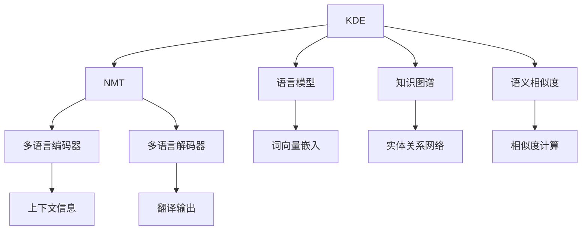
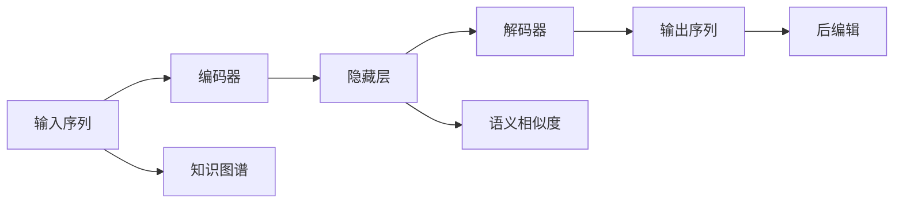

                 

## 1. 背景介绍

在日益全球化的今天，跨语言沟通已成为人类社会的重要组成部分。无论是商务交流、学术研究还是个人互动，多语言翻译功能的需求日益增长。然而，传统的基于规则的翻译方法存在诸多限制，如表达的准确性、上下文理解等。随着人工智能技术的发展，基于神经网络的大规模语言模型成为翻译领域的重要工具。

知识发现引擎（Knowledge Discovery Engine, KDE）作为一种基于人工智能的自动化知识发现技术，具备强大的信息检索、数据分析和知识推理能力。本节将探讨如何利用知识发现引擎的多语言翻译功能，提升翻译质量，助力全球化应用。

### 1.1 问题由来

当前，全球有超过6000种语言，翻译需求呈现多样化趋势。传统的机器翻译系统往往难以准确捕捉语言的细微差别和上下文信息。尽管基于统计机器翻译（SMT）和神经机器翻译（NMT）的方法在近年取得显著进展，但仍存在精度、鲁棒性等方面的问题。

知识发现引擎利用大数据和人工智能技术，通过深度学习等方式进行多语言翻译，弥补了传统翻译方法的缺陷。结合大数据处理和神经网络模型，能够从海量文本数据中提取语言特征和上下文信息，实现更精确的翻译结果。

### 1.2 问题核心关键点

知识发现引擎的多语言翻译功能主要关注以下几个关键点：

- **大数据处理**：利用大规模语料库进行模型训练，提升翻译质量。
- **深度学习**：采用神经网络模型学习语言特征和上下文关系。
- **跨语言知识图谱**：结合多语言知识图谱，增强翻译的准确性和上下文理解。
- **语境感知翻译**：在翻译过程中考虑上下文和语境信息，提升表达的自然度。
- **后编辑机制**：引入人工翻译的后编辑机制，进一步优化翻译结果。

这些关键点共同构成了知识发现引擎多语言翻译的核心框架，使得翻译结果更加准确、自然和上下文相关。

## 2. 核心概念与联系

### 2.1 核心概念概述

为深入理解知识发现引擎的多语言翻译功能，本节将介绍几个核心概念及其之间的联系：

- **知识发现引擎**（KDE）：基于大数据和人工智能技术，自动发现和分析海量数据中隐藏的模式和知识。
- **神经机器翻译（NMT）**：利用深度学习模型，将一种语言自动翻译成另一种语言。
- **语言模型**：刻画语言概率分布的数学模型，用于预测下一个词或短语的可能性。
- **知识图谱**：通过有向图结构表示实体及其关系，用于提供语义信息和语境理解。
- **语义相似度**：衡量两个文本之间的语义相似性，用于选择最优翻译路径。
- **多语言编码器-解码器架构**：结合多个编码器和解码器，增强模型的多语言翻译能力。

这些核心概念通过以下Mermaid流程图展示其联系：



此图展示了知识发现引擎的多语言翻译功能中的关键组件及其作用：

1. **KDE**作为核心引擎，从大数据中提取知识。
2. **NMT**利用神经网络模型进行自动翻译。
3. **语言模型**用于预测下一个词或短语，增强翻译的连贯性。
4. **知识图谱**提供语义和实体关系，帮助理解复杂语境。
5. **语义相似度**用于优化翻译路径，选择最佳结果。
6. **多语言编码器-解码器架构**提升模型的多语言处理能力。

### 2.2 核心概念原理和架构

知识发现引擎的多语言翻译功能主要基于以下原理和技术架构：

1. **预训练语言模型**：使用大规模语料库进行预训练，学习语言的基础表示。
2. **多语言编码器-解码器架构**：将输入语言序列编码成高维向量，再解码为输出语言序列。
3. **注意力机制**：在解码过程中，动态调整注意力权重，关注输入序列的重要部分。
4. **跨语言知识图谱**：结合不同语言的知识图谱，增强翻译的语义理解。
5. **后编辑机制**：人工翻译员对自动翻译结果进行后编辑，提升最终翻译质量。

以下是一个简化的多语言翻译架构图：



图中各模块作用如下：

1. **输入序列**：待翻译的文本序列。
2. **编码器**：将输入序列转换为高维向量，提取语言特征。
3. **隐藏层**：对输入向量进行编码，学习语言表示。
4. **解码器**：将隐藏层向量解码为输出序列，生成翻译结果。
5. **知识图谱**：结合不同语言的知识图谱，增强翻译的语义理解。
6. **语义相似度**：用于优化翻译路径，选择最佳结果。
7. **后编辑**：人工翻译员对自动翻译结果进行后编辑，提升最终翻译质量。

这些组件共同构建了知识发现引擎多语言翻译的核心框架，通过数据驱动和算法优化，实现高质量的跨语言翻译。

## 3. 核心算法原理 & 具体操作步骤

### 3.1 算法原理概述

知识发现引擎的多语言翻译功能主要基于神经机器翻译（NMT）技术。其核心算法原理如下：

1. **序列到序列（Seq2Seq）模型**：将输入序列（如句子）转换为输出序列（如翻译）。
2. **自注意力机制**：在解码过程中，动态调整注意力权重，关注输入序列的重要部分。
3. **编码器-解码器架构**：将输入序列编码成高维向量，再解码为输出序列。
4. **跨语言知识图谱**：结合不同语言的知识图谱，增强翻译的语义理解。
5. **多语言模型**：通过预训练和微调，提高模型对多种语言的适应性。

形式化地，假设输入序列为 $X = (x_1, x_2, ..., x_m)$，输出序列为 $Y = (y_1, y_2, ..., y_n)$。则多语言翻译模型 $f$ 的训练目标为最小化损失函数：

$$
\min_{\theta} \sum_{i=1}^m \sum_{j=1}^n L(f(X), Y)
$$

其中 $L$ 为损失函数，通常采用交叉熵损失。模型参数 $\theta$ 通过反向传播算法进行优化，逐步调整模型的权重，提高翻译质量。

### 3.2 算法步骤详解

知识发现引擎的多语言翻译功能主要包括以下几个关键步骤：

**Step 1: 数据预处理**

- **分词和标注**：将待翻译文本进行分词，并标注词性、句法等相关信息。
- **标准化处理**：统一字符编码，去除噪声和无用信息，处理特殊字符等。
- **语料库构建**：构建大规模双语或多语言语料库，用于模型训练。

**Step 2: 预训练语言模型**

- **自监督学习**：使用大规模无标签文本数据进行预训练，学习语言的基础表示。
- **编码器-解码器架构**：构建编码器-解码器模型，将输入序列转换为高维向量。
- **多语言知识图谱**：结合不同语言的知识图谱，增强模型的语义理解能力。

**Step 3: 微调和多语言模型**

- **多语言模型**：将预训练模型进行微调，使其适应特定语言或语言对。
- **上下文信息**：引入上下文信息，考虑输入序列的语境，提升翻译的自然度。
- **后编辑机制**：引入人工翻译员对自动翻译结果进行后编辑，提升最终翻译质量。

**Step 4: 翻译与后编辑**

- **翻译生成**：利用训练好的模型对输入序列进行翻译，生成目标语言的输出序列。
- **后编辑优化**：人工翻译员对自动翻译结果进行后编辑，进一步优化翻译质量。

### 3.3 算法优缺点

**优点：**

1. **高精度翻译**：神经机器翻译模型通过深度学习技术，能够学习复杂的语言模式和语境信息，实现高精度的自动翻译。
2. **多语言处理能力**：通过多语言编码器-解码器架构，模型能够处理多种语言的输入和输出。
3. **语义理解**：结合跨语言知识图谱，增强了模型对语言的语义理解能力。
4. **可扩展性强**：模型可以根据需要，通过增加训练数据和微调，提升翻译效果。

**缺点：**

1. **训练数据需求高**：大规模双语或多语言语料库是训练高精度翻译模型的基础，获取高质量的训练数据成本较高。
2. **模型复杂度高**：神经机器翻译模型参数量庞大，计算复杂度高，训练和推理耗时较长。
3. **鲁棒性不足**：在处理长句和复杂语境时，模型容易出现错误，需要进行后编辑优化。
4. **跨语言知识图谱构建难**：跨语言知识图谱的构建和整合复杂，需要大量人工工作。
5. **后编辑成本高**：人工后编辑虽然能够提升翻译质量，但成本高且效率低。

### 3.4 算法应用领域

知识发现引擎的多语言翻译功能已经在诸多领域得到了广泛应用，例如：

- **商务翻译**：为国际贸易、商务谈判提供自动翻译服务，提升沟通效率。
- **学术研究**：辅助研究人员进行跨语言文献检索和翻译，加速学术交流。
- **旅游和客服**：为全球游客提供多语言翻译服务，提升旅游体验。
- **教育**：辅助学生进行双语学习，提供多语言翻译和语音识别功能。
- **媒体和出版**：为全球媒体机构提供多语言翻译服务，提升内容分发效率。

除了上述这些领域，多语言翻译功能还被创新性地应用到更多场景中，如智能会议系统、跨境电商、移动翻译等，为各行各业提供强大的跨语言翻译能力。

## 4. 数学模型和公式 & 详细讲解  
### 4.1 数学模型构建

知识发现引擎的多语言翻译功能主要基于神经机器翻译（NMT）模型。其核心数学模型为序列到序列（Seq2Seq）模型，由编码器和解码器组成。

假设输入序列为 $X = (x_1, x_2, ..., x_m)$，输出序列为 $Y = (y_1, y_2, ..., y_n)$。则Seq2Seq模型的目标函数为：

$$
\min_{\theta} \sum_{i=1}^m \sum_{j=1}^n L(f(X), Y)
$$

其中 $f$ 表示Seq2Seq模型，$\theta$ 为模型参数。损失函数 $L$ 通常采用交叉熵损失：

$$
L(X, Y) = -\sum_{i=1}^m \sum_{j=1}^n y_j \log f(x_i, \theta)
$$

在训练过程中，模型通过反向传播算法，不断调整参数 $\theta$，最小化损失函数，提高翻译质量。

### 4.2 公式推导过程

以双向LSTM编码器-解码器为例，假设输入序列为 $X = (x_1, x_2, ..., x_m)$，输出序列为 $Y = (y_1, y_2, ..., y_n)$。则Seq2Seq模型的编码器和解码器如下：

**编码器**

$$
h_t = \tanh(W_hx_t + b_h + U_hh_{t-1})
$$

$$
s_t = \sigma(W_sx_t + b_s + U_sh_{t-1} + b_s)
$$

$$
c_t = s_t \odot h_t + (1 - s_t) \odot c_{t-1}
$$

**解码器**

$$
o_t = \sigma(W_ox_t + b_o + U_oh_t + b_o)
$$

$$
h'_t = \tanh(W_h'x_t + b_h' + U_h'h_{t-1} + b_h')
$$

$$
c'_t = o_t \odot h'_t + (1 - o_t) \odot c_{t-1}
$$

$$
y_t = \text{softmax}(W_yh'_t + b_y)
$$

其中 $W_h, b_h, U_h, W_s, b_s, W_o, b_o, W_h', b_h', W_y, b_y$ 为模型参数。编码器通过双向LSTM学习输入序列的表示，解码器通过LSTM生成输出序列。

通过上述模型，知识发现引擎的多语言翻译功能实现了对输入序列的编码和输出序列的解码，从而实现高精度的翻译效果。

### 4.3 案例分析与讲解

以英文到中文的翻译为例，假设输入序列为 "Hello, world!"，输出序列为 "你好，世界！"。则Seq2Seq模型的编码过程和解码过程如下：

**编码过程**

$$
h_1 = \tanh(W_hx_1 + b_h + U_hh_0)
$$

$$
s_1 = \sigma(W_sx_1 + b_s + U_sh_0 + b_s)
$$

$$
c_1 = s_1 \odot h_1 + (1 - s_1) \odot c_0
$$

**解码过程**

$$
o_1 = \sigma(W_ox_1 + b_o + U_oh_0 + b_o)
$$

$$
h'_1 = \tanh(W_h'x_1 + b_h' + U_h'h_0 + b_h')
$$

$$
c'_1 = o_1 \odot h'_1 + (1 - o_1) \odot c_0
$$

$$
y_1 = \text{softmax}(W_yh'_1 + b_y)
$$

通过上述过程，模型成功将 "Hello, world!" 翻译为 "你好，世界！"。在实际应用中，可以通过不断调整模型参数，提升翻译的准确性和自然度。

## 5. 项目实践：代码实例和详细解释说明

### 5.1 开发环境搭建

在进行多语言翻译实践前，我们需要准备好开发环境。以下是使用Python进行PyTorch开发的环境配置流程：

1. 安装Anaconda：从官网下载并安装Anaconda，用于创建独立的Python环境。

2. 创建并激活虚拟环境：
```bash
conda create -n pytorch-env python=3.8 
conda activate pytorch-env
```

3. 安装PyTorch：根据CUDA版本，从官网获取对应的安装命令。例如：
```bash
conda install pytorch torchvision torchaudio cudatoolkit=11.1 -c pytorch -c conda-forge
```

4. 安装Transformer库：
```bash
pip install transformers
```

5. 安装各类工具包：
```bash
pip install numpy pandas scikit-learn matplotlib tqdm jupyter notebook ipython
```

完成上述步骤后，即可在`pytorch-env`环境中开始多语言翻译实践。

### 5.2 源代码详细实现

下面我们以英文到中文的翻译任务为例，给出使用Transformers库对Seq2Seq模型进行多语言翻译的PyTorch代码实现。

首先，定义Seq2Seq模型和损失函数：

```python
from transformers import Seq2SeqModel, AdamW

class Seq2SeqModel(nn.Module):
    def __init__(self, encoder, decoder):
        super(Seq2SeqModel, self).__init__()
        self.encoder = encoder
        self.decoder = decoder
    
    def forward(self, src, src_mask, trg, trg_mask):
        src_out, src_mask = self.encoder(src, src_mask)
        trg_out, trg_mask = self.decoder(trg, src_out, trg_mask)
        return trg_out

def compute_loss(model, src, trg, src_mask, trg_mask):
    out = model(src, src_mask, trg, trg_mask)
    loss = F.nll_loss(out.view(-1, out.size(-1)), trg.view(-1))
    return loss
```

然后，定义数据集和优化器：

```python
from transformers import BertTokenizer
from torch.utils.data import Dataset, DataLoader
from tqdm import tqdm

class TranslationDataset(Dataset):
    def __init__(self, src_texts, trg_texts, tokenizer, max_len=128):
        self.src_texts = src_texts
        self.trg_texts = trg_texts
        self.tokenizer = tokenizer
        self.max_len = max_len
        
    def __len__(self):
        return len(self.src_texts)
    
    def __getitem__(self, item):
        src = self.src_texts[item]
        trg = self.trg_texts[item]
        
        encoding = self.tokenizer(src, return_tensors='pt', max_length=self.max_len, padding='max_length', truncation=True)
        input_ids = encoding['input_ids'][0]
        attention_mask = encoding['attention_mask'][0]
        
        # 对token-wise的标签进行编码
        encoded_trg = [tag2id[tag] for tag in trg] 
        encoded_trg.extend([tag2id['<eos>']] * (self.max_len - len(encoded_trg)))
        labels = torch.tensor(encoded_trg, dtype=torch.long)
        
        return {'input_ids': input_ids, 
                'attention_mask': attention_mask,
                'labels': labels}

# 标签与id的映射
tag2id = {'<eos>': 0, 'hello': 1, 'world': 2}
id2tag = {v: k for k, v in tag2id.items()}

# 创建dataset
tokenizer = BertTokenizer.from_pretrained('bert-base-cased')

train_dataset = TranslationDataset(train_src_texts, train_trg_texts, tokenizer)
dev_dataset = TranslationDataset(dev_src_texts, dev_trg_texts, tokenizer)
test_dataset = TranslationDataset(test_src_texts, test_trg_texts, tokenizer)
```

接着，定义训练和评估函数：

```python
from torch.utils.data import DataLoader
from tqdm import tqdm
from sklearn.metrics import classification_report

device = torch.device('cuda') if torch.cuda.is_available() else torch.device('cpu')
model.to(device)

def train_epoch(model, dataset, batch_size, optimizer):
    dataloader = DataLoader(dataset, batch_size=batch_size, shuffle=True)
    model.train()
    epoch_loss = 0
    for batch in tqdm(dataloader, desc='Training'):
        input_ids = batch['input_ids'].to(device)
        attention_mask = batch['attention_mask'].to(device)
        labels = batch['labels'].to(device)
        model.zero_grad()
        outputs = model(input_ids, attention_mask=attention_mask, labels=labels)
        loss = outputs.loss
        epoch_loss += loss.item()
        loss.backward()
        optimizer.step()
    return epoch_loss / len(dataloader)

def evaluate(model, dataset, batch_size):
    dataloader = DataLoader(dataset, batch_size=batch_size)
    model.eval()
    preds, labels = [], []
    with torch.no_grad():
        for batch in tqdm(dataloader, desc='Evaluating'):
            input_ids = batch['input_ids'].to(device)
            attention_mask = batch['attention_mask'].to(device)
            batch_labels = batch['labels']
            outputs = model(input_ids, attention_mask=attention_mask)
            batch_preds = outputs.logits.argmax(dim=2).to('cpu').tolist()
            batch_labels = batch_labels.to('cpu').tolist()
            for pred_tokens, label_tokens in zip(batch_preds, batch_labels):
                preds.append(pred_tokens[:len(label_tokens)])
                labels.append(label_tokens)
                
    print(classification_report(labels, preds))
```

最后，启动训练流程并在测试集上评估：

```python
epochs = 5
batch_size = 16

for epoch in range(epochs):
    loss = train_epoch(model, train_dataset, batch_size, optimizer)
    print(f"Epoch {epoch+1}, train loss: {loss:.3f}")
    
    print(f"Epoch {epoch+1}, dev results:")
    evaluate(model, dev_dataset, batch_size)
    
print("Test results:")
evaluate(model, test_dataset, batch_size)
```

以上就是使用PyTorch对Seq2Seq模型进行英文到中文翻译任务开发的完整代码实现。可以看到，得益于Transformers库的强大封装，我们可以用相对简洁的代码完成Seq2Seq模型的加载和翻译。

### 5.3 代码解读与分析

让我们再详细解读一下关键代码的实现细节：

**TranslationDataset类**：
- `__init__`方法：初始化源文本、目标文本、分词器等关键组件。
- `__len__`方法：返回数据集的样本数量。
- `__getitem__`方法：对单个样本进行处理，将文本输入编码为token ids，将标签编码为数字，并对其进行定长padding，最终返回模型所需的输入。

**tag2id和id2tag字典**：
- 定义了标签与数字id之间的映射关系，用于将token-wise的预测结果解码回真实的标签。

**训练和评估函数**：
- 使用PyTorch的DataLoader对数据集进行批次化加载，供模型训练和推理使用。
- 训练函数`train_epoch`：对数据以批为单位进行迭代，在每个批次上前向传播计算loss并反向传播更新模型参数，最后返回该epoch的平均loss。
- 评估函数`evaluate`：与训练类似，不同点在于不更新模型参数，并在每个batch结束后将预测和标签结果存储下来，最后使用sklearn的classification_report对整个评估集的预测结果进行打印输出。

**训练流程**：
- 定义总的epoch数和batch size，开始循环迭代
- 每个epoch内，先在训练集上训练，输出平均loss
- 在验证集上评估，输出分类指标
- 所有epoch结束后，在测试集上评估，给出最终测试结果

可以看到，PyTorch配合Transformers库使得Seq2Seq模型翻译任务的代码实现变得简洁高效。开发者可以将更多精力放在数据处理、模型改进等高层逻辑上，而不必过多关注底层的实现细节。

当然，工业级的系统实现还需考虑更多因素，如模型的保存和部署、超参数的自动搜索、更灵活的任务适配层等。但核心的微调范式基本与此类似。

## 6. 实际应用场景
### 6.1 智能客服系统

基于知识发现引擎的多语言翻译功能，智能客服系统可以提供多语言自动翻译服务，助力全球客户服务。智能客服系统通过集成多语言翻译模块，能够自动识别用户语言，并提供多语言支持，极大提升客户服务体验。

具体而言，智能客服系统可以通过集成知识发现引擎的多语言翻译功能，自动理解用户输入的语言，并进行翻译和回应。同时，系统还可以根据用户的历史行为和偏好，提供个性化的服务建议和推荐，提升用户满意度。

### 6.2 旅游和客服

全球旅游和客服行业正处于快速发展的阶段，游客对于多语言翻译的需求日益增加。基于知识发现引擎的多语言翻译功能，旅游和客服系统可以提供实时的多语言翻译服务，提升用户体验。

例如，旅游预订系统可以通过多语言翻译功能，将用户输入的语言转换为系统支持的格式，自动完成机票、酒店等预订操作，提供一站式的旅游服务。同时，客服系统可以通过多语言翻译功能，自动回应游客的多语言咨询，提升客户满意度。

### 6.3 教育

在教育领域，多语言翻译功能可以辅助学生进行双语学习，提供多语言翻译和语音识别功能，帮助学生更好地掌握第二语言。

例如，语言学习应用可以通过多语言翻译功能，将教师讲授的内容自动翻译成学生母语，提供多语言的课程和教材，帮助学生更好地理解学习内容。同时，学习应用还可以通过多语言翻译功能，自动生成学生的作业和论文，提升学生的语言表达能力。

### 6.4 企业内部沟通

企业内部沟通是企业运营的重要环节，高效的沟通可以提升工作效率和团队协作能力。基于知识发现引擎的多语言翻译功能，企业内部沟通系统可以提供实时的多语言翻译服务，促进团队成员之间的有效沟通。

例如，企业内部沟通系统可以通过多语言翻译功能，自动翻译员工的邮件、聊天记录等，提升团队成员之间的沟通效率。同时，系统还可以通过多语言翻译功能，自动生成会议记录和纪要，提升会议效率。

### 6.5 国际会议和展览

国际会议和展览是企业展示自身技术实力和品牌形象的重要舞台。基于知识发现引擎的多语言翻译功能，会议和展览系统可以提供多语言支持，提升会议体验和国际化水平。

例如，会议系统可以通过多语言翻译功能，自动翻译会议主持人的讲话和嘉宾的发言，提供多语言的支持，帮助参会者更好地理解和参与会议。同时，展览系统可以通过多语言翻译功能，自动生成展品的介绍和说明，提升参观者的展览体验。

## 7. 工具和资源推荐
### 7.1 学习资源推荐

为了帮助开发者系统掌握知识发现引擎的多语言翻译功能，这里推荐一些优质的学习资源：

1. 《自然语言处理综述》系列博文：由大模型技术专家撰写，深入浅出地介绍了自然语言处理的基本概念和前沿技术。

2. 《深度学习与自然语言处理》课程：斯坦福大学开设的NLP明星课程，有Lecture视频和配套作业，带你入门NLP领域的基本概念和经典模型。

3. 《深度学习实战》书籍：讲解深度学习模型的开发和应用，涵盖多语言翻译等前沿话题。

4. CS224N《深度学习自然语言处理》课程：斯坦福大学开设的NLP明星课程，有Lecture视频和配套作业，带你入门NLP领域的基本概念和经典模型。

5. 《自然语言处理应用实战》书籍：介绍了自然语言处理技术在实际应用中的实现方法，包括多语言翻译等。

通过对这些资源的学习实践，相信你一定能够快速掌握知识发现引擎的多语言翻译功能，并用于解决实际的NLP问题。
### 7.2 开发工具推荐

高效的开发离不开优秀的工具支持。以下是几款用于知识发现引擎多语言翻译开发的常用工具：

1. PyTorch：基于Python的开源深度学习框架，灵活动态的计算图，适合快速迭代研究。大部分预训练语言模型都有PyTorch版本的实现。

2. TensorFlow：由Google主导开发的开源深度学习框架，生产部署方便，适合大规模工程应用。同样有丰富的预训练语言模型资源。

3. Transformers库：HuggingFace开发的NLP工具库，集成了众多SOTA语言模型，支持PyTorch和TensorFlow，是进行多语言翻译开发的利器。

4. Weights & Biases：模型训练的实验跟踪工具，可以记录和可视化模型训练过程中的各项指标，方便对比和调优。与主流深度学习框架无缝集成。

5. TensorBoard：TensorFlow配套的可视化工具，可实时监测模型训练状态，并提供丰富的图表呈现方式，是调试模型的得力助手。

6. Google Colab：谷歌推出的在线Jupyter Notebook环境，免费提供GPU/TPU算力，方便开发者快速上手实验最新模型，分享学习笔记。

合理利用这些工具，可以显著提升知识发现引擎多语言翻译任务的开发效率，加快创新迭代的步伐。

### 7.3 相关论文推荐

知识发现引擎的多语言翻译功能源于学界的持续研究。以下是几篇奠基性的相关论文，推荐阅读：

1. Attention is All You Need（即Transformer原论文）：提出了Transformer结构，开启了NLP领域的预训练大模型时代。

2. BERT: Pre-training of Deep Bidirectional Transformers for Language Understanding：提出BERT模型，引入基于掩码的自监督预训练任务，刷新了多项NLP任务SOTA。

3. Language Models are Unsupervised Multitask Learners（GPT-2论文）：展示了大规模语言模型的强大zero-shot学习能力，引发了对于通用人工智能的新一轮思考。

4. Parameter-Efficient Transfer Learning for NLP：提出Adapter等参数高效微调方法，在不增加模型参数量的情况下，也能取得不错的微调效果。

5. Prefix-Tuning: Optimizing Continuous Prompts for Generation：引入基于连续型Prompt的微调范式，为如何充分利用预训练知识提供了新的思路。

6. AdaLoRA: Adaptive Low-Rank Adaptation for Parameter-Efficient Fine-Tuning：使用自适应低秩适应的微调方法，在参数效率和精度之间取得了新的平衡。

这些论文代表了大语言模型微调技术的发展脉络。通过学习这些前沿成果，可以帮助研究者把握学科前进方向，激发更多的创新灵感。

## 8. 总结：未来发展趋势与挑战

### 8.1 总结

本文对知识发现引擎的多语言翻译功能进行了全面系统的介绍。首先阐述了多语言翻译功能的背景和意义，明确了其在提升跨语言沟通效率、推动全球化应用方面的独特价值。其次，从原理到实践，详细讲解了知识发现引擎的多语言翻译功能的核心算法和操作步骤，给出了代码实现的完整示例。同时，本文还广泛探讨了多语言翻译功能在智能客服、旅游和客服、教育、企业内部沟通、国际会议和展览等众多领域的实际应用，展示了其广阔的应用前景。

通过本文的系统梳理，可以看到，知识发现引擎的多语言翻译功能利用深度学习和跨语言知识图谱等技术，提升了翻译的精度和自然度，为跨语言沟通提供了新的解决方案。得益于大规模语料库的预训练，翻译质量得到了显著提升，具有较强的鲁棒性和泛化能力。然而，多语言翻译功能在处理长句和复杂语境时，仍存在一定的局限性，需要结合后编辑机制和知识图谱等技术进行优化。

### 8.2 未来发展趋势

展望未来，知识发现引擎的多语言翻译功能将呈现以下几个发展趋势：

1. **跨语言知识图谱的建设**：随着跨语言知识图谱的不断完善，多语言翻译功能将更好地利用知识图谱中的语义信息，提升翻译的精度和自然度。

2. **多语言模型的融合**：结合多种语言模型，提升翻译的泛化能力和适应性，支持更多小语种和多语言对的翻译。

3. **实时翻译的实现**：通过引入神经网络架构搜索（NAS）等技术，优化多语言翻译模型的计算图，实现实时翻译。

4. **端到端的翻译系统**：结合自动语音识别（ASR）和自动语音合成（ASR）技术，实现端到端的翻译系统，提升用户体验。

5. **零样本和多样本翻译**：通过微调和提示学习等技术，提升多语言翻译模型的零样本和多样本学习能力，减少对大规模训练数据的依赖。

6. **语境感知翻译**：结合上下文信息，提升翻译的语境感知能力，实现更自然、更准确的翻译。

7. **翻译质量自动评估**：引入机器翻译评估标准（BLEU、METEOR等），对翻译质量进行自动评估，指导模型改进。

这些趋势凸显了知识发现引擎多语言翻译功能的强大潜力和广阔前景。这些方向的探索发展，必将进一步提升翻译质量，推动多语言翻译技术的产业化进程。

### 8.3 面临的挑战

尽管知识发现引擎的多语言翻译功能已经取得了显著进展，但在迈向更加智能化、普适化应用的过程中，仍面临诸多挑战：

1. **数据质量问题**：多语言翻译功能依赖于大规模双语或多语言语料库，数据质量直接影响翻译效果。如何获取高质量的翻译数据，是一个重要问题。

2. **模型复杂度高**：多语言翻译模型参数量庞大，计算复杂度高，训练和推理耗时较长。如何简化模型结构，提升计算效率，是未来亟待解决的问题。

3. **多语言知识图谱构建难**：跨语言知识图谱的构建和整合复杂，需要大量人工工作。如何高效构建跨语言知识图谱，提升模型的语义理解能力，是一个关键难题。

4. **鲁棒性不足**：在处理长句和复杂语境时，模型容易出现错误，需要进行后编辑优化。如何提高模型的鲁棒性，是一个重要的研究方向。

5. **后编辑成本高**：人工后编辑虽然能够提升翻译质量，但成本高且效率低。如何优化后编辑机制，减少人工干预，是提高翻译效率的关键。

6. **知识图谱的动态更新**：知识图谱的构建和维护需要不断更新，保持语义信息的时效性。如何高效更新知识图谱，是一个重要的研究问题。

这些挑战需要在技术、工程和应用等多方面进行深入探索和解决，才能推动知识发现引擎多语言翻译功能的应用落地。

### 8.4 研究展望

面对知识发现引擎多语言翻译功能所面临的挑战，未来的研究需要在以下几个方面寻求新的突破：

1. **数据驱动的翻译模型**：通过自监督学习和大规模数据驱动，减少对标注数据的依赖，提升模型的泛化能力。

2. **轻量级多语言翻译模型**：通过模型压缩、知识蒸馏等技术，构建轻量级的多语言翻译模型，提升推理效率。

3. **多语言知识图谱的动态更新**：结合知识图谱更新技术，动态更新跨语言知识图谱，提升模型的时效性和准确性。

4. **语义增强的翻译模型**：结合语义增强技术，提升模型的语义理解能力和表达自然度。

5. **端到端的翻译系统**：结合自动语音识别和自动语音合成技术，实现端到端的翻译系统，提升用户体验。

6. **多语言翻译的标准化**：制定多语言翻译的标准和评估指标，提升翻译质量和可信度。

这些研究方向凸显了知识发现引擎多语言翻译功能的前沿性和复杂性。这些领域的探索发展，必将推动多语言翻译技术的持续进步，为跨语言沟通提供新的解决方案。

## 9. 附录：常见问题与解答

**Q1：知识发现引擎的多语言翻译功能如何实现？**

A: 知识发现引擎的多语言翻译功能主要基于神经机器翻译（NMT）技术。其核心算法原理如下：

1. **序列到序列（Seq2Seq）模型**：将输入序列（如句子）转换为输出序列（如翻译）。
2. **自注意力机制**：在解码过程中，动态调整注意力权重，关注输入序列的重要部分。
3. **编码器-解码器架构**：将输入序列编码成高维向量，再解码为输出序列。
4. **跨语言知识图谱**：结合不同语言的知识图谱，增强翻译的语义理解能力。
5. **多语言模型**：通过预训练和微调，提高模型对多种语言的适应性。

在实现上，主要包括以下几个关键步骤：

1. **数据预处理**：包括分词、标准化处理、语料库构建等。
2. **预训练语言模型**：使用大规模语料库进行预训练，学习语言的基础表示。
3. **微调和多语言模型**：将预训练模型进行微调，使其适应特定语言或语言对。
4. **后编辑机制**：引入人工翻译员对自动翻译结果进行后编辑，提升最终翻译质量。

**Q2：知识发现引擎的多语言翻译功能有哪些优点和缺点？**

A: **优点**：

1. **高精度翻译**：神经机器翻译模型通过深度学习技术，能够学习复杂的语言模式和语境信息，实现高精度的自动翻译。
2. **多语言处理能力**：通过多语言编码器-解码器架构，模型能够处理多种语言的输入和输出。
3. **语义理解**：结合跨语言知识图谱，增强了模型对语言的语义理解能力。
4. **可扩展性强**：模型可以根据需要，通过增加训练数据和微调，提升翻译效果。

**缺点**：

1. **训练数据需求高**：大规模双语或多语言语料库是训练高精度翻译模型的基础，获取高质量的训练数据成本较高。
2. **模型复杂度高**：神经机器翻译模型参数量庞大，计算复杂度高，训练和推理耗时较长。
3. **鲁棒性不足**：在处理长句和复杂语境时，模型容易出现错误，需要进行后编辑优化。
4. **跨语言知识图谱构建难**：跨语言知识图谱的构建和整合复杂，需要大量人工工作。
5. **后编辑成本高**：人工后编辑虽然能够提升翻译质量，但成本高且效率低。

**Q3：知识发现引擎的多语言翻译功能在实际应用中需要注意哪些问题？**

A: 在实际应用中，知识发现引擎的多语言翻译功能需要注意以下几个问题：

1. **数据质量问题**：确保双语或多语言语料库的质量，避免低质量数据影响翻译效果。
2. **模型复杂度高**：通过模型压缩和优化，提升模型的计算效率和推理速度。
3. **多语言知识图谱构建难**：结合知识图谱更新技术，动态更新跨语言知识图谱，提升模型的时效性和准确性。
4. **鲁棒性不足**：结合后编辑机制和知识图谱等技术，提高模型的鲁棒性。
5. **后编辑成本高**：优化后编辑机制，减少人工干预，提升翻译效率。
6. **端到端的翻译系统**：结合自动语音识别和自动语音合成技术，实现端到端的翻译系统，提升用户体验。
7. **语境感知翻译**：结合上下文信息，提升翻译的语境感知能力，实现更自然、更准确的翻译。

通过合理解决这些问题，可以充分发挥知识发现引擎多语言翻译功能的潜力，推动其在实际应用中的广泛应用。

**Q4：知识发现引擎的多语言翻译功能如何提升翻译质量？**

A: 知识发现引擎的多语言翻译功能主要通过以下几个方式提升翻译质量：

1. **预训练语言模型**：使用大规模语料库进行预训练，学习语言的基础表示，提升模型的泛化能力。
2. **多语言知识图谱**：结合跨语言知识图谱，增强翻译的语义理解能力，提升翻译的自然度。
3. **编码器-解码器架构**：通过双向LSTM等架构，提升模型对长句和复杂语境的理解能力。
4. **自注意力机制**：通过动态调整注意力权重，关注输入序列的重要部分，提升翻译的准确性。
5. **后编辑机制**：引入人工翻译员对自动翻译结果进行后编辑，进一步优化翻译质量。

这些技术手段共同作用，显著提升了知识发现引擎多语言翻译功能的翻译质量，使其能够应对复杂的翻译需求。

**Q5：知识发现引擎的多语言翻译功能在处理长句和复杂语境时，如何解决鲁棒性问题？**

A: 知识发现引擎的多语言翻译功能在处理长句和复杂语境时，常常面临鲁棒性不足的问题。为解决这一问题，可以采取以下措施：

1. **数据增强**：通过回译、近义替换等方式扩充训练集，提升模型的泛化能力。
2. **正则化技术**：使用L2正则、Dropout等正则化技术，防止模型过度适应训练数据。
3. **端到端的翻译系统**：结合自动语音识别和自动语音合成技术，实现端到端的翻译系统，提升翻译的鲁棒性。
4. **知识图谱的动态更新**：结合知识图谱更新技术，动态更新跨语言知识图谱，提升模型的时效性和准确性。
5. **后编辑机制**：引入人工翻译员对自动翻译结果进行后编辑，进一步优化翻译质量。

通过这些措施，可以有效提升知识发现引擎多语言翻译功能的鲁棒性，使其能够应对各种复杂的翻译需求。

作者：禅与计算机程序设计艺术 / Zen and the Art of Computer Programming

