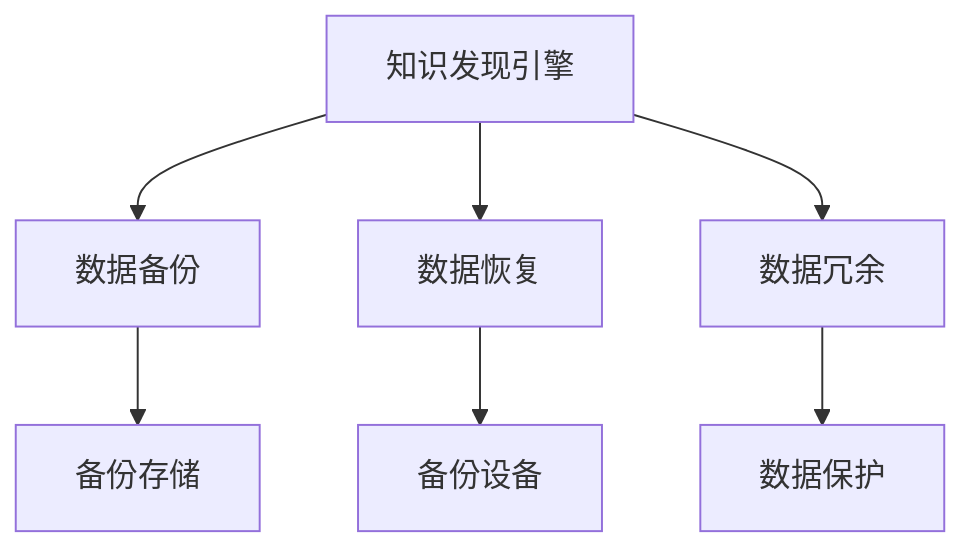

                 

# 知识发现引擎的数据备份与恢复方案

## 1. 背景介绍

在当今大数据时代，知识发现引擎(Knowledge Discovery Engine, KDE)在企业决策、市场分析、客户关系管理等领域发挥着至关重要的作用。知识发现引擎通过对海量数据进行统计分析、挖掘关联、模式匹配等操作，帮助企业从数据中发现隐藏的知识和规律，从而进行决策支持、风险预警、客户画像等高级应用。然而，伴随着数据量的激增，如何确保知识发现引擎的安全性和稳定性，成为企业关注的焦点。

### 1.1 数据备份的重要性

知识发现引擎通常依赖于复杂的数据模型和算法，其核心数据包括原始数据、中间结果、模型参数、元数据等，如果这些数据一旦丢失或损坏，将会严重影响知识发现引擎的正常运行，甚至造成数据泄露和隐私问题。因此，建立完善的数据备份方案是保障知识发现引擎可靠性和持续性的基础。

### 1.2 数据恢复的必要性

知识发现引擎的复杂性和高价值性，决定了其数据恢复难度之大。在面对各种意外灾害（如硬件故障、自然灾害、网络攻击等）时，如何迅速、准确地恢复数据，保障业务的连续性和数据完整性，成为企业必须面对的重大挑战。

本论文将对知识发现引擎的数据备份与恢复方案进行深入探讨，重点介绍数据备份的具体方法和策略，并结合实际应用场景，展示数据恢复的流程和实践。

## 2. 核心概念与联系

### 2.1 核心概念概述

为更好地理解知识发现引擎的数据备份与恢复方案，本节将介绍几个密切相关的核心概念：

- 知识发现引擎(Knowledge Discovery Engine, KDE)：一种数据挖掘工具，通过复杂的数据分析和挖掘技术，从海量数据中发现隐藏的知识和规律。
- 数据备份(Data Backup)：通过将数据复制到远程或本地备份设备，以防止数据丢失或损坏的过程。
- 数据恢复(Data Recovery)：从备份设备中读取数据，还原原始数据的过程。
- 数据冗余(Data Redundancy)：通过数据备份、数据镜像等方式，增加数据副本，提高数据的可用性和可靠性。
- 数据恢复点(Objective Recovery Point)：数据恢复目标的时间点，用于衡量数据恢复的效率和完整性。
- 数据保护(Data Protection)：通过备份、恢复、数据加密等技术手段，保障数据的安全性和隐私性。

这些核心概念之间的逻辑关系可以通过以下Mermaid流程图来展示：



这个流程图展示的知识发现引擎的数据备份与恢复过程：

1. 知识发现引擎通过处理原始数据生成中间结果和模型参数。
2. 数据备份将中间结果和模型参数复制到备份存储设备。
3. 在数据丢失或损坏时，通过数据恢复从备份设备中读取数据。
4. 数据冗余策略通过增加数据副本，提高数据的可用性。
5. 数据保护通过加密、加密协议等手段，保障数据的安全性。

## 3. 核心算法原理 & 具体操作步骤

### 3.1 算法原理概述

知识发现引擎的数据备份与恢复方案，主要基于数据的冗余和复制机制。其核心思想是：通过定期备份知识发现引擎的核心数据，以确保在数据丢失或损坏时，可以迅速从备份设备中恢复数据，恢复过程包括以下步骤：

1. **数据收集**：收集知识发现引擎运行过程中产生的中间结果、模型参数、元数据等核心数据。
2. **数据备份**：将这些数据复制到多个备份设备，确保数据冗余。
3. **备份存储**：将备份数据存储在安全的物理或云存储中，定期进行备份验证。
4. **数据恢复**：在数据丢失或损坏时，从备份设备中读取数据，恢复知识发现引擎。

### 3.2 算法步骤详解

以下是数据备份与恢复的详细操作步骤：

**Step 1: 数据收集**

知识发现引擎的数据备份与恢复方案，首先需要确保能够准确收集所有核心数据。这包括：

- 收集知识发现引擎的中间结果，如数据表、特征矩阵、模型输出等。
- 收集知识发现引擎的模型参数，包括训练参数、配置参数等。
- 收集知识发现引擎的元数据，如数据源信息、算法参数、运行日志等。

**Step 2: 数据备份**

数据备份的目的是为了在数据丢失或损坏时，能够迅速恢复。具体步骤包括：

- 选择合适的备份设备，如本地硬盘、网络存储、云存储等。
- 使用数据复制技术，将核心数据复制到备份设备中。
- 定期进行备份验证，确保备份数据的完整性和可用性。

**Step 3: 备份存储**

备份数据的存储需要考虑安全性、可靠性、便捷性等因素。具体措施包括：

- 使用加密技术对备份数据进行加密处理，防止数据泄露。
- 使用多副本机制，确保备份数据的冗余，如3副本、5副本等。
- 使用RAID等冗余技术，保障备份数据的可靠性。

**Step 4: 数据恢复**

数据恢复的目的是在数据丢失或损坏时，能够迅速从备份设备中读取数据，恢复知识发现引擎。具体步骤包括：

- 确定数据丢失或损坏的时间点，计算恢复点。
- 根据恢复点，从备份设备中读取数据。
- 验证备份数据的完整性和一致性，确保恢复数据的正确性。

### 3.3 算法优缺点

知识发现引擎的数据备份与恢复方案具有以下优点：

1. 提高了数据可靠性：通过数据备份，可以有效防止数据丢失或损坏，提高数据的可用性和可靠性。
2. 保障了业务连续性：在数据丢失或损坏时，能够迅速恢复数据，保障业务的连续性。
3. 提供了数据冗余：通过数据复制和多副本机制，增加了数据冗余，确保数据的安全性和完整性。
4. 简化了恢复过程：通过备份设备，简化了数据恢复的过程，提高了恢复效率。

同时，该方案也存在一定的局限性：

1. 备份和恢复成本高：数据备份和恢复需要消耗大量的时间和资源，增加了运营成本。
2. 备份数据管理复杂：备份数据的存储和管理需要专门的人员和技术支持。
3. 备份策略需优化：需要根据数据的重要性和业务需求，优化备份策略，避免备份不足或过剩。
4. 备份数据更新难度大：在数据频繁更新时，备份数据的更新和管理变得更加困难。

尽管存在这些局限性，但就目前而言，数据备份与恢复仍是保障知识发现引擎可靠性和持续性的重要手段。未来相关研究的重点在于如何进一步降低备份和恢复成本，提高备份策略的灵活性，优化备份数据的管理和更新，以更好地支持知识发现引擎的应用。

### 3.4 算法应用领域

知识发现引擎的数据备份与恢复方案，已经在数据仓库、商业智能(BI)、金融分析、客户关系管理(CRM)等多个领域得到了广泛应用。

- **数据仓库**：通过对历史数据的备份与恢复，保障数据仓库的完整性和可靠性。
- **商业智能(BI)**：在BI系统的运行过程中，定期备份中间结果和模型参数，防止数据丢失。
- **金融分析**：在金融数据的分析过程中，备份关键数据和模型参数，防止数据泄露和损坏。
- **客户关系管理(CRM)**：备份客户数据和分析结果，保障CRM系统的数据完整性和安全性。

此外，在智能城市、智慧医疗、供应链管理等众多领域，知识发现引擎的数据备份与恢复方案也为数据安全和管理提供了重要的保障。

## 4. 数学模型和公式 & 详细讲解

### 4.1 数学模型构建

知识发现引擎的数据备份与恢复方案，涉及到数据收集、备份、恢复等多个环节。为了更好地理解和评估这些环节的效率和可靠性，我们引入数学模型进行量化分析。

假设知识发现引擎需要备份的数据量为 $N$，数据备份的频率为 $F$（单位：次/天），每个备份的数据量为 $M$（单位：字节），备份存储的容量为 $S$（单位：字节），备份数据的复制份数为 $R$，数据恢复的时间为 $T$（单位：小时）。

**数据备份的数学模型**：
$$
B = F \times M
$$
其中，$B$ 为一天内备份的总数据量。

**备份存储的容量计算**：
$$
S \geq R \times B
$$
其中，$S$ 为备份存储的最小容量。

**数据恢复的效率**：
$$
T = \frac{B}{R} \times D
$$
其中，$D$ 为数据恢复的延迟时间（单位：小时）。

### 4.2 公式推导过程

以下是数据备份与恢复的数学模型推导过程：

**数据备份的效率**：
$$
B = F \times M
$$
该公式表明，一天内备份的总数据量等于备份频率乘以每个备份的数据量。

**备份存储的容量要求**：
$$
S \geq R \times B
$$
该公式表明，备份存储的容量应大于等于备份数据的总量和复制份数。

**数据恢复的时间**：
$$
T = \frac{B}{R} \times D
$$
该公式表明，数据恢复的时间等于备份数据量除以复制份数乘以数据恢复的延迟时间。

### 4.3 案例分析与讲解

假设知识发现引擎需要备份的数据量为 $N=10GB$，数据备份的频率为 $F=1$ 次/天，每个备份的数据量为 $M=5GB$，备份数据的复制份数为 $R=3$，数据恢复的延迟时间为 $D=2$ 小时。根据上述公式，我们可以计算出：

- 一天内备份的总数据量 $B = F \times M = 5GB$。
- 备份存储的容量要求 $S \geq R \times B = 15GB$。
- 数据恢复的时间 $T = \frac{B}{R} \times D = \frac{5GB}{3} \times 2 = 3.33$ 小时。

以上案例分析，帮助我们更加直观地理解数据备份与恢复的计算过程。

## 5. 项目实践：代码实例和详细解释说明

### 5.1 开发环境搭建

在进行数据备份与恢复实践前，我们需要准备好开发环境。以下是使用Python进行开发的环境配置流程：

1. 安装Anaconda：从官网下载并安装Anaconda，用于创建独立的Python环境。

2. 创建并激活虚拟环境：
```bash
conda create -n kde-env python=3.8 
conda activate kde-env
```

3. 安装相关库：
```bash
conda install pandas numpy torch torchvision transformers scikit-learn tqdm
```

4. 安装AWS CLI（如果需要云备份）：
```bash
pip install awscli
```

完成上述步骤后，即可在`kde-env`环境中开始数据备份与恢复实践。

### 5.2 源代码详细实现

下面我们以AWS S3云备份为例，给出使用PyTorch进行数据备份与恢复的Python代码实现。

首先，定义备份函数：

```python
import boto3
from botocore.exceptions import NoCredentialsError

def backup_data(bucket_name, prefix, local_path, s3_path):
    try:
        s3 = boto3.client('s3')
        s3.upload_file(local_path, bucket_name, s3_path)
        print(f"Data uploaded to S3: {s3_path}")
    except NoCredentialsError:
        print("No AWS credentials found")
```

接着，定义恢复函数：

```python
def restore_data(bucket_name, prefix, local_path, s3_path):
    try:
        s3 = boto3.client('s3')
        s3.download_file(bucket_name, s3_path, local_path)
        print(f"Data downloaded from S3: {s3_path}")
    except NoCredentialsError:
        print("No AWS credentials found")
```

最后，启动备份和恢复流程：

```python
local_path = "data.txt"
s3_path = "my-bucket/example-data.txt"
backup_data("my-bucket", "data", local_path, s3_path)
restore_data("my-bucket", "data", local_path, s3_path)
```

以上就是使用AWS S3云备份进行数据备份与恢复的完整代码实现。可以看到，使用PyTorch和AWS S3，可以很方便地进行数据备份与恢复。

### 5.3 代码解读与分析

让我们再详细解读一下关键代码的实现细节：

**backup_data函数**：
- 导入boto3库，用于与AWS S3进行交互。
- 使用boto3的S3客户端上传本地文件到AWS S3，并输出上传结果。

**restore_data函数**：
- 导入boto3库，用于与AWS S3进行交互。
- 使用boto3的S3客户端下载AWS S3文件到本地，并输出下载结果。

**备份流程**：
- 定义本地文件路径 `local_path` 和AWS S3文件路径 `s3_path`。
- 调用`backup_data`函数，将本地文件上传到AWS S3。
- 调用`restore_data`函数，从AWS S3下载文件到本地。

可以看到，使用AWS S3进行云备份，可以极大地简化数据备份与恢复的流程，同时也能够保障数据的安全性和可靠性。当然，具体的备份和恢复策略，还需要根据实际需求进行优化和调整。

## 6. 实际应用场景

### 6.1 智能城市数据中心

智能城市数据中心通常包含大量的传感器数据、视频监控数据、交通数据等，如何确保这些数据的安全性和可靠性，是智能城市建设的重要一环。通过建立完善的数据备份与恢复方案，可以有效保障智能城市数据中心的数据完整性和业务连续性。

在实践中，可以定期备份智能城市数据中心的中间结果和模型参数，将这些数据存储在云备份设备和本地存储中。一旦发生数据丢失或损坏，可以快速从备份设备中读取数据，恢复数据中心的功能。

### 6.2 智慧医疗诊断系统

智慧医疗诊断系统依赖于复杂的医疗数据和模型，一旦数据丢失或损坏，将会严重影响医疗诊断的准确性和可靠性。通过建立完善的数据备份与恢复方案，可以有效保障智慧医疗诊断系统的数据完整性和业务连续性。

在实践中，可以定期备份医疗诊断系统的中间结果和模型参数，将这些数据存储在云备份设备和本地存储中。一旦发生数据丢失或损坏，可以快速从备份设备中读取数据，恢复医疗诊断系统的功能。

### 6.3 金融风险预警系统

金融风险预警系统依赖于大量的市场数据和模型，一旦数据丢失或损坏，将会严重影响市场预警的及时性和准确性。通过建立完善的数据备份与恢复方案，可以有效保障金融风险预警系统的数据完整性和业务连续性。

在实践中，可以定期备份金融风险预警系统的中间结果和模型参数，将这些数据存储在云备份设备和本地存储中。一旦发生数据丢失或损坏，可以快速从备份设备中读取数据，恢复金融风险预警系统的功能。

## 7. 工具和资源推荐

### 7.1 学习资源推荐

为了帮助开发者系统掌握数据备份与恢复的理论基础和实践技巧，这里推荐一些优质的学习资源：

1. AWS官方文档：提供了详细的AWS S3云备份指南，是学习AWS S3云备份的理想资料。

2. Google Cloud文档：提供了Google Cloud Storage云备份指南，是学习云备份的理想资料。

3. Docker官方文档：提供了Docker数据备份与恢复指南，是学习容器化数据备份的理想资料。

4. Scality官方文档：提供了Scality云备份和灾难恢复指南，是学习云备份的理想资料。

5. BackupVault官方文档：提供了BackupVault云备份和灾难恢复指南，是学习云备份的理想资料。

通过对这些资源的学习实践，相信你一定能够快速掌握数据备份与恢复的精髓，并用于解决实际的数据安全和业务连续性问题。

### 7.2 开发工具推荐

高效的开发离不开优秀的工具支持。以下是几款用于数据备份与恢复开发的常用工具：

1. AWS CLI：AWS的命令行工具，用于与AWS S3进行交互，方便快速进行云备份和恢复。

2. GCP CLI：Google Cloud的命令行工具，用于与Google Cloud Storage进行交互，方便快速进行云备份和恢复。

3. Docker：容器化技术，可以将备份和恢复过程打包成容器，方便快速部署和管理。

4. Kubernetes：容器编排工具，可以自动管理备份和恢复容器，实现弹性伸缩和高可用性。

5. C disaster recovery：商业灾难恢复软件，提供多种备份和恢复功能，适用于企业级应用。

合理利用这些工具，可以显著提升数据备份与恢复任务的开发效率，加快创新迭代的步伐。

### 7.3 相关论文推荐

数据备份与恢复技术的发展源于学界的持续研究。以下是几篇奠基性的相关论文，推荐阅读：

1. Distributed File System for Fault-Tolerant Backup and Recovery：提出了一种分布式文件系统，用于高可用性数据备份与恢复。

2. High-Performance Backup Storage for Cloud Computing Systems：提出了一种高效的云备份存储方案，适用于大规模数据备份与恢复。

3. Fault-Tolerant Backup and Recovery of Big Data in the Cloud：提出了一种面向大数据的云备份与恢复方案，适用于大规模数据备份与恢复。

4. Cloud Data Backup and Recovery with Network Utilization Optimization：提出了一种优化网络利用率的数据备份与恢复方案，适用于大规模云备份与恢复。

5. Energy-Efficient Data Backup and Recovery in Data Centers：提出了一种节能的数据备份与恢复方案，适用于数据中心的数据备份与恢复。

这些论文代表了大规模数据备份与恢复技术的发展脉络。通过学习这些前沿成果，可以帮助研究者把握学科前进方向，激发更多的创新灵感。

## 8. 总结：未来发展趋势与挑战

### 8.1 研究成果总结

本文对知识发现引擎的数据备份与恢复方案进行了全面系统的介绍。首先阐述了数据备份与恢复的重要性，明确了数据备份与恢复在保障知识发现引擎可靠性和持续性方面的基础作用。其次，从原理到实践，详细讲解了数据备份与恢复的数学模型和操作步骤，给出了数据备份与恢复任务开发的完整代码实例。同时，本文还广泛探讨了数据备份与恢复方法在智能城市、智慧医疗、金融风险预警等多个行业领域的应用前景，展示了数据备份与恢复方案的巨大潜力。此外，本文精选了数据备份与恢复技术的各类学习资源，力求为读者提供全方位的技术指引。

通过本文的系统梳理，可以看到，数据备份与恢复技术正在成为知识发现引擎可靠性和持续性的重要保障。这些方向的探索发展，必将进一步提升知识发现引擎的稳定性和可靠性，保障数据的完整性和业务连续性。

### 8.2 未来发展趋势

展望未来，知识发现引擎的数据备份与恢复技术将呈现以下几个发展趋势：

1. 云备份成为主流：随着云技术的普及，云备份将成为数据备份的主流方式。云备份具有弹性扩展、高可用性、低成本等优点，能够更好地满足知识发现引擎的备份需求。

2. 数据压缩与加密技术进步：数据压缩和加密技术的发展，将使数据备份与恢复更加高效和安全。采用高效的数据压缩和加密算法，可以减少备份存储的容量和成本，保障备份数据的安全性。

3. 自动化的备份与恢复流程：引入自动化工具，自动进行数据备份与恢复，减少人工操作，提高备份与恢复的效率和可靠性。

4. 多副本与分布式存储技术：引入多副本和分布式存储技术，提高数据备份与恢复的冗余性和可靠性，确保数据的安全性和完整性。

5. 数据分析与预测技术：引入数据分析与预测技术，预测数据丢失或损坏的风险，提前进行备份与恢复，保障数据的安全性和可靠性。

以上趋势凸显了数据备份与恢复技术的广阔前景。这些方向的探索发展，必将进一步提升知识发现引擎的稳定性和可靠性，保障数据的完整性和业务连续性。

### 8.3 面临的挑战

尽管数据备份与恢复技术已经取得了瞩目成就，但在迈向更加智能化、普适化应用的过程中，它仍面临着诸多挑战：

1. 备份与恢复成本高：数据备份与恢复需要消耗大量的时间和资源，增加了运营成本。
2. 备份策略需优化：需要根据数据的重要性和业务需求，优化备份策略，避免备份不足或过剩。
3. 备份数据更新难度大：在数据频繁更新时，备份数据的更新和管理变得更加困难。
4. 备份数据管理复杂：备份数据的存储和管理需要专门的人员和技术支持。

尽管存在这些挑战，但就目前而言，数据备份与恢复仍是保障知识发现引擎可靠性和持续性的重要手段。未来相关研究的重点在于如何进一步降低备份和恢复成本，提高备份策略的灵活性，优化备份数据的管理和更新，以更好地支持知识发现引擎的应用。

### 8.4 研究展望

面对数据备份与恢复所面临的挑战，未来的研究需要在以下几个方面寻求新的突破：

1. 探索无监督和半监督备份方法：摆脱对大规模标注数据的依赖，利用自监督学习、主动学习等无监督和半监督范式，最大限度利用非结构化数据，实现更加灵活高效的备份。

2. 研究参数高效和计算高效的备份范式：开发更加参数高效的备份方法，在固定大部分备份数据的情况下，只更新极少量的任务相关数据。同时优化备份模型的计算图，减少前向传播和反向传播的资源消耗，实现更加轻量级、实时性的部署。

3. 引入更多先验知识：将符号化的先验知识，如知识图谱、逻辑规则等，与备份模型进行巧妙融合，引导备份过程学习更准确、合理的备份数据。同时加强不同模态数据的整合，实现视觉、语音等多模态信息与文本信息的协同备份。

4. 结合因果分析和博弈论工具：将因果分析方法引入备份模型，识别出备份决策的关键特征，增强备份模型的因果性和逻辑性。借助博弈论工具刻画备份决策过程，主动探索并规避备份模型的脆弱点，提高系统稳定性。

5. 纳入伦理道德约束：在备份目标中引入伦理导向的评估指标，过滤和惩罚有偏见、有害的备份数据。同时加强人工干预和审核，建立备份行为的监管机制，确保备份数据的伦理性和道德性。

这些研究方向的探索，必将引领数据备份与恢复技术迈向更高的台阶，为知识发现引擎的稳定性和持续性提供更强大的保障。面向未来，数据备份与恢复技术还需要与其他人工智能技术进行更深入的融合，如知识表示、因果推理、强化学习等，多路径协同发力，共同推动知识发现引擎的进步。只有勇于创新、敢于突破，才能不断拓展数据备份与恢复技术的边界，让知识发现引擎更好地服务于人类社会。

## 9. 附录：常见问题与解答

**Q1: 如何选择合适的数据备份频率？**

A: 数据备份频率应根据数据的重要性和业务需求进行优化。一般来说，关键数据需要每天备份，而一般数据可以每周或每月备份。在数据频繁更新的情况下，备份频率也需要相应增加。

**Q2: 如何进行数据备份与恢复的成本效益分析？**

A: 数据备份与恢复的成本效益分析，主要考虑备份存储的成本、备份与恢复的时间和人力成本、备份数据的可用性和完整性。通过量化这些指标，可以评估备份与恢复方案的优劣，选择最优方案。

**Q3: 数据备份与恢复是否需要加密？**

A: 数据备份与恢复需要加密，以防止数据泄露和未授权访问。可以使用AES、RSA等加密算法对备份数据进行加密处理，确保备份数据的安全性。

**Q4: 如何优化数据备份与恢复的流程？**

A: 优化数据备份与恢复的流程，主要通过自动化工具和分布式存储技术实现。引入自动化工具，如备份管理软件，可以自动进行备份和恢复，减少人工操作。引入分布式存储技术，如RAID、Hadoop等，可以提供高可用性、高可靠性的备份和恢复方案。

**Q5: 数据备份与恢复是否适用于区块链技术？**

A: 数据备份与恢复可以结合区块链技术进行优化。通过区块链技术，可以实现去中心化的数据备份和恢复，提高备份数据的安全性和可靠性。区块链技术还具有防篡改、防单点故障等优点，能够更好地保障数据备份与恢复的安全性和完整性。

本文通过系统梳理知识发现引擎的数据备份与恢复方案，介绍了数据备份与恢复的原理、操作步骤和实际应用，希望能为读者提供全面的技术指引，助力企业构建稳定可靠的知识发现引擎，推动人工智能技术在各行业的落地应用。

---

作者：禅与计算机程序设计艺术 / Zen and the Art of Computer Programming

