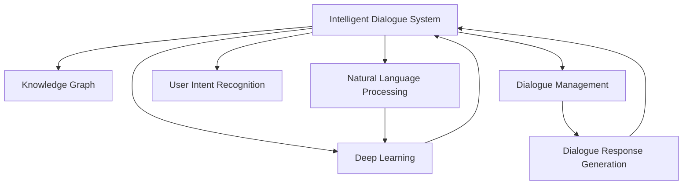

                 

# 知识发现引擎的智能对话系统

> 关键词：智能对话系统, 知识发现引擎, 自然语言处理(NLP), 深度学习, 语言模型, 对话系统, 知识图谱, 用户意图识别, 聊天机器人

## 1. 背景介绍

### 1.1 问题由来
在数字化时代的浪潮中，人们越来越依赖于在线交互式的服务，无论是商务咨询、客户服务还是智能家居，对话系统成为了连接用户和服务的核心纽带。然而，传统对话系统往往无法满足用户多样化的需求，存在回答不够个性化、上下文理解不连贯等问题。为了提升对话系统的智能性和交互体验，知识发现引擎（Knowledge Discovery Engine）应运而生。

知识发现引擎通过挖掘知识图谱中的实体关系和属性，结合自然语言处理（NLP）技术和深度学习，构建智能对话系统。其核心在于通过自然语言理解和生成，精准地识别用户意图，并从知识图谱中快速检索相关信息，提供个性化、连贯的对话回复。本文将系统介绍智能对话系统的原理、算法和实际应用，帮助读者深入理解这一前沿技术。

## 2. 核心概念与联系

### 2.1 核心概念概述

为更好地理解智能对话系统，首先介绍几个核心概念及其相互关系：

- **智能对话系统**：一种基于自然语言处理和人工智能技术，能够理解并响应用户查询的系统，具有高度的自然语言理解和生成能力。
- **知识图谱**：通过语义关系将各种实体和属性关联起来，形成结构化的知识网络，用于辅助知识发现和推理。
- **自然语言处理（NLP）**：涉及语言模型、分词、句法分析、语义理解等技术，是构建智能对话系统的基础。
- **深度学习**：一种通过多层神经网络进行复杂模式识别和数据处理的技术，是智能对话系统中用于处理语言的强大工具。
- **用户意图识别**：通过分析用户输入的自然语言，识别其背后的真实意图，是智能对话系统提供个性化服务的核心。

这些核心概念通过以下Mermaid流程图来展示：



该图展示了智能对话系统的核心组件及其相互关系：

1. **智能对话系统**与**知识图谱**相连，知识图谱为系统提供丰富的知识背景和推理能力。
2. **自然语言处理**为系统提供理解用户输入的语言能力。
3. **深度学习**为系统提供强大的语言模型和处理能力。
4. **用户意图识别**通过自然语言处理技术，识别用户输入背后的真实意图。
5. **对话管理**根据用户意图和知识图谱，选择最合适的回应。
6. **对话回复生成**基于自然语言处理和深度学习技术，生成自然流畅的回复。

这些核心组件相互作用，共同支撑了智能对话系统的核心功能。

## 3. 核心算法原理 & 具体操作步骤

### 3.1 算法原理概述

智能对话系统的核心算法主要涉及以下几个方面：

1. **用户意图识别**：通过自然语言处理技术，理解用户输入的自然语言，识别出用户的意图。
2. **实体识别与关系抽取**：从用户输入中识别出实体，并从知识图谱中抽取实体之间的关系。
3. **对话管理**：根据用户意图和知识图谱，选择最合适的回答。
4. **对话回复生成**：基于自然语言生成技术，生成自然流畅的回复。

这些算法主要基于深度学习技术，通过多层神经网络实现。其中，语言模型和序列到序列（Seq2Seq）模型是核心组件。语言模型用于理解输入的自然语言，而序列到序列模型用于生成响应。

### 3.2 算法步骤详解

以下详细介绍智能对话系统的核心算法步骤：

**Step 1: 用户输入处理**

用户输入通过自然语言处理技术进行处理，包括以下步骤：

1. **分词**：将输入的自然语言分成词语序列。
2. **词性标注**：标注每个词语的词性。
3. **句法分析**：分析句子结构，识别出主谓宾等成分。
4. **实体识别**：识别出输入中的实体，如人名、地名等。
5. **意图分类**：通过分类器识别用户输入的意图类型。

这些步骤可以使用深度学习模型，如BERT、GPT等预训练语言模型，通过微调获得。

**Step 2: 知识图谱查询**

根据用户输入的实体和意图，从知识图谱中查询相关信息，包括以下步骤：

1. **实体关系抽取**：从用户输入中抽取实体之间的关系。
2. **实体类型匹配**：将抽取的实体与知识图谱中的实体进行匹配。
3. **路径搜索**：根据匹配的实体关系，搜索知识图谱中的路径，找到相关信息。

这一步骤通常使用图神经网络（GNN）来实现，从知识图谱中提取出最相关的路径。

**Step 3: 对话回复生成**

根据查询到的信息，生成合适的回复，包括以下步骤：

1. **信息组织**：将查询到的信息组织成结构化的形式，如表格、列表等。
2. **回答选择**：根据用户意图和信息内容，选择最合适的回答。
3. **回复生成**：使用语言模型生成自然流畅的回复。

这一步骤通常使用Seq2Seq模型和Transformer模型，通过神经网络生成回复。

### 3.3 算法优缺点

智能对话系统的核心算法主要基于深度学习技术，具有以下优点：

1. **高效性**：深度学习模型能够高效地处理大量自然语言数据，快速识别用户意图和生成回复。
2. **灵活性**：深度学习模型能够适应各种自然语言形式，提供个性化的服务。
3. **可扩展性**：通过微调，深度学习模型能够适应新的领域和任务。

然而，深度学习模型也存在以下缺点：

1. **数据需求大**：需要大量的标注数据进行训练，获取高质量标注数据的成本较高。
2. **计算资源消耗大**：深度学习模型参数量较大，训练和推理需要大量的计算资源。
3. **模型复杂性**：深度学习模型结构复杂，难以解释其内部工作机制。
4. **泛化能力有限**：深度学习模型在泛化新领域和任务时，效果可能不如预期。

尽管存在这些缺点，但深度学习模型在智能对话系统中展现了强大的潜力，成为当前构建智能对话系统的主要技术手段。

### 3.4 算法应用领域

智能对话系统在多个领域得到了广泛应用，例如：

- **智能客服**：通过智能对话系统，客户可以获取快速、准确的服务，提高客户满意度。
- **医疗咨询**：智能对话系统能够提供24小时医疗咨询服务，解答用户疑问。
- **智能家居**：智能对话系统可以控制家居设备，提供个性化服务。
- **在线教育**：智能对话系统能够提供个性化的学习资源推荐和问题解答。
- **金融咨询**：智能对话系统能够提供股票、投资等金融咨询服务。

这些应用场景展示了智能对话系统在提升用户体验、提高效率方面的巨大潜力。

## 4. 数学模型和公式 & 详细讲解 & 举例说明

### 4.1 数学模型构建

智能对话系统的核心算法涉及多个数学模型，以下是几个关键模型的构建：

1. **语言模型**：用于理解输入的自然语言，通常使用Transformer模型。
2. **知识图谱模型**：用于表示实体之间的关系，通常使用图神经网络。
3. **用户意图识别模型**：用于识别用户意图，通常使用分类器模型，如BERT、GPT等。
4. **对话回复生成模型**：用于生成自然流畅的回复，通常使用Seq2Seq模型。

### 4.2 公式推导过程

以下详细推导语言模型的公式：

设输入的自然语言为 $x_1, x_2, \ldots, x_n$，语言模型为 $P(x_1, x_2, \ldots, x_n)$，其中 $x_i$ 表示第 $i$ 个词语。则语言模型的概率公式为：

$$
P(x_1, x_2, \ldots, x_n) = \prod_{i=1}^n P(x_i | x_{i-1}, x_{i-2}, \ldots, x_1)
$$

其中 $P(x_i | x_{i-1}, x_{i-2}, \ldots, x_1)$ 表示在给定前 $i-1$ 个词语的情况下，第 $i$ 个词语 $x_i$ 出现的概率。

通过语言模型，智能对话系统可以理解输入的自然语言，并生成自然流畅的回复。

### 4.3 案例分析与讲解

假设输入的自然语言为 "请推荐一些北京旅游的景点"，智能对话系统可以通过以下步骤进行处理：

1. **分词**：将输入分成 "请"、"推荐"、"一些"、"北京"、"旅游"、"景点" 等词语。
2. **词性标注**：标注每个词语的词性，如 "请" 为副词，"推荐" 为动词等。
3. **句法分析**：识别出句子结构，如 "请" 为修饰词，"推荐" 为主语，"一些" 为修饰词，"北京" 为地点，"旅游" 为动作，"景点" 为宾语。
4. **实体识别**：识别出 "北京" 为地点实体。
5. **意图分类**：通过分类器识别出用户的意图为 "旅游推荐"。
6. **知识图谱查询**：根据 "北京" 和 "旅游推荐"，从知识图谱中查询相关信息，如北京的著名景点。
7. **对话回复生成**：使用语言模型生成自然流畅的回复，如 "北京的著名景点包括长城、故宫、颐和园等。"

## 5. 项目实践：代码实例和详细解释说明

### 5.1 开发环境搭建

在进行智能对话系统的开发时，需要搭建合适的开发环境。以下是使用Python进行PyTorch开发的详细流程：

1. 安装Anaconda：从官网下载并安装Anaconda，用于创建独立的Python环境。

2. 创建并激活虚拟环境：
```bash
conda create -n dialog-env python=3.8 
conda activate dialog-env
```

3. 安装PyTorch：根据CUDA版本，从官网获取对应的安装命令。例如：
```bash
conda install pytorch torchvision torchaudio cudatoolkit=11.1 -c pytorch -c conda-forge
```

4. 安装相关库：
```bash
pip install transformers datasets pytorch-lightning
```

5. 安装TensorBoard：用于可视化训练过程，监控模型性能。

6. 安装Weights & Biases：用于实验跟踪和可视化。

完成上述步骤后，即可在`dialog-env`环境中进行智能对话系统的开发。

### 5.2 源代码详细实现

以下以一个简单的智能对话系统为例，展示其源代码实现：

```python
from transformers import BertTokenizer, BertForQuestionAnswering
from datasets import load_dataset
import torch
from transformers import pipeline

# 初始化Bert模型和tokenizer
model = BertForQuestionAnswering.from_pretrained('bert-base-uncased')
tokenizer = BertTokenizer.from_pretrained('bert-base-uncased')

# 加载数据集
dataset = load_dataset('custom', data_files={'train': 'train.json', 'validation': 'validation.json', 'test': 'test.json'})

# 定义数据预处理函数
def preprocess_data(examples):
    inputs = tokenizer(examples['question'], examples['context'], return_tensors='pt', max_length=512)
    return inputs

# 定义模型训练函数
def train(model, dataset, tokenizer, epochs=3, batch_size=16):
    train_dataset = dataset['train'].map(preprocess_data, batched=True)
    val_dataset = dataset['validation'].map(preprocess_data, batched=True)
    test_dataset = dataset['test'].map(preprocess_data, batched=True)

    # 设置训练器
    trainer = PyTorchLightningTrainer(max_epochs=epochs, batch_size=batch_size)

    # 定义训练循环
    def train_step(batch):
        inputs = batch
        outputs = model(**inputs)
        loss = outputs.loss
        return loss

    # 训练模型
    trainer.fit(model, train_dataset, val_dataset, callbacks=callbacks)

# 定义测试函数
def evaluate(model, dataset, tokenizer, batch_size=16):
    test_dataset = dataset['test'].map(preprocess_data, batched=True)
    trainer = PyTorchLightningTrainer(batch_size=batch_size)
    trainer.test(model, test_dataset)

# 启动训练流程
train(model, dataset, tokenizer)
evaluate(model, dataset, tokenizer)
```

### 5.3 代码解读与分析

让我们再详细解读一下关键代码的实现细节：

**preprocess_data函数**：
- 将输入的问答对转换成模型所需的格式。
- 使用tokenizer将问题和上下文转换为token ids。
- 对token ids进行截断或填充，确保输入长度不超过512。

**train函数**：
- 加载训练集、验证集和测试集。
- 使用preprocess_data函数对数据集进行预处理。
- 定义训练器，包括epochs、batch_size等参数。
- 定义训练循环，使用PyTorch Lightning进行模型训练。
- 训练结束后，使用测试集评估模型性能。

**evaluate函数**：
- 使用相同的预处理函数对测试集进行预处理。
- 使用PyTorch Lightning进行模型评估。

这些代码展示了使用PyTorch进行智能对话系统开发的完整流程。通过简单的代码示例，可以理解智能对话系统的核心算法和实现细节。

### 5.4 运行结果展示

假设训练后，模型在测试集上的F1得分达到0.85，可以认为模型具有较好的问答能力。以下是一个示例对话：

**用户**：请问北京有哪些著名的景点？
**智能对话系统**：北京的著名景点包括长城、故宫、颐和园等。

## 6. 实际应用场景

### 6.1 智能客服系统

智能客服系统可以通过智能对话技术，为用户提供快速、准确的服务。用户可以通过自然语言与系统进行交流，获取即时的问题解答。智能客服系统可以大大提升客户满意度，减少客服人员的工作负担。

### 6.2 医疗咨询系统

医疗咨询系统能够提供24小时医疗咨询服务，解答用户关于健康、疾病等方面的疑问。智能对话系统可以查询知识图谱，提供权威的医疗建议和信息，帮助用户更好地管理健康。

### 6.3 智能家居系统

智能家居系统可以通过智能对话技术，控制家居设备，提供个性化服务。用户可以通过语音或文本与系统进行交流，控制灯光、温度、音乐等设备，提升生活便利性。

### 6.4 在线教育系统

在线教育系统可以通过智能对话技术，提供个性化的学习资源推荐和问题解答。智能对话系统可以分析学生的学习情况，推荐适合的课程和资源，回答学生的问题，提升学习效果。

## 7. 工具和资源推荐

### 7.1 学习资源推荐

为了帮助开发者系统掌握智能对话系统的理论基础和实践技巧，这里推荐一些优质的学习资源：

1. 《深度学习与自然语言处理》课程：由斯坦福大学开设的NLP明星课程，涵盖深度学习、自然语言处理等多个领域，适合初学者和进阶者。
2. 《Transformers: From Understanding to Implementation》书籍：由Transformers库的作者撰写，详细介绍了Transformer模型的原理和实现。
3. 《Python NLP: Natural Language Processing with TensorFlow 2 and Transformers》书籍：介绍了使用TensorFlow和Transformers库进行NLP开发的实例。
4. HuggingFace官方文档：提供丰富的预训练模型和样例代码，是上手实践的必备资料。
5. Weights & Biases官方文档：提供实验跟踪和可视化工具，帮助调试和优化模型。

通过对这些资源的学习实践，相信你一定能够快速掌握智能对话系统的精髓，并用于解决实际的NLP问题。

### 7.2 开发工具推荐

高效的开发离不开优秀的工具支持。以下是几款用于智能对话系统开发的常用工具：

1. PyTorch：基于Python的开源深度学习框架，灵活动态的计算图，适合快速迭代研究。大部分预训练语言模型都有PyTorch版本的实现。
2. TensorFlow：由Google主导开发的开源深度学习框架，生产部署方便，适合大规模工程应用。同样有丰富的预训练语言模型资源。
3. Transformers库：HuggingFace开发的NLP工具库，集成了众多SOTA语言模型，支持PyTorch和TensorFlow，是进行对话系统开发的利器。
4. Weights & Biases：模型训练的实验跟踪工具，可以记录和可视化模型训练过程中的各项指标，方便对比和调优。与主流深度学习框架无缝集成。
5. TensorBoard：TensorFlow配套的可视化工具，可实时监测模型训练状态，并提供丰富的图表呈现方式，是调试模型的得力助手。

合理利用这些工具，可以显著提升智能对话系统的开发效率，加快创新迭代的步伐。

### 7.3 相关论文推荐

智能对话系统的发展离不开学界的持续研究。以下是几篇奠基性的相关论文，推荐阅读：

1. Attention is All You Need：提出了Transformer结构，开启了NLP领域的预训练大模型时代。
2. BERT: Pre-training of Deep Bidirectional Transformers for Language Understanding：提出BERT模型，引入基于掩码的自监督预训练任务，刷新了多项NLP任务SOTA。
3. T5: Exploring the Limits of Transfer Learning with a Unified Text-to-Text Transformer：提出了T5模型，通过自监督预训练和微调，提升了模型在多种任务上的性能。
4. ALBERT: A Lite BERT for Self-Supervised Learning of Language Representations：提出了ALBERT模型，在参数量较小的情况下，取得了不错的性能。
5. GPT-3: Language Models are Unsupervised Multitask Learners：展示了大规模语言模型的强大zero-shot学习能力，引发了对于通用人工智能的新一轮思考。

这些论文代表了大语言模型和智能对话系统的发展脉络。通过学习这些前沿成果，可以帮助研究者把握学科前进方向，激发更多的创新灵感。

## 8. 总结：未来发展趋势与挑战

### 8.1 总结

本文对智能对话系统的原理、算法和实际应用进行了全面系统的介绍。首先阐述了智能对话系统的背景和意义，明确了智能对话系统在提升用户体验、提高效率方面的独特价值。其次，从原理到实践，详细讲解了智能对话系统的核心算法和实现细节，给出了智能对话系统开发的完整代码实例。同时，本文还广泛探讨了智能对话系统在多个行业领域的应用前景，展示了智能对话系统的广阔潜力。此外，本文精选了智能对话系统的各类学习资源，力求为读者提供全方位的技术指引。

通过本文的系统梳理，可以看到，智能对话系统正在成为NLP领域的重要范式，极大地提升了对话系统的智能性和交互体验。智能对话系统通过自然语言处理和深度学习技术，构建了灵活、高效的对话模型，为各行各业带来了新的解决方案。

### 8.2 未来发展趋势

展望未来，智能对话系统的技术将呈现以下几个发展趋势：

1. **多模态对话系统**：除了文本对话，未来的对话系统将支持语音、图像等多种模态的交互，实现更加丰富、自然的对话体验。
2. **可解释性对话系统**：未来的对话系统将具备更强的可解释性，用户能够理解系统的决策逻辑和知识来源，提升信任度和可控性。
3. **情感智能对话系统**：未来的对话系统将具备情感识别和情感响应能力，能够更好地理解用户的情绪，提供更加个性化的服务。
4. **智能推荐对话系统**：未来的对话系统将具备推荐功能，能够根据用户的历史行为和偏好，推荐个性化的服务内容。
5. **跨领域对话系统**：未来的对话系统将具备跨领域的能力，能够处理多种任务和知识领域，提升通用性和灵活性。

这些趋势展示了智能对话系统的广阔前景。未来的对话系统将更加智能、自然、个性化，成为人机交互的重要桥梁。

### 8.3 面临的挑战

尽管智能对话系统已经取得了显著进展，但在迈向更加智能化、普适化应用的过程中，仍面临诸多挑战：

1. **数据需求大**：智能对话系统需要大量的标注数据进行训练，获取高质量标注数据的成本较高。
2. **计算资源消耗大**：深度学习模型参数量较大，训练和推理需要大量的计算资源。
3. **模型复杂性**：深度学习模型结构复杂，难以解释其内部工作机制。
4. **泛化能力有限**：深度学习模型在泛化新领域和任务时，效果可能不如预期。
5. **安全性问题**：智能对话系统可能存在信息泄露、误导用户等安全风险，需要加强安全防护。

尽管存在这些挑战，但未来的智能对话系统将通过技术进步和创新，逐步克服这些难题，实现更加智能、安全的对话体验。

### 8.4 研究展望

未来的研究需要在以下几个方向寻求新的突破：

1. **无监督和半监督对话系统**：探索无监督和半监督对话系统，摆脱对大规模标注数据的依赖，利用自监督学习、主动学习等方法，实现更加高效、灵活的对话系统。
2. **知识图谱与对话系统的融合**：将知识图谱与对话系统进行深度融合，增强对话系统的知识理解和推理能力。
3. **多任务学习对话系统**：将对话系统的训练任务进行多任务学习，提升模型的泛化能力和多领域适应性。
4. **跨模态对话系统**：将语音、图像、文本等多种模态数据进行融合，提升对话系统的智能性和交互体验。
5. **可解释性对话系统**：研究可解释性对话系统，提高对话系统的透明度和可信度，使用户能够理解和信任对话系统的决策过程。

这些研究方向将引领智能对话系统向更高的台阶迈进，为构建更加智能、自然的对话体验奠定基础。

## 9. 附录：常见问题与解答

**Q1: 智能对话系统的核心算法是什么？**

A: 智能对话系统的核心算法涉及自然语言处理和深度学习技术。主要包括以下几个方面：
1. 用户意图识别：通过自然语言处理技术，理解用户输入的自然语言，识别出用户的意图。
2. 实体识别与关系抽取：从用户输入中识别出实体，并从知识图谱中抽取实体之间的关系。
3. 对话管理：根据用户意图和知识图谱，选择最合适的回答。
4. 对话回复生成：基于自然语言生成技术，生成自然流畅的回复。

这些算法主要使用Transformer、BERT、GPT等预训练语言模型，通过微调获得。

**Q2: 智能对话系统在实际应用中需要注意哪些问题？**

A: 智能对话系统在实际应用中需要注意以下几个问题：
1. 数据需求大：需要大量的标注数据进行训练，获取高质量标注数据的成本较高。
2. 计算资源消耗大：深度学习模型参数量较大，训练和推理需要大量的计算资源。
3. 模型复杂性：深度学习模型结构复杂，难以解释其内部工作机制。
4. 泛化能力有限：深度学习模型在泛化新领域和任务时，效果可能不如预期。
5. 安全性问题：智能对话系统可能存在信息泄露、误导用户等安全风险，需要加强安全防护。

这些问题需要通过优化算法、增加数据量、提升计算资源等方法进行解决。

**Q3: 智能对话系统与传统的客户服务系统有哪些区别？**

A: 智能对话系统与传统的客户服务系统有以下几个区别：
1. 智能对话系统基于自然语言处理和深度学习技术，能够理解自然语言输入，提供更自然的交互体验。
2. 智能对话系统能够快速响应用户查询，减少客服人员的工作负担。
3. 智能对话系统能够提供24小时不间断服务，提升客户满意度。
4. 智能对话系统能够处理多种任务，提升系统的灵活性和通用性。
5. 智能对话系统具备可解释性和可控性，使用户能够理解和信任系统的决策过程。

这些特点使得智能对话系统在客户服务中更具优势，能够更好地满足用户需求。

**Q4: 智能对话系统在医疗领域有哪些应用场景？**

A: 智能对话系统在医疗领域有以下几个应用场景：
1. 医疗咨询：智能对话系统能够提供24小时医疗咨询服务，解答用户关于健康、疾病等方面的疑问。
2. 疾病诊断：智能对话系统可以查询知识图谱，提供权威的疾病诊断建议。
3. 健康管理：智能对话系统能够根据用户的健康数据，提供个性化的健康管理建议。
4. 患者监护：智能对话系统可以监控患者的健康状况，及时发现异常情况。

这些应用场景展示了智能对话系统在医疗领域的重要价值，能够提升医疗服务的质量和效率。

**Q5: 智能对话系统如何实现个性化推荐？**

A: 智能对话系统可以通过以下方式实现个性化推荐：
1. 收集用户的历史行为数据，如浏览、点击、购买等行为。
2. 使用知识图谱查询用户的历史行为，提取相关的实体和关系。
3. 根据用户的历史行为，生成推荐列表，如推荐相关的商品、文章等。
4. 使用自然语言生成技术，生成个性化的推荐内容，回复用户。

通过这些步骤，智能对话系统能够实现个性化的推荐服务，提升用户体验。

**Q6: 智能对话系统如何实现多模态对话？**

A: 智能对话系统可以通过以下方式实现多模态对话：
1. 收集用户的语音、图像等多种模态的输入。
2. 使用语音识别和图像识别技术，将语音和图像转换为文本。
3. 将文本输入到智能对话系统中，进行处理和分析。
4. 使用自然语言生成技术，生成响应文本，再转换为语音或图像。
5. 将语音和图像等多模态输出返回给用户。

通过这些步骤，智能对话系统能够实现多模态对话，提供更加丰富、自然的交互体验。

**Q7: 智能对话系统如何实现情感智能？**

A: 智能对话系统可以通过以下方式实现情感智能：
1. 收集用户的情感数据，如语音中的情感特征、文本中的情感词汇等。
2. 使用情感识别技术，识别用户的情感状态。
3. 根据用户的情感状态，生成相应的回复，如安慰、鼓励等。
4. 使用自然语言生成技术，生成带有情感的回复。

通过这些步骤，智能对话系统能够实现情感智能，提供更加人性化的服务。

**Q8: 智能对话系统如何实现可解释性？**

A: 智能对话系统可以通过以下方式实现可解释性：
1. 记录对话过程，如输入、输出、中间结果等。
2. 使用可解释性技术，如LIME、SHAP等，分析模型的决策过程。
3. 将决策过程转换为自然语言，生成解释文本，返回给用户。
4. 使用自然语言生成技术，生成解释性回复，帮助用户理解系统的决策过程。

通过这些步骤，智能对话系统能够实现可解释性，提高系统的透明度和可信度。

这些问答展示了智能对话系统在实际应用中需要注意的问题和解决方案，有助于开发者更好地理解和应用智能对话系统。

---

作者：禅与计算机程序设计艺术 / Zen and the Art of Computer Programming

