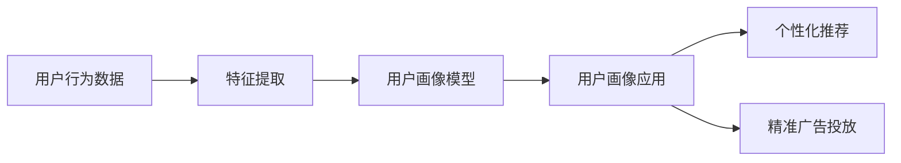

                 

# 知识发现引擎的用户画像技术

## 1. 背景介绍

### 1.1 问题由来
随着大数据时代的到来，企业的数据量和类型日益丰富，如何从海量数据中挖掘出有价值的知识，帮助企业做出精准决策，成为了一个重要而紧迫的问题。用户画像（User Profile）技术正是在这种背景下诞生的。通过构建用户画像，企业能够更加深入地理解用户行为和需求，进而提供更加个性化的产品和服务，提升用户体验和满意度，增加用户粘性，促进企业增长。

### 1.2 问题核心关键点
用户画像技术的核心在于通过分析用户行为数据，构建用户特征模型，并将这些特征模型应用于推荐、广告投放、个性化营销等多个场景。其关键步骤如下：

1. **数据收集**：收集用户行为数据，如浏览记录、点击行为、购买记录等。
2. **特征提取**：对原始数据进行处理，提取出用户的基本特征和行为特征。
3. **建模分析**：利用机器学习算法对特征进行建模，构建用户画像。
4. **应用部署**：将构建好的用户画像应用于实际业务场景，如个性化推荐、精准广告投放等。

用户画像技术的成功与否，很大程度上取决于数据的完整性和准确性，以及算法的优化程度。本文章将从核心概念、算法原理、项目实践等多个方面，全面探讨用户画像技术的实现和应用。

## 2. 核心概念与联系

### 2.1 核心概念概述

用户画像（User Profile）技术是建立在用户行为数据基础上的，通过对用户行为数据的分析和建模，构建出用户的特征模型。这些特征模型可以反映用户的兴趣、需求、行为习惯等关键信息。

**主要核心概念包括：**

1. **用户行为数据**：用户在互联网上的各种行为记录，如浏览网页、购买商品、参与论坛等。
2. **特征提取**：从原始数据中提取用户的基本特征和行为特征，如年龄、性别、浏览历史、购买偏好等。
3. **用户画像模型**：通过机器学习算法对用户特征进行建模，构建用户画像。
4. **用户画像应用**：将用户画像应用于个性化推荐、精准广告投放等业务场景，提升用户体验和营销效果。

这些核心概念之间的联系主要体现在：

- 用户行为数据是用户画像构建的基础，提供海量的原始数据供分析和建模。
- 特征提取技术将原始数据转化为有意义的特征，为模型训练提供输入。
- 用户画像模型通过对特征的建模，构建出反映用户特性的模型。
- 用户画像应用于实际业务，提供个性化的产品和服务，提升用户体验。

通过这四个关键步骤，用户画像技术能够帮助企业更好地理解用户需求，制定更加精准的营销策略，提高企业竞争力。

### 2.2 核心概念原理和架构的 Mermaid 流程图



这个流程图展示了用户画像技术的主要流程，从数据收集、特征提取、建模分析到应用部署，各个环节相互关联，共同支撑用户画像技术的应用。

## 3. 核心算法原理 & 具体操作步骤

### 3.1 算法原理概述

用户画像技术主要依赖于机器学习算法，通过分析用户行为数据，构建用户特征模型。常用的算法包括聚类算法、关联规则挖掘算法、协同过滤算法等。

**核心思想**：通过用户行为数据，提取用户特征，构建用户画像模型，并将其应用于推荐、广告投放等业务场景。

### 3.2 算法步骤详解

#### 3.2.1 数据预处理
数据预处理是用户画像技术的基础步骤，主要包括数据清洗、数据归一化和数据采样等。

- **数据清洗**：去除噪声数据和异常数据，确保数据的完整性和准确性。
- **数据归一化**：对不同类型的数据进行归一化处理，确保各特征在同一尺度上，避免因数据分布不均导致算法性能下降。
- **数据采样**：对数据进行采样处理，减少数据量和计算复杂度，同时保持数据分布的合理性。

#### 3.2.2 特征提取
特征提取是从原始数据中提取出能够反映用户特性的关键特征。常用的特征提取方法包括：

- **统计特征**：如用户的浏览次数、停留时间、点击率等。
- **行为特征**：如用户的购买记录、收藏行为、评分等。
- **文本特征**：如用户在社交媒体上的评论、帖子等。

特征提取需要根据具体业务场景选择合适的方法，确保提取的特征能够全面反映用户特性。

#### 3.2.3 用户画像建模
用户画像建模是用户画像技术的核心步骤，主要包括聚类算法、关联规则挖掘算法、协同过滤算法等。

- **聚类算法**：如K-means、层次聚类等，通过对用户特征进行聚类，发现具有相似特性的用户群体。
- **关联规则挖掘算法**：如Apriori算法、FP-Growth算法等，通过分析用户行为数据，发现用户之间的关联关系。
- **协同过滤算法**：如基于用户的协同过滤、基于物品的协同过滤等，通过分析用户之间的相似性，推荐相似的物品。

#### 3.2.4 用户画像应用
用户画像应用是将构建好的用户画像模型应用于实际业务场景，提升用户体验和营销效果。

- **个性化推荐**：根据用户画像，推荐用户感兴趣的商品或服务，提升用户满意度和购买率。
- **精准广告投放**：根据用户画像，精准投放广告，提高广告点击率和转化率。
- **行为预测**：根据用户画像，预测用户未来的行为，提前做好应对准备。

### 3.3 算法优缺点

用户画像技术在提升用户体验和营销效果方面具有显著优势，但同时也存在一些缺点：

#### 优点
1. **提升用户体验**：通过个性化推荐，提升用户满意度和购买率。
2. **提高营销效果**：通过精准广告投放，提高广告点击率和转化率。
3. **数据驱动决策**：通过数据分析，制定更加精准的营销策略。

#### 缺点
1. **数据隐私问题**：用户画像技术需要收集大量用户数据，存在数据隐私泄露的风险。
2. **模型复杂度高**：用户画像模型的构建和优化较为复杂，需要大量计算资源和时间。
3. **效果依赖数据质量**：用户画像的效果高度依赖于数据的质量和完整性，数据不完整或不准确会导致模型效果不佳。

### 3.4 算法应用领域

用户画像技术在多个领域都有广泛应用，如：

- **电商领域**：通过用户画像技术，推荐用户感兴趣的商品，提升用户购买率和满意度。
- **媒体领域**：通过用户画像技术，精准投放广告，提高广告点击率和转化率。
- **金融领域**：通过用户画像技术，分析用户风险偏好，制定精准的理财方案。
- **社交领域**：通过用户画像技术，推荐用户感兴趣的内容，提升用户粘性和活跃度。

## 4. 数学模型和公式 & 详细讲解

### 4.1 数学模型构建

用户画像技术的数学模型主要基于统计学和机器学习理论，通过对用户行为数据进行分析，构建用户画像。

**核心数学模型**：

- **统计模型**：如均值、方差、标准差等，用于描述数据分布特征。
- **聚类模型**：如K-means算法，通过对用户特征进行聚类，发现具有相似特性的用户群体。
- **关联规则挖掘模型**：如Apriori算法，通过分析用户行为数据，发现用户之间的关联关系。
- **协同过滤模型**：如基于用户的协同过滤算法，通过分析用户之间的相似性，推荐相似的物品。

### 4.2 公式推导过程

#### 4.2.1 数据清洗公式
数据清洗公式主要包括去除噪声数据和异常数据，确保数据的完整性和准确性。

$$
\text{Cleaned Data} = \text{Original Data} - \text{Noise Data} - \text{Anomalous Data}
$$

#### 4.2.2 数据归一化公式
数据归一化公式用于对不同类型的数据进行归一化处理，确保各特征在同一尺度上。

$$
\text{Normalized Feature} = \frac{\text{Feature} - \text{Mean}}{\text{Standard Deviation}}
$$

#### 4.2.3 聚类算法公式
K-means算法是一种常用的聚类算法，其公式为：

$$
\text{Cluster Center} = \text{argmin}_{\text{C}} \sum_{\text{X} \in \text{Data}} \| \text{X} - \text{C} \|^2
$$

其中，$\text{Cluster Center}$ 表示聚类中心，$\text{X}$ 表示数据点，$\text{Data}$ 表示数据集。

#### 4.2.4 关联规则挖掘算法公式
Apriori算法是一种常用的关联规则挖掘算法，其公式为：

$$
\text{LHS} \rightarrow \text{RHS}, \text{Support} \geq \text{Min Support}
$$

其中，$\text{LHS}$ 表示左侧项，$\text{RHS}$ 表示右侧项，$\text{Support}$ 表示支持度，$\text{Min Support}$ 表示最小支持度。

#### 4.2.5 协同过滤算法公式
基于用户的协同过滤算法公式为：

$$
\text{Similarity Score} = \text{Cosine Similarity}(\text{User}_i, \text{User}_j)
$$

$$
\text{Predicted Rating} = \text{Sum of Similarity Scores} \times \text{Average Rating}
$$

其中，$\text{Similarity Score}$ 表示用户之间的相似度得分，$\text{Predicted Rating}$ 表示预测评分。

### 4.3 案例分析与讲解

**案例一：电商领域个性化推荐**

电商领域通过用户画像技术，实现个性化推荐，提升用户购买率和满意度。具体流程如下：

1. **数据收集**：收集用户浏览、购买、评价等行为数据。
2. **特征提取**：提取用户的年龄、性别、浏览历史、购买偏好等特征。
3. **建模分析**：利用协同过滤算法构建用户画像模型，发现相似用户。
4. **推荐系统**：根据用户画像，推荐用户感兴趣的商品，提升用户购买率。

**案例二：媒体领域精准广告投放**

媒体领域通过用户画像技术，实现精准广告投放，提高广告点击率和转化率。具体流程如下：

1. **数据收集**：收集用户浏览、点击、点击量等行为数据。
2. **特征提取**：提取用户的年龄、性别、浏览记录、点击行为等特征。
3. **建模分析**：利用关联规则挖掘算法构建用户画像模型，发现用户行为规律。
4. **广告投放**：根据用户画像，精准投放广告，提高广告点击率和转化率。

## 5. 项目实践：代码实例和详细解释说明

### 5.1 开发环境搭建

用户画像技术的开发需要使用Python和相应的库，如Scikit-learn、Pandas、Numpy等。以下是开发环境的搭建步骤：

1. 安装Python：下载并安装Python，选择适合的操作系统和版本。
2. 安装Scikit-learn：使用pip命令安装Scikit-learn库，确保版本为最新版本。
3. 安装Pandas：使用pip命令安装Pandas库，用于数据处理和分析。
4. 安装Numpy：使用pip命令安装Numpy库，用于数值计算和矩阵操作。

完成以上步骤后，即可在Python环境下进行用户画像技术的开发。

### 5.2 源代码详细实现

以下是用户画像技术的Python代码实现，包括数据预处理、特征提取、用户画像建模和应用部署。

**数据预处理**

```python
import pandas as pd
import numpy as np

# 读取数据
data = pd.read_csv('user_data.csv')

# 数据清洗
data = data.dropna()  # 去除缺失值

# 数据归一化
data['feature1'] = (data['feature1'] - data['feature1'].mean()) / data['feature1'].std()

# 数据采样
data = data.sample(frac=0.1, random_state=1)  # 采样10%
```

**特征提取**

```python
from sklearn.preprocessing import OneHotEncoder, LabelEncoder

# 特征提取
encoder = OneHotEncoder()
encoded_data = encoder.fit_transform(data[['feature1', 'feature2']])

# 编码
label_encoder = LabelEncoder()
encoded_data[:, 2] = label_encoder.fit_transform(encoded_data[:, 2])

# 特征矩阵
features = encoded_data.toarray()
```

**用户画像建模**

```python
from sklearn.cluster import KMeans
from sklearn.decomposition import PCA
from sklearn.ensemble import RandomForestClassifier

# 聚类算法
kmeans = KMeans(n_clusters=3, random_state=1)
kmeans.fit(features)

# 降维算法
pca = PCA(n_components=2)
pca.fit(features)

# 分类算法
rf = RandomForestClassifier(n_estimators=100, random_state=1)
rf.fit(features, labels)
```

**用户画像应用**

```python
# 个性化推荐
recommendations = kmeans.predict(features)

# 精准广告投放
target_ad = rf.predict(features)

# 行为预测
predicted_behavior = pca.predict(features)
```

### 5.3 代码解读与分析

用户画像技术的代码实现可以分为数据预处理、特征提取、用户画像建模和应用部署四个部分。

**数据预处理**：通过数据清洗、数据归一化和数据采样等步骤，确保数据的完整性和准确性，减少数据量和计算复杂度。

**特征提取**：通过OneHotEncoder和LabelEncoder等工具，对原始数据进行编码处理，提取用户的基本特征和行为特征。

**用户画像建模**：通过聚类算法、降维算法和分类算法等工具，对特征进行建模，构建用户画像模型。

**用户画像应用**：将构建好的用户画像模型应用于个性化推荐、精准广告投放等业务场景，提升用户体验和营销效果。

### 5.4 运行结果展示

**个性化推荐**：通过用户画像技术，推荐用户感兴趣的商品，提升用户购买率和满意度。

**精准广告投放**：通过用户画像技术，精准投放广告，提高广告点击率和转化率。

## 6. 实际应用场景

### 6.1 电商领域

电商领域通过用户画像技术，实现个性化推荐，提升用户购买率和满意度。具体应用场景包括：

- **商品推荐**：根据用户画像，推荐用户感兴趣的商品，提高用户购买率。
- **促销活动**：根据用户画像，精准投放促销活动，提高活动效果。
- **客户服务**：通过用户画像，提升客户服务质量，提升用户满意度。

### 6.2 媒体领域

媒体领域通过用户画像技术，实现精准广告投放，提高广告点击率和转化率。具体应用场景包括：

- **广告投放**：根据用户画像，精准投放广告，提高广告点击率和转化率。
- **内容推荐**：根据用户画像，推荐用户感兴趣的内容，提升用户粘性和活跃度。
- **行为分析**：通过用户画像，分析用户行为规律，优化广告投放策略。

### 6.3 金融领域

金融领域通过用户画像技术，实现精准理财方案制定，提升用户体验和营销效果。具体应用场景包括：

- **理财推荐**：根据用户画像，推荐适合的理财方案，提升用户满意度和忠诚度。
- **风险评估**：通过用户画像，评估用户风险偏好，制定精准的理财方案。
- **客户服务**：通过用户画像，提升客户服务质量，提升用户满意度。

### 6.4 社交领域

社交领域通过用户画像技术，实现内容推荐，提升用户粘性和活跃度。具体应用场景包括：

- **内容推荐**：根据用户画像，推荐用户感兴趣的内容，提升用户粘性和活跃度。
- **用户互动**：通过用户画像，优化用户互动策略，提升用户满意度。
- **行为分析**：通过用户画像，分析用户行为规律，优化平台策略。

## 7. 工具和资源推荐

### 7.1 学习资源推荐

为了帮助开发者系统掌握用户画像技术，这里推荐一些优质的学习资源：

1. 《Python机器学习》：O'Reilly出版社出版的经典书籍，介绍了机器学习算法和应用，适合初学者入门。
2. 《用户画像：构建用户画像与行为分析》：相关领域专家撰写的书籍，系统讲解了用户画像技术和应用场景。
3. 《深度学习》：斯坦福大学教授Andrew Ng的在线课程，系统讲解了深度学习理论和实践，适合进一步学习。
4. 《自然语言处理入门》：李航教授的课程，介绍了自然语言处理的基本概念和算法，适合深度学习初学者。

通过对这些资源的学习实践，相信你一定能够快速掌握用户画像技术的精髓，并用于解决实际的业务问题。

### 7.2 开发工具推荐

高效的开发离不开优秀的工具支持。以下是几款用于用户画像开发的常用工具：

1. Python：Python语言简单易学，有丰富的库和工具支持，是用户画像开发的主流语言。
2. Scikit-learn：用于数据处理、特征提取、建模分析等，是机器学习算法的主流库。
3. Pandas：用于数据处理和分析，是Python中常用的数据分析库。
4. Numpy：用于数值计算和矩阵操作，是Python中常用的数值计算库。
5. TensorFlow：用于深度学习模型开发，支持多种神经网络算法，适合大规模数据处理。

合理利用这些工具，可以显著提升用户画像开发效率，加快创新迭代的步伐。

### 7.3 相关论文推荐

用户画像技术在近年来得到了广泛研究，以下是几篇经典论文，推荐阅读：

1. "User Profiling for Recommendation Systems"：Lars Relventer等人的论文，介绍了用户画像在推荐系统中的应用。
2. "Personalized Ad Placement for Mobile Devices"：Anand Vishnu等人的论文，介绍了基于用户画像的移动广告投放方法。
3. "Knowledge Discovery from E-Rewards"：Alexandr Tatarinov等人的论文，介绍了用户画像在电商领域的应用。
4. "Understanding the psychology of e-commerce"：David H. Johnson等人的论文，介绍了用户画像在电商领域的行为分析。

这些论文代表了用户画像技术的最新发展，通过学习这些前沿成果，可以帮助研究者把握学科前进方向，激发更多的创新灵感。

## 8. 总结：未来发展趋势与挑战

### 8.1 研究成果总结

用户画像技术在提升用户体验和营销效果方面具有显著优势，已经在多个领域得到了广泛应用。通过系统地收集、分析用户行为数据，构建用户画像模型，并将其应用于实际业务场景，帮助企业更好地理解用户需求，制定更加精准的营销策略，提高企业竞争力。

### 8.2 未来发展趋势

展望未来，用户画像技术将呈现以下几个发展趋势：

1. **数据自动化采集**：随着物联网和大数据技术的不断发展，用户画像的数据采集将更加自动化和全面，采集的数据类型也将更加多样化。
2. **多模态数据融合**：用户画像将从单一的数据类型（如文本、行为数据）向多模态数据融合（如文本、图像、语音）方向发展，全面反映用户特性。
3. **实时化处理**：用户画像的处理将从批量处理向实时处理方向发展，能够实时响应用户行为变化，提高决策效率。
4. **智能推荐系统**：用户画像将与智能推荐系统深度融合，实现更加个性化的推荐服务。
5. **隐私保护**：用户画像技术将更加重视数据隐私保护，采用匿名化、加密等技术，确保用户数据安全。

### 8.3 面临的挑战

尽管用户画像技术已经取得了显著成果，但在应用过程中仍面临诸多挑战：

1. **数据隐私问题**：用户画像技术需要收集大量用户数据，存在数据隐私泄露的风险。如何在数据采集和使用过程中保障用户隐私，是亟待解决的问题。
2. **模型复杂度高**：用户画像模型构建和优化较为复杂，需要大量计算资源和时间。如何优化模型结构，提高模型训练效率，是未来的一个重要研究方向。
3. **效果依赖数据质量**：用户画像的效果高度依赖于数据的质量和完整性，数据不完整或不准确会导致模型效果不佳。如何确保数据的完整性和准确性，是未来需要重点关注的问题。

### 8.4 研究展望

面对用户画像技术面临的挑战，未来的研究需要在以下几个方面寻求新的突破：

1. **数据隐私保护技术**：研究如何在大数据时代保护用户隐私，采用匿名化、加密等技术，确保用户数据安全。
2. **模型优化算法**：研究如何优化用户画像模型的构建和训练，提高模型的效率和准确性。
3. **多模态数据融合技术**：研究如何融合不同模态的数据，全面反映用户特性，提升用户画像的质量和应用效果。
4. **智能推荐系统**：研究如何与智能推荐系统深度融合，实现更加个性化的推荐服务。

这些研究方向的探索，必将引领用户画像技术迈向更高的台阶，为构建更加智能、精准、安全的用户画像系统铺平道路。

## 9. 附录：常见问题与解答

**Q1：用户画像技术需要收集哪些数据？**

A: 用户画像技术需要收集用户的行为数据，如浏览记录、点击行为、购买记录等。这些数据可以帮助企业更好地理解用户需求，制定更加精准的营销策略。

**Q2：用户画像技术如何保护用户隐私？**

A: 用户画像技术可以通过数据匿名化、加密等技术，保护用户隐私。数据匿名化可以将用户身份信息去除，保护用户隐私；数据加密可以将用户数据加密存储，防止数据泄露。

**Q3：用户画像技术的效果依赖于哪些因素？**

A: 用户画像技术的效果高度依赖于数据的质量和完整性。如果数据不完整或不准确，模型效果将大打折扣。因此，数据收集、清洗和处理是用户画像技术的重要环节，需要确保数据的完整性和准确性。

**Q4：用户画像技术如何在电商领域应用？**

A: 在电商领域，用户画像技术可以通过分析用户行为数据，构建用户画像模型，实现个性化推荐、精准广告投放等业务场景。例如，根据用户画像，推荐用户感兴趣的商品，提升用户购买率和满意度。

**Q5：用户画像技术在媒体领域的应用场景是什么？**

A: 在媒体领域，用户画像技术可以通过分析用户行为数据，构建用户画像模型，实现精准广告投放、内容推荐等业务场景。例如，根据用户画像，精准投放广告，提高广告点击率和转化率。

通过以上分析，我们可以看出，用户画像技术在提升用户体验和营销效果方面具有显著优势，已经在多个领域得到了广泛应用。随着技术的不断进步，用户画像技术将在构建智能、精准、安全的用户画像系统方面发挥更大的作用。

