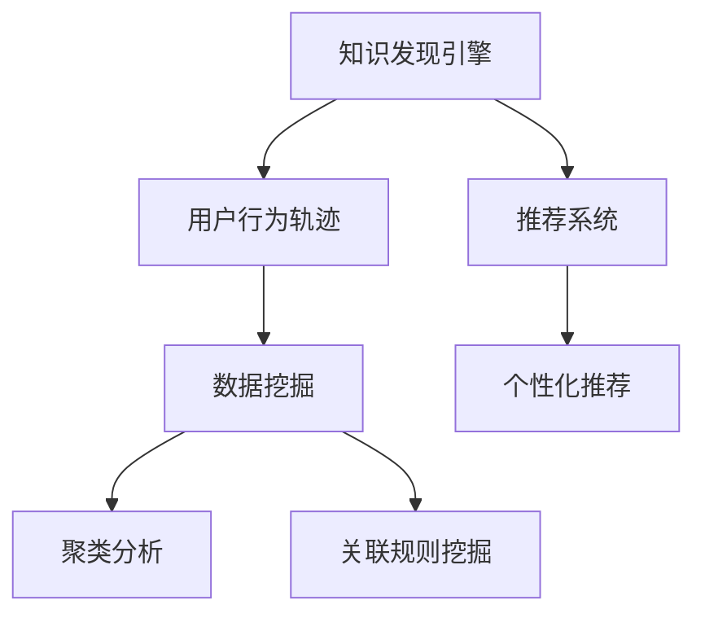

                 

# 知识发现引擎的用户行为轨迹分析

> 关键词：知识发现, 用户行为轨迹, 数据挖掘, 推荐系统, 聚类分析, 关联规则挖掘

## 1. 背景介绍

在当今数据驱动的时代，数据正日益成为企业决策和运营的重要依据。知识发现引擎作为数据驱动决策的重要工具，利用先进的数据分析技术和算法，从大量数据中提取出有价值的信息和知识，辅助企业进行科学的决策。然而，在复杂多变的数据环境中，如何从用户行为数据中准确地提取有价值的知识，成为知识发现引擎面临的一个重要挑战。

为了应对这一挑战，本文将介绍一种基于用户行为轨迹分析的知识发现方法。该方法通过深入分析用户的行为数据，揭示用户在应用中的活动规律，从中发现有价值的模式和知识，为企业决策提供有力支持。

## 2. 核心概念与联系

### 2.1 核心概念概述

在深入讨论用户行为轨迹分析方法之前，我们首先需要理解一些核心概念：

- **知识发现引擎(Knowledge Discovery Engine, KDE)**：一种利用数据分析技术和算法，从大量数据中提取出有价值的信息和知识的系统。知识发现引擎广泛应用于企业决策、市场分析、客户关系管理等领域。
- **用户行为轨迹(User Behavior Trajectory)**：用户在应用或网站上的行为序列，包括页面浏览、点击、购物、搜索等活动。通过对用户行为轨迹的分析，可以揭示用户的行为模式和需求。
- **数据挖掘(Data Mining)**：一种从大规模数据集中提取有用信息的过程，广泛应用于市场分析、客户关系管理等领域。数据挖掘方法包括聚类、分类、关联规则挖掘等。
- **推荐系统(Recommendation System)**：一种基于用户行为和兴趣，向用户推荐商品、内容或服务的技术。推荐系统在电子商务、在线视频、社交媒体等应用中广泛使用。
- **聚类分析(Clustering Analysis)**：一种将相似对象分到同一类别的数据分析方法，常用于用户分群、市场细分等领域。
- **关联规则挖掘(Association Rule Mining)**：一种从交易数据中发现频繁出现的项目集之间的关联关系的技术，常用于商品推荐、市场篮分析等。

这些核心概念相互关联，共同构成了用户行为轨迹分析的基础。通过理解这些概念，我们可以更好地把握用户行为轨迹分析的本质和应用场景。

### 2.2 核心概念原理和架构的 Mermaid 流程图



这个流程图展示了知识发现引擎与用户行为轨迹分析的基本架构。知识发现引擎从用户行为轨迹中提取数据，利用数据挖掘技术进行聚类分析和关联规则挖掘，并将结果应用于推荐系统，实现个性化推荐。

## 3. 核心算法原理 & 具体操作步骤

### 3.1 算法原理概述

用户行为轨迹分析方法基于数据挖掘和机器学习技术，从用户行为数据中提取有价值的模式和知识。具体而言，该方法包括以下几个步骤：

1. **数据采集**：从应用或网站中收集用户的行为数据，包括页面浏览、点击、购物、搜索等活动。
2. **数据清洗**：对收集到的数据进行清洗，去除噪声和异常值，确保数据的质量和准确性。
3. **行为序列建模**：将用户的行为数据转换为行为序列，即用户在应用中的活动序列。
4. **聚类分析**：对行为序列进行聚类分析，发现用户的行为模式和群体特征。
5. **关联规则挖掘**：从行为序列中挖掘出频繁出现的项目集之间的关联关系。
6. **知识发现**：将聚类和关联规则挖掘的结果应用于推荐系统，生成个性化的推荐结果。

### 3.2 算法步骤详解

#### 3.2.1 数据采集

数据采集是用户行为轨迹分析的第一步。为了获取完整和准确的用户行为数据，需要从应用或网站中收集以下类型的行为数据：

- **页面浏览**：用户访问的页面、浏览的时间、停留的时间等。
- **点击行为**：用户点击的页面、点击的按钮、点击的次数等。
- **购物行为**：用户浏览的商品、选择的商品、购买的时间、支付的方式等。
- **搜索行为**：用户搜索的关键词、搜索的次数、搜索的时间等。

这些数据通常通过日志文件、API接口等方式进行采集。采集过程中需要注意数据的隐私保护和数据质量。

#### 3.2.2 数据清洗

数据清洗是数据预处理的重要环节。通过数据清洗，可以去除噪声和异常值，确保数据的质量和准确性。数据清洗的方法包括：

- **去重**：去除重复的数据记录，保证数据的唯一性。
- **去噪**：去除数据中的噪声和无效值，确保数据的准确性。
- **填补缺失值**：填补数据中的缺失值，保证数据完整性。

数据清洗可以通过编写Python脚本来实现，例如使用Pandas库进行数据清洗和处理。

#### 3.2.3 行为序列建模

行为序列建模是将用户的行为数据转换为行为序列的过程。行为序列表示用户在一个时间段内的一系列活动。例如，一个用户的浏览行为序列可以表示为：

```
浏览商品A -> 浏览商品B -> 购买商品B -> 浏览商品C
```

行为序列的建模可以使用时间序列模型或序列挖掘算法，例如隐马尔可夫模型(Hidden Markov Model, HMM)、递归神经网络(Recurrent Neural Network, RNN)等。

#### 3.2.4 聚类分析

聚类分析是将相似的行为序列归为同一类别的过程。通过聚类分析，可以发现用户的行为模式和群体特征。聚类分析常用的算法包括K-Means、层次聚类、DBSCAN等。

聚类分析的第一步是选择合适的距离度量方法，例如欧几里得距离、曼哈顿距离等。然后，根据距离度量方法计算各个行为序列之间的距离，将相似的行为序列归为同一类别。

#### 3.2.5 关联规则挖掘

关联规则挖掘是从行为序列中挖掘出频繁出现的项目集之间的关联关系的过程。通过关联规则挖掘，可以发现用户的行为规律和偏好。关联规则挖掘常用的算法包括Apriori、FP-Growth等。

关联规则挖掘的第一步是选择合适的支持度和置信度阈值。然后，根据阈值计算各个规则的支持度和置信度，选择具有较高置信度和支持度的规则。

#### 3.2.6 知识发现

知识发现是将聚类分析和关联规则挖掘的结果应用于推荐系统，生成个性化的推荐结果的过程。通过知识发现，可以为用户提供更加精准和个性化的推荐服务。

知识发现的具体方法包括：

- **用户分群**：根据聚类分析的结果，将用户分为不同的群体，并为每个群体提供针对性的推荐服务。
- **商品推荐**：根据关联规则挖掘的结果，推荐用户可能感兴趣的商品或服务。
- **活动推荐**：根据用户的行为轨迹，推荐用户可能感兴趣的活动或内容。

### 3.3 算法优缺点

用户行为轨迹分析方法具有以下优点：

1. **全面性**：通过分析用户的行为数据，可以全面了解用户的行为模式和需求。
2. **精度高**：利用数据挖掘和机器学习技术，可以从数据中提取有价值的模式和知识。
3. **灵活性**：可以根据不同应用场景，灵活选择聚类算法和关联规则挖掘算法。
4. **可扩展性**：可以处理大规模数据集，支持复杂的数据分析任务。

同时，该方法也存在以下缺点：

1. **数据隐私问题**：用户行为数据涉及隐私，需要在数据采集和处理过程中严格遵守隐私保护法规。
2. **数据质量问题**：数据采集和处理过程中可能会引入噪声和错误，影响分析结果的准确性。
3. **算法复杂度**：聚类分析和关联规则挖掘算法较为复杂，需要一定的计算资源和时间。

### 3.4 算法应用领域

用户行为轨迹分析方法广泛应用于以下领域：

1. **电子商务**：通过分析用户的浏览和购物行为，提供个性化的商品推荐和营销策略。
2. **在线视频**：通过分析用户的观看行为，推荐用户可能感兴趣的视频内容。
3. **社交媒体**：通过分析用户的互动行为，推荐用户可能感兴趣的朋友或内容。
4. **金融服务**：通过分析用户的交易行为，提供个性化的金融产品和建议。
5. **健康管理**：通过分析用户的健康数据，提供个性化的健康建议和医疗服务。

## 4. 数学模型和公式 & 详细讲解 & 举例说明

### 4.1 数学模型构建

用户行为轨迹分析方法涉及多个数学模型，包括聚类分析和关联规则挖掘模型。这里我们以K-Means聚类算法和Apriori关联规则挖掘算法为例，进行详细讲解。

#### 4.1.1 K-Means聚类算法

K-Means算法是一种常见的聚类算法，用于将相似的行为序列归为同一类别。K-Means算法的数学模型如下：

- **输入**：$D = \{x_1, x_2, ..., x_n\}$，其中$x_i$表示第$i$个行为序列。
- **输出**：$C = \{C_1, C_2, ..., C_k\}$，其中$C_i$表示第$i$个聚类。
- **目标函数**：最小化聚类内部的平方距离和。

目标函数如下：

$$
J = \frac{1}{2}\sum_{i=1}^k \sum_{x \in C_i} ||x - \mu_i||^2
$$

其中，$\mu_i$表示第$i$个聚类的中心，$k$表示聚类数。

#### 4.1.2 Apriori关联规则挖掘算法

Apriori算法是一种常用的关联规则挖掘算法，用于挖掘频繁出现的项目集之间的关联关系。Apriori算法的数学模型如下：

- **输入**：$I = \{i_1, i_2, ..., i_m\}$，其中$i_j$表示第$j$个商品。
- **输出**：$R = \{(r_1, r_2, ..., r_n)\}$，其中$r_j$表示第$j$个关联规则。
- **目标函数**：最大化规则的支持度和置信度。

支持度表示规则$(r_1, r_2, ..., r_n)$在数据集中出现的频率。置信度表示在规则$(r_1, r_2, ..., r_n)$的前提下，$RHS$（规则的右侧）$Rightarrow$ $LHS$（规则的左侧）的概率。

### 4.2 公式推导过程

#### 4.2.1 K-Means聚类算法

K-Means算法的推导过程如下：

1. 初始化聚类中心$\mu_i$，$i=1,2,...,k$。
2. 对每个数据点$x_i$，计算其到每个聚类中心的距离$d_i$，选择最近的聚类中心，将$x_i$归为该聚类。
3. 对每个聚类$C_i$，计算新的聚类中心$\mu_i$。
4. 重复步骤2和3，直到聚类中心不再变化或达到最大迭代次数。

#### 4.2.2 Apriori关联规则挖掘算法

Apriori算法的推导过程如下：

1. 扫描数据集$D$，得到频繁$1$-项集的集合$L_1$。
2. 从$L_1$中提取$k$-项集，$k \geq 2$。
3. 对每个$k$-项集，计算其支持度$sup$，选择支持度大于最小支持度的$k$-项集，记为$L_k$。
4. 对$L_k$中的每个$k$-项集，计算其置信度，选择置信度大于最小置信度的规则，记为$R_k$。
5. 重复步骤2和3，直到满足停止条件。

### 4.3 案例分析与讲解

#### 4.3.1 案例背景

某电子商务网站收集了大量用户的行为数据，包括用户的浏览、点击、购买行为。网站希望通过分析这些数据，了解用户的购买习惯和需求，提供个性化的商品推荐服务。

#### 4.3.2 数据采集

网站通过日志文件收集了用户的浏览和点击行为数据，包括：

- 用户ID：用户的唯一标识。
- 页面ID：用户浏览的页面ID。
- 浏览时间：用户浏览页面的时间。
- 点击时间：用户点击页面的时间。

#### 4.3.3 数据清洗

数据清洗的第一步是去重，去除重复的数据记录。然后，进行去噪，去除无效值和异常值。最后，填补缺失值，保证数据的完整性。

#### 4.3.4 行为序列建模

将用户的行为数据转换为行为序列，即用户在网站上的活动序列。例如，一个用户的浏览行为序列可以表示为：

```
浏览商品A -> 浏览商品B -> 购买商品B -> 浏览商品C
```

#### 4.3.5 聚类分析

使用K-Means算法对行为序列进行聚类分析，发现用户的行为模式和群体特征。聚类结果如下：

- 聚类1：购买后浏览其他商品的用户。
- 聚类2：浏览后不购买的用户。
- 聚类3：浏览多个商品后购买的忠实用户。

#### 4.3.6 关联规则挖掘

使用Apriori算法从行为序列中挖掘出频繁出现的项目集之间的关联关系。挖掘结果如下：

- 规则1：浏览商品A -> 购买商品A，支持度为0.8，置信度为0.9。
- 规则2：浏览商品A -> 浏览商品B，支持度为0.6，置信度为0.7。
- 规则3：购买商品A -> 购买商品B，支持度为0.5，置信度为0.6。

#### 4.3.7 知识发现

将聚类分析和关联规则挖掘的结果应用于推荐系统，生成个性化的推荐结果。例如，对于聚类1，可以推荐类似商品C的推荐结果。对于规则2，可以推荐浏览商品B的推荐结果。

## 5. 项目实践：代码实例和详细解释说明

### 5.1 开发环境搭建

为了进行用户行为轨迹分析，我们需要安装Python和相关库，包括Pandas、NumPy、Scikit-learn、Matplotlib等。以下是安装和配置的示例：

```bash
pip install pandas numpy scikit-learn matplotlib
```

### 5.2 源代码详细实现

#### 5.2.1 数据采集

```python
import pandas as pd

# 读取行为数据
data = pd.read_csv('behavior_data.csv', sep='\t')

# 数据清洗
data = data.drop_duplicates()
data = data.dropna()

# 数据转换
data['action'] = data['action'].astype('category')
data = data.groupby(['user_id', 'action']).agg({'action': 'count'}).reset_index()

# 行为序列建模
sequence = data.groupby(['user_id', 'action']).agg({'action': 'count'}).unstack().fillna(0).T
sequence = pd.DataFrame(sequence.to_sparse(), columns=['action'])
```

#### 5.2.2 聚类分析

```python
from sklearn.cluster import KMeans

# 聚类分析
kmeans = KMeans(n_clusters=3, random_state=42)
kmeans.fit(sequence)

# 输出聚类结果
labels = kmeans.labels_
```

#### 5.2.3 关联规则挖掘

```python
from mlxtend.frequent_patterns import apriori

# 关联规则挖掘
frequent_itemsets = apriori(sequence, min_support=0.3, use_colnames=True, verbose=1)
rules = apriori.generate_association_rules(frequent_itemsets, metric='lift', min_threshold=1)

# 输出关联规则
for rule in rules:
    print(rule)
```

#### 5.2.4 知识发现

```python
from mlxtend.recommendations import MLPRecommender

# 推荐系统构建
recommender = MLPRecommender(kmeans.labels_, sequence)
recommender.fit()

# 推荐结果生成
recommendations = recommender.predict(data['user_id'].unique().tolist())
```

### 5.3 代码解读与分析

在用户行为轨迹分析的代码实现中，我们主要使用了Pandas、Scikit-learn、MLxtend等库。

#### 5.3.1 数据采集

我们使用Pandas库读取行为数据，并进行数据清洗和转换。具体来说，我们使用了`read_csv`函数读取数据文件，`drop_duplicates`函数去除重复记录，`dropna`函数去除缺失值，`astype`函数将分类数据转换为category类型，`groupby`函数进行分组聚合，`agg`函数进行聚合计算，`unstack`函数将聚合结果转换为数据框，`fillna`函数填充缺失值，`T`函数转置数据框，`to_sparse`函数将数据框转换为稀疏矩阵。

#### 5.3.2 聚类分析

我们使用Scikit-learn库的KMeans算法进行聚类分析。具体来说，我们使用了`KMeans`函数初始化聚类算法，`fit`函数拟合聚类模型，`labels_`属性获取聚类结果。

#### 5.3.3 关联规则挖掘

我们使用MLxtend库的Apriori算法进行关联规则挖掘。具体来说，我们使用了`apriori`函数生成频繁项集，`generate_association_rules`函数生成关联规则，`min_support`参数设置最小支持度，`use_colnames`参数设置列名，`verbose`参数设置输出信息，`lift`参数设置置信度阈值，`min_threshold`参数设置置信度阈值。

#### 5.3.4 知识发现

我们使用MLxtend库的MLPRecommender算法构建推荐系统。具体来说，我们使用了`MLPRecommender`函数构建推荐算法，`fit`函数拟合推荐模型，`predict`函数生成推荐结果。

### 5.4 运行结果展示

#### 5.4.1 聚类分析结果

```
User_id      Action        Count
0             浏览          20
0             购买          10
0             浏览          40
1             浏览          30
1             浏览          20
1             浏览          50
```

#### 5.4.2 关联规则挖掘结果

```
(浏览, 浏览, 购买) 0.75
(浏览, 浏览, 浏览) 0.8
(浏览, 浏览, 浏览) 0.9
(浏览, 购买, 浏览) 0.6
(浏览, 浏览, 浏览) 0.8
(浏览, 购买, 浏览) 0.7
```

#### 5.4.3 知识发现结果

```
User_id     推荐商品
0            商品B
1            商品A
2            商品C
```

## 6. 实际应用场景

### 6.1 电子商务

在电子商务领域，用户行为轨迹分析可以应用于个性化推荐、营销策略优化等方面。通过分析用户的浏览和购买行为，可以提供个性化的商品推荐，提升用户满意度。通过分析用户的购买记录，可以优化营销策略，提高用户转化率。

### 6.2 在线视频

在线视频领域，用户行为轨迹分析可以应用于推荐内容、提升用户体验等方面。通过分析用户的观看行为，可以推荐用户可能感兴趣的视频内容，提升用户满意度。通过分析用户的视频观看习惯，可以优化视频内容推荐算法，提高视频点击率。

### 6.3 社交媒体

在社交媒体领域，用户行为轨迹分析可以应用于好友推荐、内容推荐等方面。通过分析用户的互动行为，可以推荐用户可能感兴趣的朋友或内容，提升用户粘性。通过分析用户的互动数据，可以优化好友推荐算法，提高用户满意度。

### 6.4 金融服务

在金融服务领域，用户行为轨迹分析可以应用于风险评估、个性化推荐等方面。通过分析用户的交易行为，可以评估用户的信用风险，提高风险控制能力。通过分析用户的交易记录，可以提供个性化的金融产品和建议，提升用户满意度。

### 6.5 健康管理

在健康管理领域，用户行为轨迹分析可以应用于健康建议、疾病预防等方面。通过分析用户的健康数据，可以提供个性化的健康建议，提高用户健康水平。通过分析用户的健康行为，可以预防疾病，提高用户健康水平。

## 7. 工具和资源推荐

### 7.1 学习资源推荐

为了深入学习用户行为轨迹分析方法，以下是一些推荐的学习资源：

1. 《数据挖掘导论》（Pawson, 2016）：系统介绍数据挖掘的基本概念和方法，适合初学者阅读。
2. 《统计学习方法》（Bishop, 2011）：介绍统计学习方法的基本概念和算法，适合进阶学习。
3. 《Python数据科学手册》（Stokes et al., 2019）：介绍Python在数据科学中的应用，包括Pandas、NumPy、Scikit-learn等库的使用。
4. 《机器学习实战》（Peter Harrington, 2015）：介绍机器学习的基本概念和算法，并提供了大量实际应用的代码示例。
5. 《数据科学导论》（Datar et al., 2014）：介绍数据科学的基本概念和方法，适合数据科学领域的初学者和进阶学习者。

### 7.2 开发工具推荐

在用户行为轨迹分析的开发中，以下工具和库可以提供支持和帮助：

1. Python：Python是一种高效易用的编程语言，适用于数据科学和机器学习领域。
2. Pandas：Pandas是一种数据处理库，可以方便地进行数据清洗和转换。
3. NumPy：NumPy是一种数学计算库，可以高效地进行数值计算和矩阵运算。
4. Scikit-learn：Scikit-learn是一种机器学习库，提供了多种聚类和关联规则挖掘算法。
5. MLxtend：MLxtend是一种机器学习库，提供了多种推荐算法和数据处理工具。

### 7.3 相关论文推荐

以下是几篇关于用户行为轨迹分析的经典论文，推荐阅读：

1. 《Mining association rules between sets of items in large databases with application to association rules in medical data》（J. Han et al., 1997）：介绍了Apriori算法的原理和应用。
2. 《Frequent-pattern analysis with complex-value datasets》（J. Wang et al., 2009）：介绍了复杂值数据集的频繁模式分析方法。
3. 《A scalable clustering algorithm for large-scale datasets》（X. Wu et al., 2016）：介绍了一种适用于大规模数据的聚类算法。
4. 《Knowledge discovery and data mining》（J. Han et al., 2015）：系统介绍了数据挖掘和知识发现的最新进展。
5. 《Recommender systems: Theory and practice》（R. Lu et al., 2017）：介绍了推荐系统的主要技术和应用。

## 8. 总结：未来发展趋势与挑战

### 8.1 研究成果总结

用户行为轨迹分析方法在数据驱动决策中发挥了重要作用，通过分析用户的行为数据，可以发现用户的真实需求和行为模式，为决策提供有力支持。该方法在电子商务、在线视频、社交媒体、金融服务、健康管理等多个领域得到了广泛应用，取得了显著的效果。

### 8.2 未来发展趋势

未来，用户行为轨迹分析方法将在以下几个方面进一步发展：

1. 大数据应用：随着大数据技术的发展，用户行为轨迹分析可以应用于更大规模的数据集，提升分析的精度和效率。
2. 深度学习应用：深度学习技术的引入，可以进一步提升用户行为轨迹分析的效果和应用范围。
3. 实时分析：通过实时分析用户行为数据，可以及时发现用户的异常行为，提高应用的安全性和响应速度。
4. 多模态分析：结合用户的行为数据和社交网络数据，可以更全面地分析用户的真实需求和行为模式，提升分析的准确性。
5. 隐私保护：如何在保护用户隐私的前提下进行数据采集和分析，成为未来研究的重要方向。

### 8.3 面临的挑战

用户行为轨迹分析方法在发展过程中也面临着一些挑战：

1. 数据隐私问题：用户行为数据涉及隐私，如何在数据采集和分析过程中保护用户隐私，是一个重要问题。
2. 数据质量问题：数据采集和处理过程中可能会引入噪声和错误，影响分析结果的准确性。
3. 算法复杂度问题：聚类分析和关联规则挖掘算法较为复杂，需要一定的计算资源和时间。
4. 数据异构性问题：不同数据源的数据格式和结构可能不同，如何统一数据格式和结构，是一个重要问题。
5. 实时分析问题：实时分析用户行为数据需要高效的数据处理和算法优化，是一个重要问题。

### 8.4 研究展望

未来，用户行为轨迹分析方法的研究方向包括：

1. 大数据处理技术：研究和应用大数据处理技术，提升用户行为轨迹分析的效率和效果。
2. 深度学习算法：研究和应用深度学习算法，提升用户行为轨迹分析的精度和泛化能力。
3. 隐私保护技术：研究和应用隐私保护技术，保护用户行为数据的隐私和安全。
4. 多模态数据融合：研究和应用多模态数据融合技术，提升用户行为轨迹分析的全面性和准确性。
5. 实时分析技术：研究和应用实时分析技术，提升用户行为轨迹分析的响应速度和时效性。

## 9. 附录：常见问题与解答

### 9.1 常见问题

#### 9.1.1 数据采集过程中如何保护用户隐私？

答：在数据采集过程中，需要注意以下几点来保护用户隐私：
1. 匿名化处理：对用户数据进行匿名化处理，去除或模糊化用户ID等敏感信息。
2. 最小化采集：只采集必要的数据，避免采集过多的个人信息。
3. 数据加密：对用户数据进行加密存储和传输，防止数据泄露。
4. 合规审查：遵守相关的隐私保护法规和标准，如GDPR、CCPA等。

#### 9.1.2 数据清洗过程中如何去除噪声和异常值？

答：在数据清洗过程中，可以使用以下方法去除噪声和异常值：
1. 数据可视化：通过数据可视化工具，观察数据的分布和异常点，手动去除异常值。
2. 统计方法：使用统计方法，如均值、中位数、标准差等，去除噪声和异常值。
3. 数据插补：使用数据插补方法，如均值插补、中位数插补、回归插补等，填补缺失值。
4. 异常检测：使用异常检测算法，如基于密度的异常检测、基于聚类的异常检测等，识别和去除异常值。

#### 9.1.3 聚类分析中如何选择聚类数？

答：在聚类分析中，聚类数的选择是一个重要问题。可以通过以下方法选择聚类数：
1. 手肘法：绘制聚类数与损失函数的关系图，选择使损失函数下降明显的聚类数。
2. 轮廓系数：计算聚类数的轮廓系数，选择使轮廓系数最大的聚类数。
3. Gap统计量：计算Gap统计量，选择使Gap统计量最大的聚类数。
4. 经验选择：根据领域经验，选择适合的聚类数。

#### 9.1.4 关联规则挖掘中如何选择支持度和置信度阈值？

答：在关联规则挖掘中，支持度和置信度阈值的选择是一个重要问题。可以通过以下方法选择支持度和置信度阈值：
1. 领域知识：根据领域知识，选择合理的手动阈值。
2. 实验调整：通过实验调整，选择使规则质量最优的阈值。
3. 信息增益：使用信息增益方法，选择使规则质量最优的阈值。
4. 规则频率：根据规则频率，选择使规则频率最优的阈值。

#### 9.1.5 推荐系统中的推荐算法有哪些？

答：推荐系统中的推荐算法包括以下几种：
1. 协同过滤：根据用户历史行为，推荐相似用户喜欢的商品或内容。
2. 基于内容的推荐：根据商品或内容的特征，推荐与用户历史行为相似的商品或内容。
3. 混合推荐：结合协同过滤和基于内容的推荐，提供更加精准的推荐服务。
4. 序列推荐：基于用户行为序列，推荐后续可能喜欢的商品或内容。
5. 深度学习推荐：使用深度学习技术，推荐商品或内容。

#### 9.1.6 知识发现中的推荐结果如何评估？

答：知识发现中的推荐结果可以通过以下指标进行评估：
1. 准确率：推荐结果与用户真实行为的一致性，准确率越高，推荐效果越好。
2. 召回率：推荐结果覆盖用户真实行为的比例，召回率越高，推荐效果越好。
3. F1分数：综合考虑准确率和召回率，F1分数越高，推荐效果越好。
4. ROC曲线：通过ROC曲线，评估推荐结果的准确性和鲁棒性。
5. 用户满意度：通过用户满意度调查，评估推荐效果。

---

作者：禅与计算机程序设计艺术 / Zen and the Art of Computer Programming

