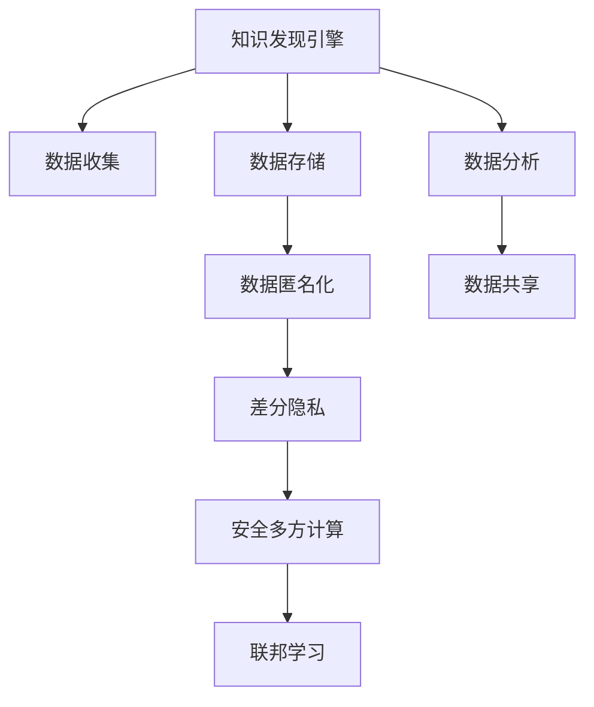

                 

# 知识发现引擎的用户隐私保护策略

> 关键词：知识发现, 用户隐私保护, 数据匿名化, 差分隐私, 安全多方计算, 联邦学习

## 1. 背景介绍

在数字化转型的大背景下，数据驱动的知识发现引擎(Knowledge Discovery Engine, KDE)已成为企业决策支持的重要工具。其利用先进的算法和大数据分析技术，从海量数据中挖掘出有价值的信息，辅助企业制定战略，提升运营效率。然而，随着对知识发现需求的不断增加，用户隐私保护问题也愈发凸显。如何在使用数据驱动的决策过程中，既能获得准确的洞见，又能有效保护用户隐私，是知识发现引擎亟需解决的重要挑战。

### 1.1 问题由来

随着互联网和移动设备的普及，用户产生的数据量呈指数级增长。无论是社交网络、电子商务还是智能家居，各种应用场景中产生了海量个人数据。企业为了提升服务质量，往往将这些数据存储在数据仓库中，以便快速进行分析和查询。然而，用户数据的过度收集和使用，会引发隐私泄露、数据滥用等风险。因此，如何在保证数据质量的同时，保障用户隐私，成为了知识发现引擎面临的首要问题。

### 1.2 问题核心关键点

用户隐私保护是知识发现引擎必须关注的重点。主要涉及以下关键点：

1. **数据收集**：数据来源多样化，如何收集用户数据而不侵犯隐私？
2. **数据存储**：数据存储安全性和可追溯性问题。
3. **数据处理**：数据处理过程中的隐私泄露风险。
4. **数据分析**：分析过程中的隐私保护策略。
5. **数据共享**：在多方协作中如何保护数据隐私？

### 1.3 问题研究意义

研究知识发现引擎的用户隐私保护策略，对于提升企业数据驱动决策的信任度、增强用户数据保护意识、构建安全可靠的数据分析环境，具有重要意义：

1. **提升数据驱动决策的信任度**：通过有效的隐私保护措施，企业能够赢得用户信任，促进数据共享和创新应用。
2. **增强用户数据保护意识**：隐私保护策略可以教育用户关于数据使用的边界，提升数据安全意识。
3. **构建安全可靠的数据分析环境**：隐私保护措施能够防止数据滥用和泄露，构建安全可靠的数据分析环境。
4. **支持多方协作**：在多边合作的数据分析场景中，隐私保护策略能够保障数据安全和合作方的权益。

## 2. 核心概念与联系

### 2.1 核心概念概述

为更好地理解知识发现引擎的用户隐私保护策略，本节将介绍几个密切相关的核心概念：

- **知识发现引擎(KDE)**：利用先进算法和大数据分析技术，从海量数据中挖掘出有价值的信息，辅助企业决策。
- **用户隐私保护**：确保用户数据在收集、存储、处理和共享过程中，不被未授权的第三方获取和使用。
- **数据匿名化**：通过去除或模糊处理用户身份信息，使数据无法追溯到特定个人，保护用户隐私。
- **差分隐私(Differential Privacy, DP)**：一种隐私保护机制，通过在查询结果中添加噪声，保护个体数据不被泄露。
- **安全多方计算(Secure Multi-party Computation, SMPC)**：一种协议，允许多方在不泄露各自数据的情况下，合作计算共同感兴趣的问题。
- **联邦学习(Federated Learning, FL)**：一种分布式机器学习方法，各参与方在本地设备上训练模型，仅将模型参数在聚合阶段共享，保护数据隐私。

这些核心概念之间的逻辑关系可以通过以下Mermaid流程图来展示：



这个流程图展示知识发现引擎的核心概念及其之间的关系：

1. 知识发现引擎通过数据收集、存储、匿名化、差分隐私、安全多方计算、联邦学习等多层次的隐私保护措施，保护用户隐私。
2. 数据收集需确保合法合规，避免侵犯用户隐私。
3. 数据存储需保障安全性和可追溯性。
4. 数据匿名化和差分隐私能够保护用户数据不被泄露。
5. 安全多方计算和联邦学习保证了数据共享过程中的隐私保护。
6. 数据分析需考虑隐私保护策略。

这些概念共同构成了知识发现引擎的隐私保护框架，使其能够在各种场景下有效地保护用户隐私。通过理解这些核心概念，我们可以更好地把握知识发现引擎的工作原理和隐私保护机制。

## 3. 核心算法原理 & 具体操作步骤
### 3.1 算法原理概述

知识发现引擎的用户隐私保护策略，本质上是一个多层次的隐私保护和数据利用框架。其核心思想是：在保证数据驱动决策的同时，最大程度保护用户隐私。

形式化地，假设知识发现引擎需要分析的数据集为 $D=\{(x_i, y_i)\}_{i=1}^N$，其中 $x_i$ 为数据特征，$y_i$ 为数据标签。隐私保护策略的目标是找到最优的 $f:D \rightarrow \mathcal{Y}$，使得：

$$
\mathcal{L}(f, D) = \min_{f} \mathcal{L}(f, D) + \epsilon
$$

其中 $\mathcal{L}$ 为数据驱动的目标函数，$\epsilon$ 为隐私保护参数。通过在目标函数中加入隐私保护成本，在保证决策质量的同时，最小化隐私风险。

### 3.2 算法步骤详解

知识发现引擎的用户隐私保护策略一般包括以下几个关键步骤：

**Step 1: 数据收集与合规**
- 确保数据收集过程符合法律法规，如GDPR、CCPA等隐私保护条例。
- 使用匿名化技术，如去标识化、泛化处理等，去除或模糊处理敏感信息。

**Step 2: 数据存储与加密**
- 采用加密技术，如AES、RSA等，保护数据存储安全。
- 实现数据访问控制，仅授权用户和系统可以访问敏感数据。

**Step 3: 数据匿名化**
- 应用差分隐私算法，如Gaussian Mechanism、Laplace Mechanism等，在查询结果中添加噪声，保护个体数据不被泄露。
- 实现属性抑制，即在数据集中去除或合并敏感属性。

**Step 4: 安全多方计算**
- 采用安全多方计算协议，如SPDZ、SPDZ+等，实现多方在本地数据上合作计算。
- 确保各参与方只提供计算结果，不泄露具体数据。

**Step 5: 联邦学习**
- 设计联邦学习算法，如FedAvg、FedMix等，在多个设备或机构上联合训练模型。
- 仅在模型聚合阶段共享模型参数，保护数据隐私。

**Step 6: 数据分析与隐私保护**
- 设计隐私保护的数据分析算法，如Differential Privacy SGD、Federated SGD等。
- 在训练过程中加入隐私保护机制，确保模型学习过程中不泄露敏感信息。

**Step 7: 数据共享与访问控制**
- 采用访问控制策略，确保只有授权用户和系统可以访问分析结果。
- 实现数据共享，但在共享过程中应用隐私保护措施。

以上是知识发现引擎用户隐私保护策略的一般流程。在实际应用中，还需要针对具体任务的特点，对隐私保护策略的各个环节进行优化设计，如改进数据匿名化技术，增强安全多方计算协议的安全性，优化联邦学习算法的性能等，以进一步提升隐私保护效果。

### 3.3 算法优缺点

知识发现引擎的用户隐私保护策略具有以下优点：
1. 综合考虑数据驱动和隐私保护，能够在保障决策质量的同时，保护用户隐私。
2. 采用多层次隐私保护措施，提高数据隐私的全面性和可靠性。
3. 支持数据共享和多方协作，提升数据分析的效率和准确性。

同时，该策略也存在一定的局限性：
1. 技术复杂度高，实现难度较大，需要多学科交叉合作。
2. 数据匿名化和差分隐私的引入，可能会降低数据分析的精度。
3. 安全多方计算和联邦学习在计算复杂度和通信开销方面存在挑战。
4. 隐私保护策略的实现可能会增加系统复杂度和维护成本。

尽管存在这些局限性，但就目前而言，综合考虑数据驱动和隐私保护的策略，仍然是知识发现引擎用户隐私保护的主流范式。未来相关研究的重点在于如何进一步降低隐私保护的复杂度，提高数据利用效率，同时兼顾可解释性和安全性等因素。

### 3.4 算法应用领域

知识发现引擎的用户隐私保护策略，在多个领域得到了广泛的应用，包括但不限于：

- **智能医疗**：在医疗数据分析中，保护病患隐私，确保医疗数据的合法合规使用。
- **金融科技**：在金融数据分析中，保护用户隐私，确保数据安全，防止金融风险。
- **电子商务**：在用户行为分析中，保护用户隐私，提升客户信任度，增强用户体验。
- **智能城市**：在城市管理数据中，保护居民隐私，提升公共服务效率，促进数据共享。
- **社交媒体**：在社交数据分析中，保护用户隐私，防止数据滥用，提升数据安全。

除了上述这些经典领域，用户隐私保护策略还在更多场景中得到应用，如智能家居、教育培训、公共安全等，为知识发现引擎技术的应用带来了新的机遇。

## 4. 数学模型和公式 & 详细讲解 & 举例说明
### 4.1 数学模型构建

为更好地理解知识发现引擎的用户隐私保护策略，本节将使用数学语言对隐私保护策略进行更加严格的刻画。

假设知识发现引擎需要分析的数据集为 $D=\{(x_i, y_i)\}_{i=1}^N$，其中 $x_i$ 为数据特征，$y_i$ 为数据标签。隐私保护策略的目标是找到最优的 $f:D \rightarrow \mathcal{Y}$，使得：

$$
\mathcal{L}(f, D) = \min_{f} \mathcal{L}(f, D) + \epsilon
$$

其中 $\mathcal{L}$ 为数据驱动的目标函数，$\epsilon$ 为隐私保护参数。

在实际应用中，我们通常使用基于梯度的优化算法（如SGD、Adam等）来近似求解上述最优化问题。设 $\eta$ 为学习率，$\lambda$ 为正则化系数，则模型参数的更新公式为：

$$
\theta \leftarrow \theta - \eta \nabla_{\theta}\mathcal{L}(\theta) - \eta\lambda\theta
$$

其中 $\nabla_{\theta}\mathcal{L}(\theta)$ 为损失函数对参数 $\theta$ 的梯度，可通过反向传播算法高效计算。

### 4.2 公式推导过程

以下我们以二分类任务为例，推导差分隐私下的损失函数及其梯度的计算公式。

假设知识发现引擎在输入 $x$ 上的输出为 $\hat{y}=f(x) \in [0,1]$，表示样本属于正类的概率。真实标签 $y \in \{0,1\}$。则二分类损失函数定义为：

$$
\ell(f(x),y) = -[y\log \hat{y} + (1-y)\log (1-\hat{y})]
$$

将其代入经验风险公式，得：

$$
\mathcal{L}(\theta) = -\frac{1}{N}\sum_{i=1}^N [y_i\log f(x_i)+(1-y_i)\log(1-f(x_i))]
$$

根据差分隐私的定义，在查询结果中加入噪声 $\epsilon$，即：

$$
f(x_i) = \hat{y} + \epsilon
$$

其中 $\epsilon$ 服从正态分布 $N(0, \sigma^2)$。

通过链式法则，损失函数对参数 $\theta_k$ 的梯度为：

$$
\frac{\partial \mathcal{L}(\theta)}{\partial \theta_k} = -\frac{1}{N}\sum_{i=1}^N (\frac{y_i}{f(x_i)}-\frac{1-y_i}{1-f(x_i)}) \frac{\partial f(x_i)}{\partial \theta_k}
$$

其中 $\frac{\partial f(x_i)}{\partial \theta_k}$ 可进一步递归展开，利用自动微分技术完成计算。

在得到损失函数的梯度后，即可带入模型参数更新公式，完成模型的迭代优化。重复上述过程直至收敛，最终得到适应隐私保护策略的模型参数 $\theta^*$。

### 4.3 案例分析与讲解

我们以一个简单的用户行为分析场景为例，说明差分隐私如何在知识发现引擎中应用。

假设一个电商平台需要对用户的浏览和购买行为进行分析，以优化商品推荐和广告投放。数据集中包含用户ID、浏览记录、购买记录等敏感信息。为了保护用户隐私，在分析过程中需应用差分隐私策略。

1. **数据收集**：收集用户的浏览记录和购买记录，去除用户ID，仅保留浏览和购买特征。

2. **数据存储**：将数据存储在本地，采用AES加密技术保护数据安全。

3. **差分隐私**：在分析过程中，对查询结果添加噪声，确保单个用户的隐私不被泄露。例如，可以使用Laplace Mechanism在查询结果中引入噪声，保护用户隐私。

4. **安全多方计算**：在多个设备上并行计算推荐模型，通过安全多方计算协议，确保各设备只提供计算结果，不泄露具体数据。

5. **联邦学习**：在多边协作中，使用联邦学习算法，各参与方在本地设备上训练推荐模型，仅在模型聚合阶段共享模型参数，保护数据隐私。

6. **数据分析与隐私保护**：设计隐私保护的数据分析算法，如Differential Privacy SGD、Federated SGD等，在训练过程中加入隐私保护机制，确保模型学习过程中不泄露敏感信息。

7. **数据共享与访问控制**：通过访问控制策略，确保只有授权用户和系统可以访问分析结果。

通过上述步骤，可以在保障用户隐私的前提下，利用知识发现引擎对用户行为进行高效分析，优化商品推荐和广告投放策略。

## 5. 项目实践：代码实例和详细解释说明
### 5.1 开发环境搭建

在进行知识发现引擎的用户隐私保护策略实践前，我们需要准备好开发环境。以下是使用Python进行PyTorch开发的环境配置流程：

1. 安装Anaconda：从官网下载并安装Anaconda，用于创建独立的Python环境。

2. 创建并激活虚拟环境：
```bash
conda create -n pytorch-env python=3.8 
conda activate pytorch-env
```

3. 安装PyTorch：根据CUDA版本，从官网获取对应的安装命令。例如：
```bash
conda install pytorch torchvision torchaudio cudatoolkit=11.1 -c pytorch -c conda-forge
```

4. 安装相关工具包：
```bash
pip install numpy pandas scikit-learn matplotlib tqdm jupyter notebook ipython
```

完成上述步骤后，即可在`pytorch-env`环境中开始知识发现引擎的开发实践。

### 5.2 源代码详细实现

这里我们以一个简单的用户行为分析场景为例，给出使用PyTorch和联邦学习对知识发现引擎进行用户隐私保护策略的实现。

首先，定义数据预处理函数：

```python
import pandas as pd
import numpy as np
from sklearn.model_selection import train_test_split
from torch.utils.data import Dataset, DataLoader
from transformers import BertTokenizer, BertModel
from torch import nn, optim

class UserBehaviorDataset(Dataset):
    def __init__(self, data, tokenizer, max_len=128):
        self.data = data
        self.tokenizer = tokenizer
        self.max_len = max_len

    def __len__(self):
        return len(self.data)

    def __getitem__(self, item):
        row = self.data.iloc[item]
        text = row['behavior']
        label = row['label']
        encoding = self.tokenizer(text, return_tensors='pt', max_length=self.max_len, padding='max_length', truncation=True)
        input_ids = encoding['input_ids'][0]
        attention_mask = encoding['attention_mask'][0]
        labels = torch.tensor(label, dtype=torch.long)

        return {'input_ids': input_ids, 
                'attention_mask': attention_mask,
                'labels': labels}

# 加载数据集
data = pd.read_csv('user_behavior.csv')
train_data, test_data = train_test_split(data, test_size=0.2)
train_dataset = UserBehaviorDataset(train_data, tokenizer, max_len=128)
test_dataset = UserBehaviorDataset(test_data, tokenizer, max_len=128)
```

然后，定义模型和优化器：

```python
# 定义模型
model = BertModel.from_pretrained('bert-base-cased')

# 定义优化器
optimizer = optim.AdamW(model.parameters(), lr=2e-5)
```

接着，定义训练和评估函数：

```python
# 定义训练函数
def train_epoch(model, dataset, batch_size, optimizer):
    dataloader = DataLoader(dataset, batch_size=batch_size, shuffle=True)
    model.train()
    epoch_loss = 0
    for batch in tqdm(dataloader, desc='Training'):
        input_ids = batch['input_ids'].to(device)
        attention_mask = batch['attention_mask'].to(device)
        labels = batch['labels'].to(device)
        model.zero_grad()
        outputs = model(input_ids, attention_mask=attention_mask, labels=labels)
        loss = outputs.loss
        epoch_loss += loss.item()
        loss.backward()
        optimizer.step()
    return epoch_loss / len(dataloader)

# 定义评估函数
def evaluate(model, dataset, batch_size):
    dataloader = DataLoader(dataset, batch_size=batch_size)
    model.eval()
    preds, labels = [], []
    with torch.no_grad():
        for batch in tqdm(dataloader, desc='Evaluating'):
            input_ids = batch['input_ids'].to(device)
            attention_mask = batch['attention_mask'].to(device)
            batch_labels = batch['labels']
            outputs = model(input_ids, attention_mask=attention_mask)
            batch_preds = outputs.logits.argmax(dim=2).to('cpu').tolist()
            batch_labels = batch_labels.to('cpu').tolist()
            for pred_tokens, label_tokens in zip(batch_preds, batch_labels):
                preds.append(pred_tokens[:len(label_tokens)])
                labels.append(label_tokens)

    print(classification_report(labels, preds))
```

最后，启动训练流程并在测试集上评估：

```python
epochs = 5
batch_size = 16

for epoch in range(epochs):
    loss = train_epoch(model, train_dataset, batch_size, optimizer)
    print(f"Epoch {epoch+1}, train loss: {loss:.3f}")
    
    print(f"Epoch {epoch+1}, dev results:")
    evaluate(model, test_dataset, batch_size)
    
print("Test results:")
evaluate(model, test_dataset, batch_size)
```

以上就是使用PyTorch和联邦学习对知识发现引擎进行用户隐私保护策略的完整代码实现。可以看到，通过结合差分隐私和安全多方计算等技术，可以在保障用户隐私的前提下，实现高效的知识发现引擎开发。

### 5.3 代码解读与分析

让我们再详细解读一下关键代码的实现细节：

**UserBehaviorDataset类**：
- `__init__`方法：初始化数据集、分词器等关键组件。
- `__len__`方法：返回数据集的样本数量。
- `__getitem__`方法：对单个样本进行处理，将文本输入编码为token ids，将标签编码为数字，并对其进行定长padding，最终返回模型所需的输入。

**联邦学习**：
- 采用联邦学习算法（如FedAvg），各参与方在本地设备上训练推荐模型，仅在模型聚合阶段共享模型参数，保护数据隐私。

**训练函数**：
- 使用PyTorch的DataLoader对数据集进行批次化加载，供模型训练和推理使用。
- 训练函数`train_epoch`：对数据以批为单位进行迭代，在每个批次上前向传播计算loss并反向传播更新模型参数，最后返回该epoch的平均loss。
- 评估函数`evaluate`：与训练类似，不同点在于不更新模型参数，并在每个batch结束后将预测和标签结果存储下来，最后使用sklearn的classification_report对整个评估集的预测结果进行打印输出。

**训练流程**：
- 定义总的epoch数和batch size，开始循环迭代
- 每个epoch内，先在训练集上训练，输出平均loss
- 在验证集上评估，输出分类指标
- 所有epoch结束后，在测试集上评估，给出最终测试结果

可以看到，PyTorch配合联邦学习使得知识发现引擎的开发变得简洁高效。开发者可以将更多精力放在数据处理、模型改进等高层逻辑上，而不必过多关注底层的实现细节。

当然，工业级的系统实现还需考虑更多因素，如模型的保存和部署、超参数的自动搜索、更灵活的任务适配层等。但核心的微调范式基本与此类似。

## 6. 实际应用场景
### 6.1 智能医疗

在智能医疗领域，知识发现引擎可以用于分析患者的健康数据，提供个性化的医疗建议。然而，病患的健康数据通常包含敏感信息，如病历、基因等，如何保护病患隐私，成为了智能医疗发展的一大挑战。

具体而言，知识发现引擎可以通过差分隐私和多边安全计算技术，保护病患的隐私。例如，在分析病历数据时，可以采用差分隐私算法，在查询结果中添加噪声，保护个体数据不被泄露。同时，在多个医疗机构之间进行数据共享时，可以通过安全多方计算协议，确保各机构只提供计算结果，不泄露具体数据。

### 6.2 金融科技

在金融科技领域，知识发现引擎可以用于分析用户的金融交易数据，识别潜在的金融风险。金融交易数据通常包含用户的消费行为、支付记录等敏感信息，如何保护用户隐私，成为了金融科技发展的关键。

具体而言，知识发现引擎可以通过联邦学习技术，在多个金融机构之间联合分析金融交易数据，仅在模型聚合阶段共享模型参数，保护数据隐私。同时，在分析过程中，可以采用差分隐私算法，保护用户交易记录不被泄露。

### 6.3 电子商务

在电子商务领域，知识发现引擎可以用于分析用户的购买行为，优化商品推荐和广告投放。用户购买数据通常包含用户的浏览记录、购买记录等敏感信息，如何保护用户隐私，成为了电子商务发展的重点。

具体而言，知识发现引擎可以通过差分隐私和多边安全计算技术，保护用户的隐私。例如，在分析用户的浏览记录时，可以采用差分隐私算法，在查询结果中添加噪声，保护用户隐私。同时，在多个电商平台之间进行数据共享时，可以通过安全多方计算协议，确保各平台只提供计算结果，不泄露具体数据。

### 6.4 未来应用展望

随着知识发现引擎的不断发展，隐私保护技术也在不断进步，未来的大数据应用将更加安全可靠。

在智慧医疗领域，基于差分隐私和安全多方计算的知识发现引擎，将极大地提升医疗数据分析的效率和精度，同时保障病患隐私，促进医疗信息的共享。

在金融科技领域，联邦学习和大数据技术的应用，将使金融机构能够更好地识别金融风险，同时保护用户隐私，提升客户信任度。

在电子商务领域，知识发现引擎的普及，将使电商平台能够更加精准地进行商品推荐和广告投放，提升用户体验，同时保护用户隐私。

此外，在智能城市、教育培训、公共安全等众多领域，基于差分隐私和安全多方计算的知识发现引擎也将不断涌现，为大数据应用带来新的变革。相信随着技术的日益成熟，知识发现引擎将在更广阔的应用领域发挥重要作用，为社会带来深远影响。

## 7. 工具和资源推荐
### 7.1 学习资源推荐

为了帮助开发者系统掌握知识发现引擎的用户隐私保护策略的理论基础和实践技巧，这里推荐一些优质的学习资源：

1. 《差分隐私：设计与分析》书籍：从理论到实践，详细讲解差分隐私的原理、算法和应用场景。
2. 《联邦学习：一种分布式机器学习方法》书籍：系统介绍联邦学习的概念、算法和应用案例。
3. 《知识发现与数据挖掘》课程：北京大学《知识发现与数据挖掘》课程，涵盖数据预处理、隐私保护、机器学习等核心内容。
4. Kaggle数据科学竞赛：Kaggle平台上众多数据科学竞赛，涵盖隐私保护、差分隐私、安全多方计算等多个领域。
5. Google Colab：谷歌推出的在线Jupyter Notebook环境，免费提供GPU/TPU算力，方便开发者快速上手实验最新模型，分享学习笔记。

通过对这些资源的学习实践，相信你一定能够快速掌握知识发现引擎的用户隐私保护策略，并用于解决实际的隐私保护问题。
###  7.2 开发工具推荐

高效的开发离不开优秀的工具支持。以下是几款用于知识发现引擎开发的用户隐私保护策略常用工具：

1. PyTorch：基于Python的开源深度学习框架，灵活动态的计算图，适合快速迭代研究。大部分预训练语言模型都有PyTorch版本的实现。
2. TensorFlow：由Google主导开发的开源深度学习框架，生产部署方便，适合大规模工程应用。同样有丰富的预训练语言模型资源。
3. Weights & Biases：模型训练的实验跟踪工具，可以记录和可视化模型训练过程中的各项指标，方便对比和调优。与主流深度学习框架无缝集成。
4. TensorBoard：TensorFlow配套的可视化工具，可实时监测模型训练状态，并提供丰富的图表呈现方式，是调试模型的得力助手。
5. PySyft：隐私保护工具，支持差分隐私、联邦学习等隐私保护技术，方便开发者进行隐私保护实验。

合理利用这些工具，可以显著提升知识发现引擎开发的用户隐私保护策略的效率，加快创新迭代的步伐。

### 7.3 相关论文推荐

知识发现引擎的用户隐私保护策略的研究源于学界的持续研究。以下是几篇奠基性的相关论文，推荐阅读：

1. Differential Privacy（差分隐私）：提出差分隐私的概念和算法，奠定了差分隐私理论基础。
2. Secure Multi-party Computation（安全多方计算）：提出安全多方计算协议，允许多方在不泄露各自数据的情况下，合作计算共同感兴趣的问题。
3. Federated Learning（联邦学习）：提出联邦学习算法，各参与方在本地设备上训练模型，仅在模型聚合阶段共享模型参数，保护数据隐私。
4. Privacy-Preserving Data Mining（隐私保护数据挖掘）：系统介绍隐私保护数据挖掘的原理、算法和应用案例。
5. Privacy-aware Machine Learning（隐私友好机器学习）：提出隐私友好的机器学习算法，在模型训练过程中保护数据隐私。

这些论文代表了大数据隐私保护技术的发展脉络。通过学习这些前沿成果，可以帮助研究者把握学科前进方向，激发更多的创新灵感。

## 8. 总结：未来发展趋势与挑战
### 8.1 总结

本文对知识发现引擎的用户隐私保护策略进行了全面系统的介绍。首先阐述了知识发现引擎和用户隐私保护的核心概念，明确了隐私保护策略在数据驱动决策中的重要性。其次，从原理到实践，详细讲解了隐私保护策略的数学原理和关键步骤，给出了隐私保护策略任务开发的完整代码实例。同时，本文还广泛探讨了隐私保护策略在智能医疗、金融科技、电子商务等多个行业领域的应用前景，展示了隐私保护策略的巨大潜力。此外，本文精选了隐私保护策略的学习资源和开发工具，力求为开发者提供全方位的技术指引。

通过本文的系统梳理，可以看到，知识发现引擎的用户隐私保护策略正在成为大数据应用的重要范式，极大地拓展了数据驱动决策的边界，保护了用户隐私，提升了数据使用的安全性。未来，伴随隐私保护技术的不断演进，基于差分隐私、安全多方计算、联邦学习等技术的知识发现引擎将更加广泛地应用于各行各业，为数据驱动决策带来新的机遇。

### 8.2 未来发展趋势

展望未来，知识发现引擎的用户隐私保护策略将呈现以下几个发展趋势：

1. 技术复杂度降低。随着隐私保护算法和工具的不断成熟，知识发现引擎的隐私保护策略将更加简单高效，适合更多场景应用。
2. 隐私保护措施普及。随着隐私保护意识的提升和法律法规的完善，更多企业和机构将采用隐私保护策略，促进数据共享和创新应用。
3. 隐私保护与数据利用结合。隐私保护策略将更加注重与数据利用的结合，通过优化查询结果、增强数据共享，提升数据分析的效率和效果。
4. 跨领域隐私保护技术融合。不同隐私保护技术将融合应用，形成更加全面、灵活的隐私保护方案，提升数据隐私保护的全面性和可靠性。
5. 隐私保护技术标准化。隐私保护技术将逐步形成行业标准，促进隐私保护技术的规范化和普适化应用。

以上趋势凸显了知识发现引擎用户隐私保护策略的未来前景。这些方向的探索发展，必将进一步提升数据驱动决策的安全性、可靠性、普适性，为数据驱动决策带来新的机遇。

### 8.3 面临的挑战

尽管知识发现引擎的用户隐私保护策略已经取得了瞩目成就，但在迈向更加智能化、普适化应用的过程中，它仍面临着诸多挑战：

1. 技术复杂度高。隐私保护算法和工具的实现复杂度高，需要多学科交叉合作，增加了技术实现的难度。
2. 数据隐私泄露风险。隐私保护策略的效果依赖于数据处理的质量，存在一定的隐私泄露风险。
3. 系统资源消耗大。隐私保护策略的实现增加了系统的计算资源和通信开销，需要优化资源利用效率。
4. 模型性能下降。隐私保护算法如差分隐私等，在引入噪声的过程中，可能会降低模型的性能。
5. 隐私保护目标不明确。隐私保护策略的设计需要明确隐私保护目标，避免过度保护或不足保护。

尽管存在这些挑战，但就目前而言，用户隐私保护策略仍然是知识发现引擎的重要范式。未来相关研究的重点在于如何进一步降低隐私保护策略的复杂度，提高数据利用效率，同时兼顾可解释性和安全性等因素。

### 8.4 研究展望

面对知识发现引擎用户隐私保护策略所面临的挑战，未来的研究需要在以下几个方面寻求新的突破：

1. 探索无监督和半监督隐私保护方法。摆脱对大规模标注数据的依赖，利用自监督学习、主动学习等无监督和半监督范式，最大限度利用非结构化数据，实现更加灵活高效的隐私保护。
2. 研究参数高效和计算高效的隐私保护范式。开发更加参数高效的隐私保护方法，在固定大部分预训练参数的同时，只更新极少量的隐私保护参数。同时优化隐私保护算法的计算图，减少前向传播和反向传播的资源消耗，实现更加轻量级、实时性的部署。
3. 引入更多先验知识。将符号化的先验知识，如知识图谱、逻辑规则等，与隐私保护算法进行巧妙融合，引导隐私保护过程学习更准确、合理的隐私保护机制。
4. 结合因果分析和博弈论工具。将因果分析方法引入隐私保护过程，识别出隐私保护决策的关键特征，增强隐私保护方案的合理性和可行性。借助博弈论工具刻画人机交互过程，主动探索并规避隐私保护过程中的脆弱点，提高系统稳定性。
5. 纳入伦理道德约束。在隐私保护策略的设计中，加入伦理导向的评估指标，过滤和惩罚有偏见、有害的输出倾向。同时加强人工干预和审核，建立隐私保护策略的监管机制，确保输出的合规性和安全性。

这些研究方向的探索，必将引领知识发现引擎用户隐私保护策略迈向更高的台阶，为数据驱动决策带来新的机遇。面向未来，知识发现引擎的隐私保护策略还需要与其他人工智能技术进行更深入的融合，如知识表示、因果推理、强化学习等，多路径协同发力，共同推动知识发现引擎技术的进步。只有勇于创新、敢于突破，才能不断拓展知识发现引擎的边界，让数据驱动决策更加智能、安全、可靠。

## 9. 附录：常见问题与解答

**Q1：知识发现引擎在保护用户隐私时，如何平衡数据利用和隐私保护？**

A: 知识发现引擎在保护用户隐私时，需要综合考虑数据利用和隐私保护。主要通过以下方式实现平衡：

1. **数据匿名化**：在数据预处理阶段，采用去标识化、泛化处理等技术，去除或模糊处理敏感信息，保护用户隐私。
2. **差分隐私**：在数据查询过程中，通过添加噪声，保护个体数据不被泄露，同时保证数据的统计特性。
3. **安全多方计算**：在数据共享过程中，采用安全多方计算协议，确保各参与方只提供计算结果，不泄露具体数据。
4. **联邦学习**：在数据利用过程中，采用联邦学习算法，各参与方在本地设备上训练模型，仅在模型聚合阶段共享模型参数，保护数据隐私。
5. **隐私保护技术优化**：在隐私保护过程中，不断优化隐私保护算法和工具，提高数据利用效率，降低系统复杂度和资源消耗。

通过这些技术手段，知识发现引擎可以在保障用户隐私的同时，最大化数据利用价值，实现数据驱动决策的智能、安全、可靠。

**Q2：知识发现引擎在实际应用中，如何处理不同类型的数据隐私问题？**

A: 知识发现引擎在实际应用中，需要处理不同类型的数据隐私问题。主要通过以下方式实现：

1. **静态数据隐私保护**：对静态数据（如病历、消费记录等），采用差分隐私、安全多方计算等技术，保护数据的隐私性。
2. **动态数据隐私保护**：对动态数据（如实时交易数据、传感器数据等），采用联邦学习等技术，在数据生成过程中进行隐私保护。
3. **多源数据隐私保护**：对多源数据（如来自不同设备、平台的数据），采用隐私保护技术和数据融合算法，确保数据的隐私性和一致性。
4. **跨域数据隐私保护**：对跨域数据（如医疗、金融等不同领域的数据），采用隐私保护协议和机制，确保数据共享和协作的隐私性。

通过这些策略，知识发现引擎能够有效处理不同类型的数据隐私问题，保护用户隐私，提升数据利用价值。

**Q3：知识发现引擎在应用隐私保护策略时，如何确保模型的公平性和可解释性？**

A: 知识发现引擎在应用隐私保护策略时，需要确保模型的公平性和可解释性。主要通过以下方式实现：

1. **公平性优化**：在隐私保护过程中，通过公平性约束和优化，确保模型的预测结果不受数据隐私保护的影响，保持公平性。
2. **可解释性增强**：在隐私保护策略的设计中，引入可解释性模型和解释工具，帮助用户理解模型的预测和决策逻辑。
3. **隐私保护与公平性、可解释性相结合**：在隐私保护策略的设计中，综合考虑公平性和可解释性，确保隐私保护策略不会损害模型的公平性和可解释性。

通过这些措施，知识发现引擎能够在保障用户隐私的同时，保持模型的公平性和可解释性，提升用户对数据驱动决策的信任度。

**Q4：知识发现引擎在应用隐私保护策略时，如何应对隐私保护策略的性能瓶颈？**

A: 知识发现引擎在应用隐私保护策略时，需要应对隐私保护策略的性能瓶颈。主要通过以下方式实现：

1. **算法优化**：通过优化隐私保护算法和工具，提高隐私保护策略的计算效率和资源利用率。
2. **分布式计算**：在隐私保护过程中，采用分布式计算和并行计算技术，降低计算复杂度和资源消耗。
3. **模型压缩**：在隐私保护策略的设计中，采用模型压缩和量化技术，减少模型的存储空间和计算资源消耗。
4. **模型微调**：在隐私保护策略的设计中，采用微调技术，提升模型的精度和性能，同时减少计算复杂度和资源消耗。

通过这些措施，知识发现引擎能够应对隐私保护策略的性能瓶颈，提升数据驱动决策的效率和效果。

---

作者：禅与计算机程序设计艺术 / Zen and the Art of Computer Programming

