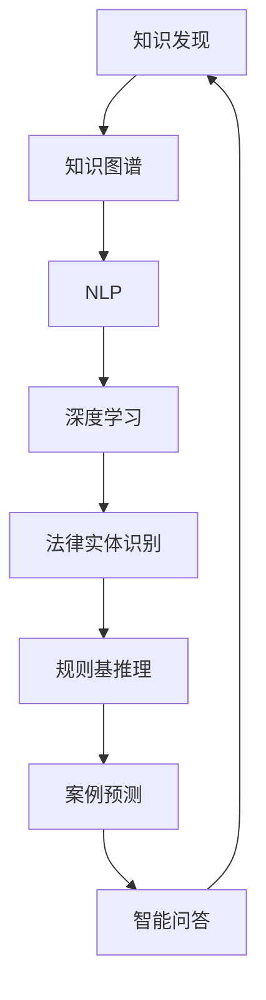

                 

## 1. 背景介绍

### 1.1 问题由来
近年来，人工智能在各行各业得到了广泛应用，大幅提升了产业效率和用户体验。然而，相较于医疗、金融等领域的AI应用，法律行业由于数据隐私、法规合规、高专业性等问题，AI技术的落地应用进展较慢。

法律行业面临的挑战包括但不限于以下几点：
1. 法律数据获取困难：由于隐私保护法规的约束，获取大量真实法律案例数据难度大。
2. 法律文档处理复杂：法律文书具有高度的格式化和标准化要求，文本解析难度大。
3. 法律推理复杂：法律问题高度依赖先例，传统规则基推理难以适应复杂多变的法律环境。
4. 法律知识表达困难：法律知识往往高度抽象和语义化，难以简单映射到机器可理解的形式。
5. 法律服务供应不足：尽管法律服务市场需求旺盛，但由于律师成本高昂、数量有限，法律咨询获取渠道有限。

因此，推动法律行业的智慧升级，将AI技术与法律领域专业知识相结合，迫在眉睫。知识发现引擎（Knowledge Discovery Engine, KDE）作为连接法律知识与AI技术的重要桥梁，旨在解决上述问题，提升法律行业的智能化水平。

### 1.2 问题核心关键点
知识发现引擎的核心思想是：基于先进的自然语言处理（NLP）和深度学习技术，从海量的法律文档和案例中自动抽取和分析知识，构建结构化知识图谱，辅助法律专业人士进行快速检索、类比推理、案例预测等任务。

核心关键点包括：
1. 文档解析：将法律文档文本转换为结构化信息，如法律实体、条款、事实、争议点等。
2. 知识抽取：从法律文本中自动抽取事实和规则，生成逻辑图谱。
3. 推理计算：构建法律规则知识图谱，基于逻辑图谱进行推理计算。
4. 案例预测：基于推理结果，自动预测法律判决和处理建议。
5. 用户交互：提供智能问答、自动生成文书、智能推荐等用户体验。

## 2. 核心概念与联系

### 2.1 核心概念概述

为更好地理解知识发现引擎的原理和应用，本节将介绍几个密切相关的核心概念：

- **知识发现（Knowledge Discovery, KD）**：从数据中发现潜在的模式和结构，提炼出有用的知识的过程。
- **知识图谱（Knowledge Graph）**：一种结构化的知识表示形式，将实体和它们之间的关系用节点和边表示，便于知识推理和检索。
- **自然语言处理（Natural Language Processing, NLP）**：让计算机理解和处理人类语言的技术，包括文本解析、情感分析、语义理解等。
- **深度学习（Deep Learning）**：一种机器学习技术，通过多层神经网络进行特征提取和模式识别，具备强大的学习能力。
- **法律实体识别（Legal Entity Recognition, LER）**：从法律文本中识别出具体的法律实体，如人名、地名、机构名等。
- **规则基推理（Rule-Based Reasoning）**：基于事先定义的规则进行推理计算，具有较高的可解释性。
- **案例预测（Case Prediction）**：基于已有案例，自动预测新案例的法律判决结果。
- **智能问答（Intelligent Question Answering）**：利用知识图谱和推理技术，自动回答法律问题，提供法律咨询。

这些核心概念之间的逻辑关系可以通过以下Mermaid流程图来展示：



这个流程图展示了我知识发现引擎的核心概念及其之间的关系：

1. 知识发现(A)依赖于知识图谱(B)作为知识表示形式。
2. 知识图谱(B)由NLP(C)解析文本生成，并由深度学习(D)进行增强。
3. 法律实体识别(E)是知识图谱(B)构建的第一步，提取关键信息。
4. 规则基推理(F)在法律推理过程中起到关键作用。
5. 案例预测(G)通过已有的法律推理结果进行，以辅助新案例判决。
6. 智能问答(H)结合了知识图谱(B)和规则基推理(F)，提供智能咨询。

## 3. 核心算法原理 & 具体操作步骤
### 3.1 算法原理概述

知识发现引擎基于深度学习和大规模知识抽取技术，其核心算法原理包括：

1. **文档解析（Tokenization, Dependency Parsing）**：将法律文本解析为结构化信息，如分词、句法分析、命名实体识别等。
2. **知识抽取（Knowledge Extraction, Fact Mining）**：从文本中抽取事实和规则，生成结构化的知识图谱。
3. **推理计算（Inference, Rule-based Reasoning）**：构建知识图谱，基于逻辑图谱进行推理计算。
4. **案例预测（Case Prediction）**：基于已有的推理结果，自动预测新案例的判决。
5. **用户交互（User Interaction, Query Understanding）**：提供智能问答、智能文书生成等功能。

知识发现引擎的整体流程可以概括为以下几个步骤：

1. 收集和预处理法律数据。
2. 利用NLP技术解析法律文本，生成结构化知识。
3. 抽取法律事实和规则，构建知识图谱。
4. 利用规则基推理进行推理计算。
5. 根据推理结果进行案例预测。
6. 提供智能问答和文书生成功能，供用户交互。

### 3.2 算法步骤详解

**Step 1: 收集和预处理法律数据**
- 收集法律领域相关的数据，包括历史案例、法律条款、法规、专家解释等。
- 对数据进行清洗和标注，去除无关信息，如注释、摘要等。
- 将文本标准化，如统一大小写、格式等，提高解析效率。

**Step 2: 文档解析**
- 利用NLP技术解析法律文本，生成分词、句法分析、命名实体识别等结构化信息。
- 使用依赖解析技术，识别句子之间的依存关系，理解句子结构。
- 将解析结果存储为结构化数据，供后续处理使用。

**Step 3: 知识抽取**
- 基于解析结果，自动抽取法律文本中的实体、事实、规则等信息。
- 利用规则基推理技术，识别法律文本中的模式和规则。
- 将抽取的信息存储到知识图谱中，构建结构化的法律知识体系。

**Step 4: 推理计算**
- 根据知识图谱中的实体和关系，构建推理图谱。
- 使用规则基推理或基于神经网络的图神经网络（GNN）进行推理计算。
- 推理过程支持多路推理、迭代推理、演绎推理等，以适应不同的法律推理场景。

**Step 5: 案例预测**
- 基于推理结果，自动预测新案例的判决和处理建议。
- 引入贝叶斯网络、决策树等传统机器学习技术，进行判决预测。
- 使用深度学习技术，如卷积神经网络（CNN）、递归神经网络（RNN）等，提升预测精度。

**Step 6: 用户交互**
- 提供智能问答系统，自动回答用户输入的法律问题。
- 利用知识图谱和推理结果，生成文书模板和建议。
- 提供自然语言处理接口，支持语音、手写输入等多样化交互方式。

### 3.3 算法优缺点

知识发现引擎在提升法律行业智能化水平方面具备显著优势，但也存在一些局限性：

**优点**：
1. 自动化处理大量法律数据，提升工作效率。
2. 减少律师手动解析文本的时间和成本。
3. 提供智能问答和文书生成功能，提升用户体验。
4. 结合深度学习和规则基推理，提升推理精度。

**缺点**：
1. 对数据质量和标注的依赖较高，需要投入大量人力和资源进行数据处理和标注。
2. 构建知识图谱和推理规则的过程较为复杂，需要专家知识和手动调整。
3. 推理过程复杂，难以解释和调试。
4. 依赖于特定领域的法律知识和经验，难以推广到其他领域。

## 4. 数学模型和公式 & 详细讲解
### 4.1 数学模型构建

知识发现引擎涉及的数学模型主要包括：

- 文本解析模型：用于文本分词、句法分析和实体识别。
- 知识抽取模型：用于从文本中抽取实体、事实和规则。
- 推理计算模型：用于推理图谱的构建和计算。
- 案例预测模型：用于预测新案例的判决结果。

**文本解析模型**：
- 分词模型：将法律文本分解为单词或词组，生成词向量表示。
- 句法分析模型：识别句子中的依存关系，生成句法树。
- 命名实体识别模型：识别文本中的实体，如人名、地名、机构名等。

**知识抽取模型**：
- 事实抽取模型：从文本中抽取实体-实体关系-时间关系等事实。
- 规则抽取模型：从文本中提取法律规则，如合同条款、法律条文等。

**推理计算模型**：
- 图神经网络（GNN）：构建法律知识图谱，进行推理计算。
- 规则基推理：基于逻辑规则进行推理计算，如IF-THEN语句、规则图等。

**案例预测模型**：
- 逻辑回归模型：用于预测二分类问题，如判决结果。
- 支持向量机（SVM）：用于预测多分类问题，如案件类型。
- 神经网络模型：如CNN、RNN等，用于预测判决结果。

### 4.2 公式推导过程

**文本解析模型**：
- 分词模型：使用词袋模型(Bag of Words, BOW)或N-gram模型，生成词向量表示。
- 句法分析模型：使用依存句法分析技术，生成句法树。
- 命名实体识别模型：使用条件随机场（CRF）或递归神经网络（RNN）等，进行命名实体识别。

**知识抽取模型**：
- 事实抽取模型：使用序列标注模型，如CRF、LSTM等，进行实体-关系标注。
- 规则抽取模型：使用基于规则的模板匹配技术，提取法律规则。

**推理计算模型**：
- 图神经网络（GNN）：基于图卷积网络（GCN）、图注意力网络（GAT）等，进行知识推理。
- 规则基推理：使用IF-THEN语句、规则图等，进行推理计算。

**案例预测模型**：
- 逻辑回归模型：$P(y|x) = \frac{1}{1+\exp(-z)}$，其中$z = \sum w_ix_i$。
- 支持向量机（SVM）：$h(x) = sign(w \cdot x + b)$，其中$w, b$为模型参数。
- 神经网络模型：如卷积神经网络（CNN）、递归神经网络（RNN）等。

### 4.3 案例分析与讲解

以合同纠纷案例预测为例，说明知识发现引擎的工作原理。

**Step 1: 数据预处理**
- 收集合同纠纷案例数据，标注法律实体、事实和争议点等关键信息。
- 将文本标准化，统一格式和大小写。

**Step 2: 文本解析**
- 使用NLP技术进行分词、句法分析和命名实体识别，生成结构化信息。
- 构建句子依存树，理解句子结构。

**Step 3: 知识抽取**
- 从文本中抽取法律实体和事实，如合同条款、争议点等。
- 提取合同纠纷的典型模式和规则，如合同条款缺失、履行问题等。
- 构建法律知识图谱，存储实体和规则。

**Step 4: 推理计算**
- 根据法律知识图谱，进行多路推理和演绎推理，计算判决结果。
- 引入神经网络模型，提升推理精度。

**Step 5: 案例预测**
- 使用逻辑回归模型预测合同纠纷的判决结果。
- 引入神经网络模型，进一步提升预测精度。

**Step 6: 用户交互**
- 提供智能问答系统，自动回答合同纠纷相关问题。
- 生成文书模板和处理建议，供律师参考。

## 5. 项目实践：代码实例和详细解释说明
### 5.1 开发环境搭建

在进行知识发现引擎开发前，我们需要准备好开发环境。以下是使用Python进行PyTorch开发的环境配置流程：

1. 安装Anaconda：从官网下载并安装Anaconda，用于创建独立的Python环境。

2. 创建并激活虚拟环境：
```bash
conda create -n kde-env python=3.8 
conda activate kde-env
```

3. 安装PyTorch：根据CUDA版本，从官网获取对应的安装命令。例如：
```bash
conda install pytorch torchvision torchaudio cudatoolkit=11.1 -c pytorch -c conda-forge
```

4. 安装深度学习相关的库：
```bash
pip install torchtext
pip install transformers
pip install scikit-learn
pip install pandas
pip install pydot
```

5. 安装其他相关库：
```bash
pip install nltk
pip install spacy
```

完成上述步骤后，即可在`kde-env`环境中开始知识发现引擎的开发。

### 5.2 源代码详细实现

这里我们以合同纠纷案例预测为例，给出使用PyTorch进行知识发现引擎的代码实现。

首先，定义数据处理函数：

```python
import pandas as pd
import torch
from torch.utils.data import Dataset, DataLoader
from transformers import BertTokenizer, BertForSequenceClassification
from sklearn.metrics import accuracy_score, precision_recall_fscore_support

class ContractDataset(Dataset):
    def __init__(self, data_path, tokenizer, max_len=128):
        self.data = pd.read_csv(data_path)
        self.tokenizer = tokenizer
        self.max_len = max_len

    def __len__(self):
        return len(self.data)

    def __getitem__(self, item):
        text = self.data.iloc[item]['text']
        label = self.data.iloc[item]['label']

        encoding = self.tokenizer(text, return_tensors='pt', max_length=self.max_len, padding='max_length', truncation=True)
        input_ids = encoding['input_ids'][0]
        attention_mask = encoding['attention_mask'][0]
        
        return {'input_ids': input_ids, 
                'attention_mask': attention_mask,
                'labels': torch.tensor(label, dtype=torch.long)}
```

然后，定义模型和优化器：

```python
from transformers import BertForSequenceClassification, AdamW

model = BertForSequenceClassification.from_pretrained('bert-base-cased', num_labels=2)

optimizer = AdamW(model.parameters(), lr=2e-5)
```

接着，定义训练和评估函数：

```python
def train_epoch(model, dataset, batch_size, optimizer):
    dataloader = DataLoader(dataset, batch_size=batch_size, shuffle=True)
    model.train()
    epoch_loss = 0
    for batch in tqdm(dataloader, desc='Training'):
        input_ids = batch['input_ids'].to(device)
        attention_mask = batch['attention_mask'].to(device)
        labels = batch['labels'].to(device)
        model.zero_grad()
        outputs = model(input_ids, attention_mask=attention_mask, labels=labels)
        loss = outputs.loss
        epoch_loss += loss.item()
        loss.backward()
        optimizer.step()
    return epoch_loss / len(dataloader)

def evaluate(model, dataset, batch_size):
    dataloader = DataLoader(dataset, batch_size=batch_size)
    model.eval()
    preds, labels = [], []
    with torch.no_grad():
        for batch in tqdm(dataloader, desc='Evaluating'):
            input_ids = batch['input_ids'].to(device)
            attention_mask = batch['attention_mask'].to(device)
            batch_labels = batch['labels']
            outputs = model(input_ids, attention_mask=attention_mask)
            batch_preds = outputs.logits.argmax(dim=2).to('cpu').tolist()
            batch_labels = batch_labels.to('cpu').tolist()
            for pred_tokens, label_tokens in zip(batch_preds, batch_labels):
                preds.append(pred_tokens)
                labels.append(label_tokens)

    return accuracy_score(labels, preds)
```

最后，启动训练流程并在测试集上评估：

```python
epochs = 5
batch_size = 16

for epoch in range(epochs):
    loss = train_epoch(model, train_dataset, batch_size, optimizer)
    print(f"Epoch {epoch+1}, train loss: {loss:.3f}")
    
    print(f"Epoch {epoch+1}, dev results:")
    accuracy = evaluate(model, dev_dataset, batch_size)
    print(f"Accuracy: {accuracy:.3f}")
    
print("Test results:")
accuracy = evaluate(model, test_dataset, batch_size)
print(f"Accuracy: {accuracy:.3f}")
```

以上就是使用PyTorch对合同纠纷案例预测任务进行知识发现引擎开发的完整代码实现。可以看到，借助BERT模型和深度学习库，我们能够用相对简洁的代码完成案例预测任务的开发。

### 5.3 代码解读与分析

让我们再详细解读一下关键代码的实现细节：

**ContractDataset类**：
- `__init__`方法：初始化文本、标签、分词器等关键组件。
- `__len__`方法：返回数据集的样本数量。
- `__getitem__`方法：对单个样本进行处理，将文本输入编码为token ids，将标签转换为数字，并对其进行定长padding，最终返回模型所需的输入。

**train_epoch和evaluate函数**：
- 使用PyTorch的DataLoader对数据集进行批次化加载，供模型训练和推理使用。
- 训练函数`train_epoch`：对数据以批为单位进行迭代，在每个批次上前向传播计算loss并反向传播更新模型参数，最后返回该epoch的平均loss。
- 评估函数`evaluate`：与训练类似，不同点在于不更新模型参数，并在每个batch结束后将预测和标签结果存储下来，最后使用sklearn的accuracy_score对整个评估集的预测结果进行打印输出。

**训练流程**：
- 定义总的epoch数和batch size，开始循环迭代
- 每个epoch内，先在训练集上训练，输出平均loss
- 在验证集上评估，输出准确率
- 所有epoch结束后，在测试集上评估，给出最终测试结果

可以看到，PyTorch配合深度学习库使得知识发现引擎的开发变得简洁高效。开发者可以将更多精力放在数据处理、模型改进等高层逻辑上，而不必过多关注底层的实现细节。

当然，工业级的系统实现还需考虑更多因素，如模型的保存和部署、超参数的自动搜索、更灵活的任务适配层等。但核心的知识发现引擎范式基本与此类似。

## 6. 实际应用场景
### 6.1 智能合同审核
智能合同审核系统能够自动审核合同文本，检测条款合规性、合同风险等，从而提升合同审核的效率和准确性。

在技术实现上，可以收集大量历史合同文本，标注合同条款和争议点，构建知识图谱。使用知识发现引擎自动分析新合同文本，检测条款缺失、履行问题等，并提供风险提示和合规建议。对于高风险合同，系统可以进一步生成修改建议，辅助合同方修改合同文本。

### 6.2 法律文书生成
法律文书生成系统能够自动生成各种法律文书，如起诉状、答辩状、判决书等，减少律师撰写文书的时间和成本。

在技术实现上，可以收集大量法律文书的文本，提取文书结构、格式、语言规范等知识，构建知识图谱。使用知识发现引擎根据用户输入的法律案件信息和文书结构，自动生成各类文书模板，并提供智能推荐和修改建议。

### 6.3 法律咨询问答
法律咨询问答系统能够自动回答法律相关问题，如合同条款解释、法律条款适用等，提升法律咨询服务的效率和覆盖范围。

在技术实现上，可以收集用户输入的问题，利用知识发现引擎抽取关键信息，匹配知识图谱中的事实和规则，自动生成答案。对于复杂问题，系统可以提供多轮问答交互，逐步引导用户输入更多信息，并结合知识图谱推理出最终答案。

### 6.4 法律案件推荐
法律案件推荐系统能够根据用户输入的法律案件信息，推荐相似案例和处理建议，帮助用户快速找到类似案件和解决方案。

在技术实现上，可以收集大量历史法律案件，标注案件类型、争议点、判决结果等关键信息，构建知识图谱。使用知识发现引擎根据用户输入的案件信息，自动匹配知识图谱中的相似案例，并提供相似案件的判决结果和处理建议。

### 6.5 法律风险预警
法律风险预警系统能够实时监控法律新闻、公告等信息，自动分析其对客户的影响，及时发出风险预警。

在技术实现上，可以收集各类法律新闻、公告等文本信息，提取关键信息，如案件类型、判决结果等。使用知识发现引擎实时监控新文本，根据其内容自动分析风险程度，并在客户系统推送风险预警信息。

## 7. 工具和资源推荐
### 7.1 学习资源推荐

为了帮助开发者系统掌握知识发现引擎的理论基础和实践技巧，这里推荐一些优质的学习资源：

1. 《深度学习在NLP中的应用》系列博文：由大模型技术专家撰写，深入浅出地介绍了深度学习在NLP中的各类应用，包括文档解析、知识抽取、推理计算等。

2. 《自然语言处理综论》课程：斯坦福大学开设的NLP明星课程，涵盖自然语言处理的基本概念和经典模型，有助于理解知识发现引擎的理论基础。

3. 《Knowledge Discovery and Data Mining》书籍：深度介绍知识发现和数据挖掘的技术，涵盖从数据预处理到知识抽取、推理计算等各个环节。

4. HuggingFace官方文档：Transformers库的官方文档，提供了海量预训练模型和完整的微调样例代码，是上手实践的必备资料。

5. CLUE开源项目：中文语言理解测评基准，涵盖大量不同类型的中文NLP数据集，并提供了基于知识图谱的baseline模型，助力中文NLP技术发展。

通过对这些资源的学习实践，相信你一定能够快速掌握知识发现引擎的精髓，并用于解决实际的NLP问题。
###  7.2 开发工具推荐

高效的开发离不开优秀的工具支持。以下是几款用于知识发现引擎开发的常用工具：

1. PyTorch：基于Python的开源深度学习框架，灵活动态的计算图，适合快速迭代研究。大部分预训练语言模型都有PyTorch版本的实现。

2. TensorFlow：由Google主导开发的开源深度学习框架，生产部署方便，适合大规模工程应用。同样有丰富的预训练语言模型资源。

3. Transformers库：HuggingFace开发的NLP工具库，集成了众多SOTA语言模型，支持PyTorch和TensorFlow，是进行知识图谱构建和推理计算的利器。

4. Weights & Biases：模型训练的实验跟踪工具，可以记录和可视化模型训练过程中的各项指标，方便对比和调优。与主流深度学习框架无缝集成。

5. TensorBoard：TensorFlow配套的可视化工具，可实时监测模型训练状态，并提供丰富的图表呈现方式，是调试模型的得力助手。

6. Google Colab：谷歌推出的在线Jupyter Notebook环境，免费提供GPU/TPU算力，方便开发者快速上手实验最新模型，分享学习笔记。

合理利用这些工具，可以显著提升知识发现引擎的开发效率，加快创新迭代的步伐。

### 7.3 相关论文推荐

知识发现引擎涉及的深度学习和大规模知识抽取技术，已经得到了学界的持续关注。以下是几篇奠基性的相关论文，推荐阅读：

1. Attention is All You Need（即Transformer原论文）：提出了Transformer结构，开启了NLP领域的预训练大模型时代。

2. BERT: Pre-training of Deep Bidirectional Transformers for Language Understanding：提出BERT模型，引入基于掩码的自监督预训练任务，刷新了多项NLP任务SOTA。

3. Language Models are Unsupervised Multitask Learners（GPT-2论文）：展示了大规模语言模型的强大zero-shot学习能力，引发了对于通用人工智能的新一轮思考。

4. Knowledge Graph Embedding and Reasoning：介绍知识图谱的嵌入技术和推理算法，如TransE、TransH等。

5. Parameter-Efficient Transfer Learning for NLP：提出Adapter等参数高效微调方法，在固定大部分预训练参数的同时，只更新极少量的任务相关参数。

6. Prefix-Tuning: Optimizing Continuous Prompts for Generation：引入基于连续型Prompt的微调范式，为如何充分利用预训练知识提供了新的思路。

这些论文代表了大语言模型微调技术的发展脉络。通过学习这些前沿成果，可以帮助研究者把握学科前进方向，激发更多的创新灵感。

## 8. 总结：未来发展趋势与挑战

### 8.1 总结

本文对知识发现引擎的理论和实践进行了全面系统的介绍。首先阐述了知识发现引擎在法律行业智慧升级中的重要性，明确了其在提升法律行业智能化水平、减少律师成本等方面的价值。其次，从原理到实践，详细讲解了知识发现引擎的核心算法和具体操作步骤，给出了知识发现引擎任务开发的完整代码实例。同时，本文还广泛探讨了知识发现引擎在智能合同审核、文书生成、法律咨询问答、案件推荐、风险预警等多个行业领域的应用前景，展示了知识发现引擎的广阔潜力。此外，本文精选了知识发现引擎的学习资源，力求为读者提供全方位的技术指引。

通过本文的系统梳理，可以看到，知识发现引擎在推动法律行业智能化升级方面，具备显著优势。结合先进的自然语言处理和深度学习技术，知识发现引擎有望成为法律行业智能化发展的核心引擎，提升法律服务的效率和覆盖范围，降低法律服务的成本和门槛。

### 8.2 未来发展趋势

展望未来，知识发现引擎在推动法律行业智慧升级方面，将呈现以下几个发展趋势：

1. 模型规模持续增大。随着算力成本的下降和数据规模的扩张，知识发现引擎所使用的预训练语言模型的参数量还将持续增长。超大批次的训练和推理也可能遇到显存不足的问题。因此需要采用一些资源优化技术，如梯度积累、混合精度训练、模型并行等，来突破硬件瓶颈。

2. 知识抽取模型更加自动化。知识发现引擎的知识抽取过程将更加自动化，能够自动标注、抽取事实和规则，从而减少人工标注的工作量。

3. 推理计算模型更加高效。知识发现引擎将引入更多高效的推理算法，如图神经网络（GNN）、注意力机制等，提升推理计算的效率和精度。

4. 多模态知识图谱。知识发现引擎的知识图谱将涵盖更多模态的数据，如图像、语音、视频等，构建多模态知识图谱，提升对现实世界的理解能力。

5. 增强用户交互体验。知识发现引擎将提供更加智能的问答系统、文书生成系统等，提升用户交互体验，进一步融入法律服务体系。

6. 知识图谱的跨领域应用。知识发现引擎的知识图谱将跨越不同领域，如法律、医学、金融等，提供通用的知识推理服务，助力各行业的智能化升级。

这些趋势凸显了知识发现引擎的广泛应用前景。未来的知识发现引擎将更加智能化、自动化、多模态化，为各行各业的知识服务提供强有力的支持。

### 8.3 面临的挑战

尽管知识发现引擎在推动法律行业智慧升级方面具备显著优势，但在迈向更加智能化、普适化应用的过程中，它仍面临诸多挑战：

1. 数据质量和标注的依赖较高。尽管技术发展能够自动标注和抽取知识，但高质量标注数据仍是不可或缺的。数据稀缺和标注难度较高，将成为知识发现引擎发展的瓶颈。

2. 推理计算过程复杂。知识发现引擎的推理计算过程复杂，难以解释和调试。如何提高推理过程的可解释性，是知识发现引擎应用的关键。

3. 依赖于特定领域的知识。知识发现引擎的知识图谱和推理模型依赖于特定领域的法律知识和经验，难以推广到其他领域。如何构建通用的知识图谱，是知识发现引擎面临的重要课题。

4. 安全性和隐私保护。知识发现引擎涉及大量法律数据和隐私信息，如何保障数据安全和隐私保护，是一个重要的研究方向。

5. 计算资源的消耗。知识发现引擎的训练和推理需要大量的计算资源，如何优化模型结构和算法，降低计算资源的消耗，是知识发现引擎应用的重要挑战。

6. 跨领域知识迁移。知识发现引擎在不同领域的应用效果不佳，如何构建跨领域的知识图谱，促进知识迁移和融合，是未来的重要研究方向。

这些挑战凸显了知识发现引擎在应用推广中的复杂性和难度，需要在技术、方法、标准等多方面进行深入研究。唯有克服这些挑战，知识发现引擎才能真正实现对法律行业智能化升级的深远影响。

### 8.4 研究展望

面向未来，知识发现引擎的研究需要在以下几个方向寻求新的突破：

1. 无监督和半监督知识抽取。摆脱对大规模标注数据的依赖，利用自监督学习、主动学习等无监督和半监督范式，最大限度利用非结构化数据，实现更加灵活高效的的知识抽取。

2. 参数高效的知识图谱推理。开发更加参数高效的推理方法，在固定大部分预训练参数的同时，只更新极少量的任务相关参数。

3. 多模态知识图谱构建。引入图像、语音、视频等模态的数据，构建多模态知识图谱，提升对现实世界的理解能力。

4. 推理计算的可解释性。引入因果分析方法、博弈论等工具，提高知识发现引擎的推理过程的可解释性和逻辑性。

5. 跨领域的知识迁移。通过领域适应学习、元学习等方法，提升知识发现引擎在不同领域的应用效果。

6. 知识图谱的安全性。引入区块链、加密技术等手段，保障知识图谱和推理过程的安全性和隐私保护。

这些研究方向将推动知识发现引擎技术的进一步发展和应用，促进法律行业智慧升级的实现。通过多领域、多层次的协同研究，相信知识发现引擎将在推动法律行业智能化升级中发挥越来越重要的作用，为构建智慧法律服务体系提供强有力的技术支持。

## 9. 附录：常见问题与解答

**Q1：知识发现引擎与传统的规则基推理有何不同？**

A: 知识发现引擎和传统的规则基推理有以下几点不同：
1. 知识发现引擎自动抽取和构建知识图谱，无需手动定义规则。
2. 知识发现引擎支持基于神经网络的推理计算，具备更强的泛化能力。
3. 知识发现引擎支持多路推理和迭代推理，适应复杂的法律推理场景。

**Q2：知识发现引擎在构建知识图谱时，如何处理噪音数据？**

A: 知识发现引擎在构建知识图谱时，通常会采用以下方法处理噪音数据：
1. 数据清洗：去除不相关的文本信息，如注释、摘要等。
2. 异常检测：使用统计方法或机器学习模型，检测和剔除异常文本数据。
3. 多模态融合：引入图像、语音、视频等模态的数据，提升知识抽取的准确性。
4. 迭代优化：通过多次训练和优化，不断提升知识抽取模型的性能。

**Q3：知识发现引擎的推理计算过程如何保证可解释性？**

A: 知识发现引擎的推理计算过程可以通过以下方法保证可解释性：
1. 规则基推理：使用简洁的IF-THEN规则进行推理，具备较高的可解释性。
2. 因果分析：引入因果推断方法，分析推理过程的关键因素，增强可解释性。
3. 可视化工具：使用可视化工具，如GNN图谱、决策树等，展示推理过程和结果。

**Q4：知识发现引擎在法律行业的实际应用中，有哪些挑战和瓶颈？**

A: 知识发现引擎在法律行业的实际应用中，面临以下挑战和瓶颈：
1. 数据稀缺：法律数据获取困难，数据稀缺问题严重。
2. 数据标注难度高：法律数据的标注需要专业知识，标注难度大。
3. 推理过程复杂：法律问题高度依赖先例，推理过程复杂。
4. 可解释性不足：知识发现引擎的推理过程复杂，难以解释。
5. 安全性和隐私保护：法律数据涉及隐私保护，数据安全和隐私保护难度高。
6. 跨领域知识迁移：知识发现引擎在不同领域的应用效果不佳。

**Q5：知识发现引擎如何提升法律服务的效率和质量？**

A: 知识发现引擎通过以下方式提升法律服务的效率和质量：
1. 自动化处理法律文本，减少律师手动解析文本的时间和成本。
2. 自动抽取法律事实和规则，生成结构化知识图谱。
3. 自动化推理计算，提供智能问答、文书生成等功能，提升用户体验。
4. 自动预测新案例的判决结果，提供智能推荐和修改建议。

**Q6：知识发现引擎在未来的发展方向上，有哪些重要的研究课题？**

A: 知识发现引擎在未来的发展方向上，有以下重要的研究课题：
1. 无监督和半监督知识抽取：利用自监督学习、主动学习等方法，提升知识抽取的自动化程度。
2. 多模态知识图谱构建：引入图像、语音、视频等模态的数据，构建多模态知识图谱，提升对现实世界的理解能力。
3. 推理计算的可解释性：引入因果分析方法、博弈论等工具，提高推理过程的可解释性和逻辑性。
4. 跨领域的知识迁移：通过领域适应学习、元学习等方法，提升知识发现引擎在不同领域的应用效果。
5. 知识图谱的安全性：引入区块链、加密技术等手段，保障知识图谱和推理过程的安全性和隐私保护。

这些研究方向将推动知识发现引擎技术的进一步发展和应用，为推动法律行业智慧升级提供强有力的技术支持。

---

作者：禅与计算机程序设计艺术 / Zen and the Art of Computer Programming

