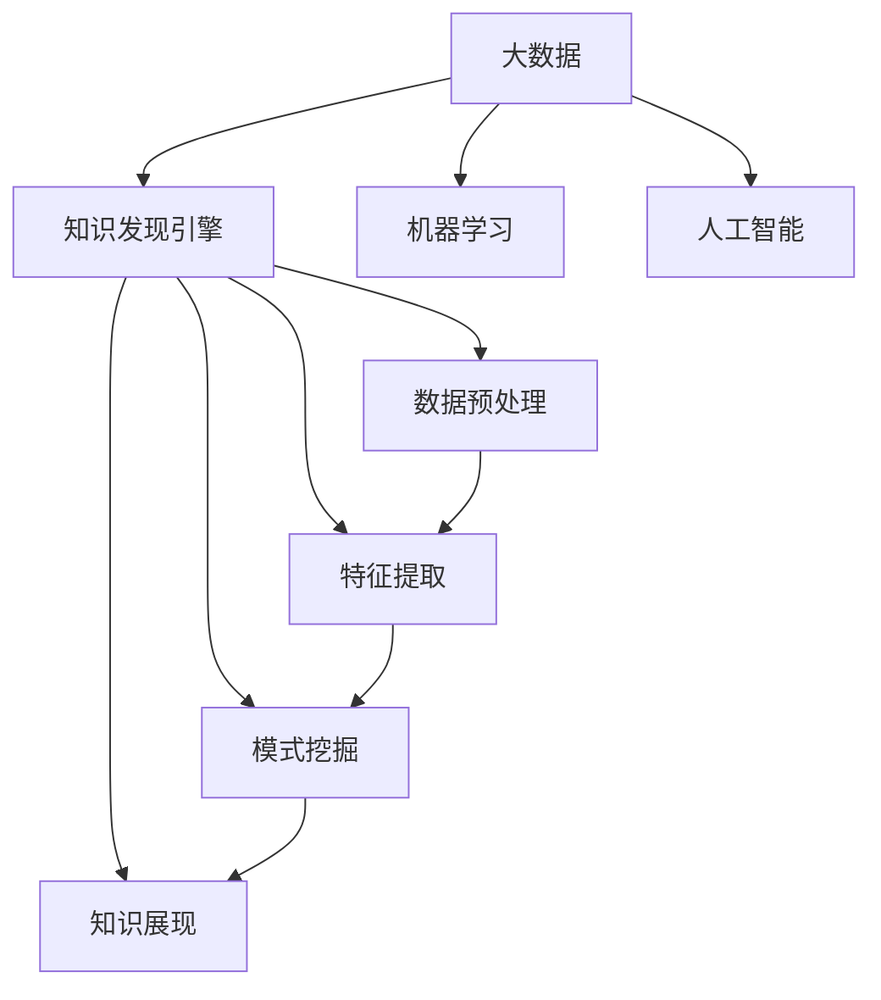

                 

# 知识发现引擎：推动科学研究的智慧之旅

> 关键词：知识发现，智慧之旅，科学，大数据，人工智能，机器学习，算法，科学工程

## 1. 背景介绍

在数据爆炸的时代，如何从海量数据中提取有价值的知识，揭示数据背后的潜在规律，成为科研和应用中迫切需要解决的问题。传统的统计分析和数据挖掘方法虽然能够处理部分问题，但对于复杂多变的现实世界，往往难以全面解答。知识发现(Knowledge Discovery, KDD)作为一种新兴的跨学科研究领域，通过将大数据分析、人工智能、机器学习等技术手段相结合，为数据驱动的科学研究提供了新范式。

知识发现引擎(Knowledge Discovery Engine, KDE)作为知识发现领域的关键工具，能够自动化、智能化地从结构化和非结构化数据中挖掘出潜在知识，帮助科研人员更好地理解数据、发现规律、预测未来。本文将系统阐述知识发现引擎的工作原理、核心算法、应用场景以及未来发展趋势，并结合实际案例，展示其推动科学研究智慧之旅的力量。

## 2. 核心概念与联系

### 2.1 核心概念概述

为更好地理解知识发现引擎，本节将介绍几个关键核心概念及其联系：

- **知识发现(Knowledge Discovery)**：指从数据中提取知识、发现模式和规律的过程。知识发现过程需要多学科知识和技术手段的协同工作，包括统计分析、数据挖掘、机器学习等。

- **知识发现引擎(Knowledge Discovery Engine, KDE)**：一种集成了多种数据分析技术和算法，能够自动化、智能化地从数据中挖掘知识的软件系统。KDE通常由数据预处理、特征提取、模式挖掘、知识展现等模块组成。

- **大数据(Big Data)**：指数据量巨大、数据种类繁多、数据来源广泛、数据生成速度快、数据存储分散的复杂数据集合。大数据技术的发展为知识发现提供了前所未有的数据基础。

- **机器学习(Machine Learning, ML)**：一种通过算法让机器自动学习数据模式和规律，并能够将学到的知识应用于新数据的技术。机器学习是知识发现的重要技术支撑。

- **人工智能(Artificial Intelligence, AI)**：一种通过模拟人类智能行为，使机器能够执行复杂任务的技术。人工智能为知识发现提供了多模态数据处理和智能算法支持。

这些概念之间的逻辑关系可以通过以下Mermaid流程图来展示：



这个流程图展示了大数据、机器学习和人工智能与知识发现引擎之间的关系：

1. 大数据为知识发现提供了数据基础。
2. 机器学习和人工智能为知识发现提供了技术和算法支持。
3. 知识发现引擎通过数据预处理、特征提取、模式挖掘等模块，将多源异构的数据转化为可理解的智能知识。
4. 智能知识通过知识展现模块，可以直观地呈现在科研人员面前。

## 3. 核心算法原理 & 具体操作步骤

### 3.1 算法原理概述

知识发现引擎的核心算法一般包括数据预处理、特征提取、模式挖掘和知识展现等。下面我们将分别介绍这些算法的工作原理：

#### 3.1.1 数据预处理

数据预处理是知识发现引擎的第一步，主要任务是对原始数据进行清洗、转换、归一化等操作，为后续的特征提取和模式挖掘做准备。数据预处理包括以下几个步骤：

- 数据清洗：去除重复数据、缺失值、噪声等，确保数据质量。
- 数据转换：将数据格式统一为标准格式，如将非结构化文本数据转换为向量表示。
- 数据归一化：对数据进行缩放，避免不同特征之间的量纲差异过大，影响后续计算。

#### 3.1.2 特征提取

特征提取是将原始数据转化为可用于模型训练或知识发现的形式。特征提取过程需要选择合适的特征表示方法，常见的有词袋模型、TF-IDF、主成分分析(PCA)、潜在语义分析(LSA)等。

#### 3.1.3 模式挖掘

模式挖掘是知识发现引擎的核心部分，旨在从数据中挖掘出潜在的规律和模式。模式挖掘算法可以分为有监督学习和无监督学习两大类：

- 有监督学习：基于已标注数据，通过机器学习算法训练模型，预测新数据的模式。
- 无监督学习：基于未标注数据，通过聚类、关联规则、深度学习等算法，发现数据中的内在结构。

#### 3.1.4 知识展现

知识展现是将挖掘出的知识转化为易于理解和应用的形式。知识展现通常包括可视化和报告生成两个步骤：

- 可视化：将知识以图形、图表、表格等形式呈现，方便用户直观理解。
- 报告生成：自动生成数据挖掘报告，帮助用户总结和呈现发现的知识。

### 3.2 算法步骤详解

以下我们将详细介绍知识发现引擎的完整操作步骤：

#### 3.2.1 数据收集与预处理

1. 收集数据：从不同来源收集结构化和非结构化数据，如日志、传感器数据、文本、图像等。
2. 数据清洗：去除重复数据、噪声、缺失值等，确保数据质量。
3. 数据转换：将数据格式统一为标准格式，如将文本数据转换为向量表示。
4. 数据归一化：对数据进行缩放，避免不同特征之间的量纲差异过大，影响后续计算。

#### 3.2.2 特征提取

1. 特征选择：选择对模型有较大影响的特征。
2. 特征工程：构建新的特征表示，如词袋模型、TF-IDF、主成分分析(PCA)、潜在语义分析(LSA)等。
3. 特征选择：选择最优的特征表示，进行特征降维。

#### 3.2.3 模式挖掘

1. 算法选择：选择适合的机器学习算法，如决策树、支持向量机(SVM)、神经网络、聚类算法、关联规则算法等。
2. 模型训练：在标注数据上训练模型，调整算法参数。
3. 模型评估：在验证集上评估模型性能，选择最优模型。

#### 3.2.4 知识展现

1. 可视化：将挖掘出的知识以图形、图表、表格等形式呈现。
2. 报告生成：自动生成数据挖掘报告，帮助用户总结和呈现发现的知识。

### 3.3 算法优缺点

知识发现引擎的优点包括：

- 自动化：自动化的数据预处理和特征提取过程，减少了人工干预。
- 智能化：通过模式挖掘算法，发现数据中的潜在规律和模式。
- 高效性：采用并行计算和分布式处理技术，提高了数据处理和挖掘效率。
- 可扩展性：支持多源异构数据融合，支持大规模数据的处理和分析。

然而，知识发现引擎也存在一些缺点：

- 数据依赖：需要大量高质量标注数据，否则算法效果难以保证。
- 算法复杂：选择和调整算法参数，需要一定的专业知识和经验。
- 解释性不足：许多算法过程和结果缺乏直观解释，难以理解。
- 技术门槛高：需要掌握多种数据分析和编程技能，对用户要求较高。

### 3.4 算法应用领域

知识发现引擎在多个领域得到了广泛应用，以下是几个典型的应用场景：

#### 3.4.1 金融领域

知识发现引擎在金融领域的应用主要包括风险评估、投资分析、信用评分等。通过挖掘历史交易数据和市场数据，可以发现潜在的风险因素和投资机会，为金融机构提供决策支持。

#### 3.4.2 医疗领域

知识发现引擎在医疗领域的应用主要包括疾病诊断、个性化治疗、药物研发等。通过分析患者数据和医学文献，可以发现新的疾病模式和治疗方案，提高医疗服务水平。

#### 3.4.3 电商领域

知识发现引擎在电商领域的应用主要包括推荐系统、库存管理、顾客行为分析等。通过分析用户行为数据和交易记录，可以发现用户偏好和购买趋势，为电商平台提供个性化推荐和库存优化方案。

#### 3.4.4 社交媒体

知识发现引擎在社交媒体领域的应用主要包括情感分析、舆情监测、用户行为预测等。通过分析用户评论和社交动态，可以发现舆情变化和用户行为模式，为社交媒体平台提供内容推荐和用户管理方案。

## 4. 数学模型和公式 & 详细讲解 & 举例说明

### 4.1 数学模型构建

知识发现引擎的数学模型通常基于机器学习算法构建，包括监督学习和无监督学习两大类。

#### 4.1.1 监督学习

监督学习模型的训练目标是最小化预测错误率，常用的数学模型包括线性回归、逻辑回归、决策树、支持向量机(SVM)、神经网络等。

#### 4.1.2 无监督学习

无监督学习模型通常没有标注数据，需要通过聚类、关联规则、深度学习等算法发现数据中的潜在结构。常用的数学模型包括K-means聚类、关联规则算法、自编码器、神经网络等。

### 4.2 公式推导过程

以下我们以K-means聚类算法为例，介绍无监督学习模型的公式推导过程。

K-means算法是一种常见的聚类算法，用于将数据集划分为多个簇，每个簇内的数据点与簇中心的距离最小。假设数据集 $D$ 包含 $N$ 个样本点 $x_i \in R^d$，簇数为 $K$，簇中心为 $\mu_k$。则K-means算法的目标是最小化每个样本点到其所属簇中心的距离之和，即：

$$
\min_{\mu_1,\mu_2,...,\mu_K} \sum_{i=1}^N \sum_{k=1}^K (x_i - \mu_k)^2
$$

其中 $\mu_k = \frac{1}{|C_k|}\sum_{x_i \in C_k} x_i$，$C_k$ 为第 $k$ 个簇的样本集合。

为了求解上述目标，K-means算法采用迭代过程：

1. 随机初始化簇中心 $\mu_1,\mu_2,...,\mu_K$。
2. 分配每个样本点 $x_i$ 到最近的簇中心 $\mu_k$。
3. 更新每个簇的中心 $\mu_k$ 为该簇内所有样本点的均值。
4. 重复步骤2和3，直到簇中心不再变化，或达到预设的迭代次数。

### 4.3 案例分析与讲解

K-means算法是一种常见的无监督聚类算法，常用于数据挖掘和模式识别领域。以下是使用Python实现K-means算法的案例分析与讲解：

```python
from sklearn.cluster import KMeans
from sklearn.datasets import make_blobs
import matplotlib.pyplot as plt

# 创建数据集
centers = [[1, 1], [-1, -1], [1, -1]]
X, _ = make_blobs(n_samples=300, centers=centers, cluster_std=0.5, random_state=0)

# 创建K-means模型
kmeans = KMeans(n_clusters=3)

# 训练模型
kmeans.fit(X)

# 可视化结果
plt.scatter(X[:, 0], X[:, 1], c=kmeans.labels_, cmap='viridis')
plt.scatter(kmeans.cluster_centers_[:, 0], kmeans.cluster_centers_[:, 1], c='red', marker='x')
plt.title('K-means Clustering')
plt.show()
```

在上述代码中，我们首先使用`make_blobs`函数创建了一个包含3个簇的二维数据集。然后，创建了一个K-means模型，并使用训练集数据拟合模型。最后，使用`plt.scatter`函数可视化聚类结果和簇中心。

通过可视化结果，可以看到K-means算法成功将数据集划分为3个簇，并找到了每个簇的中心。

## 5. 项目实践：代码实例和详细解释说明

### 5.1 开发环境搭建

在进行知识发现引擎项目实践前，我们需要准备好开发环境。以下是使用Python进行项目实践的开发环境配置流程：

1. 安装Python：从官网下载并安装Python，建议安装最新版本。
2. 安装必要的库：使用pip安装必要的库，如Scikit-learn、Pandas、Numpy、Matplotlib等。
3. 搭建环境：可以使用Python自带的Virtual Environment功能，创建虚拟环境，确保项目的隔离性。

### 5.2 源代码详细实现

以下我们将通过一个实际项目，展示如何使用Python进行知识发现引擎的开发和实践。

#### 5.2.1 数据预处理

```python
import pandas as pd
from sklearn.preprocessing import StandardScaler

# 读取数据
data = pd.read_csv('data.csv')

# 数据清洗
# 去除重复数据
data = data.drop_duplicates()

# 去除缺失值
data = data.dropna()

# 数据转换
# 将文本数据转换为数值向量
data['feature'] = data['text'].apply(lambda x: x.split().count())

# 数据归一化
scaler = StandardScaler()
data['feature'] = scaler.fit_transform(data['feature'].values.reshape(-1, 1))
```

在上述代码中，我们首先使用Pandas库读取数据集，并进行数据清洗、转换和归一化。

#### 5.2.2 特征提取

```python
from sklearn.feature_extraction.text import TfidfVectorizer

# 特征提取
vectorizer = TfidfVectorizer()
X = vectorizer.fit_transform(data['text'])
```

在上述代码中，我们使用TfidfVectorizer进行文本特征提取，将文本数据转换为TF-IDF向量表示。

#### 5.2.3 模式挖掘

```python
from sklearn.decomposition import PCA

# 降维
pca = PCA(n_components=2)
X = pca.fit_transform(X)
```

在上述代码中，我们使用PCA进行特征降维，将高维数据转换为二维数据。

#### 5.2.4 知识展现

```python
import matplotlib.pyplot as plt

# 可视化
plt.scatter(X[:, 0], X[:, 1], c=data['label'], cmap='viridis')
plt.title('Data Visualization')
plt.show()
```

在上述代码中，我们使用Matplotlib库可视化降维后的数据，并将标签信息呈现在图中。

### 5.3 代码解读与分析

通过上述代码，我们可以看到知识发现引擎的完整开发流程：

1. 数据预处理：通过去除重复数据、缺失值、转换和归一化等操作，确保数据质量。
2. 特征提取：将文本数据转换为数值向量，方便后续的模型训练。
3. 模式挖掘：使用PCA进行特征降维，简化数据处理和分析。
4. 知识展现：通过可视化手段，直观展示数据集中的模式和规律。

## 6. 实际应用场景

### 6.1 金融风险评估

知识发现引擎在金融领域的重要应用之一是风险评估。金融机构可以通过分析客户的历史交易数据和行为数据，发现潜在的风险因素和信用评分，帮助其进行贷款审批和信用评估。

#### 6.1.1 数据来源

金融机构的客户交易数据、信用记录、社交媒体数据等，可以用于风险评估和信用评分。

#### 6.1.2 数据预处理

- 数据清洗：去除重复数据、缺失值、异常值等，确保数据质量。
- 数据转换：将交易数据、信用记录转换为数值向量，方便后续处理。
- 数据归一化：对数据进行缩放，避免不同特征之间的量纲差异过大。

#### 6.1.3 特征提取

- 特征选择：选择对风险评估有较大影响的特征，如交易金额、还款记录、社交媒体评分等。
- 特征工程：构建新的特征表示，如风险指数、信用评分等。

#### 6.1.4 模式挖掘

- 算法选择：选择适合的机器学习算法，如决策树、逻辑回归、支持向量机(SVM)等。
- 模型训练：在标注数据上训练模型，调整算法参数。
- 模型评估：在验证集上评估模型性能，选择最优模型。

#### 6.1.5 知识展现

- 可视化：将风险评估结果可视化，帮助金融机构直观了解客户的风险状况。
- 报告生成：自动生成风险评估报告，帮助金融机构总结和呈现风险评估结果。

### 6.2 医疗疾病诊断

知识发现引擎在医疗领域的重要应用之一是疾病诊断。医疗机构可以通过分析患者的历史病历和医学文献，发现新的疾病模式和治疗方法，提高诊断准确性和治疗效果。

#### 6.2.1 数据来源

医疗机构的电子病历、医学文献、基因数据等，可以用于疾病诊断和治疗方法的发现。

#### 6.2.2 数据预处理

- 数据清洗：去除重复数据、缺失值、异常值等，确保数据质量。
- 数据转换：将病历数据、医学文献转换为数值向量，方便后续处理。
- 数据归一化：对数据进行缩放，避免不同特征之间的量纲差异过大。

#### 6.2.3 特征提取

- 特征选择：选择对疾病诊断有较大影响的特征，如症状、基因序列、医学图像等。
- 特征工程：构建新的特征表示，如疾病风险指数、治疗效果等。

#### 6.2.4 模式挖掘

- 算法选择：选择适合的机器学习算法，如支持向量机(SVM)、随机森林、深度学习等。
- 模型训练：在标注数据上训练模型，调整算法参数。
- 模型评估：在验证集上评估模型性能，选择最优模型。

#### 6.2.5 知识展现

- 可视化：将疾病诊断结果可视化，帮助医疗机构直观了解患者的疾病状况。
- 报告生成：自动生成疾病诊断报告，帮助医疗机构总结和呈现诊断结果。

### 6.3 电商个性化推荐

知识发现引擎在电商领域的重要应用之一是个性化推荐。电商平台可以通过分析用户的行为数据和购买记录，发现用户的偏好和购买趋势，为其提供个性化的推荐商品。

#### 6.3.1 数据来源

电商平台的销售数据、用户行为数据、商品信息等，可以用于个性化推荐。

#### 6.3.2 数据预处理

- 数据清洗：去除重复数据、缺失值、异常值等，确保数据质量。
- 数据转换：将销售数据、用户行为数据转换为数值向量，方便后续处理。
- 数据归一化：对数据进行缩放，避免不同特征之间的量纲差异过大。

#### 6.3.3 特征提取

- 特征选择：选择对个性化推荐有较大影响的特征，如用户浏览记录、购买记录、商品评价等。
- 特征工程：构建新的特征表示，如用户兴趣向量、商品特征向量等。

#### 6.3.4 模式挖掘

- 算法选择：选择适合的机器学习算法，如协同过滤、矩阵分解、深度学习等。
- 模型训练：在标注数据上训练模型，调整算法参数。
- 模型评估：在验证集上评估模型性能，选择最优模型。

#### 6.3.5 知识展现

- 可视化：将个性化推荐结果可视化，帮助电商平台直观了解用户的推荐效果。
- 报告生成：自动生成个性化推荐报告，帮助电商平台总结和呈现推荐结果。

## 7. 工具和资源推荐

### 7.1 学习资源推荐

为了帮助开发者系统掌握知识发现引擎的理论基础和实践技巧，这里推荐一些优质的学习资源：

1. 《Python数据科学手册》：是一本综合性的数据科学教程，介绍了Python在数据科学中的应用。
2. 《机器学习实战》：是一本实用的机器学习书籍，介绍了多种机器学习算法和实践案例。
3. 《TensorFlow 2.0实战》：是一本TensorFlow实战教程，介绍了TensorFlow在深度学习中的应用。
4. 《Python数据挖掘入门》：是一本数据挖掘入门书籍，介绍了数据挖掘的基本概念和工具。
5. Kaggle：是一个数据科学竞赛平台，提供了丰富的数据集和代码样例，帮助开发者学习数据挖掘和机器学习技术。

通过对这些资源的学习实践，相信你一定能够快速掌握知识发现引擎的理论基础和实践技巧，并用于解决实际的NLP问题。

### 7.2 开发工具推荐

高效的开发离不开优秀的工具支持。以下是几款用于知识发现引擎开发的常用工具：

1. Python：作为数据科学和机器学习的主流语言，Python具有丰富的库和框架支持，是知识发现引擎开发的理想选择。
2. Scikit-learn：一个流行的Python机器学习库，提供了多种常用的机器学习算法和数据预处理工具。
3. Pandas：一个强大的数据处理库，支持多种数据格式和操作。
4. TensorFlow：由Google开发的深度学习框架，支持大规模分布式计算。
5. Kaggle：一个数据科学竞赛平台，提供了丰富的数据集和代码样例，帮助开发者学习数据挖掘和机器学习技术。

合理利用这些工具，可以显著提升知识发现引擎的开发效率，加快创新迭代的步伐。

### 7.3 相关论文推荐

知识发现引擎的研究源于学界的持续研究。以下是几篇奠基性的相关论文，推荐阅读：

1. K-means算法论文：D. Arthur和S. Vassilvitskii在1999年发表的《K-means++：更智能的K-means算法》。
2. 决策树算法论文：J. Ross Quinlan在1986年发表的《基于决策树的预测规则构建》。
3. 随机森林算法论文：L. Breiman在2001年发表的《随机决策森林》。
4. 支持向量机算法论文：C. Cortes和V. Vapnik在1995年发表的《支持向量机学习》。
5. 深度学习算法论文：Y. LeCun、Y. Bengio和G. Hinton在2015年发表的《深度学习》。

这些论文代表了大数据和机器学习领域的发展脉络。通过学习这些前沿成果，可以帮助研究者把握学科前进方向，激发更多的创新灵感。

## 8. 总结：未来发展趋势与挑战

### 8.1 总结

本文对知识发现引擎的工作原理、核心算法、应用场景以及未来发展趋势进行了全面系统的介绍。首先阐述了知识发现引擎在数据驱动科学研究中的重要地位，明确了其自动化、智能化、高效性等特点。其次，从数据预处理、特征提取、模式挖掘和知识展现等角度，详细讲解了知识发现引擎的各个模块。同时，通过多个实际案例，展示了知识发现引擎在金融、医疗、电商等多个领域的应用效果。

通过本文的系统梳理，可以看到，知识发现引擎作为数据驱动科学研究的重要工具，在多个领域展现了强大的应用价值。通过结合大数据、机器学习、人工智能等技术，知识发现引擎能够从海量数据中挖掘出潜在的知识，为科研人员提供决策支持，推动科学研究向智能化、自动化方向发展。未来，伴随技术的不断进步，知识发现引擎必将在科学研究中发挥更加重要的作用。

### 8.2 未来发展趋势

展望未来，知识发现引擎的发展趋势主要体现在以下几个方面：

1. 自动化程度提升：随着AI技术的不断成熟，知识发现引擎的自动化程度将进一步提升，能够自动处理更多的数据预处理和特征提取工作，减少人工干预。
2. 智能化水平提高：知识发现引擎将更加注重对数据内在关系的挖掘，通过深度学习、神经网络等算法，发现更加复杂、多层次的模式和规律。
3. 多源异构数据融合：知识发现引擎将能够处理更多的多源异构数据，融合来自不同渠道和格式的数据，构建更加全面、准确的知识模型。
4. 跨领域应用扩展：知识发现引擎将应用于更多领域，如智能制造、智慧城市、智能交通等，推动各行业数字化、智能化转型。
5. 伦理和隐私保护：知识发现引擎将更加注重数据隐私和安全问题，通过数据匿名化、差分隐私等技术，保护用户隐私。
6. 可解释性和透明性提升：知识发现引擎将更加注重算法的可解释性和透明性，通过解释性模型和可视化手段，帮助用户理解和信任模型结果。

这些趋势展示了知识发现引擎的未来发展方向，为科学研究和技术应用提供了新的机遇和挑战。

### 8.3 面临的挑战

尽管知识发现引擎已经取得了诸多应用成功，但在向更广泛的应用场景中拓展的过程中，仍面临诸多挑战：

1. 数据隐私和安全：知识发现引擎涉及大量敏感数据，如何保护数据隐私和安全，防止数据泄露和滥用，是一个重要挑战。
2. 数据质量和标注数据依赖：知识发现引擎的性能依赖于数据质量和标注数据的数量和质量，如何获取高质量的标注数据，是一个关键问题。
3. 算法复杂性和计算资源：知识发现引擎涉及复杂的算法和大量的计算资源，如何提高算法效率，降低计算成本，是一个重要课题。
4. 模型解释性和透明性：知识发现引擎的模型往往较为复杂，如何提高模型的可解释性和透明性，帮助用户理解和信任模型结果，是一个关键问题。
5. 跨领域应用通用性：知识发现引擎在不同领域的应用中，如何实现模型和算法的通用性，避免对特定领域知识的过度依赖，是一个重要挑战。

### 8.4 研究展望

面对知识发现引擎面临的挑战，未来的研究需要在以下几个方面寻求新的突破：

1. 数据隐私和安全保护：研究数据匿名化、差分隐私等技术，保护用户隐私和数据安全。
2. 高质量标注数据获取：探索无监督学习和半监督学习等方法，降低对标注数据的依赖，提高知识发现的鲁棒性和泛化能力。
3. 算法复杂度和计算资源优化：研究参数高效的算法和计算图优化技术，提高知识发现引擎的计算效率。
4. 模型解释性和透明性提升：研究解释性模型和可视化技术，提升模型的可解释性和透明性。
5. 跨领域应用通用性：研究模型和算法的通用化设计，提高知识发现引擎在不同领域的应用效果。

这些研究方向的探索，必将引领知识发现引擎技术向更高的台阶发展，为科学研究和技术应用提供新的推动力。

## 9. 附录：常见问题与解答

**Q1：知识发现引擎是否适用于所有领域？**

A: 知识发现引擎可以应用于多种领域，但不同领域的数据特点和技术需求各不相同。对于某些特定领域，可能需要结合领域知识进行模型和算法优化，才能获得理想的效果。例如，在医疗领域，需要结合医学知识进行疾病诊断和治疗方法的发现。

**Q2：如何选择适合的知识发现算法？**

A: 选择适合的知识发现算法需要考虑多个因素，如数据类型、数据量、应用需求等。一般而言，无监督学习算法适用于数据量较大、标注数据不足的情况，而监督学习算法适用于数据量较小、标注数据充足的情况。同时，需要根据具体问题和数据特点，选择合适的算法和模型。

**Q3：如何提高知识发现引擎的性能？**

A: 提高知识发现引擎的性能需要从数据、模型和算法等多个方面入手。具体措施包括：
1. 数据清洗和预处理：去除重复数据、缺失值、噪声等，确保数据质量。
2. 特征选择和工程：选择对问题有较大影响的特征，构建新的特征表示。
3. 算法优化和调整：调整算法参数，选择最优模型，提高算法性能。
4. 模型评估和调优：在验证集上评估模型性能，选择最优模型，并进行调优。
5. 参数高效和计算高效：使用参数高效和计算高效的算法和模型，提高知识发现引擎的效率。

这些措施可以帮助开发者优化知识发现引擎的性能，提升其在实际应用中的效果。

---

作者：禅与计算机程序设计艺术 / Zen and the Art of Computer Programming

