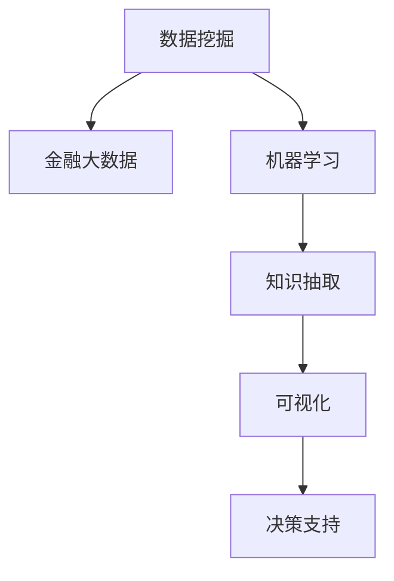

                 

# 知识发现引擎：推动金融行业的智慧转型

## 1. 背景介绍

### 1.1 问题由来

金融行业一直以来都是数据驱动的行业，但传统的金融数据分析和决策支持系统往往基于人工设计和维护，数据处理和分析效率较低，决策支撑的实时性和准确性也难以满足。随着大数据、人工智能等技术的快速发展，金融行业亟需引入新的工具和技术，提升金融分析的智能化水平，推动智慧化转型。

近年来，知识发现引擎（Knowledge Discovery Engine, KDE）作为金融智能分析的重要手段，逐渐受到广泛关注。KDE是一种基于数据挖掘和机器学习的系统，能够从金融交易、客户行为、市场动态等海量数据中自动发现潜在知识，辅助金融决策和风险管理。其核心思想是通过自动化、智能化的手段，从复杂多变的金融数据中提取有价值的知识，为金融机构提供数据驱动的决策支持。

### 1.2 问题核心关键点

知识发现引擎的核心在于如何高效地从金融数据中发现有用知识，并转化为可解释的业务洞察。其关键点包括：

- 数据集成与预处理：整合异构数据源，进行清洗、去重、归一化等预处理，为后续分析奠定基础。
- 特征工程与模型构建：设计合适的特征表示和模型结构，构建有效的知识发现算法。
- 知识抽取与解释：通过自动化挖掘和解释算法，发现有用的业务洞察和规则，提供决策支持。
- 可视化与报告：将发现的知识可视化，生成直观的报告和仪表盘，方便业务用户理解和使用。

这些关键点共同构成了知识发现引擎的应用框架，使其能够在各种金融场景中发挥强大的数据驱动作用。

## 2. 核心概念与联系

### 2.1 核心概念概述

为更好地理解知识发现引擎在金融行业的智慧转型中的作用，本节将介绍几个密切相关的核心概念：

- 数据挖掘(Data Mining)：从金融数据中自动发现有用模式和知识的过程。
- 机器学习(Machine Learning)：通过算法自动优化模型参数，实现对金融数据的自动预测和分类。
- 金融大数据(Financial Big Data)：金融领域产生的海量、异构、非结构化数据，如交易数据、客户数据、市场数据等。
- 知识抽取(Knowledge Extraction)：从金融数据中提取出有用的业务洞察、规则和模式，转化为可解释的业务知识。
- 可视化(Visualization)：将发现的知识通过图形、图表等形式可视化展示，帮助业务用户理解和应用。
- 决策支持(Decision Support)：将发现的知识转化为决策建议，辅助金融机构的战略规划和风险管理。

这些核心概念之间的逻辑关系可以通过以下Mermaid流程图来展示：



这个流程图展示的数据挖掘、金融大数据、机器学习、知识抽取、可视化、决策支持之间的逻辑关系：

1. 金融大数据为数据挖掘和机器学习提供了丰富的数据来源。
2. 机器学习对金融大数据进行处理和建模，提取知识。
3. 知识抽取将机器学习提取的知识进一步转化成可解释的业务洞察。
4. 可视化将知识抽取的结果进行直观展示，方便业务用户理解。
5. 决策支持基于可视化的知识，辅助金融机构做出更加科学的决策。

## 3. 核心算法原理 & 具体操作步骤
### 3.1 算法原理概述

知识发现引擎的核心算法通常包括以下几个关键步骤：

1. 数据预处理：对金融数据进行清洗、去重、归一化等预处理，为后续分析奠定基础。
2. 特征提取：设计合适的特征表示，提取有用的特征变量，为机器学习建模做准备。
3. 模型训练：选择合适的机器学习模型，使用金融大数据进行训练，提取有价值的知识。
4. 知识抽取：通过自动化挖掘算法，发现有用的业务洞察和规则。
5. 知识解释：将发现的知识转化为可解释的业务洞察，辅助决策支持。
6. 可视化：将发现的知识进行可视化展示，方便业务用户理解。

基于以上步骤，知识发现引擎能够从金融数据中发现有用的知识，转化为可解释的业务洞察，辅助金融决策。

### 3.2 算法步骤详解

以下是知识发现引擎的详细操作步骤：

**Step 1: 数据预处理**

数据预处理是知识发现的首要步骤。其主要任务包括：

1. 数据清洗：去除缺失值、异常值和重复数据。
2. 数据归一化：将不同范围的数据归一化到[0,1]区间。
3. 数据转换：将非结构化数据转换为结构化数据，如日期时间戳、数字特征等。
4. 数据集成：整合来自不同数据源的数据，形成一致的数据视图。

**Step 2: 特征工程**

特征工程是知识发现的另一个关键环节。其主要任务包括：

1. 特征提取：设计合适的特征表示，提取有用的特征变量，如时间特征、金融指标等。
2. 特征选择：选择最相关的特征，避免过拟合。
3. 特征合成：将多个特征进行组合，生成新的特征变量，提高模型表现。
4. 特征降维：通过PCA、LDA等方法，降低特征维度，提高计算效率。

**Step 3: 模型训练**

选择合适的机器学习模型进行训练，提取有价值的知识。常见的模型包括：

1. 线性回归：预测金融指标，如股票价格、收益率等。
2. 逻辑回归：分类金融事件，如违约、欺诈等。
3. 决策树：对金融事件进行决策，如信用评分、风险评估等。
4. 随机森林：提高模型的泛化能力和准确性。
5. 神经网络：处理复杂的金融数据，提取高级特征。

**Step 4: 知识抽取**

知识抽取是知识发现引擎的核心步骤。其主要任务包括：

1. 关联规则学习：发现金融数据中的相关关系，如市场波动、客户行为等。
2. 序列模式挖掘：发现金融数据中的序列模式，如交易模式、市场趋势等。
3. 分类聚类：对金融数据进行分类和聚类，发现潜在的业务规则。

**Step 5: 知识解释**

将发现的知识转化为可解释的业务洞察，辅助决策支持。常见的知识解释方法包括：

1. 规则可视化：将规则以图形形式展示，方便业务用户理解。
2. 热力图：显示高频交易的地理位置和时间段。
3. 时间序列分析：分析时间序列数据，发现趋势和周期性。

**Step 6: 可视化**

将发现的知识进行可视化展示，方便业务用户理解。常见的可视化方法包括：

1. 仪表盘：展示关键指标和业务洞察。
2. 散点图：展示不同变量之间的关系。
3. 柱状图：展示分类数据的分布。

**Step 7: 决策支持**

基于可视化的知识，辅助金融机构做出更加科学的决策。常见的决策支持方法包括：

1. 业务报告：生成详细的业务报告，提供决策依据。
2. 自动预警：基于发现的知识，自动发送预警信息，辅助实时决策。
3. 风险评估：评估不同业务场景下的风险，提供风险管理建议。

### 3.3 算法优缺点

知识发现引擎具有以下优点：

1. 高效性：能够自动处理大规模金融数据，发现有用的知识，提高决策效率。
2. 自动化：自动化数据处理和分析，减少人工干预，提高数据准确性。
3. 可解释性：将发现的知识转化为可解释的业务洞察，辅助决策支持。
4. 实时性：能够实时处理金融数据，提供动态决策支持。
5. 多模态：支持多模态数据的整合，提升分析的全面性。

但同时也存在一些缺点：

1. 数据质量：对数据质量要求较高，需要高质量的标注数据和预处理流程。
2. 模型复杂性：需要选择合适的模型和算法，设计合适的特征表示，有一定的技术门槛。
3. 算法局限性：不同算法适用于不同的数据和问题，选择合适的算法需要经验积累。
4. 可视化复杂性：如何将复杂的数据转化为易于理解的可视化结果，需要设计合适的展示方式。

尽管存在这些局限性，但知识发现引擎在金融行业的智慧转型中具有巨大的潜力，能够显著提升金融分析的效率和准确性。

### 3.4 算法应用领域

知识发现引擎在金融行业的应用场景十分广泛，涵盖了金融分析、风险管理、客户行为分析等多个领域。

**金融分析**

通过知识发现引擎，金融机构可以从海量金融数据中发现有用的业务洞察，辅助金融分析决策。例如：

1. 市场分析：自动发现市场波动趋势和异常情况，提供市场分析报告。
2. 交易分析：分析高频交易和异常交易，发现潜在的风险和机会。
3. 信用分析：评估客户的信用状况，识别潜在的违约风险。

**风险管理**

知识发现引擎能够从金融数据中提取风险信息，辅助金融机构进行风险管理。例如：

1. 风险评估：评估不同业务场景下的风险，提供风险预警和控制建议。
2. 欺诈检测：自动检测欺诈行为，提高风险防范能力。
3. 违约预测：预测客户的违约风险，提供风险管理决策依据。

**客户行为分析**

通过知识发现引擎，金融机构可以深入了解客户行为和需求，提供个性化的金融服务。例如：

1. 客户画像：构建客户的动态画像，了解客户的需求和偏好。
2. 产品推荐：推荐适合客户的金融产品和服务，提升客户满意度。
3. 行为预测：预测客户的未来行为，提供精准的客户服务。

## 4. 数学模型和公式 & 详细讲解 & 举例说明
### 4.1 数学模型构建

知识发现引擎通常基于以下数学模型构建：

1. 线性回归模型：

$$
y = \beta_0 + \beta_1x_1 + \beta_2x_2 + ... + \beta_nx_n + \epsilon
$$

其中 $y$ 为预测值，$x_1, x_2, ..., x_n$ 为特征变量，$\beta_0, \beta_1, ..., \beta_n$ 为模型参数，$\epsilon$ 为误差项。

2. 决策树模型：

$$
DecisionTree(x) = \left\{\begin{array}{ll}
\text{LeafNode}, & \text{if} \space x \in \text{LeafNode} \\
DecisionTree(\text{SplitFeature}), & \text{if} \space x \in \text{SplitFeature}
\end{array}\right.
$$

其中 $DecisionTree(x)$ 为决策树模型，$x$ 为输入数据，SplitFeature 为分割特征，LeafNode 为叶子节点。

3. 随机森林模型：

$$
RandomForest(x) = \frac{1}{N} \sum_{i=1}^N DecisionTree_i(x)
$$

其中 $RandomForest(x)$ 为随机森林模型，$N$ 为决策树的数目，$DecisionTree_i(x)$ 为第 $i$ 棵决策树模型。

### 4.2 公式推导过程

以下我们以线性回归模型为例，推导其公式及其梯度计算。

假设模型 $y = \beta_0 + \beta_1x_1 + \beta_2x_2 + ... + \beta_nx_n + \epsilon$，其中 $y$ 为预测值，$x_1, x_2, ..., x_n$ 为特征变量，$\beta_0, \beta_1, ..., \beta_n$ 为模型参数，$\epsilon$ 为误差项。

假设已知训练集 $(x_i, y_i)$，$i=1,...,m$，其中 $m$ 为样本数目。最小二乘法的目标是最小化损失函数：

$$
\min_{\beta_0, \beta_1, ..., \beta_n} \sum_{i=1}^m (y_i - \hat{y}_i)^2
$$

其中 $\hat{y}_i = \beta_0 + \beta_1x_{i1} + \beta_2x_{i2} + ... + \beta_nx_{in}$。

根据梯度下降算法，求解 $\beta_0, \beta_1, ..., \beta_n$ 的更新公式为：

$$
\beta_j \leftarrow \beta_j - \eta \frac{2}{m} \sum_{i=1}^m (y_i - \hat{y}_i)x_{ij}
$$

其中 $\eta$ 为学习率，$x_{ij}$ 为第 $i$ 个样本的第 $j$ 个特征变量。

### 4.3 案例分析与讲解

假设我们有一个股票市场的预测模型，使用线性回归模型进行预测。模型接收输入 $x_1$（收盘价）、$x_2$（成交量）等特征变量，输出股票价格预测值 $y$。我们可以使用以上公式进行模型训练和预测。

首先，使用最小二乘法进行模型训练，得到模型参数 $\beta_0, \beta_1, ..., \beta_n$。然后，使用测试集数据进行预测，得到预测结果 $\hat{y}_i$。最后，将预测结果与实际值比较，计算误差，进行模型评估。

## 5. 项目实践：代码实例和详细解释说明
### 5.1 开发环境搭建

在进行知识发现引擎实践前，我们需要准备好开发环境。以下是使用Python进行Scikit-learn开发的环境配置流程：

1. 安装Anaconda：从官网下载并安装Anaconda，用于创建独立的Python环境。

2. 创建并激活虚拟环境：
```bash
conda create -n sklearn-env python=3.8 
conda activate sklearn-env
```

3. 安装Scikit-learn：
```bash
pip install scikit-learn
```

4. 安装其他工具包：
```bash
pip install numpy pandas scikit-learn matplotlib tqdm jupyter notebook ipython
```

完成上述步骤后，即可在`sklearn-env`环境中开始知识发现引擎实践。

### 5.2 源代码详细实现

以下是使用Scikit-learn库进行金融数据分析的PyTorch代码实现。

```python
import numpy as np
import pandas as pd
from sklearn.model_selection import train_test_split
from sklearn.linear_model import LinearRegression
from sklearn.tree import DecisionTreeRegressor
from sklearn.ensemble import RandomForestRegressor
from sklearn.metrics import mean_squared_error

# 加载数据
data = pd.read_csv('financial_data.csv')

# 数据预处理
# 数据清洗
data = data.dropna()

# 数据归一化
data = (data - data.mean()) / data.std()

# 特征选择
X = data[['price', 'volume', 'open', 'high', 'low']]
y = data['close']

# 划分训练集和测试集
X_train, X_test, y_train, y_test = train_test_split(X, y, test_size=0.2, random_state=42)

# 模型训练
# 线性回归
lr = LinearRegression()
lr.fit(X_train, y_train)

# 决策树
dt = DecisionTreeRegressor()
dt.fit(X_train, y_train)

# 随机森林
rf = RandomForestRegressor()
rf.fit(X_train, y_train)

# 预测
lr_pred = lr.predict(X_test)
dt_pred = dt.predict(X_test)
rf_pred = rf.predict(X_test)

# 评估
mse_lr = mean_squared_error(y_test, lr_pred)
mse_dt = mean_squared_error(y_test, dt_pred)
mse_rf = mean_squared_error(y_test, rf_pred)

print(f"Linear Regression MSE: {mse_lr}")
print(f"Decision Tree MSE: {mse_dt}")
print(f"Random Forest MSE: {mse_rf}")
```

以上是使用Scikit-learn库进行金融数据分析的完整代码实现。可以看到，通过简单的代码，就可以实现线性回归、决策树、随机森林等模型的训练和预测。

### 5.3 代码解读与分析

让我们再详细解读一下关键代码的实现细节：

**数据预处理**

数据预处理是知识发现引擎的首要步骤。其主要任务包括：

1. 数据清洗：使用 `dropna()` 方法去除缺失值。
2. 数据归一化：使用 `data.mean()` 和 `data.std()` 方法计算均值和标准差，再将数据归一化到[0,1]区间。

**特征选择**

特征选择是知识发现的另一个关键环节。其主要任务包括：

1. 特征提取：使用 `X = data[['price', 'volume', 'open', 'high', 'low']]` 方法，提取有用的特征变量。
2. 划分训练集和测试集：使用 `train_test_split()` 方法，将数据划分为训练集和测试集。

**模型训练**

选择合适的机器学习模型进行训练，提取有价值的知识。常见的模型包括：

1. 线性回归：使用 `LinearRegression()` 方法，进行线性回归模型训练。
2. 决策树：使用 `DecisionTreeRegressor()` 方法，进行决策树模型训练。
3. 随机森林：使用 `RandomForestRegressor()` 方法，进行随机森林模型训练。

**预测**

使用训练好的模型对测试集数据进行预测，得到预测结果。

**评估**

使用均方误差（MSE）等指标对预测结果进行评估。

通过以上步骤，可以高效地从金融数据中发现有用的知识，转化为可解释的业务洞察，辅助金融决策。

## 6. 实际应用场景

### 6.1 金融风险管理

金融风险管理是知识发现引擎的重要应用场景之一。通过知识发现引擎，金融机构可以自动发现风险信号，提供实时风险预警和控制建议。例如：

1. 信用风险评估：评估客户的信用状况，识别潜在的违约风险。
2. 市场风险监控：自动监控市场波动，发现异常情况，提供风险预警。
3. 欺诈检测：自动检测欺诈行为，提高风险防范能力。

### 6.2 客户行为分析

客户行为分析是知识发现引擎的另一个重要应用场景。通过知识发现引擎，金融机构可以深入了解客户行为和需求，提供个性化的金融服务。例如：

1. 客户画像：构建客户的动态画像，了解客户的需求和偏好。
2. 产品推荐：推荐适合客户的金融产品和服务，提升客户满意度。
3. 行为预测：预测客户的未来行为，提供精准的客户服务。

### 6.3 市场分析

市场分析是知识发现引擎的重要应用场景之一。通过知识发现引擎，金融机构可以自动发现市场波动趋势和异常情况，提供市场分析报告。例如：

1. 市场趋势分析：分析市场波动趋势，发现潜在的投资机会。
2. 异常事件监控：自动监控市场异常事件，提供事件报告。
3. 交易行为分析：分析高频交易和异常交易，发现潜在的风险和机会。

### 6.4 未来应用展望

随着知识发现引擎的不断演进，其在金融行业的智慧转型中将发挥更大的作用。未来知识发现引擎的发展趋势包括：

1. 多模态融合：支持多模态数据的整合，提升分析的全面性。
2. 实时性增强：实现实时处理金融数据，提供动态决策支持。
3. 自动化提升：进一步自动化数据处理和分析，减少人工干预。
4. 知识图谱：构建金融知识图谱，提供更全面的业务洞察。
5. 算法优化：优化算法性能，提高预测准确性和效率。

知识发现引擎将不断进化，为金融行业提供更加智能化、全面化的决策支持，推动智慧化转型。

## 7. 工具和资源推荐
### 7.1 学习资源推荐

为了帮助开发者系统掌握知识发现引擎的理论基础和实践技巧，这里推荐一些优质的学习资源：

1. 《Python机器学习》（原书第2版）：作者 Sebastian Raschka，系统讲解了机器学习在Python中的应用，包括数据预处理、特征工程、模型选择等。

2. 《机器学习实战》：作者 Peter Harrington，提供了大量实战案例，帮助读者通过代码实践掌握机器学习技术。

3. 《深度学习》（Goodfellow, Bengio & Courville著）：详细介绍了深度学习的基本概念、算法和应用，包括卷积神经网络、循环神经网络等。

4. 《TensorFlow实战》：作者 Adit Deshpande，系统讲解了TensorFlow框架的使用方法，包括模型构建、训练和优化等。

5. Kaggle机器学习竞赛平台：提供大量金融数据集和机器学习竞赛任务，帮助开发者实践和提高技能。

通过学习这些资源，相信你一定能够快速掌握知识发现引擎的理论基础和实践技巧，并用于解决实际的金融问题。

### 7.2 开发工具推荐

高效的开发离不开优秀的工具支持。以下是几款用于知识发现引擎开发的常用工具：

1. Python：基于Python的机器学习库Scikit-learn、TensorFlow等，支持丰富的机器学习算法和工具。
2. Jupyter Notebook：支持交互式编程和数据可视化，方便开发者进行模型训练和调试。
3. R：基于R语言的机器学习库，支持丰富的数据处理和可视化工具。
4. Tableau：支持多维数据分析和可视化，帮助业务用户理解业务洞察。
5. Power BI：支持多源数据整合和可视化，支持实时数据分析。

合理利用这些工具，可以显著提升知识发现引擎的开发效率，加快创新迭代的步伐。

### 7.3 相关论文推荐

知识发现引擎的发展离不开学界的持续研究。以下是几篇奠基性的相关论文，推荐阅读：

1. "Knowledge Discovery in Databases"：Jaroslaw Karypis，介绍了知识发现引擎的基本概念和算法。
2. "The Elements of Statistical Learning"：Tibshirani, Hastie & Friedman，介绍了机器学习的基本概念和算法。
3. "Machine Learning: A Probabilistic Perspective"：Kevin P. Murphy，介绍了机器学习的基本概念和算法，重点介绍了贝叶斯方法。
4. "Deep Learning"：Ian Goodfellow, Yoshua Bengio & Aaron Courville，介绍了深度学习的基本概念和算法，包括卷积神经网络、循环神经网络等。

这些论文代表了大数据和机器学习技术的发展脉络，通过学习这些前沿成果，可以帮助研究者把握学科前进方向，激发更多的创新灵感。

## 8. 总结：未来发展趋势与挑战

### 8.1 总结

本文对知识发现引擎在金融行业的智慧转型中的作用进行了全面系统的介绍。首先阐述了知识发现引擎的数据预处理、特征工程、模型训练、知识抽取、知识解释、可视化、决策支持等核心步骤，明确了知识发现引擎的应用框架。其次，从原理到实践，详细讲解了知识发现引擎的数学模型和关键算法，给出了金融数据分析的完整代码实例。同时，本文还广泛探讨了知识发现引擎在金融风险管理、客户行为分析、市场分析等多个领域的实际应用，展示了知识发现引擎的巨大潜力。最后，本文精选了知识发现引擎的学习资源、开发工具和相关论文，力求为读者提供全方位的技术指引。

通过本文的系统梳理，可以看到，知识发现引擎在金融行业的智慧转型中具有重要的应用价值。其高效、自动化、可解释性等特点，能够显著提升金融分析的效率和准确性，为金融机构提供数据驱动的决策支持。未来，随着知识发现引擎技术的不断发展，其在金融行业的应用前景将更加广阔，将进一步推动金融行业的智能化和智慧化转型。

### 8.2 未来发展趋势

展望未来，知识发现引擎的发展趋势包括：

1. 多模态融合：支持多模态数据的整合，提升分析的全面性。
2. 实时性增强：实现实时处理金融数据，提供动态决策支持。
3. 自动化提升：进一步自动化数据处理和分析，减少人工干预。
4. 知识图谱：构建金融知识图谱，提供更全面的业务洞察。
5. 算法优化：优化算法性能，提高预测准确性和效率。

知识发现引擎将不断进化，为金融行业提供更加智能化、全面化的决策支持，推动智慧化转型。

### 8.3 面临的挑战

尽管知识发现引擎已经取得了瞩目成就，但在迈向更加智能化、普适化应用的过程中，它仍面临诸多挑战：

1. 数据质量：对数据质量要求较高，需要高质量的标注数据和预处理流程。
2. 模型复杂性：需要选择合适的模型和算法，设计合适的特征表示，有一定的技术门槛。
3. 算法局限性：不同算法适用于不同的数据和问题，选择合适的算法需要经验积累。
4. 可视化复杂性：如何将复杂的数据转化为易于理解的可视化结果，需要设计合适的展示方式。
5. 业务集成：知识发现引擎的输出结果需要与业务系统进行集成，需要考虑业务需求和接口设计。

这些挑战需要进一步研究和解决，以充分发挥知识发现引擎在金融行业的智慧转型中的作用。

### 8.4 研究展望

面向未来，知识发现引擎的研究方向包括：

1. 深度学习应用：将深度学习技术引入知识发现引擎，提升模型的准确性和泛化能力。
2. 自动机器学习：开发自动机器学习工具，自动选择最优模型和参数，降低技术门槛。
3. 可解释性增强：增强模型的可解释性，帮助业务用户理解模型的决策过程。
4. 多源数据融合：整合多种数据源，提升分析的全面性和准确性。
5. 实时数据处理：实现实时数据处理和分析，提升决策的及时性。

这些研究方向将进一步推动知识发现引擎的发展，为金融行业提供更加智能化、全面的决策支持，推动智慧化转型。

## 9. 附录：常见问题与解答

**Q1：知识发现引擎是否适用于所有金融数据？**

A: 知识发现引擎在大多数金融数据上都能取得不错的效果，特别是对于有结构化和可量化的数据。但对于一些非常规数据和半结构化数据，如自然语言文本、非结构化数据等，需要额外的数据预处理和特征工程。

**Q2：如何选择最适合的知识发现引擎算法？**

A: 选择最适合的知识发现引擎算法需要考虑以下几个因素：
1. 数据类型：选择适合数据类型的算法，如线性回归、决策树、随机森林等。
2. 问题类型：选择适合问题类型的算法，如回归、分类、聚类等。
3. 数据规模：选择适合数据规模的算法，如小规模数据可以使用逻辑回归，大规模数据可以使用随机森林等。

**Q3：知识发现引擎的输出结果如何解释？**

A: 知识发现引擎的输出结果通常需要结合业务知识进行解释。常见的解释方法包括：
1. 规则可视化：将规则以图形形式展示，方便业务用户理解。
2. 热力图：显示高频交易的地理位置和时间段。
3. 时间序列分析：分析时间序列数据，发现趋势和周期性。

通过以上步骤，可以高效地从金融数据中发现有用的知识，转化为可解释的业务洞察，辅助金融决策。

**Q4：知识发现引擎在实际应用中面临哪些挑战？**

A: 知识发现引擎在实际应用中面临以下挑战：
1. 数据质量：对数据质量要求较高，需要高质量的标注数据和预处理流程。
2. 模型复杂性：需要选择合适的模型和算法，设计合适的特征表示，有一定的技术门槛。
3. 算法局限性：不同算法适用于不同的数据和问题，选择合适的算法需要经验积累。
4. 可视化复杂性：如何将复杂的数据转化为易于理解的可视化结果，需要设计合适的展示方式。
5. 业务集成：知识发现引擎的输出结果需要与业务系统进行集成，需要考虑业务需求和接口设计。

这些挑战需要进一步研究和解决，以充分发挥知识发现引擎在金融行业的智慧转型中的作用。

---

作者：禅与计算机程序设计艺术 / Zen and the Art of Computer Programming

