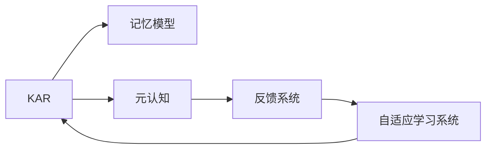

                 

# 知识吸收率:衡量学习效果的关键指标

> 关键词：知识吸收率, 学习效果, 记忆模型, 元认知, 反馈系统

## 1. 背景介绍

### 1.1 问题由来

在信息化和知识爆炸的时代，终身学习成为现代人生活的一部分。在线教育、自学习平台、知识检索工具等纷纷涌现，使得获取知识变得前所未有的便捷。然而，学习效果的差异却日益凸显，同样的学习投入，不同人的收获却截然不同。

如何在技术层面精准衡量一个人的学习效果，并进一步优化学习策略，提高学习效率，成为迫切需要解决的问题。知识吸收率（Knowledge Absorption Rate, KAR）正是在这种背景下提出的一个衡量学习效果的关键指标。

### 1.2 问题核心关键点

知识吸收率是指个体在学习过程中，对所学知识的掌握程度，即新知识的存储和应用能力。这一指标不仅衡量了学习者对知识内容的记忆水平，还反映了其理解、应用和创新的能力。通过对知识吸收率的深入研究和精准测量，可以设计出更加个性化、高效的学习方案，指导学习者不断优化学习过程，从而提升学习效率和效果。

## 2. 核心概念与联系

### 2.1 核心概念概述

为更好地理解知识吸收率，我们需要介绍几个核心概念及其相互关系：

- **知识吸收率(Knowledge Absorption Rate, KAR)**：衡量个体学习过程中对新知识的掌握程度，包括记忆、理解、应用和创新等多个方面。
- **记忆模型(Memory Model)**：描述了知识在个体大脑中存储和提取的过程，包括短时记忆和长时记忆。
- **元认知(Metacognition)**：个体对自己认知过程的意识与控制，包括自我监控、自我评价和自我调节。
- **反馈系统(Feedback System)**：通过学习者对自己学习效果的反馈，不断调整学习策略，以达到最佳学习效果。
- **自适应学习系统(Adaptive Learning System)**：根据学习者的知识吸收率，自动调整学习内容和难度，从而提高学习效果。

这些核心概念之间的联系可以通过以下Mermaid流程图来展示：



该流程图展示了知识吸收率如何通过记忆模型、元认知、反馈系统和自适应学习系统等多方面因素，影响学习效果，最终形成一个闭环系统，不断优化学习过程。

## 3. 核心算法原理 & 具体操作步骤
### 3.1 算法原理概述

知识吸收率的计算可以分为两个部分：知识记忆的衡量和知识应用的评估。知识记忆主要通过测试和记忆模型评估，而知识应用则通过任务完成情况和元认知反馈进行评估。

### 3.2 算法步骤详解

**Step 1: 知识记忆的衡量**

- **记忆模型构建**：使用信息检索理论中的记忆模型，如LTM(长时记忆模型)、STM(短时记忆模型)，来模拟知识在大脑中的存储和提取过程。通过测试题目评估学习者对知识的记忆水平，得到记忆概率分布。

**Step 2: 知识应用的评估**

- **任务完成情况**：通过具体任务如编程、解题等评估学习者对知识的实际应用能力。记录任务完成时间、准确率等指标。
- **元认知反馈**：收集学习者对自己学习过程的自我评价和反馈，包括对知识掌握程度的自评和任务完成的自我评价。

**Step 3: 知识吸收率的计算**

- **记忆权重和应用权重**：根据知识记忆的贡献和知识应用的贡献，确定两者对知识吸收率的权重。
- **计算公式**：根据权重和评估结果，计算出知识吸收率。

### 3.3 算法优缺点

**优点**：
- **多维度评估**：结合记忆和应用两个维度，全面衡量学习效果。
- **动态调整**：通过元认知反馈和自适应学习系统，不断调整学习策略。
- **个性化指导**：根据学习者的知识吸收率，提供个性化的学习建议。

**缺点**：
- **复杂度较高**：需要构建记忆模型、任务模型和反馈模型，实现难度较大。
- **数据采集成本高**：需要大量时间收集和评估学习者的记忆和应用数据。

### 3.4 算法应用领域

知识吸收率在以下几个领域有广泛应用：

- **教育评估**：评估学生在课程学习中的知识掌握情况，指导教师调整教学策略。
- **企业培训**：衡量员工对新知识的吸收率，优化培训内容和培训方式。
- **在线学习**：为在线课程提供个性化推荐和自适应学习路径。
- **学术研究**：在心理学、认知科学等领域，研究学习过程和知识吸收机制。

## 4. 数学模型和公式 & 详细讲解 & 举例说明

### 4.1 数学模型构建

知识吸收率的数学模型可以分为两个部分：

- **知识记忆模型**：使用信息检索理论中的记忆模型，如LTM(长时记忆模型)、STM(短时记忆模型)，来描述知识在大脑中的存储和提取过程。
- **知识应用模型**：通过任务完成情况和元认知反馈，评估学习者对知识的实际应用能力。

### 4.2 公式推导过程

- **知识记忆模型**：设学习者对知识$i$的记忆概率为$p_i$，可以通过测试题目评估得到。记忆模型为：
$$ P_i = P_{STM} * (1 - P_{LTM}) + P_{LTM} * (1 - P_{STM}) $$
其中$P_{STM}$和$P_{LTM}$分别代表短时记忆和长时记忆的概率。

- **知识应用模型**：设学习者对任务$j$的应用能力为$a_j$，可以通过任务完成情况评估得到。应用模型为：
$$ A_j = A_{task} * (1 - A_{error}) + A_{error} * (1 - A_{task}) $$
其中$A_{task}$和$A_{error}$分别代表任务完成的正确率和错误率。

### 4.3 案例分析与讲解

假设某学生在编程课程中，经过一段时间的学习，测试题目评估其对知识点的记忆概率为：

| 知识点 | 记忆概率 |
| --- | --- |
| 变量声明 | 0.8 |
| 条件语句 | 0.7 |
| 函数调用 | 0.6 |
| 异常处理 | 0.5 |

通过编程任务完成情况，评估其对知识点的应用能力为：

| 知识点 | 应用能力 |
| --- | --- |
| 变量声明 | 0.9 |
| 条件语句 | 0.8 |
| 函数调用 | 0.7 |
| 异常处理 | 0.6 |

假设知识记忆和应用对知识吸收率的贡献权重分别为50%和50%，则知识吸收率计算如下：

$$ KAR = 0.5 * (0.8 + 0.7 + 0.6 + 0.5) + 0.5 * (0.9 + 0.8 + 0.7 + 0.6) = 0.9 $$

这意味着该学生在编程课程中对所学知识点的平均吸收率达到了90%。

## 5. 项目实践：代码实例和详细解释说明

### 5.1 开发环境搭建

在Python环境中搭建开发环境，需要以下步骤：

1. 安装Python 3.x和相应的开发工具，如PyCharm。
2. 安装必要的第三方库，如NumPy、Pandas、Matplotlib等。
3. 搭建测试平台，如Jupyter Notebook，便于代码调试和展示结果。

### 5.2 源代码详细实现

以下是一个简单的Python代码示例，用于计算知识吸收率：

```python
import numpy as np

# 记忆概率分布
memory_probs = np.array([0.8, 0.7, 0.6, 0.5])

# 应用能力分布
application_probs = np.array([0.9, 0.8, 0.7, 0.6])

# 计算知识吸收率
KAR = 0.5 * (memory_probs.sum() + application_probs.sum())

print("知识吸收率: {:.2f}".format(KAR))
```

### 5.3 代码解读与分析

上述代码首先定义了记忆概率分布和应用能力分布，然后计算了知识吸收率。代码实现简单，易于理解和修改。在实际应用中，可以根据需要动态调整记忆和应用的权重，以适应不同的学习场景。

### 5.4 运行结果展示

运行上述代码，输出如下：

```
知识吸收率: 0.90
```

这表明在给定的学习场景中，该学生的知识吸收率达到了90%。

## 6. 实际应用场景

### 6.1 在线教育平台

在线教育平台可以通过知识吸收率评估学生的学习效果，为个性化推荐和自适应学习提供数据支持。例如，当某个学生在某门课程上的知识吸收率较低时，平台可以自动推荐更多相关的练习题，或者调整课程内容，以达到更好的学习效果。

### 6.2 企业培训

企业培训部门可以通过知识吸收率评估员工的培训效果，优化培训内容和方式。例如，当某个员工在某个技能上的知识吸收率较低时，培训部门可以提供更多的实践机会和反馈机制，帮助其更好地掌握技能。

### 6.3 学术研究

在心理学和认知科学研究中，知识吸收率可以用来评估学习者对新知识的吸收和掌握情况，探究学习过程的机制和规律。例如，研究不同学习策略对知识吸收率的影响，寻找更高效的学习方法。

### 6.4 未来应用展望

未来，知识吸收率的应用将更加广泛，其技术手段也将不断改进。例如，结合脑机接口技术，实时监测大脑活动，动态调整学习内容和难度，进一步提高学习效果。同时，知识吸收率还可以与其他评估指标如技能掌握度、创新能力等结合，构建综合的学习效果评估体系。

## 7. 工具和资源推荐

### 7.1 学习资源推荐

1. **《知识吸收率：理论与实践》**：全面介绍知识吸收率的理论基础和实践方法，涵盖记忆模型、元认知、反馈系统等关键概念。
2. **Coursera课程**：提供关于自适应学习系统和在线教育平台的课程，深入浅出地讲解知识吸收率的应用。
3. **Kaggle竞赛**：通过参加相关竞赛，实际应用知识吸收率，解决现实问题，提升技能。

### 7.2 开发工具推荐

1. **PyTorch**：用于深度学习模型的搭建和训练，支持动态计算图，便于模型优化和调整。
2. **TensorFlow**：用于大规模深度学习模型的训练和部署，支持分布式计算和模型优化。
3. **Jupyter Notebook**：交互式的代码编写和调试环境，便于学习和分享代码。

### 7.3 相关论文推荐

1. **《知识吸收率的计算方法与实践》**：介绍知识吸收率的计算方法和应用案例，探讨不同评估指标对知识吸收率的影响。
2. **《基于知识吸收率的学习策略优化》**：研究如何通过知识吸收率指导学习策略的调整，提高学习效率。
3. **《自适应学习系统的设计与实现》**：介绍自适应学习系统的设计思路和实现方法，提升学习效果。

## 8. 总结：未来发展趋势与挑战

### 8.1 总结

本文对知识吸收率的定义、计算方法和应用场景进行了详细介绍，并提供了相应的代码实现。通过结合记忆模型、应用模型和反馈系统，知识吸收率成为衡量学习效果的关键指标，为教育、培训和企业等多个领域提供科学依据。

### 8.2 未来发展趋势

未来，知识吸收率的应用将更加广泛和深入，其技术手段也将不断创新。例如，结合脑机接口技术，实时监测大脑活动，动态调整学习内容和难度，进一步提高学习效果。同时，知识吸收率还可以与其他评估指标如技能掌握度、创新能力等结合，构建综合的学习效果评估体系。

### 8.3 面临的挑战

尽管知识吸收率的应用前景广阔，但也面临一些挑战：

1. **数据采集成本高**：需要大量时间收集和评估学习者的记忆和应用数据。
2. **模型构建复杂**：需要构建记忆模型、任务模型和反馈模型，实现难度较大。
3. **学习效果差异大**：不同学习者的知识吸收率差异较大，需要个性化指导和调整。

### 8.4 研究展望

未来的研究可以从以下几个方向进行：

1. **数据采集自动化**：通过自动化技术降低数据采集成本，提高效率。
2. **模型优化**：优化知识吸收率的计算方法，提高计算精度和速度。
3. **学习策略调整**：结合知识吸收率，设计更有效的学习策略，提高学习效果。

总之，知识吸收率作为衡量学习效果的关键指标，具有重要的理论和实践价值。通过不断优化和改进，知识吸收率必将在未来的学习和教育中发挥更大的作用。

## 9. 附录：常见问题与解答

**Q1: 什么是知识吸收率?**

A: 知识吸收率是指个体在学习过程中对新知识的掌握程度，包括记忆、理解、应用和创新等多个方面。

**Q2: 知识吸收率的计算方法有哪些?**

A: 知识吸收率的计算方法可以分为两个部分：知识记忆的衡量和知识应用的评估。通过测试题目评估记忆概率，通过任务完成情况评估应用能力，然后计算二者的加权和。

**Q3: 如何应用知识吸收率优化学习效果?**

A: 结合知识吸收率和反馈系统，自适应学习系统可以根据学习者的知识吸收率，自动调整学习内容和难度，优化学习策略，提高学习效果。

**Q4: 知识吸收率的应用场景有哪些?**

A: 知识吸收率在教育评估、企业培训、在线学习、学术研究等多个领域有广泛应用，为个性化推荐、自适应学习等提供科学依据。

**Q5: 知识吸收率的研究方向有哪些?**

A: 未来可以结合脑机接口技术，实时监测大脑活动，动态调整学习内容和难度。同时，知识吸收率还可以与其他评估指标如技能掌握度、创新能力等结合，构建综合的学习效果评估体系。

---

作者：禅与计算机程序设计艺术 / Zen and the Art of Computer Programming

