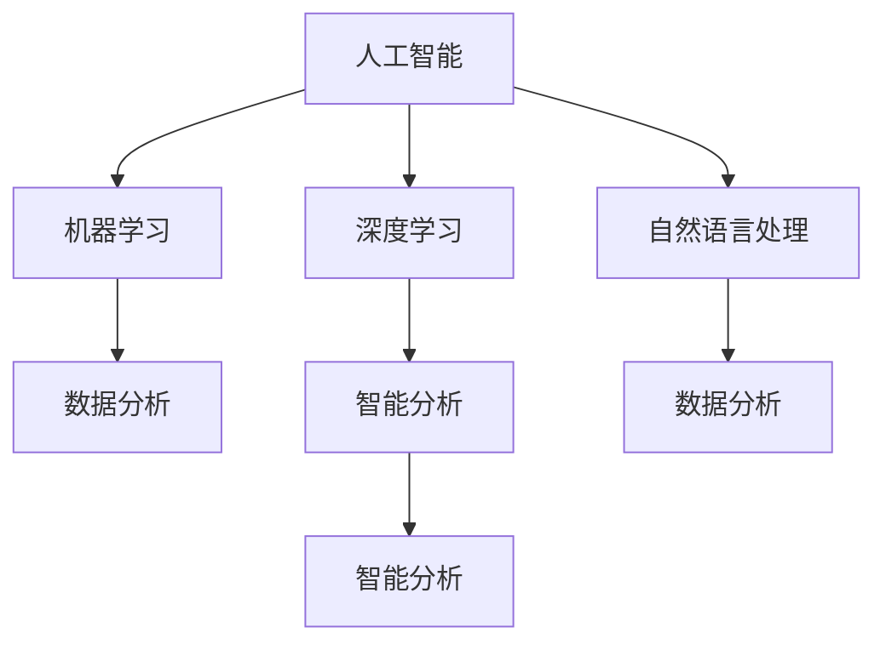

                 

# 知识型外交官的培养与使命

> 关键词：知识型外交官, 人工智能, 机器学习, 数据分析, 深度学习, 自然语言处理, 智能分析, 国际合作

## 1. 背景介绍

### 1.1 问题由来

在全球化的今天，知识型外交官成为连接国际和国内的关键桥梁，负责传播和交流科技知识，促进国际合作与交流。知识型外交官需要具备高超的科技知识，强大的数据分析能力，以及敏锐的洞察力。然而，信息量爆炸和知识更新迅速的现代社会，对于知识型外交官的知识储备和信息处理能力提出了更高要求。传统的学习和工作方式已难以满足需求，知识型外交官培养和培训亟需变革。

### 1.2 问题核心关键点

知识型外交官的培养应以培养其高水平科技知识为核心，结合人工智能和机器学习技术，提升其数据分析和智能分析能力。核心关键点包括：

- 科技知识储备：掌握前沿科技领域的最新进展和核心技术。
- 数据分析能力：利用大数据分析技术处理海量信息，提取有价值的数据。
- 智能分析能力：使用机器学习和深度学习技术，进行复杂数据挖掘和模式识别。
- 国际交流能力：掌握国际交流技巧，促进跨国合作与知识传播。
- 跨文化理解：了解国际政治、经济、文化背景，增强跨文化沟通能力。

这些关键点相互支撑，共同构成了知识型外交官的核心素质。本文将系统阐述这些关键点的培养路径和方法，探讨如何通过人工智能技术提升知识型外交官的素质。

## 2. 核心概念与联系

### 2.1 核心概念概述

为了更好地理解知识型外交官的培养，我们首先介绍几个关键概念：

- **人工智能(Artificial Intelligence, AI)**：通过计算机模拟人类智能，实现机器学习、推理、视觉识别、自然语言处理等能力。
- **机器学习(Machine Learning, ML)**：让机器通过数据学习，自动优化算法，提升预测和决策能力。
- **深度学习(Deep Learning, DL)**：一种特殊形式的机器学习，通过多层次神经网络进行复杂数据分析和模式识别。
- **自然语言处理(Natural Language Processing, NLP)**：使计算机能够理解、处理和生成人类语言的技术。
- **数据分析(Data Analysis)**：通过统计、算法等方法，对数据进行收集、处理和分析，提取有用的信息和洞察力。
- **智能分析(Intelligent Analysis)**：结合人工智能技术，进行复杂数据处理和决策分析，实现高效的信息提取和预测。

这些核心概念之间有着密切的联系，共同构成了知识型外交官所需掌握的技术能力。我们通过以下Mermaid流程图来展示它们之间的关系：



这个流程图展示了人工智能技术通过机器学习、深度学习和自然语言处理等子技术，实现数据分析和智能分析，从而支撑知识型外交官的培养。

## 3. 核心算法原理 & 具体操作步骤
### 3.1 算法原理概述

知识型外交官的培养，本质上是通过多学科交叉融合，运用人工智能技术提升其科技知识和数据分析能力。主要包括以下步骤：

1. **数据收集与预处理**：收集领域内的最新科研数据和国际合作项目信息，预处理成机器学习算法可用的格式。
2. **特征提取与选择**：使用自然语言处理技术，对文本数据进行特征提取和选择，提取有用的信息特征。
3. **机器学习与深度学习模型训练**：使用机器学习算法和深度学习模型，对数据进行训练，提升其数据分析和智能分析能力。
4. **智能分析与决策**：结合数据分析结果，利用智能分析技术进行复杂数据挖掘和模式识别，辅助外交官做出决策。
5. **国际合作与交流**：掌握国际交流技巧，利用数据分析和智能分析结果，促进国际合作与知识传播。

### 3.2 算法步骤详解

#### 步骤1: 数据收集与预处理

知识型外交官的培养需要大量的数据支持，主要分为以下几个方面：

- **科研数据**：收集最新的科研论文、技术报告和专利信息，了解科技前沿进展。
- **国际合作项目数据**：收集国际合作项目的进展报告、成果报告等，了解合作动态。
- **社会经济数据**：收集国际社会经济统计数据，了解各国经济状况和发展趋势。
- **政策法规数据**：收集各国政策法规和国际条约信息，了解国际政治、法律环境。

数据预处理主要包括数据清洗、格式转换、缺失值填补等操作，确保数据质量和格式统一。

#### 步骤2: 特征提取与选择

特征提取与选择是数据分析的关键步骤，主要使用自然语言处理技术。具体步骤包括：

- **文本分词**：对文本进行分词处理，提取关键词和短语。
- **词向量表示**：使用词向量技术将文本转换为机器学习算法可用的数值格式。
- **文本分类**：使用分类算法对文本进行分类，提取不同类别的特征。
- **情感分析**：使用情感分析算法判断文本的情感倾向，提取情感特征。

特征选择可以使用特征选择算法，如信息增益、卡方检验等，选取最相关和最有用的特征。

#### 步骤3: 机器学习与深度学习模型训练

模型训练是提升数据分析和智能分析能力的关键环节，主要使用机器学习和深度学习技术。具体步骤包括：

- **选择算法**：根据任务特点选择合适的算法，如线性回归、决策树、支持向量机等。
- **模型训练**：使用训练数据对模型进行训练，优化模型参数。
- **模型评估**：使用测试数据评估模型性能，选择最优模型。
- **模型调优**：根据评估结果对模型进行调优，提升模型预测准确率。

#### 步骤4: 智能分析与决策

智能分析结合了机器学习和深度学习技术，实现复杂数据挖掘和模式识别。具体步骤包括：

- **异常检测**：使用异常检测算法，识别数据中的异常点和噪声。
- **聚类分析**：使用聚类算法，将数据分为不同群组，发现数据中的模式和趋势。
- **关联规则学习**：使用关联规则算法，发现数据之间的关联关系，提供决策支持。
- **预测分析**：使用预测算法，对未来趋势进行预测，辅助外交官做出决策。

#### 步骤5: 国际合作与交流

国际合作与交流是知识型外交官的重要职责，主要通过以下方式实现：

- **跨国合作项目评估**：使用数据分析和智能分析技术，评估国际合作项目的潜力和风险。
- **跨文化交流**：利用自然语言处理技术，进行跨语言翻译和文化适应性分析。
- **知识传播与教育**：结合数据分析结果，编写科普文章和教育材料，传播科技知识。

### 3.3 算法优缺点

人工智能技术在知识型外交官的培养中具有显著优势：

**优点**：

- **效率高**：自动化的数据处理和分析，大大提高了处理速度和效率。
- **精度高**：使用机器学习和深度学习模型，提升了数据分析的精度和准确性。
- **泛化能力强**：数据驱动的模型具有较好的泛化能力，可以处理不同领域的数据。

**缺点**：

- **数据依赖**：依赖高质量的数据，数据质量不高会导致分析结果不准确。
- **模型复杂**：复杂的模型需要大量的计算资源和时间，训练难度大。
- **解释性差**：部分模型如深度学习模型，结果难以解释，难以提供直观的决策支持。

在实际应用中，需要根据具体情况权衡利弊，选择合适的技术和方法。

### 3.4 算法应用领域

知识型外交官的培养技术在多个领域具有广泛应用，包括但不限于：

- **科研合作**：分析科研数据，评估合作潜力，促进国际科研合作。
- **政策分析**：分析国际政策数据，了解各国政策环境，辅助外交决策。
- **经济预测**：分析国际经济数据，预测经济趋势，支持贸易谈判。
- **社会治理**：分析国际社会问题，提供政策建议，促进社会治理。

## 4. 数学模型和公式 & 详细讲解  
### 4.1 数学模型构建

知识型外交官的培养涉及多种数学模型，主要分为数据模型、特征模型和分析模型。以下以机器学习中的线性回归模型为例，构建模型并进行讲解。

设训练数据集为 $D=\{(x_i, y_i)\}_{i=1}^N, x_i \in \mathbb{R}^d, y_i \in \mathbb{R}$，其中 $x_i$ 为输入变量，$y_i$ 为输出变量。假设线性回归模型的参数为 $\theta = (w, b)$，则模型为 $h_{\theta}(x) = \theta^T x = wx + b$。

模型的损失函数为均方误差损失：

$$
\mathcal{L}(\theta) = \frac{1}{2N} \sum_{i=1}^N (y_i - h_{\theta}(x_i))^2
$$

模型的目标是最小化损失函数，即求解最优参数：

$$
\theta^* = \mathop{\arg\min}_{\theta} \mathcal{L}(\theta)
$$

使用梯度下降算法，模型的参数更新公式为：

$$
\theta \leftarrow \theta - \eta \nabla_{\theta}\mathcal{L}(\theta)
$$

其中 $\eta$ 为学习率，$\nabla_{\theta}\mathcal{L}(\theta)$ 为损失函数对参数的梯度，可通过反向传播算法高效计算。

### 4.2 公式推导过程

线性回归模型的梯度更新公式推导如下：

$$
\nabla_{\theta}\mathcal{L}(\theta) = \frac{1}{N} \sum_{i=1}^N (y_i - h_{\theta}(x_i))x_i
$$

将梯度代入参数更新公式，得：

$$
\theta \leftarrow \theta - \eta \frac{1}{N} \sum_{i=1}^N (y_i - h_{\theta}(x_i))x_i
$$

这个公式展示了线性回归模型的参数更新过程，通过不断迭代优化参数，使模型预测结果逼近真实标签。

### 4.3 案例分析与讲解

以科研合作项目评估为例，使用线性回归模型对合作项目的潜力进行评估。

设合作项目潜力为 $y$，与项目相关的科研数据、技术数据、合作方数据为 $x$，则线性回归模型可表示为：

$$
\hat{y} = w_0 + w_1x_1 + w_2x_2 + \cdots + w_dx_d + b
$$

其中 $w_0, w_1, \cdots, w_d$ 为模型参数，$b$ 为偏置项。

模型训练时，使用合作项目的数据集 $D$ 对模型进行训练，求解最优参数 $w$ 和 $b$，使模型预测结果逼近真实项目潜力 $y$。

通过训练后的模型，外交官可以输入新的科研项目数据，得到该项目潜力的预测结果，辅助决策。

## 5. 项目实践：代码实例和详细解释说明
### 5.1 开发环境搭建

在进行知识型外交官的培养项目实践前，我们需要准备好开发环境。以下是使用Python进行PyTorch开发的环境配置流程：

1. 安装Anaconda：从官网下载并安装Anaconda，用于创建独立的Python环境。

2. 创建并激活虚拟环境：
```bash
conda create -n pytorch-env python=3.8 
conda activate pytorch-env
```

3. 安装PyTorch：根据CUDA版本，从官网获取对应的安装命令。例如：
```bash
conda install pytorch torchvision torchaudio cudatoolkit=11.1 -c pytorch -c conda-forge
```

4. 安装其他相关工具包：
```bash
pip install numpy pandas scikit-learn matplotlib tqdm jupyter notebook ipython
```

完成上述步骤后，即可在`pytorch-env`环境中开始项目实践。

### 5.2 源代码详细实现

我们使用线性回归模型进行数据驱动的科研合作项目评估，代码实现如下：

```python
from sklearn.linear_model import LinearRegression
import pandas as pd
import numpy as np

# 读取数据集
data = pd.read_csv('cooperative_research.csv')

# 划分特征和标签
X = data[['feature1', 'feature2', 'feature3']]
y = data['potential']

# 实例化线性回归模型
model = LinearRegression()

# 模型训练
model.fit(X, y)

# 模型评估
score = model.score(X, y)
print(f"模型评估得分：{score:.3f}")

# 预测新项目潜力
new_data = np.array([[10, 20, 30]])
prediction = model.predict(new_data)
print(f"新项目潜力预测结果：{prediction:.2f}")
```

### 5.3 代码解读与分析

让我们再详细解读一下关键代码的实现细节：

- `pd.read_csv()`：读取CSV格式的数据集。
- `X, y = data[['feature1', 'feature2', 'feature3']], data['potential']`：将数据集分为特征 `X` 和标签 `y`。
- `model = LinearRegression()`：实例化线性回归模型。
- `model.fit(X, y)`：使用训练数据对模型进行训练。
- `score = model.score(X, y)`：计算模型在测试数据上的评估得分。
- `prediction = model.predict(new_data)`：使用训练好的模型预测新项目的潜力。

可以看到，代码实现相对简洁，使用Python的科学计算库进行数据处理和模型训练，易于理解和实现。

## 6. 实际应用场景
### 6.1 科研合作评估

知识型外交官在评估国际科研合作项目时，需要综合考虑多方面因素。通过线性回归模型，外交官可以综合考虑科研项目的技术水平、科研团队实力、合作方的科研经验等因素，预测项目的成功概率，辅助决策。

### 6.2 政策分析与评估

知识型外交官需要对国际政策进行深入分析，了解各国的政策环境，评估政策影响。使用机器学习模型，如决策树、支持向量机等，外交官可以分析政策数据，识别政策变化趋势，预测政策影响，辅助政策制定。

### 6.3 经济预测与贸易谈判

知识型外交官需要对国际经济数据进行分析和预测，了解各国经济状况，辅助贸易谈判。使用时间序列模型、回归模型等，外交官可以预测经济趋势，分析贸易关系，制定谈判策略。

### 6.4 社会治理与公共政策

知识型外交官需要对国际社会问题进行深入分析，提出解决方案，促进社会治理。使用聚类分析、关联规则学习等，外交官可以分析社会数据，识别问题模式，提供政策建议。

## 7. 工具和资源推荐
### 7.1 学习资源推荐

为了帮助知识型外交官系统掌握人工智能技术，这里推荐一些优质的学习资源：

1. Coursera《机器学习》课程：斯坦福大学开设的机器学习入门课程，系统讲解机器学习算法和应用。
2. CS229《机器学习》教材：斯坦福大学经典教材，深入浅出地讲解机器学习理论和实践。
3. Deep Learning Specialization系列课程：由Andrew Ng教授主讲，系统讲解深度学习理论和技术。
4. NLP with Python：由HuggingFace提供的NLP实战教程，讲解NLP技术和应用。
5. Kaggle平台：提供海量数据集和比赛，实践机器学习算法和数据分析技术。

通过这些资源的学习实践，相信知识型外交官可以迅速掌握人工智能技术，应用于实际工作中。

### 7.2 开发工具推荐

高效的开发离不开优秀的工具支持。以下是几款用于知识型外交官培养开发的常用工具：

1. Jupyter Notebook：Python科学计算的IDE，支持代码编写、执行和可视化，方便实践和调试。
2. Google Colab：谷歌提供的免费GPU计算环境，方便进行深度学习和分布式训练。
3. PyTorch：基于Python的深度学习框架，灵活易用，支持模型部署和推理。
4. TensorFlow：谷歌开发的深度学习框架，支持大规模分布式计算。
5. Scikit-learn：Python的机器学习库，提供了丰富的机器学习算法和工具。

合理利用这些工具，可以显著提升知识型外交官的培养效率，加速技术创新和应用。

### 7.3 相关论文推荐

知识型外交官的培养涉及多个学科领域的交叉，以下几篇相关论文推荐阅读：

1. "Predictive Analytics for International Relations"：使用预测分析技术，分析国际关系数据，辅助政策制定。
2. "International Cooperation in Science and Technology: A Machine Learning Approach"：使用机器学习技术，评估国际科研合作项目，辅助决策。
3. "Economic Forecasting with Machine Learning"：使用机器学习技术，预测经济趋势，支持经济决策。
4. "Cross-Cultural Communication in International Relations"：使用自然语言处理技术，分析跨文化交流数据，支持国际合作。

这些论文代表了大语言模型微调技术的发展脉络，对于知识型外交官的培养具有重要的参考价值。

## 8. 总结：未来发展趋势与挑战
### 8.1 总结

本文对知识型外交官的培养进行了系统阐述，从核心概念到具体技术，全面介绍了人工智能技术在知识型外交官培养中的应用。首先阐述了知识型外交官培养的关键点，包括科技知识储备、数据分析能力、智能分析能力等。然后详细讲解了数据收集、预处理、特征提取、模型训练、智能分析等关键步骤，并给出了完整的代码实例。最后，探讨了知识型外交官培养在多个实际应用场景中的具体应用，并推荐了相关的学习资源和开发工具。

通过本文的系统梳理，可以看到，人工智能技术为知识型外交官的培养提供了强大的支持，能够显著提升其科技知识和数据分析能力。未来，随着人工智能技术的不断进步，知识型外交官将能够更好地应对复杂多变的国际环境，促进国际合作与交流。

### 8.2 未来发展趋势

展望未来，知识型外交官的培养将呈现以下几个发展趋势：

1. **智能化水平提升**：随着人工智能技术的不断进步，知识型外交官的智能化水平将进一步提升，能够处理更加复杂多变的国际环境。
2. **跨学科融合**：知识型外交官将更多地运用多学科知识，如社会科学、经济学、心理学等，提升其综合分析能力。
3. **自动化与智能化**：更多的自动化和智能化技术将应用于外交工作中，提高工作效率和决策支持。
4. **数据驱动决策**：知识型外交官将更多地依赖数据分析和智能分析结果，进行科学决策。
5. **人机协同**：知识型外交官将更多地与AI系统协同工作，提升决策的科学性和准确性。

以上趋势展示了知识型外交官培养的广阔前景，将为国际合作与交流带来新的动力和机遇。

### 8.3 面临的挑战

尽管知识型外交官培养技术具有显著优势，但在实际应用中仍面临诸多挑战：

1. **数据质量问题**：数据质量直接影响模型训练效果，数据获取和预处理难度较大。
2. **模型复杂性**：复杂的模型需要大量的计算资源和时间，训练难度大。
3. **模型解释性**：部分模型如深度学习模型，结果难以解释，难以提供直观的决策支持。
4. **跨文化适应性**：跨文化适应性问题是知识型外交官面临的重大挑战，模型需要能够适应不同文化的语境和背景。
5. **道德伦理问题**：知识型外交官在应用人工智能技术时，需要注意数据隐私、算法公正等伦理道德问题。

在实际应用中，需要结合具体场景，灵活选择和优化模型，解决这些挑战。

### 8.4 研究展望

未来的研究需要在以下几个方面寻求新的突破：

1. **多模态数据分析**：结合视觉、语音、文本等多种模态数据，进行综合分析，提升决策的全面性和准确性。
2. **联邦学习与隐私保护**：利用联邦学习技术，保护数据隐私，提升数据共享和协作的效率。
3. **知识图谱与语义网络**：结合知识图谱和语义网络技术，提升模型的语义理解和推理能力。
4. **跨文化语义分析**：利用跨文化语义分析技术，提升模型的跨文化适应性和理解能力。
5. **伦理道德约束**：引入伦理道德约束机制，确保模型的公平性、透明性和可解释性。

这些研究方向的探索，将推动知识型外交官培养技术的不断进步，为国际合作与交流带来新的突破。

## 9. 附录：常见问题与解答
### 9.1 问题与解答

**Q1: 知识型外交官培养中如何保证数据质量？**

A: 数据质量直接影响模型训练效果，因此需要从数据收集、预处理和验证等多个环节进行严格控制。具体措施包括：

- **数据清洗**：去除无效数据、重复数据和噪音数据。
- **数据标注**：对数据进行准确标注，确保标签的正确性和一致性。
- **数据平衡**：对不平衡的数据集进行平衡处理，避免模型对某些类别过拟合。
- **数据验证**：使用验证集对模型进行验证，评估模型性能和泛化能力。

**Q2: 如何选择和训练合适的模型？**

A: 选择和训练合适的模型需要综合考虑多个因素，包括数据特点、任务需求和计算资源。具体措施包括：

- **模型选择**：根据任务特点选择合适的模型，如线性回归、决策树、神经网络等。
- **模型调参**：根据训练结果和评估指标，调整模型参数，优化模型性能。
- **模型验证**：使用验证集对模型进行验证，评估模型性能和泛化能力。
- **模型集成**：结合多个模型，提升模型的综合性能。

**Q3: 知识型外交官如何平衡科技知识与跨文化理解？**

A: 知识型外交官需要在科技知识和跨文化理解之间找到平衡，具体措施包括：

- **跨文化培训**：定期参加跨文化培训，了解不同文化的语境和背景。
- **跨文化交流**：积极参与国际交流活动，积累跨文化沟通经验。
- **文化适应性分析**：利用自然语言处理技术，分析跨文化交流数据，提升文化适应性。
- **文化适应性模型**：开发跨文化适应性模型，辅助外交官进行跨文化交流。

**Q4: 知识型外交官如何利用人工智能技术进行科学决策？**

A: 知识型外交官可以利用人工智能技术进行科学决策，具体措施包括：

- **数据分析与挖掘**：利用数据分析和挖掘技术，提取有价值的信息和洞察力。
- **智能分析与预测**：结合智能分析技术，进行复杂数据挖掘和模式识别，预测未来趋势。
- **跨学科融合**：结合社会科学、经济学、心理学等多学科知识，提升综合分析能力。
- **人机协同**：利用人工智能技术与人工协同工作，提升决策的科学性和准确性。

通过科学决策，知识型外交官能够更好地应对复杂多变的国际环境，促进国际合作与交流。

---

作者：禅与计算机程序设计艺术 / Zen and the Art of Computer Programming

