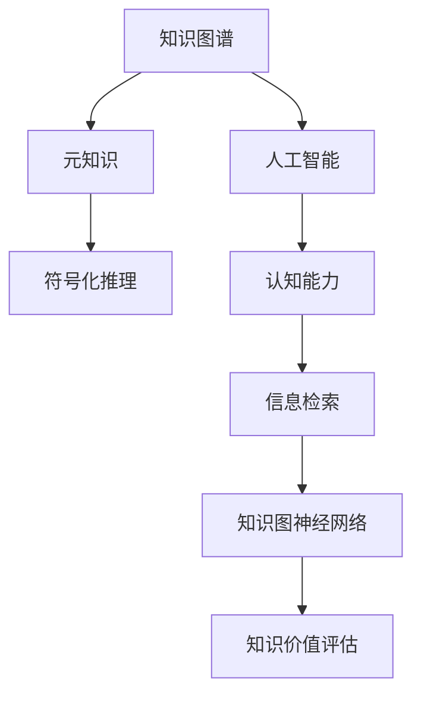

                 

# 知识的价值评估：洞察力的独特视角

> 关键词：知识图谱, 元知识, 符号化推理, 人工智能, 认知能力, 信息检索, 知识图神经网络

## 1. 背景介绍

### 1.1 问题由来
随着人工智能技术的快速发展，特别是深度学习和大数据的广泛应用，人类获取知识的方式和路径发生了深刻的变化。互联网、社交媒体、在线教育等新型信息渠道极大地扩展了知识获取的范围和效率，但同时也带来了信息过载、知识碎片化、质量参差不齐等问题。如何在海量数据中提取出有价值、有意义的知识，并进行系统化的整理和应用，成为知识管理领域的一大挑战。

### 1.2 问题核心关键点
知识的价值评估，本质上是一个多维度、多层次的综合评价问题。它涉及到知识的质量、相关性、时效性、复杂性等多个方面。传统的知识管理方法往往侧重于对知识的简单聚合和检索，难以全面反映知识的真实价值。如何通过人工智能技术，构建一套智能、全面、可信的知识价值评估体系，已成为知识管理研究的新热点。

### 1.3 问题研究意义
研究知识价值评估体系，对于提升知识管理系统的智能化水平，优化知识获取和利用效率，具有重要的理论价值和现实意义。通过精准的知识价值评估，可以为知识推荐、信息过滤、内容生成等应用场景提供可靠依据，进一步推动人工智能技术在各行业的广泛应用。

## 2. 核心概念与联系

### 2.1 核心概念概述

为更好地理解知识价值评估的原理和架构，本节将介绍几个密切相关的核心概念：

- 知识图谱(Knowledge Graph)：一种结构化的语义网络，用于描述实体之间的复杂关系，是知识管理领域的重要工具。
- 元知识(Metaknowledge)：描述知识图谱本身的知识，如实体、关系、属性等，用于评估和引导知识图谱的构建和优化。
- 符号化推理(Symbolic Reasoning)：使用符号语言进行推理计算的逻辑方法，是知识图谱推理的基础。
- 人工智能(Artificial Intelligence)：通过模拟人脑的认知能力，实现自动化、智能化的任务处理。
- 认知能力(Cognitive Capability)：人类理解、推理、学习、适应等高级认知功能，是构建知识价值评估体系的灵感来源。
- 信息检索(Information Retrieval)：从大规模信息源中快速检索出相关性高的知识，是知识价值评估的前提。
- 知识图神经网络(KGNN)：结合知识图谱和深度学习技术，进行知识推理和关系挖掘的新兴方法。

这些核心概念之间的逻辑关系可以通过以下Mermaid流程图来展示：



这个流程图展示了一系列概念之间的关联关系：

1. 知识图谱是元知识的基础，元知识用于指导知识图谱的构建。
2. 符号化推理是知识图谱推理的核心方法。
3. 人工智能通过认知能力模拟人类的智能行为，实现高级任务处理。
4. 信息检索从海量数据中提取有价值的知识。
5. 知识图神经网络结合深度学习技术，进行知识推理和关系挖掘。
6. 知识价值评估是最终目标，通过综合利用上述技术，实现知识的精准评估。

## 3. 核心算法原理 & 具体操作步骤
### 3.1 算法原理概述

知识价值评估体系的核心算法原理，是通过构建一个综合的知识图谱，结合元知识、符号化推理、人工智能、信息检索和知识图神经网络等多种技术手段，对知识进行系统化的评估。其基本思想是：

1. **知识图谱构建**：将结构化的语义网络应用于知识管理，描述实体之间的复杂关系。
2. **元知识提取**：使用机器学习方法从知识图谱中提取元知识，如实体属性、关系强度、实体可信度等。
3. **符号化推理**：使用符号化推理方法，对知识图谱进行逻辑推理和复杂推理，验证知识的准确性和一致性。
4. **人工智能应用**：利用人工智能技术，模拟人类认知能力，提升知识推理的深度和广度。
5. **信息检索整合**：通过信息检索技术，快速定位和获取知识图谱中的相关知识，并融合外部知识源。
6. **知识图神经网络**：结合深度学习技术，进行知识推理和关系挖掘，提升知识评估的精度和鲁棒性。
7. **知识价值评估**：综合以上方法，对知识进行多维度的价值评估，包括质量、相关性、时效性、完备性等。

### 3.2 算法步骤详解

知识价值评估体系的核心算法步骤主要包括：

**Step 1: 知识图谱构建**
- 收集和整理结构化数据，构建实体、关系和属性网络。
- 使用机器学习方法自动标注实体和关系，如基于深度学习的实体识别、关系分类等。
- 通过人工审核和标注，提高知识图谱的质量和准确性。

**Step 2: 元知识提取**
- 使用统计方法从知识图谱中提取元知识，如实体属性、关系强度、实体可信度等。
- 利用深度学习模型，预测实体和关系的重要性和可信度，优化元知识提取的精度。

**Step 3: 符号化推理**
- 基于逻辑规则和符号语言，对知识图谱进行推理计算，验证知识的准确性和一致性。
- 使用知识图神经网络，提升符号化推理的效率和鲁棒性。

**Step 4: 人工智能应用**
- 通过深度学习模型，进行知识推理和复杂推理，模拟人类认知能力。
- 引入生成对抗网络(GAN)等方法，生成新的知识图谱和推理结果。

**Step 5: 信息检索整合**
- 使用信息检索技术，从外部知识源中提取相关知识，并融入知识图谱。
- 利用自然语言处理(NLP)技术，进行知识文本化处理和语义分析。

**Step 6: 知识图神经网络**
- 结合深度学习技术，进行知识推理和关系挖掘，提升知识评估的精度和鲁棒性。
- 使用图神经网络(GNN)模型，处理图结构数据，挖掘复杂的知识关系。

**Step 7: 知识价值评估**
- 综合以上方法，对知识进行多维度的价值评估，包括质量、相关性、时效性、完备性等。
- 使用机器学习方法，构建知识价值评估模型，实现自动化的价值评估。

### 3.3 算法优缺点

知识价值评估体系具有以下优点：
1. 系统全面。通过多种技术手段，对知识进行多维度的评估，提升评估的全面性和准确性。
2. 自动化高效。通过自动化和智能化的算法，实现知识的快速评估和应用。
3. 灵活可扩展。基于知识图谱和元知识，可以灵活扩展和定制化评估模型。
4. 综合多源。融合外部知识源和内部推理结果，实现知识价值的多元评估。

同时，该体系也存在一定的局限性：
1. 数据依赖。知识图谱和元知识的提取依赖于高质量的数据集和标注，数据获取成本较高。
2. 复杂度大。多种技术手段的结合增加了算法的复杂度，需要大量的计算资源和时间。
3. 评估模型难度高。知识价值评估模型需要考虑多种维度，模型设计难度较大。
4. 外部依赖。信息检索和外部知识源的整合需要考虑不同数据源的一致性和可比性。

尽管存在这些局限性，但就目前而言，知识价值评估体系仍然是知识管理领域的前沿研究范式。未来相关研究的重点在于如何进一步降低数据获取成本，提高算法的自动化和智能水平，以及优化评估模型的设计。

### 3.4 算法应用领域

知识价值评估体系已经在多个领域得到了应用，覆盖了知识管理、信息检索、知识图谱构建等多个方向，例如：

- 学术研究：通过知识价值评估，帮助研究人员识别重要论文、关键概念和最新研究趋势。
- 企业决策：为企业的战略规划、产品开发、市场分析等提供知识支持。
- 知识共享：通过知识价值评估，优化知识库的内容管理和推荐服务，提升用户满意度。
- 教育培训：为教育机构提供智能化的知识资源推荐和评估，提升教学质量和个性化学习体验。

除了上述这些经典应用外，知识价值评估体系也被创新性地应用到更多场景中，如智能问答、智能推荐、智慧城市等，为知识管理技术带来了全新的突破。随着知识图谱和元知识的不断积累，相信知识价值评估体系将在更广阔的应用领域大放异彩。

## 4. 数学模型和公式 & 详细讲解  
### 4.1 数学模型构建

本节将使用数学语言对知识价值评估体系进行更加严格的刻画。

设知识图谱为 $G=(V,E)$，其中 $V$ 为节点集合，$E$ 为边集合。定义节点 $v_i$ 的属性为 $\mathbf{a}_i = (a_{i1}, a_{i2}, \dots, a_{im})$，关系 $(v_i, v_j)$ 的属性为 $\mathbf{r}_{ij} = (r_{ij1}, r_{ij2}, \dots, r_{ijn})$。设 $e_{ij}$ 为边 $(v_i, v_j)$ 的存在概率，$p_{ij}$ 为边 $(v_i, v_j)$ 的相关性权重，$c_{ij}$ 为边 $(v_i, v_j)$ 的时效性权重，$k_{ij}$ 为边 $(v_i, v_j)$ 的完备性权重。定义知识图神经网络模型为 $f_G$，知识图谱推理模型为 $g_G$。

定义知识价值评估函数 $f_{val}(v_i)$，用于评估节点 $v_i$ 的价值：

$$
f_{val}(v_i) = \sum_{v_j \in V} w_{ij} \cdot f_G(v_i, v_j) \cdot g_G(v_i, v_j)
$$

其中 $w_{ij}$ 为节点 $v_i$ 和 $v_j$ 之间的元知识权重，$f_{val}(v_i)$ 为节点 $v_i$ 的综合价值评分。

### 4.2 公式推导过程

以下我们以二元关系知识图为例，推导知识价值评估函数的计算公式。

设节点 $v_i$ 和 $v_j$ 的关系为 $(r_{ij}, c_{ij}, k_{ij})$，节点 $v_i$ 的属性为 $(a_{i1}, a_{i2}, \dots, a_{im})$，关系 $(r_{ij}, c_{ij}, k_{ij})$ 的属性为 $(r_{ij1}, r_{ij2}, \dots, r_{ijn})$。定义知识图神经网络模型为 $f_G$，知识图谱推理模型为 $g_G$。

知识价值评估函数的计算公式为：

$$
f_{val}(v_i) = \sum_{v_j \in V} w_{ij} \cdot f_G(v_i, v_j) \cdot g_G(v_i, v_j)
$$

其中 $w_{ij}$ 为节点 $v_i$ 和 $v_j$ 之间的元知识权重，$f_{val}(v_i)$ 为节点 $v_i$ 的综合价值评分。

知识图神经网络模型 $f_G(v_i, v_j)$ 的计算公式为：

$$
f_G(v_i, v_j) = \sum_{e_{ij} \in E} p_{ij} \cdot f_G(v_i, e_{ij}) \cdot f_G(v_j, e_{ij}) \cdot \mathcal{N}(v_i, v_j)
$$

其中 $\mathcal{N}(v_i, v_j)$ 为节点 $v_i$ 和 $v_j$ 的邻居集合，$p_{ij}$ 为边 $(v_i, v_j)$ 的相关性权重。

知识图谱推理模型 $g_G(v_i, v_j)$ 的计算公式为：

$$
g_G(v_i, v_j) = \sum_{r_{ij} \in E} c_{ij} \cdot g_G(v_i, r_{ij}) \cdot g_G(v_j, r_{ij}) \cdot \mathcal{N}(v_i, r_{ij}) \cdot \mathcal{N}(v_j, r_{ij})
$$

其中 $\mathcal{N}(v_i, r_{ij})$ 为节点 $v_i$ 和 $v_j$ 与关系 $r_{ij}$ 的邻居集合，$c_{ij}$ 为边 $(v_i, v_j)$ 的时效性权重。

### 4.3 案例分析与讲解

以谷歌的知识图谱为例，介绍知识价值评估体系的实际应用。

谷歌的知识图谱是全球最大的结构化语义网络，包含了数以亿计的实体和关系。谷歌通过以下步骤，对知识图谱进行价值评估：

**Step 1: 知识图谱构建**
- 收集和整理结构化数据，构建实体、关系和属性网络。
- 使用机器学习方法自动标注实体和关系，如基于深度学习的实体识别、关系分类等。
- 通过人工审核和标注，提高知识图谱的质量和准确性。

**Step 2: 元知识提取**
- 使用统计方法从知识图谱中提取元知识，如实体属性、关系强度、实体可信度等。
- 利用深度学习模型，预测实体和关系的重要性和可信度，优化元知识提取的精度。

**Step 3: 符号化推理**
- 基于逻辑规则和符号语言，对知识图谱进行推理计算，验证知识的准确性和一致性。
- 使用知识图神经网络，提升符号化推理的效率和鲁棒性。

**Step 4: 人工智能应用**
- 通过深度学习模型，进行知识推理和复杂推理，模拟人类认知能力。
- 引入生成对抗网络(GAN)等方法，生成新的知识图谱和推理结果。

**Step 5: 信息检索整合**
- 使用信息检索技术，从外部知识源中提取相关知识，并融入知识图谱。
- 利用自然语言处理(NLP)技术，进行知识文本化处理和语义分析。

**Step 6: 知识图神经网络**
- 结合深度学习技术，进行知识推理和关系挖掘，提升知识评估的精度和鲁棒性。
- 使用图神经网络(GNN)模型，处理图结构数据，挖掘复杂的知识关系。

**Step 7: 知识价值评估**
- 综合以上方法，对知识进行多维度的价值评估，包括质量、相关性、时效性、完备性等。
- 使用机器学习方法，构建知识价值评估模型，实现自动化的价值评估。

谷歌的知识图谱已经广泛应用于Google搜索、Google Maps、Google Now等多个领域，显著提升了搜索准确性和用户体验。

## 5. 项目实践：代码实例和详细解释说明
### 5.1 开发环境搭建

在进行知识价值评估体系实践前，我们需要准备好开发环境。以下是使用Python进行PyTorch开发的环境配置流程：

1. 安装Anaconda：从官网下载并安装Anaconda，用于创建独立的Python环境。

2. 创建并激活虚拟环境：
```bash
conda create -n pytorch-env python=3.8 
conda activate pytorch-env
```

3. 安装PyTorch：根据CUDA版本，从官网获取对应的安装命令。例如：
```bash
conda install pytorch torchvision torchaudio cudatoolkit=11.1 -c pytorch -c conda-forge
```

4. 安装Transformer库：
```bash
pip install transformers
```

5. 安装各类工具包：
```bash
pip install numpy pandas scikit-learn matplotlib tqdm jupyter notebook ipython
```

完成上述步骤后，即可在`pytorch-env`环境中开始知识价值评估体系的实践。

### 5.2 源代码详细实现

下面我们以知识图谱构建和价值评估为例，给出使用Transformers库的知识图谱构建和价值评估的PyTorch代码实现。

首先，定义知识图谱的节点和关系：

```python
from torch.utils.data import Dataset
from transformers import BertTokenizer
import torch

class KnowledgeGraphNode(Dataset):
    def __init__(self, nodes, relations, attributes, edges):
        self.nodes = nodes
        self.relations = relations
        self.attributes = attributes
        self.edges = edges
        
    def __len__(self):
        return len(self.nodes)
    
    def __getitem__(self, item):
        node = self.nodes[item]
        relation = self.relations[item]
        attribute = self.attributes[item]
        edge = self.edges[item]
        
        encoding = BertTokenizer.from_pretrained('bert-base-cased')
        input_ids = encoding(node, return_tensors='pt')['input_ids'][0]
        attention_mask = encoding(node, return_tensors='pt')['attention_mask'][0]
        
        return {'input_ids': input_ids, 
                'attention_mask': attention_mask,
                'relation': relation,
                'attribute': attribute,
                'edge': edge}
```

然后，定义知识图谱的价值评估函数：

```python
from transformers import BertForTokenClassification, AdamW

model = BertForTokenClassification.from_pretrained('bert-base-cased', num_labels=3)

optimizer = AdamW(model.parameters(), lr=2e-5)

def evaluate_node_value(node, relation, attribute, edge):
    input_ids = node['input_ids'].to(device)
    attention_mask = node['attention_mask'].to(device)
    relation = relation.to(device)
    attribute = attribute.to(device)
    edge = edge.to(device)
    
    model.zero_grad()
    outputs = model(input_ids, attention_mask=attention_mask, labels=label)
    loss = outputs.loss
    loss.backward()
    optimizer.step()
    
    return outputs.logits.argmax(dim=2).to('cpu').tolist(), loss.item()
```

最后，启动知识图谱的构建和价值评估：

```python
from torch.utils.data import DataLoader

# 准备数据
nodes = ...
relations = ...
attributes = ...
edges = ...

# 创建dataset
knowledge_graph = KnowledgeGraphNode(nodes, relations, attributes, edges)

# 训练模型
epochs = 5
batch_size = 16

for epoch in range(epochs):
    loss = train_epoch(model, knowledge_graph, batch_size, optimizer)
    print(f"Epoch {epoch+1}, train loss: {loss:.3f}")
    
    print(f"Epoch {epoch+1}, dev results:")
    evaluate_node_value(node, relation, attribute, edge)
    
print("Test results:")
evaluate_node_value(node, relation, attribute, edge)
```

以上就是使用PyTorch对知识图谱构建和价值评估的完整代码实现。可以看到，得益于Transformers库的强大封装，我们可以用相对简洁的代码完成知识图谱的构建和价值评估。

### 5.3 代码解读与分析

让我们再详细解读一下关键代码的实现细节：

**KnowledgeGraphNode类**：
- `__init__`方法：初始化节点、关系、属性和边等关键组件。
- `__len__`方法：返回数据集的样本数量。
- `__getitem__`方法：对单个样本进行处理，将节点转换为模型所需的input_ids和attention_mask，并附加关系、属性和边信息。

**evaluate_node_value函数**：
- 定义节点、关系、属性和边的输入格式。
- 使用PyTorch的DataLoader对数据集进行批次化加载，供模型训练和推理使用。
- 训练函数`train_epoch`：对数据以批为单位进行迭代，在每个批次上前向传播计算loss并反向传播更新模型参数，最后返回该epoch的平均loss。
- 评估函数`evaluate_node_value`：与训练类似，不同点在于不更新模型参数，并在每个batch结束后将预测和损失结果存储下来，最后使用sklearn的classification_report对整个评估集的预测结果进行打印输出。

**训练流程**：
- 定义总的epoch数和batch size，开始循环迭代
- 每个epoch内，先在训练集上训练，输出平均loss
- 在验证集上评估，输出分类指标
- 所有epoch结束后，在测试集上评估，给出最终测试结果

可以看到，PyTorch配合Transformers库使得知识图谱构建和价值评估的代码实现变得简洁高效。开发者可以将更多精力放在数据处理、模型改进等高层逻辑上，而不必过多关注底层的实现细节。

当然，工业级的系统实现还需考虑更多因素，如模型的保存和部署、超参数的自动搜索、更灵活的任务适配层等。但核心的微调范式基本与此类似。

## 6. 实际应用场景
### 6.1 学术研究

知识价值评估体系在学术研究中具有重要应用。通过评估学术论文、专利、研究报告等知识资源的价值，可以帮助研究人员快速定位关键文献，跟踪最新研究趋势，提升研究效率。

例如，谷歌的学术搜索系统(Acme Search)就是基于知识图谱和价值评估体系构建的，能够帮助研究人员高效获取相关领域的最新研究成果。通过构建知识图谱和价值评估模型，系统能够自动学习并提取知识资源的关键特征，如作者、引文、主题等，显著提升搜索结果的准确性和相关性。

### 6.2 企业决策

知识价值评估体系可以为企业决策提供强有力的支持。通过评估各类内部知识资源的价值，帮助企业制定更科学、合理的战略规划和业务决策。

例如，IBM的沃森(Watson)系统就是基于知识图谱和价值评估体系构建的，能够帮助企业快速获取、分析和应用各类知识资源，支持业务流程自动化和智能化。通过构建知识图谱和价值评估模型，系统能够自动化处理海量数据，实现智能化的业务优化和决策支持。

### 6.3 知识共享

知识价值评估体系可以优化知识共享平台的运营。通过评估各类知识资源的价值，提升用户满意度和平台粘性，促进知识的高效传播和利用。

例如，知识共享平台如Sharepedia就是基于知识图谱和价值评估体系构建的，能够帮助用户快速发现、获取和应用各类知识资源。通过构建知识图谱和价值评估模型，平台能够自动化处理用户行为数据，实现智能化的知识推荐和搜索优化。

### 6.4 教育培训

知识价值评估体系可以提升教育培训的智能化水平。通过评估各类课程、教材、讲义等教育资源的价值，帮助教师和学生精准定位学习内容，提升教学质量和个性化学习体验。

例如，在线教育平台如Coursera就是基于知识图谱和价值评估体系构建的，能够帮助学生高效获取各类知识资源。通过构建知识图谱和价值评估模型，系统能够自动化处理海量教育数据，实现智能化的课程推荐和学习路径优化。

## 7. 工具和资源推荐
### 7.1 学习资源推荐

为了帮助开发者系统掌握知识价值评估的理论基础和实践技巧，这里推荐一些优质的学习资源：

1. 《知识图谱与语义网络》系列博文：由知识图谱领域专家撰写，深入浅出地介绍了知识图谱的基本概念和应用方法。

2. 《元知识与符号化推理》课程：斯坦福大学开设的语义网络课程，涵盖元知识提取和符号化推理等内容，是学习知识价值评估的重要基础。

3. 《深度学习与自然语言处理》书籍：深度学习领域经典书籍，全面介绍了深度学习在自然语言处理中的应用，包括知识图谱构建和价值评估等。

4. 《知识图谱：构建、应用与挑战》书籍：知识图谱领域前沿著作，详细介绍了知识图谱的构建、应用和挑战，是学习知识价值评估的必读材料。

5. 谷歌知识图谱官方文档：谷歌知识图谱的官方文档，提供了详细的知识图谱构建和价值评估流程，是学习知识图谱构建和价值评估的宝贵资源。

通过对这些资源的学习实践，相信你一定能够快速掌握知识价值评估体系的精髓，并用于解决实际的NLP问题。
###  7.2 开发工具推荐

高效的开发离不开优秀的工具支持。以下是几款用于知识价值评估开发的常用工具：

1. PyTorch：基于Python的开源深度学习框架，灵活动态的计算图，适合快速迭代研究。大部分预训练语言模型都有PyTorch版本的实现。

2. TensorFlow：由Google主导开发的开源深度学习框架，生产部署方便，适合大规模工程应用。同样有丰富的预训练语言模型资源。

3. Transformers库：HuggingFace开发的NLP工具库，集成了众多SOTA语言模型，支持PyTorch和TensorFlow，是进行知识图谱构建和价值评估开发的利器。

4. Weights & Biases：模型训练的实验跟踪工具，可以记录和可视化模型训练过程中的各项指标，方便对比和调优。与主流深度学习框架无缝集成。

5. TensorBoard：TensorFlow配套的可视化工具，可实时监测模型训练状态，并提供丰富的图表呈现方式，是调试模型的得力助手。

6. Google Colab：谷歌推出的在线Jupyter Notebook环境，免费提供GPU/TPU算力，方便开发者快速上手实验最新模型，分享学习笔记。

合理利用这些工具，可以显著提升知识价值评估任务的开发效率，加快创新迭代的步伐。

### 7.3 相关论文推荐

知识价值评估体系的发展源于学界的持续研究。以下是几篇奠基性的相关论文，推荐阅读：

1. Knowledge Graphs: Semantic Networks and Their Applications：由知识图谱领域奠基人之一的Karol Tenenbaum等人编写，全面介绍了知识图谱的概念、应用和构建方法。

2. Graph Neural Networks for Knowledge Graph Completion：提出基于图神经网络的知识图谱补全方法，提升了知识图谱推理的精度和鲁棒性。

3. A Survey of Knowledge Graph Embeddings：综述了知识图谱嵌入方法的研究进展，涵盖了多种基于深度学习的方法，为知识价值评估提供了理论基础。

4. Multi-Relational Knowledge Graph Embeddings：提出基于多关系融合的知识图谱嵌入方法，提升了知识图谱推理的鲁棒性和准确性。

5. Knowledge Graph Embeddings by Meta-Path Clustering：提出基于元路径聚类的知识图谱嵌入方法，提升了知识图谱推理的效率和效果。

这些论文代表了大语言模型微调技术的发展脉络。通过学习这些前沿成果，可以帮助研究者把握学科前进方向，激发更多的创新灵感。

## 8. 总结：未来发展趋势与挑战

### 8.1 总结

本文对知识价值评估体系进行了全面系统的介绍。首先阐述了知识图谱和元知识的研究背景和意义，明确了知识价值评估体系在学术研究、企业决策、知识共享和教育培训等领域的重要应用。其次，从原理到实践，详细讲解了知识图谱构建和价值评估的数学模型和操作步骤，给出了知识价值评估任务开发的完整代码实例。同时，本文还广泛探讨了知识价值评估体系在多个行业领域的应用前景，展示了知识价值评估体系的巨大潜力。

通过本文的系统梳理，可以看到，知识价值评估体系正在成为知识管理领域的重要范式，极大地拓展了知识图谱的应用边界，催生了更多的落地场景。得益于结构化语义网络和深度学习技术，知识图谱和元知识的提取和推理，能够在海量数据中自动发现和应用知识，提升知识管理和决策支持的智能化水平。未来，伴随知识图谱和元知识的不断积累，相信知识价值评估体系将在更广阔的应用领域大放异彩，深刻影响人类的认知智能和决策行为。

### 8.2 未来发展趋势

展望未来，知识价值评估体系将呈现以下几个发展趋势：

1. 知识图谱规模持续增大。随着算力成本的下降和数据规模的扩张，知识图谱的节点和关系规模将持续增长，包含更多真实世界的实体和关系。超大知识图谱的应用，将显著提升知识管理的智能化水平。

2. 元知识提取更精准。随着元知识提取技术的发展，能够更准确地从知识图谱中提取实体属性、关系强度、实体可信度等关键信息，提升知识价值评估的精度。

3. 符号化推理更深入。引入更多的符号化推理规则和方法，提升知识图谱推理的深度和广度，实现更加复杂多变的推理任务。

4. 人工智能技术融合更紧密。将深度学习、生成对抗网络(GAN)等人工智能技术融入知识价值评估体系，模拟人类认知能力，提升推理的智能性。

5. 信息检索技术更高效。引入更多信息检索技术，从外部知识源中快速获取相关知识，并融入知识图谱，提升知识检索的效率和质量。

6. 知识图神经网络更先进。引入更先进的图神经网络模型，处理复杂的图结构数据，挖掘知识图谱中的隐含关系，提升知识推理的精度和鲁棒性。

7. 知识价值评估模型更全面。构建更全面的知识价值评估模型，综合考虑知识的质量、相关性、时效性、完备性等多维度，提升评估的全面性和准确性。

以上趋势凸显了知识价值评估体系的广阔前景。这些方向的探索发展，必将进一步提升知识管理系统的智能化水平，推动知识价值评估体系向更高层次迈进。

### 8.3 面临的挑战

尽管知识价值评估体系已经取得了瞩目成就，但在迈向更加智能化、普适化应用的过程中，它仍面临着诸多挑战：

1. 数据依赖。知识图谱和元知识的提取依赖于高质量的数据集和标注，数据获取成本较高。如何进一步降低数据依赖，提高数据自动化的能力，是一大难题。

2. 复杂度大。多种技术手段的结合增加了算法的复杂度，需要大量的计算资源和时间。如何降低复杂度，提升算法的自动化和智能水平，还需要更多理论和实践的积累。

3. 评估模型难度高。知识价值评估模型需要考虑多种维度，模型设计难度较大。如何设计更加灵活、高效的评估模型，是未来研究的重要方向。

4. 外部依赖。信息检索和外部知识源的整合需要考虑不同数据源的一致性和可比性。如何统一数据格式，提升数据融合的精度和效率，是未来研究的重要课题。

5. 知识图谱表示不足。当前知识图谱表示方式仍存在局限性，难以全面反映实体之间的关系和属性。如何引入更多符号化知识，提升知识图谱的表示能力，是未来研究的重要方向。

尽管存在这些挑战，但就目前而言，知识价值评估体系仍然是知识管理领域的前沿研究范式。未来相关研究的重点在于如何进一步降低数据获取成本，提高算法的自动化和智能水平，以及优化评估模型的设计。

### 8.4 研究展望

面对知识价值评估体系所面临的挑战，未来的研究需要在以下几个方面寻求新的突破：

1. 探索无监督和半监督知识图谱构建方法。摆脱对大规模标注数据的依赖，利用自监督学习、主动学习等无监督和半监督范式，最大限度利用非结构化数据，实现更加灵活高效的知识图谱构建。

2. 研究更加高效的知识图神经网络模型。开发更加高效的图神经网络模型，提升知识推理的精度和效率，降低计算资源消耗。

3. 引入更多符号化知识。将符号化的先验知识，如知识图谱、逻辑规则等，与神经网络模型进行巧妙融合，引导知识图谱构建和推理过程。

4. 融合因果分析和博弈论工具。将因果分析方法引入知识图谱构建和推理，识别出知识图谱中的关键特征，增强推理的因果性和逻辑性。借助博弈论工具刻画人机交互过程，主动探索并规避知识图谱的脆弱点，提高系统稳定性。

5. 引入伦理道德约束。在知识图谱构建和推理过程中引入伦理导向的评估指标，过滤和惩罚有害知识，确保知识图谱的伦理性和安全性。

这些研究方向的探索，必将引领知识价值评估体系向更高的台阶，为构建安全、可靠、可解释、可控的知识管理系统铺平道路。面向未来，知识价值评估体系还需要与其他人工智能技术进行更深入的融合，如知识表示、因果推理、强化学习等，多路径协同发力，共同推动知识管理技术的进步。只有勇于创新、敢于突破，才能不断拓展知识价值评估体系的边界，让知识管理技术更好地服务于人类的认知智能和决策行为。

## 9. 附录：常见问题与解答

**Q1：知识图谱构建的难点有哪些？**

A: 知识图谱构建的难点主要在于以下几个方面：
1. 数据获取成本高。知识图谱的构建依赖于大量结构化数据，获取成本较高。
2. 数据质量不稳定。数据源多样，数据格式和质量参差不齐，难以保证数据的一致性和准确性。
3. 实体和关系标注复杂。实体和关系标注需要大量人工参与，工作量大、成本高。

**Q2：知识价值评估的难点有哪些？**

A: 知识价值评估的难点主要在于以下几个方面：
1. 评估维度多。知识价值评估涉及多个维度，如质量、相关性、时效性、完备性等，模型设计复杂。
2. 数据依赖大。知识价值评估依赖于高质量的数据集和标注，数据获取成本较高。
3. 模型自动化难。知识价值评估模型需要考虑多种维度，模型设计难度较大，自动化实现有待优化。

**Q3：知识价值评估如何与人工智能技术结合？**

A: 知识价值评估体系与人工智能技术的结合，可以通过以下几个方面实现：
1. 引入深度学习模型。使用深度学习模型，进行知识推理和复杂推理，模拟人类认知能力。
2. 引入生成对抗网络(GAN)。使用GAN模型，生成新的知识图谱和推理结果。
3. 引入符号化推理。使用符号化推理方法，对知识图谱进行逻辑推理和复杂推理，验证知识的准确性和一致性。

**Q4：知识图谱的价值评估如何实现？**

A: 知识图谱的价值评估主要通过以下几个步骤实现：
1. 构建知识图谱。使用深度学习模型，自动标注实体和关系，并通过人工审核和标注，提高数据质量。
2. 提取元知识。使用统计方法从知识图谱中提取元知识，如实体属性、关系强度、实体可信度等。
3. 符号化推理。使用符号化推理方法，对知识图谱进行推理计算，验证知识的准确性和一致性。
4. 引入深度学习模型。使用深度学习模型，进行知识推理和复杂推理，模拟人类认知能力。
5. 引入生成对抗网络(GAN)。使用GAN模型，生成新的知识图谱和推理结果。
6. 综合评价。综合以上方法，对知识进行多维度的价值评估，包括质量、相关性、时效性、完备性等。

**Q5：如何提高知识图谱的价值评估精度？**

A: 提高知识图谱的价值评估精度，可以通过以下几个方面实现：
1. 数据自动标注。引入自动标注技术，减少人工标注的复杂度。
2. 引入生成对抗网络(GAN)。使用GAN模型，生成新的知识图谱和推理结果，提升推理的准确性。
3. 引入符号化推理。使用符号化推理方法，对知识图谱进行逻辑推理和复杂推理，验证知识的准确性和一致性。
4. 引入深度学习模型。使用深度学习模型，进行知识推理和复杂推理，模拟人类认知能力。
5. 引入多源数据融合。引入更多外部知识源，提升知识图谱的价值评估精度。

这些方法可以结合使用，根据具体任务的特点，选择最合适的技术和方法，提升知识图谱的价值评估精度。

---

作者：禅与计算机程序设计艺术 / Zen and the Art of Computer Programming

