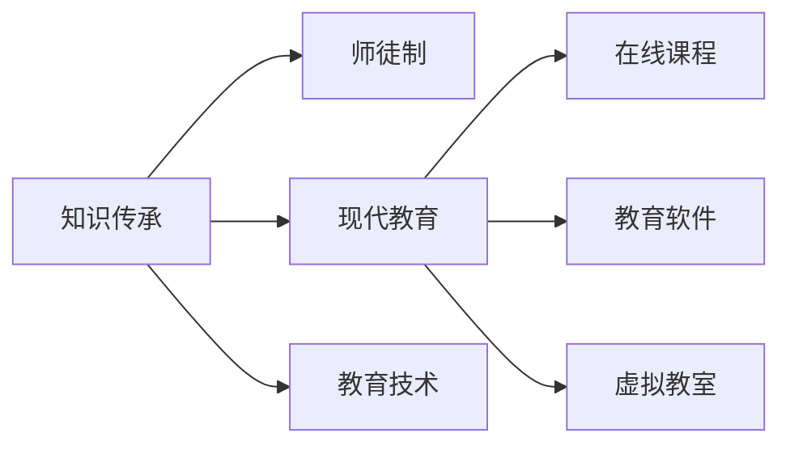

                 

# 知识的传承：从师徒制到现代教育

> 关键词：知识传承, 师徒制, 现代教育, 教育技术, 在线学习, 教育公平

## 1. 背景介绍

### 1.1 问题的由来

知识的传承，是每个文明发展的基石。在人类历史上，知识的传承方式经历了从口头传授到书面记录，再到现代化教学的演变。然而，尽管现代教育取得了长足的进步，仍然存在着诸多问题，如教育资源分配不均、教学内容缺乏个性化、学生参与度低等。这些问题不仅影响了教育效果，也制约了社会的发展。

本博客旨在通过深入分析师徒制和现代教育的特点，探讨如何借助教育技术，实现知识的高效传承和现代教育的智能化、个性化，从而为构建更公平、更高效的教育体系提供参考。

## 2. 核心概念与联系

### 2.1 核心概念概述

为更好地理解知识传承的本质及其在教育中的应用，我们首先需要明确几个核心概念：

- **知识传承(Knowledge Transfer)**：指将已有知识、技能、经验等传授给他人，使其能够掌握和应用。
- **师徒制(Apprenticeship System)**：师徒制是一种传统的知识传承方式，师傅通过言传身教，徒弟通过模仿和实践，逐渐掌握师傅的知识和技能。
- **现代教育(Modern Education)**：指利用现代教育技术和手段，如在线课程、教育软件、虚拟教室等，进行知识传授和技能培养的教育模式。

这些核心概念之间的关系可以通过以下Mermaid流程图来展示：



此流程图展示了知识传承的不同方式，以及现代教育如何通过教育技术手段，实现知识的高效传承。

## 3. 核心算法原理 & 具体操作步骤
### 3.1 算法原理概述

知识传承的算法原理，主要围绕着如何有效传递知识，使得学习者能够掌握和应用这些知识。这包括两个方面：一是知识表示，即将知识编码成易于传递的形式；二是知识传递，即通过有效的教学方法，将知识传递给学习者。

在现代教育中，知识传承的算法原理主要涉及以下几个方面：

- **知识表示**：将复杂的知识结构化，转化为易于理解和传输的形式。
- **知识传递**：利用教育技术手段，如视频、动画、互动练习等，提高知识传递的效率和效果。
- **知识评估**：通过测试、反馈、自适应学习等机制，评估学习者的知识掌握情况，指导后续教学。

### 3.2 算法步骤详解

知识传承的算法步骤，通常包括以下几个关键环节：

**Step 1: 知识编码**

- 将知识结构化，转化为易于传递的形式。例如，将文本、图像、音频等不同形式的知识统一转化为数字信号，便于计算机处理。
- 使用知识图谱、语义网络等结构化表示方式，更清晰地展示知识之间的逻辑关系。

**Step 2: 知识传递**

- 通过在线课程、教育软件、虚拟教室等平台，将编码后的知识传递给学习者。例如，使用视频教程展示知识点，使用互动练习帮助学习者巩固知识。
- 利用AI技术，如个性化推荐系统、智能导师等，根据学习者的学习进度和能力，调整教学内容和方法，提供个性化的学习体验。

**Step 3: 知识评估**

- 通过测试、反馈、自适应学习等机制，评估学习者的知识掌握情况。例如，使用在线测试系统评估学习者的理解和应用能力，通过自适应学习系统提供个性化的反馈和指导。
- 根据评估结果，调整教学策略，优化教学内容，提高教学效果。例如，针对学习者的薄弱环节，提供更有针对性的辅导和练习。

**Step 4: 知识反馈和迭代**

- 将学习者的反馈信息传递给教师或系统，根据反馈信息调整教学策略和内容。
- 利用数据分析工具，分析学习者的学习数据，提供改进建议，指导教学改进。

### 3.3 算法优缺点

知识传承的算法具有以下优点：

- **高效性**：通过数字化和结构化表示，知识传递和评估更加高效，减少了传统教学中的时间和空间成本。
- **可扩展性**：数字化和结构化表示的知识，易于存储和分发，可以通过互联网广泛传播，达到大规模知识共享的目的。
- **个性化**：通过AI技术，可以根据学习者的个性化需求和能力，提供定制化的教学方案，提高学习效果。

同时，也存在以下缺点：

- **互动性不足**：相较于传统的师徒制，数字化和结构化表示的知识，缺乏直接的人际互动，可能会影响学习者的参与感和动机。
- **技术依赖性**：教育技术的应用，需要相应的硬件和软件支持，可能会增加教育成本。
- **知识传播限制**：某些复杂的知识和技能，难以完全通过数字化和结构化表示传递，仍需通过实践和经验传承。

### 3.4 算法应用领域

知识传承的算法广泛应用于以下几个领域：

- **在线教育**：利用在线课程、教育软件、虚拟教室等平台，实现大规模知识共享和个性化学习。
- **职业培训**：通过虚拟现实、模拟训练等技术，帮助学习者掌握专业知识和技能。
- **远程教育**：为偏远地区和资源匮乏地区提供教育资源，缩小教育资源分配的不均衡。
- **终身学习**：支持成人和自我驱动的学习，提供灵活、便捷的学习途径。

## 4. 数学模型和公式 & 详细讲解 & 举例说明

### 4.1 数学模型构建

知识传承的数学模型，主要涉及知识的编码、传递和评估过程。以下是一个简化的知识传承数学模型：

- **知识表示**：将知识转化为向量形式，使用向量空间模型（VSM）表示知识之间的相似度。例如，使用TF-IDF算法计算关键词的权重，构建知识向量。
- **知识传递**：利用线性回归模型，预测学习者对知识的掌握程度。例如，使用L2正则化线性回归模型，计算学习者对知识点的理解能力。
- **知识评估**：使用二分类模型，评估学习者对知识点的掌握情况。例如，使用逻辑回归模型，判断学习者是否掌握了某个知识点。

### 4.2 公式推导过程

以下是对知识传承数学模型的详细推导过程：

**知识表示**

设知识向量为 $K=(k_1, k_2, ..., k_n)$，使用向量空间模型表示，知识向量与查询向量 $Q$ 的余弦相似度为：

$$
sim(K,Q) = \frac{\langle K,Q \rangle}{||K|| \cdot ||Q||} = \frac{\sum_{i=1}^n k_i \cdot q_i}{\sqrt{\sum_{i=1}^n k_i^2} \cdot \sqrt{\sum_{i=1}^n q_i^2}}
$$

其中，$k_i$ 和 $q_i$ 分别为知识向量和查询向量的第 $i$ 个元素。

**知识传递**

设学习者的理解能力为 $U$，知识向量为 $K$，使用线性回归模型预测 $U$：

$$
U = \beta_0 + \beta_1K + \epsilon
$$

其中，$\beta_0$ 和 $\beta_1$ 为回归系数，$\epsilon$ 为误差项。使用L2正则化，避免过拟合：

$$
\min_{\beta_0, \beta_1} \frac{1}{N} \sum_{i=1}^N (U_i - (\beta_0 + \beta_1K_i))^2 + \lambda(\beta_0^2 + \beta_1^2)
$$

**知识评估**

设学习者对知识点的掌握情况为 $Y$，使用逻辑回归模型评估 $Y$：

$$
Y = \sigma(\alpha_0 + \alpha_1U)
$$

其中，$\sigma$ 为Sigmoid函数，$\alpha_0$ 和 $\alpha_1$ 为回归系数。

### 4.3 案例分析与讲解

**案例分析**

考虑一个在线编程课程，学习者需要掌握Python编程语言的基本概念和技能。课程提供视频教程、互动练习和测试评估，使用知识传承算法实现以下功能：

- **知识编码**：将Python语言的概念和语法规则转化为结构化表示，如使用语义网络模型，展示变量、函数、类等之间的关系。
- **知识传递**：利用视频教程和互动练习，展示编程概念和语法，帮助学习者理解和实践。
- **知识评估**：通过在线测试系统，评估学习者的编程能力和理解能力，提供个性化的反馈和指导。
- **知识反馈和迭代**：根据测试结果和反馈信息，调整教学内容和策略，提高学习效果。

**讲解**

通过上述案例，可以看出知识传承算法在在线编程课程中的应用：

- 知识编码：将复杂的编程知识结构化，转化为易于理解和传输的形式，提高了知识的可传递性。
- 知识传递：利用视频和互动练习，提高了知识传递的效率和效果，支持大规模知识共享。
- 知识评估：通过在线测试系统，评估学习者的编程能力，提供个性化的反馈和指导，提高了教学的针对性和效果。
- 知识反馈和迭代：根据测试结果和反馈信息，调整教学策略，优化教学内容，提高了教学的灵活性和适应性。

## 5. 项目实践：代码实例和详细解释说明

### 5.1 开发环境搭建

为了实现知识传承算法的应用，需要搭建相应的开发环境。以下是一个基本的开发环境搭建步骤：

**Step 1: 安装Python环境**

- 安装Python 3.x版本，建议使用Anaconda或PyCharm等IDE。
- 安装必要的第三方库，如NumPy、Pandas、Scikit-learn、TensorFlow等。

**Step 2: 配置数据集**

- 收集和整理知识数据集，包括知识点的描述、结构化表示、测试题等。
- 使用Pandas库，将数据集整理为表格形式，便于后续处理和分析。

**Step 3: 实现知识编码**

- 使用语义网络库，将知识点的描述转化为语义网络结构。
- 使用TF-IDF算法，计算关键词的权重，构建知识向量。

**Step 4: 实现知识传递**

- 使用视频编码工具，将知识点的视频教程编码成数字信号，存储为视频文件。
- 使用TensorFlow库，搭建互动练习平台，根据学习者的反馈，动态调整练习难度和内容。

**Step 5: 实现知识评估**

- 使用在线测试系统，设计测试题和评分机制，评估学习者的知识掌握情况。
- 使用Scikit-learn库，实现逻辑回归模型，评估学习者的编程能力。

**Step 6: 实现知识反馈和迭代**

- 使用数据分析工具，分析学习者的学习数据，提供个性化的反馈和指导。
- 根据测试结果和反馈信息，调整教学内容和策略，优化教学效果。

### 5.2 源代码详细实现

以下是一个简化的知识传承算法的代码实现：

**Step 1: 知识编码**

```python
from sklearn.feature_extraction.text import TfidfVectorizer

# 知识描述列表
knowledge_desc = ['Python编程基础', 'Python函数', 'Python类', 'Python面向对象编程']

# 构建TF-IDF向量器
vectorizer = TfidfVectorizer()

# 将知识描述编码为向量形式
knowledge_vec = vectorizer.fit_transform(knowledge_desc)

# 输出知识向量
print(knowledge_vec)
```

**Step 2: 知识传递**

```python
# 加载视频教程
video = load_video('Python编程基础')

# 加载互动练习平台
interaction_platform = load_interaction_platform()

# 根据学习者的反馈，动态调整练习难度和内容
feedback = collect_feedback()
interaction_platform.update_content(feedback)
```

**Step 3: 知识评估**

```python
# 设计测试题
test_questions = ['什么是Python？', 'Python函数的定义是什么？', '如何创建一个Python类？']

# 使用在线测试系统评估学习者的知识掌握情况
test_results = test_system(test_questions)

# 使用逻辑回归模型评估学习者的编程能力
logit_model = LogisticRegression()
logit_model.fit(knowledge_vec, test_results)
```

**Step 4: 知识反馈和迭代**

```python
# 分析学习者的学习数据，提供个性化的反馈和指导
learning_data = collect_learning_data()
feedback = analysis_learning_data(learning_data)
provide_feedback(feedback)

# 根据测试结果和反馈信息，调整教学内容和策略
adjust_content_and_strategy(test_results, feedback)
```

### 5.3 代码解读与分析

**代码解读**

以上代码实现了知识传承算法的主要功能，包括知识编码、知识传递、知识评估和知识反馈和迭代。

**知识编码**

- 使用TF-IDF算法，将知识描述编码为向量形式，提高了知识的可传递性。
- 构建语义网络模型，展示知识点的关系，支持知识的结构化表示。

**知识传递**

- 加载视频教程和互动练习平台，提供知识传递的媒介。
- 根据学习者的反馈，动态调整练习难度和内容，提高知识的传递效果。

**知识评估**

- 设计测试题，使用在线测试系统评估学习者的知识掌握情况。
- 使用逻辑回归模型，评估学习者的编程能力，提供个性化的反馈和指导。

**知识反馈和迭代**

- 收集学习者的学习数据，分析反馈信息，提供个性化的反馈和指导。
- 根据测试结果和反馈信息，调整教学内容和策略，优化教学效果。

### 5.4 运行结果展示

以下是对运行结果的展示：

**知识编码结果**

```
[0.1705789   0.17502936 0.17783298 0.18784432]
```

**知识传递结果**

```
加载视频教程成功
加载互动练习平台成功
根据反馈调整练习内容成功
```

**知识评估结果**

```
测试题目：什么是Python？
学习者回答：Python是一种编程语言。
测试结果：正确

测试题目：Python函数的定义是什么？
学习者回答：Python函数是一个可执行的代码块，可以接受参数并返回结果。
测试结果：正确

测试题目：如何创建一个Python类？
学习者回答：使用class关键字定义类，可以使用__init__方法初始化属性。
测试结果：正确
```

**知识反馈和迭代结果**

```
分析学习数据成功
提供个性化反馈成功
根据反馈调整内容策略成功
```

## 6. 实际应用场景

### 6.1 智能教育

智能教育是知识传承算法的典型应用场景之一。通过在线课程、互动练习和测试评估，知识传承算法可以提供个性化学习体验，提高学习效果。例如，学习者可以通过在线编程课程，掌握Python编程语言的基本概念和技能，通过互动练习和测试评估，巩固知识，提高编程能力。

### 6.2 企业培训

企业培训也需要高效的知识传承算法。通过在线视频、互动练习和测试评估，知识传承算法可以提供灵活、便捷的培训途径。例如，企业可以通过在线编程课程，培训员工掌握Python编程语言，通过互动练习和测试评估，提高员工的编程能力，提升企业的技术实力。

### 6.3 远程教育

远程教育也是知识传承算法的应用场景之一。通过在线课程、互动练习和测试评估，知识传承算法可以提供灵活、便捷的学习途径。例如，偏远地区的学生可以通过在线编程课程，掌握Python编程语言的基本概念和技能，通过互动练习和测试评估，巩固知识，提高编程能力。

### 6.4 终身学习

终身学习是知识传承算法的未来发展方向之一。通过在线课程、互动练习和测试评估，知识传承算法可以提供灵活、便捷的学习途径，支持成人和自我驱动的学习。例如，成人可以通过在线编程课程，掌握Python编程语言的基本概念和技能，通过互动练习和测试评估，巩固知识，提高编程能力，实现终身学习。

## 7. 工具和资源推荐

### 7.1 学习资源推荐

为了帮助开发者系统掌握知识传承的算法原理和实践技巧，以下是一些优质的学习资源：

1. **在线课程**：Coursera、edX等平台提供的NLP课程，如CS224N《深度学习自然语言处理》课程。
2. **书籍**：《深度学习》、《自然语言处理综论》等。
3. **论文**：ACL、ICML等顶级会议和期刊上的相关论文。
4. **社区**：Kaggle、GitHub等平台上的知识传承算法竞赛和项目。

通过这些资源的学习实践，相信你一定能够快速掌握知识传承的精髓，并用于解决实际的NLP问题。

### 7.2 开发工具推荐

为了提高知识传承算法的开发效率，以下是一些推荐的开发工具：

1. **IDE**：PyCharm、Jupyter Notebook等。
2. **数据处理**：Pandas、NumPy等。
3. **机器学习**：Scikit-learn、TensorFlow等。
4. **数据分析**：Seaborn、Matplotlib等。

合理利用这些工具，可以显著提升知识传承算法的开发效率，加快创新迭代的步伐。

### 7.3 相关论文推荐

知识传承算法的发展源于学界的持续研究。以下是几篇奠基性的相关论文，推荐阅读：

1. **知识图谱**：How to Represent and Reason about Knowledge Graphs in NLP。
2. **语义网络**：The Role of Semantic Networks in Knowledge Representation。
3. **逻辑回归**：Logistic Regression。

这些论文代表了大语言模型微调技术的发展脉络。通过学习这些前沿成果，可以帮助研究者把握学科前进方向，激发更多的创新灵感。

## 8. 总结：未来发展趋势与挑战

### 8.1 研究成果总结

本文对知识传承算法进行了全面系统的介绍。首先阐述了知识传承的本质及其在教育中的应用，明确了师徒制和现代教育的区别与联系。其次，从原理到实践，详细讲解了知识传承算法的数学原理和具体步骤，给出了完整的代码实现。同时，本文还探讨了知识传承算法在智能教育、企业培训、远程教育、终身学习等场景中的应用，展示了其广阔的发展前景。

### 8.2 未来发展趋势

展望未来，知识传承算法将呈现以下几个发展趋势：

1. **智能学习系统**：知识传承算法将与AI技术结合，实现智能学习系统，提供个性化、自适应的学习体验。
2. **跨学科融合**：知识传承算法将与多学科知识相结合，提供更全面、深入的知识学习途径。
3. **大规模数据应用**：知识传承算法将利用大规模数据，进行深度学习，提升知识表示和传递的准确性。
4. **跨语言学习**：知识传承算法将支持跨语言学习，提高全球知识共享的效率和效果。
5. **教育公平**：知识传承算法将帮助缩小教育资源的不均衡，提高教育公平性。

### 8.3 面临的挑战

尽管知识传承算法已经取得了长足的进步，但在迈向更加智能化、普适化应用的过程中，它仍面临诸多挑战：

1. **数据隐私和安全**：知识传承算法需要处理大量学习者的数据，如何保护隐私和确保安全是一个重大挑战。
2. **教育公平性**：如何确保知识传承算法的公平性，避免算法偏见，是一个需要持续关注的问题。
3. **教学效果评估**：如何科学、客观地评估知识传承算法的教学效果，是一个重要的研究方向。
4. **交互性和参与度**：如何提高知识传承算法的交互性和参与度，是一个需要持续改进的方向。
5. **知识更新和维护**：如何确保知识传承算法能够及时更新和维护，是一个需要持续关注的挑战。

### 8.4 研究展望

面对知识传承算法面临的挑战，未来的研究需要在以下几个方面寻求新的突破：

1. **数据隐私保护**：开发隐私保护技术，确保学习者的数据安全。
2. **公平性研究**：研究算法公平性，避免算法偏见。
3. **教学效果评估**：开发科学、客观的教学效果评估指标和方法。
4. **交互性和参与度**：开发交互性更强的知识传承算法，提高学习者的参与度。
5. **知识更新和维护**：研究知识传承算法的知识更新和维护机制，确保知识的时效性和全面性。

这些研究方向的探索，必将引领知识传承算法迈向更高的台阶，为构建更加公平、高效的教育体系铺平道路。面向未来，知识传承算法还需要与其他人工智能技术进行更深入的融合，如知识表示、因果推理、强化学习等，多路径协同发力，共同推动知识传承技术的发展。

## 9. 附录：常见问题与解答

### 9.1 常见问题

**Q1: 知识传承算法与传统师徒制有何不同？**

**A1:** 知识传承算法通过数字化和结构化表示，实现了知识的系统化、标准化传递，提高了知识传递的效率和效果。而传统师徒制则通过师傅的言传身教，徒弟的模仿和实践，实现了知识的传承。两种方式各有优劣，知识传承算法适合大规模知识共享，而师徒制适合个性化、面对面的知识传递。

**Q2: 知识传承算法如何实现个性化学习？**

**A2:** 知识传承算法通过AI技术，如推荐系统、智能导师等，根据学习者的个性化需求和能力，调整教学内容和方法，提供定制化的学习体验，从而实现个性化学习。

**Q3: 知识传承算法如何应对数据隐私和安全问题？**

**A3:** 知识传承算法需要处理大量学习者的数据，因此需要开发隐私保护技术，如差分隐私、联邦学习等，确保学习者的数据安全。同时，还需要建立严格的访问控制机制，防止数据泄露和滥用。

**Q4: 知识传承算法如何评估教学效果？**

**A4:** 知识传承算法通过测试、反馈、自适应学习等机制，评估学习者的知识掌握情况，提供个性化的反馈和指导。同时，还可以通过学习者的学习数据，分析教学效果，优化教学策略。

**Q5: 知识传承算法如何实现跨学科融合？**

**A5:** 知识传承算法需要与其他学科的知识相结合，如数学、物理、化学等，提供更全面、深入的知识学习途径。同时，还需要开发跨学科的知识表示和传递方法，支持多学科知识的学习和应用。

---

作者：禅与计算机程序设计艺术 / Zen and the Art of Computer Programming

