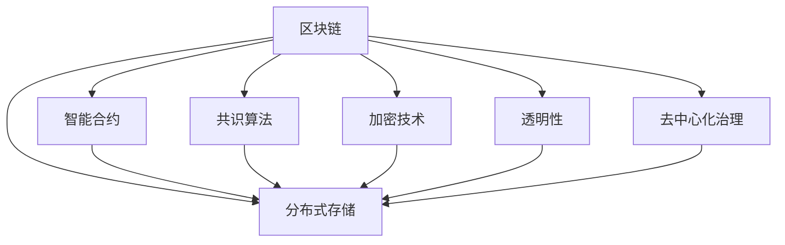

                 

# 知识的分布式存储：区块链技术的潜力

> 关键词：区块链,分布式存储,知识管理,透明性,去中心化,加密技术,智能合约

## 1. 背景介绍

### 1.1 问题由来
随着互联网的普及和信息技术的飞速发展，人类社会正进入一个以数据为中心的时代。庞大的数据量带来了存储和处理的挑战，传统的集中式存储模式显得愈发局限和脆弱。如何在保证数据安全、高效、可靠的前提下，实现知识的高效存储和共享，成为了一个亟需解决的重大问题。

区块链技术的出现，为这一问题提供了全新的解决方案。通过区块链，可以构建一种去中心化、透明、可追溯的知识存储体系，确保数据的真实性和不可篡改性，为知识的分布式管理和共享提供了可能性。本文将系统探讨区块链技术在知识管理中的应用潜力，为行业提供决策参考。

### 1.2 问题核心关键点
区块链技术的核心在于其分布式存储和去中心化机制。它通过一种特殊的区块链数据结构，记录并验证数据的真实性，并通过共识算法维护网络的透明性和安全性。这使得区块链在知识管理中的应用具备以下几个关键优势：

1. **去中心化**：区块链中的每个节点都拥有完整的账本副本，数据存储不再依赖于单点故障，保证了系统的可靠性和稳定性。

2. **透明性**：所有交易都被公开记录在区块链上，任何人都可查询，保证了数据的透明和公正。

3. **不可篡改性**：一旦数据被写入区块链，即成为全网共识，难以篡改，确保了数据的安全性和真实性。

4. **智能合约**：通过智能合约，可以自动执行预设条件下的数据读写操作，大大提高了知识管理的自动化和智能化水平。

5. **加密技术**：区块链采用先进的加密算法，确保数据在传输和存储过程中的安全，防止信息泄露和数据盗用。

6. **去中心化治理**：区块链通过共识机制实现治理，避免中心化机构滥用权力，确保系统的公平和公正。

## 2. 核心概念与联系

### 2.1 核心概念概述

为更好地理解区块链技术在知识管理中的应用，本节将介绍几个核心概念：

- **区块链(Blockchain)**：一种去中心化的分布式账本技术，通过连续的区块记录交易信息，确保数据不可篡改和透明性。
- **分布式存储(Distributed Storage)**：数据不再集中存储于单一地点，而是通过网络中多个节点共同存储和同步，提高了数据的安全性和可靠性。
- **智能合约(Smart Contract)**：一种自动执行合约条款的计算机程序，通过区块链部署和运行，实现数据管理的自动化和智能化。
- **共识算法(Consensus Algorithm)**：用于维护区块链网络一致性的算法，确保网络中的每个节点都达成一致意见，避免单点故障。
- **加密技术(Cryptography)**：用于保护数据安全和隐私的技术，包括公钥加密、哈希算法等。
- **透明性(Transparency)**：区块链中的所有交易记录公开可查，保证了数据和操作的透明性。
- **去中心化治理(Decentralized Governance)**：通过区块链的共识机制，实现去中心化的决策和治理，避免权力集中带来的风险。

这些概念之间的逻辑关系可以通过以下Mermaid流程图来展示：



这个流程图展示了一体化的区块链技术框架，各个模块相互作用，共同实现知识管理的分布式存储和透明性。

## 3. 核心算法原理 & 具体操作步骤
### 3.1 算法原理概述

基于区块链技术的知识管理方案，其核心算法原理可以概述如下：

1. **数据上链**：将知识内容封装成交易数据，通过加密技术处理，然后提交到区块链网络进行记录。

2. **分布式存储**：每个节点存储区块链上的数据副本，通过共识算法确保所有节点数据的一致性和完整性。

3. **智能合约**：使用智能合约定义数据读写规则，自动化执行数据管理的各项操作。

4. **共识算法**：采用共识算法，如PoW、PoS、DPoS等，确保网络中的每个节点都达成一致意见，避免单点故障。

5. **透明性和去中心化治理**：通过区块链的透明性和去中心化治理机制，实现数据的透明管理和公平决策。

### 3.2 算法步骤详解

以下步骤详细介绍了基于区块链技术的知识管理方案的具体实施过程：

1. **数据上链**：
   - 准备知识内容，如文档、图片、视频等。
   - 使用加密技术对数据进行封装和处理，确保数据安全。
   - 将数据提交到区块链网络，形成交易记录。

2. **分布式存储**：
   - 将交易记录广播至区块链网络。
   - 各节点接收交易记录后，通过共识算法验证数据的真实性和完整性。
   - 验证通过后，各节点存储交易记录的副本，实现分布式存储。

3. **智能合约执行**：
   - 定义智能合约，指定数据的读写规则和操作流程。
   - 将智能合约部署到区块链上。
   - 当满足预设条件时，智能合约自动执行数据读写操作。

4. **共识算法维护**：
   - 采用共识算法，如PoW、PoS、DPoS等，确保网络中各节点达成一致意见。
   - 通过共识算法处理交易请求，避免单点故障和恶意操作。

5. **透明性和去中心化治理**：
   - 区块链的透明性保证了所有交易记录公开可查，确保数据的透明性和公正性。
   - 去中心化治理机制确保了数据管理的公平性和去中心化决策，避免权力集中带来的风险。

### 3.3 算法优缺点

基于区块链技术的知识管理方案具有以下优点：

1. **去中心化和分布式**：避免了单点故障，提高了系统的可靠性和稳定性。
2. **透明和公正**：所有数据和操作公开可查，保证了数据的透明性和公正性。
3. **安全性和不可篡改性**：采用先进的加密技术和共识算法，确保数据的安全性和不可篡改性。
4. **自动化和智能化**：智能合约的引入，大大提高了知识管理的自动化和智能化水平。
5. **去中心化治理**：避免权力集中带来的风险，实现公平和公正的数据管理。

同时，该方案也存在一些局限性：

1. **计算资源消耗大**：共识算法的运行需要大量的计算资源，导致网络能耗较高。
2. **扩展性差**：随着节点数量的增加，区块链的扩展性和性能会受到影响。
3. **延迟较高**：由于共识算法的复杂性，区块链的交易处理速度较慢，可能影响实时性要求较高的场景。
4. **智能合约依赖编程能力**：智能合约的编写和部署需要一定的编程能力，增加了使用的门槛。

尽管存在这些局限性，但区块链技术在知识管理中的应用潜力巨大，正逐步在多个领域得到应用。

### 3.4 算法应用领域

基于区块链技术的知识管理方案，已经在以下几个领域得到了初步应用：

1. **学术研究和知识共享**：通过区块链存储学术论文和研究成果，实现数据的透明共享和可追溯性，避免学术不端行为。
2. **政府和企业信息管理**：将政府和企业的重要数据记录在区块链上，确保数据的真实性和完整性，实现透明和可追溯的管理。
3. **供应链管理**：通过区块链记录供应链中的每一个环节，确保数据的透明和可追溯性，提高供应链的透明度和可信度。
4. **版权保护和数字知识产权管理**：使用区块链存储版权信息和交易记录，实现版权的透明和不可篡改，保护数字知识产权。
5. **医疗健康数据管理**：通过区块链存储医疗健康数据，确保数据的真实性和隐私性，实现数据的透明和可追溯性。

这些应用场景充分展示了区块链技术在知识管理中的巨大潜力。随着技术的发展和应用经验的积累，未来区块链技术将在更多领域得到应用，进一步推动知识管理的现代化和智能化。

## 4. 数学模型和公式 & 详细讲解 & 举例说明

### 4.1 数学模型构建

在知识管理中，区块链技术的核心在于其分布式存储和去中心化机制。以下我们将基于数学语言对这一机制进行详细阐述。

假设存在一个区块链网络，由 $N$ 个节点组成，每个节点存储了区块链上的所有交易记录。设 $D$ 表示一个交易的原始数据，$E(D)$ 表示对 $D$ 的加密处理，$S(D)$ 表示将加密数据 $E(D)$ 封装成交易数据，$P(D)$ 表示对交易数据 $S(D)$ 进行签名处理，$B$ 表示区块链上的交易记录。

在区块链网络中，每个节点的存储数据可以表示为：

$$
T_i = \{B_{i,j} \mid j=1,...,N\}
$$

其中 $B_{i,j}$ 表示节点 $i$ 在节点 $j$ 上的交易记录。

### 4.2 公式推导过程

以下我们将推导智能合约在区块链中的执行过程，以及共识算法的验证机制。

假设存在一个智能合约 $M$，用于管理某个数据 $D$ 的读写规则。设 $P_M$ 表示智能合约的执行条件，$A_M$ 表示智能合约的执行操作。智能合约的执行过程可以表示为：

$$
\text{if } P_M(D) \text{ then } A_M(D)
$$

其中 $P_M(D)$ 表示智能合约的执行条件，$A_M(D)$ 表示智能合约的执行操作。

在共识算法的验证过程中，假设采用PoW算法，每个节点的验证过程可以表示为：

1. 接收交易数据 $S(D)$。
2. 解密得到原始数据 $D$。
3. 验证智能合约执行条件 $P_M(D)$。
4. 若条件满足，执行智能合约操作 $A_M(D)$。
5. 将执行结果记录在区块链上。

以上过程可以表示为：

$$
V_i(D) = \text{if } P_M(D) \text{ then } A_M(D)
$$

### 4.3 案例分析与讲解

假设某公司需要管理其员工的办公文档，希望通过区块链实现文档的透明共享和权限控制。具体实施步骤如下：

1. **数据上链**：
   - 准备员工的办公文档 $D$，使用公钥加密技术处理文档，生成加密数据 $E(D)$。
   - 将加密数据封装成交易数据 $S(D)$，并添加权限信息，形成交易记录 $B$。

2. **分布式存储**：
   - 将交易记录 $B$ 广播至区块链网络，各节点接收并验证交易记录。
   - 验证通过后，各节点存储交易记录的副本，实现分布式存储。

3. **智能合约执行**：
   - 定义智能合约 $M$，用于控制文档的读写权限。
   - 将智能合约 $M$ 部署到区块链上。
   - 当员工提出阅读文档的请求时，智能合约自动验证其权限，并控制文档的访问。

4. **共识算法维护**：
   - 采用PoW算法，确保网络中各节点达成一致意见，处理交易请求。

通过这一案例，可以看到，基于区块链的知识管理方案，可以确保数据的透明性、安全性，并实现权限控制的自动化和智能化。

## 5. 项目实践：代码实例和详细解释说明
### 5.1 开发环境搭建

在进行区块链知识管理项目开发前，我们需要准备好开发环境。以下是使用Python和Hyperledger Fabric进行区块链开发的环境配置流程：

1. 安装Hyperledger Fabric：从官网下载并安装Hyperledger Fabric。

2. 创建和参与区块链网络：
```bash
fabric-ca -s
fabric-ca-client -s -r /path/to/user/private.key
fabric-ca-client register -u http://localhost:7054 -r /path/to/user/user.json -p /path/to/user/private.key -n -m user
fabric-ca-client enroll -u http://localhost:7054 -p /path/to/user/private.key -u /path/to/user/user.json -r /path/to/user
```

3. 初始化区块链网络：
```bash
fabric-ca-client enroll -u http://localhost:7054 -p /path/to/user/private.key -u /path/to/user/user.json -r /path/to/user -c
```

4. 部署智能合约：
```bash
fabric-ca-client enroll -u http://localhost:7054 -p /path/to/user/private.key -u /path/to/user/user.json -r /path/to/user
```

完成上述步骤后，即可在本地搭建一个基于Hyperledger Fabric的区块链网络，开始区块链知识管理项目的开发。

### 5.2 源代码详细实现

这里以智能合约管理文档为例，给出使用Python和Hyperledger Fabric进行区块链开发的代码实现。

首先，定义智能合约的API接口：

```python
from hyperledger.fabric.python.framework import SmartContract

class DocContract(SmartContract):
    def __init__(self, stub):
        SmartContract.__init__(self, stub)

    def readDoc(self, docID):
        trans = self.stub.get_function('ReadDoc')
        return trans.JSONToBytes(stub.get_state(docID))

    def writeDoc(self, docID, docJSON):
        trans = self.stub.get_function('WriteDoc')
        trans.add_argument(docID)
        trans.add_argument(docJSON)
        trans.execute(stub)
```

然后，定义区块链网络的节点和用户：

```python
from hyperledger.fabric.python import Gateway
from hyperledger.fabric.python.sdk.protos.channel import Channel
from hyperledger.fabric.python.sdk.protos.transaction import Transaction
from hyperledger.fabric.python.sdk.protos.query import Query
from hyperledger.fabric.python.sdk.protos.service import Service
from hyperledger.fabric.python.sdk.protos.secure import SecurityLevel

gateway = Gateway('localhost', 7051)
channel = gateway.get_channel('mychannel')

org1 = channel.get_org('org1')
org1User = channel.get_user(org1.get('name'), org1.get('peer'))
peer = org1User.get('peer')

# 创建智能合约实例
contract = gateway.new_smart_contract('org1', 'chaincode1', '1.0', 'example')
contract.set_instance('mycc', contract.get_instance())

# 执行智能合约
result = contract.execute('WriteDoc', 'doc1', 'This is a document')
```

最后，部署智能合约并在区块链上存储文档：

```python
from hyperledger.fabric.python import Gateway
from hyperledger.fabric.python.sdk.protos.channel import Channel
from hyperledger.fabric.python.sdk.protos.transaction import Transaction
from hyperledger.fabric.python.sdk.protos.query import Query
from hyperledger.fabric.python.sdk.protos.service import Service
from hyperledger.fabric.python.sdk.protos.secure import SecurityLevel

gateway = Gateway('localhost', 7051)
channel = gateway.get_channel('mychannel')

org1 = channel.get_org('org1')
org1User = channel.get_user(org1.get('name'), org1.get('peer'))
peer = org1User.get('peer')

# 创建智能合约实例
contract = gateway.new_smart_contract('org1', 'chaincode1', '1.0', 'example')
contract.set_instance('mycc', contract.get_instance())

# 执行智能合约
result = contract.execute('WriteDoc', 'doc1', 'This is a document')
```

以上就是使用Hyperledger Fabric进行区块链知识管理项目开发的完整代码实现。可以看到，通过Python和Hyperledger Fabric的结合，可以便捷地实现区块链智能合约的开发和部署。

### 5.3 代码解读与分析

让我们再详细解读一下关键代码的实现细节：

**DocContract类**：
- `__init__`方法：初始化智能合约对象。
- `readDoc`方法：读取指定文档ID的文档数据。
- `writeDoc`方法：写入指定文档ID的文档数据。

**区块链网络的节点和用户**：
- `Gateway`类：连接区块链网络的接口。
- `Channel`类：区块链网络上的通道。
- `Transaction`类：区块链网络上的事务。
- `Query`类：区块链网络上的查询。
- `Service`类：区块链网络上的服务。
- `SecurityLevel`类：区块链网络上的安全级别。

**智能合约的部署和执行**：
- `Gateway`类的`new_smart_contract`方法：创建智能合约实例。
- `Gateway`类的`execute`方法：执行智能合约的方法。

通过上述代码，可以看到，Hyperledger Fabric提供了简洁易用的API接口，大大降低了区块链智能合约的开发难度。开发者只需要专注于智能合约的业务逻辑，即可方便地实现区块链知识管理项目。

当然，工业级的系统实现还需考虑更多因素，如智能合约的代码优化、事务的批量处理、链码升级等。但核心的区块链知识管理流程基本与此类似。

## 6. 实际应用场景
### 6.1 智能合约管理文档

智能合约管理文档是区块链知识管理项目的典型应用场景之一。通过智能合约，可以对文档的读写进行严格控制，确保数据的透明性和安全性。具体实现步骤包括：

1. **准备文档数据**：将文档数据进行加密处理，生成交易记录。
2. **分布式存储**：将交易记录广播至区块链网络，各节点存储记录。
3. **智能合约执行**：定义智能合约，控制文档的读写权限。
4. **共识算法维护**：确保网络中各节点达成一致意见，处理交易请求。

**6.2 供应链管理**

在供应链管理中，区块链技术可以用于记录和管理供应链中的每一个环节，确保数据的透明性和可追溯性。具体实现步骤包括：

1. **数据上链**：将供应链中的每一个环节记录为交易数据，并进行加密处理。
2. **分布式存储**：将交易记录广播至区块链网络，各节点存储记录。
3. **智能合约执行**：定义智能合约，控制数据的读写权限。
4. **共识算法维护**：确保网络中各节点达成一致意见，处理交易请求。

**6.3 医疗健康数据管理**

在医疗健康数据管理中，区块链技术可以用于存储和管理医疗健康数据，确保数据的透明性和安全性。具体实现步骤包括：

1. **数据上链**：将患者的医疗健康数据记录为交易数据，并进行加密处理。
2. **分布式存储**：将交易记录广播至区块链网络，各节点存储记录。
3. **智能合约执行**：定义智能合约，控制数据的读写权限。
4. **共识算法维护**：确保网络中各节点达成一致意见，处理交易请求。

这些应用场景充分展示了区块链技术在知识管理中的巨大潜力。随着技术的发展和应用经验的积累，未来区块链技术将在更多领域得到应用，进一步推动知识管理的现代化和智能化。

### 6.4 未来应用展望

随着区块链技术的不断发展和完善，其在知识管理中的应用将更加广泛和深入。未来，区块链技术将有以下发展趋势：

1. **跨链互操作**：区块链之间的互操作性将进一步增强，实现跨链数据共享和协同管理。
2. **智能合约自动化**：智能合约的自动化和智能化水平将进一步提高，实现更加复杂和多样的业务逻辑。
3. **去中心化身份认证**：区块链技术将应用于去中心化身份认证，确保数据和操作的安全性和透明性。
4. **边缘计算与区块链结合**：区块链技术与边缘计算结合，实现更快速的数据处理和存储。
5. **多方安全计算**：通过多方安全计算技术，保护数据的隐私性和安全性，实现安全的知识共享和协作。
6. **隐私保护技术**：区块链技术与隐私保护技术结合，确保数据在共享和交换过程中的隐私性。

这些趋势将进一步推动区块链技术在知识管理中的应用，为数据的安全、透明、可靠管理和共享提供新的解决方案。

## 7. 工具和资源推荐
### 7.1 学习资源推荐

为了帮助开发者系统掌握区块链技术在知识管理中的应用，这里推荐一些优质的学习资源：

1. 《区块链技术与应用》系列博文：由区块链专家撰写，深入浅出地介绍了区块链的基本原理和应用场景。

2. 《区块链技术原理与实践》课程：由知名大学开设的区块链课程，全面讲解区块链的原理、应用和开发实践。

3. 《Hyperledger Fabric开发者手册》：Hyperledger Fabric的官方文档，提供了详细的区块链网络搭建和智能合约开发教程。

4. 《区块链开发实战》书籍：涵盖区块链开发的基本知识和实战经验，适合入门和进阶开发者阅读。

5. 《区块链技术入门与实战》课程：介绍区块链技术的基本概念和开发实践，适合初学者入门。

通过对这些资源的学习实践，相信你一定能够快速掌握区块链技术在知识管理中的应用，并用于解决实际的业务问题。

### 7.2 开发工具推荐

高效的开发离不开优秀的工具支持。以下是几款用于区块链知识管理开发的常用工具：

1. Hyperledger Fabric：Hyperledger Fabric是一个开源的区块链平台，提供了丰富的API接口和开发工具。

2. Ethereum：Ethereum是一个开源的区块链平台，支持智能合约的开发和部署。

3. IPFS（InterPlanetary File System）：IPFS是一个去中心化的文件存储系统，可以用于区块链数据的存储和共享。

4. Tendermint：Tendermint是一个高性能的区块链框架，支持各类共识算法和智能合约的开发。

5. Truffle：Truffle是一个基于以太坊的智能合约开发框架，提供开发、测试和部署环境。

6. ConsenSys：ConsenSys是一个区块链开发平台，提供区块链生态系统中的各类工具和资源。

合理利用这些工具，可以显著提升区块链知识管理任务的开发效率，加快创新迭代的步伐。

### 7.3 相关论文推荐

区块链技术的发展得益于学界的持续研究。以下是几篇奠基性的相关论文，推荐阅读：

1. Bitcoin: A Peer-to-Peer Electronic Cash System（比特币白皮书）：介绍比特币的原理和实现，奠定了区块链技术的基础。

2. Smart Contracts: Defined by Blockchain (Not By Law)：介绍智能合约的概念和实现方式，探讨了智能合约的潜力和挑战。

3. Hyperledger Fabric: A Modular Blockchain Framework：介绍Hyperledger Fabric的原理和实现，提供了区块链开发的全面解决方案。

4. Blockchain-Based Decentralized Data Sharing and Collaborative Research in Digital Media Production（基于区块链的数字媒体生产中的去中心化数据共享和协作研究）：探讨了区块链在数字媒体生产中的应用，展示了区块链在数据共享和协作中的潜力。

这些论文代表了大数据区块链技术的发展脉络。通过学习这些前沿成果，可以帮助研究者把握学科前进方向，激发更多的创新灵感。

## 8. 总结：未来发展趋势与挑战
### 8.1 总结

本文对基于区块链技术的知识管理方法进行了全面系统的介绍。首先阐述了区块链技术在知识管理中的应用背景和意义，明确了区块链技术在数据安全、透明性、去中心化等方面的独特优势。其次，从原理到实践，详细讲解了区块链知识管理方案的具体实施过程，包括数据上链、分布式存储、智能合约执行、共识算法维护等关键步骤。同时，本文还广泛探讨了区块链技术在多个行业领域的应用前景，展示了区块链技术在知识管理中的巨大潜力。

通过本文的系统梳理，可以看到，基于区块链的知识管理技术，正逐步成为分布式、透明、安全的知识管理新范式，为数据的可靠存储和共享提供了新的解决方案。未来，随着区块链技术的不断发展和完善，这一技术将在更多领域得到应用，进一步推动知识管理的现代化和智能化。

### 8.2 未来发展趋势

展望未来，区块链技术在知识管理中的应用将呈现以下几个发展趋势：

1. **跨链互操作**：区块链之间的互操作性将进一步增强，实现跨链数据共享和协同管理。
2. **智能合约自动化**：智能合约的自动化和智能化水平将进一步提高，实现更加复杂和多样的业务逻辑。
3. **去中心化身份认证**：区块链技术将应用于去中心化身份认证，确保数据和操作的安全性和透明性。
4. **边缘计算与区块链结合**：区块链技术与边缘计算结合，实现更快速的数据处理和存储。
5. **多方安全计算**：通过多方安全计算技术，保护数据的隐私性和安全性，实现安全的知识共享和协作。
6. **隐私保护技术**：区块链技术与隐私保护技术结合，确保数据在共享和交换过程中的隐私性。

这些趋势将进一步推动区块链技术在知识管理中的应用，为数据的安全、透明、可靠管理和共享提供新的解决方案。

### 8.3 面临的挑战

尽管区块链技术在知识管理中的应用潜力巨大，但在迈向更加智能化、普适化应用的过程中，它仍面临着诸多挑战：

1. **计算资源消耗大**：共识算法的运行需要大量的计算资源，导致网络能耗较高。
2. **扩展性差**：随着节点数量的增加，区块链的扩展性和性能会受到影响。
3. **延迟较高**：由于共识算法的复杂性，区块链的交易处理速度较慢，可能影响实时性要求较高的场景。
4. **智能合约依赖编程能力**：智能合约的编写和部署需要一定的编程能力，增加了使用的门槛。
5. **系统复杂性高**：区块链系统结构复杂，开发和维护难度较大。

尽管存在这些挑战，但区块链技术在知识管理中的应用潜力巨大，正逐步在多个领域得到应用。相信随着技术的发展和应用经验的积累，这些挑战终将一一被克服，区块链技术必将在构建安全、可靠、可解释、可控的智能系统铺平道路。

### 8.4 研究展望

面对区块链技术面临的种种挑战，未来的研究需要在以下几个方面寻求新的突破：

1. **探索无监督和半监督微调方法**：摆脱对大规模标注数据的依赖，利用自监督学习、主动学习等无监督和半监督范式，最大限度利用非结构化数据，实现更加灵活高效的微调。
2. **研究参数高效和计算高效的微调范式**：开发更加参数高效的微调方法，在固定大部分预训练参数的同时，只更新极少量的任务相关参数。同时优化微调模型的计算图，减少前向传播和反向传播的资源消耗，实现更加轻量级、实时性的部署。
3. **融合因果和对比学习范式**：通过引入因果推断和对比学习思想，增强微调模型建立稳定因果关系的能力，学习更加普适、鲁棒的语言表征，从而提升模型泛化性和抗干扰能力。
4. **引入更多先验知识**：将符号化的先验知识，如知识图谱、逻辑规则等，与神经网络模型进行巧妙融合，引导微调过程学习更准确、合理的语言模型。同时加强不同模态数据的整合，实现视觉、语音等多模态信息与文本信息的协同建模。
5. **结合因果分析和博弈论工具**：将因果分析方法引入微调模型，识别出模型决策的关键特征，增强输出解释的因果性和逻辑性。借助博弈论工具刻画人机交互过程，主动探索并规避模型的脆弱点，提高系统稳定性。
6. **纳入伦理道德约束**：在模型训练目标中引入伦理导向的评估指标，过滤和惩罚有偏见、有害的输出倾向。同时加强人工干预和审核，建立模型行为的监管机制，确保输出符合人类价值观和伦理道德。

这些研究方向的探索，必将引领区块链技术迈向更高的台阶，为构建安全、可靠、可解释、可控的智能系统铺平道路。面向未来，区块链技术还需要与其他人工智能技术进行更深入的融合，如知识表示、因果推理、强化学习等，多路径协同发力，共同推动自然语言理解和智能交互系统的进步。只有勇于创新、敢于突破，才能不断拓展区块链技术的边界，让智能技术更好地造福人类社会。

## 9. 附录：常见问题与解答

**Q1：区块链技术是否适用于所有知识管理场景？**

A: 区块链技术在知识管理中的应用主要集中在需要透明性、不可篡改性和去中心化管理的场景，如学术研究、供应链管理、医疗健康数据管理等。但对于一些特定领域的知识管理需求，如金融、法律等，需要结合具体的业务需求和应用场景，灵活应用区块链技术。

**Q2：如何选择合适的共识算法？**

A: 选择合适的共识算法需要考虑系统的性能要求、安全性和扩展性需求。一般来说，PoW算法适合小规模系统，PoS算法适合大规模系统，DPoS算法结合了PoW和PoS的优点，适合中等规模的系统。

**Q3：区块链技术在知识管理中面临的主要挑战是什么？**

A: 区块链技术在知识管理中面临的主要挑战包括计算资源消耗大、扩展性差、延迟较高、智能合约依赖编程能力、系统复杂性高。这些挑战需要通过技术创新和应用优化来解决，如引入共识算法优化、多链协作、去中心化治理等。

**Q4：区块链技术在知识管理中如何实现数据的隐私保护？**

A: 区块链技术可以通过多方安全计算技术、零知识证明等手段，保护数据的隐私性和安全性。同时，在数据上链时，可以对敏感数据进行脱敏处理，保护用户隐私。

**Q5：区块链技术在知识管理中的优势是什么？**

A: 区块链技术在知识管理中的优势在于其去中心化、透明性和不可篡改性，确保了数据的真实性和完整性。同时，智能合约的引入，大大提高了知识管理的自动化和智能化水平，去中心化治理机制则避免了权力集中带来的风险。

通过本文的系统梳理，可以看到，区块链技术在知识管理中的应用潜力巨大，正逐步成为分布式、透明、安全的知识管理新范式，为数据的可靠存储和共享提供了新的解决方案。未来，随着区块链技术的不断发展和完善，这一技术将在更多领域得到应用，进一步推动知识管理的现代化和智能化。

---

作者：禅与计算机程序设计艺术 / Zen and the Art of Computer Programming

